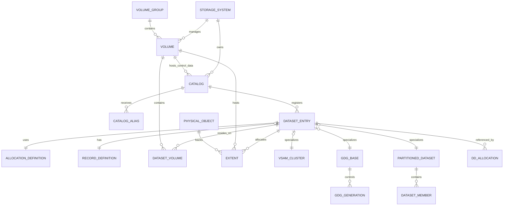

# FileForgeWorkbench Storage and Catalog Data Model

**Document type:** Technical Design Specification  
**Project:** FileForgeWorkbench (FFWB)  
**Subsystem:** Virtual Storage, Dataset and Catalog Management  
**Status:** Proposed Design  
**Version:** 1.0  
**Date:** 2026-09-13

---

## 1. Purpose

This document defines the proposed storage and catalog data model for FileForgeWorkbench (FFWB). The model is intended to emulate the key storage-management concepts of IBM z/OS while remaining portable across Windows, Linux, and other host platforms.

The design provides the foundation for:

- Mainframe-style volume management
- Master and user catalogs
- Catalog aliases
- Dataset name resolution
- Sequential datasets
- Partitioned datasets
- VSAM clusters
- Generation Data Groups
- Temporary and work datasets
- DDNAME allocation
- Extent and capacity tracking
- IDCAMS command emulation
- ISPF dataset-listing functions
- Future DFSMS-style policy management

---

## 2. Design Goals

The storage subsystem shall:

1. Present mainframe dataset names to users instead of host filesystem paths.
2. Separate logical dataset identity from physical storage location.
3. Model volumes as first-class storage containers.
4. support catalogs as metadata repositories that locate datasets on volumes.
5. support datasets that span one or more volumes.
6. preserve mainframe record characteristics such as RECFM, LRECL, and BLKSIZE.
7. support IDCAMS-style operations through defined service interfaces.
8. remain independent of the underlying operating system and filesystem.
9. permit metadata repository replacement without changing the domain model.
10. provide a foundation for VSAM, GDG, SMS, HSM, ISPF, JCL, and utility emulation.

---

## 3. Core Design Principle

Users and higher-level FFWB components should address data by logical dataset name.

Instead of exposing a host path such as:

```text
C:\Projects\Customers.txt
```

FFWB presents:

```text
BANK.PROD.CUSTOMERS
```

The catalog and storage services resolve this logical name to its catalog entry, assigned volume, physical objects, and extents.

Example resolution:

```text
Logical dataset name:
  BANK.PROD.CUSTOMERS

Catalog:
  BANK.PROD.CATALOG

Volume:
  PROD01

Physical object:
  D:\FFWB\Volumes\PROD01\objects\0000000123.dat
```

The physical path is an implementation detail and should not normally be visible to the user.

---

## 4. Conceptual Architecture

```text
FFWB System
│
├─ Storage Manager
│  ├─ Volumes
│  ├─ Volume Groups
│  ├─ Extents
│  ├─ Allocation
│  ├─ Capacity Tracking
│  └─ Mount and Online Status
│
├─ Catalog Manager
│  ├─ Master Catalog
│  ├─ User Catalogs
│  ├─ Aliases
│  ├─ Dataset Entries
│  └─ Name Resolution
│
├─ Dataset Manager
│  ├─ Sequential Datasets
│  ├─ PDS and PDSE Libraries
│  ├─ VSAM Clusters
│  ├─ GDGs
│  ├─ Temporary Datasets
│  └─ Work Files
│
├─ Allocation Manager
│  ├─ DDNAME Mappings
│  ├─ Dispositions
│  ├─ Temporary Allocation
│  └─ Deallocation
│
├─ IDCAMS Interpreter
│  ├─ DEFINE
│  ├─ ALTER
│  ├─ DELETE
│  ├─ LISTCAT
│  ├─ REPRO
│  ├─ IMPORT and EXPORT
│  └─ VERIFY
│
└─ Virtual File System
   ├─ Logical-to-physical translation
   ├─ Record-aware input and output
   ├─ Locking
   └─ Platform abstraction
```

---

## 5. Storage Relationship Model

The primary relationships are:

```text
Master Catalog
  ├─ User Catalog Definitions
  └─ Aliases
       └─ User Catalog
            └─ Dataset Entry
                 ├─ Dataset Definition
                 ├─ Volume Assignment
                 ├─ Extents
                 └─ Physical Objects
```

A volume is the physical storage container. A catalog records where a dataset is located. A dataset entry may refer to one or more volumes, and each volume may hold datasets registered in different catalogs.

Therefore, catalogs should not be modelled as parent directories that physically contain all datasets. The association is metadata-based.

---

## 6. Host Filesystem Layout

A recommended default layout is:

```text
FFWB_HOME/
├─ configuration/
│  ├─ ffwb.toml
│  └─ storage-policies.toml
├─ metadata/
│  ├─ catalog.db
│  └─ backups/
├─ volumes/
│  ├─ PROD01/
│  │  ├─ volume.json
│  │  ├─ objects/
│  │  └─ recovery/
│  ├─ TEST01/
│  │  ├─ volume.json
│  │  ├─ objects/
│  │  └─ recovery/
│  └─ WORK01/
│     ├─ volume.json
│     ├─ objects/
│     └─ recovery/
└─ logs/
```

A volume may also map to a path outside `FFWB_HOME`, for example:

```text
Windows:
  PROD01 -> D:\FFWB\Volumes\PROD01

Linux:
  PROD01 -> /srv/ffwb/volumes/PROD01
```

A volume path could represent a local directory, mounted disk, removable device, network share, or another storage adapter. Host-path access should be mediated by the storage abstraction.

---

## 7. Domain Entities

### 7.1 Storage System

Represents an independent FFWB storage environment.

```rust
struct StorageSystem {
    system_id: Uuid,
    name: String,
    default_master_catalog_id: CatalogId,
    metadata_repository_uri: String,
    created_at: DateTime<Utc>,
    updated_at: DateTime<Utc>,
}
```

### 7.2 Volume

A volume is the FFWB equivalent of a DASD volume.

```rust
struct Volume {
    volume_id: VolumeId,
    volser: String,
    display_name: Option<String>,
    storage_uri: String,
    provider: StorageProvider,
    status: VolumeStatus,
    access_mode: AccessMode,
    total_bytes: u64,
    reserved_bytes: u64,
    used_bytes: u64,
    allocation_unit_bytes: u64,
    volume_group_id: Option<VolumeGroupId>,
    created_at: DateTime<Utc>,
    updated_at: DateTime<Utc>,
}
```

Suggested enumerations:

```rust
enum StorageProvider {
    LocalFilesystem,
    NetworkFilesystem,
    RemovableStorage,
    Memory,
    ObjectStorage,
    Custom(String),
}

enum VolumeStatus {
    Online,
    Offline,
    Mounted,
    Unmounted,
    Recovering,
    Error,
}

enum AccessMode {
    ReadWrite,
    ReadOnly,
}
```

Key constraints:

- `volser` shall be unique within an FFWB storage system.
- A volume shall have one configured storage URI.
- A volume marked offline shall not accept new allocation.
- A read-only volume shall reject write, delete, and reallocation operations.
- Capacity values shall be derived or reconciled through the selected storage provider.

### 7.3 Volume Group

A volume group permits policy-driven allocation across a logical pool.

```rust
struct VolumeGroup {
    volume_group_id: VolumeGroupId,
    name: String,
    description: Option<String>,
    allocation_policy: AllocationPolicy,
    created_at: DateTime<Utc>,
}
```

```rust
enum AllocationPolicy {
    FirstFit,
    BestFit,
    MostFreeSpace,
    RoundRobin,
    ExplicitOnly,
    Custom(String),
}
```

Example volume groups:

```text
PRODUCTION
TEST
WORK
ARCHIVE
FASTSSD
```

### 7.4 Catalog

A catalog stores logical metadata and does not contain the dataset records themselves.

```rust
struct Catalog {
    catalog_id: CatalogId,
    name: String,
    catalog_type: CatalogType,
    control_volume_id: VolumeId,
    parent_catalog_id: Option<CatalogId>,
    status: CatalogStatus,
    owner: Option<String>,
    created_at: DateTime<Utc>,
    updated_at: DateTime<Utc>,
}
```

```rust
enum CatalogType {
    Master,
    User,
}

enum CatalogStatus {
    Active,
    Disconnected,
    Recovering,
    ReadOnly,
}
```

The `control_volume_id` identifies the volume assigned to hold or represent the catalog's control information. The authoritative catalog metadata may remain in the central FFWB repository while the association preserves the mainframe model.

### 7.5 Catalog Connection

Represents the connection of a user catalog to a master catalog.

```rust
struct CatalogConnection {
    connection_id: Uuid,
    master_catalog_id: CatalogId,
    user_catalog_id: CatalogId,
    connected_at: DateTime<Utc>,
    connected_by: String,
}
```

### 7.6 Catalog Alias

An alias routes a high-level qualifier or name prefix to a catalog.

```rust
struct CatalogAlias {
    alias_id: AliasId,
    alias_name: String,
    target_catalog_id: CatalogId,
    created_at: DateTime<Utc>,
}
```

Example:

```text
Alias:
  BANK

Target catalog:
  BANK.PROD.CATALOG
```

Resolution:

```text
BANK.CUSTOMERS
      ↓
Alias BANK
      ↓
BANK.PROD.CATALOG
      ↓
Dataset entry BANK.CUSTOMERS
```

The resolver should select the most specific matching alias when nested or multi-qualifier aliases are supported.

### 7.7 Dataset Entry

A dataset entry is the principal catalog record for a logical dataset.

```rust
struct DatasetEntry {
    dataset_id: DatasetId,
    dataset_name: String,
    catalog_id: CatalogId,
    dataset_type: DatasetType,
    lifecycle_state: DatasetLifecycleState,
    record_definition_id: Option<RecordDefinitionId>,
    allocation_definition_id: AllocationDefinitionId,
    owner: Option<String>,
    created_at: DateTime<Utc>,
    updated_at: DateTime<Utc>,
    expires_at: Option<DateTime<Utc>>,
    referenced_at: Option<DateTime<Utc>>,
    security_label: Option<String>,
    attributes_json: Option<String>,
}
```

```rust
enum DatasetType {
    Sequential,
    Pds,
    Pdse,
    Ksds,
    Esds,
    Rrds,
    Lds,
    GdgBase,
    GdgGeneration,
    Temporary,
    Workfile,
    UnixFile,
}

enum DatasetLifecycleState {
    Allocating,
    Active,
    Migrated,
    Archived,
    PendingDelete,
    Deleted,
    Error,
}
```

Dataset names should be normalized and validated independently of the host filesystem. The physical object name should not need to match the dataset name.

### 7.8 Record Definition

Preserves mainframe record semantics.

```rust
struct RecordDefinition {
    record_definition_id: RecordDefinitionId,
    recfm: RecordFormat,
    logical_record_length: Option<u32>,
    block_size: Option<u32>,
    contains_control_characters: bool,
    encoding: DataEncoding,
}
```

```rust
enum RecordFormat {
    F,
    Fb,
    V,
    Vb,
    Vba,
    U,
}

enum DataEncoding {
    Ebcdic(String),
    Ascii,
    Utf8,
    Binary,
    Custom(String),
}
```

This entity is required for correct behaviour in File-AID-style editing, ISPF browse and edit, SORT, copy utilities, and record-aware imports and exports.

### 7.9 Allocation Definition

Describes requested and effective dataset allocation.

```rust
struct AllocationDefinition {
    allocation_definition_id: AllocationDefinitionId,
    allocation_unit: AllocationUnit,
    primary_quantity: u64,
    secondary_quantity: Option<u64>,
    max_extents: Option<u32>,
    requested_volsers: Vec<String>,
    volume_group_id: Option<VolumeGroupId>,
    data_class: Option<String>,
    storage_class: Option<String>,
    management_class: Option<String>,
    release_unused_space: bool,
}
```

```rust
enum AllocationUnit {
    Bytes,
    Kilobytes,
    Megabytes,
    Records,
    Tracks,
    Cylinders,
}
```

Tracks and cylinders should be represented as emulated allocation units. The provider converts them to host storage quantities using a configurable geometry profile.

### 7.10 Dataset Volume Association

Represents the ordered set of volumes used by a dataset.

```rust
struct DatasetVolume {
    dataset_id: DatasetId,
    volume_id: VolumeId,
    sequence_number: u32,
    is_primary: bool,
}
```

A dataset may be associated with one or more volumes. `sequence_number` preserves allocation order for multivolume datasets.

### 7.11 Extent

An extent records a logical allocation segment on a volume.

```rust
struct Extent {
    extent_id: ExtentId,
    dataset_id: DatasetId,
    volume_id: VolumeId,
    sequence_number: u32,
    start_allocation_unit: u64,
    allocated_units: u64,
    used_bytes: u64,
    physical_object_id: PhysicalObjectId,
    created_at: DateTime<Utc>,
}
```

Example:

```text
BANK.CUSTOMER.FILE
├─ Extent 1 on VOL001
├─ Extent 2 on VOL001
└─ Extent 3 on VOL002
```

The initial implementation may store one physical object per dataset while still recording logical extents. A later provider can map extents to separate objects without changing the catalog-facing interfaces.

### 7.12 Physical Object

Represents the host-level storage object.

```rust
struct PhysicalObject {
    physical_object_id: PhysicalObjectId,
    volume_id: VolumeId,
    relative_path: String,
    object_type: PhysicalObjectType,
    size_bytes: u64,
    checksum: Option<String>,
    created_at: DateTime<Utc>,
    updated_at: DateTime<Utc>,
}
```

```rust
enum PhysicalObjectType {
    DatasetData,
    VsamIndex,
    PdsDirectory,
    Metadata,
    Recovery,
}
```

Recommended object naming:

```text
objects/00/00/0000000123.dat
objects/00/00/0000000124.idx
```

Opaque object names provide these benefits:

- Dataset rename can be metadata-only.
- Host filename restrictions do not affect logical names.
- Catalog alias changes do not move data.
- Dataset and physical-object identifiers remain stable.
- Recovery and integrity checks are easier to manage.

### 7.13 VSAM Cluster

Represents properties shared by VSAM dataset types.

```rust
struct VsamCluster {
    dataset_id: DatasetId,
    organization: VsamOrganization,
    data_component_dataset_id: Option<DatasetId>,
    index_component_dataset_id: Option<DatasetId>,
    key_length: Option<u32>,
    key_offset: Option<u32>,
    control_interval_size: Option<u32>,
    free_space_ci_percent: Option<u8>,
    free_space_ca_percent: Option<u8>,
    share_options_cross_region: Option<u8>,
    share_options_cross_system: Option<u8>,
    reuse: bool,
    spanned: bool,
}
```

```rust
enum VsamOrganization {
    Ksds,
    Esds,
    Rrds,
    Lds,
}
```

### 7.14 GDG Base

Defines generation-management behaviour.

```rust
struct GdgBase {
    dataset_id: DatasetId,
    generation_limit: u32,
    scratch: bool,
    empty: bool,
    next_generation_number: u32,
}
```

### 7.15 GDG Generation

```rust
struct GdgGeneration {
    generation_id: Uuid,
    gdg_base_dataset_id: DatasetId,
    dataset_id: DatasetId,
    generation_number: u32,
    version_number: u32,
    relative_generation_at_creation: i32,
    created_at: DateTime<Utc>,
}
```

Example:

```text
BANK.REPORT.GDG
├─ BANK.REPORT.G0001V00
├─ BANK.REPORT.G0002V00
└─ BANK.REPORT.G0003V00
```

### 7.16 PDS or PDSE Library

```rust
struct PartitionedDataset {
    dataset_id: DatasetId,
    directory_blocks: Option<u32>,
    member_name_policy: MemberNamePolicy,
    member_count: u64,
}
```

```rust
struct DatasetMember {
    member_id: Uuid,
    partitioned_dataset_id: DatasetId,
    member_name: String,
    physical_object_id: PhysicalObjectId,
    version: Option<u32>,
    created_at: DateTime<Utc>,
    updated_at: DateTime<Utc>,
    user_data: Option<String>,
}
```

### 7.17 DDNAME Allocation

Connects JCL or an interactive session to a dataset.

```rust
struct DdAllocation {
    allocation_id: Uuid,
    execution_context_id: Uuid,
    ddname: String,
    dataset_id: Option<DatasetId>,
    temporary_dataset_id: Option<DatasetId>,
    disposition_status: DispositionStatus,
    normal_disposition: DispositionAction,
    abnormal_disposition: DispositionAction,
    access_intent: AccessIntent,
    allocated_at: DateTime<Utc>,
}
```

```rust
enum DispositionStatus {
    New,
    Old,
    Shared,
    Modified,
}

enum DispositionAction {
    Keep,
    Catalog,
    Uncatalog,
    Delete,
    Pass,
}

enum AccessIntent {
    Read,
    Write,
    ReadWrite,
}
```

Standard work DDNAMEs such as `SYSUT1`, `SYSUT2`, `SORTWK01`, and `SORTWK02` can be allocated to temporary or workfile datasets on a configured work volume group.

---

## 8. Logical Entity Relationship Diagram



---

## 9. Catalog Resolution Algorithm

For an input dataset name such as:

```text
BANK.PROD.CUSTOMERS
```

FFWB should resolve the dataset as follows:

1. Normalize and validate the dataset name.
2. Search the active master catalog for an exact entry.
3. Search for the most specific matching catalog alias.
4. Follow the alias to its target user catalog.
5. Search that catalog for the exact dataset entry.
6. Retrieve the dataset-volume associations in sequence.
7. Retrieve the extents and physical objects.
8. Confirm that required volumes are online and accessible.
9. Apply authorization, sharing, and locking rules.
10. Return an opaque dataset handle to the caller.

Suggested interface:

```rust
trait CatalogResolver {
    fn resolve(
        &self,
        dataset_name: &DatasetName,
        context: &ResolutionContext,
    ) -> Result<ResolvedDataset, CatalogError>;
}
```

A resolved dataset should not expose unrestricted host paths. It should contain identifiers and controlled access handles.

---

## 10. Storage Service Interfaces

### 10.1 Volume Service

```rust
trait VolumeService {
    fn define_volume(&self, request: DefineVolumeRequest) -> Result<Volume, StorageError>;
    fn get_volume(&self, volser: &str) -> Result<Volume, StorageError>;
    fn list_volumes(&self) -> Result<Vec<Volume>, StorageError>;
    fn mount_volume(&self, volser: &str) -> Result<(), StorageError>;
    fn unmount_volume(&self, volser: &str) -> Result<(), StorageError>;
    fn set_online(&self, volser: &str) -> Result<(), StorageError>;
    fn set_offline(&self, volser: &str) -> Result<(), StorageError>;
}
```

### 10.2 Catalog Service

```rust
trait CatalogService {
    fn define_catalog(&self, request: DefineCatalogRequest) -> Result<Catalog, CatalogError>;
    fn connect_catalog(&self, request: ConnectCatalogRequest) -> Result<(), CatalogError>;
    fn disconnect_catalog(&self, catalog_name: &str) -> Result<(), CatalogError>;
    fn define_alias(&self, request: DefineAliasRequest) -> Result<CatalogAlias, CatalogError>;
    fn delete_alias(&self, alias_name: &str) -> Result<(), CatalogError>;
    fn list_catalog(&self, request: ListCatalogRequest) -> Result<Vec<CatalogEntryView>, CatalogError>;
}
```

### 10.3 Dataset Service

```rust
trait DatasetService {
    fn define_dataset(&self, request: DefineDatasetRequest) -> Result<DatasetEntry, DatasetError>;
    fn alter_dataset(&self, request: AlterDatasetRequest) -> Result<DatasetEntry, DatasetError>;
    fn delete_dataset(&self, request: DeleteDatasetRequest) -> Result<(), DatasetError>;
    fn rename_dataset(&self, old_name: &str, new_name: &str) -> Result<(), DatasetError>;
    fn open_dataset(&self, request: OpenDatasetRequest) -> Result<DatasetHandle, DatasetError>;
}
```

### 10.4 Allocation Service

```rust
trait AllocationService {
    fn allocate(&self, request: AllocateRequest) -> Result<AllocationResult, AllocationError>;
    fn extend(&self, request: ExtendRequest) -> Result<Extent, AllocationError>;
    fn release_unused(&self, dataset_id: DatasetId) -> Result<u64, AllocationError>;
    fn deallocate(&self, allocation_id: Uuid, outcome: StepOutcome) -> Result<(), AllocationError>;
}
```

### 10.5 Physical Storage Provider

```rust
trait PhysicalStorageProvider {
    fn create_object(&self, request: CreateObjectRequest) -> Result<PhysicalObject, StorageError>;
    fn open_read(&self, object_id: PhysicalObjectId) -> Result<Box<dyn Read>, StorageError>;
    fn open_write(&self, object_id: PhysicalObjectId) -> Result<Box<dyn Write>, StorageError>;
    fn resize_object(&self, object_id: PhysicalObjectId, size: u64) -> Result<(), StorageError>;
    fn delete_object(&self, object_id: PhysicalObjectId) -> Result<(), StorageError>;
    fn verify_object(&self, object_id: PhysicalObjectId) -> Result<VerificationResult, StorageError>;
}
```

---

## 11. IDCAMS Command Mapping

IDCAMS commands should invoke domain services rather than directly manipulating host files.

### 11.1 FFWB Extension: DEFINE VOLUME

`DEFINE VOLUME` is an FFWB extension used to register host storage as an emulated volume.

```text
DEFINE VOLUME -
  (NAME(PROD01) -
   PATH('D:\FFWB\Volumes\PROD01') -
   CAPACITY(50GB) -
   STATUS(ONLINE))
```

Processing:

1. Validate the volume serial and path.
2. Confirm that the path is accessible.
3. Create or validate the volume directory structure.
4. Write the volume identity marker.
5. Register the volume in the metadata repository.
6. Return the defined volume details.

### 11.2 DEFINE USERCATALOG

```text
DEFINE USERCATALOG -
  (NAME(BANK.PROD.CATALOG) -
   VOLUME(PROD01) -
   CYLINDERS(10 5))
```

Service mapping:

```text
IDCAMS Interpreter
  -> CatalogService.define_catalog()
  -> AllocationService.allocate()
  -> PhysicalStorageProvider.create_object()
  -> Metadata transaction commit
```

### 11.3 IMPORT CONNECT

```text
IMPORT CONNECT -
  OBJECTS(BANK.PROD.CATALOG)
```

Service mapping:

```text
CatalogService.connect_catalog()
```

### 11.4 DEFINE ALIAS

```text
DEFINE ALIAS -
  (NAME(BANK) -
   RELATE(BANK.PROD.CATALOG))
```

Service mapping:

```text
CatalogService.define_alias()
```

### 11.5 DEFINE CLUSTER

```text
DEFINE CLUSTER -
  (NAME(BANK.PROD.CUSTOMERS) -
   INDEXED -
   VOLUMES(PROD01) -
   CYLINDERS(100 20) -
   RECORDSIZE(500 500) -
   KEYS(20 0) -
   SHAREOPTIONS(2 3))
```

Processing sequence:

1. Parse and validate command parameters.
2. Resolve the target catalog.
3. Validate that the dataset name is not already catalogued.
4. Select or validate target volumes.
5. Calculate the required allocation units.
6. Reserve the initial extent.
7. Create data and optional index physical objects.
8. Create the dataset and VSAM metadata.
9. Add the catalog entry.
10. Commit all metadata changes atomically.
11. Roll back object creation and reservations if any step fails.

### 11.6 LISTCAT

```text
LISTCAT LEVEL(BANK) ALL
```

Service mapping:

```text
CatalogService.list_catalog()
```

The command view may include:

- Dataset name
- Entry type
- Catalog name
- Volume serials
- Creation and reference timestamps
- Record attributes
- Allocation values
- VSAM attributes
- GDG attributes
- Lifecycle status

### 11.7 DELETE

```text
DELETE BANK.PROD.CUSTOMERS CLUSTER
```

Processing sequence:

1. Resolve the dataset.
2. Confirm object type compatibility with the command.
3. Acquire an exclusive lock.
4. Mark the entry pending deletion.
5. Apply retention and disposition rules.
6. Delete or quarantine physical objects.
7. Release extents and capacity reservations.
8. Remove or tombstone catalog metadata.
9. Commit the operation.

### 11.8 ALTER

```text
ALTER BANK.PROD.CUSTOMERS -
  NEWNAME(BANK.PROD.CLIENTS)
```

Because physical object names are opaque, a rename can normally be implemented as a catalog metadata operation.

### 11.9 REPRO

```text
REPRO -
  INDATASET(BANK.INPUT.CUSTOMERS) -
  OUTDATASET(BANK.PROD.CUSTOMERS)
```

`REPRO` should use record-aware dataset streams and conversion policies rather than copying physical host files directly.

---

## 12. Metadata Repository

SQLite is recommended for the initial implementation because it is embedded, portable, transactional, and suitable for a single-workstation deployment.

Recommended initial repository:

```text
FFWB_HOME/metadata/catalog.db
```

Suggested tables:

```text
storage_systems
volumes
volume_groups
volume_group_members
catalogs
catalog_connections
catalog_aliases
datasets
record_definitions
allocation_definitions
dataset_volumes
extents
physical_objects
vsam_clusters
gdg_bases
gdg_generations
partitioned_datasets
dataset_members
dd_allocations
locks
audit_events
schema_migrations
```

Important database constraints:

- Unique active catalog name per storage system
- Unique volume serial per storage system
- Unique active dataset name per catalog namespace
- Unique alias name per master catalog
- Unique extent sequence per dataset
- Unique dataset-volume sequence per dataset
- Foreign-key enforcement for all entity references
- Check constraints for non-negative capacities and allocations
- Transactional creation and deletion operations

A repository abstraction should allow SQLite to be replaced by PostgreSQL or another implementation without altering core domain services.

```rust
trait MetadataRepository {
    fn begin_transaction(&self) -> Result<Box<dyn MetadataTransaction>, RepositoryError>;
}
```

---

## 13. Transaction and Recovery Model

Storage operations affect both metadata and physical objects. FFWB should treat them as recoverable units of work.

Recommended operation states:

```text
Requested
Validated
MetadataPrepared
PhysicalChangeApplied
Committed
RolledBack
RecoveryRequired
```

For dataset creation:

```text
1. Begin metadata transaction
2. Reserve capacity
3. Insert pending dataset entry
4. Create physical object
5. Insert extent records
6. Mark dataset active
7. Commit transaction
8. Write audit event
```

If the process fails after physical creation but before commit, startup recovery should identify and remove or adopt the orphaned object according to policy.

A write-ahead operation journal may be introduced when storage providers cannot participate in the metadata transaction.

---

## 14. Volume Capacity and Allocation

A volume should track:

```text
Configured capacity
Provider-reported capacity
Reserved capacity
Allocated capacity
Used bytes
Available capacity
Pending allocation
```

FFWB should distinguish:

- Logical allocation requested by mainframe-style units
- Physical bytes currently used
- Reserved capacity for secondary extents
- Actual host filesystem free space

A configurable emulated geometry profile should convert tracks and cylinders into allocation units.

```rust
struct GeometryProfile {
    name: String,
    bytes_per_track: u64,
    tracks_per_cylinder: u32,
}
```

This allows realistic command behaviour without tying the implementation to physical CKD devices.

---

## 15. Multivolume Datasets

The model supports datasets that span multiple volumes.

Example:

```text
DEFINE CLUSTER -
  (NAME(BANK.BIGFILE) -
   VOLUMES(VOL001 VOL002 VOL003) -
   CYLINDERS(500 100))
```

Logical allocation:

```text
BANK.BIGFILE
├─ DatasetVolume 1: VOL001
├─ DatasetVolume 2: VOL002
└─ DatasetVolume 3: VOL003
```

Physical storage:

```text
VOL001 -> object extent 1
VOL002 -> object extent 2
VOL003 -> object extent 3
```

The dataset access layer presents one logical record stream regardless of the number of physical objects or volumes.

---

## 16. Temporary and Work Datasets

Temporary datasets and utility work files should be represented by dataset entries with controlled lifetimes.

Examples:

```text
&&TEMP01
SYSUT1
SYSUT2
SORTWK01
SORTWK02
SORTWK03
```

Recommended behaviour:

- Allocate on a configured work volume or volume group.
- Associate with an execution context.
- Apply normal and abnormal disposition rules.
- Delete automatically when the owning execution context ends unless retained or passed.
- Exclude internal temporary names from normal catalog lookup unless explicitly requested.
- Record allocation and deletion actions in the audit log.

---

## 17. Concurrency and Locking

The subsystem should support dataset-level and catalog-level locks.

```rust
enum LockMode {
    SharedRead,
    SharedUpdate,
    Exclusive,
}
```

Potential lock scopes:

```text
Catalog
Dataset
Dataset member
VSAM control interval
Physical object
Volume allocation map
```

The first implementation may use dataset-level locks, with finer granularity added when required.

Lock metadata should include:

```text
Lock ID
Resource ID
Resource type
Mode
Owner execution context
Acquired timestamp
Lease or heartbeat timestamp
```

---

## 18. Validation Rules

### 18.1 Dataset Names

The dataset-name value object should enforce the selected compatibility profile, including:

- Qualifier structure
- Maximum name length
- Allowed characters
- Reserved prefixes
- Temporary dataset conventions
- GDG absolute and relative generation syntax
- PDS member notation

### 18.2 Volumes

- A volume serial shall be unique.
- A target volume shall be online for new allocation.
- A target volume shall be writable for create or extend operations.
- Requested allocation shall not exceed available capacity or policy thresholds.
- A volume identity marker shall match the configured volume ID.

### 18.3 Catalogs

- A user catalog shall have a valid control-volume association.
- A catalog cannot be deleted while connected, unless force behaviour is explicitly supported.
- An alias shall point to an existing connected catalog.
- Alias loops shall be prohibited.

### 18.4 Datasets

- An active dataset name shall be unique in its resolved namespace.
- Dataset-type-specific attributes shall be validated.
- `KEYS` shall only be accepted where applicable.
- Key offset plus key length shall not exceed the maximum record length.
- A fixed record format shall have compatible average and maximum record lengths.
- A multivolume dataset shall have a deterministic volume sequence.

---

## 19. Security and Governance

The storage layer should provide authorization hooks instead of embedding a platform-specific security model.

```rust
trait AuthorizationService {
    fn authorize(
        &self,
        subject: &SecuritySubject,
        action: StorageAction,
        resource: &StorageResource,
    ) -> Result<(), AuthorizationError>;
}
```

Auditable operations should include:

- Volume definition and status changes
- Catalog creation, connection, and deletion
- Alias creation and deletion
- Dataset allocation, rename, alteration, and deletion
- Dataset opening for update
- IMPORT, EXPORT, REPRO, and recovery operations
- Administrative override or forced deletion

Physical paths and credentials should not be exposed through normal APIs, logs, or user-facing command results.

---

## 20. Error Model

Suggested error categories:

```rust
enum StorageError {
    VolumeNotFound,
    VolumeOffline,
    VolumeReadOnly,
    InsufficientSpace,
    StoragePathUnavailable,
    PhysicalObjectMissing,
    IntegrityFailure,
    ProviderFailure,
}

enum CatalogError {
    CatalogNotFound,
    CatalogAlreadyExists,
    CatalogDisconnected,
    AliasNotFound,
    AliasAlreadyExists,
    AliasLoop,
    DatasetNotCatalogued,
    DuplicateDatasetName,
    ResolutionFailure,
}

enum DatasetError {
    UnsupportedDatasetType,
    InvalidDatasetName,
    InvalidRecordDefinition,
    InvalidVsamDefinition,
    DatasetInUse,
    DatasetNotFound,
    AllocationFailure,
    RecoveryRequired,
}
```

IDCAMS should translate domain errors into stable command return codes and messages without discarding the underlying diagnostic detail.

---

## 21. Example End-to-End Flow

### 21.1 Define Storage

```text
DEFINE VOLUME -
  (NAME(PROD01) -
   PATH('D:\FFWB\Volumes\PROD01'))
```

### 21.2 Define a User Catalog

```text
DEFINE USERCATALOG -
  (NAME(BANK.PROD.CATALOG) -
   VOLUME(PROD01) -
   CYLINDERS(20 10))
```

### 21.3 Connect the Catalog

```text
IMPORT CONNECT -
  OBJECTS(BANK.PROD.CATALOG)
```

### 21.4 Define an Alias

```text
DEFINE ALIAS -
  (NAME(BANK) -
   RELATE(BANK.PROD.CATALOG))
```

### 21.5 Define a Dataset

```text
DEFINE CLUSTER -
  (NAME(BANK.CUSTOMER.KSDS) -
   INDEXED -
   VOLUMES(PROD01) -
   CYLINDERS(10 5) -
   RECORDSIZE(100 100) -
   KEYS(10 0))
```

### 21.6 Resulting Model

```text
Master Catalog
└─ Alias BANK
   └─ BANK.PROD.CATALOG
      └─ BANK.CUSTOMER.KSDS
         ├─ Type: KSDS
         ├─ Volume: PROD01
         ├─ Data physical object
         ├─ Index physical object
         ├─ Initial extent
         └─ Record and key definition
```

---

## 22. Recommended Implementation Phases

### Phase 1: Core Metadata and Sequential Datasets

- Storage-system configuration
- Volume registration and host-path mapping
- Master catalog
- User catalogs
- Catalog aliases
- Sequential datasets
- Record definitions
- Single-volume allocation
- LISTCAT
- SQLite repository

### Phase 2: PDS, DDNAME, and Utility Integration

- PDS and PDSE abstractions
- Dataset members
- DDNAME mappings
- Temporary datasets
- Work volume groups
- IEBGENER-style copy services
- ISPF 3.4 dataset listing integration

### Phase 3: VSAM and IDCAMS

- KSDS, ESDS, RRDS, and LDS metadata
- VSAM data and index components
- DEFINE CLUSTER
- ALTER
- DELETE
- REPRO
- VERIFY
- IMPORT and EXPORT

### Phase 4: Advanced Allocation

- Logical extents
- Secondary allocation
- Multivolume datasets
- Capacity policies
- Storage classes
- Data classes
- Management classes

### Phase 5: Lifecycle and Recovery

- Archival and migration states
- Catalog backup and recovery
- Orphan-object reconciliation
- Volume recovery
- Retention policies
- HSM-style migration adapters

---

## 23. Architectural Decisions

### ADR-001: Volumes Are First-Class Domain Objects

**Decision:** FFWB shall model volumes explicitly and map them to storage-provider URIs.

**Rationale:** This preserves mainframe concepts needed for allocation, volume status, extents, multivolume datasets, work storage, and future SMS behaviour.

### ADR-002: Catalogs Do Not Physically Contain Dataset Data

**Decision:** Catalogs shall maintain metadata references to datasets and their locations.

**Rationale:** This separates logical identity from physical placement and more accurately models catalog behaviour.

### ADR-003: Physical Objects Use Opaque Names

**Decision:** Dataset physical objects shall be identified by generated stable IDs rather than dataset names.

**Rationale:** This enables metadata-only renames, avoids host filename limitations, and simplifies recovery.

### ADR-004: SQLite Is the Initial Metadata Repository

**Decision:** The initial workstation implementation shall use SQLite through a repository abstraction.

**Rationale:** SQLite provides a portable transactional store while preserving a migration path to another database.

### ADR-005: Mainframe Allocation Units Are Emulated

**Decision:** Tracks and cylinders shall be supported as logical units converted through a geometry profile.

**Rationale:** IDCAMS and JCL compatibility require these concepts even though modern host filesystems do not allocate DASD tracks directly.

### ADR-006: IDCAMS Uses Domain Services

**Decision:** The IDCAMS interpreter shall call storage, catalog, dataset, and allocation services.

**Rationale:** Command syntax remains separate from storage implementation and the same services can support GUI, API, JCL, and ISPF interfaces.

---

## 24. Recommendation

FFWB should implement the following fundamental model:

```text
Storage System
  ├─ Volumes and Volume Groups
  ├─ Master and User Catalogs
  ├─ Catalog Aliases
  ├─ Dataset Entries
  ├─ Dataset-to-Volume Associations
  ├─ Logical Extents
  └─ Opaque Physical Objects
```

A volume should map to a controlled host storage location, but higher-level FFWB components should not depend directly on that path. Catalogs should locate datasets, while allocation and physical-storage services manage where and how data is stored.

This model provides a coherent foundation for IDCAMS, ISPF, JCL DD allocation, VSAM, GDGs, File-AID-style editing, utility work files, and future DFSMS-style storage policies.

---

## 25. Glossary

| Term | Meaning in FFWB |
|---|---|
| Catalog | Metadata repository that resolves logical dataset names |
| Master Catalog | Root catalog containing system entries, aliases, and user-catalog connections |
| User Catalog | Catalog containing application dataset entries |
| Alias | Name prefix that routes resolution to a catalog |
| Volume | Emulated DASD container mapped through a storage provider |
| VOLSER | Unique volume serial within the storage system |
| Dataset | Logical mainframe-style data object |
| Extent | Logical allocation segment for a dataset on a volume |
| Physical Object | Host-level file or provider object backing dataset storage |
| RECFM | Record format |
| LRECL | Logical record length |
| BLKSIZE | Logical block size |
| VSAM | Virtual Storage Access Method dataset family |
| GDG | Generation Data Group |
| DDNAME | Execution-context name used to reference an allocated dataset |
| IDCAMS | Command environment for catalog and VSAM management |
| SMS | Policy-driven storage-management concepts represented by classes and allocation rules |
