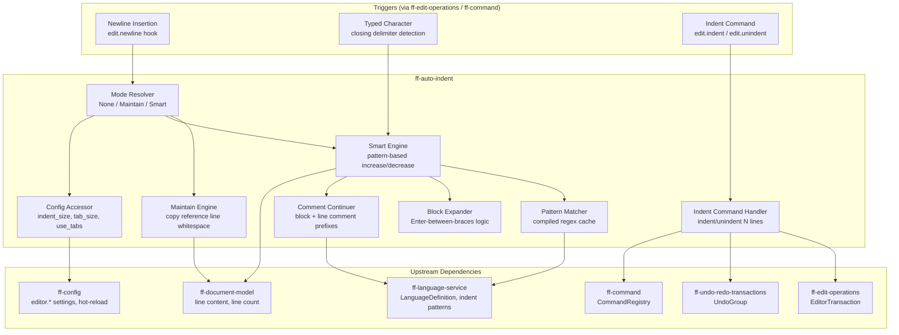

# Design Document: Auto-Indentation (`ff-auto-indent`)

## Overview

The `ff-auto-indent` crate implements **language-aware automatic indentation** for the FileForgeWorkbench editor. It determines the correct indent level when new lines are created (Enter press), performs real-time indent decrease when closing delimiters are typed, expands block pairs (e.g., `{}`), auto-continues block and line comments, and provides explicit Indent/Unindent commands.

### Purpose

- Compute correct indentation for newly created lines based on language-specific regex patterns
- Support three auto-indent modes: None, Maintain, and Smart
- Detect indent-increase triggers (lines ending with `{`, `do`, etc.) and indent-decrease triggers (lines starting with `}`, `end`, etc.)
- Expand block pairs when Enter is pressed between matched delimiters
- Continue block and line comments automatically on new lines
- Register `edit.indent` and `edit.unindent` commands for explicit indentation control
- Operate purely on the document model without any GUI coupling

### Position in Architecture

```
Wave 7 — Language and Highlighting

┌──────────────────────────────────────────────────────────────┐
│  Downstream Consumers:                                        │
│    ff-edit-operations (Wave 4) — newline insertion hook        │
│    ff-command (Wave 2) — indent/unindent command dispatch      │
├──────────────────────────────────────────────────────────────┤
│          THIS CRATE: ff-auto-indent ← Wave 7                  │
│   Auto-indent modes, pattern matching, comment continuation   │
├──────────────────────────────────────────────────────────────┤
│  Upstream:                                                    │
│    ff-logging (Wave 0) — structured diagnostics               │
│    ff-config (Wave 2) — indent settings, hot-reload           │
│    ff-command (Wave 2) — command registration                  │
│    ff-language-service (Wave 7) — indent patterns, comments   │
│    ff-document-model (Wave 4) — line content access           │
│    ff-edit-operations (Wave 4) — EditorTransaction recording  │
│    ff-undo-redo-transactions (Wave 4) — undo grouping         │
├──────────────────────────────────────────────────────────────┤
│              Foundation Layer: ff-logging                      │
└──────────────────────────────────────────────────────────────┘
```

### Design Constraints (Cross-Cutting)

- **FFW-ARCH-001**: No direct `std::fs` calls — language indent patterns are obtained through `ff-language-service`, which manages TOML file access
- **GUI Independence**: Zero GUI dependencies — the auto-indent logic operates on abstract document/line content; the GUI shell triggers indent computation via `edit-operations`
- **Command-Driven**: `edit.indent` and `edit.unindent` are registered as commands with the `ff-command` framework
- **Configuration Namespace**: All indent settings reside under `editor.*` namespace (`editor.auto_indent`, `editor.indent_size`, `editor.tab_size`, `editor.use_tabs`)
- **Multi-Crate Workspace**: Crate at `crates/ff-auto-indent`
- **Error Message Standards**: All errors follow `[auto-indent] operation: description` format

---

## Architecture

### High-Level Architecture Diagram



### Component Responsibilities

| Component | Responsibility |
|-----------|---------------|
| **Mode Resolver** | Reads `editor.auto_indent` config, resolves effective mode (None/Maintain/Smart), handles hot-reload updates |
| **Maintain Engine** | Copies leading whitespace from the reference line to the new line, respecting caret position within whitespace |
| **Smart Engine** | Applies indent-increase/decrease patterns, handles statement indent, delegates to block expander and comment continuer |
| **Pattern Matcher** | Compiles and caches regex patterns from language definitions, provides match evaluation with syntax-state filtering |
| **Block Expander** | Detects Enter between block-start/end patterns and generates the three-line expansion |
| **Comment Continuer** | Detects caret inside block/line comments (via syntax state) and inserts continuation markers |
| **Indent Command Handler** | Implements `edit.indent` and `edit.unindent` for selected lines, handles normalisation and rectangular selections |
| **Config Accessor** | Reads and caches indent settings (indent_size, tab_size, use_tabs), reacts to hot-reload callbacks |

### Crate Dependencies

```toml
[dependencies]
ff-logging = { path = "../ff-logging" }
ff-config = { path = "../ff-config" }
ff-language-service = { path = "../ff-language-service" }
ff-document-model = { path = "../ff-document-model" }
ff-edit-operations = { path = "../ff-edit-operations" }
ff-command = { path = "../ff-command" }
regex = "1"
thiserror = "1"

[dev-dependencies]
proptest = "1"
pretty_assertions = "1"
```

---

## Components and Interfaces

```
crates/ff-auto-indent/
├── Cargo.toml
├── src/
│   ├── lib.rs                    # Public API re-exports, crate docs
│   ├── mode.rs                   # AutoIndentMode enum, mode resolution logic
│   ├── config.rs                 # IndentConfig, config accessor, hot-reload handler
│   ├── maintain.rs               # Maintain-indent engine (reference line whitespace copy)
│   ├── smart.rs                  # Smart-indent engine (pattern-based increase/decrease)
│   ├── patterns.rs               # IndentPatterns, regex compilation, caching, matching
│   ├── block.rs                  # Block expansion logic (Enter between braces)
│   ├── comment.rs                # Comment continuation (block and line comments)
│   ├── indent_cmd.rs             # Indent/Unindent command handler and registration
│   ├── decision.rs               # IndentDecision type, indent level computation
│   └── error.rs                  # AutoIndentError enum
└── tests/
    ├── mode_tests.rs             # Mode resolution property tests
    ├── maintain_tests.rs         # Maintain-indent property tests
    ├── smart_tests.rs            # Smart-indent increase/decrease property tests
    ├── patterns_tests.rs         # Pattern compilation and matching tests
    ├── block_tests.rs            # Block expansion tests
    ├── comment_tests.rs          # Comment continuation tests
    ├── indent_cmd_tests.rs       # Indent/Unindent command property tests
    ├── config_tests.rs           # Configuration and hot-reload tests
    └── integration.rs            # End-to-end auto-indent scenario tests
```

### Module Descriptions

| Module | Description |
|--------|-------------|
| `lib.rs` | Crate root — re-exports the public API surface (`AutoIndentService`, `AutoIndentMode`, `IndentConfig`, `IndentDecision`). Contains crate-level documentation. |
| `mode.rs` | Defines the `AutoIndentMode` enum and the logic for resolving the effective mode from global config, language override, and EditorConfig. |
| `config.rs` | Defines `IndentConfig` struct (indent_size, tab_size, use_tabs) and provides a `ConfigAccessor` that reads from `ff-config` with per-language overrides and hot-reload subscription. |
| `maintain.rs` | Implements the maintain-indent algorithm: extracts leading whitespace from the reference line (respecting caret position) and generates the indent string for the new line. |
| `smart.rs` | Implements the smart-indent algorithm: queries `IndentPatterns` for increase/decrease/statement matches, computes net indent delta, handles the interaction between increase and decrease on the same line. |
| `patterns.rs` | Defines `IndentPatterns` struct, compiles regex patterns from language TOML `[indent]` table, caches compiled patterns per language, provides pattern evaluation with syntax-state filtering. |
| `block.rs` | Implements the "Enter between braces" block expansion: detects adjacent block_start/block_end at caret, produces three-line split with correct indentation. |
| `comment.rs` | Implements block comment continuation (` * ` prefix) and line comment continuation (`// ` prefix), including the "double-Enter to break out" behaviour. |
| `indent_cmd.rs` | Registers `edit.indent` and `edit.unindent` commands with `ff-command`, implements the multi-line indent/unindent logic with normalisation, handles rectangular selections. |
| `decision.rs` | Defines `IndentDecision` struct representing the computed indentation to apply (indent string, caret position, additional lines for block expansion). |
| `error.rs` | Defines `AutoIndentError` enum following the `[auto-indent] operation: description` format. |

---

## Data Models

### AutoIndentMode

```rust
/// The auto-indentation mode for a document.
/// Addresses: Requirement 1, criteria 1.1, 1.2, 1.3
#[derive(Debug, Clone, Copy, PartialEq, Eq, Hash)]
pub enum AutoIndentMode {
    /// No automatic indentation applied on Enter.
    None,
    /// New line matches the indentation of the previous line.
    Maintain,
    /// New line indentation adjusted by language-specific patterns.
    Smart,
}

impl AutoIndentMode {
    /// Parse from configuration string value.
    /// Accepts "none", "maintain", "smart" (case-insensitive).
    pub fn from_config_str(s: &str) -> Result<Self, AutoIndentError>;
}

impl Default for AutoIndentMode {
    /// Defaults to Smart when language patterns are available.
    fn default() -> Self { AutoIndentMode::Smart }
}

impl std::fmt::Display for AutoIndentMode {
    fn fmt(&self, f: &mut std::fmt::Formatter<'_>) -> std::fmt::Result;
}
```

### IndentConfig

```rust
/// Physical indentation settings for a document.
/// Addresses: Requirement 1, criteria 1.5, 1.6; Requirement 9, criterion 9.3
#[derive(Debug, Clone, Copy, PartialEq, Eq)]
pub struct IndentConfig {
    /// Number of columns per logical indent level (e.g., 4).
    pub indent_size: u32,
    /// Display width of a tab character in columns (e.g., 4 or 8).
    pub tab_size: u32,
    /// Whether to use tab characters (true) or spaces (false) for indentation.
    pub use_tabs: bool,
}

impl IndentConfig {
    /// Create a new IndentConfig with explicit values.
    pub fn new(indent_size: u32, tab_size: u32, use_tabs: bool) -> Self;

    /// Generate the physical indent string for one level of indentation.
    /// Returns a tab character if use_tabs is true, or indent_size spaces otherwise.
    /// Addresses: Requirement 2, criterion 2.3
    pub fn indent_string(&self) -> String;

    /// Generate the physical indent string for the given number of indent levels.
    pub fn indent_string_for_levels(&self, levels: u32) -> String;

    /// Calculate the column width of a given whitespace prefix, accounting for tabs.
    pub fn column_width_of(&self, whitespace: &str) -> u32;

    /// Convert a column width back to the appropriate whitespace string.
    pub fn whitespace_for_columns(&self, columns: u32) -> String;
}

impl Default for IndentConfig {
    /// Default: indent_size=4, tab_size=4, use_tabs=false
    fn default() -> Self;
}
```

### IndentPatterns

```rust
/// Compiled indent patterns for a specific language.
/// Loaded from the language TOML `[indent]` table via ff-language-service.
/// Addresses: Requirement 9, criteria 9.1, 9.2, 9.7
#[derive(Debug, Clone)]
pub struct IndentPatterns {
    /// Pattern matching lines that trigger indent increase on the next line.
    /// Example: `\{\s*$` (line ending with `{`)
    pub increase_pattern: Option<regex::Regex>,
    /// Pattern matching lines that trigger indent decrease on the current line.
    /// Example: `^\s*\}` (line starting with `}`)
    pub decrease_pattern: Option<regex::Regex>,
    /// Pattern matching lines that start a statement continuation.
    /// Example: `^\s*(if|while|for)\b.*[^{]\s*$`
    pub statement_pattern: Option<regex::Regex>,
    /// Pattern matching lines that end a statement continuation.
    pub statement_end_pattern: Option<regex::Regex>,
    /// Pattern matching block-start delimiters for Enter-between-braces expansion.
    /// Example: `\{\s*$`
    pub block_start: Option<regex::Regex>,
    /// Pattern matching block-end delimiters for Enter-between-braces expansion.
    /// Example: `^\s*\}`
    pub block_end: Option<regex::Regex>,
}

impl IndentPatterns {
    /// Compile patterns from raw TOML strings.
    /// Invalid patterns are logged as WARN and treated as None.
    /// Addresses: Requirement 9, criterion 9.7
    pub fn compile(
        increase: Option<&str>,
        decrease: Option<&str>,
        statement: Option<&str>,
        statement_end: Option<&str>,
        block_start: Option<&str>,
        block_end: Option<&str>,
    ) -> Self;

    /// Returns true if no patterns are defined (language has no smart indent rules).
    pub fn is_empty(&self) -> bool;

    /// Test whether a line matches the increase pattern.
    /// Addresses: Requirement 3, criterion 3.1
    pub fn matches_increase(&self, line_content: &str) -> bool;

    /// Test whether a line matches the decrease pattern.
    /// Addresses: Requirement 4, criterion 4.1
    pub fn matches_decrease(&self, line_content: &str) -> bool;

    /// Test whether a line matches the statement pattern.
    /// Addresses: Requirement 3, criterion 3.6
    pub fn matches_statement(&self, line_content: &str) -> bool;

    /// Test whether a line matches the statement end pattern.
    pub fn matches_statement_end(&self, line_content: &str) -> bool;

    /// Test whether text before caret matches block_start.
    /// Addresses: Requirement 5, criterion 5.1
    pub fn matches_block_start(&self, text_before_caret: &str) -> bool;

    /// Test whether text after caret matches block_end.
    /// Addresses: Requirement 5, criterion 5.1
    pub fn matches_block_end(&self, text_after_caret: &str) -> bool;
}
```

### IndentDecision

```rust
/// The result of an auto-indent computation.
/// Describes what indentation to apply after a newline insertion.
/// Addresses: Requirements 2, 3, 4, 5, 6
#[derive(Debug, Clone, PartialEq, Eq)]
pub struct IndentDecision {
    /// The indentation string to prepend to the new line.
    pub indent_text: String,
    /// Optional comment continuation marker to insert after the indent.
    /// Addresses: Requirement 6
    pub comment_continuation: Option<CommentContinuation>,
    /// If block expansion is needed, the additional line(s) to insert.
    /// Addresses: Requirement 5
    pub block_expansion: Option<BlockExpansion>,
    /// The logical indent level of the new line (for debugging/logging).
    pub indent_level: u32,
}

impl IndentDecision {
    /// Create a decision with no indentation (mode = None).
    pub fn no_indent() -> Self;

    /// Create a maintain-indent decision copying reference whitespace.
    pub fn maintain(indent_text: String, indent_level: u32) -> Self;

    /// Create a smart-indent decision with computed indent level.
    pub fn smart(indent_text: String, indent_level: u32) -> Self;

    /// The total text to insert at the start of the new line
    /// (indent + optional comment continuation marker).
    pub fn full_prefix(&self) -> String;
}
```

### CommentContinuation

```rust
/// Describes the comment continuation marker for a new line inside a comment.
/// Addresses: Requirement 6, criteria 6.1–6.7
#[derive(Debug, Clone, PartialEq, Eq)]
pub struct CommentContinuation {
    /// The continuation marker text (e.g., " * " or "// ").
    pub marker: String,
    /// The type of comment being continued.
    pub kind: CommentKind,
}

/// The kind of comment being continued.
#[derive(Debug, Clone, Copy, PartialEq, Eq)]
pub enum CommentKind {
    /// Inside a block comment (e.g., /* ... */).
    Block,
    /// A line comment continuation (e.g., // ...).
    Line,
}
```

### BlockExpansion

```rust
/// Describes additional lines inserted during Enter-between-braces expansion.
/// Addresses: Requirement 5, criteria 5.1, 5.3, 5.5
#[derive(Debug, Clone, PartialEq, Eq)]
pub struct BlockExpansion {
    /// The closing line content (e.g., indented `}`).
    pub closing_line: String,
    /// The indent string for the closing line (same level as the opening).
    pub closing_indent: String,
}
```

### CommentConfig

```rust
/// Language-specific comment configuration for auto-continuation.
/// Loaded from the language TOML `[comment]` table.
/// Addresses: Requirement 9, criterion 9.4
#[derive(Debug, Clone, PartialEq, Eq)]
pub struct CommentConfig {
    /// Block comment start delimiter (e.g., "/*").
    pub block_start: Option<String>,
    /// Block comment end delimiter (e.g., "*/").
    pub block_end: Option<String>,
    /// Block comment continuation marker (e.g., " * ").
    pub block_continue: Option<String>,
    /// Line comment prefix (e.g., "//").
    pub line_prefix: Option<String>,
    /// Whether to continue line comments on Enter.
    pub continue_line: bool,
}

impl CommentConfig {
    /// Returns true if block comment continuation is configured.
    pub fn has_block_continuation(&self) -> bool;

    /// Returns true if line comment continuation is configured and enabled.
    pub fn has_line_continuation(&self) -> bool;
}
```

### IndentContext

```rust
/// Context provided to the auto-indent engine for computing indentation.
/// Encapsulates all the information needed without coupling to specific crate types.
/// Addresses: Requirement 10, criterion 10.4
#[derive(Debug, Clone)]
pub struct IndentContext {
    /// Content of the reference line (the line where Enter was pressed).
    pub reference_line: String,
    /// The line number of the reference line (0-based).
    pub reference_line_number: u64,
    /// Column position of the caret on the reference line (0-based byte offset).
    pub caret_column: u64,
    /// The text before the caret on the reference line.
    pub text_before_caret: String,
    /// The text after the caret on the reference line.
    pub text_after_caret: String,
    /// Whether the caret is inside a comment (from syntax highlighting state).
    pub in_comment: bool,
    /// Whether the caret is inside a string literal.
    pub in_string: bool,
    /// The syntax state at the caret position (for comment detection).
    pub syntax_state: i32,
}
```

---

## Public API Surface

### AutoIndentService (Top-Level Facade)

```rust
/// The central auto-indentation service.
/// Stateless for indent computation; stateful only for configuration caching
/// and pattern compilation cache.
///
/// Thread-safe: all computation methods take `&self`.
/// Addresses: Requirement 10, criterion 10.4
pub struct AutoIndentService {
    /// Cached indent configuration (updated on hot-reload).
    config: RwLock<IndentConfig>,
    /// Current auto-indent mode (updated on hot-reload).
    mode: RwLock<AutoIndentMode>,
    /// Compiled pattern cache, keyed by language_id.
    pattern_cache: RwLock<HashMap<String, IndentPatterns>>,
    /// Comment configuration cache, keyed by language_id.
    comment_cache: RwLock<HashMap<String, CommentConfig>>,
}

impl AutoIndentService {
    /// Create a new AutoIndentService with the given initial configuration.
    /// Addresses: Requirement 1, criterion 1.1
    pub fn new(config: IndentConfig, mode: AutoIndentMode) -> Self;

    /// Update configuration after a hot-reload event.
    /// Addresses: Requirement 1, criterion 1.4
    pub fn update_config(&self, config: IndentConfig);

    /// Update the auto-indent mode after a hot-reload event.
    /// Addresses: Requirement 1, criterion 1.4
    pub fn update_mode(&self, mode: AutoIndentMode);

    /// Get the currently active indent configuration.
    pub fn config(&self) -> IndentConfig;

    /// Get the currently active auto-indent mode.
    pub fn mode(&self) -> AutoIndentMode;
}
```

### Indent Computation API

```rust
impl AutoIndentService {
    /// Compute the indentation for a newly created line after Enter.
    /// This is the primary entry point called by `ff-edit-operations` during
    /// newline insertion.
    ///
    /// Returns an `IndentDecision` describing what indentation to apply.
    ///
    /// Addresses: Requirements 2, 3, 4, 5, 6, 10 (criteria 2.1, 3.1, 5.1, 6.1, 10.1)
    pub fn compute_newline_indent(
        &self,
        context: &IndentContext,
        patterns: &IndentPatterns,
        comment_config: &CommentConfig,
    ) -> IndentDecision;

    /// Compute the indentation adjustment when a character is typed that
    /// completes a decrease pattern match (e.g., typing `}` at start of line).
    ///
    /// Returns Some(new_indent_text) if the line's indentation should be reduced,
    /// or None if no adjustment is needed.
    ///
    /// Addresses: Requirement 4, criteria 4.1, 4.5, 4.6, 4.7
    pub fn compute_decrease_on_type(
        &self,
        current_line_content: &str,
        caret_column: u64,
        patterns: &IndentPatterns,
    ) -> Option<String>;

    /// Determine the effective auto-indent mode for a document, considering:
    /// - Global `editor.auto_indent` setting
    /// - Whether the active language has indent patterns
    /// - Per-language mode override
    ///
    /// Addresses: Requirement 1, criteria 1.2, 1.3
    pub fn resolve_effective_mode(
        &self,
        has_language_patterns: bool,
        language_mode_override: Option<AutoIndentMode>,
    ) -> AutoIndentMode;
}
```

### Maintain Indent API

```rust
impl AutoIndentService {
    /// Compute maintain-indent: copy the reference line's leading whitespace.
    ///
    /// Accounts for caret position:
    /// - If caret is at column 0, returns zero indent.
    /// - If caret is within leading whitespace, returns whitespace up to caret.
    /// - Otherwise, returns the full leading whitespace of the reference line.
    ///
    /// Addresses: Requirement 2, criteria 2.1–2.6
    pub fn compute_maintain_indent(
        &self,
        reference_line: &str,
        caret_column: u64,
    ) -> IndentDecision;
}
```

### Smart Indent API

```rust
impl AutoIndentService {
    /// Compute smart-indent for a newline, examining the reference line
    /// content against indent-increase and indent-decrease patterns.
    ///
    /// Handles:
    /// - Indent increase (line matches increase_pattern)
    /// - Net cancellation (line matches both increase and decrease)
    /// - Statement continuation (line matches statement_pattern)
    ///
    /// Addresses: Requirement 3, criteria 3.1–3.6
    pub fn compute_smart_indent(
        &self,
        context: &IndentContext,
        patterns: &IndentPatterns,
    ) -> IndentDecision;

    /// Compute block expansion when Enter is pressed between block_start and block_end.
    ///
    /// Returns Some(IndentDecision) with block_expansion if the caret is between
    /// matching block delimiters, or None if no expansion applies.
    ///
    /// Addresses: Requirement 5, criteria 5.1–5.5
    pub fn compute_block_expansion(
        &self,
        context: &IndentContext,
        patterns: &IndentPatterns,
    ) -> Option<IndentDecision>;
}
```

### Comment Continuation API

```rust
impl AutoIndentService {
    /// Compute comment continuation for a newline inside a comment.
    ///
    /// Returns Some(CommentContinuation) if the caret is inside a comment
    /// and continuation is configured for the language, or None otherwise.
    ///
    /// Addresses: Requirement 6, criteria 6.1–6.7
    pub fn compute_comment_continuation(
        &self,
        context: &IndentContext,
        comment_config: &CommentConfig,
    ) -> Option<CommentContinuation>;

    /// Determine if the "double-Enter break-out" should apply.
    /// Returns true if the previous line contained only whitespace + continuation marker.
    ///
    /// Addresses: Requirement 6, criterion 6.6
    pub fn should_break_comment_continuation(
        &self,
        previous_line: &str,
        comment_config: &CommentConfig,
    ) -> bool;
}
```

### Indent/Unindent Command API

```rust
/// Indent/Unindent command implementations registered with ff-command.
/// Addresses: Requirements 7, 8

/// Indent the given lines by one indent level.
///
/// - Prepends one indent_string to each line.
/// - Normalises mixed whitespace to the current use_tabs setting.
/// - Records the operation as a single EditorTransaction.
///
/// Addresses: Requirement 7, criteria 7.1, 7.4, 7.5, 7.6
pub fn indent_lines(
    lines: &[u64],
    config: &IndentConfig,
) -> Vec<IndentLineEdit>;

/// Unindent the given lines by one indent level.
///
/// - Removes one indent_string worth of leading whitespace from each line.
/// - Lines with less than one full indent level have all whitespace removed.
/// - Lines already at column 0 are unchanged.
/// - Records the operation as a single EditorTransaction.
///
/// Addresses: Requirement 8, criteria 8.1, 8.2, 8.5, 8.6, 8.7
pub fn unindent_lines(
    lines: &[u64],
    line_contents: &[&str],
    config: &IndentConfig,
) -> Vec<IndentLineEdit>;

/// A single line edit produced by indent/unindent operations.
#[derive(Debug, Clone, PartialEq, Eq)]
pub struct IndentLineEdit {
    /// The line number affected (0-based).
    pub line: u64,
    /// The new leading whitespace for the line (replaces existing).
    pub new_indent: String,
    /// Whether the line was actually modified (false if already at target).
    pub modified: bool,
}

/// Register the indent/unindent commands with the command framework.
/// Addresses: Requirement 7, criterion 7.3; Requirement 8, criterion 8.4
pub fn register_indent_commands(registry: &mut CommandRegistry);
```

### Pattern Loading API

```rust
impl AutoIndentService {
    /// Load and cache indent patterns for a language from its definition.
    /// Called when a document's language is detected or changed.
    ///
    /// Addresses: Requirement 9, criteria 9.1, 9.5, 9.6, 9.7
    pub fn load_language_patterns(
        &self,
        language_id: &str,
        indent_table: Option<&IndentTableRaw>,
        comment_table: Option<&CommentTableRaw>,
    );

    /// Get cached indent patterns for a language.
    /// Returns None if the language has not been loaded.
    pub fn get_patterns(&self, language_id: &str) -> Option<IndentPatterns>;

    /// Get cached comment config for a language.
    pub fn get_comment_config(&self, language_id: &str) -> Option<CommentConfig>;

    /// Clear the pattern cache (e.g., on language definition reload).
    pub fn clear_cache(&self);
}

/// Raw indent table fields as read from language TOML.
/// Intermediate type between ff-language-service's definition and compiled patterns.
#[derive(Debug, Clone, Default)]
pub struct IndentTableRaw {
    pub increase_pattern: Option<String>,
    pub decrease_pattern: Option<String>,
    pub statement_pattern: Option<String>,
    pub statement_end_pattern: Option<String>,
    pub block_start: Option<String>,
    pub block_end: Option<String>,
}

/// Raw comment table fields as read from language TOML.
#[derive(Debug, Clone, Default)]
pub struct CommentTableRaw {
    pub block_start: Option<String>,
    pub block_end: Option<String>,
    pub block_continue: Option<String>,
    pub line_prefix: Option<String>,
    pub continue_line: Option<bool>,
}
```

---

## Error Handling

```rust
/// Errors originating from the ff-auto-indent crate.
/// Formatted per Error Message Standards: `[auto-indent] operation: description`
///
/// Addresses: Cross-cutting error standards
#[derive(Debug, thiserror::Error)]
#[non_exhaustive]
pub enum AutoIndentError {
    /// Invalid auto-indent mode string in configuration.
    #[error("[auto-indent] config: invalid mode '{value}' — expected 'none', 'maintain', or 'smart'")]
    InvalidMode { value: String },

    /// A regex pattern in the language definition failed to compile.
    #[error("[auto-indent] pattern: failed to compile '{pattern_name}' for language '{language_id}': {reason}")]
    PatternCompileError {
        language_id: String,
        pattern_name: String,
        reason: String,
    },

    /// Invalid indent configuration value.
    #[error("[auto-indent] config: invalid value for '{key}': {reason}")]
    InvalidConfig { key: String, reason: String },

    /// Line number out of bounds during indent computation.
    #[error("[auto-indent] compute: line {line} out of bounds (document has {total} lines)")]
    LineOutOfBounds { line: u64, total: u64 },

    /// Language patterns not loaded for the requested language.
    #[error("[auto-indent] lookup: patterns for language '{language_id}' not loaded")]
    PatternsNotLoaded { language_id: String },

    /// Configuration system access error.
    #[error("[auto-indent] config: failed to read setting '{key}': {reason}")]
    ConfigAccessError { key: String, reason: String },

    /// Command registration failed.
    #[error("[auto-indent] register: failed to register command '{command_id}': {reason}")]
    CommandRegistrationError { command_id: String, reason: String },
}
```

---

## Integration Points

### With `ff-language-service` (Wave 7 — upstream)

- **Consumed API**: `LanguageService::get_definition()`, `LanguageDefinitionRef` accessors for indent/comment tables, `LanguageService::get_property()`
- **Data flow**: When a document's language is detected (or changed), the auto-indent service queries the language definition for its `[indent]` and `[comment]` table contents. These are compiled into `IndentPatterns` and `CommentConfig` and cached.
- **Key interactions**:
  - `get_definition(language_id)` → access `indent.increase_pattern`, `indent.decrease_pattern`, `indent.statement_pattern`, `indent.block_start`, `indent.block_end` (Req 9.1, 9.2)
  - `get_definition(language_id)` → access `comment.block_start`, `comment.block_end`, `comment.block_continue`, `comment.line_prefix`, `comment.continue_line` (Req 9.4)
  - `get_property(lang, "indent.indent_size")` → per-language indent override (Req 9.3)
  - Syntax state query to determine if caret is in comment/string (Req 3.4, 6.7)
  - Language change notification triggers pattern cache reload (Req 9.5)

### With `ff-edit-operations` (Wave 4 — integration)

- **Consumed API**: `EditorTransaction`, newline insertion hook callback
- **Provided API**: `compute_newline_indent()` is called by the newline command handler
- **Data flow**: When `edit.newline` is invoked, the edit-operations layer constructs an `IndentContext` from the document state and calls `AutoIndentService::compute_newline_indent()`. The returned `IndentDecision` is applied as part of the same `EditorTransaction` that records the newline.
- **Key interactions**:
  - Newline hook invokes `compute_newline_indent()` (Req 10.1)
  - Character-typed hook invokes `compute_decrease_on_type()` for real-time decrease (Req 4.1)
  - `IndentLineEdit` results are applied via `EditorTransaction` insert/delete operations (Req 7.4, 8.5)
  - Modified line markers set on affected lines (Req 7.6, 8.6)

### With `ff-document-model` (Wave 4 — upstream)

- **Consumed API**: Line content access (`get_line_content(line_number)`), line count, `LineMetadata`
- **Data flow**: The auto-indent engine reads line content for pattern matching. It reads the reference line to determine existing indentation, and may read adjacent lines for statement continuation tracking.
- **Key interactions**:
  - Read reference line content for maintain-indent whitespace extraction (Req 2.1)
  - Read reference line for pattern matching (increase/decrease) (Req 3.1, 4.1)
  - Read line content for indent/unindent command to determine current whitespace (Req 7.5, 8.7)

### With `ff-config` (Wave 2 — upstream)

- **Consumed API**: `ConfigProvider` typed access (`get_string`, `get_int`, `get_bool`), hot-reload callback registration
- **Data flow**: The auto-indent service reads `editor.auto_indent`, `editor.indent_size`, `editor.tab_size`, `editor.use_tabs` at startup and subscribes to hot-reload notifications. When configuration changes, the service updates its cached `IndentConfig` and `AutoIndentMode`.
- **Key interactions**:
  - Read `editor.auto_indent` → resolve `AutoIndentMode` (Req 1.3)
  - Read `editor.indent_size`, `editor.tab_size`, `editor.use_tabs` → build `IndentConfig` (Req 1.5)
  - Per-language overrides via `languages.{id}.indent_size` etc. (Req 9.3)
  - EditorConfig integration: `.editorconfig` values override global for specific files (Req 1.6)
  - Hot-reload callback updates mode and config without restart (Req 1.4)
  - All settings under `editor.*` namespace (cross-cutting)

### With `ff-command` (Wave 2 — integration)

- **Consumed API**: `CommandRegistry::register()` for registering indent/unindent commands
- **Data flow**: At initialization, the auto-indent service registers `edit.indent` and `edit.unindent` commands. When invoked, the command handler reads the current selection state, determines affected lines, calls `indent_lines()` or `unindent_lines()`, and applies the edits.
- **Key interactions**:
  - Register `edit.indent` with default keybinding `Tab`, display name "Indent" (Req 7.3)
  - Register `edit.unindent` with default keybinding `Shift+Tab`, display name "Unindent" (Req 8.4)
  - Command parameters include selection state for multi-line detection (Req 7.1, 7.2)
  - Single-line Tab delegates to normal tab insertion when no multi-line selection (Req 7.2)
  - Single-line Shift+Tab unindents the current line (Req 8.3)

### With `ff-undo-redo-transactions` (Wave 4 — consumer)

- **Consumed API**: `UndoGroup`, `EditorTransaction` grouping
- **Data flow**: All auto-indent modifications are wrapped in the same `EditorTransaction` as their triggering operation. For newline insertion, the auto-indent is part of the newline transaction. For indent/unindent commands, all affected lines are in one transaction.
- **Key interactions**:
  - Newline + auto-indent = single UndoGroup (Req 2.4, 10.1)
  - Character typed + decrease adjustment = single UndoGroup (Req 4.4)
  - Block expansion (3 lines) = single UndoGroup (Req 5.3)
  - Comment continuation + newline = single UndoGroup (Req 6.5)
  - Indent command over N lines = single UndoGroup (Req 7.4)
  - Unindent command over N lines = single UndoGroup (Req 8.5)
  - Multi-caret indentation = single UndoGroup across all carets (Req 10.5)

### With `ff-logging` (Wave 0 — upstream)

- **Consumed API**: `log::debug!`, `log::warn!` structured logging macros
- **Data flow**: The auto-indent service logs decisions and errors for diagnostic purposes.
- **Key interactions**:
  - DEBUG log for each auto-indent decision: reference line, matched pattern, resulting level (Req 10.7)
  - WARN on invalid regex pattern in language definition (Req 9.7)
  - WARN on invalid configuration value (defensive)

---

## Correctness Properties

These properties are suitable for property-based testing using the `proptest` crate.

### Property 1: Indent Level Never Goes Negative

**Statement**: For any auto-indent computation, the resulting indent level is always ≥ 0. No sequence of decrease patterns can produce a negative indentation.

**Validates: Requirements 4.6, 8.2**

```
∀ reference_line, ∀ patterns, ∀ config:
  compute_newline_indent(context, patterns, comment_config).indent_level >= 0
  AND indent_text contains no negative-length prefix
```

### Property 2: Maintain-Indent Reproduces Reference Line Whitespace

**Statement**: In Maintain mode, the indentation of the new line exactly equals the leading whitespace of the reference line (up to the caret position), re-encoded using the current `use_tabs`/`indent_size` settings.

**Validates: Requirements 2.1, 2.2, 2.3**

```
∀ reference_line, ∀ caret_column ∈ [0, len(reference_line)], ∀ config:
  let ws_cols = column_width_of(leading_whitespace_before(reference_line, caret_column))
  let result = compute_maintain_indent(reference_line, caret_column)
  column_width_of(result.indent_text) == ws_cols
```

### Property 3: Indent + Unindent is Identity on Single Line

**Statement**: Indenting a line by one level and then unindenting it by one level returns the line to its original indentation (provided the original indentation was a multiple of indent_size).

**Validates: Requirements 7.1, 8.1**

```
∀ line_content where leading_indent_is_aligned(line_content, config):
  let indented = indent_lines([line], config)
  let restored = unindent_lines([indented_line], config)
  leading_whitespace(restored) == leading_whitespace(original)
```

### Property 4: Unindent Never Produces Negative Indentation

**Statement**: Unindenting any line never results in negative indentation — the minimum is column 0 (empty leading whitespace).

**Validates: Requirements 8.2**

```
∀ line_content, ∀ config:
  let result = unindent_lines([line], [line_content], config)
  result[0].new_indent.len() >= 0
  AND column_width_of(result[0].new_indent) >= 0
```

### Property 5: Increase Pattern Adds Exactly One Level

**Statement**: When the reference line matches the increase pattern and does not match the decrease pattern, the new line's indent level is exactly one level greater than the reference line's level.

**Validates: Requirements 3.1**

```
∀ reference_line matching increase_pattern AND NOT matching decrease_pattern:
  let ref_level = indent_level_of(reference_line, config)
  let result = compute_smart_indent(context, patterns)
  result.indent_level == ref_level + 1
```

### Property 6: Increase + Decrease Cancel on Same Line

**Statement**: When the reference line matches both the increase pattern and the decrease pattern, the net effect is zero — the new line has the same indent level as the reference line.

**Validates: Requirements 3.5**

```
∀ reference_line matching BOTH increase_pattern AND decrease_pattern:
  let ref_level = indent_level_of(reference_line, config)
  let result = compute_smart_indent(context, patterns)
  result.indent_level == ref_level
```

### Property 7: Block Expansion Produces Correctly Indented Three Lines

**Statement**: When Enter is pressed between a block_start and block_end match, the result contains: (a) a middle line indented one level deeper than the reference line, and (b) a closing line at the same level as the reference line.

**Validates: Requirements 5.1, 5.5**

```
∀ context where text_before_caret matches block_start AND text_after_caret matches block_end:
  let result = compute_block_expansion(context, patterns)
  result.is_some()
  AND result.indent_level == ref_level + 1
  AND column_width_of(result.block_expansion.closing_indent) == column_width_of(ref_indent)
```

### Property 8: Comment Continuation Preserves Alignment

**Statement**: When a comment continuation marker is inserted, its column alignment matches the continuation marker on the reference line (if present) or is aligned to the block comment start + 1 column.

**Validates: Requirements 6.1**

```
∀ context where in_comment == true AND comment_config.has_block_continuation():
  let result = compute_comment_continuation(context, comment_config)
  result.is_some()
  AND column_of(result.marker) == column_of(reference_continuation_marker)
```

### Property 9: Indent String Consistency with Config

**Statement**: Every indent string produced by `IndentConfig::indent_string()` uses only tab characters when `use_tabs` is true, and only space characters when `use_tabs` is false. The column width always equals `indent_size`.

**Validates: Requirements 1.5, 2.3**

```
∀ config:
  let s = config.indent_string()
  IF config.use_tabs THEN s contains only '\t'
  ELSE s contains only ' ' AND s.len() == config.indent_size
  AND config.column_width_of(&s) == config.indent_size
```

### Property 10: Mode None Produces Zero Indentation

**Statement**: When the auto-indent mode is `None`, any call to `compute_newline_indent` returns an empty indent string regardless of reference line content.

**Validates: Requirements 10.3**

```
∀ context, ∀ patterns, ∀ comment_config:
  IF mode == AutoIndentMode::None THEN
    compute_newline_indent(context, patterns, comment_config).indent_text == ""
    AND result.indent_level == 0
```

### Property 11: Caret at Column 0 Produces Zero Indent in Maintain Mode

**Statement**: When Enter is pressed at column 0 (beginning of line), the new line receives zero indentation regardless of the reference line's indent.

**Validates: Requirements 2.5**

```
∀ reference_line, ∀ config:
  let result = compute_maintain_indent(reference_line, caret_column=0)
  result.indent_text == ""
  AND result.indent_level == 0
```

### Property 12: Decrease Only Triggers on Whitespace-Only Prefix

**Statement**: The indent-decrease-on-type adjustment only applies when the content before the typed character on the current line consists entirely of whitespace. If there is non-whitespace content before the caret, no decrease is applied.

**Validates: Requirements 4.7**

```
∀ line_content where has_non_whitespace_before_caret(line_content, caret_column):
  compute_decrease_on_type(line_content, caret_column, patterns) == None
```

---

## Testing Strategy

### Unit Tests

Unit tests validate individual components in isolation:

- **Mode resolution**: Verify that `resolve_effective_mode` correctly handles all combinations of global config, language override, and pattern availability.
- **IndentConfig**: Verify `indent_string()`, `column_width_of()`, and `whitespace_for_columns()` produce correct results for various tab/space configurations.
- **Pattern compilation**: Verify `IndentPatterns::compile()` handles valid patterns, invalid patterns (logged as WARN, treated as None), and empty/missing patterns.
- **Maintain indent**: Verify whitespace extraction for various caret positions (beginning, middle of whitespace, after content).
- **Smart indent**: Verify increase/decrease/cancellation logic with known patterns.
- **Block expansion**: Verify three-line generation for `{}`, `begin/end`, and edge cases.
- **Comment continuation**: Verify block comment ` * ` insertion, line comment `// ` insertion, and double-Enter break-out.
- **Indent/Unindent commands**: Verify single-line, multi-line, mixed whitespace normalisation, and boundary conditions.

### Property-Based Tests

Property-based tests use `proptest` with a minimum of 100 cases per property:

- All 12 correctness properties listed above are implemented as property tests.
- Generators produce random line content with varying indentation, random `IndentConfig` values within realistic bounds (indent_size 1–8, tab_size 1–8), and random caret positions.
- Pattern generators produce valid regex strings that match typical indent patterns.

### Integration Tests

Integration tests verify the full pipeline:

- End-to-end auto-indent with a real language definition (e.g., Rust TOML) and multi-line document.
- Hot-reload simulation: change config, verify next indent uses new settings.
- Multi-caret indent: verify independent computation per caret.
- Command registration: verify `edit.indent` and `edit.unindent` are discoverable in the command registry.

### Test Framework

- **Unit + Property**: `proptest` crate for property-based testing, standard `#[test]` for unit tests.
- **Assertions**: `pretty_assertions::assert_eq!` for readable diffs.
- **Coverage**: Every acceptance criterion (Requirements 1–10) has at least one test.
- **Annotation**: All tests carry `// Validates: Requirement X.Y` comments.
