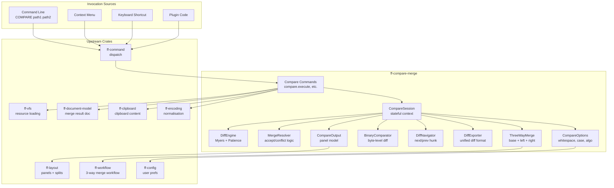

# Design Document: Compare and Merge (`ff-compare-merge`)

## 1. Overview

The `ff-compare-merge` crate is the **comparison and merge engine** for the FileForgeWorkbench platform. It provides LCS-based line differencing (Myers and Patience algorithms), side-by-side and inline diff views, diff navigation, two-way and three-way merge operations, VFS-aware resource comparison, binary comparison, and unified diff export.

### Purpose

- Provide the `COMPARE` primary command for initiating resource comparisons
- Implement a high-performance diff engine operating on line sequences
- Support configurable comparison options (ignore whitespace, ignore case, algorithm selection)
- Render differences in side-by-side and inline (unified) view modes
- Enable merge operations (accept left/right/both) with undo/redo integration
- Support three-way merge with automatic conflict detection
- Compare any resources addressable by VFS URI regardless of provider
- Detect and handle binary resources with byte-level comparison
- Export diffs in standard unified diff format

### Position in Architecture

```
Wave 14 — File Explorer (depends on Wave 8: File I/O and Session, Wave 12: FileForge Domain)

┌─────────────────────────────────────────────────────────────┐
│              Shell Layer: ff-desktop (egui)                   │
│         Renders diff views; does NOT own diff logic           │
├─────────────────────────────────────────────────────────────┤
│  ff-compare-merge (THIS CRATE) ← Wave 14                    │
│  Diff engine, merge logic, compare session, export           │
├─────────────────────────────────────────────────────────────┤
│  ff-vfs │ ff-document-model │ ff-command │ ff-layout │       │
│  ff-workflow │ ff-config │ ff-encoding │ ff-clipboard        │
├─────────────────────────────────────────────────────────────┤
│              Foundation Layer: ff-logging                     │
└─────────────────────────────────────────────────────────────┘
```

### Design Constraints (Cross-Cutting)

- **FFW-ARCH-001 (Req 1)**: ALL resource access goes through VFS — no `std::fs` in this crate
- **GUI Independence (Req 2)**: The diff engine, merge logic, and session management are GUI-independent; view rendering is delegated to the shell layer
- **Plugin Architecture (Req 3)**: Compare commands are discoverable and invokable by plugins
- **Command-Driven (Req 4)**: ALL compare/merge operations are routed through the command framework
- **Async I/O (Req 6)**: Resource loading is async via VFS; diff computation is synchronous (CPU-bound)
- **Multi-Crate Workspace (Req 7)**: Crate at `crates/ff-compare-merge`
- **Error Message Standards (Req 8)**: Errors follow `[compare] operation: description` format

---

## 2. Architecture

### High-Level Architecture Diagram




### Layer Placement

| Component | Responsibility |
|-----------|---------------|
| **Compare Commands** | Command handlers for all compare/merge operations — registered with `ff-command` |
| **CompareSession** | Stateful context holding resources, diff result, navigation position, merge state |
| **DiffEngine** | Pure-function diff computation — Myers and Patience algorithms on `&[&str]` |
| **MergeResolver** | Applies merge decisions (accept left/right/both) to produce a merge result |
| **ThreeWayMerge** | Three-way conflict detection and auto-resolution logic |
| **BinaryComparator** | Streaming byte-level comparison for non-text resources |
| **DiffNavigator** | Tracks current hunk index, wrapping, focus management |
| **DiffExporter** | Generates unified diff format output from DiffResult |
| **CompareOptions** | Configuration state — whitespace, case, algorithm, context lines |
| **CompareOutput** | Output panel model — log of comparison operations and results |

### Request Flow: COMPARE Command

```
1. User enters `COMPARE path1 path2` → command framework dispatches compare.execute
2. CompareCommand resolves paths to ResourceUris (bare paths → default provider)
3. CompareCommand calls vfs.exists() for both URIs
4. CompareCommand calls vfs.read() for both resources (async)
5. Content is normalised to UTF-8 via ff-encoding
6. Binary detection: if null bytes in first 8 KB → BinaryComparator path
7. Text path: content split into lines, fed to DiffEngine with CompareOptions
8. DiffEngine returns DiffResult (hunks + statistics)
9. CompareSession created with both resources, DiffResult, and view mode
10. Layout system opens side-by-side or inline diff view
11. CompareOutput panel logs the operation
```

---

## 3. Module Structure

```
crates/ff-compare-merge/
├── Cargo.toml
├── src/
│   ├── lib.rs                  # Public API re-exports, crate docs
│   ├── diff/
│   │   ├── mod.rs              # DiffEngine re-exports
│   │   ├── engine.rs           # DiffEngine: algorithm dispatch, option handling
│   │   ├── myers.rs            # Myers diff algorithm implementation
│   │   ├── patience.rs         # Patience diff algorithm implementation
│   │   ├── inline_change.rs    # Character-level inline change detection
│   │   └── result.rs           # DiffResult, DiffHunk, DiffStatistics types
│   ├── merge/
│   │   ├── mod.rs              # Merge re-exports
│   │   ├── resolver.rs         # MergeResolver: accept left/right/both logic
│   │   ├── three_way.rs        # ThreeWayMerge: conflict detection, auto-resolve
│   │   └── conflict.rs         # MergeConflict type, resolution status
│   ├── session/
│   │   ├── mod.rs              # Session re-exports
│   │   ├── compare_session.rs  # CompareSession state management
│   │   ├── navigator.rs        # DiffNavigator: next/prev/wrap logic
│   │   └── session_manager.rs  # Active session registry
│   ├── binary/
│   │   ├── mod.rs              # Binary comparison re-exports
│   │   └── comparator.rs       # BinaryComparator: streaming byte comparison
│   ├── export/
│   │   ├── mod.rs              # Export re-exports
│   │   └── unified.rs          # Unified diff format generator
│   ├── options.rs              # CompareOptions, WhitespaceMode, DiffAlgorithm
│   ├── commands.rs             # All compare command handlers
│   ├── output.rs              # CompareOutput panel model
│   ├── error.rs                # CompareError enum
│   └── view_model.rs           # DiffViewModel for GUI rendering data
└── tests/
    ├── diff_engine_tests.rs    # DiffEngine unit and property tests
    ├── myers_tests.rs          # Myers algorithm specific tests
    ├── patience_tests.rs       # Patience algorithm specific tests
    ├── merge_tests.rs          # Merge resolver tests
    ├── three_way_tests.rs      # Three-way merge tests
    ├── binary_tests.rs         # Binary comparison tests
    ├── export_tests.rs         # Unified diff export tests
    ├── navigator_tests.rs      # Navigation wrapping and index tests
    ├── session_tests.rs        # Session lifecycle tests
    └── property_tests.rs       # Property-based tests (proptest)
```


---

## 4. Key Data Models and Types

### DiffResult

```rust
/// The complete result of a diff computation between two text inputs.
/// Contains an ordered sequence of hunks and summary statistics.
///
/// Addresses: Requirement 2 AC 3, Requirement 12
#[derive(Debug, Clone, PartialEq, Eq)]
pub struct DiffResult {
    /// Ordered sequence of diff hunks covering the entire input
    pub hunks: Vec<DiffHunk>,
    /// Summary statistics computed from the hunks
    pub statistics: DiffStatistics,
}
```

### DiffHunk

```rust
/// A contiguous region describing the relationship between left and right inputs.
/// Each hunk covers a range of lines in one or both inputs.
///
/// Addresses: Requirement 2 AC 3
#[derive(Debug, Clone, PartialEq, Eq)]
pub enum DiffHunk {
    /// Lines identical in both inputs
    Equal {
        /// Starting line index in the left input (0-based)
        left_start: usize,
        /// Starting line index in the right input (0-based)
        right_start: usize,
        /// Number of identical lines
        count: usize,
    },
    /// Lines present only in the right input (added)
    Added {
        /// Starting line index in the right input (0-based)
        right_start: usize,
        /// Number of added lines
        count: usize,
    },
    /// Lines present only in the left input (removed)
    Removed {
        /// Starting line index in the left input (0-based)
        left_start: usize,
        /// Number of removed lines
        count: usize,
    },
    /// Lines that differ between left and right inputs
    Changed {
        /// Starting line index in the left input (0-based)
        left_start: usize,
        /// Number of changed lines in the left input
        left_count: usize,
        /// Starting line index in the right input (0-based)
        right_start: usize,
        /// Number of changed lines in the right input
        right_count: usize,
        /// Character-level inline changes for fine-grained highlighting
        inline_changes: Vec<InlineChange>,
    },
}
```


### InlineChange

```rust
/// A character-level difference within a changed line pair.
/// Identifies the specific character ranges that differ for fine-grained highlighting.
///
/// Addresses: Requirement 2 AC 8
#[derive(Debug, Clone, PartialEq, Eq)]
pub struct InlineChange {
    /// Byte offset range in the left line that changed
    pub left_range: std::ops::Range<usize>,
    /// Byte offset range in the right line that changed
    pub right_range: std::ops::Range<usize>,
}
```

### DiffStatistics

```rust
/// Summary statistics for a diff computation.
///
/// Addresses: Requirement 12 AC 1
#[derive(Debug, Clone, Copy, PartialEq, Eq)]
pub struct DiffStatistics {
    /// Total lines present only in right input
    pub lines_added: usize,
    /// Total lines present only in left input
    pub lines_removed: usize,
    /// Total line pairs that differ (Changed hunks)
    pub lines_changed: usize,
    /// Total lines identical in both inputs
    pub lines_unchanged: usize,
    /// Total number of difference hunks (non-Equal)
    pub hunks_count: usize,
}
```

### CompareOptions

```rust
/// Configuration for a comparison operation.
/// Persisted as user preferences via ff-config.
///
/// Addresses: Requirement 11
#[derive(Debug, Clone, PartialEq, Eq)]
pub struct CompareOptions {
    /// How whitespace is handled during comparison
    pub whitespace_mode: WhitespaceMode,
    /// Whether to use case-insensitive comparison
    pub ignore_case: bool,
    /// Which diff algorithm to use
    pub algorithm: DiffAlgorithm,
    /// Number of context lines for diff export (default: 3)
    pub context_lines: usize,
    /// View mode for displaying results
    pub view_mode: ViewMode,
}

impl Default for CompareOptions {
    fn default() -> Self {
        Self {
            whitespace_mode: WhitespaceMode::None,
            ignore_case: false,
            algorithm: DiffAlgorithm::Myers,
            context_lines: 3,
            view_mode: ViewMode::SideBySide,
        }
    }
}
```

### WhitespaceMode

```rust
/// Controls how whitespace differences are treated during comparison.
///
/// Addresses: Requirement 11 AC 2
#[derive(Debug, Clone, Copy, PartialEq, Eq)]
pub enum WhitespaceMode {
    /// All whitespace is significant (default)
    None,
    /// Ignore leading and trailing whitespace only
    LeadingTrailing,
    /// Ignore all whitespace differences including internal
    All,
}
```


### DiffAlgorithm

```rust
/// The algorithm used for line-level diff computation.
///
/// Addresses: Requirement 2 AC 1, AC 1a
#[derive(Debug, Clone, Copy, PartialEq, Eq)]
pub enum DiffAlgorithm {
    /// Myers' greedy LCS-based algorithm — produces minimal edit script.
    /// O(ND) time where N is total input length and D is edit distance.
    Myers,
    /// Patience diff — anchors on unique matching lines for improved readability.
    /// Better for structured code with many repeated lines.
    Patience,
}
```

### ViewMode

```rust
/// How comparison results are displayed.
///
/// Addresses: Requirement 1 AC 7
#[derive(Debug, Clone, Copy, PartialEq, Eq)]
pub enum ViewMode {
    /// Split panel: left and right resources in separate panes
    SideBySide,
    /// Single panel: unified view with interleaved changes
    Inline,
}
```

### MergeConflict

```rust
/// A region where both left and right versions have modified the same lines
/// relative to the base, requiring manual resolution.
///
/// Addresses: Requirement 8 AC 3, AC 7
#[derive(Debug, Clone, PartialEq, Eq)]
pub struct MergeConflict {
    /// The base content for this region (common ancestor)
    pub base_lines: Vec<String>,
    /// The left version's content for this region
    pub left_lines: Vec<String>,
    /// The right version's content for this region
    pub right_lines: Vec<String>,
    /// Starting line in the merge result where this conflict appears
    pub result_start: usize,
    /// Resolution status
    pub status: ConflictResolution,
}
```

### ConflictResolution

```rust
/// The resolution status of a merge conflict or diff hunk.
///
/// Addresses: Requirement 7 AC 8
#[derive(Debug, Clone, Copy, PartialEq, Eq)]
pub enum ConflictResolution {
    /// Not yet resolved — requires user action
    Unresolved,
    /// Resolved by accepting the left version
    ResolvedLeft,
    /// Resolved by accepting the right version
    ResolvedRight,
    /// Resolved by accepting both (left then right)
    ResolvedBoth,
    /// Resolved by custom user edit
    ResolvedCustom,
}
```

### CompareSession

```rust
/// The stateful context of an active comparison. Holds references to both
/// resources, the computed diff result, navigation state, and merge state.
///
/// Addresses: Requirements 1–17 (session management)
pub struct CompareSession {
    /// Unique session identifier
    id: SessionId,
    /// Left resource URI (or label for clipboard/selection)
    left_source: CompareSource,
    /// Right resource URI (or label for clipboard/selection)
    right_source: CompareSource,
    /// Left resource content (lines)
    left_lines: Vec<String>,
    /// Right resource content (lines)
    right_lines: Vec<String>,
    /// Computed diff result
    diff_result: DiffResult,
    /// Current comparison options
    options: CompareOptions,
    /// Navigation state
    navigator: DiffNavigator,
    /// Per-hunk resolution status (for merge sessions)
    hunk_resolutions: Vec<ConflictResolution>,
    /// Whether merge operations are allowed
    merge_enabled: bool,
    /// The merge result document handle (if merge is active)
    merge_document: Option<DocumentHandle>,
}
```


### CompareSource

```rust
/// Identifies the source of content in a comparison.
/// Supports VFS resources, clipboard, and text selections.
///
/// Addresses: Requirements 14, 15, 16
#[derive(Debug, Clone)]
pub enum CompareSource {
    /// A VFS-addressable resource
    Resource {
        uri: ResourceUri,
        label: String,
    },
    /// The saved version of a document (compare-with-saved)
    SavedVersion {
        uri: ResourceUri,
        label: String,
    },
    /// Clipboard content (ephemeral, no URI)
    Clipboard {
        label: String,
    },
    /// A text selection from a document
    Selection {
        document_label: String,
        line_range: String,
        label: String,
    },
}
```

### DiffNavigator

```rust
/// Tracks the current navigation position within diff hunks.
/// Supports next/previous with wrapping.
///
/// Addresses: Requirement 6
pub struct DiffNavigator {
    /// Index of the currently focused hunk (0-based, among non-Equal hunks)
    current_index: usize,
    /// Total number of difference hunks (non-Equal)
    total_hunks: usize,
    /// Whether the last navigation wrapped around
    wrapped: bool,
}

impl DiffNavigator {
    /// Create a navigator for the given number of diff hunks.
    pub fn new(total_hunks: usize) -> Self;

    /// Move to the next hunk. Wraps to first if at end.
    /// Returns true if wrap occurred.
    pub fn next(&mut self) -> bool;

    /// Move to the previous hunk. Wraps to last if at beginning.
    /// Returns true if wrap occurred.
    pub fn prev(&mut self) -> bool;

    /// Get the current hunk index (0-based).
    pub fn current(&self) -> usize;

    /// Get display string "N of M" (1-based).
    pub fn display_position(&self) -> String;

    /// Set the current index directly (e.g., from scroll position).
    pub fn set_current(&mut self, index: usize);
}
```

### BinaryCompareResult

```rust
/// Result of a binary (non-text) comparison.
///
/// Addresses: Requirement 10
#[derive(Debug, Clone, PartialEq, Eq)]
pub enum BinaryCompareResult {
    /// Resources are byte-for-byte identical
    Identical {
        size: u64,
    },
    /// Resources differ at the byte level
    Different {
        /// Byte offset of first divergence
        first_difference_offset: u64,
        /// Size of left resource in bytes
        left_size: u64,
        /// Size of right resource in bytes
        right_size: u64,
        /// Percentage similarity (matching bytes / max size × 100)
        similarity_percent: f64,
    },
}
```

### ThreeWayRegion

```rust
/// Classification of a region in a three-way merge.
///
/// Addresses: Requirement 8 AC 3
#[derive(Debug, Clone, PartialEq, Eq)]
pub enum ThreeWayRegion {
    /// Same in all three versions — included in result automatically
    Unchanged { lines: Vec<String> },
    /// Only left differs from base — auto-resolved to left
    LeftOnlyChange { lines: Vec<String> },
    /// Only right differs from base — auto-resolved to right
    RightOnlyChange { lines: Vec<String> },
    /// Both left and right differ from base — conflict requiring resolution
    Conflict(MergeConflict),
}
```


### SessionId

```rust
/// Unique identifier for a CompareSession.
#[derive(Debug, Clone, Copy, PartialEq, Eq, Hash)]
pub struct SessionId(u64);
```

### CompareOutputEntry

```rust
/// A single entry in the Compare Output Panel log.
///
/// Addresses: Requirement 13
#[derive(Debug, Clone)]
pub struct CompareOutputEntry {
    /// Timestamp of the operation
    pub timestamp: SystemTime,
    /// Left resource description
    pub left_label: String,
    /// Right resource description
    pub right_label: String,
    /// Options used for this comparison
    pub options_summary: String,
    /// Result summary (statistics or error)
    pub result: CompareOutputResult,
    /// Session ID if the comparison can be re-opened
    pub session_id: Option<SessionId>,
}

/// The result portion of an output entry.
#[derive(Debug, Clone)]
pub enum CompareOutputResult {
    /// Successful text comparison with statistics
    TextDiff(DiffStatistics),
    /// Successful binary comparison
    Binary(BinaryCompareResult),
    /// Comparison failed with an error
    Error(String),
}
```

---

## 5. Public API Surface

### DiffEngine

```rust
/// The core comparison engine. Stateless — all configuration is passed per call.
/// Independent of the document model; operates on line slices.
///
/// Addresses: Requirement 2
pub struct DiffEngine;

impl DiffEngine {
    /// Compute the diff between two sequences of lines using the specified algorithm.
    ///
    /// # Arguments
    /// - `left`: Lines of the left (original) input
    /// - `right`: Lines of the right (modified) input
    /// - `options`: Comparison options (algorithm, whitespace, case)
    ///
    /// # Returns
    /// A `DiffResult` containing ordered hunks and statistics.
    ///
    /// Addresses: Requirement 2 AC 1, AC 1a, AC 2, AC 3
    pub fn diff(left: &[&str], right: &[&str], options: &CompareOptions) -> DiffResult;

    /// Compute inline character-level changes for a pair of changed lines.
    ///
    /// Addresses: Requirement 2 AC 8
    pub fn inline_diff(left_line: &str, right_line: &str) -> Vec<InlineChange>;
}
```


### MergeResolver

```rust
/// Applies merge decisions to produce a merged output document.
///
/// Addresses: Requirement 7
pub struct MergeResolver;

impl MergeResolver {
    /// Accept the left version for the specified hunk index.
    /// Returns the lines to insert in the merge result.
    ///
    /// Addresses: Requirement 7 AC 2
    pub fn accept_left(
        session: &CompareSession,
        hunk_index: usize,
    ) -> Result<Vec<String>, CompareError>;

    /// Accept the right version for the specified hunk index.
    ///
    /// Addresses: Requirement 7 AC 3
    pub fn accept_right(
        session: &CompareSession,
        hunk_index: usize,
    ) -> Result<Vec<String>, CompareError>;

    /// Accept both versions (left then right) for the specified hunk.
    ///
    /// Addresses: Requirement 7 AC 4
    pub fn accept_both(
        session: &CompareSession,
        hunk_index: usize,
    ) -> Result<Vec<String>, CompareError>;

    /// Accept all remaining unresolved hunks with the left version.
    ///
    /// Addresses: Requirement 7 AC 7
    pub fn accept_all_left(session: &mut CompareSession) -> Result<(), CompareError>;

    /// Accept all remaining unresolved hunks with the right version.
    ///
    /// Addresses: Requirement 7 AC 7
    pub fn accept_all_right(session: &mut CompareSession) -> Result<(), CompareError>;

    /// Build the complete merge result from resolved hunks.
    /// Returns an error if any hunks are still unresolved.
    pub fn build_result(session: &CompareSession) -> Result<Vec<String>, CompareError>;
}
```

### ThreeWayMerge

```rust
/// Three-way merge engine. Computes diffs from base to both left and right,
/// then classifies each region and auto-resolves non-conflicting changes.
///
/// Addresses: Requirement 8
pub struct ThreeWayMerge;

impl ThreeWayMerge {
    /// Perform a three-way merge computation.
    ///
    /// # Arguments
    /// - `base`: Lines of the common ancestor
    /// - `left`: Lines of the left (first modified) version
    /// - `right`: Lines of the right (second modified) version
    /// - `options`: Comparison options
    ///
    /// # Returns
    /// Ordered sequence of regions classified by change type.
    ///
    /// Addresses: Requirement 8 AC 3, AC 4, AC 5, AC 6, AC 7
    pub fn merge(
        base: &[&str],
        left: &[&str],
        right: &[&str],
        options: &CompareOptions,
    ) -> Vec<ThreeWayRegion>;

    /// Build the auto-resolved result, leaving conflicts as markers.
    /// Returns the merged lines and a list of unresolved conflicts.
    pub fn build_auto_result(
        regions: &[ThreeWayRegion],
    ) -> (Vec<String>, Vec<MergeConflict>);
}
```


### BinaryComparator

```rust
/// Streaming byte-level comparator for non-text resources.
/// Compares in chunks via VFS read_stream() to avoid loading entire files into memory.
///
/// Addresses: Requirement 10
pub struct BinaryComparator;

impl BinaryComparator {
    /// Compare two byte streams and produce a binary comparison result.
    /// Reads in streaming chunks (default 64 KB) for memory efficiency.
    ///
    /// Addresses: Requirement 10 AC 2, AC 3, AC 6
    pub async fn compare(
        left: Pin<Box<dyn AsyncRead + Send>>,
        right: Pin<Box<dyn AsyncRead + Send>>,
        left_size: u64,
        right_size: u64,
    ) -> Result<BinaryCompareResult, CompareError>;

    /// Detect whether content is binary by scanning for null bytes
    /// in the first 8 KB.
    ///
    /// Addresses: Requirement 10 AC 1
    pub fn is_binary(content: &[u8]) -> bool;
}
```

### DiffExporter

```rust
/// Generates unified diff format output from a DiffResult.
///
/// Addresses: Requirement 17
pub struct DiffExporter;

impl DiffExporter {
    /// Export the diff as a unified diff format string.
    ///
    /// # Arguments
    /// - `left_path`: Path/label for the left resource (for the `---` header)
    /// - `right_path`: Path/label for the right resource (for the `+++` header)
    /// - `left_lines`: Content of the left resource
    /// - `right_lines`: Content of the right resource
    /// - `diff_result`: The computed diff result
    /// - `context_lines`: Number of context lines around each hunk (default: 3)
    /// - `options_comment`: Optional comment describing active options
    ///
    /// # Returns
    /// The unified diff as a String.
    ///
    /// Addresses: Requirement 17 AC 1, AC 2, AC 3, AC 4, AC 6, AC 7
    pub fn export_unified(
        left_path: &str,
        right_path: &str,
        left_lines: &[&str],
        right_lines: &[&str],
        diff_result: &DiffResult,
        context_lines: usize,
        options_comment: Option<&str>,
    ) -> String;
}
```

### Compare Commands (registered with ff-command)

```rust
/// Command registrations for the compare subsystem.
/// All commands follow the `compare.*` namespace.
///
/// Addresses: Requirements 1, 6, 7, 8, 14, 15, 16, 17
pub fn register_commands(registry: &CommandRegistry) {
    // Primary compare command
    // ID: "compare.execute"
    // Params: left (ResourceUri), right (ResourceUri), options (CompareOptions)
    // Addresses: Requirement 1

    // Navigation
    // ID: "compare.next_diff" — Addresses: Requirement 6 AC 1
    // ID: "compare.prev_diff" — Addresses: Requirement 6 AC 2

    // Merge operations
    // ID: "compare.accept_left" — Addresses: Requirement 7 AC 1
    // ID: "compare.accept_right" — Addresses: Requirement 7 AC 1
    // ID: "compare.accept_both" — Addresses: Requirement 7 AC 1
    // ID: "compare.accept_all_left" — Addresses: Requirement 7 AC 7
    // ID: "compare.accept_all_right" — Addresses: Requirement 7 AC 7

    // Three-way merge
    // ID: "compare.three_way_merge" — Addresses: Requirement 8 AC 2

    // View mode toggle
    // ID: "compare.toggle_view_mode" — Addresses: Requirement 4 AC 8

    // Option toggles
    // ID: "compare.toggle_ignore_whitespace" — Addresses: Requirement 11 AC 5
    // ID: "compare.toggle_ignore_case" — Addresses: Requirement 11 AC 5

    // Convenience comparisons
    // ID: "compare.with_saved" — Addresses: Requirement 14 AC 1
    // ID: "compare.with_clipboard" — Addresses: Requirement 15 AC 1
    // ID: "compare.mark_selection_for_compare" — Addresses: Requirement 16 AC 3
    // ID: "compare.selections" — Addresses: Requirement 16 AC 1
    // ID: "compare.clear_marked_selection" — Addresses: Requirement 16 AC 8

    // Export
    // ID: "compare.export_diff" — Addresses: Requirement 17 AC 1

    // Output panel
    // ID: "compare.clear_output" — Addresses: Requirement 13 AC 6
}
```


---

## 6. Error Types

```rust
/// Unified error type for all compare-and-merge operations.
///
/// Addresses: Cross-cutting Requirement 8
#[derive(Debug, thiserror::Error)]
#[non_exhaustive]
pub enum CompareError {
    /// A VFS operation failed during resource loading
    #[error("[compare] {operation}: VFS error for {uri}: {source}")]
    Vfs {
        uri: String,
        operation: String,
        #[source]
        source: VfsError,
    },

    /// Resource not found at the specified URI
    #[error("[compare] {operation}: resource not found: {uri}")]
    ResourceNotFound {
        uri: String,
        operation: String,
    },

    /// No active document available for the requested operation
    #[error("[compare] {operation}: {message}")]
    NoActiveDocument {
        operation: String,
        message: String,
    },

    /// No active compare session for session-dependent operations
    #[error("[compare] {operation}: no active compare session")]
    NoActiveSession {
        operation: String,
    },

    /// Hunk index is out of range
    #[error("[compare] {operation}: hunk index {index} out of range (total: {total})")]
    HunkIndexOutOfRange {
        operation: String,
        index: usize,
        total: usize,
    },

    /// Attempted merge on a read-only compare session
    #[error("[compare] {operation}: merge operations not available in this session")]
    MergeNotAvailable {
        operation: String,
    },

    /// Unresolved conflicts prevent building the merge result
    #[error("[compare] build_result: {count} unresolved conflicts remain")]
    UnresolvedConflicts {
        count: usize,
    },

    /// Clipboard does not contain text content
    #[error("[compare] with_clipboard: clipboard does not contain text content")]
    ClipboardEmpty,

    /// No selection marked for comparison
    #[error("[compare] selections: no selection marked for comparison")]
    NoMarkedSelection,

    /// Current selection is empty
    #[error("[compare] selections: no text selected")]
    EmptySelection,

    /// Document has not been saved (compare-with-saved)
    #[error("[compare] with_saved: document has not been saved — no saved version to compare against")]
    DocumentNotSaved,

    /// Encoding error during content normalisation
    #[error("[compare] {operation}: encoding error for {uri}: {reason}")]
    EncodingError {
        uri: String,
        operation: String,
        reason: String,
    },

    /// Binary/text mismatch warning
    #[error("[compare] {operation}: mixed comparison — one resource is binary, the other is text")]
    MixedBinaryText {
        operation: String,
    },
}
```


---

## 7. Integration Points

### With `ff-vfs` (Wave 3 — upstream dependency)

- **Dependency direction**: ff-compare-merge depends on ff-vfs
- **API consumed**: `Vfs::read()`, `Vfs::read_stream()`, `Vfs::exists()`, `ResourceUri::parse()`, `ResourceUri::from_bare_path()`
- **Usage**: All resource content loading for comparison flows through VFS. Bare paths in the COMPARE command are resolved via `ResourceUri::from_bare_path()`. Cross-provider comparison is supported natively.
- **Watch integration**: `Vfs::watch()` monitors both compared resources for external changes during active sessions (Requirement 9 AC 7)
- **Error mapping**: `VfsError` variants are wrapped in `CompareError::Vfs`

### With `ff-document-model` (Wave 4 — upstream dependency)

- **Dependency direction**: ff-compare-merge depends on ff-document-model
- **API consumed**: `Document` (for reading current content), `DocumentHandle` (for merge result document), line content extraction
- **Usage**: 
  - Compare-with-saved reads current document content from the active Document
  - Merge result is a new Document instance that the user can edit and save
  - Line content is extracted from the document model's line abstraction for diff input
- **Integration pattern**: Merge accept operations produce edit data compatible with the document model's insert/delete primitives

### With `ff-command` (Wave 2 — upstream dependency)

- **Dependency direction**: ff-compare-merge depends on ff-command
- **API consumed**: `CommandRegistry::register()`, `CommandId`, `CommandParams`, `CommandResult`, `CommandHandler` trait
- **Usage**: All compare/merge commands (20+ commands in the `compare.*` namespace) are registered with the command framework at crate initialization
- **Command metadata**: Each command provides display name, category ("compare"), description, and default keyboard shortcuts
- **Undo integration**: Merge accept operations produce `UndoRecord` entries pushed via the command framework's undo bridge

### With `ff-layout` (Wave 2 — upstream dependency)

- **Dependency direction**: ff-compare-merge depends on ff-layout
- **API consumed**: `DockablePanel` trait, `PanelRegistry::register()`, `TabGroupManager` (for split views), `DockZone::Bottom`
- **Usage**:
  - Side-by-side diff view uses `TabGroupManager` to create a horizontal split in the center dock area
  - Compare Output Panel registers as a `DockablePanel` in the Bottom dock zone (panel_id: `compare_output`)
  - Inline diff view uses a single tab in the center area

### With `ff-config` (Wave 2 — upstream dependency)

- **Dependency direction**: ff-compare-merge depends on ff-config
- **API consumed**: Configuration read/write for user preferences
- **Usage**: CompareOptions defaults (whitespace mode, ignore case, algorithm, view mode) are persisted as user preferences. Configuration changes trigger live update of active sessions (Requirement 11 AC 4, AC 6).
- **Config keys**: `compare.default_whitespace_mode`, `compare.default_ignore_case`, `compare.default_algorithm`, `compare.default_view_mode`, `compare.default_context_lines`

### With `ff-workflow` (Wave 2 — upstream dependency)

- **Dependency direction**: ff-compare-merge depends on ff-workflow
- **API consumed**: `WorkflowDefinition`, `WorkflowRegistry::register()`, `WorkflowRunner`, `WorkflowContext`
- **Usage**: Three-way merge is modelled as a workflow with steps: load-resources → compute-diffs → auto-resolve-non-conflicts → present-conflicts → await-user-resolution → save-result
- **Cancellation**: Workflow supports cancellation at any step; partial results can be saved or discarded (Requirement 8 AC 10)
- **Progress**: Step completion reported via workflow progress events

### With `ff-encoding` (Wave 8 — upstream dependency)

- **Dependency direction**: ff-compare-merge depends on ff-encoding
- **API consumed**: Encoding detection, UTF-8 normalisation
- **Usage**: Resources with different encodings are normalised to UTF-8 before feeding content to the DiffEngine (Requirement 9 AC 6). Uses the same encoding detection and conversion logic as file-operations.

### With `ff-clipboard` (Wave 9 — upstream dependency)

- **Dependency direction**: ff-compare-merge depends on ff-clipboard
- **API consumed**: `Clipboard::get_text()`, `Clipboard::set_text()`
- **Usage**: 
  - Compare-with-clipboard reads text from system clipboard (Requirement 15)
  - Diff export "copy to clipboard" destination writes unified diff to clipboard (Requirement 17 AC 5)

### With `ff-theme` (Wave 6 — peer, consumed via rendering layer)

- **Dependency direction**: ff-desktop (GUI shell) uses ff-theme tokens; ff-compare-merge defines the required token names
- **Tokens required**: `diff.added_background`, `diff.added_foreground`, `diff.removed_background`, `diff.removed_foreground`, `diff.changed_background`, `diff.changed_foreground`, `diff.inline_change_background`, `diff.gutter_added`, `diff.gutter_removed`, `diff.gutter_changed`, `diff.conflict_background` (Requirement 5)
- **Integration pattern**: ff-compare-merge's `DiffViewModel` produces rendering data referencing theme token keys; the GUI shell resolves tokens to concrete colours at render time

### With `ff-edit-operations` / `ff-undo-redo` (Wave 4 — upstream dependency)

- **Dependency direction**: ff-compare-merge depends on ff-edit-operations (transitively through ff-document-model)
- **Usage**: Merge accept operations are expressed as edit transactions on the merge result Document, integrating with the undo/redo system for individual undoability (Requirement 7 AC 5)


---

## 8. DiffViewModel (GUI Rendering Data)

```rust
/// Data model consumed by the GUI shell to render diff views.
/// Produced by CompareSession; consumed by ff-desktop rendering code.
/// GUI-independent — contains only data, no rendering logic.
///
/// Addresses: Requirements 3, 4, 5, 6
pub struct DiffViewModel {
    /// Aligned display lines for side-by-side view
    pub aligned_lines: Vec<AlignedLinePair>,
    /// Unified display lines for inline view
    pub unified_lines: Vec<UnifiedLine>,
    /// Current view mode
    pub view_mode: ViewMode,
    /// Statistics for header display
    pub statistics: DiffStatistics,
    /// Left resource label
    pub left_label: String,
    /// Right resource label
    pub right_label: String,
    /// Current navigation position display ("Diff N of M")
    pub nav_display: String,
    /// Index of the currently focused hunk (for visual emphasis)
    pub focused_hunk_index: Option<usize>,
}

/// A pair of aligned lines for side-by-side rendering.
#[derive(Debug, Clone)]
pub struct AlignedLinePair {
    /// Left pane content (None = blank placeholder)
    pub left: Option<DiffLine>,
    /// Right pane content (None = blank placeholder)
    pub right: Option<DiffLine>,
    /// The hunk this line belongs to (for navigation/focus)
    pub hunk_index: Option<usize>,
}

/// A single line in the diff view with highlighting metadata.
#[derive(Debug, Clone)]
pub struct DiffLine {
    /// The text content of the line
    pub text: String,
    /// Original line number in the source resource (1-based)
    pub line_number: usize,
    /// The diff highlight category for background colour
    pub highlight: DiffHighlight,
    /// Inline character change ranges for fine-grained highlighting
    pub inline_ranges: Vec<std::ops::Range<usize>>,
    /// Resolution status (for merge sessions)
    pub resolution: ConflictResolution,
}

/// Diff highlight categories mapped to theme tokens.
#[derive(Debug, Clone, Copy, PartialEq, Eq)]
pub enum DiffHighlight {
    /// No diff highlighting (Equal lines)
    None,
    /// Added line (theme: diff.added_background)
    Added,
    /// Removed line (theme: diff.removed_background)
    Removed,
    /// Changed line (theme: diff.changed_background)
    Changed,
    /// Conflict region in three-way merge (theme: diff.conflict_background)
    Conflict,
    /// Resolved hunk (dimmed)
    Resolved,
}

/// A single line in the unified/inline view.
#[derive(Debug, Clone)]
pub struct UnifiedLine {
    /// The text content
    pub text: String,
    /// Left line number (None if line doesn't exist on left)
    pub left_line_number: Option<usize>,
    /// Right line number (None if line doesn't exist on right)
    pub right_line_number: Option<usize>,
    /// Gutter marker character (space, +, -)
    pub gutter_marker: char,
    /// Diff highlight category
    pub highlight: DiffHighlight,
    /// Inline change ranges
    pub inline_ranges: Vec<std::ops::Range<usize>>,
    /// Hunk index for navigation
    pub hunk_index: Option<usize>,
}
```


---

## 9. Correctness Properties (Property-Based Testing)

The following properties are suitable for property-based testing with the `proptest` crate. Each property is universal — it must hold for all valid inputs.

### Property 1: Diff Completeness — All Lines Covered

**Statement:** For any two inputs, the hunks in the DiffResult collectively cover every line of both inputs exactly once. The sum of all left-side line counts equals the left input length, and the sum of all right-side line counts equals the right input length.

```
∀ left: Vec<String>, right: Vec<String>, options: CompareOptions:
    let result = DiffEngine::diff(&left, &right, &options);
    sum(hunk.left_lines()) for all hunks == left.len()
    ∧ sum(hunk.right_lines()) for all hunks == right.len()
```

**Validates:** Requirement 2 AC 3

### Property 2: Diff Determinism

**Statement:** Given the same two inputs and the same options, the DiffEngine always produces the same DiffResult.

```
∀ left, right, options:
    DiffEngine::diff(&left, &right, &options) == DiffEngine::diff(&left, &right, &options)
```

**Validates:** Requirement 2 AC 9

### Property 3: Identical Inputs Produce Single Equal Hunk

**Statement:** When left and right inputs are identical, the DiffResult contains exactly one Equal hunk spanning all lines, with zero difference hunks.

```
∀ text: Vec<String>:
    let result = DiffEngine::diff(&text, &text, &default_options);
    result.hunks.len() == 1
    ∧ matches!(result.hunks[0], DiffHunk::Equal { count, .. } if count == text.len())
    ∧ result.statistics.hunks_count == 0
```

**Validates:** Requirement 2 AC 4

### Property 4: Empty vs Non-Empty Produces Single Add/Remove

**Statement:** When one input is empty and the other is non-empty, the DiffResult contains a single Added or Removed hunk spanning all lines of the non-empty input.

```
∀ text: Vec<String> where !text.is_empty():
    let result_added = DiffEngine::diff(&[], &text, &default_options);
    result_added.hunks.len() == 1
    ∧ matches!(result_added.hunks[0], DiffHunk::Added { count, .. } if count == text.len())

    let result_removed = DiffEngine::diff(&text, &[], &default_options);
    result_removed.hunks.len() == 1
    ∧ matches!(result_removed.hunks[0], DiffHunk::Removed { count, .. } if count == text.len())
```

**Validates:** Requirement 2 AC 5


### Property 5: Ignore Whitespace — Whitespace-Only Differences Reported Equal

**Statement:** When `ignore_whitespace` is enabled (any mode), lines that differ only in the specified whitespace category are reported as Equal (not Changed or Added/Removed).

```
∀ line: String, ws_variant: String where ws_variant differs only in whitespace:
    let left = vec![&line];
    let right = vec![&ws_variant];
    let options = CompareOptions { whitespace_mode: WhitespaceMode::All, .. };
    let result = DiffEngine::diff(&left, &right, &options);
    result.hunks[0] is DiffHunk::Equal
```

**Validates:** Requirement 2 AC 6, Requirement 11 AC 1

### Property 6: Ignore Case — Case-Only Differences Reported Equal

**Statement:** When `ignore_case` is enabled, lines that differ only in Unicode case are reported as Equal.

```
∀ line: String, case_variant = line.to_uppercase():
    let options = CompareOptions { ignore_case: true, .. };
    let result = DiffEngine::diff(&[&line], &[&case_variant], &options);
    result.hunks[0] is DiffHunk::Equal
```

**Validates:** Requirement 2 AC 7, Requirement 11 AC 3

### Property 7: Statistics Consistency

**Statement:** The DiffStatistics values are always consistent with the hunks in the DiffResult. The sum of lines_added, lines_removed, lines_changed, and lines_unchanged equals the total line span of both inputs.

```
∀ left, right, options:
    let result = DiffEngine::diff(&left, &right, &options);
    let s = result.statistics;
    s.lines_unchanged + s.lines_changed == count of lines in Equal + Changed hunks (left side)
    ∧ s.hunks_count == count of non-Equal hunks
    ∧ s.lines_added == sum of Added hunk counts
    ∧ s.lines_removed == sum of Removed hunk counts
```

**Validates:** Requirement 12 AC 1

### Property 8: Navigation Wrapping Correctness

**Statement:** For a DiffNavigator with N hunks, calling `next()` N times from index 0 returns to index 0 (wraps). Calling `prev()` from index 0 moves to index N-1.

```
∀ n: usize where n > 0:
    let mut nav = DiffNavigator::new(n);
    for _ in 0..n { nav.next(); }
    nav.current() == 0
    ∧ let mut nav2 = DiffNavigator::new(n);
    nav2.prev();
    nav2.current() == n - 1
```

**Validates:** Requirement 6 AC 4, AC 6

### Property 9: Merge Completeness — All Hunks Resolved Produces Valid Result

**Statement:** When every hunk in a CompareSession is resolved (any resolution type), `MergeResolver::build_result()` succeeds and produces a non-error result. The result line count equals the sum of resolved hunk contributions.

```
∀ session where all hunks resolved:
    MergeResolver::build_result(&session).is_ok()
```

**Validates:** Requirement 7 AC 9


### Property 10: Three-Way Merge — Non-Conflicting Regions Auto-Resolved

**Statement:** In a three-way merge, regions where only one side differs from base are always auto-resolved to that side's content. Only regions where both sides differ from base (and differ from each other) produce conflicts.

```
∀ base, left, right where left == base for some region R:
    ThreeWayMerge::merge(&base, &left, &right, &opts)
    → region R is classified as RightOnlyChange (auto-resolved to right)

∀ base, left, right where right == base for some region R:
    → region R is classified as LeftOnlyChange (auto-resolved to left)
```

**Validates:** Requirement 8 AC 4, AC 5, AC 6

### Property 11: Three-Way Merge — Identical Modifications Are Not Conflicts

**Statement:** When both left and right make the same change to a region (both differ from base identically), the region is NOT a conflict — it is auto-resolved to the common change.

```
∀ base, modification where left_change == right_change != base:
    ThreeWayMerge::merge(&base, &left, &right, &opts)
    → that region is NOT ThreeWayRegion::Conflict
```

**Validates:** Requirement 8 AC 3

### Property 12: Binary Detection Consistency

**Statement:** `BinaryComparator::is_binary()` returns true if and only if the content contains at least one null byte (0x00) in the first 8192 bytes.

```
∀ content: Vec<u8>:
    BinaryComparator::is_binary(&content) == content[..min(8192, content.len())].contains(&0u8)
```

**Validates:** Requirement 10 AC 1

### Property 13: Unified Diff Export Round-Trip

**Statement:** A unified diff exported by DiffExporter, when applied to the left input as a patch, produces the right input. (Validates structural correctness of the export format.)

```
∀ left, right, options:
    let diff = DiffExporter::export_unified(..);
    apply_patch(&left, &diff) == right
```

**Validates:** Requirement 17 AC 3

### Property 14: Hunk Ordering — Monotonically Increasing Positions

**Statement:** Hunks in a DiffResult are always ordered by position. For consecutive hunks, left_start and right_start values are monotonically non-decreasing.

```
∀ left, right, options:
    let result = DiffEngine::diff(&left, &right, &options);
    for consecutive hunks (h1, h2):
        h2.left_start() >= h1.left_end()
        ∧ h2.right_start() >= h1.right_end()
```

**Validates:** Requirement 2 AC 3

### Property 15: Algorithm Equivalence — Myers and Patience Produce Same Statistics

**Statement:** For any input pair, Myers and Patience algorithms produce the same DiffStatistics (same counts of added, removed, changed, unchanged lines) even if the hunk boundaries differ.

```
∀ left, right:
    let myers = DiffEngine::diff(&left, &right, &CompareOptions { algorithm: Myers, .. });
    let patience = DiffEngine::diff(&left, &right, &CompareOptions { algorithm: Patience, .. });
    myers.statistics.lines_added == patience.statistics.lines_added
    ∧ myers.statistics.lines_removed == patience.statistics.lines_removed
    ∧ myers.statistics.lines_unchanged == patience.statistics.lines_unchanged
```

**Validates:** Requirement 2 AC 1, AC 1a


### Property 16: Binary Comparison Symmetry

**Statement:** Binary comparison is symmetric in the identical/different classification: comparing A with B produces `Identical` if and only if comparing B with A produces `Identical`.

```
∀ content_a: Vec<u8>, content_b: Vec<u8>:
    let ab = BinaryComparator::compare(a_stream, b_stream, ..);
    let ba = BinaryComparator::compare(b_stream, a_stream, ..);
    matches!(ab, Identical) ⟺ matches!(ba, Identical)
```

**Validates:** Requirement 10 AC 2

---

## 10. Testing Strategy

### Property-Based Tests (proptest)

All 16 correctness properties above are implemented as `proptest!` tests in `tests/property_tests.rs` with a minimum of 100 cases per property. Strategies generate:

- Arbitrary `Vec<String>` for line inputs (0–1000 lines, 0–200 chars per line)
- Arbitrary `CompareOptions` covering all `WhitespaceMode`, `DiffAlgorithm`, and `ignore_case` combinations
- Whitespace-variant strings (spaces, tabs, mixed) for whitespace properties
- Case-variant strings using `to_uppercase()` / `to_lowercase()` for case properties
- Random byte vectors (0–16 KB) for binary comparison properties
- Navigator state with arbitrary hunk counts (1–1000)

### Unit Tests

- `tests/diff_engine_tests.rs` — Known input/output pairs for each algorithm
- `tests/myers_tests.rs` — Edge cases: empty inputs, single-line, all-same, all-different
- `tests/patience_tests.rs` — Structured code examples where Patience produces better hunks
- `tests/merge_tests.rs` — Accept left/right/both for various hunk types
- `tests/three_way_tests.rs` — Conflict detection, auto-resolution, identical changes
- `tests/binary_tests.rs` — Identical files, different files, mixed binary/text detection
- `tests/export_tests.rs` — Unified diff format compliance, context lines, no-newline-at-end
- `tests/navigator_tests.rs` — Wrapping, boundary conditions, zero hunks
- `tests/session_tests.rs` — Session lifecycle, option changes triggering recomputation

### Integration Tests

- End-to-end COMPARE command dispatch via command framework with mock VFS provider
- Three-way merge workflow execution via workflow engine
- Compare-with-saved using document model with in-memory document
- Compare-with-clipboard via clipboard subsystem mock
- Cross-provider comparison (two different mock VFS providers)

---

## 11. Performance Considerations

- **Diff Engine**: Myers algorithm is O(ND) where N = total lines and D = edit distance. For typical file comparisons (D << N), this is effectively linear. 100,000-line comparison must complete within 2 seconds (Requirement 2 AC 10).
- **Memory**: Both inputs stored as `Vec<String>` line vectors. For very large files, consider streaming line-by-line (future optimisation, not required for initial implementation).
- **Binary Comparison**: Uses streaming 64 KB chunks via VFS `read_stream()` — never loads both files entirely into memory (Requirement 10 AC 6).
- **Inline Change Detection**: Applied per Changed hunk. For hunks with many changed lines, inline diff is O(M×N) per line pair (M, N = character counts). Acceptable for typical line lengths (<500 chars).
- **Three-Way Merge**: Two diff computations (base→left, base→right) followed by region merging. Total cost is approximately 2× a two-way diff.

---

## 12. Future Considerations

- **Semantic Diff**: Language-aware structural comparison (AST-based) — deferred to future wave
- **Directory Comparison**: Recursive comparison of two directory trees — could be added as a higher-level command
- **Collaborative Merge**: Real-time multi-user merge sessions — requires network layer (deferred)
- **Custom Merge Strategies**: Plugin-contributed merge algorithms — extensible via the plugin system
- **Syntax-Highlighted Diff**: Combining syntax highlighting with diff highlighting — requires coordination with ff-syntax-highlighting at the GUI layer
