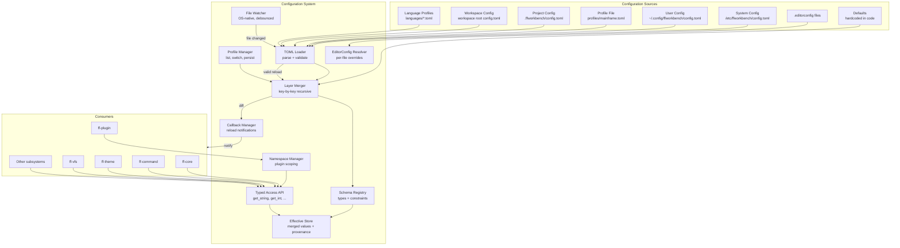

# Design Document: Configuration System (`ff-config`)

## 1. Overview

The `ff-config` crate is the **central settings management layer** for the FileForgeWorkbench workspace. It provides TOML-based configuration files, a layered override model with well-defined precedence, hot-reload without application restart, named user profiles, per-project overrides, EditorConfig integration, a typed access API with compile-time key definitions, plugin namespace scoping, and runtime-queryable schema validation.

### Purpose

- Load, merge, validate, watch, and serve configuration values to all platform subsystems and plugins
- Implement a fixed six-layer priority model: Defaults → System → User → Profile → Project → Workspace
- Provide typed, provenance-aware access to effective configuration values
- Support hot-reload with debounced file watching and atomic change application
- Manage named user profiles with runtime switching
- Integrate EditorConfig for per-file editor settings
- Enforce plugin namespace isolation and schema-based validation
- Expose a queryable schema registry for settings UI generation

### Position in Architecture

```
Wave 2 — Platform Architecture (depends on Wave 0 ff-logging)

┌─────────────────────────────────────────────────────────┐
│                    Application Binary                     │
│                (ffwb / GUI shell — ff-desktop)            │
├─────────────────────────────────────────────────────────┤
│  workflow-engine │ layout-and-docking │ document-model    │
│  edit-operations │ theme │ vfs │ all feature crates      │
├─────────────────────────────────────────────────────────┤
│  platform-core │ command-framework │ plugin-architecture │
│              ff-config (THIS CRATE) — Wave 2              │
├─────────────────────────────────────────────────────────┤
│                     ff-logging (Wave 0)                   │
└─────────────────────────────────────────────────────────┘
```

### Design Constraints (Cross-Cutting)

- **FFW-ARCH-001 (Req 1)**: Configuration files are NOT accessed via VFS — config uses direct filesystem access since it initializes before VFS
- **GUI Independence (Req 2)**: Zero GUI dependencies — no egui, no windowing crate imports
- **Plugin Architecture (Req 3)**: Provides scoped `PluginConfigHandle` for plugin namespace isolation
- **Configuration Namespace (FFW Req 5)**: All keys unique, layered model, hot-reload, namespace prefixes, language profiles in separate files
- **Multi-Crate Workspace (Req 7)**: Crate at `crates/ff-config`
- **Error Message Standards (Req 8)**: Consistent `[config] operation: description` error format

### Upstream Dependencies

- `ff-logging` (Wave 0): Used for all diagnostic output (WARN on invalid files, DEBUG on unknown keys)

### Downstream Consumers

- `ff-core`: Reads startup parameters, manages config lifecycle via `ConfigProvider` trait
- `ff-command`: Reads shortcut bindings
- `ff-plugin`: Reads plugin-specific namespaces via `PluginConfigHandle`
- `ff-theme`: Reads appearance settings
- `ff-vfs`: Reads provider settings
- `ff-logging`: Reads log level settings (after initial bootstrap)
- All other subsystems: Read their respective namespace settings

---

## 2. Architecture

### High-Level Architecture Diagram



### Layer Placement

| Component | Responsibility |
|-----------|---------------|
| **TOML Loader** | Parse TOML files, report syntax errors, per-layer file mapping |
| **Layer Merger** | Recursive key-by-key merge across all six layers |
| **Schema Registry** | Store key definitions, types, defaults, constraints; runtime-queryable |
| **Effective Store** | Hold merged values with provenance metadata |
| **File Watcher** | Monitor config files, debounce events (500ms), trigger reload |
| **Profile Manager** | Discover, activate, deactivate, persist profile selection |
| **EditorConfig Resolver** | Parse .editorconfig files, resolve per-file properties |
| **Typed Access API** | Type-safe getters with validation and fallback to defaults |
| **Callback Manager** | Register and invoke reload callbacks for changed keys |
| **Namespace Manager** | Enforce plugin namespace scoping, reject out-of-scope access |

---

## 3. Module Structure

```
crates/ff-config/
├── Cargo.toml
├── src/
│   ├── lib.rs                  # Public API re-exports, crate docs
│   ├── value.rs                # ConfigValue enum, ConfigTable type
│   ├── layer.rs                # ConfigLayer enum, layer precedence ordering
│   ├── loader.rs               # TOML file loading, parse error handling
│   ├── merger.rs               # Recursive key-by-key layer merge logic
│   ├── store.rs                # EffectiveStore: merged values + provenance
│   ├── schema/
│   │   ├── mod.rs              # Schema module re-exports
│   │   ├── registry.rs         # SchemaRegistry: key registration, lookup
│   │   ├── entry.rs            # SchemaEntry: type, default, constraints, description
│   │   └── constraint.rs       # Constraint types: min, max, enum, regex
│   ├── access.rs               # Typed getter API: get_string, get_int, etc.
│   ├── provenance.rs           # Provenance metadata type
│   ├── watcher.rs              # OS-native file watcher, debounce logic
│   ├── reload.rs               # Hot-reload orchestration, atomic apply
│   ├── callback.rs             # ReloadCallback registration and invocation
│   ├── profile.rs              # Profile manager: list, switch, persist
│   ├── editorconfig/
│   │   ├── mod.rs              # EditorConfig module re-exports
│   │   ├── parser.rs           # .editorconfig file parser
│   │   └── resolver.rs         # Per-file property resolution (path traversal)
│   ├── namespace.rs            # Plugin namespace scoping and enforcement
│   ├── plugin_handle.rs        # PluginConfigHandle: scoped read/write API
│   ├── paths.rs                # Platform-specific config file path resolution
│   ├── keys.rs                 # Compile-time const key definitions for core settings
│   ├── init.rs                 # Initialization sequence, directory detection
│   └── error.rs                # ConfigError enum
└── tests/
    ├── layer_merge_tests.rs    # Layer merge property tests
    ├── schema_tests.rs         # Schema validation property tests
    ├── reload_tests.rs         # Hot-reload property tests
    ├── profile_tests.rs        # Profile switching property tests
    ├── editorconfig_tests.rs   # EditorConfig resolution property tests
    ├── namespace_tests.rs      # Plugin namespace isolation tests
    └── integration.rs          # End-to-end initialization and access tests
```

---

## 4. Key Data Models

### ConfigValue

```rust
/// Represents any configuration value. Maps to TOML value types.
/// Addresses: Requirement 1, criterion 4; Requirement 7, criterion 7
#[derive(Debug, Clone, PartialEq)]
#[non_exhaustive]
pub enum ConfigValue {
    String(String),
    Integer(i64),
    Float(f64),
    Boolean(bool),
    Array(Vec<ConfigValue>),
    Table(ConfigTable),
}
```

### ConfigTable

```rust
/// A table of key-value pairs within a configuration namespace.
/// Addresses: Requirement 1, criterion 3
pub type ConfigTable = std::collections::BTreeMap<String, ConfigValue>;
```

### ConfigLayer

```rust
/// The fixed set of configuration layers in ascending priority order.
/// Addresses: Requirement 2, criteria 1/4
#[derive(Debug, Clone, Copy, PartialEq, Eq, PartialOrd, Ord, Hash)]
#[non_exhaustive]
pub enum ConfigLayer {
    /// Hardcoded defaults from schema definitions (lowest priority)
    Defaults = 0,
    /// System-wide configuration file
    System = 1,
    /// Per-user configuration file
    User = 2,
    /// Active named profile overlay
    Profile = 3,
    /// Project-level configuration (.ffworkbench/config.toml)
    Project = 4,
    /// Workspace-level configuration (highest file-based priority)
    Workspace = 5,
}
```

### Provenance

```rust
/// Metadata indicating where an effective value came from.
/// Addresses: Requirement 2, criterion 3
#[derive(Debug, Clone, PartialEq, Eq)]
pub struct Provenance {
    /// Which layer provided this value
    pub layer: ConfigLayer,
    /// The file path that sourced this value (None for Defaults layer)
    pub source_file: Option<PathBuf>,
}
```

### EffectiveValue

```rust
/// A resolved configuration value paired with its provenance.
/// Addresses: Requirement 2, criteria 2/3
#[derive(Debug, Clone)]
pub struct EffectiveValue {
    /// The final resolved value after layer merge
    pub value: ConfigValue,
    /// Which layer provided this value
    pub provenance: Provenance,
}
```

### SchemaEntry

```rust
/// Definition of a single configuration key in the schema.
/// Addresses: Requirement 9, criteria 1/2/3
#[derive(Debug, Clone)]
pub struct SchemaEntry {
    /// Dot-separated key path (e.g., "editor.tab_size")
    pub key: String,
    /// Expected value type
    pub value_type: ValueType,
    /// Default value (required for all schema entries)
    pub default: ConfigValue,
    /// Human-readable description for settings UI
    pub description: String,
    /// Optional validation constraints
    pub constraints: Option<Constraints>,
}
```

### ValueType

```rust
/// Declared type for a configuration key.
/// Addresses: Requirement 1, criterion 4; Requirement 9, criterion 2
#[derive(Debug, Clone, Copy, PartialEq, Eq)]
pub enum ValueType {
    String,
    Integer,
    Float,
    Boolean,
    Array,
    Table,
}
```

### Constraints

```rust
/// Optional validation constraints for a schema entry.
/// Addresses: Requirement 7, criteria 4/5/6; Requirement 9, criterion 3
#[derive(Debug, Clone)]
pub struct Constraints {
    /// Minimum value (for Integer and Float types)
    pub min: Option<f64>,
    /// Maximum value (for Integer and Float types)
    pub max: Option<f64>,
    /// Set of allowed string or integer values (enum constraint)
    pub allowed_values: Option<Vec<ConfigValue>>,
    /// Regex pattern for string validation
    pub pattern: Option<String>,
}
```

### LayerData

```rust
/// The parsed content of a single configuration layer.
/// Internal to the merge engine.
pub(crate) struct LayerData {
    /// Which layer this data belongs to
    pub layer: ConfigLayer,
    /// Source file path (None for Defaults)
    pub source: Option<PathBuf>,
    /// The parsed table of key-value pairs (recursive)
    pub values: ConfigTable,
}
```

### ReloadEvent

```rust
/// Describes a set of configuration changes detected during hot-reload.
/// Addresses: Requirement 3, criteria 3/5
#[derive(Debug, Clone)]
pub struct ReloadEvent {
    /// Keys whose effective value changed
    pub changed_keys: Vec<String>,
    /// The layer that was reloaded
    pub source_layer: ConfigLayer,
    /// Timestamp of the reload
    pub timestamp: std::time::Instant,
}
```

### UserProfile

```rust
/// Metadata for a discovered user profile.
/// Addresses: Requirement 4, criteria 1/7
#[derive(Debug, Clone, PartialEq, Eq)]
pub struct UserProfile {
    /// Profile name (derived from filename without extension)
    pub name: String,
    /// Path to the profile's TOML file
    pub path: PathBuf,
}
```

### EditorConfigProperties

```rust
/// Resolved EditorConfig properties for a specific file.
/// Addresses: Requirement 6, criteria 1/2
#[derive(Debug, Clone, Default)]
pub struct EditorConfigProperties {
    pub indent_style: Option<IndentStyle>,
    pub indent_size: Option<u32>,
    pub tab_width: Option<u32>,
    pub end_of_line: Option<EndOfLine>,
    pub charset: Option<Charset>,
    pub trim_trailing_whitespace: Option<bool>,
    pub insert_final_newline: Option<bool>,
}

#[derive(Debug, Clone, Copy, PartialEq, Eq)]
pub enum IndentStyle {
    Space,
    Tab,
}

#[derive(Debug, Clone, Copy, PartialEq, Eq)]
pub enum EndOfLine {
    Lf,
    CrLf,
    Cr,
}

#[derive(Debug, Clone, Copy, PartialEq, Eq)]
pub enum Charset {
    Utf8,
    Utf8Bom,
    Latin1,
    Utf16Be,
    Utf16Le,
}
```

### ConfigSystem (internal runtime state)

```rust
/// The runtime state of the configuration system. Not public.
/// Holds all layers, the schema, the watcher, and the callback registry.
pub(crate) struct ConfigSystem {
    /// Parsed data for each layer
    layers: Vec<LayerData>,
    /// The merged effective store
    store: EffectiveStore,
    /// The schema registry
    schema: SchemaRegistry,
    /// File watcher handle
    watcher: Option<FileWatcherHandle>,
    /// Registered reload callbacks
    callbacks: CallbackRegistry,
    /// Currently active profile (if any)
    active_profile: Option<String>,
    /// Profile manager
    profiles: ProfileManager,
    /// Plugin namespace registry
    namespaces: NamespaceRegistry,
}
```

---

## 5. Public API Surface

### Initialization and Lifecycle

```rust
/// Initialize the configuration system. Loads all available layers,
/// validates against the schema, starts the file watcher.
/// Must be called after ff-logging is initialized.
///
/// Addresses: Requirement 1, criteria 1/2; Requirement 2, criterion 1
pub fn init(options: ConfigInitOptions) -> Result<ConfigHandle, ConfigError>;

/// Options for initializing the configuration system.
pub struct ConfigInitOptions {
    /// Override the project root directory (auto-detected if None)
    pub project_root: Option<PathBuf>,
    /// Override the workspace root directory (auto-detected if None)
    pub workspace_root: Option<PathBuf>,
    /// Whether to start file watching (default: true)
    pub enable_hot_reload: bool,
}

/// Handle providing access to the initialized configuration system.
/// Thread-safe, clonable, and shareable across subsystems.
///
/// Addresses: Requirement 7, criterion 1
#[derive(Clone)]
pub struct ConfigHandle {
    inner: Arc<RwLock<ConfigSystem>>,
}

/// Shut down the configuration system. Stops file watching,
/// deregisters all callbacks.
pub fn shutdown(handle: &ConfigHandle);
```

### Typed Access API

```rust
impl ConfigHandle {
    /// Get a string value for the given key.
    /// Returns schema default if value is missing, wrong type, or fails validation.
    ///
    /// Addresses: Requirement 7, criteria 1/5/6
    pub fn get_string(&self, key: &str) -> Result<String, ConfigError>;

    /// Get an integer value for the given key.
    /// Addresses: Requirement 7, criteria 1/5/6
    pub fn get_int(&self, key: &str) -> Result<i64, ConfigError>;

    /// Get a float value for the given key.
    /// Addresses: Requirement 7, criteria 1/5/6
    pub fn get_float(&self, key: &str) -> Result<f64, ConfigError>;

    /// Get a boolean value for the given key.
    /// Addresses: Requirement 7, criteria 1/5/6
    pub fn get_bool(&self, key: &str) -> Result<bool, ConfigError>;

    /// Get an array value for the given key.
    /// Addresses: Requirement 7, criterion 1
    pub fn get_array(&self, key: &str) -> Result<Vec<ConfigValue>, ConfigError>;

    /// Get a table value for the given key.
    /// Addresses: Requirement 7, criterion 1
    pub fn get_table(&self, key: &str) -> Result<ConfigTable, ConfigError>;

    /// Get the generic effective value without type coercion.
    /// Addresses: Requirement 7, criterion 7
    pub fn get(&self, key: &str) -> Result<ConfigValue, ConfigError>;

    /// Get the effective value with full provenance information.
    /// Addresses: Requirement 2, criterion 3
    pub fn get_with_provenance(&self, key: &str) -> Result<EffectiveValue, ConfigError>;
}
```

### Hot-Reload and Callbacks

```rust
/// A type-erased callback invoked when watched configuration keys change.
/// Addresses: Requirement 3, criterion 4
pub type ReloadCallback = Box<dyn Fn(&ReloadEvent) + Send + Sync>;

/// Handle returned when registering a callback; used for deregistration.
#[derive(Debug, Clone, PartialEq, Eq, Hash)]
pub struct CallbackHandle(u64);

impl ConfigHandle {
    /// Register a reload callback for specific keys. The callback is invoked
    /// when any of the specified keys' effective values change during hot-reload.
    ///
    /// Addresses: Requirement 3, criteria 3/4
    pub fn on_reload(
        &self,
        keys: &[&str],
        callback: ReloadCallback,
    ) -> CallbackHandle;

    /// Deregister a previously registered reload callback.
    pub fn remove_callback(&self, handle: CallbackHandle);

    /// Force a manual reload of all configuration files. Useful for testing
    /// or when a subsystem knows its config has changed externally.
    ///
    /// Addresses: Requirement 3, criteria 2/3
    pub fn reload(&self) -> Result<ReloadEvent, ConfigError>;
}
```

### Profile Management

```rust
impl ConfigHandle {
    /// List all available user profiles by scanning the profiles directory.
    ///
    /// Addresses: Requirement 4, criterion 7
    pub fn list_profiles(&self) -> Vec<UserProfile>;

    /// Get the currently active profile name, if any.
    pub fn active_profile(&self) -> Option<String>;

    /// Switch to a named profile. Recomputes effective values and invokes
    /// reload callbacks for changed keys. Pass None to deactivate.
    ///
    /// Addresses: Requirement 4, criteria 3/4
    pub fn set_active_profile(&self, profile_name: Option<&str>) -> Result<ReloadEvent, ConfigError>;
}
```

### Project Layer Management

```rust
impl ConfigHandle {
    /// Load project-layer configuration from the given project root.
    /// Called when a project is opened.
    ///
    /// Addresses: Requirement 5, criteria 1/2
    pub fn load_project(&self, project_root: &Path) -> Result<ReloadEvent, ConfigError>;

    /// Unload the project-layer configuration. Called when a project is closed.
    /// Recomputes effective values and notifies callbacks.
    ///
    /// Addresses: Requirement 5, criterion 6
    pub fn unload_project(&self) -> Result<ReloadEvent, ConfigError>;
}
```

### EditorConfig Resolution

```rust
impl ConfigHandle {
    /// Resolve EditorConfig properties for a specific file path.
    /// Traverses parent directories from the file up to a root = true file.
    /// Returns only the properties defined by EditorConfig; None fields mean
    /// "not specified by EditorConfig, use normal config resolution."
    ///
    /// Addresses: Requirement 6, criteria 1/2/3/4/5
    pub fn resolve_editorconfig(&self, file_path: &Path) -> EditorConfigProperties;
}
```

### Schema Registry

```rust
impl ConfigHandle {
    /// Register a new schema entry. Called by core subsystems at startup
    /// and by plugins during initialization.
    ///
    /// Addresses: Requirement 9, criteria 1/7
    pub fn register_schema(&self, entry: SchemaEntry) -> Result<(), ConfigError>;

    /// Register multiple schema entries at once.
    pub fn register_schema_batch(&self, entries: Vec<SchemaEntry>) -> Result<(), ConfigError>;

    /// Query the schema: get the entry for a specific key.
    ///
    /// Addresses: Requirement 9, criterion 5
    pub fn get_schema_entry(&self, key: &str) -> Option<&SchemaEntry>;

    /// Enumerate all registered schema keys with their metadata.
    /// Used by settings UI for auto-generation.
    ///
    /// Addresses: Requirement 9, criterion 5
    pub fn list_schema_entries(&self) -> Vec<&SchemaEntry>;

    /// Remove schema entries for a specific namespace prefix.
    /// Called during plugin unload.
    ///
    /// Addresses: Requirement 8, criterion 6
    pub fn deregister_schema(&self, prefix: &str);
}
```

### Plugin Configuration Scoping

```rust
/// A scoped configuration handle provided to plugins via PluginContext.
/// Restricts access to the plugin's own namespace only.
///
/// Addresses: Requirement 8, criteria 1/2/3
pub struct PluginConfigHandle {
    /// The plugin's namespace prefix (e.g., "plugins.sql-viewer")
    namespace: String,
    /// Reference to the underlying config system
    inner: ConfigHandle,
}

impl PluginConfigHandle {
    /// Get a string value within the plugin's namespace.
    /// Key is relative to the plugin namespace (e.g., "max_rows" → "plugins.sql-viewer.max_rows").
    ///
    /// Addresses: Requirement 8, criterion 2
    pub fn get_string(&self, key: &str) -> Result<String, ConfigError>;

    /// Get an integer value within the plugin's namespace.
    pub fn get_int(&self, key: &str) -> Result<i64, ConfigError>;

    /// Get a float value within the plugin's namespace.
    pub fn get_float(&self, key: &str) -> Result<f64, ConfigError>;

    /// Get a boolean value within the plugin's namespace.
    pub fn get_bool(&self, key: &str) -> Result<bool, ConfigError>;

    /// Get any value within the plugin's namespace.
    pub fn get(&self, key: &str) -> Result<ConfigValue, ConfigError>;

    /// Write a value to the plugin's namespace (persists to user-layer file).
    ///
    /// Addresses: Requirement 8, criterion 2
    pub fn set(&self, key: &str, value: ConfigValue) -> Result<(), ConfigError>;

    /// Register a reload callback for keys in this plugin's namespace.
    ///
    /// Addresses: Requirement 8, criterion 5
    pub fn on_reload(&self, keys: &[&str], callback: ReloadCallback) -> CallbackHandle;

    /// Returns the plugin's namespace prefix.
    pub fn namespace(&self) -> &str;
}

/// Create a scoped plugin config handle. Called by the plugin architecture
/// when constructing PluginContext.
///
/// Addresses: Requirement 8, criteria 1/2
pub fn create_plugin_config_handle(
    config: &ConfigHandle,
    plugin_name: &str,
) -> Result<PluginConfigHandle, ConfigError>;
```

### ConfigProvider Trait Implementation

```rust
/// ff-config implements the ConfigProvider trait defined by ff-core,
/// bridging the configuration system to the core layer.
///
/// Addresses: Integration with ff-core (see platform-core design §5)
impl ff_core::ConfigProvider for ConfigHandle {
    fn get<T: serde::de::DeserializeOwned>(&self, namespace: &str, key: &str) -> Option<T>;
    fn get_namespace(&self, namespace: &str) -> Option<toml::Value>;
}
```

### Compile-Time Key Definitions

```rust
/// Compile-time key constants for core settings.
/// Consumers use these instead of string literals to catch typos at compile time.
///
/// Addresses: Requirement 7, criterion 2
pub mod keys {
    // Editor settings
    pub const EDITOR_TAB_SIZE: &str = "editor.tab_size";
    pub const EDITOR_INDENT_STYLE: &str = "editor.indent_style";
    pub const EDITOR_LINE_ENDINGS: &str = "editor.line_endings";
    pub const EDITOR_TRIM_TRAILING_WHITESPACE: &str = "editor.trim_trailing_whitespace";
    pub const EDITOR_INSERT_FINAL_NEWLINE: &str = "editor.insert_final_newline";

    // Logging settings
    pub const LOGGING_LEVEL: &str = "logging.level";
    pub const LOGGING_DIRECTORY: &str = "logging.directory";
    pub const LOGGING_MAX_FILE_SIZE_MB: &str = "logging.max_file_size_mb";
    pub const LOGGING_MAX_RETAINED_FILES: &str = "logging.max_retained_files";

    // Theme settings
    pub const THEME_ACTIVE: &str = "theme.active";
    pub const THEME_FONT_SIZE: &str = "theme.font_size";

    // VFS settings
    pub const VFS_DEFAULT_PROVIDER: &str = "vfs.default_provider";
}
```

---

## 6. Error Types

```rust
/// Errors originating from the ff-config crate.
/// Formatted per Error Message Standards: `[config] operation: description`
///
/// Addresses: Cross-cutting Requirement 8
#[derive(Debug, thiserror::Error)]
#[non_exhaustive]
pub enum ConfigError {
    /// Configuration file contains invalid TOML syntax
    /// Addresses: Requirement 1, criterion 6
    #[error("[config] parse: invalid TOML in '{path}': {detail}")]
    ParseError {
        path: PathBuf,
        detail: String,
    },

    /// A configuration key is not defined in any layer and has no schema default
    /// Addresses: Requirement 2, criterion 6
    #[error("[config] get: key '{key}' is undefined (no schema entry and not set in any layer)")]
    UndefinedKey {
        key: String,
    },

    /// Type mismatch between requested type and stored value
    /// Addresses: Requirement 7, criterion 5
    #[error("[config] get: type mismatch for key '{key}' — expected {expected}, found {actual}")]
    TypeMismatch {
        key: String,
        expected: ValueType,
        actual: ValueType,
    },

    /// Value failed schema validation constraints
    /// Addresses: Requirement 7, criterion 6; Requirement 9, criterion 4
    #[error("[config] validate: key '{key}' value {value} violates constraint: {constraint}")]
    ValidationFailed {
        key: String,
        value: String,
        constraint: String,
    },

    /// Plugin attempted to access a key outside its namespace
    /// Addresses: Requirement 8, criterion 3
    #[error("[config] namespace: plugin '{plugin}' cannot access key '{key}' (outside namespace '{namespace}')")]
    NamespaceViolation {
        plugin: String,
        key: String,
        namespace: String,
    },

    /// Plugin name contains invalid characters
    /// Addresses: Requirement 8, criterion 1
    #[error("[config] namespace: invalid plugin name '{name}' — must be lowercase ASCII, hyphens, and digits only")]
    InvalidPluginName {
        name: String,
    },

    /// Plugin attempted to register keys in a reserved core namespace
    /// Addresses: Requirement 8, criterion 7
    #[error("[config] namespace: plugin '{plugin}' cannot register keys in reserved namespace '{namespace}'")]
    ReservedNamespace {
        plugin: String,
        namespace: String,
    },

    /// Profile file not found or unreadable
    /// Addresses: Requirement 4, criterion 6
    #[error("[config] profile: profile '{name}' not found at '{path}'")]
    ProfileNotFound {
        name: String,
        path: PathBuf,
    },

    /// File watcher initialization failed
    #[error("[config] watcher: failed to initialize file watcher: {reason}")]
    WatcherError {
        reason: String,
    },

    /// I/O error reading configuration file
    /// Addresses: Requirement 5, criterion 7
    #[error("[config] io: failed to read '{path}': {source}")]
    Io {
        path: PathBuf,
        source: std::io::Error,
    },

    /// Schema registration conflict (duplicate key with different type)
    #[error("[config] schema: key '{key}' already registered with type {existing_type:?}, cannot re-register as {new_type:?}")]
    SchemaConflict {
        key: String,
        existing_type: ValueType,
        new_type: ValueType,
    },

    /// EditorConfig file parse error
    /// Addresses: Requirement 6, criterion 6
    #[error("[config] editorconfig: parse error in '{path}': {detail}")]
    EditorConfigParseError {
        path: PathBuf,
        detail: String,
    },
}
```

---

## 7. Integration Points

### With `ff-logging` (Foundation Layer — upstream)

- **Dependency direction**: ff-config depends on ff-logging
- **API consumed**: `log_warn!`, `log_debug!`, `log_info!` macros
- **Usage**: Emit WARN on parse errors (Req 1.6), type mismatches (Req 7.5), validation failures (Req 7.6, 9.4), profile not found (Req 4.6), EditorConfig errors (Req 6.6). Emit DEBUG on unknown keys (Req 9.6)
- **Bootstrap**: ff-config initializes **after** ff-logging is already active. No circular dependency.

### With `ff-core` (Core Layer — peer, downstream consumer)

- **Dependency direction**: ff-core depends on ff-config via the `ConfigProvider` trait
- **API exposed**: `ConfigHandle` implements `ff_core::ConfigProvider`
- **Initialization**: ff-core calls `ff_config::init()` as the second subsystem in its startup sequence (after logging). The returned `ConfigHandle` is stored in the ServiceRegistry
- **Hot-reload integration**: When ff-config detects file changes, it invokes registered callbacks. ff-core subscribes to config changes and dispatches `ConfigReloaded` through its Event Bus
- **Shutdown**: ff-core calls `ff_config::shutdown()` during its ordered teardown

### With `ff-plugin` (Core Layer — peer, downstream consumer)

- **Dependency direction**: ff-plugin depends on ff-config for `PluginConfigHandle`
- **API exposed**: `create_plugin_config_handle(config, plugin_name)` creates a scoped handle
- **Usage**: When ff-plugin constructs a `PluginContext`, it calls `create_plugin_config_handle` to provide each plugin with isolated config access
- **Plugin defaults**: During plugin initialization, ff-plugin calls `register_schema_batch()` with the plugin's declared default configuration values (Req 8.4)
- **Plugin unload**: During plugin shutdown, ff-plugin calls `deregister_schema(prefix)` to remove the plugin's schema entries (Req 8.6)

### With `ff-command` (Core Layer — peer, downstream consumer)

- **Dependency direction**: ff-command depends on ff-config for reading keybinding settings
- **API consumed**: `ConfigHandle::get_table("commands.keybindings")`
- **Hot-reload**: ff-command registers reload callbacks for its configuration keys

### With `ff-theme` (downstream consumer)

- **Dependency direction**: ff-theme depends on ff-config for appearance settings
- **API consumed**: `ConfigHandle::get_string(keys::THEME_ACTIVE)`, font size, color scheme
- **Hot-reload**: Theme changes applied immediately via reload callbacks

### With `ff-vfs` (downstream consumer)

- **Dependency direction**: ff-vfs depends on ff-config for provider settings
- **API consumed**: `ConfigHandle::get_string(keys::VFS_DEFAULT_PROVIDER)`, provider-specific tables

### With `edit-operations` and `document-model` (downstream consumers)

- **Dependency direction**: These crates depend on ff-config for editor settings
- **API consumed**: `ConfigHandle::get_int(keys::EDITOR_TAB_SIZE)`, indent style, line endings
- **EditorConfig integration**: These crates call `resolve_editorconfig(file_path)` to get per-file overrides that take precedence over normal config (Req 6.3)

### Dependency Direction Summary

```
ff-logging ← ff-config ← ff-core
                        ← ff-command
                        ← ff-plugin
                        ← ff-theme
                        ← ff-vfs
                        ← edit-operations
                        ← document-model
                        ← (all other subsystems)
```

`ff-config` depends on NO other workspace crates except `ff-logging`. External dependencies:
- `toml` — TOML parsing
- `notify` — Cross-platform file watching (inotify, ReadDirectoryChangesW, FSEvents)
- `dirs` — Platform-appropriate default directories
- `regex` — Pattern validation for string constraints
- `thiserror` — Error type derivation
- `serde` / `serde_derive` — Serialization for ConfigProvider trait
- `proptest` — Property-based testing (dev-dependency only)

---

## 8. Configuration (Meta)

The configuration system configures itself using a minimal bootstrap. Since ff-config cannot read its own settings before it initializes, it uses hardcoded defaults and environment variables for its own operational parameters.

### Bootstrap Configuration

| Parameter | Source | Default |
|-----------|--------|---------|
| System config path | Platform convention | `/etc/ffworkbench/config.toml` (Linux), `%PROGRAMDATA%\FFWorkbench\config.toml` (Windows) |
| User config path | Platform convention | `~/.config/ffworkbench/config.toml` (Linux), `%APPDATA%\FFWorkbench\config.toml` (Windows) |
| User profiles dir | Platform convention | `~/.config/ffworkbench/profiles/` (Linux), `%APPDATA%\FFWorkbench\profiles\` (Windows) |
| Languages dir | Relative to config | `languages/` subdirectory of user config dir |
| Debounce window | Hardcoded | 500 milliseconds (Req 3.7) |
| Hot-reload detection | Hardcoded | Within 2 seconds (Req 3.2) |
| Watcher enabled | `ConfigInitOptions` | `true` |

### File Layout

```
System layer:
  /etc/ffworkbench/config.toml          (Linux)
  %PROGRAMDATA%\FFWorkbench\config.toml (Windows)
  /Library/Application Support/FFWorkbench/config.toml (macOS)

User layer:
  ~/.config/ffworkbench/config.toml          (Linux)
  %APPDATA%\FFWorkbench\config.toml          (Windows)
  ~/Library/Application Support/FFWorkbench/config.toml (macOS)

Profiles:
  ~/.config/ffworkbench/profiles/mainframe.toml
  ~/.config/ffworkbench/profiles/web-dev.toml

Languages:
  ~/.config/ffworkbench/languages/rust.toml
  ~/.config/ffworkbench/languages/cobol.toml

Project layer:
  <project-root>/.ffworkbench/config.toml

Workspace layer:
  <workspace-root>/config.toml
```

### Active Profile Persistence

The currently active profile name is persisted in the user-layer config file under a special key:

```toml
[_session]
active_profile = "mainframe"
```

This key is read during initialization to auto-activate the last-used profile (Req 4.5).

---

## 9. Concurrency Model

### Thread-Safety Approach

| Component | Mechanism | Rationale |
|-----------|-----------|-----------|
| ConfigHandle | `Arc<RwLock<ConfigSystem>>` | Multiple readers, single writer during reload |
| Effective Store reads | `RwLock` read guard | Concurrent reads from any thread without blocking |
| Hot-reload writes | `RwLock` write guard (brief) | Atomic swap of effective values during reload |
| File watcher | Dedicated OS thread (via `notify` crate) | Watches filesystem events independently |
| Callback invocation | Called under read guard release | Callbacks run after state update, no lock held |
| Schema registry | Protected by same `RwLock` | Schema grows during plugin init, then mostly reads |

### Reload Concurrency Model

```
┌──────────────┐       ┌──────────────────────────┐       ┌──────────────────┐
│ Watcher Thread│──────▶│ Debounce Timer (500ms)   │──────▶│ Reload Executor   │
│ (notify crate)│       │ coalesce rapid events    │       │ (same or pool thd)│
└──────────────┘       └──────────────────────────┘       └──────────────────┘
                                                                    │
                                                                    ▼
                                                          ┌──────────────────┐
                                                          │ 1. Re-read file   │
                                                          │ 2. Parse TOML     │
                                                          │ 3. Validate schema│
                                                          │ 4. Acquire write  │
                                                          │    lock (brief)   │
                                                          │ 5. Swap layer data│
                                                          │ 6. Recompute merge│
                                                          │ 7. Diff changed   │
                                                          │ 8. Release lock   │
                                                          │ 9. Invoke callbacks│
                                                          └──────────────────┘
```

Addresses: Requirement 3, criteria 2/3/5/7

### Atomicity Guarantee

The write lock is held only for the brief moment of swapping layer data and recomputing the effective store. All I/O (file reading, TOML parsing, schema validation) happens **before** acquiring the write lock. Callbacks are invoked **after** releasing the write lock, ensuring they see the new state without holding the lock (Req 3.5).

### Read Access Pattern

All typed getters (`get_string`, `get_int`, etc.) acquire a read lock on the effective store. Multiple threads can read concurrently. The read lock is released before returning — callers receive owned values (cloned), never references into the store.

### Plugin Write Access

Plugin `set()` operations:
1. Validate the key is within the plugin's namespace
2. Validate the value against schema constraints
3. Acquire write lock briefly to update the user-layer data
4. Recompute effective values for the affected key
5. Release write lock
6. Persist to user-layer config file (async, fire-and-forget with retry)
7. Invoke callbacks if effective value changed

---

## 10. Correctness Properties

These properties are suitable for property-based testing with `proptest`. They validate invariants that must hold across all valid inputs.

### Property 1: Layer Precedence Determinism

**Statement**: For any set of layer values for the same key, the effective value is always the value from the highest-priority layer that defines the key. The result is deterministic and independent of insertion order.

**Validates**: Requirement 2, criteria 1/2

```rust
// proptest strategy: generate Vec<(ConfigLayer, ConfigValue)> with same key
// assertion: effective_value == value from max(layer) that defines the key
```

### Property 2: Recursive Table Merge

**Statement**: For any two TOML tables at different layers defining overlapping keys within a nested table, the merge produces a table containing all keys from both layers, with higher-priority values winning on conflict — recursively for nested tables.

**Validates**: Requirement 2, criterion 7

```rust
// proptest strategy: generate two ConfigTable values with overlapping/disjoint keys
// assertion: merged table contains union of keys; conflicting keys use higher-layer value;
//            nested tables merged recursively (not replaced wholesale)
```

### Property 3: Schema Validation Fallback

**Statement**: For any schema entry with a default value, and any stored value that violates the schema constraints (wrong type, out of range, not in enum set, fails regex), the typed getter returns the schema default — never the invalid value.

**Validates**: Requirement 7, criteria 5/6; Requirement 9, criterion 4

```rust
// proptest strategy: generate SchemaEntry with constraints; generate ConfigValue that violates them
// assertion: get_typed(key) == schema.default; WARN log emitted
```

### Property 4: Namespace Isolation

**Statement**: For any plugin name P and any key K where K does not start with `"plugins.{P}."`, accessing K through a PluginConfigHandle for P always returns a NamespaceViolation error.

**Validates**: Requirement 8, criterion 3

```rust
// proptest strategy: generate plugin_name (valid format); generate key not in namespace
// assertion: handle.get(key) == Err(ConfigError::NamespaceViolation { .. })
```

### Property 5: Hot-Reload Atomicity

**Statement**: For any reload event affecting N keys, either all N keys are updated to their new effective values simultaneously, or none are updated (the previous state is retained). There is no observable intermediate state where some keys reflect new values and others reflect old values from the same file.

**Validates**: Requirement 3, criterion 5

```rust
// proptest strategy: generate a set of key-value changes for a single layer file
// assertion: snapshot before reload and snapshot after reload differ in exactly the changed keys
//            (no partial update visible to concurrent readers)
```

### Property 6: Debounce Coalescing

**Statement**: For any sequence of file modification events for the same file arriving within a 500ms window, exactly one reload operation is performed. The reload uses the final file state (not any intermediate state).

**Validates**: Requirement 3, criterion 7

```rust
// proptest strategy: generate sequence of (file_path, timestamp) events within 500ms
// assertion: reload_count == 1 for that file within the window
```

### Property 7: Profile Layer Placement

**Statement**: For any active profile defining keys that are also defined in the User layer and the Project layer, the effective value for each key follows strictly: Project > Profile > User. Profile keys override User keys but are overridden by Project keys.

**Validates**: Requirement 4, criteria 2/3; Requirement 2, criterion 1

```rust
// proptest strategy: generate values for same key at User, Profile, Project layers
// assertion: effective == Project if set, else Profile if set, else User
```

### Property 8: EditorConfig Precedence

**Statement**: For any file path where EditorConfig defines a property (indent_style, tab_width, etc.), the EditorConfig value takes precedence over ALL configuration layers for that specific property for that specific file.

**Validates**: Requirement 6, criterion 3

```rust
// proptest strategy: generate a config value at Workspace layer + EditorConfig value for same file
// assertion: resolved value for that file == EditorConfig value (not Workspace value)
```

### Property 9: Unknown Key Tolerance

**Statement**: For any TOML file containing keys that have no schema entry, loading succeeds without error. The unknown keys are silently ignored (DEBUG log only, no WARN). All known keys in the file are loaded normally.

**Validates**: Requirement 9, criterion 6

```rust
// proptest strategy: generate a TOML table mixing known schema keys with arbitrary unknown keys
// assertion: load succeeds; known keys accessible with correct values; no WARN emitted
```

### Property 10: Provenance Accuracy

**Statement**: For any effective value returned by `get_with_provenance()`, the reported provenance layer and source file accurately reflect which layer and file provided the winning value. If the value comes from the Defaults layer, source_file is None.

**Validates**: Requirement 2, criterion 3

```rust
// proptest strategy: generate layers with various keys; query effective values
// assertion: provenance.layer == the highest-priority layer that set the key;
//            provenance.source_file matches the file for that layer (or None for Defaults)
```

### Property 11: Reserved Namespace Enforcement

**Statement**: For any plugin attempting to register schema keys under a reserved core namespace (`logging`, `editor`, `theme`, `vfs`, `commands`, `layout`), the registration fails with a ReservedNamespace error.

**Validates**: Requirement 8, criterion 7

```rust
// proptest strategy: generate plugin_name; generate key starting with reserved prefix
// assertion: register_schema(entry) == Err(ConfigError::ReservedNamespace { .. })
```

### Property 12: Profile Single-Activation Invariant

**Statement**: At any point in time, at most one profile is active. Activating a new profile automatically deactivates the previous one. After deactivation, no profile-layer values influence effective values.

**Validates**: Requirement 4, criteria 4/3

```rust
// proptest strategy: generate sequence of set_active_profile calls
// assertion: after each call, active_profile() == last set profile;
//            only one profile's values present in effective store at Profile layer
```

---

## Appendix A: External Crate Dependencies

| Crate | Version | Purpose |
|-------|---------|---------|
| `toml` | 0.8 | TOML parsing and serialization |
| `notify` | 6.0 | Cross-platform file system watcher (inotify, FSEvents, ReadDirectoryChangesW) |
| `dirs` | 5.0 | Platform-appropriate default directory paths |
| `regex` | 1.10 | String constraint pattern validation |
| `thiserror` | 2.0 | Error type derivation |
| `serde` | 1.0 | Serialization support for ConfigProvider trait |
| `serde_derive` | 1.0 | Derive macros for serde |
| `glob` | 0.3 | EditorConfig path pattern matching |
| `proptest` | 1.0 | Property-based testing (dev-dependency only) |

## Appendix B: Reserved Core Namespaces

The following top-level TOML table names are reserved for core subsystems. Plugins cannot register keys under these namespaces (Req 8.7):

| Namespace | Owner |
|-----------|-------|
| `logging` | ff-logging |
| `editor` | edit-operations, document-model |
| `theme` | ff-theme |
| `vfs` | ff-vfs |
| `commands` | ff-command |
| `layout` | layout-and-docking |
| `core` | ff-core |
| `_session` | ff-config (internal persistence) |

Plugins are scoped under `plugins.{plugin-name}.*` exclusively.

## Appendix C: Platform-Specific Configuration Paths

| Platform | System Config | User Config | User Profiles | Languages |
|----------|--------------|-------------|---------------|-----------|
| Linux | `/etc/ffworkbench/config.toml` | `$XDG_CONFIG_HOME/ffworkbench/config.toml` | `$XDG_CONFIG_HOME/ffworkbench/profiles/` | `$XDG_CONFIG_HOME/ffworkbench/languages/` |
| Windows | `%PROGRAMDATA%\FFWorkbench\config.toml` | `%APPDATA%\FFWorkbench\config.toml` | `%APPDATA%\FFWorkbench\profiles\` | `%APPDATA%\FFWorkbench\languages\` |
| macOS | `/Library/Application Support/FFWorkbench/config.toml` | `~/Library/Application Support/FFWorkbench/config.toml` | `~/Library/Application Support/FFWorkbench/profiles/` | `~/Library/Application Support/FFWorkbench/languages/` |

## Appendix D: EditorConfig Property Mapping

| EditorConfig Property | Maps to Config Key | Precedence |
|-----------------------|-------------------|------------|
| `indent_style` | `editor.indent_style` | EditorConfig wins (per-file) |
| `indent_size` | `editor.tab_size` | EditorConfig wins (per-file) |
| `tab_width` | `editor.tab_width` | EditorConfig wins (per-file) |
| `end_of_line` | `editor.line_endings` | EditorConfig wins (per-file) |
| `charset` | `editor.charset` | EditorConfig wins (per-file) |
| `trim_trailing_whitespace` | `editor.trim_trailing_whitespace` | EditorConfig wins (per-file) |
| `insert_final_newline` | `editor.insert_final_newline` | EditorConfig wins (per-file) |

EditorConfig properties only apply to the seven properties listed above. All other configuration keys are resolved through the normal layered model (Req 6.7).

---

## 11. Settings Panel

### 11.1 Overview

The Settings panel is a new `TabKind::SettingsPanel` rendered in `ff-desktop` as a new module
`settings_panel.rs`. It reads the live `ff-config` schema registry to auto-generate its UI —
no hard-coded field list is needed.

### 11.2 Architecture

```
POM option 0 / "0" / "SETTINGS" / "=0"
  → shell.rs: handle_command → set active tab kind to SettingsPanel
  → settings_panel::render(ui, state, config_handle)
      ├─ filter input (substring match on key + description)
      ├─ for each namespace group (sorted):
      │    └─ collapsible section header
      │         └─ for each key in group (sorted):
      │              ├─ description label
      │              ├─ provenance badge (Default / User / Project / …)
      │              ├─ value widget (checkbox / slider / dropdown / text)
      │              ├─ inline validation error (if any)
      │              └─ Reset to Default button (if overridden)
      └─ source file path footer
```

### 11.3 New Modules in `ff-desktop/src/`

- `settings_panel.rs` — egui render function and `SettingsPanelState`

### 11.4 New `TabKind` Variant

`TabKind` gains `SettingsPanel`. The central panel dispatch routes it to
`settings_panel::render(ui, state, config_handle)`.

### 11.5 Write Path

When the user confirms a changed value:
1. Validate against schema constraints (client-side, no file I/O).
2. Call `config_handle.set_user_value(key, value)` — a new method on `ConfigHandle` that
   writes the key to the user-layer TOML file and triggers a hot-reload cycle.
3. The hot-reload cycle recomputes effective values and invokes registered callbacks.
4. The Settings panel re-reads effective values on the next frame.

`set_user_value` is the only new API addition to `ff-config`. It writes to the user-layer
config file atomically (write to temp file, rename).

### 11.6 Reset Path

`Reset to Default` calls `config_handle.remove_user_value(key)` — removes the key from the
user-layer file and triggers a hot-reload cycle, restoring the schema default.

### 11.7 No Contradictions

- `ff-config` schema registry already exposes `list_schema_entries()` — no new query API needed.
- `get_with_provenance()` already exists — used to show the provenance badge.
- `TabKind` extension follows the same pattern as `FilesPanel` and `SettingsPanel`.
- Session persistence follows the same pattern as `FilesPanel`.
