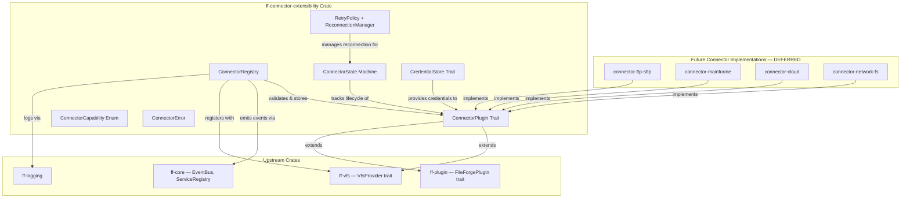

# Design Document: Connector Extensibility (`ff-connector-extensibility`)

## 1. Overview

The `ff-connector-extensibility` crate defines the **plugin trait and registration framework** that all future VFS connectors (FTP/SFTP, z/OS, cloud) must implement to integrate with the Virtual File System layer. It bridges the `VfsProvider` trait (from `ff-vfs`) with the `FileForgePlugin` trait (from `ff-plugin`), adding lifecycle management, capability advertisement, authentication, and error mapping specific to network-based connectors.

### Purpose

- Define the `ConnectorPlugin` trait combining VFS operations with plugin lifecycle
- Provide `ConnectorRegistry` for validated connector registration and discovery
- Define `ConnectorCapability` enum for runtime capability advertisement
- Define `ConnectorState` lifecycle state machine with reconnection logic
- Provide `CredentialStore` trait for secure credential management
- Define `ConnectorError` with retryable classification and error mapping
- Document integration hooks for future FTP/SFTP, z/OS, and cloud connectors

### Position in Architecture

```
┌─────────────────────────────────────────────────────────────┐
│              Shell Layer: ff-desktop (egui)                   │
├─────────────────────────────────────────────────────────────┤
│  Consuming crates query ConnectorRegistry for capabilities   │
├─────────────────────────────────────────────────────────────┤
│  ff-connector-extensibility (THIS CRATE) — Wave 3            │
│  Depends on: ff-vfs (VfsProvider), ff-plugin (FileForgePlugin)│
├─────────────────────────────────────────────────────────────┤
│  ff-vfs │ ff-plugin │ ff-core │ ff-command │ ff-logging      │
│              (Wave 2–3 — Platform + VFS)                      │
├─────────────────────────────────────────────────────────────┤
│                     ff-logging (Wave 0)                       │
└─────────────────────────────────────────────────────────────┘
```

### Design Constraints (Cross-Cutting)

- **FFW-ARCH-001 (Req 1)**: Connectors integrate through the VFS — no bypass
- **GUI Independence (Req 2)**: Zero GUI dependencies
- **Plugin Architecture (Req 3)**: Connectors are plugins with `FileForgePlugin` lifecycle
- **Async I/O (Req 6)**: Connection lifecycle methods are async
- **Multi-Crate Workspace (Req 7)**: Crate at `crates/ff-connector-extensibility`
- **Error Message Standards (Req 8)**: Errors follow `[connector:{scheme}] op: desc` format


---

## 2. Architecture

### High-Level Architecture Diagram



### Layer Placement

| Layer | Role |
|-------|------|
| **ConnectorPlugin Trait** | Combined contract: VfsProvider + FileForgePlugin + connector lifecycle |
| **ConnectorRegistry** | Validates, stores, and manages connector registrations |
| **ConnectorState** | State machine tracking connector connection lifecycle |
| **ReconnectionManager** | Automatic reconnection with exponential backoff |
| **CredentialStore** | Secure credential storage and retrieval interface |
| **ConnectorError** | Structured error type with retryable classification |

### Connector Lifecycle State Machine

```
                  register()
    (absent) ─────────────────▶ Registered
                                    │
                              connect()
                                    ▼
                               Connecting
                              /          \
                   success  /              \ failure
                          ▼                  ▼
                     Connected          Error(cause)
                         │                   │
              disconnect() │       retry_policy │ allows?
                         │         yes ──────────▶ Connecting
                         ▼         no  ──────────▶ Disconnected
                    Disconnecting
                         │
                    completed
                         ▼
                    Disconnected
```


---

## 3. Module Structure

```
crates/ff-connector-extensibility/
├── Cargo.toml
├── src/
│   ├── lib.rs                  # Public API re-exports, crate docs
│   ├── traits.rs               # ConnectorPlugin trait definition
│   ├── descriptor.rs           # ConnectorDescriptor metadata struct
│   ├── capability.rs           # ConnectorCapability enum, validation logic
│   ├── state.rs                # ConnectorState enum, state transition validation
│   ├── registry.rs             # ConnectorRegistry: register, deregister, lookup, hot-swap
│   ├── reconnection.rs         # RetryPolicy, ReconnectionManager, backoff logic
│   ├── credential.rs           # CredentialStore trait, Credential enum, SecureString/SecureBytes
│   ├── error.rs                # ConnectorError enum, is_retryable, From impls, Display
│   ├── api_version.rs          # ApiVersion type, compatibility checking
│   ├── custom_op.rs            # custom_operation escape hatch types
│   └── event.rs                # ConnectorRegistered, ConnectorStateChanged events
└── tests/
    ├── trait_tests.rs          # ConnectorPlugin object-safety and trait bound tests
    ├── capability_tests.rs     # Capability validation and query property tests
    ├── state_tests.rs          # State machine transition property tests
    ├── registry_tests.rs       # ConnectorRegistry registration/deregistration tests
    ├── reconnection_tests.rs   # RetryPolicy and backoff property tests
    ├── credential_tests.rs     # CredentialStore scoping and security tests
    ├── error_tests.rs          # Error mapping, Display format, retryable classification
    └── integration.rs          # End-to-end register → connect → disconnect flow
```


---

## 4. Key Data Models and Types

### ConnectorPlugin Trait

```rust
/// The combined trait that all VFS connectors must implement.
/// Extends VfsProvider (file operations) and FileForgePlugin (plugin lifecycle)
/// with connector-specific lifecycle, authentication, and capability methods.
///
/// Object-safe — the ConnectorRegistry stores connectors as `Box<dyn ConnectorPlugin>`.
///
/// Addresses: Requirement 1, all acceptance criteria
#[async_trait::async_trait]
pub trait ConnectorPlugin: VfsProvider + FileForgePlugin {
    /// Returns the connector's metadata descriptor.
    /// Addresses: Requirement 1 AC 2
    fn descriptor(&self) -> &ConnectorDescriptor;

    /// Returns the complete list of VFS operations this connector supports.
    /// Addresses: Requirement 1 AC 3
    fn connector_capabilities(&self) -> &[ConnectorCapability];

    /// Returns the VFS core API version this connector was built against.
    /// Used for compatibility checking at registration time.
    /// Addresses: Requirement 1 AC 4
    fn api_version(&self) -> ApiVersion;

    /// Returns the current connection lifecycle state.
    /// Addresses: Requirement 4 AC 2
    fn state(&self) -> ConnectorState;

    /// Establish a connection to the remote service.
    /// Transitions from Registered/Disconnected → Connecting → Connected.
    /// Addresses: Requirement 1 AC 6, Requirement 4 AC 1
    async fn connect(&mut self) -> Result<(), ConnectorError>;

    /// Gracefully disconnect from the remote service.
    /// Transitions from Connected → Disconnecting → Disconnected.
    /// Addresses: Requirement 1 AC 6, Requirement 4 AC 6
    async fn disconnect(&mut self) -> Result<(), ConnectorError>;

    /// Authenticate using credentials from the credential store.
    /// Called during the connection phase.
    /// Addresses: Requirement 5 AC 3
    async fn authenticate(
        &mut self,
        credential_store: &dyn CredentialStore,
    ) -> Result<(), ConnectorError>;

    /// Returns the retry policy for automatic reconnection.
    /// Addresses: Requirement 4 AC 4
    fn retry_policy(&self) -> &RetryPolicy;

    /// Map a provider-specific error into the common ConnectorError taxonomy.
    /// Addresses: Requirement 7 AC 7
    fn map_error(&self, source: Box<dyn std::error::Error + Send + Sync>) -> ConnectorError;

    /// Execute a provider-specific custom operation that doesn't map to
    /// standard VFS methods (e.g., z/OS JES spool access, job submission).
    /// Default returns UnsupportedOperation.
    /// Addresses: Requirement 6 AC 3, AC 6
    async fn custom_operation(
        &self,
        name: &str,
        params: &dyn std::any::Any,
    ) -> Result<Box<dyn std::any::Any + Send>, ConnectorError> {
        Err(ConnectorError::UnsupportedOperation {
            operation: name.to_string(),
            scheme: self.descriptor().scheme.clone(),
            message: format!("custom operation '{}' not supported", name),
        })
    }

    /// Upcast to VfsProvider trait object. Required until Rust stabilizes trait upcasting (RFC 3324).
    /// Implementations simply return `self`.
    fn as_vfs_provider(&self) -> &dyn VfsProvider;

    /// Upcast to mutable VfsProvider trait object. Required until Rust stabilizes trait upcasting (RFC 3324).
    /// Implementations simply return `self`.
    fn as_vfs_provider_mut(&mut self) -> &mut dyn VfsProvider;
}
```


### ConnectorDescriptor

```rust
/// Metadata identifying a connector: scheme, display name, version, etc.
///
/// Addresses: Requirement 1 AC 2
#[derive(Debug, Clone, PartialEq, Eq)]
pub struct ConnectorDescriptor {
    /// Unique URI scheme identifier (e.g., "ftp", "sftp", "zos", "onedrive")
    pub scheme: String,
    /// Human-readable display name (e.g., "FTP/FTPS Connector")
    pub display_name: String,
    /// One-line description of the connector
    pub description: String,
    /// Optional icon identifier for UI rendering
    pub icon: Option<String>,
    /// Semantic version of the connector implementation
    pub version: Version,
}
```

### ApiVersion

```rust
/// Represents the VFS core API version for compatibility checking.
/// A connector is compatible if: same major version AND minor ≤ current.
///
/// Addresses: Requirement 1 AC 4, Requirement 2 AC 2c
#[derive(Debug, Clone, Copy, PartialEq, Eq, PartialOrd, Ord, Hash)]
pub struct ApiVersion {
    pub major: u32,
    pub minor: u32,
    pub patch: u32,
}

/// The current connector API version provided by this crate.
/// Connectors declare their built-against version; registration validates compatibility.
pub const CONNECTOR_API_VERSION: ApiVersion = ApiVersion { major: 1, minor: 0, patch: 0 };
```

### ConnectorCapability

```rust
/// Enumerates VFS operations a connector can support.
/// Consumers query these before attempting operations.
///
/// Addresses: Requirement 3, all acceptance criteria
#[derive(Debug, Clone, Copy, PartialEq, Eq, Hash)]
#[non_exhaustive]
pub enum ConnectorCapability {
    /// Read file content (REQUIRED)
    Read,
    /// Write/upload file content
    Write,
    /// Watch for file changes (real-time notifications)
    Watch,
    /// Search file contents or filenames
    Search,
    /// Rename/move resources
    Rename,
    /// Delete resources
    Delete,
    /// Create directories/containers
    CreateDirectory,
    /// Retrieve resource metadata (REQUIRED)
    Metadata,
    /// List directory/container contents (REQUIRED)
    List,
    /// Copy resources within the provider
    Copy,
}

/// Capabilities that MUST be present for a connector to pass registration.
/// Addresses: Requirement 3 AC 2
pub const REQUIRED_CAPABILITIES: &[ConnectorCapability] = &[
    ConnectorCapability::Read,
    ConnectorCapability::List,
    ConnectorCapability::Metadata,
];
```


### ConnectorState

```rust
/// The lifecycle state of a connector instance.
///
/// Addresses: Requirement 4 AC 1
///
/// Note: ConnectorError does not implement Clone due to the opaque source error field.
/// ConnectorState::Error stores only the error message string for state queries.
/// The full ConnectorError is logged at the point of failure.
#[derive(Debug, Clone, PartialEq, Eq)]
#[non_exhaustive]
pub enum ConnectorState {
    /// Connector registered but not yet connected
    Registered,
    /// Connection attempt in progress
    Connecting,
    /// Successfully connected and ready for operations
    Connected,
    /// Graceful disconnect in progress
    Disconnecting,
    /// Disconnected (idle — can reconnect)
    Disconnected,
    /// Error state — connection failed; stores the error message for state queries
    Error { message: String },
}
```

### RetryPolicy

```rust
/// Configures automatic reconnection behaviour.
///
/// Addresses: Requirement 4 AC 4
#[derive(Debug, Clone, PartialEq, Eq)]
pub struct RetryPolicy {
    /// Maximum number of retry attempts (0 = no retry)
    pub max_retries: u32,
    /// Initial backoff duration between retries
    pub initial_backoff: std::time::Duration,
    /// Maximum backoff duration (caps exponential growth)
    pub max_backoff: std::time::Duration,
    /// Whether to add random jitter to backoff intervals
    pub use_jitter: bool,
}

impl Default for RetryPolicy {
    fn default() -> Self {
        Self {
            max_retries: 3,
            initial_backoff: std::time::Duration::from_secs(1),
            max_backoff: std::time::Duration::from_secs(30),
            use_jitter: true,
        }
    }
}
```

### Credential Types

```rust
/// A credential for authenticating with a remote service.
/// All sensitive fields use secure memory types that zeroize on drop.
///
/// Addresses: Requirement 5 AC 2
#[derive(Debug, Clone)]
#[non_exhaustive]
pub enum Credential {
    /// Username + password authentication
    Password {
        username: String,
        password: SecureString,
    },
    /// SSH key-based authentication
    KeyBased {
        username: String,
        private_key: SecureBytes,
        passphrase: Option<SecureString>,
    },
    /// OAuth 2.0 token authentication
    OAuth {
        access_token: SecureString,
        refresh_token: Option<SecureString>,
        expires_at: Option<std::time::SystemTime>,
    },
    /// Bearer/API token authentication
    Token {
        token: SecureString,
    },
}

/// A string that overwrites its backing memory on drop.
/// Addresses: Requirement 5 AC 6
#[derive(Clone)]
pub struct SecureString { /* inner: zeroize::Zeroizing<String> */ }

/// A byte buffer that overwrites its backing memory on drop.
/// Addresses: Requirement 5 AC 6
#[derive(Clone)]
pub struct SecureBytes { /* inner: zeroize::Zeroizing<Vec<u8>> */ }
```

### CredentialStore Trait

```rust
/// Provider-agnostic interface for secure credential management.
/// Credentials are scoped by connector scheme + connection name.
///
/// Addresses: Requirement 5 AC 1, AC 5, AC 6, AC 7
pub trait CredentialStore: Send + Sync {
    /// Store a credential under the given key.
    fn store(&self, key: &str, credential: &Credential) -> Result<(), ConnectorError>;

    /// Retrieve a credential by key. Returns None if not found.
    fn retrieve(&self, key: &str) -> Result<Option<Credential>, ConnectorError>;

    /// Delete a stored credential.
    fn delete(&self, key: &str) -> Result<(), ConnectorError>;

    /// Check if a credential exists for the given key.
    fn exists(&self, key: &str) -> bool;

    /// Refresh an expired credential (e.g., OAuth token renewal).
    /// Addresses: Requirement 5 AC 4
    fn refresh_credential(&self, key: &str) -> Result<Credential, ConnectorError>;
}
```


### ConnectorRegistry

```rust
/// Manages connector registrations, validates constraints, and provides
/// runtime discovery and lifecycle management of connectors.
///
/// Thread-safe: uses RwLock for concurrent read access.
///
/// Addresses: Requirement 2, all acceptance criteria
pub struct ConnectorRegistry {
    /// Registered connectors indexed by scheme
    connectors: Arc<RwLock<HashMap<String, ConnectorEntry>>>,
    /// Reference to the VFS ProviderRegistry for provider registration
    vfs_registry: Arc<ProviderRegistry>,
    /// Event bus for emitting registration/state-change events
    event_bus: Arc<EventBus>,
    /// Reconnection managers indexed by scheme
    reconnection_managers: Arc<RwLock<HashMap<String, ReconnectionManager>>>,
}

/// Internal entry tracking a connector and its metadata.
pub(crate) struct ConnectorEntry {
    /// The connector instance
    pub connector: Box<dyn ConnectorPlugin>,
    /// Cached descriptor for post-shutdown queries
    pub descriptor: ConnectorDescriptor,
    /// Current state (mirrors connector.state() with registry-level tracking)
    pub state: ConnectorState,
    /// Capabilities (cached for fast queries)
    pub capabilities: Vec<ConnectorCapability>,
}
```

### ReconnectionManager

```rust
/// Manages automatic reconnection attempts for a connector
/// using exponential backoff with optional jitter.
///
/// Addresses: Requirement 4 AC 5
pub(crate) struct ReconnectionManager {
    /// The retry policy governing this manager
    policy: RetryPolicy,
    /// Current retry attempt number
    attempts: u32,
    /// Current backoff duration
    current_backoff: std::time::Duration,
    /// Cancellation token for aborting reconnection
    cancel: tokio_util::sync::CancellationToken,
}
```

### Platform Events

```rust
/// Event emitted when a connector is registered or deregistered.
/// Addresses: Requirement 2 AC 6
#[derive(Debug, Clone)]
pub struct ConnectorRegisteredEvent {
    pub scheme: String,
    pub display_name: String,
    pub registered: bool, // true = registered, false = deregistered
}

/// Event emitted when a connector transitions between states.
/// Addresses: Requirement 4 AC 3
#[derive(Debug, Clone)]
pub struct ConnectorStateChangedEvent {
    pub scheme: String,
    pub previous_state: ConnectorState,
    pub new_state: ConnectorState,
}

/// Event emitted when a connector's capabilities change at runtime.
/// Addresses: Requirement 3 AC 6
#[derive(Debug, Clone)]
pub struct ConnectorCapabilityChangedEvent {
    pub scheme: String,
    pub capabilities: Vec<ConnectorCapability>,
}
```


---

## 5. Public API Surface

### ConnectorRegistry API

```rust
impl ConnectorRegistry {
    /// Create a new ConnectorRegistry backed by the given VFS registry and event bus.
    pub fn new(vfs_registry: Arc<ProviderRegistry>, event_bus: Arc<EventBus>) -> Self;

    /// Register a connector. Validates:
    /// - Scheme uniqueness (no duplicate)
    /// - Required capabilities present (Read, List, Metadata)
    /// - API version compatibility (same major, minor ≤ current)
    ///
    /// On success, registers the connector as a VfsProvider with the VFS registry
    /// and emits a ConnectorRegisteredEvent.
    ///
    /// Addresses: Requirement 2 AC 1, AC 2, AC 3
    pub async fn register(
        &self,
        connector: Box<dyn ConnectorPlugin>,
    ) -> Result<(), ConnectorError>;

    /// Deregister a connector by scheme. Calls disconnect() if connected,
    /// removes from VFS registry, emits ConnectorRegisteredEvent(registered=false).
    ///
    /// Addresses: Requirement 2 AC 4
    pub async fn deregister(&self, scheme: &str) -> Result<(), ConnectorError>;

    /// Hot-swap a connector: deactivate old version, register new version,
    /// preserve URI resolution.
    ///
    /// Addresses: Requirement 2 AC 5
    pub async fn hot_swap(
        &self,
        new_connector: Box<dyn ConnectorPlugin>,
    ) -> Result<(), ConnectorError>;

    /// Look up a connector by scheme.
    ///
    /// Addresses: Requirement 2 AC 7
    pub fn get_connector(&self, scheme: &str) -> Option<&dyn ConnectorPlugin>;

    /// Check if a connector supports a specific capability.
    ///
    /// Addresses: Requirement 3 AC 3
    pub fn supports(&self, scheme: &str, capability: ConnectorCapability) -> bool;

    /// Get the full capability list for a connector.
    ///
    /// Addresses: Requirement 3 AC 5
    pub fn capabilities_for(&self, scheme: &str) -> Option<&[ConnectorCapability]>;

    /// Refresh a connector's capabilities (called when capabilities change).
    ///
    /// Addresses: Requirement 3 AC 6
    pub fn refresh_capabilities(
        &self,
        scheme: &str,
        capabilities: Vec<ConnectorCapability>,
    ) -> Result<(), ConnectorError>;

    /// Initiate a connection for a registered connector.
    ///
    /// Addresses: Requirement 4 AC 8
    pub async fn connect(&self, scheme: &str) -> Result<(), ConnectorError>;

    /// Initiate a disconnect for a connected connector.
    ///
    /// Addresses: Requirement 4 AC 8
    pub async fn disconnect(&self, scheme: &str) -> Result<(), ConnectorError>;

    /// List all registered connector schemes with their states.
    pub fn list_connectors(&self) -> Vec<(String, ConnectorState)>;

    /// Shut down all connected connectors with a configurable drain period.
    ///
    /// Addresses: Requirement 4 AC 6
    pub async fn shutdown_all(&self, drain_timeout: std::time::Duration);
}
```

### Capability Validation API

```rust
/// Validates that a connector's declared capabilities meet registration requirements.
///
/// Returns Ok(()) if all required capabilities are present,
/// Err(ConnectorError::RegistrationFailed) otherwise.
///
/// Addresses: Requirement 3 AC 2
pub fn validate_capabilities(
    capabilities: &[ConnectorCapability],
) -> Result<(), ConnectorError>;
```

### ApiVersion Compatibility API

```rust
impl ApiVersion {
    /// Check if a connector's declared API version is compatible with the current version.
    /// Compatible means: same major version AND connector.minor ≤ current.minor.
    ///
    /// Addresses: Requirement 2 AC 2c
    pub fn is_compatible_with(&self, current: &ApiVersion) -> bool;
}
```

### RetryPolicy Backoff Computation

```rust
impl RetryPolicy {
    /// Compute the next backoff duration given the current attempt number.
    /// Uses exponential backoff capped at max_backoff, with optional jitter.
    ///
    /// Addresses: Requirement 4 AC 5
    pub fn compute_backoff(&self, attempt: u32) -> std::time::Duration;

    /// Whether retries are allowed (max_retries > 0).
    pub fn allows_retry(&self) -> bool;
}
```


---

## 6. Error Types

```rust
/// Errors originating from the connector extensibility framework.
/// Formatted per Error Message Standards (Req 8):
///   `[connector:{scheme}] {operation}: {description}`
///
/// Addresses: Requirement 7, all acceptance criteria
#[derive(Debug, thiserror::Error)]
#[non_exhaustive]
pub enum ConnectorError {
    /// Connector is not in a connected state
    #[error("[connector:{scheme}] {operation}: not connected")]
    NotConnected {
        scheme: String,
        operation: String,
    },

    /// Authentication failed (credentials invalid or expired)
    #[error("[connector:{scheme}] authenticate: {message}")]
    AuthenticationFailed {
        scheme: String,
        message: String,
    },

    /// Permission denied by the remote service
    #[error("[connector:{scheme}] {operation}: permission denied on {uri}")]
    PermissionDenied {
        scheme: String,
        operation: String,
        uri: String,
    },

    /// Resource does not exist on the remote service
    #[error("[connector:{scheme}] {operation}: not found: {uri}")]
    ResourceNotFound {
        scheme: String,
        operation: String,
        uri: String,
    },

    /// Resource already exists (e.g., create on existing)
    #[error("[connector:{scheme}] {operation}: already exists: {uri}")]
    ResourceAlreadyExists {
        scheme: String,
        operation: String,
        uri: String,
    },

    /// Operation timed out
    #[error("[connector:{scheme}] {operation}: timeout after {elapsed_ms}ms")]
    Timeout {
        scheme: String,
        operation: String,
        elapsed_ms: u64,
    },

    /// Network-level error (connection refused, DNS failure, etc.)
    #[error("[connector:{scheme}] {operation}: network error: {message}")]
    NetworkError {
        scheme: String,
        operation: String,
        message: String,
    },

    /// Operation not supported by this connector
    #[error("[connector:{scheme}] {operation}: {message}")]
    UnsupportedOperation {
        scheme: String,
        operation: String,
        message: String,
    },

    /// Registration validation failed
    #[error("[connector-registry] register: {message}")]
    RegistrationFailed {
        message: String,
    },

    /// Provider-specific error that doesn't fit common categories
    #[error("[connector:{scheme}] {operation}: {message}")]
    ProviderSpecific {
        scheme: String,
        operation: String,
        message: String,
        #[source]
        source: Option<Box<dyn std::error::Error + Send + Sync>>,
    },

    /// Internal error (bug in connector implementation)
    #[error("[connector:{scheme}] internal: {message}")]
    Internal {
        scheme: String,
        message: String,
    },
}

impl ConnectorError {
    /// Classifies whether the error is retryable.
    /// Timeout and NetworkError are retryable.
    /// NotConnected is retryable only if a RetryPolicy allows reconnection.
    ///
    /// Addresses: Requirement 7 AC 2
    pub fn is_retryable(&self) -> bool {
        matches!(
            self,
            ConnectorError::Timeout { .. } | ConnectorError::NetworkError { .. }
        )
    }

    /// Returns whether this error indicates the connector should attempt reconnection.
    pub fn should_reconnect(&self) -> bool {
        matches!(
            self,
            ConnectorError::NotConnected { .. }
            | ConnectorError::Timeout { .. }
            | ConnectorError::NetworkError { .. }
        )
    }

    /// Create an I/O error with full context. Preferred over From<std::io::Error>.
    /// Connectors must map I/O errors explicitly with context using this constructor
    /// rather than relying on a blanket From impl that loses scheme/operation context.
    pub fn io_error(scheme: &str, operation: &str, source: std::io::Error) -> Self {
        Self::ProviderSpecific {
            scheme: scheme.to_string(),
            operation: operation.to_string(),
            message: source.to_string(),
            source: Some(Box::new(source)),
        }
    }
}

// NOTE: The blanket `From<std::io::Error>` impl is intentionally removed.
// It produced empty context fields (scheme="", operation="", uri="") making errors
// impossible to diagnose. Connectors must map I/O errors explicitly with context
// using `ConnectorError::io_error(scheme, operation, source)`.
```


---

## 7. Integration Points

### With `ff-vfs` (upstream — Wave 3, defines VfsProvider)

- **Dependency direction**: ff-connector-extensibility depends on ff-vfs
- **API consumed**: `VfsProvider` trait, `VfsCapabilities`, `VfsError`, `ResourceUri`, `ProviderRegistry`
- **Integration**: `ConnectorPlugin` trait requires `VfsProvider` implementation; registered connectors are forwarded to `ProviderRegistry` for VFS routing
- **Mapping**: `ConnectorCapability` values map directly to `VfsCapabilities` fields:
  - `Read` → `capabilities.read`
  - `Write` → `capabilities.write`
  - `Watch` → `capabilities.watch`
  - `Search` → `capabilities.search`
  - `Rename` → `capabilities.rename`
  - `Delete` → `capabilities.delete`
  - `CreateDirectory` → `capabilities.create_directory`
  - `List` → `capabilities.list`
  - `Copy` → (VFS copy uses read_stream + write)
  - `Metadata` → (always true when Read + List present)

### With `ff-plugin` (upstream — Wave 2, defines FileForgePlugin)

- **Dependency direction**: ff-connector-extensibility depends on ff-plugin
- **API consumed**: `FileForgePlugin` trait, `PluginMetadata`, `PluginContext`, `Capability`, `PluginError`
- **Integration**: `ConnectorPlugin` trait requires `FileForgePlugin` implementation for lifecycle (initialize, activate, deactivate, shutdown)
- **Registration flow**: During `FileForgePlugin::initialize()`, the connector obtains `PluginContext` and uses it to register itself with the `ConnectorRegistry`
- **Capability advertisement**: Connectors return a `Capability::Providers` from `FileForgePlugin::plugin_capabilities()` and additionally register with `ConnectorRegistry`

### With `ff-core` (upstream — Wave 2, EventBus + ServiceRegistry)

- **Dependency direction**: ff-connector-extensibility depends on ff-core for `EventBus`
- **API consumed**: `EventBus::dispatch()`, `WorkbenchEvent`, `ServiceRegistry` lookup
- **Integration**: `ConnectorRegistry` emits events via the EventBus on registration, deregistration, and state changes
- **Lifecycle**: Platform shutdown triggers `ConnectorRegistry::shutdown_all()` which disconnects all connectors gracefully

### With `ff-logging` (upstream — Wave 0)

- **Dependency direction**: ff-connector-extensibility depends on ff-logging
- **API consumed**: `log_info!`, `log_warn!`, `log_error!`, `log_debug!`
- **Usage**: Registration validation logged at INFO/ERROR; state transitions at INFO; reconnection attempts at WARN; operation routing at DEBUG

### With future connector crates (downstream — DEFERRED)

- **Dependency direction**: `ff-connector-ftp-sftp`, `ff-connector-mainframe`, `ff-connector-cloud`, `ff-connector-network-fs` will depend on this crate
- **API consumed**: They implement `ConnectorPlugin` trait
- **FTP/SFTP mapping**: `list` → LIST/NLST, `read` → RETR, `write` → STOR, `rename` → RNFR/RNTO, `delete` → DELE/RMD, `stat` → MLST/SIZE/MDTM, `create_directory` → MKD
- **z/OS mapping**: `list` → catalog/PDS member listing, `read` → download, `write` → upload, `stat` → DSCB attributes, `custom_operation` → JES spool, job submission
- **Cloud mapping**: `list` → folder listing, `read` → file download, `write` → upload, `delete` → trash/permanent delete, `stat` → properties + sharing metadata, `authenticate` → OAuth flow

### Dependency Direction Summary

```
ff-logging ← ff-plugin ← ff-connector-extensibility ← future connectors
ff-logging ← ff-vfs   ← ff-connector-extensibility
ff-logging ← ff-core  ← ff-connector-extensibility
```


---

## 8. Configuration

The `ff-connector-extensibility` crate owns the `[connectors]` namespace in the workbench TOML configuration file.

### TOML Schema

```toml
[connectors]
# Default drain timeout for shutdown (seconds). Range: 1–30. Default: 5
shutdown_drain_seconds = 5

# Default retry policy for connectors that don't override it
[connectors.retry]
max_retries = 3
initial_backoff_ms = 1000
max_backoff_ms = 30000
use_jitter = true

# Per-connector configuration (populated by individual connectors)
# [connectors.ftp]
# host = "ftp.example.com"
# port = 21
# passive_mode = true

# [connectors.sftp]
# host = "sftp.example.com"
# port = 22
```

### Config Resolution Rules

| Setting | Absent | Invalid Value | Out of Range |
|---------|--------|---------------|--------------|
| `shutdown_drain_seconds` | Default to 5 | Default to 5 + WARN log | Clamp [1–30] + WARN |
| `retry.max_retries` | Default to 3 | Default to 3 + WARN log | Clamp [0–100] + WARN |
| `retry.initial_backoff_ms` | Default to 1000 | Default to 1000 + WARN log | Clamp [100–60000] + WARN |
| `retry.max_backoff_ms` | Default to 30000 | Default to 30000 + WARN log | Clamp [1000–300000] + WARN |
| `retry.use_jitter` | Default to true | Default to true + WARN log | N/A (bool) |


---

## 9. Correctness Properties for Property-Based Testing

### Property 1: Registration Uniqueness

**Statement:** For any sequence of register operations, the ConnectorRegistry never contains two connectors with the same scheme. Attempting to register a duplicate scheme always returns `ConnectorError::RegistrationFailed`.

**Validates:** Requirement 2 AC 2a

**Strategy:** Generate random sequences of register/deregister operations with varying scheme names and verify that at any point, the set of registered schemes contains no duplicates.

---

### Property 2: Required Capabilities Enforcement

**Statement:** For any connector declaring capabilities C, registration succeeds if and only if C contains all required capabilities (Read, List, Metadata). Registration with any subset missing at least one required capability always fails with `RegistrationFailed`.

**Validates:** Requirement 3 AC 2

**Strategy:** Generate all possible subsets of `ConnectorCapability` variants. Assert registration succeeds iff Read ∈ C ∧ List ∈ C ∧ Metadata ∈ C.

---

### Property 3: API Version Compatibility

**Statement:** A connector with `ApiVersion { major: M, minor: N, patch: P }` is compatible with current version `{ major: CM, minor: CN, patch: CP }` if and only if M == CM ∧ N ≤ CN. Patch version is irrelevant for compatibility.

**Validates:** Requirement 1 AC 4, Requirement 2 AC 2c

**Strategy:** Generate arbitrary ApiVersion pairs (connector, current) and verify compatibility holds iff major matches and connector.minor ≤ current.minor.

---

### Property 4: State Machine Validity

**Statement:** The connector state machine only transitions through valid paths: Registered → Connecting → Connected | Error, Connected → Disconnecting → Disconnected, Error → Connecting (retry) | Disconnected. No other transitions are permitted.

**Validates:** Requirement 4 AC 1, AC 2

**Strategy:** Generate random sequences of state transition requests and verify that only valid transitions succeed; invalid transitions are rejected or produce Error state.

---

### Property 5: Exponential Backoff Monotonicity

**Statement:** For a RetryPolicy with `initial_backoff` B and `max_backoff` M, the computed backoff for attempt N is: min(B × 2^(N-1), M) (ignoring jitter). Backoff values are monotonically non-decreasing until reaching the cap.

**Validates:** Requirement 4 AC 4, AC 5

**Strategy:** Generate random RetryPolicy configurations and attempt sequences. Verify backoff(N) ≤ backoff(N+1) ≤ max_backoff for all N, and that backoff eventually reaches max_backoff.

---

### Property 6: Capability Query Consistency

**Statement:** For any registered connector with capabilities C, `supports(scheme, cap)` returns true if and only if cap ∈ C. `capabilities_for(scheme)` returns exactly C.

**Validates:** Requirement 3 AC 3, AC 5

**Strategy:** Generate connectors with random capability sets, register them, then query each capability variant and verify the result matches set membership.

---

### Property 7: Error Retryability Classification

**Statement:** `is_retryable()` returns true only for Timeout and NetworkError variants. All other error variants return false. `should_reconnect()` returns true for NotConnected, Timeout, and NetworkError.

**Validates:** Requirement 7 AC 2

**Strategy:** Generate all ConnectorError variants and verify the retryability classification matches the specification.

---

### Property 8: Credential Scoping Isolation

**Statement:** Credentials stored under key `"{scheme}:{connection}"` are retrievable only with that exact key. Retrieving with a different key returns None. No credential leak across scheme or connection boundaries.

**Validates:** Requirement 5 AC 7

**Strategy:** Generate random (scheme, connection) pairs, store credentials, then verify retrieval succeeds only with the exact key and fails (returns None) with any other key from a different scheme or connection.

---

### Property 9: Disconnected Connector Operation Rejection

**Statement:** When a connector is in Disconnected or Error state, any VFS operation (read, write, list, stat, etc.) directed at that connector returns `ConnectorError::NotConnected` immediately.

**Validates:** Requirement 4 AC 7

**Strategy:** Generate arbitrary VFS operations, set a mock connector to Disconnected/Error state, invoke operations, and verify all return NotConnected without blocking.

---

### Property 10: ConnectorError Display Format Compliance

**Statement:** For every ConnectorError variant, the Display output matches the format `[connector:{scheme}] {operation}: {description}` (or `[connector-registry] register: {message}` for RegistrationFailed), and the total message length is ≤ 200 characters.

**Validates:** Requirement 7 AC 6, cross-cutting Req 8

**Strategy:** Generate ConnectorError instances with varying field lengths and verify the Display output matches the expected regex pattern and length constraint.

