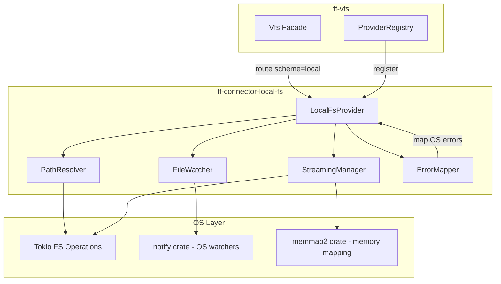

# Design Document: Local FS Connector (`ff-connector-local-fs`)

## Overview

The `ff-connector-local-fs` crate is the **primary VFS provider** for the FileForgeWorkbench initial release. It implements the `VfsProvider` trait from `ff-vfs` to provide full read/write/create/delete/rename/list/stat/watch access to the host operating system's native filesystem.

### Purpose

- Implement `VfsProvider` with scheme `"local"` for native filesystem operations
- Provide cross-platform path handling (Windows drive letters, UNC, Unix paths)
- Deliver file watching via OS-native mechanisms (inotify, ReadDirectoryChangesW, FSEvents)
- Resolve paths with tilde expansion, environment variable substitution, and canonicalization
- Support large file streaming and memory-mapped I/O
- Map OS-specific errors to the unified `VfsError` hierarchy

### Position in Architecture

```
┌──────────────────────────────────────────────────────────────┐
│  Consumers: document-model, file-operations, background-io   │
│  (access local files via vfs://local/... URIs)               │
├──────────────────────────────────────────────────────────────┤
│  ff-vfs — VFS facade, ProviderRegistry, routing              │
├──────────────────────────────────────────────────────────────┤
│  ff-connector-local-fs (THIS CRATE) — VfsProvider impl       │
│  Depends on: ff-vfs (trait), ff-logging                      │
├──────────────────────────────────────────────────────────────┤
│  OS filesystem (Tokio async I/O, notify crate for watching)  │
└──────────────────────────────────────────────────────────────┘
```

### Design Constraints (Cross-Cutting)

- **FFW-ARCH-001**: All local filesystem access goes through this provider; no consuming crate calls `std::fs` directly
- **Async I/O (Req 6)**: All I/O operations use Tokio async filesystem operations; no blocking calls
- **GUI Independence (Req 2)**: Zero GUI dependencies
- **Multi-Crate Workspace (Req 7)**: Crate at `crates/ff-connector-local-fs`
- **Error Message Standards (Req 8)**: Errors follow `[connector-local-fs] operation: description` format, max 200 chars
- **Plugin Architecture (Req 3)**: Registered as the default provider during VFS subsystem initialization

---

## Architecture

### High-Level Architecture Diagram



### Component Responsibilities

| Component | Responsibility |
|-----------|---------------|
| **LocalFsProvider** | Implements `VfsProvider` trait; routes operations to sub-components |
| **PathResolver** | Converts between `ResourceUri` paths and native OS paths; tilde/env expansion; canonicalization |
| **FileWatcher** | Manages OS-native file watches via the `notify` crate; debouncing; event delivery |
| **StreamingManager** | Chunked async reads/writes; memory-mapped I/O; progress reporting |
| **ErrorMapper** | Maps `std::io::Error` (and OS-specific codes) to `VfsError` variants |

### Request Flow (Read Example)

```
Vfs::read("vfs://local/home/user/file.txt")
  → ProviderRegistry routes to LocalFsProvider (scheme="local")
  → LocalFsProvider::read("/home/user/file.txt")
    → PathResolver::resolve("/home/user/file.txt") → NativePath("/home/user/file.txt")
    → tokio::fs::read(native_path).await
    → On error: ErrorMapper::map(io_error, uri, "read")
    → Return Ok(bytes) or Err(VfsError)
```

---

## Components and Interfaces

### Module Structure

```
crates/ff-connector-local-fs/
├── Cargo.toml
├── src/
│   ├── lib.rs              # Public API re-exports, provider construction
│   ├── provider.rs         # LocalFsProvider struct, VfsProvider trait impl
│   ├── path/
│   │   ├── mod.rs          # PathResolver re-exports
│   │   ├── resolver.rs     # PathResolver: tilde, env vars, relative path resolution
│   │   ├── native.rs       # NativePath type, URI ↔ native conversions
│   │   └── platform.rs     # Platform-specific path handling (cfg gated)
│   ├── watcher/
│   │   ├── mod.rs          # FileWatcher re-exports
│   │   ├── watcher.rs      # FileWatcher struct, watch/unwatch, debounce logic
│   │   ├── event.rs        # Internal event types, notify → WatchEvent conversion
│   │   └── handle.rs       # WatchHandleInner, cancellation token management
│   ├── streaming/
│   │   ├── mod.rs          # StreamingManager re-exports
│   │   ├── reader.rs       # ChunkedReader (AsyncRead impl), progress reporting
│   │   ├── writer.rs       # ChunkedWriter, atomic write (temp + rename)
│   │   └── mmap.rs         # Memory-mapped file access
│   ├── error.rs            # ErrorMapper: OS error → VfsError conversion
│   └── config.rs           # Configuration reading from [vfs.local] namespace
└── tests/
    ├── provider_tests.rs   # Integration tests for LocalFsProvider operations
    ├── path_tests.rs       # PathResolver property tests
    ├── watcher_tests.rs    # FileWatcher integration tests
    ├── streaming_tests.rs  # Large file streaming tests
    └── error_tests.rs      # Error mapping property tests
```

---

## Data Models

### LocalFsProvider

```rust
/// The primary VFS provider for the host operating system's native filesystem.
/// Registered with the ProviderRegistry under scheme "local".
///
/// Addresses: Requirement 1, all acceptance criteria
pub struct LocalFsProvider {
    /// Path resolver for URI ↔ native path conversion
    path_resolver: PathResolver,
    /// File watcher manager for OS-native change notifications
    file_watcher: FileWatcher,
    /// Streaming I/O manager for large file support
    streaming_manager: StreamingManager,
    /// Configuration for this provider
    config: LocalFsConfig,
}
```

### PathResolver

```rust
/// Handles all path resolution: tilde expansion, environment variables,
/// relative path resolution, canonicalization, and URI ↔ native conversion.
///
/// Addresses: Requirement 2 (cross-platform), Requirement 4 (path resolution)
pub struct PathResolver {
    /// The current working directory (captured at construction)
    working_directory: PathBuf,
    /// The user's home directory (captured at construction)
    home_directory: PathBuf,
}
```

### NativePath

```rust
/// A validated, platform-native filesystem path.
/// Wraps PathBuf with validation guarantees.
///
/// Addresses: Requirement 2, criteria 1–10
#[derive(Debug, Clone, PartialEq, Eq, Hash)]
pub struct NativePath(PathBuf);
```

### LocalFsConfig

```rust
/// Configuration for the local filesystem provider.
/// Read from the [vfs.local] TOML namespace.
///
/// Addresses: Requirement 3, criteria 5–7 (debounce config)
#[derive(Debug, Clone)]
pub struct LocalFsConfig {
    /// Debounce window for file watching (milliseconds).
    /// Range: 50–5000. Default: 500.
    pub debounce_ms: u64,
    /// Default chunk size for streaming reads (bytes).
    /// Default: 65536 (64 KB).
    pub chunk_size: usize,
    /// Whether to use memory-mapped I/O when available.
    /// Default: true.
    pub enable_mmap: bool,
}
```

### FileWatcher

```rust
/// Manages OS-native file watching subscriptions with debouncing.
/// Uses the `notify` crate internally for cross-platform support.
///
/// Addresses: Requirement 3, all acceptance criteria
pub struct FileWatcher {
    /// The underlying notify watcher instance
    watcher: Arc<Mutex<RecommendedWatcher>>,
    /// Active watch registrations keyed by handle ID
    watches: Arc<RwLock<HashMap<WatchId, WatchRegistration>>>,
    /// Debounce configuration
    debounce_window: Duration,
    /// Background task handle for event processing
    event_task: Option<tokio::task::JoinHandle<()>>,
    /// Cancellation token for shutdown
    cancel: CancellationToken,
}
```

### WatchRegistration

```rust
/// Internal record of an active watch subscription.
///
/// Addresses: Requirement 3, criteria 8–9
struct WatchRegistration {
    /// The native path being watched
    path: NativePath,
    /// Whether this is a recursive watch
    recursive: bool,
    /// Sender for delivering events to the consumer
    sender: tokio::sync::mpsc::Sender<WatchEvent>,
    /// Per-path last-event timestamps for debouncing
    last_events: HashMap<PathBuf, Instant>,
}
```

### WatchId

```rust
/// Opaque identifier for a watch registration.
/// Corresponds to the ff-vfs WatchHandle concept.
///
/// Addresses: Requirement 3, criterion 8
#[derive(Debug, Clone, Copy, PartialEq, Eq, Hash)]
pub struct WatchId(u64);
```

### LocalFsMetadata

```rust
/// Extended file metadata returned by stat operations.
/// Maps to the ff-vfs VfsMetadata type.
///
/// Addresses: Requirement 5, all acceptance criteria
pub struct LocalFsMetadata {
    /// File size in bytes
    pub size: u64,
    /// Last modification time
    pub modified: Option<SystemTime>,
    /// Creation time (None on filesystems that don't support it)
    pub created: Option<SystemTime>,
    /// Last access time
    pub accessed: Option<SystemTime>,
    /// Resource type
    pub entry_type: EntryType,
    /// Platform-specific permissions
    pub permissions: LocalPermissions,
    /// Whether the file is hidden (dot-file on Unix, hidden attr on Windows)
    pub is_hidden: bool,
}
```

### LocalPermissions

```rust
/// Platform-appropriate permission representation.
///
/// Addresses: Requirement 5, criterion 3
#[derive(Debug, Clone)]
pub enum LocalPermissions {
    /// Unix permissions: read/write/execute for owner, group, others
    Unix {
        mode: u32,
        owner_read: bool,
        owner_write: bool,
        owner_execute: bool,
        group_read: bool,
        group_write: bool,
        group_execute: bool,
        others_read: bool,
        others_write: bool,
        others_execute: bool,
    },
    /// Windows permissions: simplified attribute-based model
    Windows {
        read_only: bool,
        system: bool,
        archive: bool,
    },
}
```

### ChunkedReader

```rust
/// An async reader that yields file content in configurable chunks.
/// Implements AsyncRead for standard async stream consumption.
///
/// Addresses: Requirement 6, criteria 1–2
pub struct ChunkedReader {
    /// The underlying Tokio file handle
    file: tokio::fs::File,
    /// Chunk size in bytes
    chunk_size: usize,
    /// Total file size for progress calculation
    total_size: u64,
    /// Bytes read so far
    bytes_read: u64,
    /// Optional progress callback
    progress_callback: Option<Box<dyn Fn(u64, u64) + Send>>,
}
```

### AtomicWriter

```rust
/// Performs atomic writes by writing to a temporary file then renaming.
/// Falls back to direct write on filesystems that don't support atomic rename.
///
/// Addresses: Requirement 1, criterion 4
pub struct AtomicWriter {
    /// Target path for the final file
    target_path: NativePath,
    /// Temporary file path (same directory as target)
    temp_path: NativePath,
    /// The underlying Tokio file handle for the temp file
    file: tokio::fs::File,
}
```

---

## 5. Public API Surface

### LocalFsProvider — Construction and Registration

```rust
impl LocalFsProvider {
    /// Construct a new LocalFsProvider with the given configuration.
    /// Does not register with VFS — registration is handled by the
    /// VFS subsystem initialization sequence.
    ///
    /// Addresses: Requirement 1, criterion 1
    pub fn new(config: LocalFsConfig) -> Result<Self, VfsError>;

    /// Construct with default configuration.
    pub fn with_defaults() -> Result<Self, VfsError>;

    /// Returns the path resolver for direct path operations.
    pub fn path_resolver(&self) -> &PathResolver;

    /// Returns a reference to the file watcher.
    pub fn file_watcher(&self) -> &FileWatcher;
}
```

### VfsProvider Trait Implementation

```rust
#[async_trait::async_trait]
impl VfsProvider for LocalFsProvider {
    /// Returns "local".
    fn scheme(&self) -> &str;

    /// Full capabilities: read, write, watch, search, random_access,
    /// append, rename, delete, list, create_directory.
    fn capabilities(&self) -> VfsCapabilities;

    /// Open a local file for read/write.
    /// Resolves path via PathResolver, opens via Tokio async FS.
    /// Addresses: Requirement 1, criterion 3
    async fn open(&self, path: &str, options: OpenOptions) -> Result<Box<dyn VfsFile>, VfsError>;

    /// Read entire file content into memory.
    /// Addresses: Requirement 1, criterion 3
    async fn read(&self, path: &str) -> Result<Vec<u8>, VfsError>;

    /// Read file as an async byte stream (chunked).
    /// Addresses: Requirement 6, criteria 1–2
    async fn read_stream(&self, path: &str) -> Result<Pin<Box<dyn AsyncRead + Send>>, VfsError>;

    /// Write content to a file. Uses atomic write (temp + rename) where possible.
    /// Addresses: Requirement 1, criterion 4
    async fn write(&self, path: &str, data: &[u8], mode: WriteMode) -> Result<(), VfsError>;

    /// Create a file or directory. Creates parent directories as needed.
    /// Addresses: Requirement 1, criteria 5–6
    async fn create(&self, path: &str, options: CreateOptions) -> Result<(), VfsError>;

    /// Delete a file or directory.
    /// Addresses: Requirement 1, criterion 7
    async fn delete(&self, path: &str, options: DeleteOptions) -> Result<(), VfsError>;

    /// Rename/move a resource using native OS rename.
    /// Addresses: Requirement 1, criterion 8
    async fn rename(&self, old_path: &str, new_path: &str) -> Result<(), VfsError>;

    /// List directory entries as an async stream.
    /// Addresses: Requirement 1, criterion 9
    async fn list(&self, path: &str) -> Result<Vec<VfsEntry>, VfsError>;

    /// Get file/directory metadata.
    /// Addresses: Requirement 5, all criteria
    async fn stat(&self, path: &str) -> Result<VfsMetadata, VfsError>;

    /// Check if a path exists.
    async fn exists(&self, path: &str) -> Result<bool, VfsError>;

    /// Register a file/directory watch.
    /// Addresses: Requirement 3, all criteria
    async fn watch(
        &self,
        path: &str,
        options: WatchOptions,
    ) -> Result<WatchHandle, VfsError>;

    /// Search file content within a directory tree.
    async fn search(
        &self,
        path: &str,
        query: &SearchQuery,
        options: &SearchOptions,
    ) -> Result<Pin<Box<dyn Stream<Item = VfsSearchResult> + Send>>, VfsError>;
}
```

### PathResolver — Public API

```rust
impl PathResolver {
    /// Construct a new PathResolver, capturing the current working directory
    /// and home directory from the environment.
    pub fn new() -> Result<Self, VfsError>;

    /// Construct with explicit working directory and home directory (for testing).
    pub fn with_dirs(working_dir: PathBuf, home_dir: PathBuf) -> Self;

    /// Resolve a VFS path string to a NativePath.
    /// Handles: relative paths, tilde expansion, env var expansion, `.`/`..` segments.
    ///
    /// Addresses: Requirement 4, criteria 1–6
    pub fn resolve(&self, path: &str) -> Result<NativePath, VfsError>;

    /// Canonicalize a path: resolve all symlinks, eliminate all `.`/`..`,
    /// produce the true absolute path.
    ///
    /// Addresses: Requirement 4, criteria 7–8
    pub async fn canonicalize(&self, path: &str) -> Result<NativePath, VfsError>;

    /// Convert a NativePath to a VFS URI path component.
    /// Addresses: Requirement 4, criterion 9; Requirement 2, criterion 10
    pub fn native_to_uri_path(&self, native: &NativePath) -> String;

    /// Convert a VFS URI path component to a NativePath.
    /// Addresses: Requirement 2, criterion 9
    pub fn uri_path_to_native(&self, uri_path: &str) -> Result<NativePath, VfsError>;

    /// Expand tilde prefix to home directory.
    /// Addresses: Requirement 4, criterion 2
    pub fn expand_tilde(&self, path: &str) -> String;

    /// Expand environment variables in a path string.
    /// Supports both Unix ($VAR, ${VAR}) and Windows (%VAR%) syntax.
    /// Addresses: Requirement 4, criteria 3–5
    pub fn expand_env_vars(&self, path: &str) -> Result<String, VfsError>;

    /// Compare two paths for equality using platform-appropriate rules
    /// (case-insensitive on Windows, case-sensitive on Unix).
    /// Addresses: Requirement 2, criteria 4–5
    pub fn paths_equal(&self, a: &NativePath, b: &NativePath) -> bool;
}
```

### FileWatcher — Public API

```rust
impl FileWatcher {
    /// Construct a new FileWatcher with the specified debounce window.
    ///
    /// Addresses: Requirement 3, criteria 5–7
    pub fn new(debounce_window: Duration) -> Result<Self, VfsError>;

    /// Register a watch on a file or directory.
    /// Returns a WatchHandle for receiving events and cancelling the watch.
    ///
    /// Addresses: Requirement 3, criteria 1–4, 8
    pub async fn watch(
        &self,
        path: &NativePath,
        recursive: bool,
    ) -> Result<(WatchId, tokio::sync::mpsc::Receiver<WatchEvent>), VfsError>;

    /// Remove a watch by ID, releasing OS resources.
    ///
    /// Addresses: Requirement 3, criterion 9
    pub async fn unwatch(&self, id: WatchId) -> Result<(), VfsError>;

    /// Shut down the file watcher, cancelling all active watches.
    pub async fn shutdown(&self);

    /// Returns the number of active watches.
    pub fn active_watch_count(&self) -> usize;
}
```

### StreamingManager — Public API

```rust
impl StreamingManager {
    /// Construct a new StreamingManager with the given chunk size.
    pub fn new(chunk_size: usize, enable_mmap: bool) -> Self;

    /// Create a ChunkedReader for streaming file reads.
    ///
    /// Addresses: Requirement 6, criteria 1–2, 8
    pub async fn open_reader(
        &self,
        path: &NativePath,
        progress: Option<Box<dyn Fn(u64, u64) + Send>>,
    ) -> Result<ChunkedReader, VfsError>;

    /// Create an AtomicWriter for safe file writes.
    ///
    /// Addresses: Requirement 1, criterion 4
    pub async fn open_atomic_writer(
        &self,
        path: &NativePath,
    ) -> Result<AtomicWriter, VfsError>;

    /// Memory-map a file for random access reads.
    ///
    /// Addresses: Requirement 6, criteria 3–4, 7
    pub async fn memory_map(
        &self,
        path: &NativePath,
    ) -> Result<memmap2::Mmap, VfsError>;
}
```

### NativePath — Conversion API

```rust
impl NativePath {
    /// Construct from a PathBuf (no validation beyond platform normalization).
    pub fn from_path_buf(path: PathBuf) -> Self;

    /// Returns the inner PathBuf reference.
    pub fn as_path(&self) -> &Path;

    /// Returns the path as a string (lossy for non-UTF8 paths on Unix).
    pub fn to_string_lossy(&self) -> Cow<'_, str>;

    /// On Windows, apply the extended-length prefix (\\?\) for long paths.
    /// Addresses: Requirement 2, criterion 7
    #[cfg(windows)]
    pub fn to_extended_length(&self) -> PathBuf;

    /// Returns true if this path exceeds MAX_PATH on Windows.
    #[cfg(windows)]
    pub fn exceeds_max_path(&self) -> bool;
}
```

---

## Error Handling

```rust
/// Internal error type for OS error → VfsError mapping.
/// This module does NOT define a new public error enum — all public errors
/// are returned as ff_vfs::VfsError. The ErrorMapper converts std::io::Error
/// to the appropriate VfsError variant.
///
/// Addresses: Requirement 7, all acceptance criteria

/// Maps an OS I/O error to a VfsError with full context.
///
/// Addresses: Requirement 7, criteria 1–10
pub(crate) fn map_io_error(
    error: std::io::Error,
    operation: &str,
    uri: &str,
) -> VfsError {
    match error.kind() {
        ErrorKind::NotFound => VfsError::NotFound {
            operation: operation.to_string(),
            uri: uri.to_string(),
        },
        ErrorKind::PermissionDenied => VfsError::PermissionDenied {
            operation: operation.to_string(),
            uri: uri.to_string(),
        },
        // ... additional mappings per Requirement 7
        _ => VfsError::Io {
            operation: operation.to_string(),
            uri: uri.to_string(),
            source: error,
        },
    }
}
```

### Extended Error Mapping Table

| OS Error | Platform | VfsError Variant | Requirement |
|----------|----------|------------------|-------------|
| EACCES / ERROR_ACCESS_DENIED | Unix / Windows | `PermissionDenied` | 7.1 |
| ENOENT / ERROR_FILE_NOT_FOUND / ERROR_PATH_NOT_FOUND | Unix / Windows | `NotFound` | 7.2 |
| ENOSPC / ERROR_DISK_FULL | Unix / Windows | `StorageFull` | 7.3 |
| ENAMETOOLONG / ERROR_FILENAME_EXCED_RANGE | Unix / Windows | `InvalidPath` | 7.4 |
| ETXTBSY, EBUSY / ERROR_SHARING_VIOLATION, ERROR_LOCK_VIOLATION | Unix / Windows | `ResourceBusy` | 7.5 |
| ENOTEMPTY / ERROR_DIR_NOT_EMPTY | Unix / Windows | `DirectoryNotEmpty` | 7.6 |
| EROFS | Unix | `PermissionDenied` (with read-only message) | 7.7 |
| All others | Any | `Io` (with raw code + description) | 7.8 |

### VfsError Extensions

The `ff-vfs` `VfsError` enum requires extension for connector-local-fs specific needs. The following variants are used from the existing `VfsError` type or proposed as additions:

```rust
// Additional VfsError variants needed (proposed for ff-vfs):
/// Storage device is full
StorageFull {
    operation: String,
    uri: String,
},
/// Directory is not empty (non-recursive delete attempted)
DirectoryNotEmpty {
    operation: String,
    uri: String,
},
/// Resource is locked by another process
ResourceBusy {
    operation: String,
    uri: String,
    description: String,
},
/// Invalid path format or undefined environment variable
InvalidPath {
    operation: String,
    path: String,
    reason: String,
},
```

---

## 7. Integration Points

### With `ff-vfs` (upstream — trait provider)

- **Dependency direction**: ff-connector-local-fs depends on ff-vfs
- **API consumed**: `VfsProvider` trait, `VfsFile` trait, `VfsCapabilities`, `VfsMetadata`, `VfsEntry`, `EntryType`, `WatchHandle`, `WatchEvent`, `WatchOptions`, `OpenOptions`, `WriteMode`, `CreateOptions`, `DeleteOptions`, `SearchQuery`, `SearchOptions`, `VfsSearchResult`, `VfsError`, `ResourceUri`
- **Registration**: During VFS subsystem initialization, `ff-core` constructs `LocalFsProvider` and registers it with the `ProviderRegistry` under scheme `"local"`
- **Capabilities declared**: All capabilities are true (full local filesystem support)

### With `ff-logging` (upstream — structured logging)

- **Dependency direction**: ff-connector-local-fs depends on ff-logging
- **API consumed**: `log_info!`, `log_warn!`, `log_error!`, `log_debug!`
- **Usage patterns**:
  - INFO: Provider registration, watch registration/removal
  - WARN: OS watch errors (too many watches, permission), debounce clamp, atomic write fallback
  - ERROR: Logged before returning VfsError to caller (Requirement 7.10)
  - DEBUG: Path resolution steps, file operation details

### With `ff-core` (upstream — lifecycle orchestration)

- **Dependency direction**: ff-connector-local-fs does NOT depend on ff-core directly
- **Integration**: ff-core's VFS subsystem initialization code constructs and registers the provider
- **Lifecycle**: Provider construction happens during `VfsSubsystem::initialize()`; shutdown cancels all watches via `FileWatcher::shutdown()`

### With `ff-config` (upstream — configuration)

- **Dependency direction**: ff-connector-local-fs reads config via the `ConfigProvider` trait (passed during construction)
- **Namespace**: `[vfs.local]`
- **Keys consumed**:
  - `vfs.local.debounce_ms` — file watcher debounce window (Requirement 3.6)
  - `vfs.local.chunk_size` — streaming read chunk size
  - `vfs.local.enable_mmap` — memory-mapped I/O toggle

### With `notify` crate (external dependency)

- **Purpose**: Cross-platform file system event notifications
- **Version**: `notify ^6` (current stable)
- **Usage**: `RecommendedWatcher` for platform-appropriate backend selection
- **Thread model**: `notify` runs its own background thread; events are forwarded to Tokio tasks via channels

### With `memmap2` crate (external dependency)

- **Purpose**: Memory-mapped file I/O for large file random access
- **Version**: `memmap2 ^0.9`
- **Usage**: Read-only memory maps for files that require random access patterns
- **Safety**: Uses safe `Mmap` API; no unsafe blocks needed

### With `tokio` (external dependency)

- **Purpose**: All async filesystem operations
- **APIs used**: `tokio::fs::*` (read, write, create_dir_all, remove_file, remove_dir, rename, metadata, read_dir), `tokio::sync::mpsc`, `tokio::time::sleep`

### Dependency Direction Summary

```
ff-logging ← ff-vfs ← ff-connector-local-fs
                          ↓ uses
                      notify (OS watchers)
                      memmap2 (memory-mapped I/O)
                      tokio (async FS operations)
```

---

## 8. Configuration

The local filesystem connector reads from the `[vfs.local]` namespace in the workbench TOML configuration.

### TOML Schema

```toml
[vfs.local]
# Debounce window for file watching (milliseconds).
# Rapid events on the same path within this window are coalesced.
# Range: 50–5000. Default: 500
debounce_ms = 500

# Chunk size for streaming file reads (bytes).
# Range: 4096–1048576 (4 KB – 1 MB). Default: 65536 (64 KB)
chunk_size = 65536

# Enable memory-mapped I/O for large file random access.
# Default: true
enable_mmap = true
```

### Config Resolution Rules

| Setting | Absent | Invalid Value | Out of Range |
|---------|--------|---------------|--------------|
| `debounce_ms` | Default to 500 | Default to 500 + WARN log | Clamp to [50–5000] + WARN |
| `chunk_size` | Default to 65536 | Default to 65536 + WARN log | Clamp to [4096–1048576] + WARN |
| `enable_mmap` | Default to true | Default to true + WARN log | N/A (boolean) |

---

## 9. Thread Safety and Async Design

### Thread Safety Guarantees

| Type | Thread Safety | Mechanism |
|------|--------------|-----------|
| `LocalFsProvider` | `Send + Sync` | Required by `VfsProvider` trait bound; all fields are thread-safe |
| `PathResolver` | `Send + Sync` | Immutable after construction (PathBuf is Send + Sync) |
| `FileWatcher` | `Send + Sync` | Internal state protected by `Arc<RwLock<...>>` and `Arc<Mutex<...>>` |
| `NativePath` | `Send + Sync` | Wrapper around `PathBuf` (Send + Sync) |
| `ChunkedReader` | `Send` | Owns Tokio File handle; single-consumer |
| `AtomicWriter` | `Send` | Owns Tokio File handle; single-consumer |

### Async Design Decisions

1. **All filesystem I/O via `tokio::fs`**: Ensures no blocking of the executor thread. Tokio's fs operations delegate to a blocking thread pool internally, meeting the 1ms non-blocking requirement (Req 1.10).

2. **File watcher runs on dedicated Tokio task**: The `notify` crate's internal thread sends raw events through a `std::sync::mpsc` channel. A Tokio task reads from this channel (via `tokio::task::spawn_blocking` bridge) and applies debouncing before forwarding to consumers.

3. **Debounce via `tokio::time::sleep`**: Per-path event coalescing uses a time-windowed approach. When an event arrives, a debounce timer is started/reset. Only when the timer expires without new events for that path is the event forwarded.

4. **Atomic writes are non-blocking**: The temporary file write and rename are both async operations. If the rename fails (cross-device move), the fallback direct-write is also async.

5. **Memory-mapped I/O is synchronous but fast**: `memmap2::Mmap::map()` is a fast syscall (no data copy). The file open preceding it is async via Tokio. Once mapped, reads are direct memory access with no async overhead.

6. **Watch event delivery via bounded mpsc**: Each watch subscription gets a dedicated `tokio::sync::mpsc` channel (capacity 256). If the consumer is too slow, events are dropped and a WARN is logged.

---

## Correctness Properties

The following properties SHALL be validated via `proptest`-based property tests.

### Property 1: Path URI Round-Trip (Requirement 2, Requirement 4)

**Statement**: For any valid native filesystem path, converting to a VFS URI path and back produces an equivalent path (same file is addressed).

```
∀ native_path: NativePath where native_path is a valid absolute path →
    let uri_path = path_resolver.native_to_uri_path(&native_path)
    let round_tripped = path_resolver.uri_path_to_native(&uri_path)?
    paths_equal(native_path, round_tripped) == true
```

**Validates: Requirements 2.8, 2.9, 2.10, 4.9**

### Property 2: Path Separator Normalization (Requirement 2)

**Statement**: Regardless of whether forward slashes or backslashes are used in input paths on Windows, the resolved NativePath uses the platform-native separator and addresses the same file.

```
∀ path: String containing valid path components →
    let with_forward = path.replace('\\', '/')
    let with_back = path.replace('/', '\\')
    resolve(with_forward) == resolve(with_back)  // on Windows
```

**Validates: Requirements 2.1, 2.3**

### Property 3: Tilde Expansion Consistency (Requirement 4)

**Statement**: For any relative path suffix `p`, `~/p` resolves to `{home_dir}/{p}` and the result is always an absolute path.

```
∀ suffix: String where suffix is a valid relative path component →
    let expanded = path_resolver.resolve(&format!("~/{}", suffix))?
    expanded.as_path().starts_with(path_resolver.home_directory())
    ∧ expanded.as_path().is_absolute()
```

**Validates: Requirements 4.2**

### Property 4: Environment Variable Expansion (Requirement 4)

**Statement**: For any defined environment variable `$VAR`, the expansion replaces the variable reference with its value. For any undefined variable, the expansion returns `VfsError::InvalidPath`.

```
∀ var_name: String, var_value: String where env::set_var(var_name, var_value) →
    let path = format!("${{{}}/file.txt", var_name)
    let expanded = path_resolver.expand_env_vars(&path)?
    expanded.contains(&var_value) == true

∀ var_name: String where env::var(var_name).is_err() →
    let path = format!("${{{}}}/file.txt", var_name)
    path_resolver.expand_env_vars(&path).is_err()
```

**Validates: Requirements 4.3, 4.4, 4.5**

### Property 5: Error Mapping Completeness (Requirement 7)

**Statement**: Every `std::io::ErrorKind` that maps to a specific `VfsError` variant always produces that variant, and the error message follows the format `[connector-local-fs] operation: description` with length ≤ 200 characters.

```
∀ error_kind: ErrorKind, operation: &str, uri: &str →
    let vfs_err = map_io_error(io::Error::new(error_kind, ""), operation, uri)
    vfs_err.to_string().starts_with("[connector-local-fs]")
    ∨ vfs_err.to_string().starts_with("[vfs]")
    ∧ vfs_err.to_string().len() <= 200
```

**Validates: Requirements 7.1, 7.2, 7.3, 7.4, 7.5, 7.6, 7.7, 7.8, 7.9**

### Property 6: Debounce Coalescing (Requirement 3)

**Statement**: If N events arrive for the same path within the debounce window, exactly 1 event is delivered to the consumer after the window expires.

```
∀ n: usize where n >= 2, path: NativePath, debounce: Duration →
    emit n events for path within debounce window
    → consumer receives exactly 1 event for that path
    ∧ event arrives after debounce window from first event
```

**Validates: Requirements 3.5**

### Property 7: Watch Handle Uniqueness (Requirement 3)

**Statement**: Every call to `FileWatcher::watch()` returns a unique `WatchId`, and that ID can be used exactly once to unwatch.

```
∀ paths: Vec<NativePath> →
    let ids: Vec<WatchId> = paths.iter().map(|p| watcher.watch(p, false).0).collect()
    ids are all distinct
    ∧ for each id in ids: unwatch(id) == Ok(())
    ∧ for each id in ids: unwatch(id) == Err(...)  // second unwatch fails
```

**Validates: Requirements 3.8, 3.9**

### Property 8: Streaming Read Completeness (Requirement 6)

**Statement**: Reading a file via ChunkedReader yields exactly the same bytes as reading the entire file at once, regardless of chunk size.

```
∀ file_content: Vec<u8>, chunk_size: usize where chunk_size >= 1 →
    let chunked = read_via_chunks(file, chunk_size)
    let direct = tokio::fs::read(file).await
    chunked == direct
```

**Validates: Requirements 6.1, 6.2**

### Property 9: Atomic Write Safety (Requirement 1)

**Statement**: After a successful atomic write, the target file contains exactly the written data. If the write is interrupted (simulated), the original file content is preserved.

```
∀ original: Vec<u8>, new_data: Vec<u8> →
    write_original_to_file(path, original)
    atomic_write(path, new_data).await == Ok(())
    → read(path) == new_data

    // Interruption case:
    write_original_to_file(path, original)
    atomic_write_interrupted(path, new_data)
    → read(path) == original  // original preserved
```

**Validates: Requirements 1.4**

### Property 10: Path Comparison Platform Correctness (Requirement 2)

**Statement**: On Windows, paths differing only in case compare as equal. On Unix, paths differing in case compare as not equal.

```
// Windows:
∀ path: String →
    paths_equal(NativePath(path.to_lowercase()), NativePath(path.to_uppercase())) == true

// Unix:
∀ path: String where path != path.to_uppercase() →
    paths_equal(NativePath(path), NativePath(path.to_uppercase())) == false
```

**Validates: Requirements 2.4, 2.5**

### Property 11: Long Path Handling on Windows (Requirement 2)

**Statement**: On Windows, any path exceeding 260 characters is automatically prefixed with `\\?\` for extended-length support, and the resulting path is valid for OS operations.

```
// Windows only:
∀ path: String where path.len() > 260 →
    let native = NativePath::from_path_buf(PathBuf::from(path))
    native.to_extended_length().starts_with("\\\\?\\")
```

**Validates: Requirements 2.7**

### Property 12: Metadata Timestamp Fidelity (Requirement 5)

**Statement**: For any file created with a known modification time, the stat operation returns a modification time within 2 seconds of the actual modification time (accounting for filesystem timestamp granularity).

```
∀ file: TempFile →
    let before = SystemTime::now()
    write(file, data)
    let after = SystemTime::now()
    let meta = stat(file)
    meta.modified >= before - 2s
    ∧ meta.modified <= after + 2s
```

**Validates: Requirements 5.1, 5.9, 5.10**

---

## Testing Strategy

### Unit Tests

- **PathResolver tests**: Verify tilde expansion, env var expansion, relative path resolution, canonicalization, URI ↔ native conversion for all platforms
- **ErrorMapper tests**: Verify every mapped OS error kind produces the correct VfsError variant with proper formatting
- **NativePath tests**: Verify platform-specific path normalization, long path handling on Windows, path comparison

### Integration Tests

- **Provider CRUD operations**: Create, read, write, delete, rename files and directories using actual filesystem via TempDir
- **Streaming tests**: Verify chunked reads produce identical output to full reads; test with various file sizes and chunk sizes
- **Atomic write tests**: Verify file content consistency after write; verify original preserved on interrupted write
- **Memory-map tests**: Verify mmap produces same content as regular read; verify fallback behaviour

### Property-Based Tests

All correctness properties defined in the Correctness Properties section are implemented as `proptest` tests with minimum 100 iterations.

### File Watcher Tests

- Use `TempDir` + controlled file modifications to verify event delivery
- Test debounce coalescing with rapid event generation
- Test recursive vs non-recursive watching
- Test watch removal and resource cleanup

---

## 11. External Dependencies

| Crate | Version | Purpose |
|-------|---------|---------|
| `ff-vfs` | workspace | VfsProvider trait, VfsError, all VFS types |
| `ff-logging` | workspace | Structured logging macros |
| `tokio` | `^1` | Async filesystem operations, channels, timers |
| `notify` | `^6` | Cross-platform file system event notifications |
| `memmap2` | `^0.9` | Memory-mapped file I/O |
| `async-trait` | `^0.1` | Async trait method support |
| `tokio-util` | `^0.7` | CancellationToken for cooperative shutdown |

### Dev Dependencies

| Crate | Version | Purpose |
|-------|---------|---------|
| `proptest` | `^1` | Property-based testing |
| `tempfile` | `^3` | Temporary directories for integration tests |
| `tokio` (test feature) | `^1` | `#[tokio::test]` macro |

---

## 12. Cargo.toml Sketch

```toml
[package]
name = "ff-connector-local-fs"
version = "0.1.0"
edition = "2021"
description = "Local filesystem VFS provider for FileForgeWorkbench"

[dependencies]
ff-vfs = { path = "../ff-vfs" }
ff-logging = { path = "../ff-logging" }
tokio = { version = "1", features = ["fs", "sync", "time", "rt"] }
notify = "6"
memmap2 = "0.9"
async-trait = "0.1"
tokio-util = { version = "0.7", features = ["sync"] }

[dev-dependencies]
proptest = "1"
tempfile = "3"
tokio = { version = "1", features = ["test-util", "macros", "rt-multi-thread"] }
```
