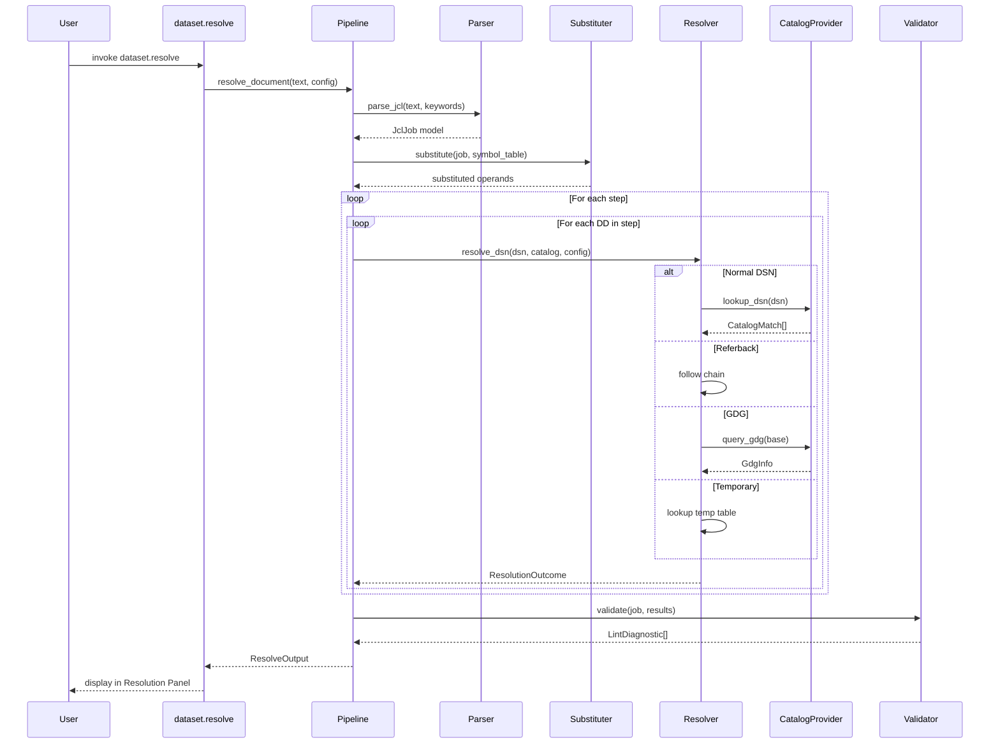

# Design Document: Dataset Allocator (`ff-dataset-allocator`)

## Overview

The `ff-dataset-allocator` crate is the **desktop equivalent of z/OS Dynamic Allocation (DYNALLOC / SVC 99)**. It parses JCL DD statements, resolves dataset names against locally mounted catalogs, performs symbolic parameter substitution, simulates dataset allocation, handles GDG relative generation references, resolves referback chains, validates JCL for common errors, and exposes a `dataset.resolve` command for interactive tracing of DSN-to-physical-path mappings.

This crate bridges the gap between mainframe JCL data definition constructs (DD statements with DSN=, DISP=, DCB=, SPACE= operands) and the workbench's local dataset catalog emulation — enabling developers to write and test JCL locally without requiring a z/OS system.

### Position in Architecture

```
Wave 13 — Dataset Catalog and Mainframe Emulation

┌─────────────────────────────────────────────────────────────────┐
│                 Application Binary (ffwb)                         │
│              (ff-desktop / GUI shell)                             │
├─────────────────────────────────────────────────────────────────┤
│  Resolution Panel UI │ Language Service JCL Hover                │
├─────────────────────────────────────────────────────────────────┤
│          ff-dataset-allocator (this crate)                        │
│   DD parsing, DSN resolution, symbolic substitution,             │
│   allocation simulation, referback/GDG, RESOLVE command          │
├─────────────────────────────────────────────────────────────────┤
│  ff-dataset-catalog │ ff-vfs │ ff-command │ ff-config            │
│  ff-language-service │ ff-logging                                │
└─────────────────────────────────────────────────────────────────┘
```

### Design Constraints

- **All DSN resolution goes through `ff-dataset-catalog`**: Never direct filesystem access. The catalog API is the sole resolution path, honouring the VFS abstraction (FFW-ARCH-001).
- **Command-Driven (Req 9)**: The `dataset.resolve` command is registered with `ff-command` — all interactive resolution flows through the command framework.
- **Multi-Crate Workspace**: Crate located at `crates/ff-dataset-allocator`.
- **JCL Continuation Line Handling**: The parser must join continuation lines (column 72 non-blank + next line `// `) before operand extraction.
- **Symbolic Substitution Before Catalog Lookup**: The pipeline enforces substitution as a distinct stage preceding resolution.
- **Trait-Based Catalog Interface**: Catalog access is abstracted behind a trait for testability without mounted catalogs.
- **Thread Safety**: Public API is `Send + Sync` — safe to invoke from any thread.
- **Error Handling with `thiserror`**: All errors carry sufficient context (line number, ddname, DSN, catalog name).

---

## Architecture

### Resolution Pipeline

The resolver processes JCL through four ordered stages:

```
┌───────────┐    ┌─────────────┐    ┌───────────┐    ┌────────────┐
│  1. Parse │───▶│ 2. Substitute│───▶│ 3. Resolve│───▶│ 4. Validate│
│           │    │             │    │           │    │            │
│ JCL text  │    │ Symbol table│    │ Catalog   │    │ Lint rules │
│ → Job     │    │ → Expanded  │    │ → Paths   │    │ → Diags    │
│   model   │    │   operands  │    │           │    │            │
└───────────┘    └─────────────┘    └───────────┘    └────────────┘
```

Each stage produces intermediate results available for inspection (Requirement 13, criterion 2). Errors in one DD do not prevent resolution of subsequent DDs (Requirement 13, criterion 3).

### High-Level Component Diagram

```mermaid
graph TD
    subgraph Invocation
        A[RESOLVE Command]
        B[Language Service Hover]
        C[Auto-resolve on Save]
    end

    subgraph ff-dataset-allocator
        D[JCL Parser<br/>DD/JOB/EXEC extraction]
        E[Symbol Substituter<br/>& expansion]
        F[DSN Resolver<br/>catalog lookup, referback, GDG]
        G[Allocation Simulator<br/>DISP interpretation]
        H[Validator<br/>lint diagnostics]
        I[Resolution Pipeline<br/>orchestrator]
        J[Command Handler<br/>dataset.resolve]
    end

    subgraph Upstream Crates
        K[ff-dataset-catalog<br/>DSN lookup, GDG, allocate]
        L[ff-command<br/>registry, dispatch]
        M[ff-config<br/>jcl.* settings]
        N[ff-language-service<br/>JCL keywords, language_id]
        O[ff-logging<br/>structured logs]
    end

    A --> J
    B --> I
    C --> I
    J --> I
    I --> D
    I --> E
    I --> F
    I --> G
    I --> H
    F --> K
    G --> K
    J --> L
    E --> M
    D --> N
    I --> O
end
```

### Layer Placement

| Layer | Role |
|-------|------|
| **Command Layer** | `dataset.resolve` command handler — entry point from user interaction |
| **Pipeline Layer** | Orchestrates parse → substitute → resolve → validate sequence |
| **Parser Layer** | Extracts job structure, DD statements, operands from JCL text |
| **Substitution Layer** | Replaces `&symbol` references with values from symbol table |
| **Resolution Layer** | Looks up DSNs in catalogs, resolves referbacks, handles GDGs and temporaries |
| **Allocation Layer** | Interprets DISP and simulates dataset creation (dry-run or live) |
| **Validation Layer** | Produces lint diagnostics for detected problems |

---

## Components and Interfaces

```
crates/ff-dataset-allocator/
├── Cargo.toml
├── src/
│   ├── lib.rs                  # Public API re-exports, crate docs
│   ├── parser/
│   │   ├── mod.rs              # Re-exports for parser module
│   │   ├── lexer.rs            # JCL statement tokenisation, continuation joining
│   │   ├── dd.rs               # DD statement parsing (DSN, DISP, DCB, SPACE, SYSOUT, DUMMY)
│   │   ├── job.rs              # JOB/EXEC/PROC/PEND statement parsing, job model builder
│   │   ├── operands.rs         # Operand field parsing (key=value, positional, parenthesised)
│   │   └── continuation.rs     # Column 72 continuation line joining logic
│   ├── symbols/
│   │   ├── mod.rs              # Re-exports for symbol module
│   │   ├── table.rs            # SymbolTable data structure (scoped lookup)
│   │   ├── system.rs           # System symbol providers (&SYSDATE, &SYSTIME, etc.)
│   │   ├── substitution.rs     # Left-to-right substitution engine, dot-terminator, substring
│   │   └── set_parser.rs       # SET statement and PROC parameter extraction
│   ├── resolver/
│   │   ├── mod.rs              # Re-exports for resolver module
│   │   ├── catalog_lookup.rs   # DSN resolution via CatalogProvider trait
│   │   ├── referback.rs        # Referback chain resolution (*.stepname.ddname)
│   │   ├── gdg.rs              # GDG relative generation resolution
│   │   ├── temporary.rs        # Temporary dataset table (&& names)
│   │   ├── concatenation.rs    # Concatenation group resolution
│   │   └── pass_table.rs       # DISP=PASS tracking across steps
│   ├── allocator/
│   │   ├── mod.rs              # Re-exports for allocator module
│   │   ├── disp.rs             # DISP parameter interpretation and allocation logic
│   │   └── simulation.rs       # Dry-run vs live allocation dispatch
│   ├── validator/
│   │   ├── mod.rs              # Re-exports for validator module
│   │   ├── lint.rs             # Lint rule engine, diagnostic codes
│   │   ├── dsn_syntax.rs       # DSN format validation (44 chars, qualifier rules)
│   │   └── rules.rs            # Individual lint rules (unresolved DSN, DISP conflict, etc.)
│   ├── pipeline.rs             # Resolution pipeline orchestrator
│   ├── command.rs              # dataset.resolve command registration and handler
│   ├── config.rs               # Configuration reading (jcl.* keys)
│   ├── error.rs                # JclResolverError enum
│   ├── models.rs               # Core data types (DdStatement, DsnReference, etc.)
│   └── traits.rs               # CatalogProvider, LanguageQuery traits
└── tests/
    ├── parser_tests.rs         # DD parsing property tests
    ├── symbol_tests.rs         # Symbolic substitution property tests
    ├── resolver_tests.rs       # DSN resolution property tests
    ├── gdg_tests.rs            # GDG resolution property tests
    ├── referback_tests.rs      # Referback chain property tests
    ├── allocator_tests.rs      # DISP interpretation property tests
    ├── validator_tests.rs      # Lint diagnostic property tests
    ├── pipeline_tests.rs       # End-to-end pipeline tests
    └── command_tests.rs        # RESOLVE command integration tests
```

---

## Data Models

### DdStatement

```rust
/// A parsed JCL DD statement with all extracted operands.
/// Addresses: Requirement 1, all criteria
#[derive(Debug, Clone, PartialEq)]
pub struct DdStatement {
    /// The ddname (columns 3–10, trimmed)
    pub ddname: String,
    /// Line number in the JCL source (1-based)
    pub line_number: usize,
    /// Column range in source (start, end) for diagnostic highlighting
    pub column_range: (usize, usize),
    /// The step this DD belongs to
    pub step_name: String,
    /// DSN reference (if present — not present for SYSOUT, DUMMY, DD *)
    pub dsn: Option<DsnReference>,
    /// DISP operand (parsed sub-parameters)
    pub disp: Option<DispParameter>,
    /// DCB operand (dataset attributes)
    pub dcb: Option<DcbAttributes>,
    /// SPACE operand (allocation size)
    pub space: Option<SpaceAllocation>,
    /// DD classification
    pub kind: DdKind,
    /// Concatenation index (0 = primary, 1+ = concatenated)
    pub concatenation_index: usize,
    /// Raw operand text (before substitution) for display
    pub raw_operands: String,
}

/// Classification of a DD statement.
/// Addresses: Requirement 1, criteria 8/9/10
#[derive(Debug, Clone, PartialEq, Eq)]
pub enum DdKind {
    /// Normal dataset reference (requires resolution)
    Dataset,
    /// SYSOUT=class (output-directed, no resolution)
    Sysout { class: char },
    /// DD * or DD DATA (inline data, no resolution)
    Inline,
    /// DUMMY (null dataset, no resolution)
    Dummy,
}
```

### DsnReference

```rust
/// A dataset name reference extracted from a DD statement's DSN= operand.
/// Addresses: Requirement 1, criteria 2/3; Requirement 8, criterion 1
#[derive(Debug, Clone, PartialEq, Eq)]
pub enum DsnReference {
    /// A fully qualified dataset name: `DSN=MY.DATA.SET`
    Simple {
        dsn: String,
    },
    /// A PDS member reference: `DSN=MY.PDS(MEMBER)`
    Member {
        pds_dsn: String,
        member: String,
    },
    /// A temporary dataset: `DSN=&&TEMPNAME`
    Temporary {
        name: String,
    },
    /// A referback reference: `DSN=*.STEP1.DDNAME`
    Referback {
        step_name: String,
        proc_step: Option<String>,
        ddname: String,
    },
    /// A GDG relative generation: `DSN=MY.GDG.BASE(+1)`
    Gdg {
        base_name: String,
        generation: i32,
    },
}

impl DsnReference {
    /// Returns the raw DSN string for display (before resolution).
    pub fn display_name(&self) -> String;

    /// Returns true if this reference requires catalog lookup.
    pub fn requires_catalog_lookup(&self) -> bool;

    /// Returns true if this is a temporary dataset reference.
    pub fn is_temporary(&self) -> bool;

    /// Returns true if this is a referback reference.
    pub fn is_referback(&self) -> bool;
}
```

### DispParameter

```rust
/// Parsed DISP operand with up to three positional sub-parameters.
/// Addresses: Requirement 1, criterion 4; Requirement 4, all criteria
#[derive(Debug, Clone, PartialEq, Eq)]
pub struct DispParameter {
    /// Status at step start: NEW, OLD, SHR, MOD
    pub status: DispStatus,
    /// Normal-end disposition: KEEP, DELETE, CATLG, UNCATLG, PASS
    pub normal_disp: Option<DispAction>,
    /// Abnormal-end disposition: KEEP, DELETE, CATLG, UNCATLG
    pub abnormal_disp: Option<DispAction>,
}

/// Dataset status at step initiation.
#[derive(Debug, Clone, Copy, PartialEq, Eq)]
pub enum DispStatus {
    New,
    Old,
    Shr,
    Mod,
}

/// Conditional disposition action.
#[derive(Debug, Clone, Copy, PartialEq, Eq)]
pub enum DispAction {
    Keep,
    Delete,
    Catlg,
    Uncatlg,
    Pass,
}

impl DispParameter {
    /// Returns the default DISP when no DISP operand is specified: (NEW,DELETE).
    /// Addresses: Requirement 4, criterion 7
    pub fn default() -> Self;

    /// Returns true if this disposition requires the dataset to already exist.
    pub fn requires_existing(&self) -> bool;

    /// Returns true if this disposition creates a new dataset.
    pub fn creates_new(&self) -> bool;
}
```

### DcbAttributes

```rust
/// Dataset Control Block attributes extracted from the DCB operand.
/// Addresses: Requirement 1, criterion 5; Requirement 4, criterion 2
#[derive(Debug, Clone, PartialEq, Eq)]
pub struct DcbAttributes {
    /// Record format: F, FB, V, VB, U, etc.
    pub recfm: Option<String>,
    /// Logical record length
    pub lrecl: Option<u32>,
    /// Block size
    pub blksize: Option<u32>,
    /// Dataset organisation: PS, PO, DA, VSAM
    pub dsorg: Option<DsOrg>,
}

/// Dataset organisation types.
#[derive(Debug, Clone, Copy, PartialEq, Eq)]
pub enum DsOrg {
    /// Physical sequential
    Ps,
    /// Partitioned (PDS/PDSE)
    Po,
    /// Direct access
    Da,
    /// VSAM (informational — not fully emulated)
    Vsam,
}

impl DcbAttributes {
    /// Returns fallback defaults: RECFM=FB, LRECL=80, BLKSIZE=27920.
    /// Used when neither DCB nor catalog.defaults are specified.
    /// Addresses: Requirement 4, criterion 2
    pub fn hardcoded_defaults() -> Self;
}
```

### SpaceAllocation

```rust
/// Parsed SPACE operand specifying allocation size for new datasets.
/// Addresses: Requirement 1, criterion 6
#[derive(Debug, Clone, PartialEq, Eq)]
pub struct SpaceAllocation {
    /// Allocation unit
    pub unit: SpaceUnit,
    /// Primary quantity
    pub primary: u32,
    /// Secondary quantity (for extension)
    pub secondary: Option<u32>,
    /// Directory blocks (for PDS)
    pub directory: Option<u32>,
}

/// Space allocation unit.
#[derive(Debug, Clone, PartialEq, Eq)]
pub enum SpaceUnit {
    /// Tracks
    Trk,
    /// Cylinders
    Cyl,
    /// Average block size (integer)
    Blksize(u32),
}
```

### SymbolTable

```rust
/// A scoped collection of symbolic parameter definitions.
/// Supports hierarchical scoping: job-level → proc-level → step-level.
/// Addresses: Requirement 3, all criteria
#[derive(Debug, Clone)]
pub struct SymbolTable {
    /// Stack of scopes (innermost last). Each scope is a name→value map.
    scopes: Vec<HashMap<String, String>>,
}

impl SymbolTable {
    /// Create a new symbol table pre-populated with system symbols.
    /// Addresses: Requirement 3, criterion 2
    pub fn new_with_system_symbols(config: &ResolverConfig) -> Self;

    /// Push a new scope (e.g., entering a procedure).
    pub fn push_scope(&mut self);

    /// Pop the innermost scope (e.g., leaving a procedure).
    pub fn pop_scope(&mut self);

    /// Define a symbol in the current (innermost) scope.
    /// Addresses: Requirement 3, criteria 3/4
    pub fn define(&mut self, name: &str, value: &str);

    /// Look up a symbol value, searching from innermost to outermost scope.
    /// Returns None if not found in any scope.
    pub fn lookup(&self, name: &str) -> Option<&str>;

    /// Returns true if the symbol is defined in any scope.
    pub fn contains(&self, name: &str) -> bool;

    /// Load persistent symbols from configuration.
    /// Addresses: Requirement 3, criterion 10
    pub fn load_from_config(&mut self, symbols: &HashMap<String, String>);
}
```

### ResolutionResult

```rust
/// The output of resolving a single DD statement's DSN.
/// Addresses: Requirement 2, criteria 1/2; Requirement 11, criteria 2/3/4
#[derive(Debug, Clone, PartialEq)]
pub struct ResolutionResult {
    /// The ddname of the resolved DD
    pub ddname: String,
    /// The step containing this DD
    pub step_name: String,
    /// The original DSN (before substitution)
    pub original_dsn: Option<String>,
    /// The DSN after symbolic substitution
    pub substituted_dsn: Option<String>,
    /// Resolution outcome
    pub outcome: ResolutionOutcome,
    /// Concatenation index (0 for primary, 1+ for concatenated)
    pub concatenation_index: usize,
}

/// The outcome of a single DSN resolution attempt.
#[derive(Debug, Clone, PartialEq)]
pub enum ResolutionOutcome {
    /// Successfully resolved to a physical path.
    Resolved {
        physical_path: String,
        catalog_name: String,
        dataset_type: DatasetType,
    },
    /// Resolved as a temporary dataset (no physical path).
    Temporary {
        creating_step: String,
    },
    /// Allocated as a new dataset (DISP=NEW).
    Allocated {
        physical_path: String,
        catalog_name: String,
    },
    /// GDG generation resolved.
    GdgResolved {
        generation_dsn: String,
        physical_path: String,
        catalog_name: String,
        generation_number: i32,
    },
    /// Skipped (SYSOUT, DUMMY, inline DD).
    Skipped {
        reason: SkipReason,
    },
    /// Resolution failed — see diagnostics.
    Failed,
}

/// Dataset type returned from catalog resolution.
#[derive(Debug, Clone, Copy, PartialEq, Eq)]
pub enum DatasetType {
    /// Physical sequential
    Ps,
    /// Partitioned (PDS/PDSE)
    Po,
    /// Generation Data Group
    Gdg,
}

/// Reason a DD was skipped during resolution.
#[derive(Debug, Clone, Copy, PartialEq, Eq)]
pub enum SkipReason {
    Sysout,
    Dummy,
    Inline,
}
```

### LintDiagnostic

```rust
/// A validation diagnostic produced by the resolver.
/// Addresses: Requirement 10, all criteria
#[derive(Debug, Clone, PartialEq, Eq)]
pub struct LintDiagnostic {
    /// Severity level
    pub severity: DiagnosticSeverity,
    /// Line number in JCL source (1-based)
    pub line: usize,
    /// Column range (start, end) for highlighting
    pub column_range: (usize, usize),
    /// Unique diagnostic code (e.g., "JCL001")
    pub code: DiagnosticCode,
    /// Human-readable message
    pub message: String,
    /// Optional ddname context
    pub ddname: Option<String>,
}

/// Diagnostic severity levels.
/// Addresses: Requirement 10, criterion 1
#[derive(Debug, Clone, Copy, PartialEq, Eq, PartialOrd, Ord)]
pub enum DiagnosticSeverity {
    Info,
    Warning,
    Error,
}

/// Unique diagnostic codes for each class of problem.
/// Addresses: Requirement 15, criterion 6
#[derive(Debug, Clone, Copy, PartialEq, Eq)]
pub enum DiagnosticCode {
    /// JCL001 — Syntax error in DD statement
    SyntaxError,
    /// JCL002 — Unresolved DSN (not found in catalogs)
    UnresolvedDsn,
    /// JCL003 — Unresolved symbolic parameter
    UnresolvedSymbolic,
    /// JCL004 — DISP conflict (NEW on existing, OLD on non-existent)
    DispConflict,
    /// JCL005 — Referback target not found
    ReferbackNotFound,
    /// JCL006 — GDG base or generation not found
    GdgNotFound,
    /// JCL007 — Concatenation error (max exceeded, attribute mismatch)
    ConcatenationError,
    /// JCL008 — Invalid DSN syntax
    InvalidDsnSyntax,
    /// JCL009 — Temporary dataset not created in prior step
    TemporaryNotFound,
    /// JCL010 — Duplicate ddname in step
    DuplicateDdname,
    /// JCL011 — Missing well-known DD (SYSIN, SYSPRINT, etc.)
    MissingWellKnownDd,
    /// JCL012 — Invalid symbolic parameter name
    InvalidSymbolicName,
    /// JCL013 — Catalog query failure
    CatalogQueryFailed,
    /// JCL014 — GDG roll-off notification
    GdgRollOff,
    /// JCL015 — Multiple forward GDG generations
    MultipleForwardGdg,
    /// JCL016 — Member not found in PDS
    MemberNotFound,
    /// JCL017 — Ambiguous DSN (found in multiple catalogs)
    AmbiguousDsn,
    /// JCL018 — Referback chain too deep
    ReferbackChainTooDeep,
}

impl DiagnosticCode {
    /// Returns the string representation (e.g., "JCL001").
    pub fn as_str(&self) -> &'static str;

    /// Returns the default severity for this diagnostic code.
    pub fn default_severity(&self) -> DiagnosticSeverity;
}
```

### Job Model

```rust
/// A parsed JCL job structure.
/// Addresses: Requirement 12, all criteria
#[derive(Debug, Clone)]
pub struct JclJob {
    /// Job name from JOB statement (or "NOJOB" for fragments)
    pub name: String,
    /// Line number of the JOB statement
    pub job_line: usize,
    /// Ordered list of execution steps
    pub steps: Vec<JclStep>,
}

/// A single execution step within a job.
/// Addresses: Requirement 12, criteria 2/3
#[derive(Debug, Clone)]
pub struct JclStep {
    /// Step name from EXEC statement
    pub name: String,
    /// Line number of the EXEC statement
    pub line_number: usize,
    /// Program or procedure being executed
    pub exec_target: ExecTarget,
    /// DD statements in this step (including overrides)
    pub dd_statements: Vec<DdStatement>,
    /// Symbolic overrides from EXEC statement
    pub symbol_overrides: HashMap<String, String>,
}

/// What an EXEC statement invokes.
#[derive(Debug, Clone, PartialEq, Eq)]
pub enum ExecTarget {
    /// PGM=program_name
    Program(String),
    /// Procedure invocation (catalogued or in-stream)
    Proc(String),
}
```

### ResolverConfig

```rust
/// Configuration for the resolver, read from the [jcl] config table.
/// Addresses: Requirement 14, all criteria
#[derive(Debug, Clone)]
pub struct ResolverConfig {
    /// Resolution mode: "dry-run" (report only) or "live" (perform allocations)
    pub resolve_mode: ResolveMode,
    /// Default high-level qualifier prepended to unqualified DSNs
    pub default_hlq: Option<String>,
    /// Explicit catalog search order (overrides mount order)
    pub catalog_search_order: Option<Vec<String>>,
    /// Minimum diagnostic severity to report
    pub lint_level: DiagnosticSeverity,
    /// Maximum referback chain depth
    pub max_referback_depth: usize,
    /// Persistent user-defined symbols
    pub symbols: HashMap<String, String>,
    /// Auto-resolve on save
    pub auto_resolve: bool,
}

/// Resolution execution mode.
#[derive(Debug, Clone, Copy, PartialEq, Eq)]
pub enum ResolveMode {
    /// Report what allocations would occur without creating datasets
    DryRun,
    /// Perform actual catalog allocations for DISP=NEW
    Live,
}

impl Default for ResolverConfig {
    fn default() -> Self {
        Self {
            resolve_mode: ResolveMode::DryRun,
            default_hlq: None,
            catalog_search_order: None,
            lint_level: DiagnosticSeverity::Info,
            max_referback_depth: 10,
            symbols: HashMap::new(),
            auto_resolve: false,
        }
    }
}
```

### ResolveOutput

```rust
/// The complete output of a resolution operation.
/// Addresses: Requirement 9, criterion 6; Requirement 13, criteria 2/4
#[derive(Debug, Clone)]
pub struct ResolveOutput {
    /// Resolution results for each DD statement processed
    pub results: Vec<ResolutionResult>,
    /// All diagnostics produced across all pipeline stages
    pub diagnostics: Vec<LintDiagnostic>,
    /// Summary statistics
    pub summary: ResolveSummary,
    /// Intermediate pipeline state (for debugging/inspection)
    pub pipeline_state: PipelineState,
}

/// Summary statistics for a resolution run.
#[derive(Debug, Clone, Copy, PartialEq, Eq)]
pub struct ResolveSummary {
    /// Total DD statements processed
    pub total_dds: usize,
    /// Successfully resolved count
    pub resolved: usize,
    /// Warning count
    pub warnings: usize,
    /// Error count
    pub errors: usize,
    /// Skipped count (SYSOUT, DUMMY, inline)
    pub skipped: usize,
}

/// Intermediate pipeline state for inspection/debugging.
/// Addresses: Requirement 13, criterion 2
#[derive(Debug, Clone)]
pub struct PipelineState {
    /// Parsed job model (stage 1 output)
    pub job_model: Option<JclJob>,
    /// Substituted operand values per DD (stage 2 output)
    pub substitutions: HashMap<String, String>,
    /// Stage timing in milliseconds
    pub stage_timings: StageTiming,
}

/// Timing data for each pipeline stage.
/// Addresses: Requirement 13, criterion 5
#[derive(Debug, Clone, Copy, Default)]
pub struct StageTiming {
    pub parse_ms: u64,
    pub substitute_ms: u64,
    pub resolve_ms: u64,
    pub validate_ms: u64,
}
```

---

## Public API Surface

### JCL Parser

```rust
/// Parse JCL text into a structured job model.
/// Independently testable — no catalog or VFS dependency.
/// Addresses: Requirements 1, 5, 12
pub fn parse_jcl(text: &str, keywords: &JclKeywordSet) -> Result<JclJob, JclResolverError>;

/// Parse a single DD statement from text (for incremental resolution).
/// Addresses: Requirement 1, all criteria
pub fn parse_dd_statement(line: &str, line_number: usize) -> Result<DdStatement, JclResolverError>;
```

### Symbolic Substitution

```rust
/// Perform symbolic substitution on a text string.
/// Replaces all &symbol references with values from the symbol table.
/// Addresses: Requirement 3, all criteria
pub fn substitute_symbols(
    text: &str,
    table: &SymbolTable,
) -> Result<String, Vec<LintDiagnostic>>;

/// Build a symbol table from JCL SET statements and PROC parameters.
/// Addresses: Requirement 3, criteria 3/4
pub fn build_symbol_table(
    job: &JclJob,
    config: &ResolverConfig,
) -> SymbolTable;
```

### DSN Resolution

```rust
/// Resolve a single DSN against mounted catalogs.
/// All resolution goes through the CatalogProvider trait.
/// Addresses: Requirement 2, all criteria
pub fn resolve_dsn(
    dsn: &str,
    catalog: &dyn CatalogProvider,
    config: &ResolverConfig,
) -> Result<ResolutionOutcome, JclResolverError>;

/// Resolve a referback reference by following the chain.
/// Addresses: Requirement 7, all criteria
pub fn resolve_referback(
    referback: &DsnReference,
    job: &JclJob,
    step_index: usize,
    catalog: &dyn CatalogProvider,
    config: &ResolverConfig,
    depth: usize,
) -> Result<ResolutionOutcome, Vec<LintDiagnostic>>;

/// Resolve a GDG relative generation reference.
/// Addresses: Requirement 8, all criteria
pub fn resolve_gdg(
    base_name: &str,
    generation: i32,
    catalog: &dyn CatalogProvider,
    gdg_state: &GdgJobState,
) -> Result<ResolutionOutcome, Vec<LintDiagnostic>>;
```

### Allocation Simulation

```rust
/// Interpret DISP parameter and simulate allocation logic.
/// Addresses: Requirement 4, all criteria
pub fn simulate_allocation(
    dd: &DdStatement,
    catalog: &dyn CatalogProvider,
    config: &ResolverConfig,
    pass_table: &mut PassTable,
) -> Result<ResolutionOutcome, Vec<LintDiagnostic>>;
```

### Resolution Pipeline (Orchestrator)

```rust
/// The main resolution pipeline — processes a complete JCL document.
/// Addresses: Requirement 13, all criteria; Requirement 16, criterion 4
pub fn resolve_document(
    text: &str,
    config: &ResolverConfig,
    catalog: &dyn CatalogProvider,
    language: &dyn LanguageQuery,
) -> ResolveOutput;

/// Incremental resolution — re-resolves a single DD and its dependents.
/// Addresses: Requirement 13, criterion 6
pub fn resolve_incremental(
    text: &str,
    changed_line: usize,
    previous_state: &PipelineState,
    config: &ResolverConfig,
    catalog: &dyn CatalogProvider,
    language: &dyn LanguageQuery,
) -> ResolveOutput;
```

### RESOLVE Command

```rust
/// Register the `dataset.resolve` command with the command framework.
/// Called during crate initialization.
/// Addresses: Requirement 9, criterion 1
pub fn register_resolve_command(registry: &CommandRegistry) -> Result<(), JclResolverError>;
```

### Hover Provider

```rust
/// Provide hover information for a DSN token at the given position.
/// Addresses: Requirement 16, criterion 5
pub fn hover_for_dsn(
    text: &str,
    line: usize,
    column: usize,
    config: &ResolverConfig,
    catalog: &dyn CatalogProvider,
) -> Option<DsnHoverInfo>;

/// Hover information for a resolved DSN.
#[derive(Debug, Clone)]
pub struct DsnHoverInfo {
    /// Resolution status
    pub status: String,
    /// Physical path (if resolved)
    pub physical_path: Option<String>,
    /// Dataset attributes (if available)
    pub attributes: Option<DcbAttributes>,
    /// Catalog that provided the resolution
    pub catalog_name: Option<String>,
}
```

---

## Traits (Abstraction Boundaries)

### CatalogProvider

```rust
/// Trait abstracting catalog access for testability.
/// Production implementation delegates to ff-dataset-catalog.
/// Test implementations can provide canned responses.
/// Addresses: Cross-cutting Testability; Requirement 2, criterion 8
pub trait CatalogProvider: Send + Sync {
    /// Look up a DSN in mounted catalogs.
    /// Returns all matches across catalogs (caller applies search order).
    fn lookup_dsn(&self, dsn: &str) -> Result<Vec<CatalogMatch>, CatalogError>;

    /// Verify that a PDS member exists within a resolved PDS.
    /// Addresses: Requirement 2, criteria 5/6
    fn verify_member(&self, pds_dsn: &str, member: &str) -> Result<bool, CatalogError>;

    /// Query GDG state for a base name.
    /// Returns generation list (ordered newest-first).
    /// Addresses: Requirement 8, criteria 2/3/4
    fn query_gdg(&self, base_name: &str) -> Result<Option<GdgInfo>, CatalogError>;

    /// Allocate a new dataset in the catalog (live mode only).
    /// Addresses: Requirement 4, criteria 1/2
    fn allocate_dataset(
        &self,
        dsn: &str,
        attributes: &DcbAttributes,
        space: Option<&SpaceAllocation>,
    ) -> Result<String, CatalogError>;

    /// Check if a DSN already exists in any mounted catalog.
    fn dataset_exists(&self, dsn: &str) -> Result<bool, CatalogError>;
}

/// A single match from a catalog lookup.
#[derive(Debug, Clone)]
pub struct CatalogMatch {
    /// Name of the catalog that contains this dataset
    pub catalog_name: String,
    /// Physical file path
    pub physical_path: String,
    /// Dataset type
    pub dataset_type: DatasetType,
}

/// GDG information from catalog.
#[derive(Debug, Clone)]
pub struct GdgInfo {
    /// GDG base name
    pub base_name: String,
    /// Maximum number of generations
    pub limit: u32,
    /// Active generations (ordered newest-first)
    pub generations: Vec<GdgGeneration>,
}

/// A single GDG generation entry.
#[derive(Debug, Clone)]
pub struct GdgGeneration {
    /// Absolute generation number
    pub number: u32,
    /// Full generation dataset name
    pub dsn: String,
    /// Physical path
    pub physical_path: String,
}

/// Errors from catalog operations.
#[derive(Debug, thiserror::Error)]
pub enum CatalogError {
    #[error("catalog '{catalog}' query failed: {detail}")]
    QueryFailed { catalog: String, detail: String },

    #[error("catalog '{catalog}' is not mounted")]
    NotMounted { catalog: String },

    #[error("allocation failed in catalog '{catalog}': {detail}")]
    AllocationFailed { catalog: String, detail: String },
}
```

### LanguageQuery

```rust
/// Trait abstracting language service queries for testability.
/// Production implementation delegates to ff-language-service.
/// Addresses: Requirement 16, criteria 1/2
pub trait LanguageQuery: Send + Sync {
    /// Returns the language_id of the given document.
    fn language_id(&self, document_uri: &str) -> Option<String>;

    /// Returns the set of valid JCL statement keywords.
    /// Used for parser validation instead of a hardcoded list.
    fn jcl_keywords(&self) -> &JclKeywordSet;
}

/// JCL keyword sets from the language service.
#[derive(Debug, Clone)]
pub struct JclKeywordSet {
    /// Statement types: JOB, EXEC, DD, PROC, PEND, SET, IF, ELSE, ENDIF, etc.
    pub statement_keywords: HashSet<String>,
    /// DD operand keywords: DSN, DISP, DCB, SPACE, SYSOUT, DUMMY, etc.
    pub dd_operands: HashSet<String>,
    /// DISP status values: NEW, OLD, SHR, MOD
    pub disp_statuses: HashSet<String>,
    /// DISP action values: KEEP, DELETE, CATLG, UNCATLG, PASS
    pub disp_actions: HashSet<String>,
}
```

---

## Internal State Models

### TemporaryDatasetTable

```rust
/// Job-scoped tracking of temporary datasets (&&name).
/// Addresses: Requirement 6, all criteria
#[derive(Debug, Clone, Default)]
pub(crate) struct TemporaryDatasetTable {
    entries: HashMap<String, TempEntry>,
    next_sys_number: u32,
}

/// A single temporary dataset registration.
#[derive(Debug, Clone)]
pub(crate) struct TempEntry {
    /// Step that created this temporary
    pub creating_step: String,
    /// DCB attributes (if specified)
    pub attributes: Option<DcbAttributes>,
    /// Whether this temp has been deleted (DISP=(,DELETE))
    pub deleted: bool,
}
```

### PassTable

```rust
/// Job-scoped tracking of datasets passed between steps (DISP=PASS).
/// Addresses: Requirement 4, criterion 8
#[derive(Debug, Clone, Default)]
pub(crate) struct PassTable {
    entries: HashMap<String, PassEntry>,
}

/// A single passed dataset entry.
#[derive(Debug, Clone)]
pub(crate) struct PassEntry {
    /// DSN of the passed dataset
    pub dsn: String,
    /// Step that passed this dataset
    pub passing_step: String,
    /// Resolved physical path
    pub physical_path: String,
}
```

### GdgJobState

```rust
/// Job-scoped GDG generation state tracking.
/// Tracks generations created within the current job so subsequent steps
/// see the updated generation state.
/// Addresses: Requirement 8, criterion 7
#[derive(Debug, Clone, Default)]
pub(crate) struct GdgJobState {
    /// Maps GDG base name → list of generations created in this job
    allocations: HashMap<String, Vec<GdgJobAllocation>>,
}

/// A GDG generation allocated within the current job.
#[derive(Debug, Clone)]
pub(crate) struct GdgJobAllocation {
    /// Step that created this generation
    pub step_name: String,
    /// Relative generation at creation time (+1)
    pub relative_gen: i32,
    /// Computed absolute generation number
    pub absolute_gen: u32,
    /// Computed generation DSN
    pub generation_dsn: String,
}
```

---

## Error Handling

```rust
/// Errors produced by the dataset allocator.
/// Addresses: Requirement 15, all criteria
#[derive(Debug, thiserror::Error)]
#[non_exhaustive]
pub enum JclResolverError {
    /// JCL syntax error during parsing.
    /// Addresses: Requirement 1, criterion 11
    #[error("[jcl] parse: syntax error at line {line}: {description}")]
    SyntaxError {
        line: usize,
        ddname: Option<String>,
        description: String,
    },

    /// DSN not found in any mounted catalog.
    /// Addresses: Requirement 2, criterion 4
    #[error("[jcl] resolve: dataset not found: {dsn} (line {line})")]
    DatasetNotFound {
        dsn: String,
        line: usize,
        ddname: String,
    },

    /// Unresolved symbolic parameter.
    /// Addresses: Requirement 3, criterion 5
    #[error("[jcl] substitute: unresolved symbolic &{symbol} at line {line}")]
    UnresolvedSymbolic {
        symbol: String,
        line: usize,
    },

    /// DISP conflict (NEW on existing or OLD on non-existent).
    /// Addresses: Requirement 4, criteria 3/4
    #[error("[jcl] allocate: DISP conflict for {dsn} at line {line}: {description}")]
    DispConflict {
        dsn: String,
        line: usize,
        description: String,
    },

    /// Referback target not found.
    /// Addresses: Requirement 7, criteria 4/5
    #[error("[jcl] referback: target not found — {description} (line {line})")]
    ReferbackNotFound {
        line: usize,
        description: String,
    },

    /// Referback chain exceeded depth limit.
    /// Addresses: Requirement 7, criterion 6
    #[error("[jcl] referback: chain too deep at line {line} (limit: {limit})")]
    ReferbackChainTooDeep {
        line: usize,
        limit: usize,
    },

    /// GDG base not defined or generation not available.
    /// Addresses: Requirement 8, criteria 3/6
    #[error("[jcl] gdg: {description} (line {line})")]
    GdgError {
        line: usize,
        base_name: String,
        description: String,
    },

    /// Temporary dataset not created in prior step.
    /// Addresses: Requirement 6, criterion 4
    #[error("[jcl] temporary: &&{name} not created in prior step (line {line})")]
    TemporaryNotFound {
        name: String,
        line: usize,
    },

    /// Catalog query failed (database/I/O error).
    /// Addresses: Requirement 15, criterion 3
    #[error("[jcl] catalog: query failed for {catalog_name}: {detail}")]
    CatalogQueryFailed {
        catalog_name: String,
        detail: String,
    },

    /// Invalid DSN syntax.
    /// Addresses: Requirement 10, criterion 7
    #[error("[jcl] validate: invalid DSN syntax: {dsn} — {reason}")]
    InvalidDsnSyntax {
        dsn: String,
        reason: String,
    },

    /// Configuration error.
    #[error("[jcl] config: {description}")]
    ConfigError {
        description: String,
    },

    /// Active document is not a JCL file.
    /// Addresses: Requirement 9, criterion 8
    #[error("[jcl] resolve: active document is not a JCL file")]
    NotJclFile,

    /// Internal error (should not occur in normal operation).
    /// Addresses: Requirement 15, criterion 4
    #[error("[jcl] internal: {description}")]
    InternalError {
        description: String,
    },
}
```

---

## Integration Points

### With `ff-dataset-catalog` (upstream — Wave 13)

- **Primary integration**: All DSN resolution flows through the `ff-dataset-catalog` crate's API. The allocator never accesses the filesystem directly.
- The `CatalogProvider` trait in this crate wraps `ff-dataset-catalog`'s `resolve_dsn`, `allocate_dataset`, and `query_gdg` APIs.
- Catalog search order is governed by `ff-dataset-catalog`'s mount-order priority unless overridden by `jcl.catalog_search_order` configuration.
- GDG generation queries use `ff-dataset-catalog`'s `gdg_generations` table and API.
- Dataset allocation (DISP=NEW in live mode) invokes `ff-dataset-catalog`'s allocation API.
- PDS member verification uses `ff-dataset-catalog`'s member directory API.

### With `ff-vfs` (upstream — Wave 2)

- The allocator does NOT use `ff-vfs` directly. All storage access is mediated through `ff-dataset-catalog`, which internally uses the VFS layer.
- This ensures the allocator respects the provider-agnostic resource access principle (FFW-ARCH-001).

### With `ff-command` (upstream — Wave 2)

- The allocator registers `dataset.resolve` as a command with the `CommandRegistry` during initialization.
- Command metadata: display name "Resolve Dataset Allocation", category "dataset", default keyboard shortcut.
- The command handler implements `CommandHandler` (synchronous) since resolution should complete within 5 seconds.
- Command parameters: optional `dsn` (string), optional `mode` ("dry-run" or "live").
- Command result: `CommandResult::OkValue` containing `ResolveSummary` as serialised `ParamValue`.

### With `ff-config` (upstream — Wave 2)

- Configuration is read from the `[jcl]` TOML table at initialization and on hot-reload.
- Keys consumed: `jcl.resolve_mode`, `jcl.default_hlq`, `jcl.catalog_search_order`, `jcl.lint_level`, `jcl.max_referback_depth`, `jcl.auto_resolve`.
- Persistent symbols read from `[jcl.symbols]` table.
- Dataset attribute defaults read from `[catalog.defaults]` (owned by `ff-dataset-catalog` config).
- The allocator registers its configuration schema with the Configuration_System during initialization.

### With `ff-language-service` (upstream — Wave 8)

- Queries `language_id` to confirm active document is JCL before resolution.
- Uses JCL keyword sets for parser validation (statement types, operand names, DISP values).
- Exposes `hover_for_dsn` for language service hover integration.
- Supports auto-resolve triggering on document save (lightweight parse + substitute pass).

### With `ff-logging` (upstream — Wave 0)

- Structured log records at appropriate levels: ERROR for resolution failures, WARN for ambiguous results, INFO for summary, DEBUG for pipeline stage details and timings.
- All log records use structured fields: `line`, `ddname`, `dsn`, `catalog`, `stage`, `duration_ms`.

### With Resolution Panel UI (downstream — GUI shell)

- The allocator provides `ResolveOutput` data; the GUI shell renders it in the Resolution_Panel.
- Panel registration uses panel ID `"jcl.resolution"` with the layout-and-docking system.
- The allocator is decoupled from the panel — it produces data; the panel consumes it.

### Dependency Direction

```
ff-logging ← ff-dataset-catalog ← ff-dataset-allocator → ff-command
             ff-vfs ←─────────────┘                    → ff-config
             ff-language-service ←─────────────────────┘→ ff-logging
```

`ff-dataset-allocator` depends on: `ff-dataset-catalog`, `ff-command`, `ff-config`, `ff-language-service`, `ff-logging`.

---

## Configuration

### Relevant Configuration Keys

```toml
[jcl]
# Resolution mode: "dry-run" (report only) or "live" (perform allocations)
# Default: "dry-run"
# Addresses: Requirement 4, criterion 9; Requirement 9, criterion 5
resolve_mode = "dry-run"

# Default HLQ prepended to unqualified DSNs (fewer than 2 qualifiers)
# Default: none (unqualified DSNs produce an error)
# Addresses: Requirement 14, criterion 6
default_hlq = "USER"

# Explicit catalog search order (overrides mount order)
# Default: none (uses ff-dataset-catalog mount order)
# Addresses: Requirement 2, criterion 3; Requirement 14, criterion 7
catalog_search_order = ["PROD.CATALOG", "TEST.CATALOG"]

# Minimum diagnostic severity to display
# Values: "error", "warning", "info"
# Default: "info" (show all)
# Addresses: Requirement 10, criterion 10
lint_level = "info"

# Maximum referback chain depth before producing an error
# Default: 10
# Addresses: Requirement 7, criterion 6; Requirement 14, criterion 1
max_referback_depth = 10

# Auto-resolve on document save (lightweight parse + substitute only)
# Default: false
# Addresses: Requirement 16, criterion 3
auto_resolve = false

[jcl.symbols]
# Persistent user-defined symbolic parameters
# Addresses: Requirement 3, criterion 10; Requirement 14, criterion 2
SYSPARM = "PROD"
USERID = "DEVUSER"
ENV = "LOCAL"
```

---

## Concurrency Model

### Thread-Safety Approach

| Component | Mechanism | Rationale |
|-----------|-----------|-----------|
| `resolve_document` | Stateless — all state passed in or created per-call | No shared mutable state across invocations |
| `CatalogProvider` | `Send + Sync` trait bound | Allows resolution from any thread |
| `SymbolTable` | Owned per-invocation, not shared | Scoped to a single resolution operation |
| `TemporaryDatasetTable` | Owned per-invocation | Job-scoped — no cross-job sharing |
| `PassTable` | Owned per-invocation | Job-scoped — no cross-job sharing |
| `GdgJobState` | Owned per-invocation | Job-scoped — no cross-job sharing |
| `ResolverConfig` | `Clone` + read-only during resolution | Cloned from config system on hot-reload |
| Command handler | `Send + Sync` (implements `CommandHandler`) | Required by command framework |

Resolution state (temporary tables, pass tables, GDG state) is scoped to a single resolution invocation and is not shared across threads. The public API (`resolve_document`, `hover_for_dsn`, command handler) is safe to invoke concurrently from multiple threads because each invocation creates its own pipeline state.

---

## Correctness Properties

These properties are suitable for property-based testing with `proptest`. They validate invariants that must hold across all valid inputs.

### Property 1: DD Statement Parsing Round-Trip

**Statement**: For any valid JCL DD statement string (matching the grammar: `//ddname DD operands`), parsing the statement and reconstructing the operand text produces an equivalent representation. Specifically: the extracted ddname matches columns 3–10 of the input, and all operand values (DSN, DISP, DCB, SPACE) extracted from the parsed `DdStatement` are substrings of the original operand field.

**Validates: Requirements 1.1, 1.2, 1.3, 1.4, 1.5, 1.6**

```rust
// proptest strategy: generate valid DD statement strings with random operand combinations
// assertion: parsed ddname == input ddname; parsed operand values ⊆ input operands
```

### Property 2: Continuation Line Joining Preserves Content

**Statement**: For any JCL statement split across N continuation lines (column 72 non-blank, next line starts `// `), joining the continuations and parsing the result produces the same `DdStatement` as would be produced from the equivalent single-line statement (with all operands on one line). No operand content is lost or duplicated during joining.

**Validates: Requirements 1.7**

```rust
// proptest strategy: generate operand text, split at arbitrary points respecting JCL column rules
// assertion: parse(join(split_lines)) == parse(original_single_line)
```

### Property 3: Symbolic Substitution Completeness

**Statement**: For any text containing `&symbol` references where every referenced symbol exists in the symbol table, the substitution output contains zero `&` characters (except in `&&`-prefixed temporary names). Conversely, for any text where at least one `&symbol` has no table entry, the substitution produces a diagnostic for each unresolved symbol.

**Validates: Requirements 3.1, 3.5, 3.7**

```rust
// proptest strategy: generate text with &symbols, generate matching/mismatching symbol tables
// assertion: all-defined → no & in output (except &&); any-undefined → diagnostic per missing symbol
```

### Property 4: Dot-Terminator Consumption

**Statement**: For any symbolic substitution `&SYM.suffix` where `SYM` has value `V` in the symbol table, the result is `Vsuffix` (the dot is consumed as a terminator and not included). For `&SYM..suffix` (double dot), the result is `V.suffix` (first dot consumed, second dot preserved as literal).

**Validates: Requirements 3.6**

```rust
// proptest strategy: generate symbol names, values, and suffix strings
// assertion: &SYM.suffix → value + suffix; &SYM..suffix → value + "." + suffix
```

### Property 5: DISP-Existence Consistency

**Statement**: For any DD statement with `DISP=(OLD,...)` or `DISP=(SHR,...)`, resolution succeeds if and only if the DSN exists in at least one mounted catalog. For any DD with `DISP=(NEW,CATLG)`, resolution succeeds if and only if the DSN does NOT exist in any mounted catalog. The resolver never produces a successful resolution that contradicts the DISP semantics.

**Validates: Requirements 4.3, 4.4, 4.5, 2.4**

```rust
// proptest strategy: generate DSNs, catalog contents, and DISP values
// assertion: OLD/SHR + exists → success; OLD/SHR + !exists → error; NEW + !exists → success; NEW + exists → error
```

### Property 6: Concatenation Order Preservation

**Statement**: For any concatenation group of N datasets (1 ≤ N ≤ 255) under the same ddname, the resolution results preserve the original declaration order: `result[i].concatenation_index == i` for all 0 ≤ i < N. No reordering occurs regardless of individual resolution success or failure.

**Validates: Requirements 5.1, 5.3**

```rust
// proptest strategy: generate concatenation groups of 1–20 datasets with varying resolution outcomes
// assertion: concatenation_index == positional order; order matches input declaration sequence
```

### Property 7: Temporary Dataset Isolation

**Statement**: A temporary dataset `&&NAME` created in step S is resolvable by steps after S but not by steps before S. A temporary with `DISP=(,DELETE)` is not resolvable by any step after the deleting step. Temporaries are never resolved against mounted catalogs.

**Validates: Requirements 6.3, 6.4, 6.5, 6.7**

```rust
// proptest strategy: generate multi-step jobs with temp creation/reference/deletion at various positions
// assertion: reference after creation → success; reference before creation → error; reference after delete → error; no catalog lookup for temps
```

### Property 8: Referback Chain Termination

**Statement**: For any referback chain of depth D (where each referback targets another referback), resolution terminates in at most `max_referback_depth` steps. If D ≤ limit, the chain resolves to the ultimate non-referback DSN. If D > limit, the resolver produces a `ReferbackChainTooDeep` diagnostic and does not loop infinitely.

**Validates: Requirements 7.6**

```rust
// proptest strategy: generate referback chains of depth 1–15 with configurable limit
// assertion: depth ≤ limit → resolves to terminal DSN; depth > limit → error diagnostic; never infinite loop
```

### Property 9: GDG Generation Monotonicity

**Statement**: Within a single job, GDG generations are allocated in strictly increasing order. If step S1 allocates `BASE(+1)` and step S2 (S2 > S1) references `BASE(0)`, the result is the generation created in S1. If S2 also allocates `BASE(+1)`, it gets a higher generation number than S1's allocation.

**Validates: Requirements 8.4, 8.7**

```rust
// proptest strategy: generate multi-step jobs with GDG +1 allocations and (0)/(-1) references
// assertion: generation numbers strictly increase across steps; (0) resolves to most recent allocation
```

### Property 10: DSN Syntax Validation Completeness

**Statement**: For any string, the DSN syntax validator accepts it if and only if: (1) total length ≤ 44 characters, (2) each dot-separated qualifier is 1–8 characters, (3) each qualifier starts with a letter or national character (@, #, $), (4) no empty qualifiers (no consecutive dots). All other strings are rejected with an `InvalidDsnSyntax` diagnostic.

**Validates: Requirements 10.7**

```rust
// proptest strategy: generate arbitrary strings (both valid and invalid DSN patterns)
// assertion: validator accepts ↔ all four conditions hold; validator rejects ↔ at least one condition violated
```

### Property 11: Pipeline Error Independence

**Statement**: For any JCL job with N DD statements, an error in DD statement i (1 ≤ i ≤ N) does not prevent resolution of DD statements j (j ≠ i) unless j explicitly depends on i (via referback). The number of resolution results in the output always equals the total number of DD statements processed.

**Validates: Requirements 13.3**

```rust
// proptest strategy: generate multi-DD jobs with errors injected at random positions
// assertion: |results| == |dd_statements|; non-dependent DDs resolve regardless of errors in others
```

### Property 12: Diagnostic Line Number Accuracy

**Statement**: For any lint diagnostic produced during resolution, the `line` field corresponds to a valid line in the input JCL text (1 ≤ line ≤ total_lines), and that line contains the DD statement, symbolic reference, or operand that triggered the diagnostic.

**Validates: Requirements 10.9, 15.6**

```rust
// proptest strategy: generate JCL with various errors, collect diagnostics
// assertion: all diagnostic line numbers are within bounds and point to the relevant source line
```

### Property 13: Catalog Search Order Determinism

**Statement**: For any DSN present in multiple catalogs and any configured `catalog_search_order`, the resolver always returns the match from the highest-priority catalog (first in the order list). The result is deterministic — resolving the same DSN with the same configuration always produces the same catalog match.

**Validates: Requirements 2.3, 14.7**

```rust
// proptest strategy: generate DSNs present in 2–4 catalogs with varying search orders
// assertion: result catalog == first catalog in search order that contains the DSN; deterministic across runs
```

### Property 14: Substring Notation Bounds Safety

**Statement**: For any symbolic substitution using substring notation `&SYM(start,length)` where `SYM` has value V: if `start` and `start + length - 1` are within bounds of V, the result is the extracted substring. If they are out of bounds, the substitution produces a diagnostic rather than panicking or returning garbage.

**Validates: Requirements 3.8**

```rust
// proptest strategy: generate symbol values of length 1–50, start in 0–60, length in 1–60
// assertion: in-bounds → correct substring; out-of-bounds → diagnostic (no panic)
```

---

## Testing Strategy

### Unit Tests
- **Parser module**: Test each operand extraction independently (DSN, DISP, DCB, SPACE, SYSOUT, DUMMY, DD *). Test continuation joining. Test error recovery on malformed statements.
- **Symbol module**: Test substitution with system symbols, user symbols, dot-terminator, substring notation, and scope push/pop.
- **Resolver module**: Test catalog lookup via mock `CatalogProvider`. Test referback chains at various depths. Test GDG relative generation arithmetic. Test temporary dataset lifecycle.
- **Allocator module**: Test DISP interpretation for each status (NEW, OLD, SHR, MOD) in both dry-run and live modes.
- **Validator module**: Test each diagnostic code is emitted for the correct condition.

### Property-Based Tests (proptest)
All 14 correctness properties defined above are implemented as `proptest` tests with a minimum of 100 iterations. Each test file is annotated with the requirement it validates (`// Validates: Requirement X.Y`).

### Integration Tests
- End-to-end pipeline tests with realistic JCL samples (multi-step jobs with concatenation, referbacks, GDGs, and temporaries).
- Command handler tests verifying `dataset.resolve` returns correct `CommandResult` for various document states.
- Configuration hot-reload tests verifying changed settings take effect on next invocation.

### Test Infrastructure
- Mock `CatalogProvider` implementation for unit/property tests (no SQLite dependency).
- Mock `LanguageQuery` implementation returning hardcoded JCL keyword sets.
- JCL fixture files in `tests/fixtures/` for integration tests covering real-world patterns.
- All tests are deterministic — no dependency on system time (system symbols use injectable clock).

---

## Appendix A: External Crate Dependencies

| Crate | Version | Purpose |
|-------|---------|---------|
| `thiserror` | 2.0 | Error type derivation |
| `chrono` | 0.4 | System symbol date/time values (&SYSDATE, &SYSTIME) |
| `serde` | 1.0 | Serialization for configuration and resolution results |
| `toml` | 0.8 | Configuration parsing (behind feature flag) |
| `proptest` | 1.0 | Property-based testing (dev-dependency only) |
| `pretty_assertions` | 1.4 | Enhanced test assertion diffs (dev-dependency only) |

## Appendix B: Diagnostic Code Reference

| Code | Severity | Message Pattern | Requirement |
|------|----------|----------------|-------------|
| JCL001 | ERROR | Syntax error at line {N}: {desc} | Req 1.11 |
| JCL002 | ERROR | Dataset not found: {dsn} | Req 2.4 |
| JCL003 | ERROR | Unresolved symbolic: &{symbol} | Req 3.5 |
| JCL004 | ERROR | DISP conflict: {desc} | Req 4.3, 4.4 |
| JCL005 | ERROR | Referback target not found: {desc} | Req 7.4, 7.5 |
| JCL006 | ERROR | GDG base not defined / generation not available | Req 8.3, 8.6 |
| JCL007 | ERROR | Concatenation error: {desc} | Req 5.4, 5.6 |
| JCL008 | ERROR | Invalid DSN syntax: {dsn} — {reason} | Req 10.7 |
| JCL009 | ERROR | Temporary dataset not created: &&{name} | Req 6.4 |
| JCL010 | ERROR | Duplicate ddname: {ddname} in step {step} | Req 10.5 |
| JCL011 | WARNING | Missing well-known DD: {ddname} | Req 10.4 |
| JCL012 | ERROR | Invalid symbolic name: &{name} | Req 10.8 |
| JCL013 | ERROR | Catalog query failed: {catalog} — {detail} | Req 15.3 |
| JCL014 | INFO | GDG roll-off: {base}(+1) will roll off {oldest} | Req 8.8 |
| JCL015 | WARNING | Multiple forward GDG generations (+{n}) | Req 8.5 |
| JCL016 | WARNING | Member not found: {member} in {pds} | Req 2.6 |
| JCL017 | WARNING | Ambiguous DSN: {dsn} found in multiple catalogs | Req 2.3 |
| JCL018 | ERROR | Referback chain too deep (limit: {N}) | Req 7.6 |

## Appendix C: JCL Statement Grammar (Simplified)

```
statement      := "//" name " " keyword " " operands
               | "//" " " operands           (continuation/concatenation)
               | "//*" comment               (comment — ignored)

name           := [A-Z@#$][A-Z0-9@#$]{0,7}   (1–8 characters)
keyword        := "JOB" | "EXEC" | "DD" | "PROC" | "PEND" | "SET"
               | "IF" | "THEN" | "ELSE" | "ENDIF"

operands       := operand ("," operand)*
operand        := keyword "=" value
               | positional_value

value          := simple_value | "(" sub_values ")" | "'" quoted_string "'"
sub_values     := value ("," value)*

dsn_value      := qualifier ("." qualifier){0,21}
               | dsn_value "(" member_name ")"       (PDS member)
               | dsn_value "(" [+-]? digit+ ")"      (GDG generation)
               | "&&" name                            (temporary)
               | "*." stepref                         (referback)

qualifier      := [A-Z@#$][A-Z0-9@#$]{0,7}
member_name    := [A-Z@#$][A-Z0-9@#$]{0,7}
stepref        := name "." name                       (step.ddname)
               | name "." name "." name               (step.procstep.ddname)
```

## Appendix D: Resolution Pipeline Sequence Diagram


