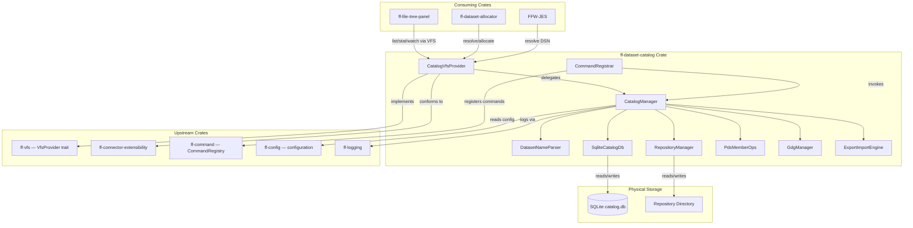

# Design Document: Dataset Catalog (`ff-dataset-catalog`)

## Overview

The `ff-dataset-catalog` crate provides **mainframe dataset filesystem emulation on the local desktop**. It implements a SQLite-backed catalog database that maps mainframe-style dataset names (HLQ.qualifier format) to physical files stored in a structured repository layout on the local filesystem. The crate supports sequential datasets (PS), partitioned datasets (PDS/PDSE), and Generation Data Groups (GDG).

### Purpose

- Provide a VFS provider (scheme `catalog`) that makes datasets addressable as `vfs://catalog/DSN`
- Implement SQLite-backed catalog database with WAL mode for concurrent access
- Enforce mainframe dataset naming rules (DSN validation, case-insensitive uppercase storage)
- Support dataset lifecycle: allocate, delete, rename, resolve, open, list, stat
- Manage PDS member operations (list, create, delete, rename)
- Manage GDG bases and generations with rolling limits and scratch policies
- Support catalog lifecycle: mount, unmount, create, remove, export, import
- Expose all operations as commands via `ff-command`

### Position in Architecture

```
Wave 13 — Dataset Catalog (depends on Wave 3 VFS + Wave 2 Platform)

┌─────────────────────────────────────────────────────────────┐
│              Shell Layer: ff-desktop (egui)                   │
├─────────────────────────────────────────────────────────────┤
│  Consuming crates: ff-file-tree-panel, FFW-JES,              │
│                    ff-dataset-allocator                       │
├─────────────────────────────────────────────────────────────┤
│  ff-dataset-catalog (THIS CRATE) — Wave 13                   │
│  Implements VfsProvider under scheme "catalog"               │
├─────────────────────────────────────────────────────────────┤
│  ff-vfs │ ff-connector-extensibility │ ff-command │ ff-config│
│              (Wave 2–3 — Platform + VFS)                      │
├─────────────────────────────────────────────────────────────┤
│                     ff-logging (Wave 0)                       │
└─────────────────────────────────────────────────────────────┘
```

### Design Constraints (Cross-Cutting)

- **FFW-ARCH-001 (Req 1)**: All dataset I/O flows through VFS — no direct `std::fs` in consuming crates
- **GUI Independence (Req 2)**: Zero GUI dependencies — no egui, winit, wgpu
- **Command-Driven (Req 4)**: All catalog/dataset operations registered as commands via `ff-command`
- **Async I/O (Req 6)**: All I/O methods are async, compatible with Tokio runtime
- **Multi-Crate Workspace (Req 7)**: Crate at `crates/ff-dataset-catalog`
- **Error Message Standards (Req 8)**: Errors follow `[catalog] operation: description` format
- **VFS Provider Integration**: Implements `VfsProvider` trait, registers under scheme `catalog`
- **SQLite WAL Mode**: Concurrent read access during write operations
- **Case-Insensitive DSN**: All dataset names stored and compared in uppercase

### Upstream Dependencies

| Crate | Relationship |
|-------|-------------|
| `ff-vfs` | Implements `VfsProvider` trait; uses `ResourceUri`, `VfsEntry`, `VfsMetadata`, `VfsError` |
| `ff-connector-extensibility` | Conforms to connector framework for capability advertisement |
| `ff-command` | Registers catalog/dataset/member/GDG commands with the command registry |
| `ff-config` | Reads/writes `[catalog]` namespace for mounted catalogs, default HLQ, paths |
| `ff-logging` | Diagnostic logging via `log_info!`, `log_warn!`, `log_error!` macros |

### Downstream Consumers

| Crate | Relationship |
|-------|-------------|
| `ff-dataset-allocator` | Uses catalog for DSN resolution, disposition handling |
| `ff-file-tree-panel` | Renders catalog content via VFS list/stat under "Catalogs" root node |
| `FFW-JES` | Resolves dataset references in JCL via catalog |

---

## Architecture

### High-Level Architecture Diagram



### Layer Placement

| Component | Responsibility |
|-----------|---------------|
| **CatalogVfsProvider** | Implements `VfsProvider` trait; translates VFS operations to catalog operations |
| **CatalogManager** | Orchestrates catalog lifecycle (mount, unmount, resolve); manages multiple mounted catalogs |
| **DatasetNameParser** | Validates and parses DSN strings, member references, GDG relative references |
| **RepositoryManager** | Manages physical directory structure (storage/, pds/, gdg/, temp/) |
| **SqliteCatalogDb** | SQLite database access layer; schema creation, CRUD operations, parameterized queries |
| **PdsMemberOps** | PDS member CRUD: list, create, delete, rename within a PDS directory |
| **GdgManager** | GDG base/generation lifecycle, rolling limit enforcement, generation numbering |
| **CommandRegistrar** | Registers all catalog/dataset/member/GDG commands with ff-command |
| **ExportImportEngine** | ZIP archive creation/extraction for catalog portability |

### Request Flow

```
Consumer calls vfs.read("vfs://catalog/PAYROLL.INPUT.FILE")
    │
    ▼
ResourceUri::parse → provider="catalog", path="PAYROLL.INPUT.FILE"
    │
    ▼
ProviderRegistry::get("catalog") → &CatalogVfsProvider
    │
    ▼
CatalogVfsProvider::read("PAYROLL.INPUT.FILE")
    │
    ▼
DatasetNameParser::parse("PAYROLL.INPUT.FILE") → DatasetName { qualifiers: ["PAYROLL","INPUT","FILE"] }
    │
    ▼
CatalogManager::resolve(dsn) → searches mounted catalogs by priority
    │
    ▼
SqliteCatalogDb::lookup_by_dsn("PAYROLL.INPUT.FILE") → DatasetEntry { storage_path, dsorg, ... }
    │
    ▼
RepositoryManager::read_file(repo_root, storage_path) → Vec<u8>
    │
    ▼
Result<Vec<u8>, VfsError> → returned to consumer
```

---

### Phase BS.4: SQLite Record Provider and KSDS

The KSDS implementation is isolated from the catalogue database. Each KSDS
dataset receives a dedicated SQLite database under the repository's
`indexed/` directory, named from its catalogue `physical_locator` UUID.
`rusqlite` with the `bundled` feature supplies the SQLite engine, so a separate
SQLite installation is not required.

The provider stores record payloads in a keyed table and keeps key definition
metadata in the catalogue layer. All value data uses parameterized SQL
statements. Database initialization enables WAL mode and creates the schema
idempotently. Primary-key uniqueness is enforced by the SQLite schema and
transaction boundaries, while ordered reads and range retrieval use indexed
key comparisons.

Phase BS.4 does not implement alternate indexes or the broader transaction,
backup, and governance layers. Those remain subsequent tasks in
`dataset-catalog/tasks.md`.

### Phase BS.5: SQLite Record Provider and RRDS

RRDS datasets use a dedicated SQLite database under `relative/`, named from
the catalogue physical-locator UUID. The `RRDS_RECORDS` table stores the
relative record number, payload, and an allocation flag. Missing rows represent
unallocated slots; rows with an empty payload represent allocated blank
records. Writes use an upsert inside a transaction, deletes remove the row,
and sequential reads order allocated rows by relative record number.

---

## Components and Interfaces

```
crates/ff-dataset-catalog/
├── Cargo.toml
├── src/
│   ├── lib.rs                  # Public API re-exports, crate docs
│   ├── provider.rs             # CatalogVfsProvider: VfsProvider trait implementation
│   ├── catalog.rs              # CatalogManager: mount/unmount, multi-catalog orchestration
│   ├── dataset_name.rs         # DatasetName, HLQ, member parsing, validation
│   ├── dataset.rs              # Dataset types, DatasetEntry, allocation parameters
│   ├── repository.rs           # RepositoryManager: physical directory layout management
│   ├── db/
│   │   ├── mod.rs              # Re-exports for database module
│   │   ├── connection.rs       # SQLite connection pool, WAL mode setup
│   │   ├── schema.rs           # Schema creation, migration, version validation
│   │   ├── queries.rs          # Parameterized query functions (CRUD operations)
│   │   └── models.rs           # Database row types (internal, not public)
│   ├── pds.rs                  # PdsMemberOps: member list, create, delete, rename
│   ├── gdg.rs                  # GdgManager: base/generation lifecycle, rolling limits
│   ├── commands.rs             # CommandRegistrar: all command registrations
│   ├── export.rs               # ExportImportEngine: ZIP archive operations
│   ├── config.rs               # Configuration integration: [catalog] namespace
│   ├── resolve.rs              # DSN resolution logic across mounted catalogs
│   ├── encoding.rs             # Filesystem-safe name encoding (national chars → percent-encoding)
│   └── error.rs                # CatalogError enum, VfsError mapping
└── tests/
    ├── dsn_validation_tests.rs # DatasetName parsing property tests
    ├── catalog_lifecycle_tests.rs  # Mount/unmount/create/remove tests
    ├── dataset_crud_tests.rs   # Allocate/delete/rename tests
    ├── pds_member_tests.rs     # PDS member operations tests
    ├── gdg_tests.rs            # GDG base/generation lifecycle tests
    ├── vfs_provider_tests.rs   # VfsProvider trait compliance tests
    ├── repository_tests.rs     # Physical layout management tests
    └── integration.rs          # End-to-end catalog operations with temp repos
```

---

## Data Models

### DatasetName

```rust
/// A validated mainframe dataset name in HLQ.qualifier format.
/// Stored internally in uppercase. Maximum 44 characters total.
///
/// Addresses: Requirement 2, criteria 1–9
#[derive(Debug, Clone, PartialEq, Eq, Hash)]
pub struct DatasetName {
    /// The full DSN string in uppercase (e.g., "PAYROLL.INPUT.FILE")
    normalized: String,
    /// Individual qualifiers (e.g., ["PAYROLL", "INPUT", "FILE"])
    qualifiers: Vec<String>,
}

impl DatasetName {
    /// Parse and validate a DSN string. Returns error with position info on failure.
    /// Performs case-insensitive normalization (stores uppercase).
    ///
    /// Addresses: Requirement 2 AC 1–5, AC 7
    pub fn parse(input: &str) -> Result<Self, CatalogError>;

    /// Parse a DSN with optional member reference: "DSN(MEMBER)".
    /// Returns (DatasetName, Option<MemberName>).
    ///
    /// Addresses: Requirement 2 AC 9
    pub fn parse_with_member(input: &str) -> Result<(Self, Option<MemberName>), CatalogError>;

    /// Get the High Level Qualifier (first qualifier).
    pub fn hlq(&self) -> &str;

    /// Get all qualifiers as a slice.
    pub fn qualifiers(&self) -> &[String];

    /// Get the full normalized DSN string.
    pub fn as_str(&self) -> &str;

    /// Check if this DSN matches a filter pattern (with * and % wildcards).
    ///
    /// Addresses: Requirement 13 AC 9
    pub fn matches_pattern(&self, pattern: &str) -> bool;

    /// Construct from components without re-parsing (for internal use).
    pub(crate) fn from_qualifiers(qualifiers: Vec<String>) -> Self;
}

impl Display for DatasetName { /* produces "PAYROLL.INPUT.FILE" */ }
impl FromStr for DatasetName { /* delegates to parse() */ }
```

### MemberName

```rust
/// A validated PDS member name (1–8 characters, same rules as a single qualifier).
///
/// Addresses: Requirement 2 AC 8
#[derive(Debug, Clone, PartialEq, Eq, Hash)]
pub struct MemberName {
    /// The member name in uppercase
    normalized: String,
}

impl MemberName {
    /// Parse and validate a member name.
    pub fn parse(input: &str) -> Result<Self, CatalogError>;

    /// Get the normalized member name string.
    pub fn as_str(&self) -> &str;
}

impl Display for MemberName { /* produces "MEMBER" */ }
impl FromStr for MemberName { /* delegates to parse() */ }
```

### DatasetOrganization

```rust
/// The organization type of a dataset.
///
/// Addresses: Requirement 3 AC 1
#[derive(Debug, Clone, Copy, PartialEq, Eq, Hash)]
#[non_exhaustive]
pub enum DatasetOrganization {
    /// Sequential — single flat file
    PS,
    /// Partitioned — library of members (PDS or PDSE)
    PO,
    /// Generation Data Group — versioned dataset collection
    GDG,
}

impl Display for DatasetOrganization { /* "PS", "PO", "GDG" */ }
impl FromStr for DatasetOrganization { /* case-insensitive parse */ }
```

### RecordFormat

```rust
/// Record format for a dataset.
///
/// Addresses: Requirement 3 AC 6, Requirement 7 AC 1
#[derive(Debug, Clone, Copy, PartialEq, Eq, Hash)]
#[non_exhaustive]
pub enum RecordFormat {
    /// Fixed length records
    F,
    /// Fixed blocked records
    FB,
    /// Variable length records
    V,
    /// Variable blocked records
    VB,
    /// Undefined format
    U,
}

impl Display for RecordFormat { /* "F", "FB", "V", "VB", "U" */ }
impl FromStr for RecordFormat { /* case-insensitive parse */ }
```

### PartitionedSubtype

```rust
/// Distinguishes PDS from PDSE.
///
/// Addresses: Requirement 3 AC 5
#[derive(Debug, Clone, Copy, PartialEq, Eq, Hash, Default)]
pub enum PartitionedSubtype {
    /// Standard Partitioned Dataset
    #[default]
    PDS,
    /// Partitioned Dataset Extended
    PDSE,
}
```

### DatasetAttributes

```rust
/// Allocation attributes for a dataset.
///
/// Addresses: Requirement 3 AC 6, Requirement 7 AC 1, Requirement 15
#[derive(Debug, Clone, PartialEq, Eq)]
pub struct DatasetAttributes {
    /// Record format
    pub recfm: RecordFormat,
    /// Logical record length (1–32760)
    pub lrecl: u32,
    /// Block size (≥ LRECL)
    pub blksize: u32,
    /// For PO datasets: PDS vs PDSE
    pub subtype: Option<PartitionedSubtype>,
    /// Directory blocks (for PDS allocation, informational)
    pub dir_blocks: Option<u32>,
    /// Allocated space (informational)
    pub allocated_space: Option<u64>,
    /// Description
    pub description: Option<String>,
}

impl DatasetAttributes {
    /// Apply default attributes for a given DSORG when fields are not specified.
    ///
    /// Addresses: Requirement 15 AC 1–3
    pub fn with_defaults(self, dsorg: DatasetOrganization) -> Self;

    /// Validate allocation parameters against constraints.
    ///
    /// Addresses: Requirement 7 AC 10
    pub fn validate(&self) -> Result<(), CatalogError>;
}
```

### DatasetEntry

```rust
/// A dataset entry as stored in the catalog database.
///
/// Addresses: Requirement 1 AC 2, Requirement 3 AC 6
#[derive(Debug, Clone, PartialEq, Eq)]
pub struct DatasetEntry {
    /// Unique identifier (database row ID)
    pub id: i64,
    /// The dataset name
    pub dsn: DatasetName,
    /// Dataset organization
    pub dsorg: DatasetOrganization,
    /// Relative path from repository root to physical content
    pub storage_path: String,
    /// Record format
    pub recfm: Option<RecordFormat>,
    /// Logical record length
    pub lrecl: Option<u32>,
    /// Block size
    pub blksize: Option<u32>,
    /// PDS/PDSE subtype (only for PO datasets)
    pub subtype: Option<PartitionedSubtype>,
    /// Creation timestamp (ISO 8601)
    pub created: Option<String>,
    /// Last modification timestamp (ISO 8601)
    pub modified: Option<String>,
    /// Last access timestamp (ISO 8601)
    pub accessed: Option<String>,
}
```

### GdgBase

```rust
/// A Generation Data Group base definition.
///
/// Addresses: Requirement 1 AC 3, Requirement 9 AC 1
#[derive(Debug, Clone, PartialEq, Eq)]
pub struct GdgBase {
    /// Unique identifier (database row ID)
    pub id: i64,
    /// The GDG base dataset name
    pub dsn: DatasetName,
    /// Maximum active generations (1–255)
    pub limit: u8,
    /// Whether rolled-off generations are physically deleted
    pub scratch: bool,
    /// Creation timestamp (ISO 8601)
    pub created: Option<String>,
}
```

### GdgGeneration

```rust
/// A single generation within a GDG.
///
/// Addresses: Requirement 1 AC 4, Requirement 9 AC 2
#[derive(Debug, Clone, PartialEq, Eq)]
pub struct GdgGeneration {
    /// Unique identifier (database row ID)
    pub id: i64,
    /// Reference to the owning GDG base
    pub base_id: i64,
    /// Generation number (e.g., 1, 2, 3...)
    pub generation_number: u32,
    /// Version number (default 0)
    pub version: u32,
    /// Reference to the dataset entry for this generation
    pub dataset_id: i64,
    /// Status of the generation
    pub status: GdgGenerationStatus,
}

/// Status of a GDG generation.
///
/// Addresses: Requirement 1 AC 4
#[derive(Debug, Clone, Copy, PartialEq, Eq, Hash)]
pub enum GdgGenerationStatus {
    /// Currently active and accessible
    Active,
    /// Rolled off due to limit exceeded
    RolledOff,
    /// Deferred (not yet committed)
    Deferred,
}
```

### GdgRelativeReference

```rust
/// A relative reference to a GDG generation (+1, 0, -1, etc.).
///
/// Addresses: Requirement 9 AC 4, AC 10
#[derive(Debug, Clone, Copy, PartialEq, Eq)]
pub enum GdgRelativeReference {
    /// Allocate a new generation (only valid in allocation context)
    New,          // (+1)
    /// Current (most recently created) generation
    Current,      // (0)
    /// Previous generation at offset (negative value)
    Previous(u32), // (-1), (-2), etc.
}

impl GdgRelativeReference {
    /// Parse a relative reference string like "(+1)", "(0)", "(-2)".
    pub fn parse(input: &str) -> Result<Self, CatalogError>;
}
```

### Catalog

```rust
/// Represents a mounted catalog instance with its database and repository.
///
/// Addresses: Requirement 5, Requirement 6
#[derive(Debug)]
pub struct Catalog {
    /// Human-readable catalog name
    pub name: String,
    /// Path to the repository root directory
    pub repository_path: PathBuf,
    /// Description
    pub description: Option<String>,
    /// Database connection handle
    db: SqliteCatalogDb,
    /// Repository manager for physical file operations
    repo: RepositoryManager,
}
```

### CatalogMount

```rust
/// Configuration entry for a mounted catalog.
///
/// Addresses: Requirement 5 AC 6, Requirement 14 AC 2
#[derive(Debug, Clone, PartialEq, Eq)]
pub struct CatalogMount {
    /// Catalog name
    pub name: String,
    /// Repository root path
    pub path: PathBuf,
    /// Priority order (higher = checked first for resolution)
    pub priority: u32,
    /// Whether to auto-mount on startup
    pub auto_mount: bool,
}
```

### PdsMember

```rust
/// Metadata for a PDS member.
///
/// Addresses: Requirement 8 AC 1
#[derive(Debug, Clone, PartialEq, Eq)]
pub struct PdsMember {
    /// Member name (uppercase, 1–8 chars)
    pub name: MemberName,
    /// File size in bytes
    pub size: u64,
    /// Last modification time
    pub modified: Option<String>,
}
```

### DatasetProperties

```rust
/// Complete property set for the properties panel display.
///
/// Addresses: Requirement 11
#[derive(Debug, Clone)]
pub struct DatasetProperties {
    /// The dataset name
    pub dsn: DatasetName,
    /// Organization type
    pub dsorg: DatasetOrganization,
    /// Record format (if applicable)
    pub recfm: Option<RecordFormat>,
    /// Logical record length (if applicable)
    pub lrecl: Option<u32>,
    /// Block size (if applicable)
    pub blksize: Option<u32>,
    /// PDS/PDSE subtype (only for PO)
    pub subtype: Option<PartitionedSubtype>,
    /// Creation date
    pub created: Option<String>,
    /// Last modified date
    pub modified: Option<String>,
    /// Last access date
    pub accessed: Option<String>,
    /// Physical file size in bytes
    pub physical_size: Option<u64>,
    /// Physical path on disk
    pub physical_path: Option<PathBuf>,
    /// Name of the containing catalog
    pub catalog_name: String,
    /// Member count (PDS only)
    pub member_count: Option<usize>,
    /// GDG-specific fields
    pub gdg_limit: Option<u8>,
    pub gdg_scratch: Option<bool>,
    pub gdg_active_generations: Option<usize>,
    /// GDG generation-specific fields
    pub generation_number: Option<u32>,
    pub parent_gdg_dsn: Option<DatasetName>,
}
```

### AllocationRequest

```rust
/// Parameters for allocating (creating) a new dataset.
///
/// Addresses: Requirement 7 AC 1, Requirement 15
#[derive(Debug, Clone)]
pub struct AllocationRequest {
    /// Dataset name to allocate
    pub dsn: DatasetName,
    /// Organization type
    pub dsorg: DatasetOrganization,
    /// Record format (optional — defaults applied per Req 15)
    pub recfm: Option<RecordFormat>,
    /// Logical record length (optional — defaults applied per Req 15)
    pub lrecl: Option<u32>,
    /// Block size (optional — defaults applied per Req 15)
    pub blksize: Option<u32>,
    /// Directory blocks (PDS only)
    pub dir_blocks: Option<u32>,
    /// GDG limit (GDG only, 1–255)
    pub gdg_limit: Option<u8>,
    /// GDG scratch policy (GDG only)
    pub gdg_scratch: Option<bool>,
    /// PDS/PDSE subtype
    pub subtype: Option<PartitionedSubtype>,
    /// Description
    pub description: Option<String>,
}
```

### ResolveResult

```rust
/// Result of resolving a DSN against mounted catalogs.
///
/// Addresses: Requirement 7 AC 8
#[derive(Debug, Clone)]
pub struct ResolveResult {
    /// The resolved dataset entry
    pub entry: DatasetEntry,
    /// The catalog that provided the resolution
    pub catalog_name: String,
    /// Absolute physical path to the dataset content
    pub physical_path: PathBuf,
}
```

---

## Public API Surface

### CatalogVfsProvider — VFS Provider Implementation

```rust
/// VFS provider implementation for the dataset catalog.
/// Registers under scheme "catalog". Translates VFS operations to catalog operations.
///
/// Addresses: Requirement 10, criteria 1–12
pub struct CatalogVfsProvider {
    catalog_manager: Arc<CatalogManager>,
}

#[async_trait::async_trait]
impl VfsProvider for CatalogVfsProvider {
    /// Returns "catalog".
    fn scheme(&self) -> &str;

    /// Returns Read | Write | List | Metadata | Create | Delete | Rename.
    /// Does NOT include Watch or Search in initial release.
    ///
    /// Addresses: Requirement 10 AC 11
    fn capabilities(&self) -> VfsCapabilities;

    /// Resolves DSN to physical path and opens for I/O.
    ///
    /// Addresses: Requirement 10 AC 5
    async fn open(&self, path: &str, options: OpenOptions) -> Result<Box<dyn VfsFile>, VfsError>;

    /// Reads entire dataset or PDS member content.
    ///
    /// Addresses: Requirement 10 AC 6
    async fn read(&self, path: &str) -> Result<Vec<u8>, VfsError>;

    /// Reads dataset content as async byte stream.
    async fn read_stream(&self, path: &str) -> Result<Pin<Box<dyn AsyncRead + Send>>, VfsError>;

    /// Writes data to a sequential dataset or PDS member.
    ///
    /// Addresses: Requirement 10 AC 6
    async fn write(&self, path: &str, data: &[u8]) -> Result<(), VfsError>;

    /// Creates (allocates) a new dataset.
    ///
    /// Addresses: Requirement 10 AC 7
    async fn create(&self, path: &str, options: CreateOptions) -> Result<(), VfsError>;

    /// Deletes a dataset (catalog entry + physical storage).
    ///
    /// Addresses: Requirement 10 AC 8
    async fn delete(&self, path: &str, options: DeleteOptions) -> Result<(), VfsError>;

    /// Renames a dataset (updates catalog + physical path).
    ///
    /// Addresses: Requirement 10 AC 9
    async fn rename(&self, old_path: &str, new_path: &str) -> Result<(), VfsError>;

    /// Lists catalogs, HLQs, datasets, or PDS members depending on path depth.
    ///
    /// Addresses: Requirement 10 AC 3
    async fn list(&self, path: &str) -> Result<Vec<VfsEntry>, VfsError>;

    /// Returns VfsMetadata with dataset attributes in extra map.
    ///
    /// Addresses: Requirement 10 AC 4
    async fn stat(&self, path: &str) -> Result<VfsMetadata, VfsError>;

    /// Checks whether DSN exists in any mounted catalog.
    ///
    /// Addresses: Requirement 10 AC 10
    async fn exists(&self, path: &str) -> Result<bool, VfsError>;
}
```

### CatalogManager — Catalog Lifecycle

```rust
/// Manages multiple mounted catalogs, resolution priority, and lifecycle.
///
/// Addresses: Requirement 5, Requirement 6
pub struct CatalogManager {
    /// Mounted catalogs in priority order (highest priority first)
    catalogs: RwLock<Vec<Catalog>>,
    /// Configuration handle for persistence
    config: Arc<dyn ConfigHandle>,
    /// Default HLQ for bare qualifier expansion
    default_hlq: RwLock<Option<String>>,
}

impl CatalogManager {
    /// Create a new CatalogManager.
    pub fn new(config: Arc<dyn ConfigHandle>) -> Self;

    /// Mount a catalog from a repository path.
    ///
    /// Addresses: Requirement 5 AC 1, AC 5, AC 7
    pub async fn mount(&self, path: &Path) -> Result<(), CatalogError>;

    /// Unmount a catalog by name.
    ///
    /// Addresses: Requirement 5 AC 4
    pub async fn unmount(&self, name: &str) -> Result<(), CatalogError>;

    /// Create a new empty catalog.
    ///
    /// Addresses: Requirement 6 AC 1, AC 2
    pub async fn create_catalog(&self, name: &str, path: &Path, options: CreateCatalogOptions) -> Result<(), CatalogError>;

    /// Remove a catalog (unmount + optionally delete files).
    ///
    /// Addresses: Requirement 6 AC 3
    pub async fn remove_catalog(&self, name: &str, delete_files: bool) -> Result<(), CatalogError>;

    /// Export a catalog to a ZIP archive.
    ///
    /// Addresses: Requirement 6 AC 4, AC 5
    pub async fn export_catalog(&self, name: &str, output_path: &Path) -> Result<(), CatalogError>;

    /// Import a catalog from a ZIP archive.
    ///
    /// Addresses: Requirement 6 AC 6, AC 7, AC 8
    pub async fn import_catalog(&self, archive_path: &Path, target_dir: &Path) -> Result<(), CatalogError>;

    /// Resolve a DSN across all mounted catalogs (priority order).
    ///
    /// Addresses: Requirement 5 AC 3, Requirement 7 AC 8
    pub async fn resolve(&self, dsn: &DatasetName) -> Result<ResolveResult, CatalogError>;

    /// List all mounted catalogs.
    pub fn list_mounted(&self) -> Vec<CatalogMount>;

    /// Restore mounts from configuration on startup.
    ///
    /// Addresses: Requirement 14 AC 3
    pub async fn restore_from_config(&self) -> Result<(), CatalogError>;

    /// Get/set default HLQ.
    ///
    /// Addresses: Requirement 2 AC 6
    pub fn default_hlq(&self) -> Option<String>;
    pub fn set_default_hlq(&self, hlq: Option<String>);
}
```

### Dataset CRUD Operations

```rust
impl CatalogManager {
    /// Allocate (create) a new dataset.
    ///
    /// Addresses: Requirement 7 AC 1–3, Requirement 15 AC 1–5
    pub async fn allocate_dataset(&self, request: AllocationRequest) -> Result<DatasetEntry, CatalogError>;

    /// Delete a dataset by DSN (removes catalog entry + physical storage).
    ///
    /// Addresses: Requirement 7 AC 4, AC 5
    pub async fn delete_dataset(&self, dsn: &DatasetName) -> Result<(), CatalogError>;

    /// Rename a dataset.
    ///
    /// Addresses: Requirement 7 AC 6, AC 7
    pub async fn rename_dataset(&self, old_dsn: &DatasetName, new_dsn: &DatasetName) -> Result<(), CatalogError>;

    /// Get dataset properties for the properties panel.
    ///
    /// Addresses: Requirement 11 AC 1–9
    pub async fn get_properties(&self, dsn: &DatasetName) -> Result<DatasetProperties, CatalogError>;

    /// List datasets matching a filter pattern.
    ///
    /// Addresses: Requirement 13 AC 1–3
    pub async fn listcat(&self, filter: &str, dsorg_filter: Option<DatasetOrganization>, catalog_filter: Option<&str>) -> Result<Vec<DatasetEntry>, CatalogError>;

    /// Get detailed info for a dataset (LISTDS equivalent).
    ///
    /// Addresses: Requirement 13 AC 4–8
    pub async fn listds(&self, dsn: &DatasetName, members: bool, history: bool) -> Result<DatasetProperties, CatalogError>;
}
```

### PDS Member Operations

```rust
impl CatalogManager {
    /// List all members of a PDS.
    ///
    /// Addresses: Requirement 8 AC 1
    pub async fn list_members(&self, dsn: &DatasetName) -> Result<Vec<PdsMember>, CatalogError>;

    /// Create a new member in a PDS.
    ///
    /// Addresses: Requirement 8 AC 3, AC 4, AC 8
    pub async fn create_member(&self, dsn: &DatasetName, member: &MemberName, overwrite: bool) -> Result<(), CatalogError>;

    /// Delete a member from a PDS.
    ///
    /// Addresses: Requirement 8 AC 5, AC 7
    pub async fn delete_member(&self, dsn: &DatasetName, member: &MemberName) -> Result<(), CatalogError>;

    /// Rename a member within a PDS.
    ///
    /// Addresses: Requirement 8 AC 6
    pub async fn rename_member(&self, dsn: &DatasetName, old_name: &MemberName, new_name: &MemberName) -> Result<(), CatalogError>;

    /// Open a PDS member for reading/writing.
    ///
    /// Addresses: Requirement 8 AC 2
    pub async fn open_member(&self, dsn: &DatasetName, member: &MemberName, options: OpenOptions) -> Result<Box<dyn VfsFile>, CatalogError>;
}
```

### GDG Operations

```rust
impl CatalogManager {
    /// Create a new GDG base.
    ///
    /// Addresses: Requirement 9 AC 1
    pub async fn create_gdg_base(&self, dsn: &DatasetName, limit: u8, scratch: bool) -> Result<GdgBase, CatalogError>;

    /// Create a new generation for a GDG (+1 allocation).
    ///
    /// Addresses: Requirement 9 AC 2, AC 3
    pub async fn create_gdg_generation(
        &self,
        base_dsn: &DatasetName,
        dsorg: DatasetOrganization,
        attrs: DatasetAttributes,
    ) -> Result<GdgGeneration, CatalogError>;

    /// Resolve a GDG relative reference to a specific generation.
    ///
    /// Addresses: Requirement 9 AC 4, AC 5, AC 10
    pub async fn resolve_gdg_reference(
        &self,
        base_dsn: &DatasetName,
        reference: GdgRelativeReference,
    ) -> Result<ResolveResult, CatalogError>;

    /// List all active generations of a GDG.
    ///
    /// Addresses: Requirement 9 AC 6
    pub async fn list_gdg_generations(&self, base_dsn: &DatasetName) -> Result<Vec<GdgGeneration>, CatalogError>;

    /// Modify a GDG base's properties (limit, scratch policy).
    ///
    /// Addresses: Requirement 9 AC 7
    pub async fn modify_gdg_base(&self, base_dsn: &DatasetName, new_limit: Option<u8>, new_scratch: Option<bool>) -> Result<(), CatalogError>;

    /// Delete a GDG base and all its generations.
    ///
    /// Addresses: Requirement 9 AC 8
    pub async fn delete_gdg_base(&self, base_dsn: &DatasetName) -> Result<(), CatalogError>;
}
```

---

## Error Handling

```rust
/// Error type for all catalog operations.
/// Maps to VfsError variants for the VFS provider interface.
///
/// Addresses: Requirement 10 AC 12
#[derive(Debug, thiserror::Error)]
#[non_exhaustive]
pub enum CatalogError {
    /// Dataset name does not exist in any mounted catalog
    #[error("[catalog] {operation}: dataset not found: {dsn}")]
    DatasetNotFound {
        dsn: String,
        operation: String,
    },

    /// Dataset name already exists in a mounted catalog
    #[error("[catalog] {operation}: dataset already exists: {dsn} (in catalog '{catalog}')")]
    DatasetAlreadyExists {
        dsn: String,
        catalog: String,
        operation: String,
    },

    /// Invalid dataset name format
    #[error("[catalog] {operation}: invalid DSN '{input}': {reason} at position {position}")]
    InvalidDatasetName {
        input: String,
        reason: String,
        position: usize,
        operation: String,
    },

    /// Invalid member name format
    #[error("[catalog] {operation}: invalid member name '{input}': {reason}")]
    InvalidMemberName {
        input: String,
        reason: String,
        operation: String,
    },

    /// PDS member not found
    #[error("[catalog] {operation}: member '{member}' not found in {dsn}")]
    MemberNotFound {
        dsn: String,
        member: String,
        operation: String,
    },

    /// PDS member already exists
    #[error("[catalog] {operation}: member '{member}' already exists in {dsn}")]
    MemberAlreadyExists {
        dsn: String,
        member: String,
        operation: String,
    },

    /// Operation attempted on wrong dataset type
    #[error("[catalog] {operation}: dataset '{dsn}' is {actual_type}, expected {expected_type}")]
    TypeMismatch {
        dsn: String,
        actual_type: String,
        expected_type: String,
        operation: String,
    },

    /// No catalog is mounted / provider unavailable
    #[error("[catalog] {operation}: no catalogs mounted")]
    NoCatalogsMounted {
        operation: String,
    },

    /// Catalog not found by name
    #[error("[catalog] {operation}: catalog '{name}' not found")]
    CatalogNotFound {
        name: String,
        operation: String,
    },

    /// Repository structure is invalid or corrupt
    #[error("[catalog] {operation}: repository validation failed at '{path}': {reason}")]
    RepositoryInvalid {
        path: String,
        reason: String,
        operation: String,
    },

    /// Database schema version mismatch
    #[error("[catalog] {operation}: schema version mismatch: found {found}, expected {expected}")]
    SchemaMismatch {
        found: String,
        expected: String,
        operation: String,
    },

    /// Invalid allocation parameters
    #[error("[catalog] {operation}: invalid allocation parameter: {reason}")]
    InvalidAllocationParameter {
        reason: String,
        operation: String,
    },

    /// GDG relative reference out of bounds or invalid
    #[error("[catalog] {operation}: GDG reference '{reference}' invalid for '{dsn}': {reason}")]
    InvalidGdgReference {
        dsn: String,
        reference: String,
        reason: String,
        operation: String,
    },

    /// Export/import archive error
    #[error("[catalog] {operation}: archive error: {reason}")]
    ArchiveError {
        reason: String,
        operation: String,
    },

    /// Configuration error
    #[error("[catalog] {operation}: configuration error: {reason}")]
    ConfigError {
        reason: String,
        operation: String,
    },

    /// SQLite database error
    #[error("[catalog] {operation}: database error: {source}")]
    Database {
        operation: String,
        #[source]
        source: rusqlite::Error,
    },

    /// Underlying I/O error
    #[error("[catalog] {operation}: I/O error: {source}")]
    Io {
        operation: String,
        #[source]
        source: std::io::Error,
    },
}
```

### VfsError Mapping

```rust
impl From<CatalogError> for VfsError {
    fn from(err: CatalogError) -> VfsError {
        match err {
            CatalogError::DatasetNotFound { dsn, operation } =>
                VfsError::NotFound { uri: dsn, operation },
            CatalogError::DatasetAlreadyExists { dsn, operation, .. } =>
                VfsError::AlreadyExists { uri: dsn, operation },
            CatalogError::InvalidDatasetName { input, operation, .. } =>
                VfsError::InvalidUri { uri: input, reason: err.to_string() },
            CatalogError::MemberNotFound { dsn, member, operation } =>
                VfsError::NotFound { uri: format!("{dsn}({member})"), operation },
            CatalogError::MemberAlreadyExists { dsn, member, operation } =>
                VfsError::AlreadyExists { uri: format!("{dsn}({member})"), operation },
            CatalogError::NoCatalogsMounted { .. } =>
                VfsError::ProviderUnavailable { scheme: "catalog".to_string() },
            CatalogError::TypeMismatch { dsn, operation, .. } =>
                VfsError::NotADirectory { uri: dsn, operation },
            _ => VfsError::Io {
                uri: String::new(),
                operation: String::new(),
                source: std::io::Error::new(std::io::ErrorKind::Other, err.to_string()),
            },
        }
    }
}
```

---

## Integration Points

### With `ff-vfs` (Virtual File System — upstream)

- **Dependency direction**: ff-dataset-catalog implements `VfsProvider` from ff-vfs
- **API consumed**: `VfsProvider` trait, `VfsCapabilities`, `VfsFile` trait, `VfsEntry`, `VfsMetadata`, `VfsError`, `OpenOptions`, `CreateOptions`, `DeleteOptions`
- **API provided**: `CatalogVfsProvider` instance registered with `ProviderRegistry` under scheme `"catalog"`
- **Registration**: During application startup (after VFS initializes), the catalog subsystem registers itself via `registry.register(Arc::new(CatalogVfsProvider::new(catalog_manager)))`
- **URI format**: `vfs://catalog/DSN` where DSN is the dataset name (e.g., `vfs://catalog/PAYROLL.INPUT.FILE`)
- **Metadata mapping**: Dataset attributes (RECFM, LRECL, BLKSIZE, DSORG) placed in `VfsMetadata.extra` as key-value pairs

### With `ff-connector-extensibility` (Connector Framework — upstream)

- **Dependency direction**: ff-dataset-catalog conforms to connector patterns
- **API consumed**: `ConnectorCapability` enum for capability advertisement
- **Integration pattern**: The catalog provider advertises capabilities through the connector framework, making it discoverable by UI components that query available connectors
- **Note**: Unlike network connectors, the catalog provider has no connection state machine — it is always "connected" once mounted

### With `ff-command` (Command Framework — upstream)

- **Dependency direction**: ff-dataset-catalog registers commands with ff-command
- **API consumed**: `CommandRegistry::register()`, `CommandMetadata`, `CommandHandler` trait
- **Commands registered**:
  - `catalog.mount` — Mount a catalog from repository path
  - `catalog.unmount` — Unmount a catalog by name
  - `catalog.create` — Create a new empty catalog
  - `catalog.remove` — Remove a catalog (with optional deletion)
  - `catalog.export` — Export catalog to ZIP archive
  - `catalog.import` — Import catalog from ZIP archive
  - `catalog.listcat` — List datasets matching filter pattern
  - `catalog.listds` — Display detailed dataset information
  - `dataset.allocate` — Allocate (create) a new dataset
  - `dataset.delete` — Delete a dataset
  - `dataset.rename` — Rename a dataset
  - `dataset.properties` — Retrieve dataset properties
  - `member.create` — Create a new PDS member
  - `member.delete` — Delete a PDS member
  - `member.rename` — Rename a PDS member
  - `gdg.create_base` — Create a GDG base
  - `gdg.create_generation` — Create a new GDG generation
  - `gdg.delete_base` — Delete a GDG base and all generations
  - `gdg.list_generations` — List GDG generations
- **Command metadata**: All commands registered under category `"catalog"` with appropriate descriptions

### With `ff-config` (Configuration System — upstream)

- **Dependency direction**: ff-dataset-catalog reads/writes configuration via ff-config
- **API consumed**: `ConfigHandle` for reading/writing `[catalog]` namespace
- **Configuration keys**:
  ```toml
  [catalog]
  default_hlq = "USER"
  repository_root = "~/.ffworkbench/catalogs"

  [[catalog.mounted_catalogs]]
  name = "DEV"
  path = "/home/user/.ffworkbench/catalogs/dev"
  priority = 1
  auto_mount = true

  [[catalog.mounted_catalogs]]
  name = "TEST"
  path = "/home/user/.ffworkbench/catalogs/test"
  priority = 2
  auto_mount = false

  [catalog.defaults]
  ps_recfm = "FB"
  ps_lrecl = 80
  ps_blksize = 27920
  po_recfm = "FB"
  po_lrecl = 80
  po_blksize = 27920
  ```
- **Hot-reload**: Subscribes to config change notifications for the `[catalog]` namespace; auto-mounts/unmounts catalogs as configuration changes
- **Persistence**: Updates `mounted_catalogs` array when catalogs are mounted/unmounted during a session

### With `ff-logging` (Logging — upstream)

- **Dependency direction**: ff-dataset-catalog depends on ff-logging
- **API consumed**: `log_info!`, `log_warn!`, `log_error!`, `log_debug!` macros
- **Log prefix**: `[catalog]` for catalog-level operations, `[catalog:db]` for database operations
- **Logged events**:
  - INFO: Catalog mount/unmount, dataset allocate/delete, GDG generation creation
  - WARN: DSN validation failures, schema version mismatches, stale temp cleanup
  - ERROR: Database corruption, repository structure violations, I/O failures
  - DEBUG: DSN resolution steps, SQL queries executed, physical path resolution

---

## SQLite Schema Design

### Schema Overview

The catalog database (`catalog.db`) contains four tables and uses WAL journal mode for concurrent access.

```sql
-- Enable WAL mode for concurrent read access during writes
PRAGMA journal_mode = WAL;

-- Foreign key enforcement
PRAGMA foreign_keys = ON;

-- Catalog metadata (key-value store for catalog-level properties)
-- Addresses: Requirement 1 AC 8
CREATE TABLE catalog_metadata (
    key   TEXT PRIMARY KEY NOT NULL,
    value TEXT
);

-- Initial metadata entries
INSERT INTO catalog_metadata (key, value) VALUES
    ('schema_version', '1'),
    ('catalog_name', ''),
    ('description', ''),
    ('created', '');

-- Dataset entries
-- Addresses: Requirement 1 AC 2, AC 5
CREATE TABLE datasets (
    id           INTEGER PRIMARY KEY AUTOINCREMENT,
    dsn          TEXT    UNIQUE NOT NULL,
    dsorg        TEXT    NOT NULL CHECK (dsorg IN ('PS', 'PO', 'GDG')),
    storage_path TEXT    NOT NULL,
    recfm        TEXT    CHECK (recfm IN ('F', 'FB', 'V', 'VB', 'U') OR recfm IS NULL),
    lrecl        INTEGER CHECK (lrecl IS NULL OR (lrecl > 0 AND lrecl <= 32760)),
    blksize      INTEGER CHECK (blksize IS NULL OR blksize >= 0),
    subtype      TEXT    CHECK (subtype IS NULL OR subtype IN ('PDS', 'PDSE')),
    created      TEXT,
    modified     TEXT,
    accessed     TEXT
);

-- Index for HLQ-based lookups (first qualifier prefix matching)
CREATE INDEX idx_datasets_dsn_prefix ON datasets (dsn);

-- GDG base definitions
-- Addresses: Requirement 1 AC 3
CREATE TABLE gdg_bases (
    id      INTEGER PRIMARY KEY AUTOINCREMENT,
    dsn     TEXT    UNIQUE NOT NULL,
    limit_  INTEGER NOT NULL CHECK (limit_ >= 1 AND limit_ <= 255),
    scratch BOOLEAN NOT NULL DEFAULT 1,
    created TEXT,
    FOREIGN KEY (dsn) REFERENCES datasets(dsn) ON DELETE CASCADE
);

-- GDG generations
-- Addresses: Requirement 1 AC 4
CREATE TABLE gdg_generations (
    id                INTEGER PRIMARY KEY AUTOINCREMENT,
    base_id           INTEGER NOT NULL,
    generation_number INTEGER NOT NULL,
    version           INTEGER NOT NULL DEFAULT 0,
    dataset_id        INTEGER NOT NULL,
    status            TEXT    NOT NULL DEFAULT 'active'
                      CHECK (status IN ('active', 'rolled_off', 'deferred')),
    FOREIGN KEY (base_id) REFERENCES gdg_bases(id) ON DELETE CASCADE,
    FOREIGN KEY (dataset_id) REFERENCES datasets(id) ON DELETE CASCADE,
    UNIQUE (base_id, generation_number, version)
);

-- Index for generation lookups by base
CREATE INDEX idx_gdg_gen_base ON gdg_generations (base_id, generation_number DESC);
```

### Schema Invariants

- All DSN values stored in uppercase (enforced at application layer before INSERT)
- `storage_path` is always relative to the repository root (never absolute)
- `created`, `modified`, `accessed` timestamps in ISO 8601 format (e.g., `2024-01-15T10:30:00Z`)
- GDG base DSN must also exist as a row in `datasets` with `dsorg='GDG'`
- GDG generation `dataset_id` references the actual PS/PO dataset entry for that generation
- All queries use parameterized statements (Requirement 1 AC 9 — SQL injection prevention)

### Connection Management

```rust
/// SQLite database connection wrapper with WAL mode.
///
/// Addresses: Requirement 1 AC 6
pub(crate) struct SqliteCatalogDb {
    /// Connection pool (single writer, multiple readers via WAL)
    conn: Mutex<Connection>,
}

impl SqliteCatalogDb {
    /// Open or create a catalog database at the given path.
    /// Enables WAL mode, foreign keys, and creates schema if needed.
    ///
    /// Addresses: Requirement 1 AC 6, AC 7
    pub fn open(path: &Path) -> Result<Self, CatalogError>;

    /// Verify schema version and integrity.
    pub fn validate_schema(&self) -> Result<(), CatalogError>;
}
```

---

## Repository Physical Layout

### Directory Structure

```
{repository_root}/
├── catalog.db          # SQLite database (WAL mode)
├── catalog.db-wal      # WAL file (auto-managed by SQLite)
├── catalog.db-shm      # Shared memory file (auto-managed by SQLite)
├── storage/            # Sequential dataset files
│   ├── PAYROLL/
│   │   └── INPUT/
│   │       └── FILE    # Content of PAYROLL.INPUT.FILE (PS)
│   └── USER/
│       └── PROFILE     # Content of USER.PROFILE (PS)
├── pds/                # Partitioned dataset directories
│   ├── SYS1/
│   │   └── MACLIB/     # PDS directory for SYS1.MACLIB
│   │       ├── ABEND   # Member ABEND
│   │       ├── DCB     # Member DCB
│   │       └── OPEN    # Member OPEN
│   └── PAYROLL/
│       └── COPYLIB/    # PDS directory for PAYROLL.COPYLIB
│           ├── EMPREC  # Member EMPREC
│           └── PAYREC  # Member PAYREC
├── gdg/                # GDG base directories
│   └── PAYROLL/
│       └── MONTHLY/    # GDG base PAYROLL.MONTHLY
│           ├── G0001V00  # Generation 1
│           ├── G0002V00  # Generation 2
│           └── G0003V00  # Generation 3
└── temp/               # Temporary allocations (cleaned on mount)
```

### Name Encoding Rules

- Qualifiers map to directory levels: `PAYROLL.INPUT.FILE` → `storage/PAYROLL/INPUT/FILE`
- National characters are percent-encoded in filesystem paths:
  - `@` → `%40`
  - `#` → `%23`
  - `$` → `%24`
- All filenames stored in uppercase on disk
- The `storage_path` column in the database holds the relative path from repo root

---

## Context Menu Integration

### Menu Structure by Node Type

The catalog provider exposes context menu definitions consumed by `ff-file-tree-panel`. Each menu item maps to a registered command.

| Node Type | Menu Items | Command ID |
|-----------|-----------|------------|
| Catalogs root | Mount Catalog…, Create New Catalog…, Import Catalog… | `catalog.mount`, `catalog.create`, `catalog.import` |
| Catalog node | Unmount, New Dataset…, Properties, Export…, Refresh | `catalog.unmount`, `dataset.allocate`, `dataset.properties`, `catalog.export`, — |
| PS dataset | Open, Rename…, Delete, Properties, Copy DSN, Allocate Like… | (VFS open), `dataset.rename`, `dataset.delete`, `dataset.properties`, —, `dataset.allocate` |
| PDS/PDSE | Expand, New Member…, Rename…, Delete, Properties, Copy DSN, Allocate Like… | (VFS list), `member.create`, `dataset.rename`, `dataset.delete`, `dataset.properties`, —, `dataset.allocate` |
| PDS member | Open, Rename…, Delete, Copy Member Name, Properties | (VFS open), `member.rename`, `member.delete`, —, `dataset.properties` |
| GDG base | New Generation…, List Generations, Properties, Delete GDG, Copy DSN, Modify Limit… | `gdg.create_generation`, `gdg.list_generations`, `dataset.properties`, `gdg.delete_base`, —, — |
| GDG generation | Open, Delete, Properties, Copy DSN | (VFS open), `dataset.delete`, `dataset.properties`, — |

---

## Correctness Properties

The following properties are suitable for property-based testing with the `proptest` crate. Each property covers a fundamental invariant of the system.

### Property 1: DSN Parsing Round-Trip (Requirement 2)

**Statement:** For any valid DatasetName, converting to string and re-parsing produces an identical DatasetName.

```
∀ dsn ∈ valid_dataset_names:
    DatasetName::parse(dsn.to_string()) == Ok(dsn)
```

**Strategy:** Generate random valid DSNs (1–8 char qualifiers from valid charset, 1–22 qualifiers, total ≤ 44 chars).

**Validates: Requirements 2.1, 2.2, 2.5**

### Property 2: DSN Case Insensitivity (Requirement 2)

**Statement:** For any valid DSN string, parsing is case-insensitive — lowercase and uppercase inputs produce identical DatasetName values.

```
∀ input ∈ valid_dsn_strings:
    DatasetName::parse(input.to_uppercase()) == DatasetName::parse(input.to_lowercase())
```

**Strategy:** Generate valid DSN strings with mixed case.

**Validates: Requirements 2.5**

### Property 3: Invalid DSN Rejection (Requirement 2)

**Statement:** Any DSN string that violates naming rules (invalid chars, qualifier >8 chars, total >44 chars, leading/trailing/consecutive dots) is rejected with a descriptive error.

```
∀ input ∈ invalid_dsn_strings:
    DatasetName::parse(input).is_err()
    ∧ error contains position or qualifier info
```

**Strategy:** Generate strings with known violations: empty, >44 chars, qualifiers >8 chars, invalid first char (digit), consecutive dots, leading/trailing dots.

**Validates: Requirements 2.4, 2.7**

### Property 4: Member Name Parsing Consistency (Requirement 2)

**Statement:** Valid member names (1–8 chars, valid charset) parse successfully; invalid ones are rejected. Member names follow the same rules as a single qualifier.

```
∀ name ∈ valid_qualifier_strings (len 1–8):
    MemberName::parse(name).is_ok()
∀ name ∈ invalid_qualifier_strings:
    MemberName::parse(name).is_err()
```

**Strategy:** Generate single qualifiers (valid and invalid) and verify parse result matches validity.

**Validates: Requirements 2.8**

### Property 5: DSN(MEMBER) Parsing (Requirement 2)

**Statement:** For any valid DSN and valid member name, the combined `DSN(MEMBER)` string parses correctly into separate components.

```
∀ dsn ∈ valid_dataset_names, member ∈ valid_member_names:
    DatasetName::parse_with_member(format!("{}({})", dsn, member))
        == Ok((dsn, Some(member)))
```

**Strategy:** Generate valid DSN + valid member name combinations.

**Validates: Requirements 2.9**

### Property 6: Allocation Parameter Validation (Requirement 7)

**Statement:** Allocation parameters where LRECL ∈ [1, 32760] and BLKSIZE ≥ LRECL and RECFM is valid always pass validation. Parameters violating these constraints always fail.

```
∀ lrecl ∈ [1, 32760], blksize ≥ lrecl, recfm ∈ valid_formats:
    DatasetAttributes { recfm, lrecl, blksize }.validate() == Ok(())
∀ lrecl = 0 ∨ lrecl > 32760 ∨ blksize < lrecl:
    DatasetAttributes { .. }.validate() == Err(_)
```

**Strategy:** Generate (lrecl, blksize, recfm) tuples across valid and invalid ranges.

**Validates: Requirements 7.10**

### Property 7: Dataset Uniqueness Invariant (Requirement 1, 7)

**Statement:** After any sequence of allocate operations, no two datasets in the same catalog share the same DSN. Attempting to allocate a duplicate DSN always returns `DatasetAlreadyExists`.

```
∀ catalog, ∀ sequence of allocate(dsn_i):
    if dsn_i already exists → result == Err(DatasetAlreadyExists)
    ∧ at all times: |unique DSNs in catalog| == |entries in datasets table|
```

**Strategy:** Generate random sequences of allocate operations with some repeated DSNs; verify the invariant holds after each operation.

**Validates: Requirements 1.5, 7.3**

### Property 8: GDG Rolling Limit Enforcement (Requirement 9)

**Statement:** After creating N generations for a GDG base with limit L, the number of active generations never exceeds L. When the limit is exceeded, the oldest generation is rolled off.

```
∀ gdg_base with limit L, after creating N generations (N > L):
    count(active generations) ≤ L
    ∧ rolled_off generations == max(0, N - L)
```

**Strategy:** Generate GDG bases with small limits (1–10), create varying numbers of generations, verify active count never exceeds limit.

**Validates: Requirements 9.2, 9.3**

### Property 9: GDG Generation Numbering Monotonicity (Requirement 9)

**Statement:** GDG generation numbers are strictly monotonically increasing. Each new generation gets a number exactly one greater than the previous maximum.

```
∀ gdg_base, ∀ sequence of create_generation:
    gen[i+1].generation_number == gen[i].generation_number + 1
```

**Strategy:** Create multiple generations for a base and verify numbering sequence.

**Validates: Requirements 9.2**

### Property 10: Catalog Resolution Priority Order (Requirement 5)

**Statement:** When multiple mounted catalogs contain datasets with the same DSN, resolution always returns the dataset from the highest-priority (most recently mounted) catalog.

```
∀ dsn present in catalogs C1 (priority=1) and C2 (priority=2):
    resolve(dsn).catalog_name == C2.name  (higher priority wins)
```

**Strategy:** Mount multiple catalogs with overlapping DSNs and varying priorities; verify resolution follows priority order.

**Validates: Requirements 5.3**

### Property 11: Repository Layout Consistency (Requirement 4)

**Statement:** For any allocated dataset, the `storage_path` stored in the database corresponds to a real file/directory at the expected location within the repository, and the path encoding correctly round-trips national characters.

```
∀ dataset in catalog:
    path_exists(repo_root / dataset.storage_path)
    ∧ decode_path(encode_dsn(dataset.dsn)) == dataset.dsn
```

**Strategy:** Allocate datasets with various DSNs (including national characters @, #, $) and verify physical paths exist and decode correctly.

**Validates: Requirements 4.2, 4.3, 4.5, 4.7**

### Property 12: PDS Member Operations Consistency (Requirement 8)

**Statement:** After any sequence of member create/delete/rename operations on a PDS, the set of members returned by `list_members` exactly matches the expected set, and each member has a corresponding physical file.

```
∀ pds, after operations [create(m1), create(m2), delete(m1), rename(m2→m3)]:
    list_members(pds) == {m3}
    ∧ file_exists(pds_dir / "M3")
    ∧ ¬file_exists(pds_dir / "M1")
    ∧ ¬file_exists(pds_dir / "M2")
```

**Strategy:** Generate random sequences of member operations; verify list_members matches expected state.

**Validates: Requirements 8.1, 8.3, 8.5, 8.6, 8.9**

### Property 13: Wildcard Pattern Matching Correctness (Requirement 13)

**Statement:** The LISTCAT wildcard matching follows mainframe conventions: `*` matches zero or more characters across qualifiers; `%` matches exactly one qualifier. The filter never produces false negatives for matching DSNs or false positives for non-matching ones.

```
∀ dsn, pattern:
    dsn.matches_pattern(pattern) ↔ dsn conforms to mainframe wildcard semantics for pattern
```

**Strategy:** Generate (DSN, pattern) pairs with known expected match results; verify `matches_pattern` agrees.

**Validates: Requirements 13.9**

### Property 14: Default Allocation Values (Requirement 15)

**Statement:** When allocation parameters are omitted, the system applies correct defaults per dataset organization. Explicit parameters always override defaults.

```
∀ dsorg ∈ {PS, PO}:
    allocate(dsn, dsorg, recfm=None, lrecl=None, blksize=None)
        → entry.recfm == FB ∧ entry.lrecl == 80 ∧ entry.blksize == 27920

∀ explicit_params:
    allocate(dsn, dsorg, recfm=Some(V), lrecl=Some(255), blksize=Some(27998))
        → entry.recfm == V ∧ entry.lrecl == 255 ∧ entry.blksize == 27998
```

**Strategy:** Allocate datasets with None and Some attribute combinations; verify stored values match expectations.

**Validates: Requirements 15.1, 15.2, 15.5**

### Property 15: Mount/Unmount Idempotence and Isolation (Requirement 5)

**Statement:** Unmounting a catalog makes all its datasets unresolvable; remounting restores them. Unmounting does not affect datasets in other mounted catalogs.

```
∀ catalog C with datasets D:
    after unmount(C): ∀ d ∈ D: resolve(d) == Err(NotFound) ∨ resolve(d).catalog ≠ C
    after remount(C): ∀ d ∈ D: resolve(d).catalog == C (if no higher-priority catalog has same DSN)
```

**Strategy:** Mount catalogs, verify resolution, unmount, verify resolution fails, remount, verify resolution restored.

**Validates: Requirements 5.1, 5.4**

---

## Testing Strategy

### Unit Tests

- **DSN validation**: Exhaustive edge cases for naming rules (all valid chars, boundary lengths, national characters)
- **Member name validation**: Same rules as single qualifier
- **Allocation parameter validation**: Boundary values for LRECL, BLKSIZE
- **GDG relative reference parsing**: All valid formats, invalid inputs
- **Wildcard pattern matching**: Mainframe-style `*` and `%` semantics
- **Name encoding**: National character percent-encoding round-trips

### Integration Tests

- **Full catalog lifecycle**: Create repo → mount → allocate datasets → resolve → unmount → remount
- **PDS workflow**: Allocate PDS → create members → list → rename → delete → verify cleanup
- **GDG workflow**: Create base → create generations → verify rolling → resolve relative refs
- **Export/Import**: Create catalog with datasets → export → import to new location → verify identical
- **Multi-catalog resolution**: Mount multiple catalogs → verify priority-based resolution
- **VFS provider compliance**: Verify all VfsProvider trait methods behave correctly

### Property-Based Tests

All 15 properties defined in Section 11, implemented with `proptest` crate, minimum 100 iterations each. Tests use `tempfile::TempDir` for isolated repository storage.

### Test Framework

- **Unit and integration**: Standard `#[test]` with `#[tokio::test]` for async operations
- **Property-based**: `proptest` crate with custom strategies for DSN generation
- **Fixtures**: Pre-built catalog databases for schema validation tests
- **Isolation**: Every test creates a fresh `TempDir` repository — no shared state between tests

---

## Dependencies

```toml
[package]
name = "ff-dataset-catalog"
version = "0.1.0"
edition = "2021"

[dependencies]
ff-vfs = { path = "../ff-vfs" }
ff-command = { path = "../ff-command" }
ff-config = { path = "../ff-config" }
ff-logging = { path = "../ff-logging" }
ff-connector-extensibility = { path = "../ff-connector-extensibility" }

# Database
rusqlite = { version = "0.31", features = ["bundled"] }

# Async runtime
tokio = { version = "1", features = ["fs", "io-util", "sync"] }
async-trait = "0.1"

# Serialization (for export manifest)
serde = { version = "1", features = ["derive"] }
serde_json = "1"

# Archive operations
zip = "0.6"

# Error handling
thiserror = "1"

# Percent-encoding for national characters
percent-encoding = "2"

# Timestamp generation
chrono = { version = "0.4", features = ["serde"] }

[dev-dependencies]
proptest = "1"
tempfile = "3"
pretty_assertions = "1"
tokio = { version = "1", features = ["full", "test-util"] }
```
