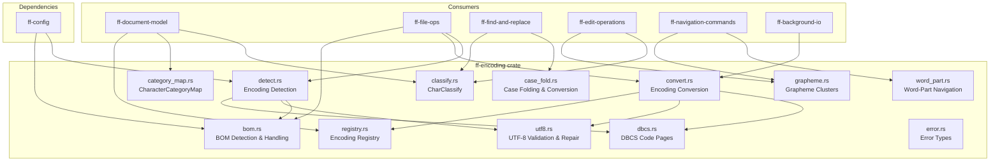

# Design Document — `ff-encoding` Crate

## Overview

### Purpose

The `ff-encoding` crate provides the encoding and character-handling subsystem for FileForgeWorkbench. It is the single point of responsibility for:

- Encoding detection from raw byte streams (BOM-based and heuristic)
- Bidirectional encoding conversion (source → UTF-8 on load, UTF-8 → target on save)
- UTF-8 validation and repair
- Word-character classification (byte-level `CharClassify` and Unicode `CharacterCategoryMap`)
- Unicode case folding and conversion (fold, upper, lower)
- Grapheme cluster boundary detection (UAX #29)
- DBCS lead/trail byte logic for legacy East Asian encodings
- Word-part (sub-word) boundary detection for camelCase/snake_case navigation
- Encoding family classification and encoding registry

### Position in Architecture

**Wave 8** — The encoding crate is a foundational service layer with no GUI dependencies.
It is consumed by document-model, file-operations, find-and-replace, edit-operations, navigation-commands, and background-io. It depends only on `ff-config` for default encoding/BOM policy settings.

### Design Constraints

- **GUI Independence**: Zero GUI framework dependencies. Pure computation and data transformation.
- **Multi-Crate**: Lives at `crates/ff-encoding` within the Cargo workspace.
- **Error Standards**: All errors use the format `[encoding] operation: description`.
- **Streaming**: Conversion APIs must support chunk-based processing for integration with background-io.
- **No Locale Sensitivity**: Case folding uses default Unicode mappings only (no Turkish İ/ı special-casing).
- **Build-Time Data**: Unicode tables (case folding, category map) are compiled as static data — no runtime file loading.
- **Stateless Detection**: Encoding detection operates on a byte slice without side effects.

---

## Architecture

### High-Level Diagram



### Crate Dependencies

| Dependency | Purpose |
|-----------|---------|
| `ff-config` | Default encoding, fallback encoding, BOM policy |

**Dev-dependencies:**
| Dependency | Purpose |
|-----------|---------|
| `proptest` | Property-based testing |
| `pretty_assertions` | Readable test diffs |

**No external encoding crates** — all conversion tables and detection logic are self-contained, derived from Scintilla's proven implementation and Unicode data files.

---

## Components and Interfaces

```
crates/ff-encoding/
├── Cargo.toml
├── build.rs                    # Build-time Unicode table generation
├── src/
│   ├── lib.rs                  # Public API re-exports, crate documentation
│   ├── error.rs                # EncodingError enum
│   ├── detect.rs               # Encoding detection (heuristic + BOM)
│   ├── bom.rs                  # BOM detection and writing
│   ├── convert.rs              # Encoding conversion (load + save)
│   ├── utf8.rs                 # UTF-8 validation, classification, repair
│   ├── classify.rs             # CharClassify (byte-level 256-entry table)
│   ├── category_map.rs         # CharacterCategoryMap (Unicode General Category)
│   ├── dbcs.rs                 # DBCS code pages, lead/trail byte logic
│   ├── case_fold.rs            # Unicode case folding and conversion
│   ├── grapheme.rs             # Grapheme cluster boundary detection (UAX #29)
│   ├── word_part.rs            # Word-part (sub-word) boundary detection
│   ├── registry.rs             # Encoding registry (name ↔ code page ↔ family)
│   └── encoding.rs             # Encoding, EncodingFamily, EncodingMetadata types
├── data/
│   ├── CaseFolding.txt         # Unicode CaseFolding.txt source
│   ├── UnicodeData.txt         # Unicode character database source
│   └── GraphemeBreakProperty.txt # UAX #29 grapheme break data
└── tests/
    ├── detect_tests.rs
    ├── convert_tests.rs
    ├── classify_tests.rs
    ├── case_fold_tests.rs
    ├── grapheme_tests.rs
    └── property_tests.rs       # Property-based tests
```

### Module Responsibilities

| Module | Requirement(s) | Responsibility |
|--------|---------------|----------------|
| `detect.rs` | Req 1 | Multi-strategy encoding detection (BOM → UTF-8 validity → DBCS patterns → heuristics → fallback) |
| `bom.rs` | Req 2 | BOM recognition, BOM length reporting, BOM writing on save |
| `convert.rs` | Req 3, 4 | Streaming bidirectional encoding conversion with error/issue logging |
| `utf8.rs` | Req 5 | UTF-8 validation, byte classification, repair (invalid → U+FFFD) |
| `classify.rs` | Req 6, 13 | 256-byte CharClassify table, configurable word-character sets |
| `category_map.rs` | Req 7 | Unicode General Category lookup, identifier predicates (UAX #31) |
| `dbcs.rs` | Req 8 | DBCS code page tables, lead/trail byte detection, safe segmentation |
| `grapheme.rs` | Req 9 | UAX #29 grapheme cluster boundaries, simplified mode option |
| `case_fold.rs` | Req 10 | Unicode case fold/upper/lower, ICaseConverter trait |
| `word_part.rs` | Req 12 | Sub-word boundary detection (camelCase, snake_case, digit transitions) |
| `encoding.rs` | Req 11, 14 | Encoding/EncodingFamily types, EncodingMetadata |
| `registry.rs` | Req 14 | Encoding name ↔ code page ↔ family registry |
| `error.rs` | All | Crate error types |

---

## Data Models

### `encoding.rs` — Core Types

```rust
/// A specific character encoding identified by name and code page.
#[derive(Debug, Clone, PartialEq, Eq, Hash)]
pub struct Encoding {
    /// Canonical name (e.g., "utf-8", "shift-jis", "iso-8859-1")
    pub name: &'static str,
    /// Windows code page number (0 for UTF-8, 65001 alias)
    pub code_page: u32,
    /// The encoding family this belongs to
    pub family: EncodingFamily,
    /// Human-readable display name (e.g., "UTF-8", "Shift-JIS")
    pub display_name: &'static str,
    /// Alternative names for this encoding
    pub aliases: &'static [&'static str],
}

/// Classification of encodings into families that determine
/// how character boundaries are detected.
/// [Requirement 11]
#[derive(Debug, Clone, Copy, PartialEq, Eq, Hash)]
#[non_exhaustive]
pub enum EncodingFamily {
    /// ASCII, ISO-8859-x, Windows-125x, EBCDIC — 1 byte = 1 character
    SingleByte,
    /// UTF-8 — 1–4 bytes per character, lead/trail byte logic
    Utf8,
    /// Shift-JIS, GBK, Big5, Korean — 1–2 bytes per character
    Dbcs,
    /// UTF-16LE/BE — used for stream processing before conversion to UTF-8
    Utf16,
}

/// Metadata about a document's encoding state.
/// [Requirement 14]
#[derive(Debug, Clone, PartialEq, Eq)]
pub struct EncodingMetadata {
    /// The active encoding
    pub encoding: Encoding,
    /// Whether a BOM was present in the original file
    pub has_bom: bool,
    /// Whether the content needs reload after encoding change
    pub needs_reload: bool,
}
```

### `bom.rs` — BOM Types

```rust
/// Information about a detected BOM.
/// [Requirement 2]
#[derive(Debug, Clone, Copy, PartialEq, Eq)]
pub struct BomInfo {
    /// The encoding indicated by the BOM
    pub encoding: BomEncoding,
    /// Length of the BOM in bytes (2, 3, or 4)
    pub length: usize,
}

/// Encodings that can be identified via BOM.
#[derive(Debug, Clone, Copy, PartialEq, Eq)]
pub enum BomEncoding {
    Utf8,
    Utf16Le,
    Utf16Be,
    Utf32Le,
    Utf32Be,
}
```

### `classify.rs` — Character Classification

```rust
/// Classification of a byte value for word-boundary detection.
/// [Requirement 6]
#[derive(Debug, Clone, Copy, PartialEq, Eq)]
pub enum CharacterClass {
    Space,
    NewLine,
    Word,
    Punctuation,
}

/// A 256-entry lookup table mapping byte values to character classes.
/// Provides O(1) classification for the ASCII/Latin-1 byte range.
/// [Requirement 6]
pub struct CharClassify {
    classes: [CharacterClass; 256],
}
```

### `category_map.rs` — Unicode General Category

```rust
/// Unicode General Category (30 categories per Unicode standard).
/// [Requirement 7]
#[derive(Debug, Clone, Copy, PartialEq, Eq)]
#[repr(u8)]
pub enum CharacterCategory {
    Lu = 0, Ll, Lt, Lm, Lo,          // Letter
    Mn, Mc, Me,                        // Mark
    Nd, Nl, No,                        // Number
    Pc, Pd, Ps, Pe, Pi, Pf, Po,       // Punctuation
    Sm, Sc, Sk, So,                    // Symbol
    Zs, Zl, Zp,                        // Separator
    Cc, Cf, Cs, Co, Cn,               // Other
}

/// Optimized lookup structure: dense array for BMP, binary search for
/// supplementary planes.
/// [Requirement 7]
pub struct CharacterCategoryMap {
    /// Dense array for U+0000..U+FFFF (65536 entries)
    bmp_table: Vec<CharacterCategory>,
    /// Sorted ranges for supplementary planes
    supplementary_ranges: Vec<(u32, u32, CharacterCategory)>,
}
```

### `case_fold.rs` — Case Folding

```rust
/// Conversion mode for case operations.
/// [Requirement 10]
#[derive(Debug, Clone, Copy, PartialEq, Eq)]
pub enum CaseMode {
    /// Unicode case folding for comparison (status C+F from CaseFolding.txt)
    Fold,
    /// To uppercase
    Upper,
    /// To lowercase
    Lower,
}

/// Trait for case conversion, enabling find-and-replace to use case folding
/// without depending on the specific implementation.
/// [Requirement 10.7]
pub trait ICaseConverter: Send + Sync {
    /// Convert the entire string according to the given mode.
    fn case_convert_string(&self, text: &str, mode: CaseMode) -> String;
}

/// The concrete case folder using compiled Unicode data.
/// [Requirement 10]
pub struct CaseFolder {
    // Static lookup tables compiled from CaseFolding.txt at build time
}
```

### `grapheme.rs` — Grapheme Cluster Boundaries

```rust
/// Mode for grapheme cluster detection.
/// [Requirement 9.8]
#[derive(Debug, Clone, Copy, PartialEq, Eq)]
pub enum GraphemeMode {
    /// Full UAX #29 grapheme clustering
    Strict,
    /// Code-point-level navigation only (performance mode)
    Simplified,
}

/// Iterator over grapheme cluster boundaries in a UTF-8 string.
/// [Requirement 9]
pub struct GraphemeIterator<'a> {
    text: &'a str,
    position: usize,
    mode: GraphemeMode,
}
```

### `dbcs.rs` — DBCS Code Pages

```rust
/// Supported DBCS code pages.
/// [Requirement 8]
#[derive(Debug, Clone, Copy, PartialEq, Eq, Hash)]
pub enum DbcsCodePage {
    /// Shift-JIS (CP932)
    ShiftJis = 932,
    /// GBK (CP936)
    Gbk = 936,
    /// Korean Wansung (CP949)
    KoreanWansung = 949,
    /// Big5 (CP950)
    Big5 = 950,
    /// Korean Johab (CP1361)
    KoreanJohab = 1361,
}

/// DBCS code page definition with lead/trail byte ranges.
/// [Requirement 8]
pub struct DbcsCodePageDef {
    pub code_page: DbcsCodePage,
    /// Inclusive byte ranges that are valid lead bytes
    pub lead_byte_ranges: &'static [(u8, u8)],
    /// Inclusive byte ranges that are valid trail bytes
    pub trail_byte_ranges: &'static [(u8, u8)],
    /// Bytes that are valid single-byte characters in the DBCS encoding
    pub single_byte_ranges: &'static [(u8, u8)],
}
```

### `detect.rs` — Detection Types

```rust
/// Confidence level for encoding detection.
/// [Requirement 1.6]
#[derive(Debug, Clone, Copy, PartialEq, Eq, PartialOrd, Ord)]
pub enum DetectionConfidence {
    /// BOM present or unambiguous pattern
    High,
    /// Strong heuristic match (valid UTF-8, consistent DBCS patterns)
    Medium,
    /// Fallback or statistical guess
    Low,
}

/// Result of encoding detection.
/// [Requirement 1]
#[derive(Debug, Clone, PartialEq, Eq)]
pub struct DetectionResult {
    /// The detected encoding
    pub encoding: Encoding,
    /// Confidence level of the detection
    pub confidence: DetectionConfidence,
    /// BOM information if a BOM was found
    pub bom: Option<BomInfo>,
}
```

### `convert.rs` — Conversion Types

```rust
/// Record of an issue encountered during encoding conversion.
/// [Requirement 3.3, 3.4]
#[derive(Debug, Clone, PartialEq, Eq)]
pub struct ConversionIssue {
    /// Byte offset in the source where the issue occurred
    pub source_offset: usize,
    /// The original bytes that could not be converted
    pub original_bytes: Vec<u8>,
    /// Human-readable description of the issue
    pub description: String,
}

/// Result of an encoding conversion operation.
/// [Requirement 3, 4]
#[derive(Debug, Clone)]
pub struct ConversionResult {
    /// The converted bytes (UTF-8 on load, target encoding on save)
    pub data: Vec<u8>,
    /// Issues encountered during conversion (lossy replacements)
    pub issues: Vec<ConversionIssue>,
}

/// Options for handling unmappable characters during save-encoding.
/// [Requirement 4.5]
#[derive(Debug, Clone, Copy, PartialEq, Eq)]
pub enum UnmappableAction {
    /// Abort the save operation
    Abort,
    /// Replace unmappable characters with a placeholder (e.g., '?')
    ReplaceWithPlaceholder(char),
    /// Switch to UTF-8 encoding for the save
    SwitchToUtf8,
}
```

---

## Public API Surface

### `lib.rs` — Re-exports

The crate root re-exports the primary public API:

```rust
// Detection
pub use detect::{detect_encoding, DetectionResult, DetectionConfidence};
pub use bom::{detect_bom, write_bom, BomInfo, BomEncoding};

// Conversion
pub use convert::{convert_to_utf8, convert_from_utf8, ConversionResult, ConversionIssue};
pub use convert::{StreamEncoder, StreamDecoder};

// UTF-8 utilities
pub use utf8::{utf8_validate, utf8_classify, utf8_fix_invalid, utf8_byte_length_from_lead};

// Classification
pub use classify::{CharClassify, CharacterClass};
pub use category_map::{CharacterCategoryMap, CharacterCategory};

// Case folding
pub use case_fold::{CaseFolder, CaseMode, ICaseConverter};

// Grapheme clusters
pub use grapheme::{GraphemeIterator, GraphemeMode};
pub use grapheme::{is_grapheme_boundary, next_grapheme_boundary, prev_grapheme_boundary};

// DBCS
pub use dbcs::{DbcsCodePage, DbcsCodePageDef};
pub use dbcs::{is_dbcs_code_page, dbcs_is_lead_byte, dbcs_is_trail_byte};

// Word-part navigation
pub use word_part::{is_word_part_separator, word_part_left, word_part_right};

// Encoding types and registry
pub use encoding::{Encoding, EncodingFamily, EncodingMetadata};
pub use registry::EncodingRegistry;

// Errors
pub use error::EncodingError;
```

### Primary Functions

#### Encoding Detection (`detect.rs`) — Requirement 1

```rust
/// Detect the encoding of a byte slice.
///
/// Examines up to `max_bytes` (default 8192) using the priority order:
/// BOM → UTF-8 validity → DBCS patterns → byte-frequency heuristics → fallback.
///
/// # Errors
/// Returns `EncodingError::DetectionFailed` if no encoding can be determined
/// (should not occur due to fallback, but included for completeness).
pub fn detect_encoding(bytes: &[u8], max_bytes: Option<usize>) -> DetectionResult;

/// Detect encoding with an explicit fallback encoding override.
pub fn detect_encoding_with_fallback(
    bytes: &[u8],
    max_bytes: Option<usize>,
    fallback: &Encoding,
) -> DetectionResult;
```

#### BOM Detection (`bom.rs`) — Requirement 2

```rust
/// Detect a BOM at the start of a byte slice.
///
/// Checks UTF-32 (4-byte) BOMs before UTF-16 (2-byte) to correctly
/// disambiguate UTF-32LE from UTF-16LE + NUL.
///
/// Returns `None` if no BOM is present.
pub fn detect_bom(bytes: &[u8]) -> Option<BomInfo>;

/// Write the BOM bytes for a given encoding to a writer.
///
/// # Errors
/// Returns `EncodingError::NoBomForEncoding` if the encoding has no BOM.
pub fn write_bom(encoding: BomEncoding, writer: &mut dyn std::io::Write) -> Result<(), EncodingError>;

/// Return the BOM bytes for a given BOM encoding.
pub fn bom_bytes(encoding: BomEncoding) -> &'static [u8];
```

#### Encoding Conversion (`convert.rs`) — Requirements 3, 4

```rust
/// Convert bytes from a source encoding to UTF-8.
///
/// Invalid byte sequences are replaced with U+FFFD and logged in
/// `ConversionResult.issues`.
///
/// # Errors
/// Returns `EncodingError::UnsupportedEncoding` if the source encoding
/// is not supported for conversion.
pub fn convert_to_utf8(
    bytes: &[u8],
    source_encoding: &Encoding,
) -> Result<ConversionResult, EncodingError>;

/// Convert a UTF-8 string to a target encoding.
///
/// # Errors
/// Returns `EncodingError::UnmappableCharacter` if a character cannot be
/// represented in the target encoding (with position and code point info).
pub fn convert_from_utf8(
    text: &str,
    target_encoding: &Encoding,
    unmappable_action: UnmappableAction,
) -> Result<ConversionResult, EncodingError>;

/// A streaming decoder that converts chunks from source encoding to UTF-8.
/// [Requirement 3.8]
pub struct StreamDecoder { /* ... */ }

impl StreamDecoder {
    pub fn new(source_encoding: &Encoding) -> Self;
    pub fn decode_chunk(&mut self, chunk: &[u8]) -> Result<ConversionResult, EncodingError>;
    pub fn finish(self) -> Result<ConversionResult, EncodingError>;
}

/// A streaming encoder that converts UTF-8 chunks to target encoding.
/// [Requirement 4.8]
pub struct StreamEncoder { /* ... */ }

impl StreamEncoder {
    pub fn new(target_encoding: &Encoding, unmappable_action: UnmappableAction) -> Self;
    pub fn encode_chunk(&mut self, text: &str) -> Result<ConversionResult, EncodingError>;
    pub fn finish(self) -> Result<ConversionResult, EncodingError>;
}
```

#### UTF-8 Utilities (`utf8.rs`) — Requirement 5

```rust
/// Validate that a byte slice is valid UTF-8 per RFC 3629.
pub fn utf8_validate(bytes: &[u8]) -> bool;

/// Classify the first UTF-8 character in a byte slice.
/// Returns (byte_length, is_valid).
pub fn utf8_classify(bytes: &[u8]) -> (usize, bool);

/// Replace invalid UTF-8 sequences with U+FFFD, preserving valid content.
pub fn utf8_fix_invalid(bytes: &[u8]) -> String;

/// Return expected UTF-8 sequence length from a lead byte.
/// Returns 1 for ASCII, 2–4 for valid multi-byte leads, 1 for invalid leads.
pub fn utf8_byte_length_from_lead(byte: u8) -> usize;
```

#### Character Classification (`classify.rs`) — Requirements 6, 13

```rust
impl CharClassify {
    /// Create with default classifications.
    /// If `include_word_class` is true: alphanum + underscore + 0x80–0xFF = Word.
    /// If false: all non-space/non-newline = Punctuation.
    pub fn new(include_word_class: bool) -> Self;

    /// Classify a byte value. O(1) array lookup.
    pub fn classify(&self, byte: u8) -> CharacterClass;

    /// Fast predicate: is this byte classified as Word?
    pub fn is_word(&self, byte: u8) -> bool;

    /// Set classification for a set of byte values.
    pub fn set_char_classes(&mut self, chars: &[u8], class: CharacterClass);

    /// Configure word characters from a string of characters.
    pub fn set_word_chars(&mut self, chars: &[u8]);

    /// Configure whitespace characters.
    pub fn set_whitespace_chars(&mut self, chars: &[u8]);

    /// Configure punctuation characters.
    pub fn set_punctuation_chars(&mut self, chars: &[u8]);

    /// Reset to default word-character classification.
    pub fn reset_word_chars(&mut self);

    /// Get all byte values currently assigned to a class.
    pub fn get_chars_of_class(&self, class: CharacterClass) -> Vec<u8>;
}
```

#### Unicode Category Map (`category_map.rs`) — Requirement 7

```rust
impl CharacterCategoryMap {
    /// Create a new category map with the full Unicode database loaded.
    pub fn new() -> Self;

    /// Optimize the map by pre-allocating dense storage up to `count_characters`.
    pub fn optimize(&mut self, count_characters: usize);

    /// Return the Unicode General Category for a code point.
    pub fn category_for(&self, code_point: u32) -> CharacterCategory;

    /// UAX #31: Is this code point valid at the start of an identifier?
    pub fn is_id_start(&self, code_point: u32) -> bool;

    /// UAX #31: Is this code point valid as a continuation of an identifier?
    pub fn is_id_continue(&self, code_point: u32) -> bool;

    /// UAX #31 extended: XID_Start property.
    pub fn is_xid_start(&self, code_point: u32) -> bool;

    /// UAX #31 extended: XID_Continue property.
    pub fn is_xid_continue(&self, code_point: u32) -> bool;

    /// Is this code point word-like? (categories L*, Nd, Nl, Pc)
    pub fn is_word_char(&self, code_point: u32) -> bool;
}
```

#### Case Folding (`case_fold.rs`) — Requirement 10

```rust
impl CaseFolder {
    /// Create a new case folder with compiled Unicode data.
    pub fn new() -> Self;

    /// Convert a single code point according to the given mode.
    /// Returns the UTF-8 bytes of the result (may be multi-character for Fold).
    pub fn case_convert(&self, code_point: u32, mode: CaseMode) -> CaseFoldResult;

    /// Convert an entire string according to the given mode.
    /// The result may be longer than the input (e.g., ß → ss in Fold mode).
    pub fn case_convert_string(&self, text: &str, mode: CaseMode) -> String;
}

/// Result of case-converting a single code point.
#[derive(Debug, Clone)]
pub struct CaseFoldResult {
    /// UTF-8 encoded result (1–12 bytes for multi-char expansions)
    pub bytes: [u8; 12],
    /// Number of valid bytes in the result
    pub len: usize,
}
```

#### Grapheme Boundaries (`grapheme.rs`) — Requirement 9

```rust
/// Is the byte offset a grapheme cluster boundary in the given text?
pub fn is_grapheme_boundary(text: &str, byte_offset: usize) -> bool;

/// Return the byte offset of the next grapheme cluster boundary.
pub fn next_grapheme_boundary(text: &str, byte_offset: usize) -> usize;

/// Return the byte offset of the previous grapheme cluster boundary.
pub fn prev_grapheme_boundary(text: &str, byte_offset: usize) -> usize;

impl<'a> GraphemeIterator<'a> {
    /// Create a new grapheme iterator over the given text.
    pub fn new(text: &'a str, mode: GraphemeMode) -> Self;
}

impl<'a> Iterator for GraphemeIterator<'a> {
    type Item = &'a str;
    /// Yields each grapheme cluster as a string slice.
    fn next(&mut self) -> Option<Self::Item>;
}
```

#### DBCS Functions (`dbcs.rs`) — Requirement 8

```rust
/// Is the given code page a supported DBCS code page?
pub fn is_dbcs_code_page(code_page: u32) -> bool;

/// Is the byte a lead byte for the given DBCS code page?
pub fn dbcs_is_lead_byte(code_page: DbcsCodePage, byte: u8) -> bool;

/// Is the byte a trail byte for the given DBCS code page?
pub fn dbcs_is_trail_byte(code_page: DbcsCodePage, byte: u8) -> bool;

/// Is the byte a valid single-byte character in the DBCS encoding?
pub fn is_dbcs_valid_single_byte(code_page: DbcsCodePage, byte: u8) -> bool;

/// Return the longest prefix of `data` that ends on a character boundary.
pub fn safe_segment(data: &[u8], code_page: DbcsCodePage) -> &[u8];
```

#### Word-Part Navigation (`word_part.rs`) — Requirement 12

```rust
/// Is this code point a word-part separator?
/// True for underscores and case-transition boundaries.
pub fn is_word_part_separator(code_point: u32) -> bool;

/// Find the start of the previous word-part to the left of `position`.
pub fn word_part_left(text: &str, position: usize, classify: &CharClassify) -> usize;

/// Find the start of the next word-part to the right of `position`.
pub fn word_part_right(text: &str, position: usize, classify: &CharClassify) -> usize;
```

---

## Error Handling

### `error.rs`

```rust
/// Errors produced by the ff-encoding crate.
///
/// All error messages follow the format: `[encoding] operation: description`
#[derive(Debug, thiserror::Error)]
#[non_exhaustive]
pub enum EncodingError {
    /// The encoding is not supported for the requested operation.
    #[error("[encoding] conversion: unsupported encoding '{name}'")]
    UnsupportedEncoding { name: String },

    /// Encoding detection could not determine the file encoding.
    #[error("[encoding] detection: failed to detect encoding (examined {bytes_examined} bytes)")]
    DetectionFailed { bytes_examined: usize },

    /// A character cannot be represented in the target encoding.
    #[error("[encoding] conversion: unmappable character U+{code_point:04X} at byte offset {offset}")]
    UnmappableCharacter { code_point: u32, offset: usize },

    /// The BOM encoding requested does not have a BOM sequence.
    #[error("[encoding] bom: no BOM defined for encoding '{encoding}'")]
    NoBomForEncoding { encoding: String },

    /// Invalid UTF-8 encountered where valid UTF-8 was required.
    #[error("[encoding] utf8: invalid UTF-8 at byte offset {offset}")]
    InvalidUtf8 { offset: usize },

    /// Invalid byte offset (not on a character boundary).
    #[error("[encoding] navigation: byte offset {offset} is not on a character boundary")]
    InvalidBoundary { offset: usize },

    /// The code page is not a valid DBCS code page.
    #[error("[encoding] dbcs: code page {code_page} is not a supported DBCS code page")]
    InvalidDbcsCodePage { code_page: u32 },

    /// I/O error during streaming conversion.
    #[error("[encoding] io: {0}")]
    Io(#[from] std::io::Error),
}
```

---

## Integration Points

### `ff-document-model` (document-model)

The document model stores all text as UTF-8 internally. Encoding conversion happens at the boundary:

- **On load**: `ff-file-ops` calls `detect_encoding()` then `convert_to_utf8()` before passing content to the document buffer.
- **On save**: `ff-file-ops` calls `convert_from_utf8()` to produce the output byte stream.
- **Character navigation**: The document model calls `utf8_byte_length_from_lead()` and DBCS functions to determine character boundaries for caret movement.
- **Encoding metadata**: The document stores `EncodingMetadata` and exposes it via `encoding()` / `set_encoding()`.

### `ff-file-ops` (file-operations)

File operations are the primary consumer of detection and conversion:

- **Open file**: Reads raw bytes → calls `detect_encoding()` → calls `convert_to_utf8()` → passes UTF-8 text + encoding metadata to document model.
- **Save file**: Gets UTF-8 text from document → calls `convert_from_utf8()` with target encoding → optionally calls `write_bom()` → writes bytes to disk.
- **BOM policy**: Reads BOM policy from `ff-config` to decide write-BOM/strip-BOM on save.

### `ff-find-and-replace` (find-and-replace)

The find-and-replace engine uses:

- **Case folding**: `CaseFolder::case_convert_string(text, CaseMode::Fold)` for case-insensitive matching.
- **ICaseConverter trait**: The find engine depends on the trait, not the concrete `CaseFolder`, enabling testability.
- **Word boundaries**: Uses `CharClassify::is_word()` and `CharacterCategoryMap::is_word_char()` for whole-word matching.

### `ff-edit-operations` (edit-operations)

Edit operations consume:

- **Word selection (double-click)**: Uses `CharClassify` to expand selection to word boundaries.
- **Word-delete**: Uses classification to determine deletion extent.
- **Grapheme movement**: Uses `next_grapheme_boundary()` / `prev_grapheme_boundary()` for single-character caret movement.

### `ff-navigation-commands` (navigation-commands)

Navigation uses:

- **Word-part navigation (Ctrl+Left/Right)**: Calls `word_part_left()` / `word_part_right()` for camelCase/snake_case sub-word stops.
- **Grapheme boundaries**: For character-by-character arrow key movement.

### `ff-background-io` (background-io)

Background I/O uses streaming conversion:

- **StreamDecoder**: Processes file chunks asynchronously, feeding decoded UTF-8 to the document model as chunks arrive.
- **StreamEncoder**: Encodes UTF-8 chunks to target encoding for async writes.

### `ff-fileforge-integration` (fileforge-integration)

Mainframe integration uses:

- **EBCDIC support**: The encoding registry includes EBCDIC code pages (CP037, CP500, CP1047).
- **Conversion**: `convert_to_utf8()` and `convert_from_utf8()` support EBCDIC ↔ UTF-8.

---

## Correctness Properties

The following properties are suitable for property-based testing (PBT) with `proptest`.

### Property 1: Encoding Roundtrip Preservation

**Validates: Requirements 3, 4**

For any valid UTF-8 string that is fully representable in a given encoding, converting to that encoding and back to UTF-8 must yield the original string.

```
∀ text: String, enc: Encoding
  WHERE all_chars_mappable(text, enc)
  convert_to_utf8(convert_from_utf8(text, enc).data, enc).data == text.as_bytes()
```

**Strategy**: Generate random ASCII + Latin-1 text for single-byte encodings; generate text within the encoding's character repertoire.

### Property 2: BOM Detection Accuracy

**Validates: Requirements 2.1, 2.2, 2.3**

For any BOM encoding, prepending the correct BOM bytes to arbitrary content must result in correct BOM detection with the exact expected length.

```
∀ bom_enc: BomEncoding, content: Vec<u8>
  LET bom_bytes = bom_bytes(bom_enc)
  LET input = [bom_bytes, content].concat()
  detect_bom(&input) == Some(BomInfo { encoding: bom_enc, length: bom_bytes.len() })
```

**Strategy**: Generate all 5 BOM encodings × random content bytes. Include edge case where content starts with bytes that resemble a different BOM.

### Property 3: Case Fold Idempotence

**Validates: Requirements 10.1, 10.4, 10.6**

Case folding is idempotent — folding an already-folded string produces the same result.

```
∀ text: String
  LET folded = case_convert_string(text, Fold)
  case_convert_string(&folded, Fold) == folded
```

**Strategy**: Generate Unicode strings including characters with multi-character fold expansions (ß, fi, ΐ).

### Property 4: UTF-8 Validation Consistency

**Validates: Requirements 5.1, 5.4, 5.5**

`utf8_validate` agrees with `std::str::from_utf8` — our validator accepts exactly the same byte sequences as the standard library.

```
∀ bytes: Vec<u8>
  utf8_validate(&bytes) == std::str::from_utf8(&bytes).is_ok()
```

**Strategy**: Generate random byte sequences (0–256 bytes) mixing valid UTF-8 sequences with random bytes.

### Property 5: UTF-8 Fix Produces Valid UTF-8

**Validates: Requirements 5.3**

For any byte slice, `utf8_fix_invalid` always produces valid UTF-8 output.

```
∀ bytes: Vec<u8>
  std::str::from_utf8(utf8_fix_invalid(&bytes).as_bytes()).is_ok()
```

**Strategy**: Generate arbitrary byte vectors including invalid sequences.

### Property 6: CharClassify Completeness

**Validates: Requirements 6.1**

Every byte value (0–255) is classified into exactly one of the four classes.

```
∀ classify: CharClassify, byte: u8
  classify(byte) ∈ {Space, NewLine, Word, Punctuation}
  AND (no byte is unclassified)
```

**Strategy**: Generate various CharClassify configurations and verify exhaustive coverage.

### Property 7: Grapheme Boundary Monotonicity

**Validates: Requirements 9.2, 9.3, 9.4**

Successive calls to `next_grapheme_boundary` always advance position, and successive calls to `prev_grapheme_boundary` always retreat position (until start/end is reached).

```
∀ text: String (non-empty valid UTF-8), pos: usize (0..text.len())
  LET next = next_grapheme_boundary(text, pos)
  next > pos OR next == text.len()

  LET prev = prev_grapheme_boundary(text, pos)
  prev < pos OR prev == 0
```

**Strategy**: Generate Unicode strings including combining characters, emoji sequences, and Hangul syllables.

### Property 8: DBCS Lead+Trail Byte Disjointness

**Validates: Requirements 8.2, 8.3**

For any supported DBCS code page, the set of lead byte ranges and ASCII bytes (0x00–0x7F) are disjoint — no byte can simultaneously be a lead byte and an ASCII character.

```
∀ cp: DbcsCodePage, byte: u8 WHERE byte <= 0x7F
  dbcs_is_lead_byte(cp, byte) == false
```

**Strategy**: Enumerate all DBCS code pages × all byte values 0x00–0x7F.

### Property 9: Word-Part Navigation Termination

**Validates: Requirements 12.2, 12.3**

`word_part_left` always returns a position ≤ input position (or 0), and `word_part_right` always returns a position ≥ input position (or text.len()). Navigation always terminates.

```
∀ text: String, pos: usize (0..=text.len())
  word_part_left(text, pos) <= pos
  word_part_right(text, pos) >= pos
```

**Strategy**: Generate identifier-like strings with camelCase, snake_case, and PascalCase patterns.

### Property 10: Encoding Family Consistency

**Validates: Requirements 11.1, 11.2**

The encoding family classification is consistent with the code page — DBCS code pages always map to `EncodingFamily::Dbcs`, UTF-8 maps to `Utf8`, etc.

```
∀ cp: u32 WHERE is_dbcs_code_page(cp)
  encoding_family(cp) == EncodingFamily::Dbcs
```

**Strategy**: Enumerate all registered encodings and verify family assignment.

---

## Testing Strategy

### Unit Tests

- Each module has inline `#[cfg(test)] mod tests` with focused unit tests.
- Test names describe scenario and expected outcome: `detect_bom_utf8_returns_3_byte_length()`.
- Every acceptance criterion has at least one test with `// Validates: Requirement X.Y` annotation.

### Property-Based Tests

- Located in `tests/property_tests.rs` using the `proptest` crate.
- Minimum 100 iterations per property.
- Focus on the 10 correctness properties defined above.
- Regression files committed alongside tests.

### Integration Tests

- Located in `tests/` directory, one file per feature area.
- Test real conversion with known reference files (e.g., a Shift-JIS file that roundtrips correctly).
- Test streaming decoder/encoder with multi-chunk input.

---

## Performance Considerations

- **CharClassify**: O(1) byte lookup via 256-entry array — critical for word-boundary hot paths.
- **CharacterCategoryMap**: O(1) for BMP (dense array), O(log n) for supplementary planes (binary search over ~200 ranges).
- **Case Folding**: Static lookup tables — no heap allocation for single-character folds.
- **Grapheme Detection**: Linear scan with constant-size state machine per UAX #29.
- **Streaming Conversion**: Chunk-based processing avoids holding entire files in memory; suitable for files up to 4 GB.
- **Detection**: Examines only first N bytes (configurable, default 8192) — O(N) regardless of file size.
