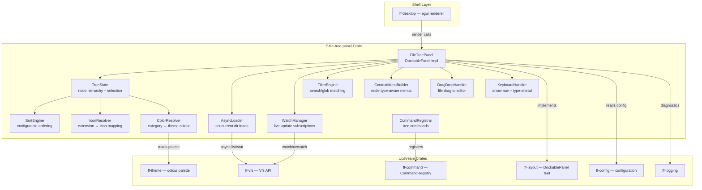

# Design Document: File Tree Panel (`ff-file-tree-panel`)

## Overview

The `ff-file-tree-panel` crate is the **unified resource explorer panel** for the FileForgeWorkbench platform. It renders all registered VFS providers as a multi-root tree hierarchy in a dockable panel, providing visual browsing of local files, mounted dataset catalogs, and future remote connections through a single, consistent tree interface.

### Purpose

- Implement a `DockablePanel` (panel_id `"file_tree"`) docked to `DockZone::Left`
- Render a multi-root tree with three top-level sections: Local Files, Catalogs, Connections
- Perform all resource access through the VFS abstraction (FFW-ARCH-001)
- Load directory contents asynchronously (non-blocking UI)
- Support file watching for live updates via VFS watch API
- Provide keyboard navigation, search/filter, context menus, drag-and-drop
- Apply file-category colour coding from the theme palette
- Dispatch all tree operations as commands through `ff-command`

### Position in Architecture

```
Wave 14 — File Explorer (depends on Wave 8 File I/O + Wave 13 Dataset Catalog)

┌─────────────────────────────────────────────────────────────┐
│              Shell Layer: ff-desktop (egui)                   │
├─────────────────────────────────────────────────────────────┤
│  ff-file-tree-panel (THIS CRATE) — Wave 14                   │
│  Implements DockablePanel, renders tree UI via egui          │
├─────────────────────────────────────────────────────────────┤
│  ff-vfs │ ff-dataset-catalog │ ff-layout │ ff-command        │
│  ff-config │ ff-logging │ ff-theme                           │
│         (Waves 0–13 — Platform + VFS + Catalog)              │
└─────────────────────────────────────────────────────────────┘
```

### Design Constraints (Cross-Cutting)

- **FFW-ARCH-001 (Req 1)**: All directory listing, stat, and watch go through VFS — no `std::fs`
- **GUI Independence (Req 2)**: Core tree logic (state, sorting, filtering) has no egui dependency; only the `render` method uses egui
- **Command-Driven (Req 4)**: All tree operations (open, rename, delete, new file/folder) dispatched as commands
- **Async I/O (Req 6)**: Directory loading runs on Tokio tasks; results marshalled back to UI thread
- **Multi-Crate Workspace (Req 7)**: Crate at `crates/ff-file-tree-panel`
- **Error Message Standards (Req 8)**: Errors follow `[file_tree] operation: description` format

### Upstream Dependencies

| Crate | Relationship |
|-------|-------------|
| `ff-vfs` | Uses `Vfs`, `ResourceUri`, `VfsEntry`, `VfsMetadata`, `WatchHandle`, `WatchEvent`, `VfsCapabilities` |
| `ff-dataset-catalog` | Browses catalog content via VFS `list`/`stat` under scheme `"catalog"` |
| `ff-layout` | Implements `DockablePanel` trait; registers with `PanelRegistry` |
| `ff-command` | Registers and dispatches tree operation commands |
| `ff-config` | Reads `file_tree.*` configuration namespace; subscribes to hot-reload |
| `ff-logging` | Diagnostic logging via `log_info!`, `log_warn!`, `log_debug!` macros |
| `ff-theme` | Reads `file_tree.*` colour group for node foreground colours |

---

## Architecture

### High-Level Architecture Diagram



### Layer Placement

| Component | Responsibility |
|-----------|---------------|
| **FileTreePanel** | `DockablePanel` implementation; owns TreeState; orchestrates rendering |
| **TreeState** | In-memory tree model: nodes, expansion, selection, cached children |
| **AsyncLoader** | Spawns bounded async VFS `list` operations; delivers results via channel |
| **WatchManager** | Registers/cancels VFS watches on expanded directories; applies events |
| **FilterEngine** | Applies search text or glob pattern; computes visible node set |
| **SortEngine** | Sorts child nodes by configured order (directories-first, alpha, type, date) |
| **ContextMenuBuilder** | Builds context menu items based on node type and root category |
| **DragDropHandler** | Initiates drag payload; detects drop targets in editor area |
| **KeyboardHandler** | Processes arrow keys, Enter, Delete, F2, Home/End, type-ahead |
| **IconResolver** | Maps file extension / node type to icon identifier |
| **ColorResolver** | Maps `FileCategory` to theme palette colour key |
| **CommandRegistrar** | Registers all `file_tree.*` commands with the command framework |

### Request Flow — Expand Directory

```
User clicks expand arrow on directory node "src/"
    │
    ▼
KeyboardHandler / MouseHandler → TreeState::toggle_expand(node_id)
    │
    ▼
TreeState checks cache: children loaded?
    │── YES → set expanded = true, re-render
    │── NO  → set node.loading = true, display Loading_Indicator
    │
    ▼ (cache miss)
AsyncLoader::request_load(node_id, vfs_uri)
    │  (checks concurrency < 8, queues if full)
    ▼
tokio::spawn → vfs.list(&uri).await
    │
    ▼ (result arrives via mpsc channel)
TreeState::apply_load_result(node_id, Ok(entries))
    │
    ▼
SortEngine::sort(entries, sort_order)
    │
    ▼
TreeState inserts children, sets expanded = true, clears loading flag
    │
    ▼
WatchManager::register_watch(uri) — subscribe to live updates
    │
    ▼
Panel re-renders with new children visible
```

---

## Components and Interfaces

```
crates/ff-file-tree-panel/
├── Cargo.toml
├── src/
│   ├── lib.rs                  # Public API re-exports, crate docs
│   ├── panel.rs                # FileTreePanel: DockablePanel impl, render loop
│   ├── state/
│   │   ├── mod.rs              # Re-exports for state module
│   │   ├── tree_state.rs       # TreeState: node map, expansion, selection, cache
│   │   ├── tree_node.rs        # TreeNode struct, NodeId, children management
│   │   └── node_type.rs        # NodeType enum, FileCategory enum
│   ├── loader/
│   │   ├── mod.rs              # Re-exports for loader module
│   │   ├── async_loader.rs     # AsyncLoader: bounded concurrency, cancellation
│   │   └── load_request.rs     # LoadRequest, LoadResult types
│   ├── watch/
│   │   ├── mod.rs              # Re-exports for watch module
│   │   ├── manager.rs          # WatchManager: register/cancel watches, event dispatch
│   │   └── debounce.rs         # Debounce logic (200ms batching)
│   ├── filter/
│   │   ├── mod.rs              # Re-exports for filter module
│   │   ├── engine.rs           # FilterEngine: substring + glob matching
│   │   └── visible_set.rs      # VisibleNodeSet: computed filtered view
│   ├── sort.rs                 # SortEngine: configurable sort comparators
│   ├── context_menu.rs         # ContextMenuBuilder: node-type-aware menu construction
│   ├── drag_drop.rs            # DragDropHandler: drag initiation, drop target detection
│   ├── keyboard.rs             # KeyboardHandler: navigation, type-ahead, shortcuts
│   ├── icons.rs                # IconResolver: extension → icon ID mapping
│   ├── colors.rs               # ColorResolver: FileCategory → theme colour
│   ├── path_bar.rs             # PathBar: editable path input, browse button
│   ├── commands.rs             # CommandRegistrar: all file_tree.* command registrations
│   ├── config.rs               # Configuration integration: file_tree.* namespace
│   └── error.rs                # FileTreeError enum
└── tests/
    ├── tree_state_tests.rs     # TreeState property tests (expand, collapse, cache)
    ├── sort_tests.rs           # Sort order property tests
    ├── filter_tests.rs         # Filter/search property tests
    ├── async_loader_tests.rs   # Concurrency limit property tests
    ├── watch_tests.rs          # Watch event application tests
    ├── keyboard_tests.rs       # Navigation property tests
    ├── context_menu_tests.rs   # Menu construction tests
    ├── icon_tests.rs           # Extension→icon mapping tests
    └── integration.rs          # End-to-end panel with mock VFS provider
```

---

## Data Models

### NodeId

```rust
/// Opaque unique identifier for a tree node. Cheaply copyable.
/// Generated by an incrementing counter within TreeState.
///
/// Addresses: Internal identity — used across all requirements
#[derive(Debug, Clone, Copy, PartialEq, Eq, Hash)]
pub struct NodeId(u64);

impl NodeId {
    /// The root sentinel (parent of all top-level category nodes).
    pub const ROOT: Self = Self(0);
}
```

### NodeType

```rust
/// Discriminates the kind of resource a tree node represents.
/// Determines icon, colour, context menu, and expansion behaviour.
///
/// Addresses: Requirement 2 (multi-root), Requirement 4 (rendering),
///            Requirement 10 (catalog browsing)
#[derive(Debug, Clone, Copy, PartialEq, Eq, Hash)]
#[non_exhaustive]
pub enum NodeType {
    /// Top-level section header (Local Files, Catalogs, Connections)
    RootCategory,
    /// A bookmarked local filesystem root directory
    BookmarkedRoot,
    /// A regular directory (local filesystem)
    Directory,
    /// A regular file (local filesystem)
    File,
    /// A symbolic link (local filesystem)
    SymbolicLink,
    /// A mounted dataset catalog root
    CatalogRoot,
    /// A High-Level Qualifier grouping node under a catalog
    HlqGroup,
    /// A sequential dataset (DSORG=PS)
    DatasetSequential,
    /// A partitioned dataset (DSORG=PO)
    DatasetPartitioned,
    /// A PDS member
    PdsMember,
    /// A Generation Data Group base
    GdgBase,
    /// A GDG generation entry
    GdgGeneration,
    /// A remote connection root (future)
    ConnectionRoot,
    /// Placeholder node ("No catalogs mounted", "No connections configured")
    Placeholder,
    /// Loading indicator node (animated spinner + "Loading...")
    LoadingIndicator,
    /// Error indicator node (shows error message)
    ErrorIndicator,
    /// Overflow indicator ("... and N more items")
    OverflowIndicator,
}
```

### FileCategory

```rust
/// Classification of files for colour-coding purposes.
/// Each category maps to a theme palette colour key in the `file_tree` group.
///
/// Addresses: Requirement 4 AC 5
#[derive(Debug, Clone, Copy, PartialEq, Eq, Hash)]
#[non_exhaustive]
pub enum FileCategory {
    /// Binary or non-editable files (executables, images, archives)
    NonEditableBinary,
    /// Files with an associated FileForge structure definition
    FileForgeStructured,
    /// Regular text files (source code, config, markdown)
    StandardText,
    /// Unrecognised file type
    Unknown,
    /// Directory nodes
    Directory,
    /// Symbolic link nodes
    SymbolicLink,
}

impl FileCategory {
    /// Returns the theme palette colour key for this category.
    /// E.g., `FileCategory::NonEditableBinary` → `"file_tree.non_editable_binary"`
    pub fn colour_key(&self) -> &'static str;
}
```

### TreeNode

```rust
/// A single node in the tree hierarchy. Stored in a flat HashMap<NodeId, TreeNode>
/// within TreeState for O(1) lookup. Parent-child relationships are maintained
/// via `parent` and `children` fields.
///
/// Addresses: Requirement 2 (hierarchy), Requirement 3 (async loading),
///            Requirement 4 (rendering), Requirement 5 (watch)
#[derive(Debug, Clone)]
pub struct TreeNode {
    /// Unique node identifier
    pub id: NodeId,
    /// Parent node identifier (ROOT for top-level categories)
    pub parent: NodeId,
    /// Display label (file/directory name, catalog name, etc.)
    pub label: String,
    /// The type of resource this node represents
    pub node_type: NodeType,
    /// VFS URI for this resource (None for virtual nodes like placeholders)
    pub uri: Option<ResourceUri>,
    /// Whether this node is currently expanded
    pub expanded: bool,
    /// Whether this node's children are currently being loaded
    pub loading: bool,
    /// Ordered list of child node IDs (empty for leaf nodes or unloaded)
    pub children: Vec<NodeId>,
    /// Whether children have been loaded at least once (cache valid)
    pub children_loaded: bool,
    /// File size in bytes (for file nodes, if available)
    pub size: Option<u64>,
    /// Last modification time (if available)
    pub modified: Option<std::time::SystemTime>,
    /// File category for colour coding
    pub category: FileCategory,
    /// Whether this file has a FileForge structure definition (structure badge)
    pub has_structure: bool,
    /// Whether this is a hidden file/directory (name starts with '.')
    pub is_hidden: bool,
    /// Depth in the tree (0 = root categories)
    pub depth: u32,
}
```

### TreeState

```rust
/// The complete in-memory tree model. Owns all nodes, manages expansion,
/// selection, caching, and provides query methods for the renderer.
///
/// Addresses: Requirement 2 (hierarchy), Requirement 3 (cache),
///            Requirement 5 (live updates), Requirement 9 (filter)
pub struct TreeState {
    /// All nodes indexed by ID for O(1) access
    nodes: HashMap<NodeId, TreeNode>,
    /// Counter for generating unique NodeIds
    next_id: u64,
    /// Currently selected node (single selection)
    selected: Option<NodeId>,
    /// The three top-level category node IDs
    root_categories: [NodeId; 3], // [LocalFiles, Catalogs, Connections]
    /// Pre-filter expansion state (saved when filter activates)
    pre_filter_expansion: Option<HashMap<NodeId, bool>>,
    /// Whether a search filter is currently active
    filter_active: bool,
    /// Set of node IDs visible under the current filter
    visible_nodes: Option<HashSet<NodeId>>,
    /// Scroll offset for virtual scrolling
    scroll_offset: f32,
}

impl TreeState {
    /// Create initial state with three empty root categories.
    pub fn new() -> Self;

    /// Insert a new node. Returns its NodeId.
    pub fn insert_node(&mut self, parent: NodeId, node: TreeNode) -> NodeId;

    /// Remove a node and all its descendants.
    pub fn remove_node(&mut self, id: NodeId);

    /// Get a reference to a node by ID.
    pub fn get_node(&self, id: NodeId) -> Option<&TreeNode>;

    /// Get a mutable reference to a node by ID.
    pub fn get_node_mut(&mut self, id: NodeId) -> Option<&mut TreeNode>;

    /// Toggle expansion state of a node.
    pub fn toggle_expand(&mut self, id: NodeId);

    /// Apply loaded children to a node (replaces loading indicator).
    pub fn apply_children(&mut self, parent: NodeId, entries: Vec<TreeNodeData>);

    /// Apply an error result to a node (replaces loading indicator with error node).
    pub fn apply_error(&mut self, parent: NodeId, message: String);

    /// Get the currently selected node ID.
    pub fn selected(&self) -> Option<NodeId>;

    /// Set selection to a specific node.
    pub fn select(&mut self, id: Option<NodeId>);

    /// Returns an iterator over visible nodes in display order (depth-first,
    /// respecting expansion and filter state).
    pub fn visible_nodes_iter(&self) -> impl Iterator<Item = &TreeNode>;

    /// Invalidate cached children for a node (triggers reload on next expand).
    pub fn invalidate_cache(&mut self, id: NodeId);

    /// Invalidate all caches (full refresh).
    pub fn invalidate_all_caches(&mut self);
}
```

### TreeNodeData

```rust
/// Data for constructing a TreeNode from a VFS entry.
/// Used as the transfer type from AsyncLoader results.
///
/// Addresses: Requirement 3 AC 3
#[derive(Debug, Clone)]
pub struct TreeNodeData {
    /// Display label
    pub label: String,
    /// Node type
    pub node_type: NodeType,
    /// VFS URI
    pub uri: Option<ResourceUri>,
    /// File size
    pub size: Option<u64>,
    /// Modification time
    pub modified: Option<std::time::SystemTime>,
    /// File category
    pub category: FileCategory,
    /// Whether the file has a structure definition
    pub has_structure: bool,
    /// Whether hidden
    pub is_hidden: bool,
}
```

### SortOrder

```rust
/// Configurable sort order for tree node children within a directory.
///
/// Addresses: Requirement 4 AC 1, AC 2
#[derive(Debug, Clone, Copy, PartialEq, Eq, Hash, serde::Serialize, serde::Deserialize)]
#[non_exhaustive]
pub enum SortOrder {
    /// Directories listed before files; within each group alphabetical case-insensitive
    DirectoriesFirst,
    /// Purely alphabetical case-insensitive (no directory preference)
    Alphabetical,
    /// Grouped by file extension, then alphabetical within each group
    Type,
    /// Most recently modified first
    ModifiedDate,
}

impl Default for SortOrder {
    fn default() -> Self {
        Self::DirectoriesFirst
    }
}
```

### FileTreeConfig

```rust
/// Configuration state for the file tree panel, read from `file_tree.*` namespace.
///
/// Addresses: Requirement 13
#[derive(Debug, Clone)]
pub struct FileTreeConfig {
    /// Whether the panel is enabled (registered at startup)
    pub enabled: bool,
    /// Default panel width in logical pixels
    pub default_width: f32,
    /// Initial root path when no bookmarks exist
    pub default_root: Option<String>,
    /// User-bookmarked root paths
    pub bookmarked_roots: Vec<String>,
    /// Current sort order
    pub sort_order: SortOrder,
    /// Whether to show hidden files/directories
    pub show_hidden_files: bool,
}

impl Default for FileTreeConfig {
    fn default() -> Self {
        Self {
            enabled: true,
            default_width: 260.0,
            default_root: None,
            bookmarked_roots: Vec::new(),
            sort_order: SortOrder::DirectoriesFirst,
            show_hidden_files: false,
        }
    }
}
```

### LoadRequest / LoadResult

```rust
/// A request to asynchronously load a directory's children.
///
/// Addresses: Requirement 3 AC 1
#[derive(Debug, Clone)]
pub struct LoadRequest {
    /// The node whose children should be loaded
    pub node_id: NodeId,
    /// The VFS URI to list
    pub uri: ResourceUri,
    /// Cancellation token for this request
    pub cancel: tokio_util::sync::CancellationToken,
}

/// The result of an async directory load.
///
/// Addresses: Requirement 3 AC 3, AC 4
#[derive(Debug)]
pub enum LoadResult {
    /// Successfully loaded entries
    Success {
        node_id: NodeId,
        entries: Vec<TreeNodeData>,
    },
    /// Load failed with error
    Error {
        node_id: NodeId,
        message: String,
    },
    /// Load was cancelled (node collapsed before completion)
    Cancelled {
        node_id: NodeId,
    },
}
```

### ContextAction

```rust
/// Actions available in context menus, mapped to command IDs.
///
/// Addresses: Requirement 6
#[derive(Debug, Clone, PartialEq, Eq)]
#[non_exhaustive]
pub enum ContextAction {
    Open,
    OpenWith,
    Rename,
    Delete,
    NewFile,
    NewFolder,
    CopyPath,
    CopyDsn,
    RevealInExplorer,
    Refresh,
    ExpandCollapse,
    NewMember,
    Properties,
    Unmount,
    AddRootFolder,
    RefreshAll,
    ShowAll,
}

impl ContextAction {
    /// Returns the command ID string for this action.
    /// E.g., `ContextAction::Open` → `"file_tree.open"`
    pub fn command_id(&self) -> &'static str;

    /// Returns the display label for the menu item.
    pub fn label(&self) -> &'static str;
}
```

### FilterState

```rust
/// The current state of the search/filter box.
///
/// Addresses: Requirement 9
#[derive(Debug, Clone)]
pub struct FilterState {
    /// The current filter text (empty = no filter)
    pub text: String,
    /// Whether the filter text contains glob characters (* or ?)
    pub is_glob: bool,
    /// Compiled glob pattern (if is_glob)
    pub(crate) pattern: Option<glob::Pattern>,
}

impl FilterState {
    pub fn new() -> Self;
    pub fn set_text(&mut self, text: &str);
    pub fn is_active(&self) -> bool;
    pub fn matches(&self, label: &str) -> bool;
    pub fn clear(&mut self);
}
```

---

## Public API Surface

### FileTreePanel — DockablePanel Implementation

```rust
/// The file tree panel implementation. Manages the complete tree lifecycle:
/// initialization, rendering, async loading, watching, and user interaction.
///
/// Addresses: Requirement 1 (docking), Requirement 2 (multi-root)
pub struct FileTreePanel {
    /// The tree model
    state: TreeState,
    /// Async directory loader
    loader: AsyncLoader,
    /// Watch subscription manager
    watch_manager: WatchManager,
    /// Search/filter state
    filter: FilterState,
    /// Sort engine
    sort_engine: SortEngine,
    /// Configuration snapshot
    config: FileTreeConfig,
    /// Path bar state
    path_bar: PathBarState,
    /// Whether the panel is collapsed
    collapsed: bool,
    /// Current panel width (persisted)
    width: f32,
    /// VFS handle
    vfs: Arc<Vfs>,
    /// Command dispatch handle
    commands: Arc<CommandDispatch>,
    /// Configuration handle (for hot-reload subscription)
    config_handle: Arc<dyn ConfigHandle>,
}
```

```rust
impl DockablePanel for FileTreePanel {
    /// Returns `"file_tree"`.
    /// Addresses: Requirement 1 AC 1
    fn panel_id(&self) -> &str;

    /// Returns `DockZone::Left`.
    /// Addresses: Requirement 1 AC 1
    fn default_dock_zone(&self) -> DockZone;

    /// Renders the tree panel: title bar, path bar, search box, tree nodes.
    /// Addresses: Requirement 1 AC 7
    fn render(&mut self, ui: &mut egui::Ui);

    /// Returns `"Explorer"`.
    /// Addresses: Requirement 1 AC 7
    fn title(&self) -> &str;

    /// Handles dock state transitions (collapse/expand/float).
    /// Addresses: Requirement 1 AC 5, AC 6
    fn on_dock_state_changed(&mut self, state: DockState);

    /// Returns `Some((120.0, 100.0))` — minimum panel size.
    /// Addresses: Requirement 1 AC 3
    fn minimum_size(&self) -> Option<(f32, f32)>;
}
```

### FileTreePanel Public Methods

```rust
impl FileTreePanel {
    /// Create a new FileTreePanel with dependencies injected.
    pub fn new(
        vfs: Arc<Vfs>,
        commands: Arc<CommandDispatch>,
        config_handle: Arc<dyn ConfigHandle>,
    ) -> Self;

    /// Initialize the tree: create root categories, load bookmarked roots,
    /// enumerate catalogs, set up Connections placeholder.
    /// Called once during panel registration.
    ///
    /// Addresses: Requirement 2 AC 1–6
    pub async fn initialize(&mut self) -> Result<(), FileTreeError>;

    /// Add a bookmarked root path under Local Files.
    ///
    /// Addresses: Requirement 2 AC 8, AC 10
    pub fn add_bookmarked_root(&mut self, path: &str) -> Result<NodeId, FileTreeError>;

    /// Remove a bookmarked root by node ID.
    ///
    /// Addresses: Requirement 2 AC 9
    pub fn remove_bookmarked_root(&mut self, id: NodeId) -> Result<(), FileTreeError>;

    /// Process pending async load results (called each frame).
    /// Applies completed loads to the tree state.
    ///
    /// Addresses: Requirement 3 AC 3, AC 4
    pub fn poll_load_results(&mut self);

    /// Process pending watch events (called each frame).
    /// Applies debounced filesystem changes to the tree.
    ///
    /// Addresses: Requirement 5 AC 2–5
    pub fn poll_watch_events(&mut self);

    /// Apply configuration changes from hot-reload notification.
    ///
    /// Addresses: Requirement 13 AC 2–4
    pub fn on_config_changed(&mut self, config: FileTreeConfig);

    /// Perform full refresh: invalidate all caches, re-load expanded nodes.
    ///
    /// Addresses: Requirement 12 AC 1–3
    pub fn refresh_all(&mut self);

    /// Refresh a single directory node and its expanded descendants.
    ///
    /// Addresses: Requirement 12 AC 4
    pub fn refresh_node(&mut self, id: NodeId);

    /// Navigate to a path (expand tree to reveal, or add as temp root).
    ///
    /// Addresses: Requirement 11 AC 3, AC 4
    pub async fn navigate_to_path(&mut self, path: &str) -> Result<(), FileTreeError>;
}
```

### AsyncLoader

```rust
/// Manages concurrent async VFS list operations with bounded parallelism.
/// Enforces a maximum of 8 simultaneous loads; queues excess requests.
///
/// Addresses: Requirement 3 AC 1, AC 7, AC 8
pub struct AsyncLoader {
    /// Channel sender for submitting load requests to the worker
    request_tx: tokio::sync::mpsc::Sender<LoadRequest>,
    /// Channel receiver for completed load results
    result_rx: tokio::sync::mpsc::Receiver<LoadResult>,
    /// Active cancellation tokens keyed by node ID
    active_cancels: HashMap<NodeId, tokio_util::sync::CancellationToken>,
    /// Current count of in-flight operations
    active_count: usize,
    /// Maximum concurrent operations
    max_concurrent: usize,
}

impl AsyncLoader {
    /// Create a new loader with the given VFS handle and concurrency limit.
    pub fn new(vfs: Arc<Vfs>, max_concurrent: usize) -> Self;

    /// Submit a load request. Returns a cancellation token.
    /// If at max concurrency, the request is queued.
    ///
    /// Addresses: Requirement 3 AC 1, AC 8
    pub fn request_load(&mut self, node_id: NodeId, uri: ResourceUri) -> CancellationToken;

    /// Cancel a pending or in-flight load for a node.
    ///
    /// Addresses: Requirement 3 AC 7
    pub fn cancel_load(&mut self, node_id: NodeId);

    /// Drain available results (non-blocking).
    pub fn drain_results(&mut self) -> Vec<LoadResult>;
}
```

### WatchManager

```rust
/// Manages VFS watch subscriptions for expanded directory nodes.
/// Applies a 200ms debounce window per directory.
///
/// Addresses: Requirement 5
pub struct WatchManager {
    /// Active watch handles keyed by node ID
    watches: HashMap<NodeId, WatchHandle>,
    /// Debounce state per directory URI
    debounce: HashMap<ResourceUri, DebounceState>,
    /// VFS handle for registering watches
    vfs: Arc<Vfs>,
}

impl WatchManager {
    pub fn new(vfs: Arc<Vfs>) -> Self;

    /// Register a watch on a directory node's URI.
    /// Does nothing if provider doesn't support Watch capability.
    ///
    /// Addresses: Requirement 5 AC 1, AC 7
    pub async fn register(&mut self, node_id: NodeId, uri: &ResourceUri);

    /// Cancel a watch for a collapsed directory.
    ///
    /// Addresses: Requirement 5 AC 6
    pub fn cancel(&mut self, node_id: NodeId);

    /// Drain debounced events ready for application (called each frame).
    ///
    /// Addresses: Requirement 5 AC 8
    pub fn drain_events(&mut self) -> Vec<(NodeId, Vec<WatchEvent>)>;
}
```

### SortEngine

```rust
/// Sorts tree node children according to the configured sort order.
///
/// Addresses: Requirement 4 AC 1, AC 2
pub struct SortEngine {
    order: SortOrder,
}

impl SortEngine {
    pub fn new(order: SortOrder) -> Self;

    /// Sort a slice of TreeNodeData in place.
    pub fn sort(&self, entries: &mut [TreeNodeData]);

    /// Sort existing children of a node (re-sort after watch event or config change).
    pub fn sort_children(&self, state: &mut TreeState, parent: NodeId);

    /// Update the sort order.
    pub fn set_order(&mut self, order: SortOrder);
}
```

### FilterEngine

```rust
/// Applies search text or glob patterns to compute visible node set.
/// Operates on cached tree data only — never triggers VFS operations.
///
/// Addresses: Requirement 9
pub struct FilterEngine;

impl FilterEngine {
    /// Compute the set of visible node IDs given a filter state.
    /// A node is visible if:
    ///   - It matches the filter, OR
    ///   - It is an ancestor of a matching node
    ///
    /// Addresses: Requirement 9 AC 2, AC 3, AC 4, AC 7
    pub fn compute_visible_set(
        state: &TreeState,
        filter: &FilterState,
    ) -> HashSet<NodeId>;
}
```

### KeyboardHandler

```rust
/// Processes keyboard input for tree navigation and actions.
///
/// Addresses: Requirement 8
pub struct KeyboardHandler {
    /// Type-ahead buffer for incremental search
    type_ahead_buffer: String,
    /// Timestamp of last type-ahead keystroke (for timeout/reset)
    type_ahead_last: Option<std::time::Instant>,
}

impl KeyboardHandler {
    pub fn new() -> Self;

    /// Process a key event. Returns an action to perform (if any).
    ///
    /// Addresses: Requirement 8 AC 1–12
    pub fn handle_key(
        &mut self,
        key: KeyEvent,
        state: &TreeState,
    ) -> Option<TreeAction>;
}

/// Actions the keyboard handler can request.
#[derive(Debug, Clone)]
pub enum TreeAction {
    SelectNext,
    SelectPrevious,
    Expand(NodeId),
    Collapse(NodeId),
    SelectFirstChild(NodeId),
    SelectParent(NodeId),
    Open(NodeId),
    ToggleExpand(NodeId),
    Delete(NodeId),
    Rename(NodeId),
    SelectFirst,
    SelectLast,
    TypeAheadJump(String),
}
```

### CommandRegistrar

```rust
/// Registers all file_tree.* commands with the command framework.
///
/// Addresses: Requirement 6 AC 8, Requirement 12
pub struct CommandRegistrar;

impl CommandRegistrar {
    /// Register all file tree commands. Called during panel initialization.
    pub fn register(registry: &CommandRegistry) -> Result<(), FileTreeError>;
}
```

The following commands are registered:

| Command ID | Description |
|-----------|-------------|
| `file_tree.open` | Open selected file in editor |
| `file_tree.rename` | Start inline rename on selected node |
| `file_tree.delete` | Delete selected node (with confirmation) |
| `file_tree.new_file` | Create new file (sibling or child) |
| `file_tree.new_folder` | Create new folder (sibling or child) |
| `file_tree.copy_path` | Copy full path/URI to clipboard |
| `file_tree.copy_dsn` | Copy dataset name to clipboard |
| `file_tree.reveal_in_explorer` | Open containing folder in OS file manager |
| `file_tree.refresh` | Refresh entire tree or selected node |
| `file_tree.add_root` | Add bookmarked root via folder picker |
| `file_tree.remove_root` | Remove bookmarked root |
| `file_tree.properties` | Show dataset properties panel |
| `file_tree.unmount_catalog` | Unmount a catalog |
| `file_tree.new_member` | Create new PDS member |
| `file_tree.show_all` | Show all items in an overflow-truncated directory |

---

## Error Handling

```rust
/// Error type for the file tree panel crate.
/// All errors carry context following the `[file_tree] operation: description` format.
///
/// Addresses: Cross-cutting Requirement 8
#[derive(Debug, thiserror::Error)]
#[non_exhaustive]
pub enum FileTreeError {
    /// A VFS operation failed
    #[error("[file_tree] {operation}: VFS error: {source}")]
    Vfs {
        operation: String,
        #[source]
        source: VfsError,
    },

    /// A node was not found in the tree state
    #[error("[file_tree] {operation}: node not found: {node_id:?}")]
    NodeNotFound {
        operation: String,
        node_id: NodeId,
    },

    /// The path entered in the path bar does not exist
    #[error("[file_tree] navigate: path not found: {path}")]
    PathNotFound {
        path: String,
    },

    /// A configuration value is invalid
    #[error("[file_tree] config: invalid value for '{key}': {reason}")]
    InvalidConfig {
        key: String,
        reason: String,
    },

    /// Command registration or dispatch failure
    #[error("[file_tree] command: {0}")]
    Command(String),

    /// The panel is disabled by configuration
    #[error("[file_tree] init: panel disabled by configuration")]
    PanelDisabled,

    /// Maximum concurrent loads reached (internal, non-fatal)
    #[error("[file_tree] loader: max concurrent loads reached ({max})")]
    LoaderAtCapacity {
        max: usize,
    },
}
```

---

## Integration Points

### With `ff-vfs` (Wave 3 — upstream)

- **Dependency direction**: ff-file-tree-panel depends on ff-vfs
- **APIs consumed**:
  - `Vfs::list(uri)` — enumerate directory/catalog contents
  - `Vfs::stat(uri)` — get metadata for tooltip/properties display
  - `Vfs::watch(uri, options)` — subscribe to live filesystem changes
  - `Vfs::exists(uri)` — validate path bar navigation targets
  - `Vfs::delete(uri, options)` — delete command implementation
  - `Vfs::rename(old, new)` — rename command implementation
  - `Vfs::create_dir(uri, options)` — new folder command
- **Types used**: `ResourceUri`, `VfsEntry`, `VfsEntryType`, `VfsMetadata`, `VfsCapabilities`, `WatchHandle`, `WatchEvent`, `WatchOptions`, `VfsError`
- **Integration pattern**: VFS handle injected at construction; all I/O through VFS only

### With `ff-dataset-catalog` (Wave 13 — upstream)

- **Dependency direction**: ff-file-tree-panel does NOT directly depend on ff-dataset-catalog
- **Integration**: The panel browses catalog content exclusively through the VFS layer using the `"catalog"` provider scheme
- **URI pattern**: `vfs://catalog/{catalog-name}` for catalog root listing; `vfs://catalog/{catalog-name}/{DSN}` for dataset listing; `vfs://catalog/{catalog-name}/{DSN}({member})` for PDS member access
- **Metadata**: Dataset properties (RECFM, LRECL, DSORG) retrieved from `VfsMetadata.extra` map
- **Provider discovery**: Catalogs root populates by listing `vfs://catalog/` which returns mounted catalog names

### With `ff-layout` (Wave 2 — upstream)

- **Dependency direction**: ff-file-tree-panel depends on ff-layout
- **Trait implemented**: `DockablePanel` with `panel_id = "file_tree"`, `default_dock_zone = DockZone::Left`
- **Registration**: `FileTreePanel` instance registered with `PanelRegistry` during application startup (if `file_tree.enabled = true`)
- **Lifecycle**: Panel receives `on_dock_state_changed` callbacks for collapse/expand/hide/float transitions
- **State persistence**: Panel width and collapse state persisted via `LayoutState`

### With `ff-command` (Wave 2 — upstream)

- **Dependency direction**: ff-file-tree-panel depends on ff-command
- **APIs consumed**:
  - `CommandRegistry::register(id, metadata, handler)` — register tree commands
  - `CommandDispatch::execute(id, params)` — dispatch file.open, file_tree.* commands
- **Commands registered**: 15 commands (see CommandRegistrar table above)
- **Command parameters**: Commands receive `CommandParams` with keys like `"uri"`, `"node_id"`, `"name"`, `"target_tab_group"`
- **Integration pattern**: All tree actions (open, rename, delete, etc.) go through command dispatch for undo/redo integration and macro recording

### With `ff-config` (Wave 2 — upstream)

- **Dependency direction**: ff-file-tree-panel depends on ff-config
- **Configuration namespace**: `file_tree.*` (6 keys: enabled, default_width, default_root, bookmarked_roots, sort_order, show_hidden_files)
- **APIs consumed**:
  - `ConfigHandle::get_bool("file_tree.enabled")`
  - `ConfigHandle::get_int("file_tree.default_width")`
  - `ConfigHandle::get_string("file_tree.default_root")`
  - `ConfigHandle::get_string_array("file_tree.bookmarked_roots")`
  - `ConfigHandle::get_string("file_tree.sort_order")`
  - `ConfigHandle::get_bool("file_tree.show_hidden_files")`
  - `ConfigHandle::register_reload_callback(prefix, callback)` — hot-reload subscription
  - `ConfigHandle::set_string_array("file_tree.bookmarked_roots", paths)` — persist bookmark changes
- **Hot-reload**: Panel subscribes to `file_tree.*` prefix changes; applies sort/filter/hidden changes immediately without restart

### With `ff-logging` (Wave 0 — upstream)

- **Dependency direction**: ff-file-tree-panel depends on ff-logging
- **Macros used**: `log_info!`, `log_warn!`, `log_debug!`, `log_error!`
- **Log prefix**: `[file_tree]`
- **Log points**:
  - INFO: Panel initialization, bookmark add/remove, refresh triggered
  - WARN: VFS list/watch errors (Requirement 3 AC 4), path bar navigation failures
  - DEBUG: Watch capability unavailable for provider (Requirement 5 AC 7), async load queue status
  - ERROR: Panel initialization failure, unrecoverable state corruption

### With `ff-theme` (Wave 6 — upstream)

- **Dependency direction**: ff-file-tree-panel depends on ff-theme
- **APIs consumed**: `ThemePalette::get_colour(key)` for file category colours
- **Colour keys used**:
  - `file_tree.non_editable_binary`
  - `file_tree.fileforge_structured`
  - `file_tree.standard_text`
  - `file_tree.unknown`
  - `file_tree.directory`
  - `file_tree.symbolic_link`
- **Rendering**: Colour applied as foreground on node label text during `render()`

---

## Correctness Properties

The following properties should be verified using `proptest` with a minimum of 100 iterations per property. Tests use a mock VFS provider to avoid real filesystem dependencies.

### Property 1: Tree State Invariants

**Statement**: For any sequence of expand/collapse/insert/remove operations on TreeState, the following invariants hold:
- Every node's `parent` field points to an existing node (or ROOT)
- Every node appears in exactly one parent's `children` list
- Node depth equals the count of parent hops to ROOT
- No cycles exist in the parent chain

**Test strategy**: Generate random sequences of `insert_node`, `remove_node`, `toggle_expand` operations and assert invariants after each operation.

**Validates: Requirements 2.1, 2.7**

### Property 2: Sort Order Stability

**Statement**: For any set of `TreeNodeData` entries and any `SortOrder` variant, `SortEngine::sort` produces a total order that is:
- Consistent with the specified sort order rules (directories before files for DirectoriesFirst, case-insensitive alpha for Alphabetical, etc.)
- Stable (equal elements preserve their relative input order)
- Idempotent (sorting an already-sorted list produces the same output)

**Test strategy**: Generate random vectors of TreeNodeData with varied NodeTypes and labels; sort; verify ordering predicates and idempotence.

**Validates: Requirements 4.1, 4.2**

### Property 3: Filter Visibility Completeness

**Statement**: For any tree state and any non-empty filter text:
- Every node whose label matches the filter is in the visible set
- Every ancestor of a matching node is in the visible set
- No node that neither matches nor is an ancestor of a match is in the visible set
- When filter is cleared, all nodes return to their pre-filter visibility

**Test strategy**: Generate random tree structures and filter strings; compute visible set; verify the three-way partition.

**Validates: Requirements 9.2, 9.3, 9.4, 9.5**

### Property 4: Async Loader Concurrency Bound

**Statement**: At no point does AsyncLoader have more than `max_concurrent` (default 8) in-flight VFS operations. If requests exceed the limit, they are queued and started only when a slot frees.

**Test strategy**: Submit N > max_concurrent requests to the loader with artificial delays; observe that at most 8 are in-flight at any time; all N eventually complete.

**Validates: Requirements 3.8**

### Property 5: Watch Debounce Batching

**Statement**: For any stream of watch events arriving within a 200ms window for the same directory URI, the WatchManager delivers exactly one batched update containing all events. Events separated by more than 200ms are delivered in separate batches.

**Test strategy**: Generate sequences of watch events with varied timestamps; verify batch boundaries align with the 200ms debounce window.

**Validates: Requirements 5.8**

### Property 6: Keyboard Navigation Consistency

**Statement**: For any tree state with N visible nodes, starting from any selected node:
- Pressing Down `N-1` times visits every visible node exactly once in display order
- Pressing Up `N-1` times from the last node visits every visible node in reverse
- Right arrow on a collapsed expandable node expands it; on an expanded node, moves to first child
- Left arrow on an expanded node collapses it; on a leaf or collapsed node, moves to parent

**Test strategy**: Generate tree states with varied expansion; simulate keyboard sequences; verify selection movement matches spec.

**Validates: Requirements 8.1, 8.2, 8.3, 8.4, 8.5, 8.6**

### Property 7: Context Menu Correctness by Node Type

**Statement**: For each `NodeType` variant, the `ContextMenuBuilder` produces exactly the set of `ContextAction` items specified in Requirements 6 AC 1–7. No extra items, no missing items.

**Test strategy**: Enumerate all NodeType variants; build context menu for each; assert the action set matches the specification table.

**Validates: Requirements 6.1, 6.2, 6.3, 6.4, 6.5, 6.6, 6.7**

### Property 8: Hidden File Filtering

**Statement**: When `show_hidden_files` is false, no node with `is_hidden = true` appears in the visible nodes iterator output. When `show_hidden_files` is true, hidden nodes appear normally. Toggling the setting immediately changes visibility without requiring a VFS re-load.

**Test strategy**: Generate trees with a mix of hidden and visible nodes; toggle setting; verify visible set matches expectation.

**Validates: Requirements 4.7**

### Property 9: Overflow Truncation

**Statement**: When a directory contains more than 10,000 visible entries, the displayed children list contains exactly 1,000 entries plus one OverflowIndicator node. After "Show All" is triggered, all entries are visible and the indicator is removed.

**Test strategy**: Generate directories with 10,001+ entries; verify truncation at 1,000 + indicator; simulate ShowAll; verify all visible.

**Validates: Requirements 4.8**

### Property 10: Cache Invalidation on Refresh

**Statement**: After `refresh_all()` or `refresh_node(id)`, every affected expanded node has `children_loaded = false` and `loading = true`. After async reload completes, the node's children reflect the new VFS listing (not stale cached data).

**Test strategy**: Populate cache; mutate mock VFS state; trigger refresh; verify new children appear after reload.

**Validates: Requirements 12.1, 12.2, 12.3, 12.4**

### Requirement 15: Native Catalog Recursive Directory Expansion (Phase AY)

The `render_native_children()` function in `ff-desktop/src/file_explorer_panel.rs` currently renders a flat list of entries for a Native catalog's root path. To support recursive expansion:

- Replace the flat `selectable_label` for directory entries with a `CollapsingHeader` that recursively calls `render_native_children()` with the child directory's path.
- The `CollapsingHeader` `id_salt` must be the full path to avoid ID collisions between directories with the same name at different depths.
- The entire panel content area is wrapped in `egui::ScrollArea::vertical()` to satisfy the scrollability requirement.
- No new crate dependencies are required — this is a pure `ff-desktop` rendering change.

### Requirement 16: File Explorer Context Menu (Phase AZ)

Context menus are rendered using `egui::Context::show_context_menu` on the response of each tree node's `CollapsingHeader` or `selectable_label`. The menu items and their enabled/disabled state are determined by a `ContextMenuSpec` value computed from the node's `CatalogType` and `NodeKind`.

**Key design decisions:**

- A `NodeKind` enum (`NativeFile`, `NativeDir`, `PosixFile`, `MfPs`, `MfPds`, `MfMember`, `MfGdgBase`, `MfGdgGen`) is added to `file_explorer_panel.rs` to drive menu dispatch.
- A `ContextMenuSpec` struct holds the ordered list of `MenuItem` values for a given node. `MenuItem` is an enum with variants for every action plus `Separator` and `Disabled(label)`.
- The `build_context_menu(catalog_type, node_kind, extension)` free function returns a `ContextMenuSpec`, consulting the `ExtensionRule` table for overrides.
- Copy To… / Move To… open a `CopyMoveDialog` modal (new file `copy_move_dialog.rs`) that holds target picker state, proposed name, and dispatches to `ff-bgio`.
- Inline rename state is held in `FileExplorerPanelState` as `Option<(String, String)>` (full_path, edit_buffer); rendered as a `TextEdit` in place of the node label.
- "Copy" writes to the OS clipboard via `arboard` (already a transitive dependency through `ff-clipboard`). The paste-into-editor prompt is handled in the shell's paste dispatch path.
- Git submenu and Submit JCL are rendered via `ui.add_enabled(false, egui::Button::new(...))` — visible but not clickable.
- `ExtensionRule` is a struct `{ pattern: glob::Pattern, overrides: Vec<MenuOverride> }` stored in a `const` slice in `context_menu.rs`.
- No new crate dependencies beyond what `ff-desktop` already uses (`egui`, `arboard` via `ff-clipboard`).

### Requirement 17: Open With Default Application (Phase BA)

File type classification and OS default application launch is handled entirely within `context_menu.rs` and `file_explorer_panel.rs`. No new crate dependencies are required.

**Key design decisions:**

- `ExtensionRule` gains a `file_class: FileClass` field. `FileClass` is an enum: `Text`, `FfwbStructured`, `External`.
- A `EXTERNAL_EXTENSIONS` constant `&[&str]` slice in `context_menu.rs` lists all extensions that map to `FileClass::External` (Office, PDF, images, audio/video, archives, executables, databases).
- `classify_file(path: &str) -> FileClass` is a free function that: (1) checks the extension against `EXTERNAL_EXTENSIONS`; (2) if no match, reads the first 512 bytes and returns `Text` if valid UTF-8 with no null bytes, `External` otherwise.
- `open_file_node(path: &str, state: &mut FileExplorerPanelState) -> Option<String>` replaces the direct `*open_path = Some(...)` call in `handle_menu_action`. It returns `Some(path)` only for `FileClass::Text`/`FfwbStructured` (to open in FFWB editor); for `External` it calls `launch_default_app(path)` and returns `None`.
- `launch_default_app(path: &str)` uses `std::process::Command::spawn()` with the platform-appropriate command. On Windows: `cmd /c start "" "<path>"`. On macOS: `open "<path>"`. On Linux: `xdg-open "<path>"`.
- Launch errors are stored in `FileExplorerPanelState::last_error: Option<String>` and displayed in the status bar by the shell on the next frame.
- Mainframe nodes bypass `classify_file` entirely — `handle_menu_action` for `Open` on Mainframe nodes always returns `Some(path)` directly.

---

## Testing Strategy

### Performance

- **Virtual scrolling**: Only visible tree nodes are rendered each frame (not the entire tree). The panel calculates which nodes are in the viewport based on scroll offset and row height.
- **Lazy loading**: Children are loaded only on first expansion — not eagerly for the entire tree.
- **Bounded concurrency**: Max 8 simultaneous directory loads prevents resource exhaustion.
- **Debounced watch events**: 200ms batching prevents re-render storms from rapid filesystem changes.
- **O(1) node lookup**: Flat `HashMap<NodeId, TreeNode>` avoids recursive tree traversal for random access.

### Memory Management

- Collapsed nodes retain cached children in memory for fast re-expand (no re-load penalty).
- Overflow truncation (10,000+ items) caps memory usage for extremely large directories.
- Watch handles are dropped when directories are collapsed, freeing OS file notification resources.

### Thread Safety

- `TreeState` is accessed only on the UI thread (no concurrent mutation).
- `AsyncLoader` communicates via async channels (no shared mutable state).
- `WatchManager` receives events on background threads; buffers them for UI-thread consumption via channel.
- The `Vfs` handle is `Arc`-wrapped and thread-safe for use in spawned Tokio tasks.

### Requirement 18: Native Catalog File Listing — Sorted Order and File Attributes (Phase BB)

File attribute display is handled entirely within `ff-desktop/src/file_explorer_panel.rs` and `render.rs`. No new crate dependencies are required.

**Key design decisions:**

- `render_native_children()` calls `std::fs::read_dir()` and collects entries. For each entry, `entry.metadata()` is called. If metadata returns an error (junction point, permission denied, locked), the entry is **silently skipped** — no error node is inserted (Req 18.7).
- Entries are sorted: directories first, then files, both groups alphabetically case-insensitive (Req 18.1). This replaces the current unsorted listing.
- A `FileEntryRow` struct holds `{ name, is_dir, size_bytes, created, modified, accessed, permissions_str }` and is built from `std::fs::Metadata`.
- `format_size(bytes: u64) -> String` formats as `B`, `KB`, `MB`, `GB` with one decimal place.
- `format_timestamp(t: SystemTime) -> String` formats as `YYYY-MM-DD HH:MM` using `chrono` (already a transitive dependency) or manual calculation to avoid adding a new dep.
- `format_permissions(meta: &Metadata) -> String` uses `meta.permissions().readonly()` on all platforms plus `std::os::windows::fs::MetadataExt` for Windows file attributes (`FILE_ATTRIBUTE_HIDDEN`, `FILE_ATTRIBUTE_SYSTEM`, `FILE_ATTRIBUTE_ARCHIVE`) and `std::os::unix::fs::PermissionsExt` on Unix.
- The locked-file open error (Req 18.8, B018) is caught in the `open_file_node()` path: if the VFS read returns OS error 32, the error message is stored in `FileExplorerPanelState::last_error` and displayed in the status bar.
- Windows junction points (Req 18.7, B017) are handled by the silent-skip rule: `metadata()` on a junction typically returns `PermissionDenied`; the entry is dropped from the listing.
- Column layout (Req 18.9): each row is rendered as a horizontal `egui::Grid` or manual `ui.horizontal()` with fixed-width labels for Size (right-aligned, ~70px), Modified (~120px), Created (~120px), Accessed (~120px), Permissions (~80px).
