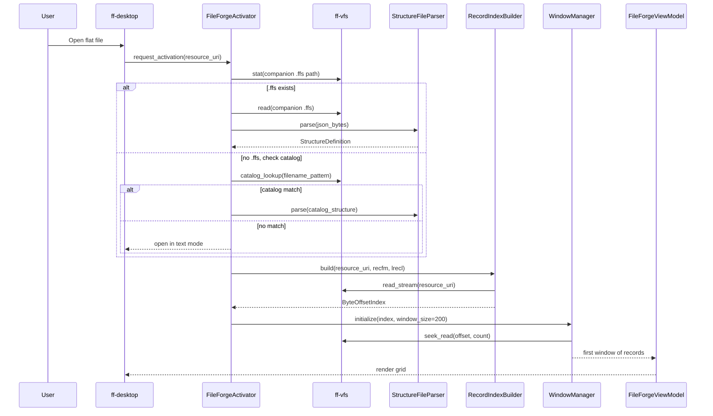

# Design Document: FileForge Integration (`ff-fileforge`)

## Overview

### Purpose

The `ff-fileforge` crate is the **flat-file processing engine** for FileForgeWorkbench. It implements the FileForge domain logic: parsing structure definition files, building record indexes, classifying records by type, extracting and validating field values, supporting EBCDIC encoding workflows, handling COMP-3 packed decimal fields, reading variable-length binary (VB) records with RDW headers, detecting ASA carriage control, and coordinating with the document model for Grid_Edit_Mode display.

This crate is **GUI-independent** — it produces structured data models that the GUI shell renders. All file access flows through the VFS abstraction (FFW-ARCH-001).

### Position in Architecture

```
┌─────────────────────────────────────────────────────────────┐
│              Shell Layer: ff-desktop (egui)                   │
│  Renders grid from FileForgeViewModel; routes edit events     │
├─────────────────────────────────────────────────────────────┤
│  Peer Feature Crates:                                        │
│    ff-structure-catalog (structure library & associations)    │
│    ff-record-selection-criteria (field-level filtering)       │
│    ff-asa-report-preview (ASA visual rendering)              │
│    ff-hex (field boundary annotations in hex view)           │
├─────────────────────────────────────────────────────────────┤
│  THIS CRATE: ff-fileforge ← Wave 12 (FileForge Domain)      │
├─────────────────────────────────────────────────────────────┤
│  Upstream:                                                   │
│    ff-document-model (raw byte buffer, DocumentHandle)       │
│    ff-encoding (EBCDIC codec, code page registry)            │
│    ff-command (command registration/dispatch)                 │
│    ff-vfs (file access, file watching)                       │
│    ff-config (window size, defaults)                         │
│    ff-undo-redo-transactions (edit transaction recording)     │
│    ff-edit-operations (byte-level mutation primitives)        │
├─────────────────────────────────────────────────────────────┤
│              Foundation Layer: ff-logging                     │
└─────────────────────────────────────────────────────────────┘
```

### Design Constraints (Cross-Cutting)

- **FFW-ARCH-001 (Req 1)**: ALL file access (source data, structure files, output) flows through `ff-vfs` — no `std::fs` in this crate
- **GUI Independence (Req 2)**: Zero GUI dependencies — produces view models and data structures, never renders
- **Command-Driven (Req 4)**: FileForge commands (`fileforge.convert`, `fileforge.validate`, `fileforge.on`, `fileforge.off`, `asa.on`, `asa.off`, `asa.strip`) registered in `ff-command`
- **Configuration (Req 5)**: Settings under `fileforge.*` namespace in `ff-config`
- **Async I/O (Req 6)**: Index building, conversion, and large-file seek use async I/O via VFS
- **Multi-Crate Workspace (Req 7)**: Crate at `crates/ff-fileforge`
- **Error Message Standards (Req 8)**: All errors follow `[fileforge] operation: description` format

### Upstream Dependencies

| Crate | Usage |
|-------|-------|
| `ff-vfs` | File read/write/watch for source files, structure files, export output |
| `ff-document-model` | Raw byte buffer access via `DocumentHandle` for in-memory record data |
| `ff-encoding` | EBCDIC code page decoding/encoding via codec registry |
| `ff-command` | Registration of `fileforge.*` and `asa.*` commands |
| `ff-config` | Reading `fileforge.window_size`, `fileforge.default_encoding`, etc. |
| `ff-undo-redo-transactions` | Wrapping Grid_Edit_Mode edits as undoable transactions |
| `ff-edit-operations` | Byte-level buffer mutations for field edits |
| `ff-logging` | Diagnostic output for index progress, parse errors, validation warnings |

### Downstream Consumers

| Crate | Relationship |
|-------|-------------|
| `ff-structure-catalog` | Queries this crate's `RecordStructure` model; provides association lookup |
| `ff-record-selection-criteria` | Evaluates filter criteria against records produced by this crate |
| `ff-asa-report-preview` | Reads ASA detection state and record content for visual rendering |
| `ff-hex` | Receives field boundary annotations for hex view highlight |
| `ff-desktop` | Renders `FileForgeViewModel` grid data |

---

## Architecture

### High-Level Architecture Diagram

```mermaid
graph TD
    subgraph Shell [GUI Shell]
        DESKTOP[ff-desktop<br/>Grid renderer, status bar, navigation UI]
    end

    subgraph Peers [Peer Crates — Wave 12]
        CATALOG[ff-structure-catalog<br/>Structure library & file associations]
        RSC[ff-record-selection-criteria<br/>Field-level filtering engine]
        ASA_PREV[ff-asa-report-preview<br/>ASA visual rendering]
    end

    subgraph ff-fileforge [ff-fileforge Crate]
        ACTIVATE[FileForgeActivator<br/>Mode activation/deactivation]
        SCHEMA[StructureFileParser<br/>.ffs/.fc.json loading & validation]
        INDEX[RecordIndexBuilder<br/>Byte offset index construction]
        CLASSIFY[RecordClassifier<br/>Type identification & dispatch]
        EXTRACT[FieldExtractor<br/>Byte slice → typed value]
        EBCDIC[EbcdicHandler<br/>Code page decode/encode]
        COMP3[Comp3Codec<br/>Packed decimal decode/encode]
        VB[VbReader<br/>RDW parsing & record splitting]
        ASA[AsaDetector<br/>Carriage control detection]
        VALIDATE[FieldValidator<br/>Type & length validation]
        EDIT[GridEditEngine<br/>Cell edit → byte mutation]
        CONVERT[ConversionEngine<br/>Export to CSV/TSV/JSON/DAT/TXT]
        NAV[RecordNavigator<br/>Go-to, page, first/last]
        VM[FileForgeViewModel<br/>Renderable grid state]
        CMD[CommandRegistrar<br/>FileForge command handlers]
        WINDOW[WindowManager<br/>Record windowing & demand loading]
        LRECL[LreclDetector<br/>Auto-detection of record length]
    end

    subgraph Upstream [Upstream Crates]
        VFS[ff-vfs<br/>File I/O]
        DOC[ff-document-model<br/>Byte buffer]
        ENC[ff-encoding<br/>Codec registry]
        CMDF[ff-command<br/>Command dispatch]
        CFG[ff-config<br/>Settings]
        UNDO[ff-undo-redo-transactions]
        EDITOPS[ff-edit-operations]
        LOG[ff-logging]
    end

    DESKTOP --> VM
    CATALOG --> ACTIVATE
    RSC --> CLASSIFY
    ASA_PREV --> ASA

    ACTIVATE --> SCHEMA
    ACTIVATE --> INDEX
    ACTIVATE --> CLASSIFY
    ACTIVATE --> WINDOW
    ACTIVATE --> LRECL

    SCHEMA --> VFS
    INDEX --> VFS
    INDEX --> DOC
    EXTRACT --> EBCDIC
    EXTRACT --> COMP3
    VB --> VFS
    VB --> INDEX
    EDIT --> EDITOPS
    EDIT --> UNDO
    EDIT --> VALIDATE
    CONVERT --> VFS
    CONVERT --> EXTRACT
    NAV --> INDEX
    NAV --> WINDOW
    CMD --> CMDF
    WINDOW --> DOC
    EBCDIC --> ENC
    ACTIVATE --> CFG
    CMD --> LOG
```



### Data Flow: File Open with FileForge_Mode Activation



---

## Module Structure

```
crates/ff-fileforge/
├── Cargo.toml
├── src/
│   ├── lib.rs                  # Crate root — public API re-exports
│   ├── error.rs                # FileForgeError enum
│   ├── model/
│   │   ├── mod.rs              # Re-exports model types
│   │   ├── structure.rs        # RecordStructure, FieldDefinition
│   │   ├── record_format.rs    # RecordFormat enum (F, FB, V, VB, FBA, VBA, U, FB_BINARY)
│   │   ├── field_type.rs       # FieldDataType enum
│   │   ├── encoding.rs         # FileEncoding enum, EbcdicCodePage
│   │   ├── index.rs            # ByteOffsetIndex
│   │   └── session.rs          # FileForgeSession state
│   ├── schema/
│   │   ├── mod.rs              # Re-exports
│   │   ├── parser.rs           # StructureFileParser (.ffs JSON)
│   │   ├── legacy.rs           # Legacy .fc.json compatibility
│   │   ├── validator.rs        # Structural validation
│   │   └── generator.rs        # Template .ffs generation
│   ├── index/
│   │   ├── mod.rs              # Re-exports
│   │   ├── builder.rs          # RecordIndexBuilder (fixed-width)
│   │   ├── vb_builder.rs       # VB binary index builder
│   │   └── lrecl_detect.rs     # LRECL auto-detection
│   ├── record/
│   │   ├── mod.rs              # Re-exports
│   │   ├── classifier.rs       # RecordClassifier — type identification
│   │   ├── extractor.rs        # FieldExtractor — bytes → typed value
│   │   └── navigator.rs        # RecordNavigator — seek, page, first/last
│   ├── codec/
│   │   ├── mod.rs              # Re-exports
│   │   ├── ebcdic.rs           # EbcdicHandler — decode/encode string fields
│   │   └── comp3.rs            # Comp3Codec — packed decimal decode/encode
│   ├── vb/
│   │   ├── mod.rs              # Re-exports
│   │   └── reader.rs           # VbReader — RDW parsing, record splitting
│   ├── asa/
│   │   ├── mod.rs              # Re-exports
│   │   ├── detector.rs         # AsaDetector — auto-detection logic
│   │   └── display.rs          # ASA indicator mapping
│   ├── edit/
│   │   ├── mod.rs              # Re-exports
│   │   ├── engine.rs           # GridEditEngine — cell edits to byte mutations
│   │   ├── validator.rs        # FieldValidator — type/length checking
│   │   └── insert_delete.rs    # Record insert/delete operations
│   ├── convert/
│   │   ├── mod.rs              # Re-exports
│   │   ├── engine.rs           # ConversionEngine — orchestration
│   │   ├── csv_writer.rs       # CSV/TSV output
│   │   ├── json_writer.rs      # JSON output
│   │   └── dat_writer.rs       # Fixed-width reconstruction (DAT/TXT)
│   ├── window/
│   │   ├── mod.rs              # Re-exports
│   │   └── manager.rs          # WindowManager — demand loading, caching
│   ├── view_model/
│   │   ├── mod.rs              # Re-exports
│   │   └── grid.rs             # FileForgeViewModel — renderable state
│   ├── commands/
│   │   ├── mod.rs              # Re-exports
│   │   ├── registrar.rs        # CommandRegistrar — registers all commands
│   │   ├── convert_cmd.rs      # fileforge.convert handler
│   │   ├── validate_cmd.rs     # fileforge.validate handler
│   │   ├── mode_cmd.rs         # fileforge.on / fileforge.off handlers
│   │   ├── asa_cmd.rs          # asa.on / asa.off / asa.strip handlers
│   │   └── export_config_cmd.rs # fileforge.export_config handler
│   └── activate/
│       ├── mod.rs              # Re-exports
│       └── activator.rs        # FileForgeActivator — mode transition logic
```

---

## Key Data Models

### RecordStructure

Represents a named field layout for one category of record. Maps to a single entry in the `.ffs` structure definition array.

```rust
/// A named record structure defining the field layout for one record type.
///
/// Each structure maps to a category of records in the flat file (e.g.,
/// "Header", "Detail", "Trailer"). Records are classified by matching
/// identifier field values.
#[derive(Debug, Clone, PartialEq)]
pub struct RecordStructure {
    /// Human-readable name for this record type (e.g., "Detail Record")
    pub name: String,
    /// Ordered list of field definitions within this record layout
    pub fields: Vec<FieldDefinition>,
}
```

### FieldDefinition

A single field within a `RecordStructure`, specifying byte position, type, and optional classification role.

```rust
/// Defines a single field within a record structure.
///
/// Fields are byte-addressed: they specify a start offset and length
/// within the raw record bytes. The data_type determines how those
/// bytes are interpreted for display and editing.
#[derive(Debug, Clone, PartialEq)]
pub struct FieldDefinition {
    /// Non-empty field name, unique within the parent RecordStructure
    pub field_name: String,
    /// Byte offset from record start (0-based)
    pub offset: usize,
    /// Byte length of this field (must be > 0)
    pub length: usize,
    /// How to interpret the raw bytes
    pub data_type: FieldDataType,
    /// Number of implied decimal places (for numeric types)
    pub decimals: u8,
    /// Optional list of identifier values — when a record's bytes at this
    /// field's position match one of these values, the parent RecordStructure
    /// is applied to the record.
    pub identifiers: Vec<String>,
    /// Optional filter list — when non-empty, only records whose identifier
    /// value appears in this list are displayed or exported.
    pub filters: Vec<String>,
}
```

### FieldDataType

Enumeration of supported field data types.

```rust
/// The interpretation of a field's raw bytes.
#[derive(Debug, Clone, Copy, PartialEq, Eq, Hash)]
#[non_exhaustive]
pub enum FieldDataType {
    /// Text string — decoded per file encoding
    Str,
    /// Integer numeric value
    Int,
    /// Floating-point numeric value
    Float,
    /// Boolean value (T/F/Y/N/1/0/true/false)
    Bool,
    /// IBM packed decimal (COMP-3)
    Comp3,
}
```

### RecordFormat

Describes the physical record structure of the source file.

```rust
/// Physical record format of the source flat file.
///
/// Determines how record boundaries are identified and how the
/// index builder operates.
#[derive(Debug, Clone, Copy, PartialEq, Eq, Hash)]
#[non_exhaustive]
pub enum RecordFormat {
    /// Fixed-length records (one record = LRECL bytes)
    F,
    /// Fixed-blocked — same as F but implies blocking factor
    Fb,
    /// Variable-length records (newline-delimited)
    V,
    /// Fixed-blocked binary — binary file with fixed LRECL, no newlines
    FbBinary,
    /// Variable-length binary — RDW-prefixed records
    Vb,
    /// Fixed-blocked with ASA carriage control in column 1
    Fba,
    /// Variable-blocked with ASA carriage control in column 1
    Vba,
    /// Undefined/unstructured
    U,
}
```

### FileForgeMode

The session state when a flat file has an active structure overlay.

```rust
/// Represents an active FileForge_Mode session for a single file.
///
/// Created when mode activation succeeds (structure found, index built).
/// Destroyed when mode is deactivated or the file is closed.
pub struct FileForgeSession {
    /// The parsed structure definition (may contain multiple RecordStructures)
    pub definition: StructureDefinition,
    /// Pre-built byte offset index for O(1) record access
    pub index: ByteOffsetIndex,
    /// Current window of loaded records
    pub window: RecordWindow,
    /// Classification statistics for the file
    pub stats: ClassificationStats,
    /// Current display mode (Raw / Structured / Transformed)
    pub display_mode: DisplayMode,
    /// Whether ASA display mode is active
    pub asa_active: bool,
    /// Active record type filter (None = show all types)
    pub type_filter: Option<String>,
    /// URI of the source data file
    pub source_uri: ResourceUri,
    /// URI of the structure file
    pub structure_uri: ResourceUri,
}
```

### EbcdicCodePage

Identifies a supported EBCDIC code page variant.

```rust
/// Supported EBCDIC code page variants for mainframe binary files.
#[derive(Debug, Clone, Copy, PartialEq, Eq, Hash)]
pub enum EbcdicCodePage {
    /// Code page 037 — US/Canada English (default for FB_BINARY/VB)
    Cp037,
    /// Code page 285 — UK English
    Cp285,
    /// Code page 500 — International (Latin-1 multilingual)
    Cp500,
    /// Code page 1047 — Open Systems Latin-1
    Cp1047,
}
```

### Comp3Field

Represents a decoded COMP-3 packed decimal value.

```rust
/// A decoded COMP-3 packed decimal field value.
///
/// Stores the integer mantissa and implied decimal places separately.
/// The display value is `mantissa / 10^decimals`.
#[derive(Debug, Clone, PartialEq, Eq)]
pub struct Comp3Value {
    /// The integer mantissa (sign-extended)
    pub mantissa: i64,
    /// Number of implied decimal places
    pub decimals: u8,
    /// Sign nibble from the source bytes
    pub sign: Comp3Sign,
}

/// The sign nibble of a COMP-3 field.
#[derive(Debug, Clone, Copy, PartialEq, Eq)]
pub enum Comp3Sign {
    /// Positive (sign nibble 0xC)
    Positive,
    /// Negative (sign nibble 0xD)
    Negative,
    /// Unsigned (sign nibble 0xF)
    Unsigned,
}
```

### VbRecordHeader (RDW)

The 4-byte Record Descriptor Word prefix on VB binary records.

```rust
/// The 4-byte Record Descriptor Word (RDW) prefix on a VB binary record.
///
/// - Bytes 0–1: big-endian u16 record length (includes the 4-byte RDW itself)
/// - Bytes 2–3: reserved, must be 0x0000
#[derive(Debug, Clone, Copy, PartialEq, Eq)]
pub struct VbRecordHeader {
    /// Total record length including the 4-byte RDW (minimum value: 4)
    pub record_length: u16,
    /// Reserved bytes (expected to be 0x0000)
    pub reserved: u16,
}

impl VbRecordHeader {
    /// Returns the content length (record_length minus the 4-byte RDW).
    pub fn content_length(&self) -> u16 {
        self.record_length.saturating_sub(4)
    }
}
```

### StructureDefinition

Top-level container loaded from a `.ffs` structure file.

```rust
/// A complete structure definition loaded from a .ffs file.
///
/// Contains file-level metadata and one or more RecordStructures
/// that describe field layouts for different record types.
#[derive(Debug, Clone, PartialEq)]
pub struct StructureDefinition {
    /// Schema version (default "1.0" if absent)
    pub version: String,
    /// Optional logical record length (bytes per record for fixed-width)
    pub lrecl: Option<usize>,
    /// Optional record format
    pub recfm: Option<RecordFormat>,
    /// Optional encoding specification
    pub encoding: Option<FileEncoding>,
    /// Optional field delimiter character
    pub field_delimiter: Option<char>,
    /// Named record structures (at least one required)
    pub structures: Vec<RecordStructure>,
}
```

### FileEncoding

Encoding specification from the structure file.

```rust
/// Encoding of the source data file.
#[derive(Debug, Clone, PartialEq, Eq)]
pub enum FileEncoding {
    /// UTF-8
    Utf8,
    /// UTF-16 Little Endian
    Utf16Le,
    /// UTF-16 Big Endian
    Utf16Be,
    /// EBCDIC with a specific code page
    Ebcdic(EbcdicCodePage),
}
```

### ByteOffsetIndex

The in-memory record position index enabling O(1) access.

```rust
/// An in-memory index of record byte positions within the source file.
///
/// For fixed-width files with known LRECL, this may be a computed index
/// (no storage needed). For variable-length and VB files, this stores
/// the byte offset of each record's content start.
#[derive(Debug, Clone)]
pub enum ByteOffsetIndex {
    /// Computed index — record N starts at N * lrecl
    FixedWidth { lrecl: usize, record_count: usize },
    /// Stored index — vec of byte offsets (one per record)
    Variable { offsets: Vec<u64> },
}

impl ByteOffsetIndex {
    /// Returns the total number of records in the file.
    pub fn record_count(&self) -> usize { /* ... */ }

    /// Returns the byte offset of record at the given 0-based index.
    pub fn offset_of(&self, record_index: usize) -> Option<u64> { /* ... */ }

    /// Memory footprint in bytes.
    pub fn memory_usage(&self) -> usize { /* ... */ }
}
```

### Supporting Types

```rust
/// Display mode for grid cells.
#[derive(Debug, Clone, Copy, PartialEq, Eq)]
pub enum DisplayMode {
    /// Show raw byte content (hex or character)
    Raw,
    /// Show parsed field values (strings decoded, numbers formatted)
    Structured,
    /// Show values after decimal/COMP-3 conversion with implied decimals applied
    Transformed,
}

/// Classification statistics for a file session.
#[derive(Debug, Clone, Default)]
pub struct ClassificationStats {
    /// Total records in file
    pub total_records: usize,
    /// Records per structure type (structure_name → count)
    pub records_per_type: HashMap<String, usize>,
    /// Records that matched no structure
    pub records_skipped: usize,
    /// Records excluded by filter lists
    pub records_filtered: usize,
}

/// A window of records currently loaded for display.
#[derive(Debug, Clone)]
pub struct RecordWindow {
    /// 0-based index of the first record in this window
    pub start_index: usize,
    /// The loaded records (raw bytes + classification)
    pub records: Vec<ClassifiedRecord>,
    /// Window size (max records to load at once)
    pub window_size: usize,
}

/// A single record with its classification result.
#[derive(Debug, Clone)]
pub struct ClassifiedRecord {
    /// 0-based record index in the file
    pub record_index: usize,
    /// Raw bytes of the record content (excluding RDW for VB)
    pub content: Vec<u8>,
    /// Classification result
    pub classification: RecordClassification,
}

/// Result of classifying a record against available structures.
#[derive(Debug, Clone, PartialEq)]
pub enum RecordClassification {
    /// Record matched a named structure
    Matched { structure_name: String, structure_index: usize },
    /// Record matched but was excluded by a filter
    Filtered { structure_name: String },
    /// Record matched no structure
    Unclassified,
}

/// ASA carriage control character interpretation.
#[derive(Debug, Clone, Copy, PartialEq, Eq)]
pub enum AsaControl {
    /// Space — single space before printing
    SingleSpace,
    /// '0' — double space
    DoubleSpace,
    /// '-' — triple space
    TripleSpace,
    /// '1' — new page (form feed)
    NewPage,
    /// '+' — overprint (no advance)
    Overprint,
    /// 'H' — halt
    Halt,
    /// Unknown character in column 1
    Unknown(u8),
}
```

---

## Public API Surface

### Core Activation API

```rust
/// Activates FileForge_Mode for a file resource.
///
/// Searches for a companion .ffs file, loads and validates the structure
/// definition, builds the record index, and returns a FileForgeSession.
///
/// # Errors
/// Returns `FileForgeError` if structure file is invalid, file cannot be
/// read, or index building fails.
pub async fn activate_fileforge_mode(
    source_uri: &ResourceUri,
    vfs: &dyn VfsProvider,
    config: &ConfigHandle,
    catalog: Option<&dyn StructureCatalogProvider>,
) -> Result<FileForgeSession, FileForgeError>;

/// Deactivates FileForge_Mode, releasing the session and index.
pub fn deactivate_fileforge_mode(session: FileForgeSession);
```

### Record Access API

```rust
/// Loads a window of records starting at the given index.
///
/// Uses the ByteOffsetIndex for O(1) seek, reads `window_size` records
/// from the VFS, and classifies each against the structure definition.
pub async fn load_window(
    session: &FileForgeSession,
    start_index: usize,
    vfs: &dyn VfsProvider,
) -> Result<RecordWindow, FileForgeError>;

/// Navigates to a specific record by 1-based record number.
///
/// When a type filter is active, navigates within filtered records only.
pub async fn navigate_to_record(
    session: &mut FileForgeSession,
    record_number: usize,
    vfs: &dyn VfsProvider,
) -> Result<RecordWindow, FileForgeError>;

/// Extracts typed field values from a classified record.
///
/// Returns field values according to the active display mode.
pub fn extract_fields(
    record: &ClassifiedRecord,
    definition: &StructureDefinition,
    display_mode: DisplayMode,
) -> Result<Vec<FieldValue>, FileForgeError>;
```

### Field Editing API

```rust
/// Validates and applies a field edit to the document buffer.
///
/// Validates the new value against field type and length constraints,
/// encodes it to the correct byte representation, and mutates the
/// document buffer via ff-edit-operations. Returns the encoded bytes.
///
/// # Errors
/// Returns `FieldValidationError` if the value fails type or length checks.
pub fn apply_field_edit(
    session: &FileForgeSession,
    record_index: usize,
    field_index: usize,
    new_value: &str,
    doc: &mut DocumentHandle,
) -> Result<Vec<u8>, FileForgeError>;

/// Inserts a new blank record after the specified record index.
///
/// The new record is padded with spaces (or EBCDIC space equivalent)
/// to LRECL bytes. For VB files, includes a new RDW prefix.
pub fn insert_record(
    session: &mut FileForgeSession,
    after_index: usize,
    doc: &mut DocumentHandle,
) -> Result<usize, FileForgeError>;

/// Deletes the record at the specified index.
///
/// Removes record bytes (including RDW for VB files) from the buffer
/// and updates the ByteOffsetIndex.
pub fn delete_record(
    session: &mut FileForgeSession,
    record_index: usize,
    doc: &mut DocumentHandle,
) -> Result<(), FileForgeError>;
```

### COMP-3 Codec API

```rust
/// Decodes packed decimal bytes into a Comp3Value.
///
/// # Errors
/// Returns `FileForgeError::InvalidComp3` if any digit nibble is
/// outside 0x0–0x9 or the sign nibble is invalid.
pub fn decode_comp3(bytes: &[u8]) -> Result<Comp3Value, FileForgeError>;

/// Encodes a decimal value into COMP-3 packed bytes.
///
/// # Errors
/// Returns `FileForgeError::FieldOverflow` if the value requires more
/// digit pairs than `max_length` bytes can hold.
pub fn encode_comp3(
    value: &str,
    decimals: u8,
    max_length: usize,
) -> Result<Vec<u8>, FileForgeError>;

/// Formats a Comp3Value as a human-readable decimal string.
///
/// Applies the implied decimal point: mantissa / 10^decimals.
pub fn format_comp3(value: &Comp3Value) -> String;
```

### VB Reader API

```rust
/// Reads the next VB record header (RDW) from the given byte position.
///
/// # Errors
/// Returns `FileForgeError::InvalidRdw` if L < 4 or reserved bytes
/// are non-zero, or `FileForgeError::UnexpectedEof` if fewer than 4
/// bytes remain.
pub fn read_rdw(data: &[u8], offset: usize) -> Result<VbRecordHeader, FileForgeError>;

/// Builds a ByteOffsetIndex by scanning a VB file sequentially.
///
/// Records the content start offset (after each RDW) for every record.
/// Reports progress via the progress callback when the scan takes > 2 seconds.
pub async fn build_vb_index(
    source_uri: &ResourceUri,
    vfs: &dyn VfsProvider,
    progress: impl Fn(IndexProgress),
) -> Result<ByteOffsetIndex, FileForgeError>;
```

### ASA Detection API

```rust
/// Detects whether a file uses ASA carriage control.
///
/// Samples the first 20 non-blank lines and checks if >= 80% have
/// a known ASA character in column 1.
pub fn detect_asa(records: &[&[u8]]) -> AsaDetectionResult;

/// Parses column 1 of a record as an ASA control character.
pub fn parse_asa_control(byte: u8) -> AsaControl;

/// Result of ASA auto-detection.
#[derive(Debug, Clone)]
pub struct AsaDetectionResult {
    pub detected: bool,
    pub confidence: f32,
    pub sample_size: usize,
}
```

### Conversion API

```rust
/// Supported output formats for flat-file conversion.
#[derive(Debug, Clone, Copy, PartialEq, Eq)]
pub enum OutputFormat {
    Csv,
    Tsv,
    Json,
    /// Fixed-width reconstruction (preserves binary layout)
    Dat,
    /// Fixed-width text (preserves layout, newline-terminated)
    Txt,
}

/// Converts the source file to the specified output format.
///
/// Runs asynchronously, reporting progress. Applies record type filters
/// and selection criteria during conversion.
pub async fn convert(
    session: &FileForgeSession,
    output_format: OutputFormat,
    output_uri: &ResourceUri,
    vfs: &dyn VfsProvider,
    progress: impl Fn(ConversionProgress),
) -> Result<ConversionSummary, FileForgeError>;

/// Summary of a completed conversion operation.
#[derive(Debug, Clone)]
pub struct ConversionSummary {
    pub records_read: usize,
    pub records_written: usize,
    pub records_skipped: usize,
    pub records_filtered: usize,
    pub output_uri: ResourceUri,
}
```

### Structure File API

```rust
/// Parses a .ffs structure file from JSON bytes.
///
/// Handles legacy keys (field_delimeter, Python repr types) and
/// normalises values. Runs structural validation and returns warnings.
pub fn parse_structure_file(
    json_bytes: &[u8],
) -> Result<(StructureDefinition, Vec<ValidationWarning>), FileForgeError>;

/// Generates a template .ffs structure file with placeholder fields.
pub fn generate_template(base_name: &str) -> String;

/// Serializes a StructureDefinition to .ffs JSON format.
pub fn serialize_structure(definition: &StructureDefinition) -> String;
```

---

## Error Types

```rust
/// Errors produced by the ff-fileforge crate.
///
/// All error messages follow the format: `[fileforge] operation: description`
#[derive(Debug, thiserror::Error)]
#[non_exhaustive]
pub enum FileForgeError {
    /// Structure file contains invalid JSON or is missing required fields.
    #[error("[fileforge] parse structure: {description}")]
    StructureParseError { description: String },

    /// A field definition has invalid parameters (negative offset, zero length, etc.)
    #[error("[fileforge] validate structure: field '{field_name}' — {reason}")]
    StructureValidationError { field_name: String, reason: String },

    /// Source file not found via VFS.
    #[error("[fileforge] open file: resource not found: {uri}")]
    ResourceNotFound { uri: String },

    /// Source file is empty (zero bytes).
    #[error("[fileforge] open file: file is empty: {uri}")]
    EmptyFile { uri: String },

    /// I/O error during file read, write, or seek.
    #[error("[fileforge] {operation}: I/O error on {uri} — {source}")]
    IoError {
        operation: String,
        uri: String,
        #[source]
        source: std::io::Error,
    },

    /// VB binary file has an invalid RDW.
    #[error("[fileforge] read VB record: invalid RDW at byte offset {byte_offset} — {reason}")]
    InvalidRdw { byte_offset: u64, reason: String },

    /// Unexpected end of file while reading a record.
    #[error("[fileforge] read record: unexpected EOF at byte offset {byte_offset}, expected {expected} bytes")]
    UnexpectedEof { byte_offset: u64, expected: usize },

    /// COMP-3 field contains invalid nibbles.
    #[error("[fileforge] decode COMP-3: invalid packed decimal in field '{field_name}' at offset {offset}")]
    InvalidComp3 { field_name: String, offset: usize },

    /// Field edit failed type validation.
    #[error("[fileforge] validate field: {field_name} — {reason}")]
    FieldValidationError { field_name: String, reason: String },

    /// Field edit would produce bytes exceeding the declared field length.
    #[error("[fileforge] encode field: '{field_name}' value exceeds {max_length} bytes (got {actual_length})")]
    FieldOverflow {
        field_name: String,
        max_length: usize,
        actual_length: usize,
    },

    /// EBCDIC encoding error — a character has no mapping in the target code page.
    #[error("[fileforge] encode EBCDIC: character '{character}' has no mapping in {code_page:?}")]
    EbcdicEncodingError { character: char, code_page: EbcdicCodePage },

    /// Unsupported output format for conversion.
    #[error("[fileforge] convert: unsupported output format '{format}'")]
    UnsupportedOutputFormat { format: String },

    /// Record index is out of range.
    #[error("[fileforge] navigate: record {requested} is out of range (file has {total} records)")]
    RecordOutOfRange { requested: usize, total: usize },

    /// No FileForge_Mode session is active for the requested operation.
    #[error("[fileforge] {operation}: no FileForge session is active — load a structure file first")]
    NoActiveSession { operation: String },

    /// LRECL auto-detection could not determine a uniform record length.
    #[error("[fileforge] detect LRECL: non-uniform line lengths in first {sample_size} lines")]
    LreclDetectionFailed { sample_size: usize },
}
```

### Validation Warnings

Non-fatal warnings reported during structure loading or file processing.

```rust
/// A non-fatal validation warning that does not prevent operation.
#[derive(Debug, Clone, PartialEq)]
pub struct ValidationWarning {
    /// Warning category
    pub kind: WarningKind,
    /// Human-readable description
    pub message: String,
}

#[derive(Debug, Clone, Copy, PartialEq, Eq)]
#[non_exhaustive]
pub enum WarningKind {
    /// Two fields have overlapping byte ranges
    OverlappingFields,
    /// Both recfm VB and lrecl are specified (lrecl ignored)
    VbWithLrecl,
    /// FB_BINARY/VB without explicit encoding — defaulting to EBCDIC-037
    DefaultingToEbcdic,
    /// Legacy key name normalised (field_delimeter → field_delimiter)
    LegacyKeyNormalised,
    /// Legacy data_type string normalised (Python repr → short form)
    LegacyDataTypeNormalised,
    /// Unknown encoding — defaulting to UTF-8
    DefaultingToUtf8,
    /// Field has negative offset or zero length
    InvalidFieldDimensions,
}
```

---

## Integration Points

### 1. Virtual File System (`ff-vfs`)

| Operation | VFS Method | Context |
|-----------|-----------|---------|
| Read source file for index scan | `read_stream(uri)` | Async streaming for large files |
| Read structure file | `read(uri)` | Full file load — `.ffs` files are small |
| Seek-read a window of records | `read_range(uri, offset, length)` | O(1) record access via ByteOffsetIndex |
| Write export output | `write(uri, content)` | Conversion output (CSV, JSON, DAT) |
| Watch structure file changes | `watch(uri, callback)` | Hot-reload structure on external edit |
| Stat companion file existence | `stat(uri)` | Check for `.ffs` / `.fc.json` presence |

All VFS calls use `ResourceUri` addressing. The fileforge crate never accesses `std::fs` directly.

### 2. Document Model (`ff-document-model`)

| Integration | Interface | Context |
|-------------|-----------|---------|
| Raw buffer access | `DocumentHandle::read_bytes(offset, len)` | Extract record bytes for field display |
| Buffer mutation | `DocumentHandle::replace_bytes(offset, old_len, new_bytes)` | Apply field edits |
| Buffer length | `DocumentHandle::byte_len()` | Determine file size for index validation |
| Watcher registration | `DocumentHandle::add_watcher(callback)` | Detect external buffer changes |

FileForge_Mode is an **overlay** on the existing document buffer — it does not duplicate storage. Records are read from the document buffer on demand.

### 3. Encoding and Characters (`ff-encoding`)

| Integration | Interface | Context |
|-------------|-----------|---------|
| EBCDIC decode | `Codec::decode(bytes, code_page) -> String` | Decode string fields for display |
| EBCDIC encode | `Codec::encode(text, code_page) -> Vec<u8>` | Re-encode field edits for save |
| Code page lookup | `EncodingRegistry::get_codec(name)` | Resolve `encoding` key from .ffs |
| Unmappable byte detection | `Codec::decode_lossy()` returning replacement info | Display `.` for unmappable bytes |

The `ff-encoding` crate provides the codec infrastructure; this crate drives EBCDIC-specific workflows by calling the codec registry with the appropriate `EbcdicCodePage`.

### 4. Hex Display (`ff-hex`)

| Integration | Interface | Context |
|-------------|-----------|---------|
| Field boundary annotation | `HexAnnotation { byte_range, label, color }` | Highlight selected field in hex view |
| Record boundary annotation | `HexAnnotation { byte_range, label }` | Show record extents in hex view |
| Synchronised selection | Subscribe to hex cursor position changes | Click hex → select field in grid |

When a record is selected in the grid, the fileforge crate emits `HexAnnotation` data for the hex view to highlight the corresponding byte range.

### 5. Structure Catalog (`ff-structure-catalog`)

| Integration | Interface | Context |
|-------------|-----------|---------|
| Association lookup | `CatalogProvider::find_structure(filename)` | Auto-detect structure on file open |
| Structure retrieval | `CatalogProvider::get_definition(id)` | Load structure by catalog ID |
| Association creation | `CatalogProvider::associate(pattern, structure_id)` | User assigns structure via catalog |
| Catalog notification | `CatalogProvider::on_change(callback)` | React to catalog updates |

The `ff-structure-catalog` crate owns the persistent catalog store. This crate queries it through the `StructureCatalogProvider` trait during activation.

### 6. Configuration System (`ff-config`)

| Setting Key | Type | Default | Context |
|-------------|------|---------|---------|
| `fileforge.window_size` | `usize` | `200` | Records loaded per window |
| `fileforge.default_encoding` | `String` | `"utf-8"` | Fallback when no encoding specified |
| `fileforge.lrecl_sample_size` | `usize` | `100` | Lines sampled for LRECL auto-detection |
| `fileforge.asa_detection_threshold` | `f32` | `0.8` | Confidence threshold for ASA auto-detect |
| `fileforge.index_memory_limit_mb` | `usize` | `100` | Maximum index memory in MB |

### 7. Command Framework (`ff-command`)

Registered commands:

| Command ID | Arguments | Precondition | Description |
|-----------|-----------|-------------|-------------|
| `fileforge.on` | None | File open, no active session | Activate FileForge_Mode |
| `fileforge.off` | None | Active session | Deactivate FileForge_Mode |
| `fileforge.convert` | `output_type: OutputFormat` | Active session | Run conversion |
| `fileforge.validate` | None | Active session | Re-run structure validation |
| `fileforge.export_config` | None | Active session | Export structure to CSV |
| `asa.on` | None | Active session | Enable ASA display mode |
| `asa.off` | None | Active session | Disable ASA display mode |
| `asa.strip` | None | Active session, ASA active | Strip column 1 ASA chars (undoable) |

Commands return `CommandResult` with success/failure status and optional message payload for status bar display.

---

## Correctness Properties

These properties define the invariants that property-based tests must verify. Each property maps to one or more acceptance criteria from `requirements.md`.

### Property 1: Fixed-Width Index Arithmetic

**Validates: Requirements 2.2, 10.1**

For any valid LRECL > 0 and record count N, the fixed-width `ByteOffsetIndex` satisfies:
- `offset_of(i) == i * lrecl` for all `0 <= i < N`
- `record_count() == N`
- Seeking to record `i` and reading `lrecl` bytes yields exactly that record's content

### Property 2: COMP-3 Round-Trip Encode/Decode

**Validates: Requirements 5.2, 5.3, 5.4, 5.5**

For any valid decimal value `v` with `d` decimal places that fits in `max_length` bytes:
- `decode_comp3(encode_comp3(v, d, max_length)) == Comp3Value { mantissa, decimals: d, sign }`
- The sign nibble is `C` for positive, `D` for negative, `F` for unsigned
- `format_comp3(decode_comp3(bytes))` produces the expected decimal string with period at the correct position

### Property 3: VB Record Splitting Correctness

**Validates: Requirements 6.1, 6.2, 6.4**

For any sequence of VB records with valid RDWs:
- The VB reader produces exactly one record per RDW in the source
- Each record's content length equals `RDW.record_length - 4`
- The byte offset stored in the index points to the first content byte (after RDW)
- Concatenating all `(RDW + content)` segments reconstructs the original file

### Property 4: Record Classification Determinism

**Validates: Requirements 13.1, 13.2, 13.5**

For any `StructureDefinition` with multiple `RecordStructure` entries and any record bytes:
- Classification is deterministic — the same bytes always produce the same result
- First-match-wins: if bytes match structures at indices `i` and `j` where `i < j`, the result is structure `i`
- Classification depends only on the bytes at identifier field positions — other bytes do not affect the result

### Property 5: Field Extraction Byte Alignment

**Validates: Requirements 1.1, 3.1**

For any `RecordStructure` with fields `[f0, f1, ..., fn]` and record bytes of length >= max(offset + length):
- `extract_fields` returns exactly `n+1` values
- Each field value is extracted from bytes `[f.offset .. f.offset + f.length]`
- No byte outside the field's declared range influences the extracted value

### Property 6: EBCDIC String Round-Trip

**Validates: Requirements 4.2, 4.4**

For any string `s` where every character has a mapping in code page `cp`:
- `ebcdic_decode(ebcdic_encode(s, cp), cp) == s`
- The encoded byte length equals `s.len()` for single-byte EBCDIC code pages

### Property 7: Field Edit Length Constraint

**Validates: Requirements 3.5, 9.6, 5.6**

For any field with `length: L` bytes and any edit value `v`:
- If `encode(v).len() <= L`, the edit succeeds and the buffer is mutated at exactly `[offset .. offset + L]`
- If `encode(v).len() > L`, the edit is rejected with `FieldOverflow`
- After a successful edit, `extract_field(record_bytes, field)` returns the new value

### Property 8: Window Loading Consistency

**Validates: Requirements 2.7, 2.8, 10.2**

For any file with `N` records and window size `W`:
- `load_window(start=0)` returns `min(W, N)` records
- `load_window(start=k)` returns `min(W, N-k)` records for `0 <= k < N`
- Records in consecutive windows do not overlap and cover the full file when iterated
- Window records are in file order (record indices are monotonically increasing)

### Property 9: ASA Detection Threshold

**Validates: Requirement 7.3**

For any sample of 20 lines:
- If >= 80% of non-blank lines have column 1 in `{' ', '0', '-', '1', '+', 'H'}`, detection returns `true`
- If < 80% match, detection returns `false`
- Detection is independent of line content beyond column 1

### Property 10: LRECL Auto-Detection Accuracy

**Validates: Requirements 2.9, 2.10, 2.11**

For any file where the first 100 lines all have the same byte length `L`:
- Auto-detection returns `Some(L)`
For any file where line lengths vary among the first 100 lines:
- Auto-detection returns `None` (variable-length mode)

### Property 11: Structure File Legacy Normalisation

**Validates: Requirements 1.7, 1.8**

For any structure file JSON containing:
- Key `"field_delimeter"` → parsed equivalent to `"field_delimiter"`
- Data type `"<class 'str'>"` → normalised to `FieldDataType::Str`
- Data type `"<class 'int'>"` → normalised to `FieldDataType::Int`
- Data type `"<class 'float'>"` → normalised to `FieldDataType::Float`
- Data type `"<class 'bool'>"` → normalised to `FieldDataType::Bool`

### Property 12: Index Memory Bound

**Validates: Requirement 10.6**

For any file with up to 10 million records:
- `ByteOffsetIndex::memory_usage()` does not exceed 100 MB
- For fixed-width files, memory usage is O(1) regardless of record count

---

## Design Decisions

### D1: Overlay Architecture (Not Dual Buffer)

FileForge_Mode operates as a **read overlay** on the existing `DocumentHandle` byte buffer. Records are not copied into a separate data structure — they are read from the buffer on demand using the `ByteOffsetIndex`. This avoids doubling memory usage for large files and ensures edits are immediately visible in both grid and raw/hex views.

### D2: Computed vs Stored Index

For fixed-width files (`RecordFormat::F`, `Fb`, `FbBinary`), record positions are calculated as `index * lrecl` — no storage needed. Only variable-length and VB files store an explicit offset vector. This keeps the fixed-width path at O(1) memory regardless of file size.

### D3: Async Index Building with Progress

Index construction for large variable-length files can take seconds. The builder reports progress (records scanned / estimated total) via a callback, allowing the UI to show a progress indicator. The async signature allows cooperative yielding so the UI thread remains responsive.

### D4: EBCDIC Delegation to ff-encoding

Rather than implementing EBCDIC tables directly, this crate delegates byte-to-Unicode conversion to the `ff-encoding` codec registry. This avoids duplicating code page tables and benefits from the encoding crate's tested, optimised lookup tables.

### D5: First-Match-Wins Classification

When multiple `RecordStructure` entries could match a record (multiple identifier fields match), the first structure in definition order wins. This provides deterministic, predictable behaviour matching FileForgeEditor's original semantics.

### D6: Field Validation Before Buffer Mutation

All field edits pass through the `FieldValidator` before reaching the document buffer. This ensures invalid data never enters the buffer — the edit is rejected at the validation layer with a clear error message, not after partial mutation.

### D7: ASA as Display Mode (Not Data Modification)

Enabling ASA display mode (`asa.on`) is a non-destructive display toggle — column 1 is reinterpreted visually but the underlying bytes are unchanged. Only `asa.strip` modifies data (and is undoable). This ensures accidental ASA activation cannot corrupt data.

### D8: Conversion is Read-Only on Source

The `convert` operation reads from the source file and writes to a new output file. It never modifies the source. This eliminates risk of data corruption during export.

---

## Testing Strategy

### Unit Tests

- `schema/parser.rs`: Round-trip parse/serialize for .ffs files, legacy key handling, validation warnings
- `codec/comp3.rs`: Encode/decode for all sign variants, overflow detection, invalid nibble detection
- `codec/ebcdic.rs`: Decode/encode for each supported code page, unmappable byte handling
- `vb/reader.rs`: RDW parsing, boundary detection, error handling for truncated files
- `asa/detector.rs`: Detection at various confidence levels, edge cases (empty file, all blanks)
- `record/classifier.rs`: Single/multi-structure classification, filter list application, unclassified handling
- `edit/validator.rs`: Type validation for each FieldDataType, length overflow
- `index/builder.rs`: Fixed-width computation, variable-length scanning

### Property-Based Tests (proptest)

All 12 correctness properties defined above are implemented as `proptest` property tests with minimum 100 iterations. Generators produce:
- Random valid `.ffs` JSON structures
- Random record bytes matching generated structures
- Random decimal values for COMP-3 round-trip
- Random VB file byte sequences with valid RDW headers
- Random EBCDIC-mappable strings

### Integration Tests

- End-to-end activation: load a test `.ffs` + data file, verify grid output
- Conversion pipeline: convert test files to CSV/JSON and verify output content
- VB binary file processing with real mainframe sample data
- Multi-type file classification with header/detail/trailer patterns
