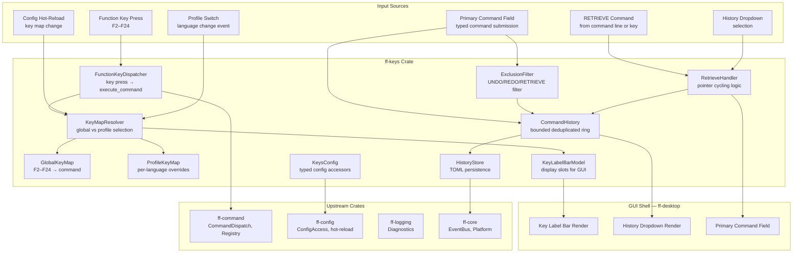

# Design Document: Function Keys and Command History (`ff-keys`)

## 1. Overview

The `ff-keys` crate manages **configurable function key maps**, the **Key Label Bar display**, and the **RETRIEVE command with command history** for the FileForgeWorkbench platform. It implements the ISPF-inspired workflow of mapping F2–F24 to arbitrary commands, displaying current bindings in a footer bar, and providing a persistent, deduplicated, bounded history of previously entered commands with single-step recall.

### Purpose

- Resolve the active function key map (Global or Profile) and translate key presses into command dispatch calls
- Maintain a Key Label Bar model that reflects current bindings for GUI rendering
- Implement the RETRIEVE command for single-step history recall with pointer cycling
- Manage a bounded, deduplicated, persistent Command_History ring
- Persist key maps and history settings via TOML configuration
- Detect and warn on function key conflicts with reserved shortcuts

### Position in Architecture

```
Wave 9 — Desktop Integration (depends on Wave 8)

┌──────────────────────────────────────────────────────────┐
│              Shell Layer: ff-desktop (egui)                │
│   (renders Key_Label_Bar, History_Dropdown in footer)     │
├──────────────────────────────────────────────────────────┤
│  THIS CRATE: ff-keys ← Wave 9                            │
│  (key map resolution, history, RETRIEVE, label bar model) │
├──────────────────────────────────────────────────────────┤
│  ff-command (dispatch)  │  ff-config (settings, hot-reload)│
│  ff-menu-statusbar      │  ff-session (history file I/O)   │
│  ff-logging (diagnostics)│  ff-core (event bus, platform)  │
├──────────────────────────────────────────────────────────┤
│              Foundation Layer: ff-logging                  │
└──────────────────────────────────────────────────────────┘
```

### Design Constraints (Cross-Cutting)

- **Command-Driven (Req 4)**: Function key presses dispatch through `ff-command`'s `execute_command`; RETRIEVE is a registered command
- **Configuration Namespace (Req 5)**: All settings under `[keys]` namespace in TOML; language key maps in `languages/*.toml` `[key_map]` sections
- **GUI Independence (Req 2)**: Key map resolution, history management, and RETRIEVE pointer logic are GUI-free; the shell renders using the model
- **Multi-Crate Workspace (Req 7)**: Crate at `crates/ff-keys`
- **Error Message Standards (Req 8)**: All errors follow `[keys] operation: description` format
- **Keyboard Shortcut Registry (Req 10)**: F1 is reserved (context-help); F2–F24 are user-configurable via this crate

### Upstream Dependencies

| Crate | Usage |
|-------|-------|
| `ff-command` | `CommandDispatch::execute_command()` for function key execution; `CommandRegistry` for RETRIEVE registration |
| `ff-config` | `ConfigAccess` for key map settings, hot-reload subscription on `keys.*` and language profile `[key_map]` sections |
| `ff-logging` | Structured diagnostics (WARN for invalid keys, INFO for key map switches) |
| `ff-core` | `EventBus` for profile-change events; `Platform::user_data_dir()` for history file path |

### Downstream Consumers

| Crate | Usage |
|-------|-------|
| `ff-desktop` | Renders Key_Label_Bar widget and History_Dropdown from this crate's model |
| `ff-menu-statusbar` | Primary_Command_Field integrates with RETRIEVE recall and dropdown |

---

## 2. Architecture

### High-Level Architecture Diagram



### Component Responsibilities

| Component | Role |
|-----------|------|
| **KeyMapResolver** | Selects active key map based on current language profile; subscribes to profile-change and config-reload events |
| **GlobalKeyMap** | Parses and holds the `[global_key_map]` section from workbench config |
| **ProfileKeyMap** | Parses and holds the `[key_map]` section from a language profile TOML |
| **KeyLabelBarModel** | Derives display labels from active key map; provides slot data for GUI rendering |
| **FunctionKeyDispatcher** | Translates an F-key press into a `execute_command` call via the active key map |
| **CommandHistory** | Bounded, deduplicated, ordered ring of past commands; manages capacity and dedup |
| **RetrieveHandler** | Manages the Retrieve_Pointer, cycling backward through history on successive calls |
| **HistoryStore** | Loads/saves CommandHistory to/from a TOML file in User_Data_Dir |
| **ExclusionFilter** | Determines whether a command should be recorded in history (filters excluded commands) |
| **KeysConfig** | Typed accessors for all `[keys]` configuration values with defaults |

### Data Flow: Function Key Press

```
1. User presses F5
2. GUI shell sends FunctionKeyEvent(F5) to FunctionKeyDispatcher
3. FunctionKeyDispatcher asks KeyMapResolver for active key map
4. KeyMapResolver returns the active map (Global or Profile depending on state)
5. FunctionKeyDispatcher looks up F5 in the active map
   - If assigned → extract command string (e.g., "FIND 'ERROR' ALL")
   - If unassigned → no-op, return
6. FunctionKeyDispatcher calls ff-command execute_command(command_string)
7. If command is not in ExclusionFilter → record in CommandHistory
8. CommandHistory deduplicates, inserts at front, trims if over capacity
```

### Data Flow: RETRIEVE Command

```
1. User types "RETRIEVE" on Primary_Command_Field and presses Enter
2. ff-command dispatches to RetrieveHandler (registered command)
3. RetrieveHandler checks CommandHistory:
   - If empty → return status message "Command history is empty"
   - If pointer at initial → set pointer to index 0 (most recent), return entry
   - If pointer already advanced → advance pointer by 1 (older)
   - If pointer at end → return status message "No older history"
4. RetrieveHandler returns RetrieveResult with the recalled command string
5. GUI shell places the string in Primary_Command_Field without executing
6. RETRIEVE itself is NOT recorded in history (ExclusionFilter)
```

---

## 3. Module Structure

```
crates/ff-keys/
├── Cargo.toml
├── src/
│   ├── lib.rs              # Public API re-exports, crate documentation
│   ├── key_map.rs          # FunctionKey enum, KeyMapEntry, KeyMap struct
│   ├── resolver.rs         # KeyMapResolver: active map selection logic
│   ├── dispatcher.rs       # FunctionKeyDispatcher: key press → command dispatch
│   ├── label_bar.rs        # KeyLabelBarModel: display slot derivation
│   ├── history.rs          # CommandHistory: bounded dedup ring
│   ├── retrieve.rs         # RetrieveHandler: pointer cycling, command registration
│   ├── store.rs            # HistoryStore: TOML file load/save
│   ├── exclusion.rs        # ExclusionFilter: excluded command set management
│   ├── config.rs           # KeysConfig: typed config key definitions
│   ├── error.rs            # KeysError enum
│   └── event.rs            # Event types for key map changes
└── tests/
    ├── key_map_tests.rs        # Key map parsing and lookup tests
    ├── resolver_tests.rs       # Resolver switching logic tests
    ├── dispatcher_tests.rs     # Dispatch integration tests
    ├── label_bar_tests.rs      # Label derivation tests
    ├── history_tests.rs        # History dedup, capacity, ordering tests
    ├── retrieve_tests.rs       # Retrieve pointer cycling tests
    ├── store_tests.rs          # TOML persistence round-trip tests
    ├── exclusion_tests.rs      # Exclusion filter tests
    └── integration.rs          # End-to-end key press and retrieve flows
```

---

## 4. Key Data Models and Types

### FunctionKey

```rust
/// Represents a function key in the F1–F24 range.
/// F1 is reserved (context-help) but included for completeness in the enum.
///
/// Addresses: Requirement 1 AC 3, Requirement 1 AC 5
#[derive(Debug, Clone, Copy, PartialEq, Eq, Hash, PartialOrd, Ord)]
pub enum FunctionKey {
    F1, F2, F3, F4, F5, F6, F7, F8, F9, F10, F11, F12,
    F13, F14, F15, F16, F17, F18, F19, F20, F21, F22, F23, F24,
}

impl FunctionKey {
    /// The minimum assignable function key (F1 is reserved for Help).
    pub const MIN_ASSIGNABLE: FunctionKey = FunctionKey::F2;

    /// The maximum function key.
    pub const MAX: FunctionKey = FunctionKey::F24;

    /// Parse a function key from a string like "F3", "F12", "f24".
    /// Returns None for out-of-range values or unparseable strings.
    pub fn from_str(s: &str) -> Option<Self>;

    /// The display name (e.g., "F3", "F12").
    pub fn display_name(&self) -> &'static str;

    /// Whether this key is in the assignable range (F2–F24).
    pub fn is_assignable(&self) -> bool;

    /// Numeric value (F1=1, F2=2, ..., F24=24).
    pub fn number(&self) -> u8;
}
```

### KeyMapEntry

```rust
/// A single function key assignment within a key map.
///
/// Addresses: Requirement 1 AC 3, Requirement 4 AC 4, AC 5
#[derive(Debug, Clone, PartialEq, Eq)]
pub struct KeyMapEntry {
    /// The command string to dispatch (full primary command syntax).
    /// Example: "FIND 'ERROR' ALL", "MACRO myfix", "SAVE"
    pub command: String,

    /// Optional explicit short label for the Key_Label_Bar.
    /// If None, the label is derived from the first token of `command`.
    pub label: Option<String>,
}

impl KeyMapEntry {
    /// Create a new entry with just a command string (label auto-derived).
    pub fn new(command: impl Into<String>) -> Self;

    /// Create a new entry with an explicit label.
    pub fn with_label(command: impl Into<String>, label: impl Into<String>) -> Self;

    /// Derive the display label: explicit label if set, otherwise first token of command.
    ///
    /// Addresses: Requirement 4 AC 4, AC 5
    pub fn display_label(&self) -> &str;
}
```

### KeyMap

```rust
/// A collection of function key assignments.
/// Used for both Global_Key_Map and Profile_Key_Map.
///
/// Addresses: Requirement 1, Requirement 2
#[derive(Debug, Clone, PartialEq, Eq)]
pub struct KeyMap {
    /// The key assignments, keyed by FunctionKey.
    entries: HashMap<FunctionKey, KeyMapEntry>,

    /// Source identifier for diagnostics (e.g., "global", "cobol").
    source: String,
}

impl KeyMap {
    /// Create an empty key map with the given source name.
    pub fn empty(source: impl Into<String>) -> Self;

    /// Parse a key map from a TOML table (the `[global_key_map]` or `[key_map]` section).
    /// Invalid entries are skipped with warnings logged.
    ///
    /// Addresses: Requirement 1 AC 5, Requirement 11 AC 1
    pub fn from_toml(table: &toml::Table, source: &str) -> (Self, Vec<KeysWarning>);

    /// Look up the entry for a function key. Returns None if unassigned.
    pub fn get(&self, key: FunctionKey) -> Option<&KeyMapEntry>;

    /// Insert or replace an assignment.
    pub fn set(&mut self, key: FunctionKey, entry: KeyMapEntry);

    /// Remove an assignment. Returns the removed entry if present.
    pub fn remove(&mut self, key: FunctionKey) -> Option<KeyMapEntry>;

    /// Iterate over all assigned keys in order.
    pub fn iter(&self) -> impl Iterator<Item = (FunctionKey, &KeyMapEntry)>;

    /// Number of assigned keys.
    pub fn len(&self) -> usize;

    /// Whether the key map has no assignments.
    pub fn is_empty(&self) -> bool;

    /// The source name for this key map.
    pub fn source(&self) -> &str;
}
```

### KeyMapResolver

```rust
/// Selects the active key map based on the current language profile state.
/// Implements the full-replacement model: when a Profile_Key_Map is active,
/// the Global_Key_Map is entirely inactive.
///
/// Addresses: Requirement 1 AC 2, Requirement 2 AC 1–6
#[derive(Debug)]
pub struct KeyMapResolver {
    /// The loaded global key map.
    global_key_map: KeyMap,

    /// The currently active profile key map (if any).
    active_profile_key_map: Option<KeyMap>,

    /// The name of the currently active language profile (if any).
    active_profile_name: Option<String>,
}

impl KeyMapResolver {
    /// Create a resolver with the given global key map and no active profile.
    pub fn new(global_key_map: KeyMap) -> Self;

    /// Get a reference to the currently effective key map.
    /// Returns the Profile_Key_Map if active, otherwise the Global_Key_Map.
    ///
    /// Addresses: Requirement 2 AC 2
    pub fn active_key_map(&self) -> &KeyMap;

    /// Set the active profile key map (language profile changed).
    /// Pass None to deactivate the profile key map and fall back to global.
    ///
    /// Addresses: Requirement 2 AC 4, AC 6
    pub fn set_profile_key_map(&mut self, profile_name: Option<&str>, key_map: Option<KeyMap>);

    /// Replace the global key map (configuration hot-reload).
    ///
    /// Addresses: Requirement 11 AC 7
    pub fn set_global_key_map(&mut self, key_map: KeyMap);

    /// Whether a profile key map is currently active.
    pub fn is_profile_active(&self) -> bool;

    /// The name of the active profile, if any.
    pub fn active_profile_name(&self) -> Option<&str>;
}
```

### KeyLabelSlot

```rust
/// A single slot in the Key Label Bar display model.
///
/// Addresses: Requirement 4 AC 2, AC 3
#[derive(Debug, Clone, PartialEq, Eq)]
pub struct KeyLabelSlot {
    /// The function key for this slot.
    pub key: FunctionKey,

    /// The display label (derived or explicit). None if unassigned.
    pub label: Option<String>,
}
```

### KeyLabelBarModel

```rust
/// The display model for the Key Label Bar.
/// Provides an ordered list of slots for GUI rendering.
///
/// Addresses: Requirement 4
#[derive(Debug, Clone, PartialEq, Eq)]
pub struct KeyLabelBarModel {
    /// Ordered slots for F2–F24 (F1 reserved, not displayed).
    slots: Vec<KeyLabelSlot>,
}

impl KeyLabelBarModel {
    /// Build the label bar model from the active key map.
    ///
    /// Addresses: Requirement 4 AC 2, AC 4, AC 5
    pub fn from_key_map(key_map: &KeyMap) -> Self;

    /// Get all slots in display order.
    pub fn slots(&self) -> &[KeyLabelSlot];

    /// Get the slot for a specific key.
    pub fn slot_for(&self, key: FunctionKey) -> Option<&KeyLabelSlot>;

    /// Get only the assigned (non-blank) slots.
    pub fn assigned_slots(&self) -> impl Iterator<Item = &KeyLabelSlot>;
}
```

### HistoryEntry

```rust
/// A single entry in the Command_History.
///
/// Addresses: Requirement 6, Requirement 7
#[derive(Debug, Clone, PartialEq, Eq)]
pub struct HistoryEntry {
    /// The full command string as entered/dispatched.
    pub command: String,
}

impl HistoryEntry {
    /// Create a new history entry.
    pub fn new(command: impl Into<String>) -> Self;

    /// Extract the command name (first token) for deduplication comparison.
    /// Returns the first whitespace-delimited token.
    pub fn command_name(&self) -> &str;

    /// Extract the arguments portion (everything after the first token).
    pub fn arguments(&self) -> &str;

    /// Check if this entry is a duplicate of another using the deduplication
    /// rules: case-insensitive on command name, case-preserving on arguments.
    ///
    /// Addresses: Requirement 7 AC 2
    pub fn is_duplicate_of(&self, other: &HistoryEntry) -> bool;
}
```

### CommandHistory

```rust
/// Bounded, deduplicated, ordered command history ring.
/// Entries are stored most-recent-first.
///
/// Addresses: Requirement 6, Requirement 7, Requirement 9
#[derive(Debug, Clone)]
pub struct CommandHistory {
    /// The history entries, most-recent-first.
    entries: VecDeque<HistoryEntry>,

    /// Maximum number of entries (configured via `max_history_entries`).
    max_entries: usize,
}

impl CommandHistory {
    /// The default maximum number of entries.
    pub const DEFAULT_MAX_ENTRIES: usize = 200;

    /// Create an empty history with the given capacity.
    pub fn new(max_entries: usize) -> Self;

    /// Create an empty history with the default capacity.
    pub fn with_default_capacity() -> Self;

    /// Add a command to history. Applies deduplication and capacity rules.
    /// - If a duplicate exists, removes it and inserts the new entry at front.
    /// - If at capacity, removes the oldest entry before inserting.
    ///
    /// Addresses: Requirement 7 AC 1, AC 3; Requirement 9 AC 3
    pub fn add(&mut self, command: impl Into<String>);

    /// Get the entry at the given index (0 = most recent).
    pub fn get(&self, index: usize) -> Option<&HistoryEntry>;

    /// Number of entries currently in history.
    pub fn len(&self) -> usize;

    /// Whether history is empty.
    pub fn is_empty(&self) -> bool;

    /// Get the maximum capacity.
    pub fn max_entries(&self) -> usize;

    /// Update the maximum capacity. If the new max is smaller than the
    /// current length, oldest entries are trimmed.
    ///
    /// Addresses: Requirement 9 AC 3, Requirement 11 AC 7
    pub fn set_max_entries(&mut self, max: usize);

    /// Iterate over all entries, most-recent-first.
    pub fn iter(&self) -> impl Iterator<Item = &HistoryEntry>;

    /// Clear all entries.
    pub fn clear(&mut self);

    /// Export entries as a Vec for serialisation.
    pub fn to_vec(&self) -> Vec<HistoryEntry>;

    /// Import entries from a Vec (most-recent-first order expected).
    pub fn from_vec(entries: Vec<HistoryEntry>, max_entries: usize) -> Self;
}
```

### RetrieveState

```rust
/// The state of the RETRIEVE pointer within a history browsing cycle.
///
/// Addresses: Requirement 5
#[derive(Debug, Clone, PartialEq, Eq)]
pub enum RetrieveState {
    /// No retrieval cycle active. Next RETRIEVE starts from most recent.
    Initial,

    /// Currently pointing at a specific index in CommandHistory.
    /// Index 0 = most recent entry.
    AtIndex(usize),

    /// Reached the end of history (oldest entry already displayed).
    AtEnd,
}
```

### RetrieveResult

```rust
/// Result of a RETRIEVE command invocation.
///
/// Addresses: Requirement 5 AC 1–7
#[derive(Debug, Clone, PartialEq, Eq)]
pub enum RetrieveResult {
    /// Successfully recalled a command. Place it in the command field.
    Recalled { command: String },

    /// History is empty; nothing to recall.
    HistoryEmpty,

    /// Already at the oldest entry; no older history exists.
    NoOlderHistory,
}
```

### KeysWarning

```rust
/// A non-fatal warning produced during key map parsing or configuration.
///
/// Addresses: Requirement 1 AC 5, Requirement 11 AC 6
#[derive(Debug, Clone, PartialEq, Eq)]
pub struct KeysWarning {
    /// The configuration key or field that caused the warning.
    pub field: String,

    /// Human-readable description of the issue.
    pub message: String,

    /// The default value that was applied.
    pub default_applied: Option<String>,
}
```

---

## 5. Public API Surface

### Function Key Dispatch

```rust
/// Dispatches function key presses to the command framework.
///
/// Addresses: Requirement 3
pub struct FunctionKeyDispatcher {
    resolver: Arc<RwLock<KeyMapResolver>>,
    command_dispatch: Arc<dyn CommandDispatchService>,
    history: Arc<RwLock<CommandHistory>>,
    exclusion_filter: Arc<ExclusionFilter>,
}

impl FunctionKeyDispatcher {
    /// Create a new dispatcher with the required services.
    pub fn new(
        resolver: Arc<RwLock<KeyMapResolver>>,
        command_dispatch: Arc<dyn CommandDispatchService>,
        history: Arc<RwLock<CommandHistory>>,
        exclusion_filter: Arc<ExclusionFilter>,
    ) -> Self;

    /// Handle a function key press.
    /// Returns Ok(Some(command)) if a command was dispatched,
    /// Ok(None) if the key was unassigned, or Err on dispatch failure.
    ///
    /// Addresses: Requirement 3 AC 1–6
    pub fn dispatch(&self, key: FunctionKey) -> Result<Option<String>, KeysError>;
}

/// Trait abstracting the command dispatch service (for testability).
pub trait CommandDispatchService: Send + Sync {
    /// Execute a command string as if typed on the primary command field.
    fn execute_command_string(&self, command: &str) -> Result<(), KeysError>;
}
```

### RETRIEVE Command Handler

```rust
/// Implements the RETRIEVE command: single-step backward recall through history.
///
/// Addresses: Requirement 5
pub struct RetrieveHandler {
    history: Arc<RwLock<CommandHistory>>,
    state: RwLock<RetrieveState>,
}

impl RetrieveHandler {
    /// Create a new retrieve handler sharing the given history.
    pub fn new(history: Arc<RwLock<CommandHistory>>) -> Self;

    /// Execute one RETRIEVE step.
    /// Advances the pointer backward and returns the recalled entry.
    ///
    /// Addresses: Requirement 5 AC 1–4, AC 7
    pub fn retrieve(&self) -> RetrieveResult;

    /// Reset the pointer to initial state.
    /// Called when any non-RETRIEVE command is submitted.
    ///
    /// Addresses: Requirement 5 AC 5
    pub fn reset(&self);

    /// Set the pointer to a specific index (used by History_Dropdown selection).
    ///
    /// Addresses: Requirement 10 AC 4
    pub fn set_position(&self, index: usize);

    /// Get the current retrieve state (for UI indicator purposes).
    pub fn state(&self) -> RetrieveState;
}
```

### History Store (Persistence)

```rust
/// Persists CommandHistory to/from a TOML file.
///
/// Addresses: Requirement 6
pub struct HistoryStore {
    /// Path to the history TOML file.
    path: PathBuf,
}

impl HistoryStore {
    /// Create a store handle for the given file path.
    pub fn new(path: PathBuf) -> Self;

    /// Load history from disk. Returns empty history on missing or corrupt file.
    ///
    /// Addresses: Requirement 6 AC 2, AC 5, AC 6
    pub fn load(&self, max_entries: usize) -> (CommandHistory, Vec<KeysWarning>);

    /// Persist the current history to disk.
    ///
    /// Addresses: Requirement 6 AC 3, AC 7
    pub fn save(&self, history: &CommandHistory) -> Result<(), KeysError>;

    /// Whether the history file exists on disk.
    pub fn exists(&self) -> bool;
}
```

### Exclusion Filter

```rust
/// Manages the set of commands excluded from history recording.
///
/// Addresses: Requirement 8
pub struct ExclusionFilter {
    /// The set of excluded command names (case-insensitive comparison).
    excluded: RwLock<HashSet<String>>,
}

impl ExclusionFilter {
    /// The default excluded commands.
    pub const DEFAULTS: &'static [&'static str] = &["RETRIEVE", "UNDO", "REDO"];

    /// Create a filter with the default exclusions.
    pub fn with_defaults() -> Self;

    /// Create a filter with defaults plus additional exclusions from config.
    ///
    /// Addresses: Requirement 8 AC 3
    pub fn with_additional(additional: &[String]) -> Self;

    /// Check whether a command should be excluded from history.
    /// Comparison is case-insensitive on the command name (first token).
    ///
    /// Addresses: Requirement 8 AC 1, AC 4
    pub fn is_excluded(&self, command: &str) -> bool;

    /// Update the exclusion set (hot-reload of configuration).
    pub fn update(&self, additional: &[String]);
}
```

### Configuration Accessors

```rust
/// Typed accessors for all configuration keys in the `[keys]` namespace.
///
/// Addresses: Requirement 9, Requirement 11
pub struct KeysConfig {
    config: Arc<dyn ConfigAccess>,
}

impl KeysConfig {
    /// Create config accessors bound to the given config provider.
    pub fn new(config: Arc<dyn ConfigAccess>) -> Self;

    /// Maximum history entries. Default: 200. Invalid values (<=0) return 200.
    ///
    /// Addresses: Requirement 9 AC 1, AC 2, AC 4
    pub fn max_history_entries(&self) -> usize;

    /// Path to the history file. Default: `{User_Data_Dir}/command_history.toml`.
    ///
    /// Addresses: Requirement 6 AC 4
    pub fn history_file_path(&self, user_data_dir: &Path) -> PathBuf;

    /// Additional excluded commands beyond the defaults.
    ///
    /// Addresses: Requirement 8 AC 3
    pub fn history_excluded_commands(&self) -> Vec<String>;
}
```

### Command Registration

```rust
/// Register function-keys-and-history commands with the command framework.
///
/// Commands registered:
/// - `keys.retrieve` — RETRIEVE command (Requirement 5)
///
/// Addresses: Cross-cutting Requirement 4
pub fn register_keys_commands(
    registry: &CommandRegistry,
    retrieve_handler: Arc<RetrieveHandler>,
) -> Result<(), KeysError>;
```

### Event Types

```rust
/// Events emitted by the ff-keys crate via the event bus.
#[derive(Debug, Clone)]
pub enum KeysEvent {
    /// The active key map changed (profile switch or config reload).
    /// Listeners should refresh the Key_Label_Bar display.
    ///
    /// Addresses: Requirement 4 AC 6, Requirement 2 AC 6
    KeyMapChanged {
        /// Source of the new active map ("global" or profile name).
        source: String,
    },

    /// A command was added to history.
    HistoryUpdated {
        /// Number of entries currently in history.
        count: usize,
    },
}
```

### Initialization

```rust
/// Initialize the ff-keys subsystem. Called during startup sequence.
///
/// Performs:
/// 1. Load global key map from configuration
/// 2. Load history from HistoryStore
/// 3. Register RETRIEVE command
/// 4. Subscribe to profile-change and config-reload events
///
/// Returns the top-level service handles for use by the shell and other crates.
pub fn initialize_keys_subsystem(
    config: Arc<dyn ConfigAccess>,
    command_registry: &CommandRegistry,
    event_bus: &EventBus,
    user_data_dir: &Path,
) -> Result<KeysSubsystem, KeysError>;

/// The top-level service container for the ff-keys subsystem.
pub struct KeysSubsystem {
    /// The function key dispatcher (for handling key press events from the shell).
    pub dispatcher: Arc<FunctionKeyDispatcher>,

    /// The key map resolver (for querying the active key map).
    pub resolver: Arc<RwLock<KeyMapResolver>>,

    /// The key label bar model (for rendering in the shell).
    pub label_bar: Arc<RwLock<KeyLabelBarModel>>,

    /// The command history (for the History_Dropdown).
    pub history: Arc<RwLock<CommandHistory>>,

    /// The retrieve handler (for RETRIEVE command and dropdown integration).
    pub retrieve: Arc<RetrieveHandler>,

    /// The exclusion filter (for command submission integration).
    pub exclusion_filter: Arc<ExclusionFilter>,

    /// The history store (for persistence on exit).
    pub store: Arc<HistoryStore>,
}
```

---

## 6. Error Types

```rust
/// Error type for all function-keys-and-history failures.
///
/// Display format follows cross-cutting Requirement 8: `[keys] operation: description`
#[derive(Debug, thiserror::Error)]
#[non_exhaustive]
pub enum KeysError {
    /// A function key identifier could not be parsed.
    #[error("[keys] parse: invalid function key identifier '{key}' — expected F1–F24")]
    InvalidFunctionKey {
        key: String,
    },

    /// A command string assigned to a key is empty or invalid.
    #[error("[keys] config: empty command string for key {key}")]
    EmptyCommandString {
        key: String,
    },

    /// Attempted to assign a reserved function key (F1).
    #[error("[keys] assign: F1 is reserved for context-help and cannot be reassigned")]
    ReservedKeyAssignment,

    /// Command dispatch failed for a function key press.
    #[error("[keys] dispatch: command execution failed for {key} — {reason}")]
    DispatchFailed {
        key: String,
        reason: String,
    },

    /// History file could not be read (I/O error).
    #[error("[keys] history-load: failed to read history file — {reason}")]
    HistoryLoadError {
        reason: String,
    },

    /// History file could not be written (I/O error, disk full).
    #[error("[keys] history-save: failed to write history file — {reason}")]
    HistorySaveError {
        reason: String,
    },

    /// History file TOML is syntactically invalid or has wrong schema.
    #[error("[keys] history-parse: invalid TOML in history file — {reason}")]
    HistoryParseError {
        reason: String,
    },

    /// Configuration value is invalid type or out of range.
    #[error("[keys] config: invalid value for '{key}' — expected {expected}, using default {default}")]
    ConfigValueError {
        key: String,
        expected: String,
        default: String,
    },

    /// Command registration failed.
    #[error("[keys] register: failed to register command '{command_id}' — {reason}")]
    CommandRegistrationFailed {
        command_id: String,
        reason: String,
    },

    /// Generic I/O error with operation context.
    #[error("[keys] {operation}: I/O error — {source}")]
    Io {
        operation: String,
        #[source]
        source: std::io::Error,
    },
}
```

---

## 7. Integration Points

### Integration with `ff-command` (Command Framework)

| Operation | API Used | Notes |
|-----------|----------|-------|
| Dispatch function key command | `CommandDispatch::execute_command(command_str, params)` | Dispatches as if typed on command line |
| Register RETRIEVE command | `CommandRegistry::register(id, metadata, handler)` | Command ID: `keys.retrieve` |
| Check command existence | `CommandRegistry::get(id)` | Validate assigned command exists (optional, warn-only) |
| History exclusion check | Compare command name against ExclusionFilter | Before recording in CommandHistory |

**Command Metadata for RETRIEVE:**

| Field | Value |
|-------|-------|
| Command ID | `keys.retrieve` |
| Display Name | "Retrieve Previous Command" |
| Category | `keys` |
| Description | "Recall the previous command from history into the command field" |
| Default Shortcut | None (typically assigned to a function key by the user) |

### Integration with `ff-config` (Configuration System)

| Operation | API Used | Notes |
|-----------|----------|-------|
| Load global key map | `ConfigAccess::get_table("global_key_map")` | Parsed into KeyMap at startup |
| Load history settings | `ConfigAccess::get_int("keys.max_history_entries")` | With default fallback |
| Load history file path | `ConfigAccess::get_string("keys.history_file")` | Resolved relative to User_Data_Dir |
| Load excluded commands | `ConfigAccess::get_string_array("keys.history_excluded_commands")` | Merged with defaults |
| Hot-reload subscription | `ConfigAccess::subscribe("global_key_map.*")` | Refresh KeyMap on change |
| Profile key map load | `ConfigAccess::get_table("key_map")` from language profile | On profile activation |

**Registered Configuration Keys:**

| Key | Type | Default | Range | Purpose |
|-----|------|---------|-------|---------|
| `keys.max_history_entries` | `u32` | `200` | 1–10000 | Maximum command history entries |
| `keys.history_file` | `String` | `"command_history.toml"` | — | History file path (relative to User_Data_Dir) |
| `keys.history_excluded_commands` | `[String]` | `[]` | — | Additional commands excluded from history |

**Global Key Map Configuration (top-level section):**

```toml
[global_key_map]
F3 = "END"
F5 = "FIND"
F6 = "CHANGE"
F7 = { command = "UP MAX", label = "UP" }
F8 = { command = "DOWN MAX", label = "DOWN" }
F9 = "SWAP"
F12 = "RETRIEVE"
```

**Language Profile Key Map (in `languages/cobol.toml`):**

```toml
[key_map]
F3 = "END"
F5 = "FIND"
F7 = { command = "UP MAX", label = "UP" }
F8 = { command = "DOWN MAX", label = "DOWN" }
F10 = { command = "MACRO cobol_check", label = "CHECK" }
F11 = "COLS"
```

### Integration with `ff-menu-statusbar` (Menu and Status Bar)

| Operation | API Used | Notes |
|-----------|----------|-------|
| Key Label Bar rendering | `KeyLabelBarModel::slots()` | Shell reads model and renders in footer |
| Primary Command Field submission | Shell calls `history.add()` + `exclusion_filter.is_excluded()` | On command submission |
| RETRIEVE result delivery | Shell reads `RetrieveResult::Recalled { command }` | Places text in field |
| History Dropdown data | `CommandHistory::iter()` | Provides list for dropdown |
| Dropdown selection | `RetrieveHandler::set_position(index)` | Syncs pointer with dropdown |

### Integration with `ff-session` (Startup and Session)

| Operation | API Used | Notes |
|-----------|----------|-------|
| History load at startup | `HistoryStore::load()` during startup Phase 6 | After config loaded |
| History save at exit | `HistoryStore::save()` during exit sequence | Before plugin shutdown |
| Graceful degradation | Empty history on corrupt file | Never prevents startup |

### Integration with `ff-core` (Platform Core)

| Operation | API Used | Notes |
|-----------|----------|-------|
| User_Data_Dir path | `Platform::user_data_dir()` | For history file location |
| Event emission | `EventBus::emit(KeysEvent::KeyMapChanged)` | On key map switch |
| Profile change subscription | `EventBus::subscribe("language.profile_changed")` | Triggers key map recomputation |

---

## 8. Correctness Properties

These properties are suitable for property-based testing with the `proptest` crate.

### Property 1: Profile Key Map Fully Replaces Global Key Map

**Statement**: When a Profile_Key_Map is active, lookups for any FunctionKey that is NOT defined in the Profile_Key_Map return None — they never fall through to the Global_Key_Map. The Global_Key_Map is entirely inactive during profile override.

**Validates**: Requirement 2 AC 2, AC 5

```rust
// proptest strategy: generate a GlobalKeyMap with random F2–F24 assignments,
//   and a ProfileKeyMap with a DIFFERENT subset of F2–F24 assignments.
// action: activate profile key map on KeyMapResolver.
// assertion: for all keys K in F2–F24:
//   if K is in ProfileKeyMap → resolver returns ProfileKeyMap entry
//   if K is NOT in ProfileKeyMap → resolver returns None (even if K is in GlobalKeyMap)
// assertion: no entry from GlobalKeyMap is ever returned while profile is active
```

### Property 2: History Deduplication Preserves Most-Recent-First Order

**Statement**: For any sequence of command additions, if a duplicate is added, the duplicate is removed from its old position and the new entry is placed at index 0. After any addition, the history contains no duplicate entries (per the deduplication comparison rules).

**Validates**: Requirement 7 AC 1, AC 2, AC 3

```rust
// proptest strategy: generate a sequence of 1..500 command strings
//   (some deliberately repeated with different command-name casing).
// action: add each command to CommandHistory in order.
// assertion: at every step, history contains no duplicates (per is_duplicate_of)
// assertion: the most recently added command is always at index 0
// assertion: len <= max_entries at all times
```

### Property 3: History Capacity Is Never Exceeded

**Statement**: For any `max_history_entries` value M > 0, and any sequence of add operations, the CommandHistory length never exceeds M. When an entry is added and the history is at capacity, the oldest entry is evicted.

**Validates**: Requirement 9 AC 3

```rust
// proptest strategy: generate max_entries in 1..500,
//   then a sequence of 0..1000 unique command strings.
// action: add each command to CommandHistory.
// assertion: history.len() <= max_entries at all times
// assertion: when at capacity, the entry at index max_entries-1 changes on each add
```

### Property 4: RETRIEVE Pointer Cycles Backward Through Entire History

**Statement**: Starting from the initial state, N successive RETRIEVE invocations (where N = history.len()) return entries at indices 0, 1, 2, ..., N-1 in that order. The (N+1)th invocation returns `NoOlderHistory`. After a reset, the cycle starts from index 0 again.

**Validates**: Requirement 5 AC 1, AC 2, AC 3, AC 4, AC 5

```rust
// proptest strategy: generate CommandHistory with 1..100 entries.
// action: invoke retrieve() repeatedly, collect results.
// assertion: first N results are Recalled with commands matching history[0..N]
// assertion: (N+1)th result is NoOlderHistory
// action: call reset(), then retrieve() again.
// assertion: result is Recalled with history[0]
```

### Property 5: Key Label Bar Matches Active Key Map

**Statement**: For any KeyMap state, the KeyLabelBarModel produced by `from_key_map` has a slot for every assigned key with the correct display label, and blank slots for all unassigned keys. The model always reflects the current key map exactly.

**Validates**: Requirement 4 AC 2, AC 3, AC 4, AC 5

```rust
// proptest strategy: generate a KeyMap with random subset of F2–F24 assigned,
//   some with explicit labels, some without.
// action: build KeyLabelBarModel from the key map.
// assertion: for each assigned key, slot.label == entry.display_label()
// assertion: for each unassigned key, slot.label == None
// assertion: explicit labels override derived labels
// assertion: derived label == first token of command string
```

### Property 6: Excluded Commands Are Never Recorded in History

**Statement**: For any command string whose first token (case-insensitive) matches an entry in the Excluded_Command set, that command is never present in CommandHistory regardless of the invocation source (typed, function key, macro).

**Validates**: Requirement 8 AC 1, AC 2, AC 4; Requirement 3 AC 6

```rust
// proptest strategy: generate an ExclusionFilter with defaults + 0..10 additional exclusions,
//   then a sequence of commands where some match excluded names (various casings).
// action: for each command, check is_excluded() before adding to history.
// assertion: history never contains any command whose name matches an excluded entry
// assertion: non-excluded commands ARE present in history
```

### Property 7: History Store Round-Trip Serialisation

**Statement**: For any valid CommandHistory, saving to the HistoryStore and loading back produces an identical CommandHistory (same entries, same order, same count). No data is lost or reordered in the round-trip.

**Validates**: Requirement 6 AC 1, AC 3, AC 7

```rust
// proptest strategy: generate CommandHistory with 0..200 entries,
//   each with arbitrary command strings (non-empty, no null bytes).
// action: save to a temp file, load from that file.
// assertion: loaded history entries == original history entries (same order, same content)
// assertion: loaded history.len() == original history.len()
```

### Property 8: Corrupt History File Never Prevents Operation

**Statement**: For any byte sequence written as the history file (including valid TOML, invalid TOML, empty bytes, binary garbage), loading the history file either returns a valid CommandHistory or returns an empty CommandHistory. It never panics, never propagates an unrecoverable error, and never prevents the subsystem from functioning.

**Validates**: Requirement 6 AC 5, AC 6

```rust
// proptest strategy: generate arbitrary byte vectors (0..10KB).
// action: write bytes to the history file path, call HistoryStore::load().
// assertion: result is always a valid (possibly empty) CommandHistory
// assertion: never panics
// assertion: if input was valid current-schema TOML, entries are preserved
```

### Property 9: Key Map Rejects Out-of-Range Keys Gracefully

**Statement**: For any TOML table containing keys outside the F1–F24 range (e.g., "F0", "F25", "G3", ""), the KeyMap parser skips those entries, produces a warning for each, and successfully loads all valid entries. Invalid entries never prevent valid entries from loading.

**Validates**: Requirement 1 AC 5

```rust
// proptest strategy: generate a TOML table with a mix of:
//   - valid keys (F2–F24 with valid command strings)
//   - invalid keys (F0, F25, F99, empty, non-F-prefixed)
// action: parse via KeyMap::from_toml()
// assertion: returned KeyMap contains all valid entries
// assertion: returned warnings list has one entry per invalid key
// assertion: no panic, no error return
```

### Property 10: Deduplication Comparison Is Symmetric and Case-Correct

**Statement**: The deduplication comparison (`is_duplicate_of`) is symmetric: if A is a duplicate of B, then B is a duplicate of A. Command-name comparison is case-insensitive. Argument comparison is case-sensitive (case-preserving). Two entries with the same command name but different argument casing are NOT duplicates.

**Validates**: Requirement 7 AC 2

```rust
// proptest strategy: generate pairs of HistoryEntry (command_name, arguments)
//   with various casing combinations.
// assertion: a.is_duplicate_of(&b) == b.is_duplicate_of(&a) (symmetry)
// assertion: entries with same name (any case) + same args (exact case) → duplicate
// assertion: entries with same name (any case) + different arg case → NOT duplicate
// assertion: entries with different names → NOT duplicate
```

---

## Appendix A: Configuration Keys Reference

All keys live under the `[keys]` namespace in the configuration system:

```toml
[keys]
max_history_entries = 200             # 1–10000 (default: 200)
history_file = "command_history.toml" # Relative to User_Data_Dir
history_excluded_commands = []        # Additional excluded commands beyond defaults
```

The global key map is a top-level section (not under `[keys]`):

```toml
[global_key_map]
F3 = "END"
F5 = "FIND"
F6 = "CHANGE"
F7 = { command = "UP MAX", label = "UP" }
F8 = { command = "DOWN MAX", label = "DOWN" }
F9 = "SWAP"
F12 = "RETRIEVE"
```

## Appendix B: History File Schema (command_history.toml)

```toml
# Command history file — managed by ff-keys
# Do not edit manually while the workbench is running.

schema_version = 1

[[entries]]
command = "FIND 'ERROR' ALL"

[[entries]]
command = "CHANGE 'foo' 'bar' ALL"

[[entries]]
command = "SAVE"

[[entries]]
command = "SORT A Z"
```

## Appendix C: Key Map TOML Schema

The key map section supports two value formats:

**Plain string format** (command only, label auto-derived):
```toml
F3 = "END"
F5 = "FIND 'ERROR' ALL"
```

**Table format** (command + explicit label):
```toml
F7 = { command = "UP MAX", label = "UP" }
F8 = { command = "DOWN MAX", label = "DOWN" }
F10 = { command = "MACRO cobol_check", label = "CHECK" }
```

## Appendix D: Event Bus Messages

| Event ID | Payload | Emitted By |
|----------|---------|------------|
| `keys.key_map_changed` | `{ source: String }` | `KeyMapResolver` (via ff-keys event) |
| `keys.history_updated` | `{ count: usize }` | `CommandHistory` (on add/clear) |

## Appendix E: Command IDs

| Command ID | Description | Excluded from History |
|------------|-------------|---------------------|
| `keys.retrieve` | Recall previous command into Primary_Command_Field | Yes |

## Appendix F: Reserved Keys

| Key | Owner | Cannot Be Reassigned |
|-----|-------|---------------------|
| F1 | `context-help` | Yes — hardcoded per cross-cutting Requirement 10.1 |
| F2–F24 | `ff-keys` (this crate) | No — fully user-configurable |

## Appendix G: Thread Safety Model

| Component | Mechanism | Rationale |
|-----------|-----------|-----------|
| `KeyMapResolver` | `Arc<RwLock<KeyMapResolver>>` | Many readers (every key press), rare writers (profile switch, config reload) |
| `CommandHistory` | `Arc<RwLock<CommandHistory>>` | Read by dropdown rendering, written on each command submission |
| `RetrieveHandler` | Internal `RwLock<RetrieveState>` | Written on RETRIEVE/reset, read rarely |
| `ExclusionFilter` | Internal `RwLock<HashSet>` | Written on config reload (rare), read on every command submission |
| `KeyLabelBarModel` | `Arc<RwLock<KeyLabelBarModel>>` | Written on key map change (rare), read every frame by GUI |

---

## 6. Per-Context Key Maps, PFSHOW, 24-Key Bar, Hotspots, END/RETURN, LIST+RETRIEVE

### Design Changes for Requirements 12–19

#### 6.1 PFSHOW Command

A new registered command `keys.pfshow` is added to the command framework. It accepts three forms: `PFSHOW ON`, `PFSHOW OFF`, and `PFSHOW` (toggle). The visibility state is a boolean field `key_bar_visible` added to the session state struct in `ff-session`, persisted in `session.toml`. The `ff-desktop` shell reads this flag each frame to decide whether to render the Key_Label_Bar rows.

No new crate is required. The handler lives in `ff-keys` and the session field lives in `ff-session`.

#### 6.2 Two-Row Key Label Bar Layout

`KeyLabelBarModel` is updated to always produce exactly 24 `KeyLabelSlot` entries (F1–F24), split into two rows of 12. Unassigned slots carry `label: None`. The `ff-desktop` render loop iterates `slots[0..12]` for row 1 and `slots[12..24]` for row 2, rendering each as a clickable `egui::Button` (see §6.4).

#### 6.3 Per-Context Key Map

`KeyMapResolver` gains a `context_maps: HashMap<String, KeyMap>` field and an `active_context: Option<String>` field. The resolution priority becomes:

```
1. Context_Key_Map (if active_context is set and a map exists for it)
2. Profile_Key_Map (if a language profile is active)
3. Global_Key_Map
```

Each level is full-replacement: activating a Context_Key_Map suppresses both the Profile_Key_Map and the Global_Key_Map. Context maps are loaded from `[context_key_maps.<name>]` TOML sections at startup and on hot-reload.

The `ff-desktop` shell calls `resolver.set_context(context_name)` on every tab switch. Context names are stable string constants defined in `ff-keys::context`.

#### 6.4 Key Label Bar Hotspots

Each slot in the two-row Key_Label_Bar is rendered as an `egui::Button` with the key name + label as its text. On click, the shell calls `dispatcher.dispatch(key)`. Tooltip text is set to the full command string via `egui::Response::on_hover_text`. Blank slots are rendered as disabled buttons.

#### 6.5 END and RETURN Navigation Commands

Two new commands are registered in `ff-keys` (or a new `ff-nav-commands` module within `ff-desktop`):

- `nav.end` — pops the tab navigation stack; if stack is empty or current tab is POM, exits.
- `nav.return` — activates the POM tab; if already on POM, exits.

The `ff-desktop` shell maintains a `tab_history: Vec<TabId>` stack. On each tab activation, the previous tab ID is pushed. `END` pops the stack and activates the popped tab. Both commands are added to `ExclusionFilter::DEFAULTS`.

#### 6.6 Contextual Help Fallback

In `ff-help`'s F1 handler: after `Context_Detector::resolve()` returns a `Topic_Key`, the handler calls `Help_Topic_Registry::get(key)`. If `None`, it emits a status-bar message rather than opening the Help_Panel. This is a minimal change to the existing `ff-help` crate.

#### 6.7 LIST + RETRIEVE History Browser

`RetrieveResult` gains a `ShowList { entries: Vec<String> }` variant. `RetrieveHandler::retrieve()` checks whether the current command field text (passed as a parameter) is `"LIST"` (case-insensitive, trimmed). If so, it returns `ShowList` with all history entries instead of `Recalled`. The `ff-desktop` shell renders a modal `egui::Window` overlay listing the entries as selectable rows. Selection populates the command field. `LIST` is not passed to `CommandHistory::add()` when it triggers this path.

---

## 7. Key Configuration Dialog and Modifier Key Extension (Phase AN)

### 7.1 New `ModifiedKey` Type

The current `FunctionKey` enum (F1–F24) covers only plain key presses. To support Shift+Fn, Ctrl+Fn, and Alt+Fn bindings, a new `ModifiedKey` struct is introduced in `ff-keys`:

```rust
/// A function key combined with an optional modifier.
/// Represents one of 96 addressable key slots (4 modifiers × 24 keys).
#[derive(Debug, Clone, Copy, PartialEq, Eq, Hash, PartialOrd, Ord)]
pub struct ModifiedKey {
    pub key: FunctionKey,
    pub modifier: KeyModifier,
}

/// The modifier applied to a function key.
#[derive(Debug, Clone, Copy, PartialEq, Eq, Hash, PartialOrd, Ord)]
pub enum KeyModifier {
    None,   // plain Fn
    Shift,  // Shift+Fn
    Ctrl,   // Ctrl+Fn
    Alt,    // Alt+Fn
}
```

`ModifiedKey` is used as the key type in `KeyMap` (replacing bare `FunctionKey`). The TOML key name syntax is:

| Modifier | TOML prefix | Example |
|----------|-------------|---------|
| None | `F` | `F3` |
| Shift | `SF` | `SF3` |
| Ctrl | `CF` | `CF3` |
| Alt | `AF` | `AF3` |

`KeyMap::from_toml_table` is updated to parse all four prefixes. `KeyBinding` gains an optional `description: Option<String>` field for the human-readable description shown in the dialog.

### 7.2 `KeyBinding` Description Field

```rust
pub struct KeyBinding {
    pub command: String,
    pub label: Option<String>,
    pub description: Option<String>,   // NEW — human-readable description
}
```

The description is stored in TOML as an optional `description` field in the table format:

```toml
F3 = { command = "END", label = "End", description = "Close current panel and return to previous" }
SF3 = { command = "SWAP", description = "Swap to the other split panel" }
```

Plain string format (no description) remains valid and unchanged.

### 7.3 Key Configuration Dialog Architecture

The dialog lives in `ff-desktop` as `key_config_dialog.rs`. It is a non-modal `egui::Window` (or a full-panel tab — implementation choice). It owns a local mutable copy of all key maps (global + all context maps) loaded at open time. Changes are staged locally until **Save** is clicked.

```
KeyConfigDialog {
    open: bool,
    active_scope: ScopeTab,          // Default | Context(name)
    staged_global: KeyMap,           // mutable working copy
    staged_contexts: HashMap<String, KeyMap>,
    original_global: KeyMap,         // for Cancel / Reset
    original_contexts: HashMap<String, KeyMap>,
}

enum ScopeTab {
    Default,
    Context(String),   // context name
}
```

On **Save**: the dialog calls `config_handle.set_user_value(key, value)` for each modified binding, serialising the full key map section as a TOML inline table. On **Cancel**: the staged copies are discarded and the dialog closes.

### 7.4 Grid Layout

Each scope tab renders a scrollable `egui::Grid` with 10 columns:

```
| Key | Command | Label* | Description | Shift Cmd | Shift Desc | Ctrl Cmd | Ctrl Desc | Alt Cmd | Alt Desc |
```

`*` Label is read-only, derived from the staged command string.

Rows are F1–F24 in order. Each editable cell is a single-line `egui::TextEdit`. Empty command strings are treated as unassigned on save.

### 7.5 Modifier Key Dispatch in `ff-desktop`

The shell's `update()` loop already handles `egui::Key::F1`–`egui::Key::F12` (and F13–F24 where the platform supports them). The modifier state is read from `egui::Modifiers` each frame. On a key event, the shell constructs a `ModifiedKey { key, modifier }` and looks it up in the active key map via `resolver.active_key_map().get_modified(modified_key)`.

### 7.6 Key_Label_Bar Unchanged

The Key_Label_Bar continues to display only `ModifiedKey { modifier: None }` bindings (plain F1–F24). Modifier bindings are silent — they fire on key press but have no label bar representation.

### 7.7 TOML Persistence

The dialog writes changes to the user-layer config file via `ConfigHandle::set_user_value`. The full `[global_key_map]` section is serialised as a TOML table. Context maps are written under `[context_key_maps.<name>]`. Hot-reload picks up the changes immediately after save.

### 7.8 No New Crate Required

All changes are confined to:
- `crates/ff-keys/src/function_key.rs` — add `KeyModifier`, `ModifiedKey`
- `crates/ff-keys/src/key_map.rs` — update `KeyMap` to use `ModifiedKey`, add `description` to `KeyBinding`, update TOML parser
- `crates/ff-desktop/src/key_config_dialog.rs` — new file, dialog UI
- `crates/ff-desktop/src/shell.rs` — wire `KEYS` command, modifier dispatch, dialog open/close
