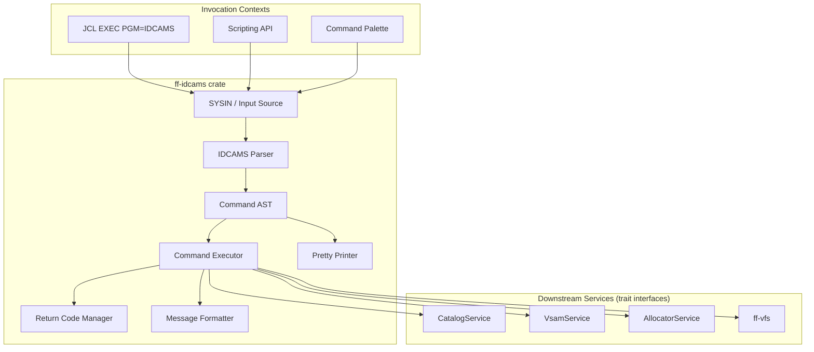
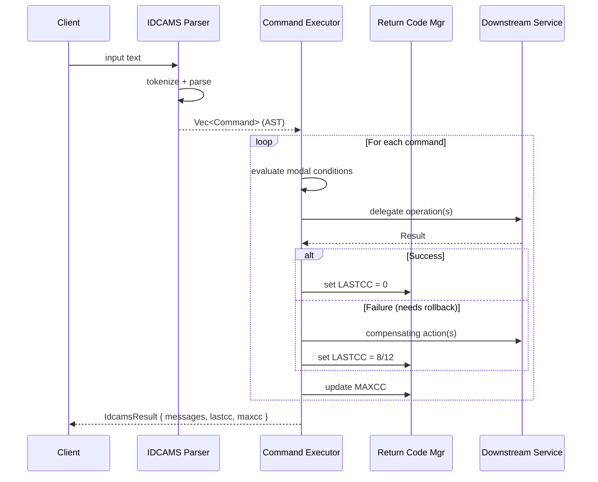

# Design Document: IDCAMS Emulator (`ff-idcams`)

## Overview

The `ff-idcams` crate is a thin command interpreter and orchestration layer for IBM IDCAMS (Access Method Services) within the FileForgeWorkbench ecosystem. It owns **only** command parsing and execution orchestration — all actual catalog, VSAM, allocation, and filesystem operations are delegated to downstream services through trait interfaces.

### Design Goals

1. **Fidelity**: Parse IDCAMS control statements with z/OS-compatible syntax rules
2. **Thin orchestrator**: Zero storage/VSAM logic — delegate everything through traits
3. **Atomic execution**: Multi-service commands use compensation-based rollback
4. **Thread safety**: Stateless parser, no global mutable state, `Send + Sync` API
5. **Testability**: All dependencies injected via traits; fully mockable
6. **Round-trip correctness**: AST ↔ pretty-printed text round-trips without loss

### Key Design Decisions

| Decision | Rationale |
|----------|-----------|
| Hand-written recursive-descent parser | IDCAMS syntax is context-sensitive (e.g., parameters valid only for certain verbs); parser combinators add complexity without benefit |
| AST with error nodes | Enables partial parsing and useful diagnostics on malformed input |
| Compensation pattern for rollback | Downstream services are independent; no distributed transaction protocol available |
| `IdcamsServices` struct for DI | Single injection point for all downstream traits; easy to mock |
| Stateless parser, per-invocation executor state | Enables safe concurrent use from multiple threads |

---

## Architecture

### High-Level Architecture



### Execution Flow



---

## Components and Interfaces

### Module Structure

```
ff-idcams/
├── src/
│   ├── lib.rs              # Public API surface
│   ├── parser/
│   │   ├── mod.rs          # Parser entry point
│   │   ├── lexer.rs        # Tokenizer (keywords, parens, strings, operators)
│   │   ├── token.rs        # Token types
│   │   ├── ast.rs          # AST node definitions
│   │   └── error.rs        # Parse error types with message codes
│   ├── executor/
│   │   ├── mod.rs          # Executor entry point + command dispatch
│   │   ├── context.rs      # Per-invocation execution context (LASTCC, MAXCC, output)
│   │   ├── define.rs       # DEFINE CLUSTER/AIX/PATH/GDG handlers
│   │   ├── delete.rs       # DELETE handler
│   │   ├── alter.rs        # ALTER handler
│   │   ├── listcat.rs      # LISTCAT handler
│   │   ├── print.rs        # PRINT handler
│   │   ├── repro.rs        # REPRO handler
│   │   ├── verify.rs       # VERIFY handler
│   │   ├── export.rs       # EXPORT handler
│   │   ├── import.rs       # IMPORT handler
│   │   ├── bldindex.rs     # BLDINDEX handler
│   │   ├── modal.rs        # IF/THEN/ELSE evaluation
│   │   ├── set.rs          # SET LASTCC/MAXCC handler
│   │   └── rollback.rs     # Compensation pattern implementation
│   ├── pretty_printer/
│   │   ├── mod.rs          # Pretty printer entry point
│   │   ├── compact.rs      # Compact (single-line) mode
│   │   └── verbose.rs      # Verbose (multi-line) mode
│   ├── messages.rs         # IDCnnnnX message catalogue
│   ├── services.rs         # IdcamsServices struct + trait re-exports
│   └── sysin.rs            # SYSIN input reading (DD, string, file)
├── tests/
│   ├── parser_tests.rs     # Parser unit/integration tests
│   ├── executor_tests.rs   # Executor tests with mocks
│   ├── roundtrip_tests.rs  # Property: parse → print → parse
│   └── property_tests.rs   # All property-based tests
└── Cargo.toml
```

### Trait Interfaces (Downstream Dependencies)

```rust
/// Trait for catalog operations — implemented by ff-dataset-catalog.
/// ff-idcams depends on this trait only, never on the concrete implementation.
pub trait CatalogService: Send + Sync {
    fn create_dataset(&self, params: CreateDatasetParams) -> Result<(), CatalogError>;
    fn delete_dataset(&self, dsn: &DatasetName) -> Result<(), CatalogError>;
    fn update_dataset(&self, dsn: &DatasetName, attrs: UpdateAttrs) -> Result<(), CatalogError>;
    fn rename_dataset(&self, old: &DatasetName, new: &DatasetName) -> Result<(), CatalogError>;
    fn list_datasets(&self, filter: &ListFilter) -> Result<Vec<CatalogEntry>, CatalogError>;
    fn get_dataset_attributes(&self, dsn: &DatasetName) -> Result<DatasetAttributes, CatalogError>;
    fn create_gdg_base(&self, params: CreateGdgParams) -> Result<(), CatalogError>;
    fn delete_gdg_base(&self, dsn: &DatasetName, force: bool) -> Result<(), CatalogError>;
    fn export_dataset(&self, params: ExportParams) -> Result<ExportResult, CatalogError>;
    fn import_dataset(&self, params: ImportParams) -> Result<ImportResult, CatalogError>;
}

/// Trait for VSAM operations — implemented by ff-vsam-services.
pub trait VsamService: Send + Sync {
    fn initialize_dataset(&self, dsn: &DatasetName, vtype: VsamType, params: VsamInitParams) -> Result<(), VsamError>;
    fn destroy_dataset(&self, dsn: &DatasetName) -> Result<(), VsamError>;
    fn define_aix(&self, params: DefineAixParams) -> Result<(), VsamError>;
    fn define_path(&self, params: DefinePathParams) -> Result<(), VsamError>;
    fn delete_path(&self, path_name: &DatasetName) -> Result<(), VsamError>;
    fn verify_integrity(&self, dsn: &DatasetName) -> Result<VerifyResult, VsamError>;
    fn build_index(&self, base_dsn: &DatasetName, aix_dsn: &DatasetName) -> Result<BuildIndexResult, VsamError>;
    fn open(&self, dsn: &DatasetName, mode: OpenMode) -> Result<DatasetHandle, VsamError>;
    fn start_browse(&self, handle: &DatasetHandle, position: BrowsePosition) -> Result<BrowseCursor, VsamError>;
    fn next_record(&self, cursor: &mut BrowseCursor) -> Result<Option<Record>, VsamError>;
    fn put(&self, handle: &DatasetHandle, record: &Record) -> Result<(), VsamError>;
}

/// Trait for DD/dataset allocation resolution — implemented by ff-dataset-allocator.
pub trait AllocatorService: Send + Sync {
    fn resolve_dd(&self, ddname: &str) -> Result<DatasetName, AllocatorError>;
}
```

### Public API

```rust
/// The primary public interface to ff-idcams.
pub fn execute_idcams(input: &str, services: &IdcamsServices) -> IdcamsResult {
    // 1. Parse input into AST
    // 2. Execute commands sequentially
    // 3. Return structured result
}

/// Dependency injection container for all downstream services.
pub struct IdcamsServices {
    pub catalog: Arc<dyn CatalogService>,
    pub vsam: Arc<dyn VsamService>,
    pub allocator: Arc<dyn AllocatorService>,
}

/// Structured result of an IDCAMS invocation.
pub struct IdcamsResult {
    pub lastcc: ConditionCode,
    pub maxcc: ConditionCode,
    pub messages: Vec<IdcamsMessage>,
}

/// A single output message in IDCnnnnX format.
pub struct IdcamsMessage {
    pub code: MessageCode,
    pub severity: Severity,
    pub text: String,
    pub line_number: u32,
}

/// Condition code values matching z/OS semantics.
#[repr(u8)]
pub enum ConditionCode {
    Success = 0,
    Warning = 4,
    Error = 8,
    Severe = 12,
    Catastrophic = 16,
}
```

### Parser Design (Low-Level)

The parser uses a two-phase approach:

**Phase 1: Lexing** — Transforms input text into a flat token stream.

```rust
pub enum Token {
    Verb(Verb),           // DEFINE, DELETE, ALTER, etc.
    Keyword(String),      // Parameter keywords: NAME, KEYS, RECORDSIZE, etc.
    OpenParen,            // (
    CloseParen,           // )
    Number(i64),          // Numeric literals
    StringLit(String),    // Dataset names, values
    Semicolon,            // Command separator
    Hyphen,              // Continuation (end-of-line only)
    Comment(String),     // /* ... */ or // ...
    Wildcard,            // * in ENTRIES filter
    CompareOp(CmpOp),   // EQ, NE, GT, LT, GE, LE
    LogicalOp(LogOp),   // AND, OR
    Eof,
}

pub enum Verb {
    Define, Delete, Alter, Listcat, Print, Repro,
    Verify, Export, Import, Bldindex, Set, If,
}
```

**Phase 2: Parsing** — Recursive-descent parser that produces a typed AST.

```rust
pub enum Command {
    DefineCluster(DefineClusterCommand),
    DefineAix(DefineAixCommand),
    DefinePath(DefinePathCommand),
    DefineGdg(DefineGdgCommand),
    Delete(DeleteCommand),
    Alter(AlterCommand),
    Listcat(ListcatCommand),
    Print(PrintCommand),
    Repro(ReproCommand),
    Verify(VerifyCommand),
    Export(ExportCommand),
    Import(ImportCommand),
    Bldindex(BldindexCommand),
    Set(SetCommand),
    If(IfCommand),
    Error(ParseErrorNode),  // Error recovery node
}
```

### Executor Design (Low-Level)

The executor maintains per-invocation state and dispatches to command-specific handlers:

```rust
/// Per-invocation execution state. Not shared across invocations.
pub(crate) struct ExecutionState {
    lastcc: ConditionCode,
    maxcc: ConditionCode,
    messages: Vec<IdcamsMessage>,
    line_counter: u32,
}

impl ExecutionState {
    pub fn set_lastcc(&mut self, cc: ConditionCode) {
        self.lastcc = cc;
        if cc as u8 > self.maxcc as u8 {
            self.maxcc = cc;
        }
    }
}
```

### Compensation/Rollback Pattern (Low-Level)

```rust
/// A compensating action that can undo a previously successful step.
pub(crate) enum CompensatingAction {
    DeleteDataset(DatasetName),
    // ... other compensations as needed
}

/// Executes a multi-step command with automatic rollback on failure.
pub(crate) fn execute_with_rollback<F>(
    steps: &[Step],
    services: &IdcamsServices,
    state: &mut ExecutionState,
) -> Result<(), IdcamsError>
where
    F: FnOnce() -> Result<CompensatingAction, IdcamsError>,
{
    let mut compensations: Vec<CompensatingAction> = Vec::new();
    
    for step in steps {
        match step.execute(services) {
            Ok(compensation) => compensations.push(compensation),
            Err(e) => {
                // Roll back in reverse order
                for comp in compensations.into_iter().rev() {
                    if let Err(rollback_err) = comp.execute(services) {
                        state.emit_message(MessageCode::IDC0701S, &rollback_err.to_string());
                        state.set_lastcc(ConditionCode::Catastrophic);
                        return Err(e);
                    }
                }
                return Err(e);
            }
        }
    }
    Ok(())
}
```

### Pretty Printer Design (Low-Level)

```rust
pub enum PrintMode {
    Compact,  // Minimal whitespace, single line where possible
    Verbose,  // One parameter per line, indented
}

pub fn pretty_print(command: &Command, mode: PrintMode) -> String {
    match mode {
        PrintMode::Compact => compact::format(command),
        PrintMode::Verbose => verbose::format(command),
    }
}
```

The verbose printer uses a line-width limit of 72 characters. When a line would exceed this, it inserts a continuation hyphen and wraps to the next line with standard indentation.

---

## Data Models

### AST Node Types

```rust
/// Dataset name: 1-44 characters, dot-separated qualifiers.
#[derive(Debug, Clone, PartialEq, Eq, Hash)]
pub struct DatasetName(String);

/// Space allocation specification.
#[derive(Debug, Clone, PartialEq, Eq)]
pub enum SpaceUnit {
    Cylinders { primary: u32, secondary: u32 },
    Tracks { primary: u32, secondary: u32 },
    Records { primary: u32, secondary: u32 },
    Kilobytes { primary: u32, secondary: u32 },
}

/// VSAM organization type.
#[derive(Debug, Clone, Copy, PartialEq, Eq)]
pub enum VsamOrganization {
    Indexed,     // KSDS
    NonIndexed,  // ESDS
    Numbered,    // RRDS
    Linear,      // LDS
}

/// DEFINE CLUSTER command representation.
#[derive(Debug, Clone, PartialEq)]
pub struct DefineClusterCommand {
    pub name: DatasetName,
    pub organization: VsamOrganization,
    pub volumes: Vec<String>,
    pub space: Option<SpaceUnit>,
    pub recordsize: Option<(u32, u32)>,      // (average, maximum)
    pub keys: Option<(u16, u32)>,            // (length, offset) — length 1-255
    pub freespace: Option<(u8, u8)>,         // (ci_percent, ca_percent) 0-100
    pub shareoptions: Option<(u8, u8)>,      // (crossregion, crosssystem) 1-4
    pub speed_recovery: Option<SpeedRecovery>,
    pub reuse: bool,
    pub bufferspace: Option<u32>,
    pub data_component: Option<ComponentDef>,
    pub index_component: Option<ComponentDef>,
}

/// Component sub-definition (DATA or INDEX within DEFINE CLUSTER).
#[derive(Debug, Clone, PartialEq)]
pub struct ComponentDef {
    pub name: Option<DatasetName>,
    pub volumes: Vec<String>,
    pub space: Option<SpaceUnit>,
    pub recordsize: Option<(u32, u32)>,
    pub keys: Option<(u16, u32)>,
    pub controlintervalsize: Option<u32>,
    pub freespace: Option<(u8, u8)>,
}

/// DEFINE ALTERNATEINDEX command representation.
#[derive(Debug, Clone, PartialEq)]
pub struct DefineAixCommand {
    pub name: DatasetName,
    pub relate: DatasetName,
    pub keys: (u16, u32),                    // (length, offset)
    pub uniquekey: bool,                     // true = UNIQUEKEY (default), false = NONUNIQUEKEY
    pub upgrade: bool,                       // true = UPGRADE (default), false = NOUPGRADE
    pub recordsize: Option<(u32, u32)>,
}

/// DEFINE PATH command representation.
#[derive(Debug, Clone, PartialEq)]
pub struct DefinePathCommand {
    pub name: DatasetName,
    pub pathentry: DatasetName,
    pub update: bool,                        // true = UPDATE (default), false = NOUPDATE
}

/// DEFINE GDG command representation.
#[derive(Debug, Clone, PartialEq)]
pub struct DefineGdgCommand {
    pub name: DatasetName,
    pub limit: u8,                           // 1-255
    pub scratch: bool,                       // true = SCRATCH (default), false = NOSCRATCH
    pub empty: bool,                         // true = EMPTY, false = NOEMPTY (default)
    pub fifo: bool,                          // true = FIFO, false = LIFO (default)
}

/// DELETE command representation.
#[derive(Debug, Clone, PartialEq)]
pub struct DeleteCommand {
    pub entries: Vec<DatasetName>,
    pub entry_type: DeleteEntryType,
    pub purge: bool,
    pub force: bool,
    pub erase: bool,
    pub scratch: Option<bool>,
}

#[derive(Debug, Clone, Copy, PartialEq, Eq)]
pub enum DeleteEntryType {
    Cluster,
    AlternateIndex,
    Path,
    Gdg,
    NonVsam,
    UserCatalog,
}

/// ALTER command representation.
#[derive(Debug, Clone, PartialEq)]
pub struct AlterCommand {
    pub entry_name: DatasetName,
    pub freespace: Option<(u8, u8)>,
    pub shareoptions: Option<(u8, u8)>,
    pub bufferspace: Option<u32>,
    pub recordsize: Option<(u32, u32)>,
    pub keys: Option<(u16, u32)>,
    pub add_volumes: Vec<String>,
    pub remove_volumes: Vec<String>,
    pub newname: Option<DatasetName>,
    pub nullify: Vec<String>,
}

/// LISTCAT command representation.
#[derive(Debug, Clone, PartialEq)]
pub struct ListcatCommand {
    pub filter: ListcatFilter,
    pub display_level: DisplayLevel,
    pub catalog: Option<DatasetName>,
    pub entry_type_filter: EntryTypeFilter,
}

#[derive(Debug, Clone, PartialEq)]
pub enum ListcatFilter {
    All,
    Entries(Vec<String>),        // May contain wildcards
    Level(String),               // High-level qualifier
}

#[derive(Debug, Clone, Copy, PartialEq, Eq)]
pub enum DisplayLevel {
    Name,
    History,
    Volume,
    All,
}

/// PRINT command representation.
#[derive(Debug, Clone, PartialEq)]
pub struct PrintCommand {
    pub input: InputSpec,
    pub format: PrintFormat,
    pub key_range: Option<(String, Option<String>)>,   // FROMKEY, TOKEY
    pub address_range: Option<(u64, Option<u64>)>,     // FROMADDRESS, TOADDRESS
    pub record_range: Option<(u64, Option<u64>)>,      // FROMRECORD, TORECORD
    pub count: Option<u64>,
    pub skip: Option<u64>,
}

#[derive(Debug, Clone, PartialEq)]
pub enum InputSpec {
    InFile(String),
    InDataset(DatasetName),
}

#[derive(Debug, Clone, Copy, PartialEq, Eq)]
pub enum PrintFormat {
    Character,
    Hex,
    Dump,
}

/// REPRO command representation.
#[derive(Debug, Clone, PartialEq)]
pub struct ReproCommand {
    pub input: InputSpec,
    pub output: OutputSpec,
    pub key_range: Option<(String, Option<String>)>,
    pub address_range: Option<(u64, Option<u64>)>,
    pub count: Option<u64>,
    pub skip: Option<u64>,
    pub replace: bool,
}

#[derive(Debug, Clone, PartialEq)]
pub enum OutputSpec {
    OutFile(String),
    OutDataset(DatasetName),
}

/// VERIFY command representation.
#[derive(Debug, Clone, PartialEq)]
pub struct VerifyCommand {
    pub dataset: InputSpec,  // FILE(ddname) or DATASET(dsn)
}

/// EXPORT command representation.
#[derive(Debug, Clone, PartialEq)]
pub struct ExportCommand {
    pub entry_name: DatasetName,
    pub output: OutputSpec,
    pub temporary: bool,            // false = PERMANENT (default)
    pub inhibit_source: bool,       // false = NOINHIBITSOURCE (default)
}

/// IMPORT command representation.
#[derive(Debug, Clone, PartialEq)]
pub struct ImportCommand {
    pub input: InputSpec,
    pub out_dataset: DatasetName,
    pub catalog: Option<DatasetName>,
    pub objects: Vec<ObjectMapping>,
}

#[derive(Debug, Clone, PartialEq)]
pub struct ObjectMapping {
    pub old_name: DatasetName,
    pub new_name: Option<DatasetName>,
    pub volumes: Vec<String>,
}

/// BLDINDEX command representation.
#[derive(Debug, Clone, PartialEq)]
pub struct BldindexCommand {
    pub in_dataset: DatasetName,
    pub out_dataset: DatasetName,
    pub catalog: Option<DatasetName>,
}

/// SET command representation.
#[derive(Debug, Clone, PartialEq)]
pub struct SetCommand {
    pub target: SetTarget,
    pub value: u8,  // 0-16
}

#[derive(Debug, Clone, Copy, PartialEq, Eq)]
pub enum SetTarget {
    LastCC,
    MaxCC,
}

/// IF/THEN/ELSE command representation.
#[derive(Debug, Clone, PartialEq)]
pub struct IfCommand {
    pub condition: Condition,
    pub then_commands: Vec<Command>,
    pub else_commands: Option<Vec<Command>>,
}

/// Condition expression for IF statements.
#[derive(Debug, Clone, PartialEq)]
pub enum Condition {
    Compare {
        register: ConditionRegister,
        op: CompareOp,
        value: u8,
    },
    And(Box<Condition>, Box<Condition>),
    Or(Box<Condition>, Box<Condition>),
}

#[derive(Debug, Clone, Copy, PartialEq, Eq)]
pub enum ConditionRegister { LastCC, MaxCC }

#[derive(Debug, Clone, Copy, PartialEq, Eq)]
pub enum CompareOp { Eq, Ne, Gt, Lt, Ge, Le }
```

### Message Catalogue

```rust
/// All IDC message codes used by ff-idcams.
pub enum MessageCode {
    // Success messages
    IDC0001I,  // Dataset/object created successfully
    IDC0002I,  // Dataset/object deleted / final MAXCC summary
    IDC0003I,  // Dataset altered successfully
    IDC0004I,  // Export completed
    IDC0005I,  // Import completed
    IDC0006I,  // BLDINDEX completed

    // Warning messages
    IDC0565W,  // LISTCAT no entries found
    IDC0580W,  // REPRO duplicate key skipped
    IDC0622W,  // BLDINDEX duplicate keys found
    IDC0640I,  // Empty input (no commands)

    // Error messages - parser
    IDC0001E,  // Invalid/unrecognized command verb
    IDC0002E,  // Malformed parameter syntax
    IDC0630E,  // Invalid IF condition operand

    // Error messages - execution
    IDC0503E,  // KEYS required for INDEXED
    IDC0510E,  // RELATE base cluster not found
    IDC0511E,  // RELATE target not a VSAM cluster
    IDC0512E,  // PATHENTRY AIX not found
    IDC0514E,  // Duplicate dataset name
    IDC0520E,  // LIMIT required for GDG
    IDC0550E,  // DELETE entry not found
    IDC0551E,  // DELETE type mismatch
    IDC0560E,  // ALTER entry not found
    IDC0561E,  // ALTER attribute not modifiable
    IDC0570E,  // PRINT dataset not found
    IDC0571E,  // PRINT key selection requires KSDS
    IDC0581E,  // REPRO source not found
    IDC0582E,  // REPRO target not found
    IDC0590I,  // VERIFY dataset consistent
    IDC0591E,  // VERIFY dataset access failure
    IDC0592E,  // VERIFY non-VSAM dataset
    IDC0600E,  // EXPORT source not found
    IDC0601E,  // EXPORT output write failure
    IDC0610E,  // IMPORT invalid source
    IDC0611E,  // IMPORT target already exists
    IDC0620E,  // BLDINDEX base cluster not found
    IDC0621E,  // BLDINDEX output not a valid AIX

    // Severe messages
    IDC0700W,  // Rollback partial failure (inconsistency warning)
    IDC0701S,  // Rollback failed — manual intervention required
}
```

---

