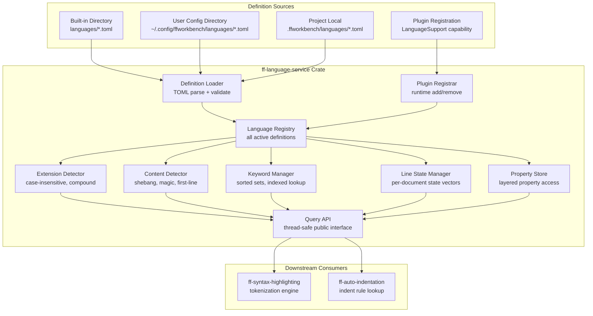

# Design Document: Language Service (`ff-language-service`)

## 1. Overview

The `ff-language-service` crate is the **language detection and definition management layer** for the FileForgeWorkbench workspace. It loads language definitions from TOML files, detects file languages by extension and content inspection, manages per-line lexer state for incremental re-highlighting, and provides a plugin-extensible registration model for adding new language definitions at runtime.

### Purpose

- Load and validate language definitions from TOML files in a configurable directory hierarchy
- Detect file language by extension matching (case-insensitive, compound-extension aware)
- Detect file language by content inspection (shebang, magic bytes, first-line patterns)
- Maintain per-line lexer state vectors for incremental re-highlighting
- Manage keyword sets (up to 9) with efficient lookup for each language
- Expose comment, string, and embedded language metadata for the highlighting engine
- Provide per-language property configuration with layered override support
- Support runtime language registration and deregistration via the plugin system
- Expose a thread-safe query API for enumerating and resolving languages

### Position in Architecture

```
Wave 7 — Language and Highlighting

┌──────────────────────────────────────────────────────────────┐
│  Downstream Consumers:                                        │
│    ff-syntax-highlighting (Wave 7 peer) — tokenization        │
│    ff-auto-indentation (Wave 7 peer) — indent patterns        │
├──────────────────────────────────────────────────────────────┤
│          THIS CRATE: ff-language-service ← Wave 7             │
│   Language definitions, detection, per-line state, registry   │
├──────────────────────────────────────────────────────────────┤
│  Upstream:                                                    │
│    ff-logging (Wave 0) — structured diagnostics               │
│    ff-config (Wave 2) — language settings, hot-reload         │
│    ff-plugin (Wave 2) — LanguageSupport capability            │
│    ff-command (Wave 2) — language override command             │
│    ff-document-model (Wave 4) — line count, content access    │
│    ff-edit-operations (Wave 4) — edit change notifications    │
├──────────────────────────────────────────────────────────────┤
│              Foundation Layer: ff-logging                      │
└──────────────────────────────────────────────────────────────┘
```

### Design Constraints (Cross-Cutting)

- **FFW-ARCH-001 (Req 1)**: Language definition files accessed through the configuration system's directory resolution — not via direct `std::fs` in production (test code may use direct paths for constructability)
- **GUI Independence (Req 2)**: Zero GUI dependencies — no egui, no windowing crate imports; all rendering is downstream
- **Plugin Architecture (Req 3)**: Plugins register language definitions via the `LanguageSupport` capability through `ff-plugin`'s `Capability_Registry`
- **Command-Driven (Req 4)**: A `language.override` command allows manual language assignment per document
- **Configuration Namespace (Req 5)**: Language settings live under `[languages]` TOML namespace; per-language properties under `languages.{language_id}.{key}`
- **Multi-Crate Workspace (Req 7)**: Crate at `crates/ff-language-service`
- **Error Message Standards (Req 8)**: All errors follow `[lang-service] operation: description` format

---

## 2. Architecture

### High-Level Architecture Diagram



### Component Responsibilities

| Component | Responsibility |
|-----------|---------------|
| **Definition Loader** | Scans configured directories, parses TOML, validates schema, emits warnings for invalid files |
| **Language Registry** | Central store of all active `LanguageDefinition` instances, keyed by `LanguageId` |
| **Extension Detector** | Maps file extensions to language IDs; handles case-insensitivity and compound extensions |
| **Content Detector** | Inspects first 8192 bytes for magic bytes, shebang patterns, and first-line regex matches |
| **Keyword Manager** | Owns sorted keyword sets per language with first-character indexing for O(1) start lookup |
| **Line State Manager** | Maintains per-document `Vec<i32>` of end-of-line lexer states; handles insert/delete/invalidate |
| **Property Store** | Resolves per-language properties with layered override (definition → user config → project config) |
| **Query API** | Thread-safe `&self` interface for all read operations; interior synchronization via `RwLock` |
| **Plugin Registrar** | Accepts/validates runtime registrations, rejects duplicates, handles deregistration on plugin unload |

---

## 3. Module Structure

```
crates/ff-language-service/
├── Cargo.toml
├── src/
│   ├── lib.rs                    # Public API re-exports, crate docs
│   ├── service.rs                # LanguageService struct (top-level facade)
│   ├── definition.rs             # LanguageDefinition, LanguageId, schema types
│   ├── loader.rs                 # TOML loading, directory scanning, validation
│   ├── registry.rs               # Language registry: storage, lookup, add/remove
│   ├── detection/
│   │   ├── mod.rs                # Detection pipeline re-exports
│   │   ├── extension.rs          # Extension-based detection logic
│   │   └── content.rs            # Content-based detection (shebang, magic, first-line)
│   ├── keywords.rs               # KeywordSet, sorted storage, indexed lookup
│   ├── state.rs                  # LineStateVector: per-document lexer state management
│   ├── properties.rs             # Language property access with layered overrides
│   ├── embedded.rs               # Embedded language descriptors and resolution
│   ├── plugin.rs                 # Plugin registration/deregistration logic
│   ├── command.rs                # Language override command registration
│   └── error.rs                  # LanguageServiceError enum
└── tests/
    ├── loader_tests.rs           # TOML loading and validation tests
    ├── extension_tests.rs        # Extension detection property tests
    ├── content_tests.rs          # Content-based detection tests
    ├── keyword_tests.rs          # Keyword set lookup property tests
    ├── state_tests.rs            # Line state vector property tests
    ├── properties_tests.rs       # Property resolution tests
    ├── registry_tests.rs         # Registry add/remove/query tests
    ├── plugin_tests.rs           # Plugin registration tests
    └── integration.rs            # End-to-end detection pipeline tests
```

---

## 4. Data Models

### LanguageId

```rust
/// A unique identifier for a registered language.
/// Lowercase ASCII string, e.g., "rust", "cobol", "jcl".
/// Addresses: Requirement 1, criterion 1.2
#[derive(Debug, Clone, PartialEq, Eq, Hash, PartialOrd, Ord)]
pub struct LanguageId(String);

impl LanguageId {
    /// Create a new LanguageId. The input is lowercased and validated
    /// to contain only ASCII alphanumeric characters, hyphens, and underscores.
    pub fn new(id: impl Into<String>) -> Result<Self, LanguageServiceError>;

    /// The "plain text" sentinel language ID used when no language is detected.
    pub fn plain_text() -> Self;

    /// Returns the identifier as a string slice.
    pub fn as_str(&self) -> &str;

    /// Returns true if this is the plain-text sentinel.
    pub fn is_plain_text(&self) -> bool;
}

impl std::fmt::Display for LanguageId {
    fn fmt(&self, f: &mut std::fmt::Formatter<'_>) -> std::fmt::Result {
        f.write_str(&self.0)
    }
}
```

### LanguageDefinition

```rust
/// A complete language definition loaded from TOML or registered by a plugin.
/// Addresses: Requirements 1, 2, 3, 5, 6, 7, 8
#[derive(Debug, Clone)]
pub struct LanguageDefinition {
    /// Unique language identifier (lowercase ASCII).
    language_id: LanguageId,
    /// Human-readable display name (e.g., "Rust", "COBOL").
    name: String,
    /// File extensions this language matches (without leading dot).
    extensions: Vec<String>,
    /// Priority for extension conflict resolution (higher wins, default 0).
    priority: i32,
    /// Up to 9 keyword sets (indices 0–8).
    keyword_sets: Vec<KeywordSet>,
    /// Whether keyword matching is case-sensitive for this language.
    case_sensitive_keywords: bool,
    /// Mapping from keyword set number to semantic name.
    keyword_set_names: Vec<Option<String>>,
    /// Single-line comment markers (one or more styles).
    line_comments: Vec<String>,
    /// Block comment delimiters (start, end) pairs.
    block_comments: Vec<(String, String)>,
    /// String delimiter characters/sequences.
    string_delimiters: Vec<String>,
    /// Character literal delimiter (e.g., single quote).
    character_delimiter: Option<String>,
    /// Escape character within strings (e.g., backslash).
    escape_character: Option<char>,
    /// Heredoc start patterns (regex strings).
    heredoc_patterns: Vec<String>,
    /// Shebang interpreter patterns for content-based detection.
    shebang_patterns: Vec<String>,
    /// Magic bytes at file start for content-based detection.
    magic_bytes: Option<Vec<u8>>,
    /// First-line regex pattern for content-based detection.
    first_line_pattern: Option<String>,
    /// Embedded language descriptors.
    embedded_languages: Vec<EmbeddedLanguageDescriptor>,
    /// Per-language properties (key-value configuration).
    properties: HashMap<String, String>,
    /// Fold keyword definitions (optional).
    fold_keywords: Option<FoldKeywords>,
    /// Source of this definition (file path or plugin name).
    source: DefinitionSource,
}
```

### DefinitionSource

```rust
/// Tracks where a language definition was loaded from.
/// Addresses: Requirement 1, criteria 1.5–1.6; Requirement 9, criteria 9.3–9.4
#[derive(Debug, Clone, PartialEq, Eq)]
pub enum DefinitionSource {
    /// Loaded from a TOML file at the given path.
    File { path: String, layer: ConfigLayer },
    /// Registered at runtime by a plugin.
    Plugin { plugin_name: String },
}

/// Configuration layer for file-loaded definitions.
/// Addresses: Requirement 1, criterion 1.6
#[derive(Debug, Clone, Copy, PartialEq, Eq, PartialOrd, Ord)]
pub enum ConfigLayer {
    /// Built-in defaults directory.
    BuiltIn,
    /// User configuration directory.
    User,
    /// Project-local directory.
    Project,
}
```

### KeywordSet

```rust
/// A sorted list of keywords for a single keyword category (0–8).
/// Uses a first-character index for O(1) lookup of the starting position
/// for each initial character.
/// Addresses: Requirement 5, criteria 5.1–5.3
#[derive(Debug, Clone)]
pub struct KeywordSet {
    /// The keyword set index (0–8).
    set_number: u8,
    /// Keywords sorted alphabetically (lowercased if language is case-insensitive).
    words: Vec<String>,
    /// Index mapping first character (as byte) to starting position in `words`.
    /// Uses a 128-element array for ASCII fast-path.
    char_index: [u32; 128],
    /// Optional semantic name for this set (e.g., "keyword", "type", "builtin").
    semantic_name: Option<String>,
}
```

### EmbeddedLanguageDescriptor

```rust
/// Describes an embedded language region within a host document.
/// Addresses: Requirement 7, criteria 7.1–7.6
#[derive(Debug, Clone)]
pub struct EmbeddedLanguageDescriptor {
    /// The language_id of the embedded language.
    pub language_id: LanguageId,
    /// Pattern matching the start of the embedded region.
    pub start_pattern: String,
    /// Pattern matching the end of the embedded region.
    pub end_pattern: String,
}
```

### FoldKeywords

```rust
/// Fold keyword definitions for code folding support.
/// Addresses: Requirement 1, criterion 1.3 (optional field)
#[derive(Debug, Clone)]
pub struct FoldKeywords {
    /// Keywords that open a fold region.
    pub open: Vec<String>,
    /// Keywords that close a fold region.
    pub close: Vec<String>,
}
```

### LexerState

```rust
/// The lexer's internal state at the end of a document line.
/// Addresses: Requirement 4, criteria 4.1–4.8
pub type LexerState = i32;

/// Sentinel value indicating an invalid/uninitialized line state.
pub const LEXER_STATE_INVALID: LexerState = -1;

/// Initial state for the beginning of a document (line 0 start state).
pub const LEXER_STATE_INITIAL: LexerState = 0;
```

### LineStateVector

```rust
/// Per-document vector of end-of-line lexer states.
/// Supports documents with millions of lines using a compact `Vec<i32>`.
/// Addresses: Requirement 4, criteria 4.1–4.8
#[derive(Debug, Clone)]
pub struct LineStateVector {
    /// End-of-line state for each line. Index i holds the state at the end of line i.
    /// LEXER_STATE_INVALID (-1) indicates the state needs recomputation.
    states: Vec<LexerState>,
}

impl LineStateVector {
    /// Create a new state vector for a document with `line_count` lines.
    /// All states are initialized to LEXER_STATE_INVALID.
    pub fn new(line_count: usize) -> Self;

    /// Get the starting state for highlighting line `line_index`.
    /// Returns LEXER_STATE_INITIAL for line 0; otherwise the state of line_index - 1.
    /// Returns None if the previous line's state is invalid.
    /// Addresses: Requirement 4, criterion 4.4
    pub fn start_state_for(&self, line_index: usize) -> Option<LexerState>;

    /// Store the end-of-line state after highlighting a line.
    /// Returns true if the state changed (requiring further propagation).
    /// Addresses: Requirement 4, criteria 4.2, 4.5
    pub fn set_end_state(&mut self, line_index: usize, state: LexerState) -> bool;

    /// Invalidate the state at `line_index`, marking it for re-highlighting.
    /// Addresses: Requirement 4, criterion 4.3
    pub fn invalidate(&mut self, line_index: usize);

    /// Insert `count` invalid-state entries at `line_index`.
    /// Addresses: Requirement 4, criterion 4.6
    pub fn insert_lines(&mut self, line_index: usize, count: usize);

    /// Remove `count` entries starting at `line_index`, then invalidate
    /// the line at `line_index` (the new occupant).
    /// Addresses: Requirement 4, criterion 4.7
    pub fn delete_lines(&mut self, line_index: usize, count: usize);

    /// Total number of lines tracked.
    pub fn len(&self) -> usize;

    /// Whether the vector is empty (no lines).
    pub fn is_empty(&self) -> bool;
}
```

### LanguageSummary

```rust
/// Lightweight summary of a registered language for listing/display purposes.
/// Addresses: Requirement 10, criterion 10.1
#[derive(Debug, Clone, PartialEq, Eq)]
pub struct LanguageSummary {
    /// Unique language identifier.
    pub language_id: LanguageId,
    /// Human-readable display name.
    pub display_name: String,
    /// Associated file extensions.
    pub extensions: Vec<String>,
}
```

### DetectionResult

```rust
/// Result of the full language detection pipeline.
/// Addresses: Requirements 2, 3
#[derive(Debug, Clone, PartialEq, Eq)]
pub struct DetectionResult {
    /// The resolved language identifier.
    pub language_id: LanguageId,
    /// How the detection was made.
    pub method: DetectionMethod,
}

/// How a language was detected.
/// Addresses: Requirement 2 (extension), Requirement 3 (content)
#[derive(Debug, Clone, Copy, PartialEq, Eq)]
pub enum DetectionMethod {
    /// Matched by file extension.
    Extension,
    /// Matched by magic bytes at file start.
    MagicBytes,
    /// Matched by shebang line.
    Shebang,
    /// Matched by first-line pattern.
    FirstLinePattern,
    /// Manual override by user.
    ManualOverride,
    /// No match — plain text fallback.
    Fallback,
}
```

---

## 5. Public API Surface

### LanguageService (Top-Level Facade)

```rust
/// The central language service managing all language definitions,
/// detection logic, per-line state, and query operations.
///
/// Thread-safe: all query methods take `&self` using interior `RwLock`.
/// Addresses: Requirement 10, criterion 10.6
pub struct LanguageService {
    /// All registered language definitions, keyed by LanguageId.
    registry: RwLock<LanguageRegistry>,
    /// Extension-to-language mapping (precomputed on registry change).
    extension_index: RwLock<ExtensionIndex>,
    /// Per-document line state vectors, keyed by document ID.
    document_states: RwLock<HashMap<DocumentId, LineStateVector>>,
}

impl LanguageService {
    /// Create a new LanguageService by loading definitions from the given directories.
    /// Directories are processed in order: built-in → user → project.
    /// Later directories override earlier definitions for the same language_id.
    /// Addresses: Requirement 1, criteria 1.1, 1.6
    pub fn new(definition_dirs: &[DefinitionDirectory]) -> Self;

    /// Create a LanguageService from a pre-built list of definitions (for testing).
    /// Addresses: Requirement 10, criterion 10.7
    pub fn from_definitions(definitions: Vec<LanguageDefinition>) -> Self;
}
```

### Language Detection API

```rust
impl LanguageService {
    /// Perform the full detection pipeline: extension → content-based → fallback.
    /// Addresses: Requirement 10, criterion 10.3; Requirements 2, 3
    pub fn detect_language(
        &self,
        file_path: Option<&str>,
        first_line: Option<&str>,
        first_bytes: Option<&[u8]>,
    ) -> DetectionResult;

    /// Perform extension-only lookup without content-based fallback.
    /// Addresses: Requirement 10, criterion 10.5; Requirement 2
    pub fn language_for_extension(&self, extension: &str) -> Option<LanguageId>;

    /// Manually override the detected language for a document.
    /// Addresses: Requirement 2, criterion 2.7
    pub fn override_language(
        &self,
        document_id: DocumentId,
        language_id: LanguageId,
    ) -> Result<(), LanguageServiceError>;
}
```

### Language Query API

```rust
impl LanguageService {
    /// List all registered languages with summary info.
    /// Addresses: Requirement 10, criterion 10.1
    pub fn list_languages(&self) -> Vec<LanguageSummary>;

    /// Get an immutable reference to the full definition for a language.
    /// Addresses: Requirement 10, criterion 10.2
    pub fn get_definition(&self, language_id: &LanguageId) -> Option<LanguageDefinitionRef<'_>>;

    /// Get the file extensions associated with a language.
    /// Addresses: Requirement 10, criterion 10.4
    pub fn extensions_for(&self, language_id: &LanguageId) -> Vec<String>;
}
```

### Keyword API

```rust
impl LanguageService {
    /// Case-sensitive membership test against a keyword set.
    /// Addresses: Requirement 5, criterion 5.4
    pub fn in_keyword_set(
        &self,
        language_id: &LanguageId,
        word: &str,
        set_number: u8,
    ) -> bool;

    /// Case-insensitive membership test against a keyword set.
    /// Addresses: Requirement 5, criterion 5.5
    pub fn in_keyword_set_case_insensitive(
        &self,
        language_id: &LanguageId,
        word: &str,
        set_number: u8,
    ) -> bool;
}
```

### Line State API

```rust
impl LanguageService {
    /// Initialize a line state vector for a new document.
    /// Addresses: Requirement 4, criterion 4.1
    pub fn init_document_state(
        &self,
        document_id: DocumentId,
        line_count: usize,
    );

    /// Get the starting lexer state for highlighting a specific line.
    /// Returns None if the previous line's state is invalid.
    /// Addresses: Requirement 4, criterion 4.4
    pub fn start_state_for(
        &self,
        document_id: DocumentId,
        line_index: usize,
    ) -> Option<LexerState>;

    /// Store the end-of-line state after highlighting completes.
    /// Returns true if the state changed (propagation needed).
    /// Addresses: Requirement 4, criteria 4.2, 4.5
    pub fn set_end_state(
        &self,
        document_id: DocumentId,
        line_index: usize,
        state: LexerState,
    ) -> bool;

    /// Invalidate line state when a line is modified.
    /// Addresses: Requirement 4, criterion 4.3
    pub fn invalidate_line(
        &self,
        document_id: DocumentId,
        line_index: usize,
    );

    /// Handle line insertions in the document.
    /// Addresses: Requirement 4, criterion 4.6
    pub fn on_lines_inserted(
        &self,
        document_id: DocumentId,
        line_index: usize,
        count: usize,
    );

    /// Handle line deletions in the document.
    /// Addresses: Requirement 4, criterion 4.7
    pub fn on_lines_deleted(
        &self,
        document_id: DocumentId,
        line_index: usize,
        count: usize,
    );

    /// Remove the state vector for a closed document.
    pub fn remove_document_state(&self, document_id: DocumentId);
}
```

### Property API

```rust
impl LanguageService {
    /// Get a property value for a language, checking overrides then definition.
    /// Addresses: Requirement 8, criterion 8.2
    pub fn get_property(
        &self,
        language_id: &LanguageId,
        key: &str,
    ) -> Option<String>;

    /// Get a property as integer with a default fallback.
    /// Addresses: Requirement 8, criterion 8.3
    pub fn get_property_int(
        &self,
        language_id: &LanguageId,
        key: &str,
        default: i64,
    ) -> i64;

    /// Get a property as boolean with a default fallback.
    /// Addresses: Requirement 8, criterion 8.4
    pub fn get_property_bool(
        &self,
        language_id: &LanguageId,
        key: &str,
        default: bool,
    ) -> bool;
}
```

### Plugin Registration API

```rust
impl LanguageService {
    /// Register a new language definition at runtime (from a plugin).
    /// Validates the definition and rejects duplicates.
    /// Addresses: Requirement 9, criteria 9.1–9.3, 9.5
    pub fn register_language(
        &self,
        definition: LanguageDefinition,
    ) -> Result<(), LanguageServiceError>;

    /// Deregister all languages owned by a specific plugin.
    /// Called when a plugin is unloaded.
    /// Addresses: Requirement 9, criteria 9.4, 9.7
    pub fn deregister_plugin_languages(
        &self,
        plugin_name: &str,
    ) -> Vec<LanguageId>;
}
```

### Embedded Language API

```rust
impl LanguageService {
    /// Resolve an embedded language definition by language_id.
    /// Returns None if the embedded language is not registered (logs WARN).
    /// Addresses: Requirement 7, criteria 7.2, 7.6
    pub fn resolve_embedded_language(
        &self,
        language_id: &LanguageId,
    ) -> Option<LanguageDefinitionRef<'_>>;

    /// Get the maximum nesting depth supported for embedded languages.
    /// Returns at least 3.
    /// Addresses: Requirement 7, criterion 7.4
    pub fn max_embedding_depth(&self) -> usize;
}
```

### LanguageDefinitionRef

```rust
/// An immutable, read-locked reference to a LanguageDefinition.
/// Provides read-only accessors for all definition fields.
/// Addresses: Requirement 6, criterion 6.7; Requirement 10, criterion 10.2
pub struct LanguageDefinitionRef<'a> {
    // Internally holds a RwLockReadGuard
    _guard: std::sync::RwLockReadGuard<'a, LanguageRegistry>,
    definition: &'a LanguageDefinition,
}

impl<'a> LanguageDefinitionRef<'a> {
    pub fn language_id(&self) -> &LanguageId;
    pub fn name(&self) -> &str;
    pub fn extensions(&self) -> &[String];
    pub fn line_comments(&self) -> &[String];
    pub fn block_comments(&self) -> &[(String, String)];
    pub fn string_delimiters(&self) -> &[String];
    pub fn character_delimiter(&self) -> Option<&str>;
    pub fn escape_character(&self) -> Option<char>;
    pub fn heredoc_patterns(&self) -> &[String];
    pub fn embedded_languages(&self) -> &[EmbeddedLanguageDescriptor];
    pub fn keyword_set(&self, set_number: u8) -> Option<&KeywordSet>;
    pub fn keyword_set_count(&self) -> usize;
    pub fn case_sensitive_keywords(&self) -> bool;
    pub fn properties(&self) -> &HashMap<String, String>;
}
```

### DefinitionDirectory

```rust
/// A directory from which to load language definitions, with its config layer.
/// Addresses: Requirement 1, criterion 1.6
#[derive(Debug, Clone)]
pub struct DefinitionDirectory {
    /// Path to the directory containing *.toml language definition files.
    pub path: String,
    /// Which configuration layer this directory belongs to.
    pub layer: ConfigLayer,
}
```

### DocumentId

```rust
/// Opaque identifier for a document, used to key per-document state.
/// Matches the document identifier used by `ff-document-model`.
pub type DocumentId = u64;
```

---

## 6. Error Handling

```rust
/// Errors originating from the ff-language-service crate.
/// Formatted per Error Message Standards (Req 8): `[lang-service] operation: description`
///
/// Addresses: Cross-cutting Requirement 8
#[derive(Debug, thiserror::Error)]
#[non_exhaustive]
pub enum LanguageServiceError {
    /// A TOML definition file failed to parse.
    #[error("[lang-service] load: failed to parse '{path}': {reason}")]
    ParseError { path: String, reason: String },

    /// A TOML definition file failed schema validation.
    #[error("[lang-service] validate: definition in '{path}' missing required field '{field}'")]
    SchemaValidation { path: String, field: String },

    /// Attempted to register a language_id that already exists.
    #[error("[lang-service] register: language '{language_id}' already registered (owned by {owner})")]
    DuplicateLanguage { language_id: String, owner: String },

    /// Invalid language_id format (must be lowercase ASCII, hyphens, underscores).
    #[error("[lang-service] validate: invalid language_id '{id}' — must be lowercase ASCII alphanumeric, hyphens, or underscores")]
    InvalidLanguageId { id: String },

    /// Unknown language_id referenced in an operation.
    #[error("[lang-service] lookup: language '{language_id}' not found in registry")]
    LanguageNotFound { language_id: String },

    /// Document not tracked for line state operations.
    #[error("[lang-service] state: document {document_id} has no line state vector")]
    DocumentNotTracked { document_id: DocumentId },

    /// Line index out of bounds for line state operations.
    #[error("[lang-service] state: line {line_index} out of bounds (document has {line_count} lines)")]
    LineOutOfBounds { line_index: usize, line_count: usize },

    /// Keyword set number out of range (must be 0–8).
    #[error("[lang-service] keyword: set number {set_number} out of range [0, 8]")]
    KeywordSetOutOfRange { set_number: u8 },

    /// Property value could not be parsed as the requested type.
    #[error("[lang-service] property: key '{key}' value '{value}' is not a valid {expected_type}")]
    PropertyParseError { key: String, value: String, expected_type: String },

    /// Configuration hot-reload encountered an error.
    #[error("[lang-service] reload: failed to reload language definitions: {reason}")]
    ReloadError { reason: String },

    /// An embedded language reference could not be resolved.
    #[error("[lang-service] embedded: language '{language_id}' referenced as embedded but not registered")]
    UnresolvedEmbedded { language_id: String },
}
```

---

## 7. Integration Points

### With `ff-logging` (Wave 0 — upstream)

- **Consumed API**: `log::warn!`, `log::debug!`, structured logging macros
- **Data flow**: Diagnostics emitted during definition loading (parse errors, duplicate IDs, load summary), property resolution warnings, and plugin registration events
- **Key interactions**:
  - WARN on TOML parse failure (Req 1.4)
  - WARN on duplicate `language_id` (Req 1.5)
  - DEBUG summary after loading (Req 1.7)
  - WARN on unresolved embedded language (Req 7.6)
  - DEBUG on plugin language deregistration (Req 9.4)

### With `ff-config` (Wave 2 — upstream)

- **Consumed API**: `ConfigProvider` trait, hot-reload callbacks, typed key access
- **Data flow**: Configuration system provides the `languages/` directory paths, per-language property overrides via `languages.{id}.{key}` keys, and hot-reload notifications when language profiles change
- **Key interactions**:
  - Query `languages.directory` for definition search paths
  - Hot-reload callback triggers definition reload and property update (Req 8.5)
  - Property override lookup via `languages.{language_id}.{property_key}` path (Req 8.6)
  - All settings under `[languages]` namespace (cross-cutting Req 5)

### With `ff-plugin` (Wave 2 — upstream)

- **Consumed types**: `Capability`, `LanguageSupportCapability`, `PluginContext`, `CapabilityRegistrar`
- **Data flow**: Plugins advertise `LanguageSupport` capability; the language service listens for capability registration/deregistration events and adds/removes definitions accordingly
- **Key interactions**:
  - Plugin calls `PluginContext::register_capability(Capability::LanguageSupport(...))` (Req 9.6)
  - Language service validates and adds the definition to registry (Req 9.1, 9.2)
  - On plugin unload, language service deregisters and notifies downstream (Req 9.4, 9.7)

### With `ff-command` (Wave 2 — upstream)

- **Consumed API**: `CommandRegistry::register()` for registering the language override command
- **Data flow**: The language service registers a `language.override` command that allows users to manually set a document's language
- **Key interactions**:
  - Command `language.override` takes a `language_id` parameter and document context (Req 2.7)
  - Command-driven approach satisfies cross-cutting Req 4

### With `ff-document-model` (Wave 4 — upstream)

- **Consumed information**: Document ID, line count, file path metadata
- **Data flow**: When a document is opened, its file path and initial line count are used to initialize detection and line state tracking
- **Key interactions**:
  - File path → extension extraction for detection (Req 2.1)
  - Initial line count → `LineStateVector` initialization (Req 4.1)
  - No compile-time dependency required — information passed by the orchestrating layer

### With `ff-edit-operations` (Wave 4 — upstream)

- **Consumed information**: Edit change notifications (line insert, delete, modify)
- **Data flow**: When edits occur, the language service updates its per-line state vector to invalidate affected states
- **Key interactions**:
  - Line modified → `invalidate_line()` (Req 4.3)
  - Lines inserted → `on_lines_inserted()` (Req 4.6)
  - Lines deleted → `on_lines_deleted()` (Req 4.7)
  - No compile-time dependency required — the orchestrating layer bridges notifications

### With `ff-syntax-highlighting` (Wave 7 — downstream consumer)

- **Provided API**: Full query API, keyword lookups, line state management, definition accessors
- **Data flow**: The syntax-highlighting engine queries language definitions for tokenization rules, keyword sets, and comment/string metadata; it also reads/writes per-line lexer state
- **Key interactions**:
  - `get_definition(language_id)` → access keywords, comments, strings for tokenization
  - `start_state_for(doc, line)` → get starting state before highlighting a line
  - `set_end_state(doc, line, state)` → store computed end-of-line state
  - `in_keyword_set(lang, word, set)` → keyword classification during scanning
  - `resolve_embedded_language(id)` → switch lexer context for embedded regions

### With `ff-auto-indentation` (Wave 7 — downstream consumer)

- **Provided API**: Language definition accessors (indent-related properties, keyword definitions)
- **Data flow**: The auto-indentation engine queries language definitions for indent patterns, fold keywords, and language-specific indentation properties
- **Key interactions**:
  - `get_definition(language_id)` → access fold keywords and indent-related metadata
  - `get_property(lang, "indent.size")` → language-specific indent configuration
  - `get_property_bool(lang, "indent.use_tabs", false)` → tab vs space preference

---

## 8. Correctness Properties

These properties are suitable for property-based testing using the `proptest` crate.

### Property 1: Extension Detection Case Insensitivity

**Statement**: For any file extension `ext` registered in a language definition, detection matches regardless of the case of the input extension.

**Validates**: Requirement 2, criteria 2.1, 2.2

```
∀ ext ∈ registered_extensions, ∀ case_variant ∈ case_permutations(ext):
  language_for_extension(case_variant) == language_for_extension(ext.to_lowercase())
```

### Property 2: Compound Extension Priority

**Statement**: A compound extension (e.g., "test.ts") always has higher priority than a simple extension (e.g., "ts") when both match a filename.

**Validates**: Requirement 2, criterion 2.3

```
∀ file with extension matching both compound_ext and simple_ext:
  detect_language(file) resolves to the language owning compound_ext
```

### Property 3: Content Detection Priority Order

**Statement**: Content-based detection always applies rules in strict priority order: magic bytes → shebang → first-line pattern. If a higher-priority rule matches, lower-priority rules are not consulted.

**Validates**: Requirement 3, criterion 3.5

```
∀ content where magic_bytes matches lang_A AND shebang matches lang_B:
  detect_language(content) == lang_A   (magic bytes wins)
```

### Property 4: Line State Vector Size Invariant

**Statement**: After any sequence of insert/delete operations, the line state vector length always equals the document's current line count.

**Validates**: Requirement 4, criteria 4.6, 4.7

```
∀ initial_size, ∀ sequence of (insert_lines, delete_lines) operations:
  state_vector.len() == initial_size + total_inserted - total_deleted
```

### Property 5: State Invalidation Propagation

**Statement**: When `set_end_state` returns `true` (state changed), the stored state at that line differs from the previous value. When it returns `false`, the stored state equals the previous value (no change needed).

**Validates**: Requirement 4, criteria 4.2, 4.5

```
∀ line_index, ∀ new_state:
  let prev = states[line_index]
  set_end_state(line_index, new_state) == (new_state != prev)
```

### Property 6: Keyword Set Membership Consistency

**Statement**: For any word added to a keyword set, `in_keyword_set` returns true for that exact word. For any word NOT in the set, `in_keyword_set` returns false.

**Validates**: Requirement 5, criterion 5.4

```
∀ keyword_set KS, ∀ word W:
  W ∈ KS.words ⟹ in_keyword_set(W, KS.set_number) == true
  W ∉ KS.words ⟹ in_keyword_set(W, KS.set_number) == false
```

### Property 7: Case-Insensitive Keyword Lookup

**Statement**: When a language has `case_sensitive_keywords = false`, `in_keyword_set_case_insensitive` returns true for any case permutation of a keyword in the set.

**Validates**: Requirement 5, criteria 5.5, 5.6

```
∀ keyword K in case-insensitive set, ∀ case_variant V of K:
  in_keyword_set_case_insensitive(V, set_number) == true
```

### Property 8: Detection Fallback to Plain Text

**Statement**: When no extension match and no content match is found, `detect_language` always returns the plain-text language ID with `DetectionMethod::Fallback`.

**Validates**: Requirement 2, criterion 2.5; Requirement 3, criterion 3.6

```
∀ file_path with unregistered extension, ∀ content with no matching patterns:
  detect_language(file_path, first_line, first_bytes).language_id == LanguageId::plain_text()
  detect_language(file_path, first_line, first_bytes).method == DetectionMethod::Fallback
```

### Property 9: Plugin Registration Rejects Duplicates

**Statement**: Attempting to register a language with a `language_id` that already exists always returns `Err(DuplicateLanguage)` and does not modify the registry.

**Validates**: Requirement 9, criterion 9.3

```
∀ existing_id in registry, ∀ new_def with language_id == existing_id:
  register_language(new_def) == Err(DuplicateLanguage { ... })
  get_definition(existing_id) is unchanged
```

### Property 10: Definition Loading Skip on Error

**Statement**: Invalid TOML files in the definition directory are skipped without affecting the loading of valid files. The count of successfully loaded definitions equals the count of valid files.

**Validates**: Requirement 1, criterion 1.4

```
∀ directory with N valid files and M invalid files:
  loaded_count == N
  ∀ valid_file: its language_id is present in registry
  ∀ invalid_file: no partial state is left in registry
```

### Property 11: Content Detection Byte Limit

**Statement**: Content-based detection never inspects more than 8192 bytes of file content, regardless of file size.

**Validates**: Requirement 3, criterion 3.7

```
∀ file of size S:
  bytes_inspected ≤ min(S, 8192)
```

### Property 12: Layer Override Semantics

**Statement**: When multiple definition directories contain a definition for the same `language_id`, the definition from the highest-priority layer (Project > User > BuiltIn) is the one stored in the registry.

**Validates**: Requirement 1, criterion 1.6

```
∀ language_id defined in layers L1 < L2 (priority ordering):
  get_definition(language_id).source.layer == L2
```
