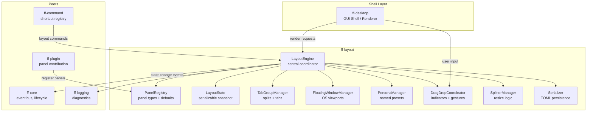

# Design Document: Layout and Docking System (`ff-layout`)

## 1. Overview

The `ff-layout` crate is the **GUI-independent layout engine** for the FileForgeWorkbench platform. It owns the spatial arrangement of all panels, tab groups, floating windows, and dock zones -- expressing the entire workspace layout as a data model that the GUI shell renders but does not own.

### Purpose

- Manage dockable panels within designated dock zones (left, right, bottom, center)
- Support tab groups with horizontal and vertical split views in the center editor area
- Enable floating OS-level windows for multi-monitor workflows
- Provide named layout personas for instant workspace switching
- Handle drag-and-drop rearrangement with visual drop indicators
- Serialize and restore layout state across sessions
- Enforce resizing constraints with proportional splitters

### Position in Architecture

```
Wave 2 -- Platform Architecture

┌─────────────────────────────────────────────────────────┐
│              Shell Layer: ff-desktop (egui)               │
│         Renders layout model; does NOT own it             │
├─────────────────────────────────────────────────────────┤
│  ff-layout (THIS CRATE) │ ff-core │ ff-command │ ff-plugin│
│  Layout engine, panels, dock zones, personas             │
├─────────────────────────────────────────────────────────┤
│              Foundation Layer: ff-logging                 │
└─────────────────────────────────────────────────────────┘
```

### Design Constraints (Cross-Cutting)

- **GUI Independence (Req 2)**: The layout engine owns the model; `egui` is used only for the `DockablePanel::render` trait method signature
- **Plugin Architecture (Req 3)**: Panels are contributed by plugins via `PluginContext`
- **Command-Driven (Req 4)**: All layout operations are invokable as commands
- **Async I/O (Req 6)**: Serialization I/O runs on Tokio workers; layout mutations are synchronous on the main thread
- **Multi-Crate Workspace (Req 7)**: Crate at `crates/ff-layout`
- **Error Message Standards (Req 8)**: Errors follow `[layout] operation: description` format

---

## 2. Architecture

### High-Level Architecture Diagram



### Layer Placement

| Component | Responsibility |
|-----------|---------------|
| **LayoutEngine** | Central coordinator -- owns the layout tree, orchestrates all transitions |
| **PanelRegistry** | Tracks registered panel types and their default zone assignments |
| **LayoutState** | Serializable snapshot of the complete layout for persistence |
| **TabGroupManager** | Manages center-area splits, tab ordering, group lifecycle |
| **FloatingWindowManager** | Tracks floating OS windows, position/size, monitor assignment |
| **PersonaManager** | Named presets -- load, save, activate, track modifications |
| **DragDropCoordinator** | Hit testing, drop indicators, gesture detection |
| **SplitterManager** | Proportional resizing, minimum constraints, double-click reset |
| **Serializer** | TOML read/write, schema versioning, graceful degradation |

---

## 3. Module Structure

```
crates/ff-layout/
├── Cargo.toml
├── src/
│   ├── lib.rs                  # Public API re-exports, crate docs
│   ├── engine.rs               # LayoutEngine struct, top-level orchestration
│   ├── panel/
│   │   ├── mod.rs              # Panel re-exports
│   │   ├── traits.rs           # DockablePanel trait, DockState enum
│   │   ├── registry.rs         # PanelRegistry -- registration, lookup, validation
│   │   └── display_state.rs    # PanelDisplayState enum (minimized, normal, maximized)
│   ├── dock/
│   │   ├── mod.rs              # Dock zone re-exports
│   │   ├── zone.rs             # DockZone enum, zone content management
│   │   └── layout_tree.rs      # Hierarchical layout tree (zones + splitters)
│   ├── tabs/
│   │   ├── mod.rs              # Tab group re-exports
│   │   ├── group.rs            # TabGroup struct, tab ordering
│   │   ├── split.rs            # SplitDirection, split/merge operations
│   │   └── manager.rs          # TabGroupManager -- split tree coordination
│   ├── floating/
│   │   ├── mod.rs              # Floating window re-exports
│   │   ├── window.rs           # FloatingWindow struct, lifecycle
│   │   ├── manager.rs          # FloatingWindowManager -- creation, limit enforcement
│   │   └── monitor.rs          # Monitor detection, DPI, repositioning logic
│   ├── persona/
│   │   ├── mod.rs              # Persona re-exports
│   │   ├── definition.rs       # Persona struct, built-in definitions
│   │   ├── manager.rs          # PersonaManager -- load, save, activate, track
│   │   └── storage.rs          # TOML file I/O for persona files
│   ├── drag/
│   │   ├── mod.rs              # Drag-and-drop re-exports
│   │   ├── coordinator.rs      # DragDropCoordinator -- gesture state machine
│   │   ├── indicator.rs        # DropIndicator rendering model
│   │   └── hit_test.rs         # Zone/group hit testing, insertion index calc
│   ├── resize/
│   │   ├── mod.rs              # Resize re-exports
│   │   ├── splitter.rs         # Splitter struct, position tracking
│   │   └── manager.rs          # SplitterManager -- constraint enforcement
│   ├── state/
│   │   ├── mod.rs              # State re-exports
│   │   ├── layout_state.rs     # LayoutState struct, in-memory representation
│   │   └── serializer.rs       # TOML serialization, schema version, migration
│   ├── commands.rs             # Layout command registrations (dock, undock, split, persona)
│   └── error.rs                # LayoutError enum
└── tests/
    ├── panel_registry_tests.rs     # Registration property tests
    ├── tab_group_tests.rs          # Split/merge property tests
    ├── floating_window_tests.rs    # Window lifecycle property tests
    ├── persona_tests.rs            # Persona activation property tests
    ├── serialization_tests.rs      # Round-trip property tests
    ├── splitter_tests.rs           # Resize constraint property tests
    ├── drag_drop_tests.rs          # Hit testing property tests
    └── integration.rs              # End-to-end layout scenario tests
```

---

## 4. Key Data Models and Types

### LayoutEngine

```rust
/// The central coordinator for the layout system. Owns the layout tree,
/// manages all transitions between layout states, and serves as the primary
/// API surface for the shell and command framework.
///
/// Addresses: Requirement 1 criterion 1, Requirement 1 criterion 9
pub struct LayoutEngine {
    /// The current in-memory layout state
    state: LayoutState,
    /// Registry of all known panel types
    panel_registry: PanelRegistry,
    /// Tab group management for center area splits
    tab_groups: TabGroupManager,
    /// Floating window tracking
    floating_windows: FloatingWindowManager,
    /// Persona management (presets)
    personas: PersonaManager,
    /// Drag-and-drop coordination
    drag_drop: DragDropCoordinator,
    /// Splitter/resize management
    splitters: SplitterManager,
    /// Whether the current layout diverges from the active persona
    persona_modified: bool,
    /// The currently active persona name (if any)
    active_persona: Option<String>,
}
```

### DockZone

```rust
/// Designated areas within the primary window where panels can be attached.
/// Addresses: Requirement 1 criteria 1/3/5
#[derive(Debug, Clone, Copy, PartialEq, Eq, Hash, serde::Serialize, serde::Deserialize)]
#[non_exhaustive]
pub enum DockZone {
    Left,
    Right,
    Bottom,
    Center,
    Floating,
}
```

### DockablePanel Trait

```rust
/// Trait that all dockable panels must implement. The Layout_Engine interacts
/// with panels exclusively through this interface.
///
/// Addresses: Requirement 1 criteria 4–9
pub trait DockablePanel: Send + Sync {
    /// Returns the unique panel identifier (1–64 ASCII alphanumeric/underscore chars).
    /// Addresses: Requirement 1 criterion 4
    fn panel_id(&self) -> &str;

    /// Returns the preferred default dock zone.
    /// Addresses: Requirement 1 criterion 5
    fn default_dock_zone(&self) -> DockZone;

    /// Renders panel content into the given UI region.
    /// Must produce valid output regardless of dock state.
    /// Addresses: Requirement 1 criterion 6
    fn render(&mut self, ui: &mut egui::Ui);

    /// Returns the display title (1–128 characters).
    /// Addresses: Requirement 1 criterion 7
    fn title(&self) -> &str;

    /// Called when the panel transitions between dock states.
    /// Addresses: Requirement 1 criterion 8
    fn on_dock_state_changed(&mut self, state: DockState);

    /// Returns the minimum size constraint in logical pixels (width, height).
    /// Returns None to use the default minimum of 48×48.
    /// Addresses: Requirement 8 criteria 3/4
    fn minimum_size(&self) -> Option<(f32, f32)> {
        None
    }
}
```

### DockState

```rust
/// The current state of a panel within the layout system.
/// Addresses: Requirement 1 criteria 8/11/13
#[derive(Debug, Clone, Copy, PartialEq, Eq)]
pub enum DockState {
    /// Panel is attached to a dock zone and visible at normal size
    Docked,
    /// Panel is in a floating OS window
    Floating,
    /// Panel is collapsed to a tab/icon in the zone header
    Minimized,
    /// Panel is hidden from view (position preserved in state)
    Hidden,
    /// Panel is expanded to fill the entire primary window content area
    Maximized,
}
```

### PanelDisplayState

```rust
/// Display states for panels within dock zones.
/// Addresses: Requirement 1 criterion 13
#[derive(Debug, Clone, Copy, PartialEq, Eq, serde::Serialize, serde::Deserialize)]
pub enum PanelDisplayState {
    /// Collapsed to tab/icon in dock zone header
    Minimized,
    /// Rendered at assigned size
    Normal,
    /// Expanded to fill entire primary window content area
    Maximized,
}
```

### FloatingWindow

```rust
/// Represents an OS-level window containing one or more detached panels/tabs.
/// Addresses: Requirement 3 criteria 1–16, Requirement 4 criteria 1–8
#[derive(Debug, Clone, serde::Serialize, serde::Deserialize)]
pub struct FloatingWindow {
    /// Unique identifier for this floating window
    pub id: FloatingWindowId,
    /// Panels contained in this floating window
    pub panels: Vec<String>,
    /// Position in logical pixels (screen coordinates)
    pub position: Position,
    /// Size in logical pixels (minimum 200×150)
    pub size: Size,
    /// Monitor identifier for multi-monitor persistence
    pub monitor_id: Option<String>,
    /// The dock zone the panel(s) originated from (for redock)
    pub origin_zone: DockZone,
    /// Original tab index within the origin group (for tab redock)
    pub origin_tab_index: Option<usize>,
}

/// Opaque identifier for a floating window.
#[derive(Debug, Clone, Copy, PartialEq, Eq, Hash, serde::Serialize, serde::Deserialize)]
pub struct FloatingWindowId(u32);

/// Logical pixel position (x, y).
#[derive(Debug, Clone, Copy, PartialEq, serde::Serialize, serde::Deserialize)]
pub struct Position {
    pub x: f32,
    pub y: f32,
}

/// Logical pixel size (width, height).
#[derive(Debug, Clone, Copy, PartialEq, serde::Serialize, serde::Deserialize)]
pub struct Size {
    pub width: f32,
    pub height: f32,
}
```

### PanelRegistry

```rust
/// Registry of all known panel types and their default assignments.
/// Plugins register panels here during initialization.
///
/// Addresses: Requirement 1 criteria 2/3/9/10/14
pub struct PanelRegistry {
    /// Map of panel_id → PanelRegistration
    panels: HashMap<String, PanelRegistration>,
}

/// Information stored for each registered panel type.
#[derive(Debug, Clone)]
pub struct PanelRegistration {
    /// The unique panel identifier
    pub panel_id: String,
    /// Default dock zone assignment
    pub default_zone: DockZone,
    /// Display title
    pub title: String,
    /// The panel instance (trait object)
    pub panel: Arc<Mutex<dyn DockablePanel>>,
}
```

### LayoutState

```rust
/// A serializable snapshot of the complete layout. Persisted at exit,
/// restored at startup, used for persona definitions.
///
/// Addresses: Requirement 6 criteria 1–11
#[derive(Debug, Clone, serde::Serialize, serde::Deserialize)]
pub struct LayoutState {
    /// Schema version for forward-compatible migration
    /// Addresses: Requirement 6 criterion 11
    pub schema_version: u32,
    /// Dock zone contents: panel_id → zone assignment with dimensions
    pub docked_panels: Vec<DockedPanelState>,
    /// Tab group arrangement in the center area
    pub tab_groups: TabGroupTree,
    /// Floating window positions and contents
    pub floating_windows: Vec<FloatingWindow>,
    /// Splitter positions as proportional values [0.0, 1.0]
    /// Addresses: Requirement 8 criterion 7
    pub splitter_positions: HashMap<SplitterId, f32>,
    /// Panel visibility map (hidden panels tracked here)
    pub panel_visibility: HashMap<String, bool>,
    /// Panel display states (minimized/normal/maximized)
    pub panel_display_states: HashMap<String, PanelDisplayState>,
}

/// State for a single docked panel within the layout.
#[derive(Debug, Clone, serde::Serialize, serde::Deserialize)]
pub struct DockedPanelState {
    pub panel_id: String,
    pub zone: DockZone,
    /// Zone width or height in logical pixels
    pub zone_dimension: f32,
}
```

### TabGroup

```rust
/// A subdivision of the center editor area holding one or more tabs.
/// Multiple TabGroups coexist via horizontal or vertical splits.
///
/// Addresses: Requirement 2 criteria 1–9
#[derive(Debug, Clone, serde::Serialize, serde::Deserialize)]
pub struct TabGroup {
    /// Unique identifier for this tab group
    pub id: TabGroupId,
    /// Ordered list of tab identifiers within this group
    pub tabs: Vec<String>,
    /// Index of the currently active tab (0-based)
    pub active_tab: usize,
}

/// Opaque identifier for a tab group.
#[derive(Debug, Clone, Copy, PartialEq, Eq, Hash, serde::Serialize, serde::Deserialize)]
pub struct TabGroupId(u32);

/// Hierarchical tree representing tab group splits.
/// Addresses: Requirement 2 criteria 1/8
#[derive(Debug, Clone, serde::Serialize, serde::Deserialize)]
pub enum TabGroupTree {
    /// A leaf node containing a single tab group
    Leaf(TabGroup),
    /// A split node containing two children with a split direction and proportion
    Split {
        direction: SplitDirection,
        /// Proportion allocated to the first child [0.0, 1.0]
        proportion: f32,
        first: Box<TabGroupTree>,
        second: Box<TabGroupTree>,
    },
}

/// Direction of a tab group split.
/// Addresses: Requirement 2 criteria 2/3
#[derive(Debug, Clone, Copy, PartialEq, Eq, serde::Serialize, serde::Deserialize)]
pub enum SplitDirection {
    /// Side-by-side (left/right)
    Horizontal,
    /// Stacked (top/bottom)
    Vertical,
}
```

### Persona

```rust
/// A named layout configuration that can be activated to switch
/// the entire workspace appearance with a single action.
///
/// Addresses: Requirement 5 criteria 1–10
#[derive(Debug, Clone, serde::Serialize, serde::Deserialize)]
pub struct Persona {
    /// Unique name for this persona (e.g., "Editor Focus", "Debug")
    pub name: String,
    /// Whether this is a built-in persona (cannot be deleted)
    pub built_in: bool,
    /// The layout state defining this persona's arrangement
    pub layout: LayoutState,
    /// Optional description for UI display
    pub description: Option<String>,
}

/// Identifies whether a persona is built-in or user-created.
/// Addresses: Requirement 5 criterion 6
#[derive(Debug, Clone, Copy, PartialEq, Eq)]
pub enum PersonaKind {
    BuiltIn,
    Custom,
}
```

### DropIndicator

```rust
/// Visual overlay shown during drag-and-drop to highlight valid targets.
///
/// Addresses: Requirement 7 criteria 1/4/5/6, Requirement 10 criterion 6
#[derive(Debug, Clone)]
pub struct DropIndicator {
    /// The target area in logical screen coordinates
    pub bounds: Rect,
    /// Where the panel/tab will be placed upon release
    pub placement: DropPlacement,
    /// Whether the indicator is currently visible
    pub visible: bool,
}

/// Describes where a dropped item will be placed.
#[derive(Debug, Clone, Copy, PartialEq, Eq)]
pub enum DropPlacement {
    /// Dock into specified zone
    DockZone(DockZone),
    /// Insert as tab at given index in a tab group
    TabInsertion { group_id: TabGroupId, index: usize },
    /// Split the target group in the specified direction
    SplitGroup { group_id: TabGroupId, direction: SplitDirection, side: SplitSide },
}

/// Which side of a split the dropped item goes to.
#[derive(Debug, Clone, Copy, PartialEq, Eq)]
pub enum SplitSide {
    First,
    Second,
}

/// A rectangle in logical pixel coordinates.
#[derive(Debug, Clone, Copy, PartialEq, serde::Serialize, serde::Deserialize)]
pub struct Rect {
    pub x: f32,
    pub y: f32,
    pub width: f32,
    pub height: f32,
}
```

### Splitter

```rust
/// A draggable border between adjacent dock zones or tab groups.
///
/// Addresses: Requirement 8 criteria 1–9
#[derive(Debug, Clone, serde::Serialize, serde::Deserialize)]
pub struct Splitter {
    /// Unique identifier for this splitter
    pub id: SplitterId,
    /// Current proportional position [0.0, 1.0]
    pub proportion: f32,
    /// Default proportional position (for double-click reset)
    /// Addresses: Requirement 8 criterion 8
    pub default_proportion: f32,
    /// Orientation of the splitter
    pub orientation: SplitterOrientation,
    /// Minimum size constraints from adjacent panels (logical pixels)
    pub min_first: f32,
    pub min_second: f32,
}

/// Opaque identifier for a splitter.
#[derive(Debug, Clone, Copy, PartialEq, Eq, Hash, serde::Serialize, serde::Deserialize)]
pub struct SplitterId(u32);

/// Orientation of a splitter handle.
#[derive(Debug, Clone, Copy, PartialEq, Eq)]
pub enum SplitterOrientation {
    /// Horizontal splitter (divides top/bottom)
    Horizontal,
    /// Vertical splitter (divides left/right)
    Vertical,
}
```

---

## 5. Public API Surface

### LayoutEngine -- Construction and Lifecycle

```rust
impl LayoutEngine {
    /// Create a new LayoutEngine with default layout (dock zones: left, right, bottom, center).
    /// Addresses: Requirement 1 criterion 1
    pub fn new() -> Self;

    /// Initialize from a persisted LayoutState (startup restoration).
    /// Applies graceful degradation for missing panels.
    /// Addresses: Requirement 6 criteria 2/3/5
    pub fn from_state(state: LayoutState, registry: &PanelRegistry) -> Self;

    /// Returns the current LayoutState as a serializable snapshot.
    pub fn current_state(&self) -> &LayoutState;

    /// Returns whether the layout has been modified from the active persona.
    /// Addresses: Requirement 5 criterion 10
    pub fn is_persona_modified(&self) -> bool;

    /// Returns the active persona name, if any.
    /// Addresses: Requirement 5 criterion 9
    pub fn active_persona_name(&self) -> Option<&str>;
}
```

### Panel Operations

```rust
impl LayoutEngine {
    /// Show a hidden panel in its last known dock zone.
    /// Addresses: Requirement 1 criterion 11
    pub fn show_panel(&mut self, panel_id: &str) -> Result<(), LayoutError>;

    /// Hide a panel while preserving its position in the LayoutState.
    /// Addresses: Requirement 1 criterion 11
    pub fn hide_panel(&mut self, panel_id: &str) -> Result<(), LayoutError>;

    /// Toggle panel visibility (show if hidden, hide if visible).
    /// Addresses: Requirement 1 criterion 12
    pub fn toggle_panel(&mut self, panel_id: &str) -> Result<(), LayoutError>;

    /// Minimize a panel (collapse to tab/icon in zone header).
    /// Addresses: Requirement 1 criterion 13
    pub fn minimize_panel(&mut self, panel_id: &str) -> Result<(), LayoutError>;

    /// Maximize a panel (expand to fill primary window content area).
    /// Addresses: Requirement 1 criterion 13
    pub fn maximize_panel(&mut self, panel_id: &str) -> Result<(), LayoutError>;

    /// Restore a panel to normal display state.
    /// Addresses: Requirement 1 criterion 13
    pub fn restore_panel(&mut self, panel_id: &str) -> Result<(), LayoutError>;
}
```

### Floating Window Operations

```rust
impl LayoutEngine {
    /// Undock a panel from its dock zone into a new floating window.
    /// Addresses: Requirement 3 criteria 1/2/4
    pub fn undock_panel(&mut self, panel_id: &str) -> Result<FloatingWindowId, LayoutError>;

    /// Undock a panel to a specific position (drag-to-float).
    /// Addresses: Requirement 3 criterion 9, Requirement 7 criterion 9
    pub fn undock_panel_at(
        &mut self,
        panel_id: &str,
        position: Position,
    ) -> Result<FloatingWindowId, LayoutError>;

    /// Redock a floating panel back to its most recent dock zone.
    /// Addresses: Requirement 3 criteria 5/6/7
    pub fn redock_panel(&mut self, window_id: FloatingWindowId) -> Result<(), LayoutError>;

    /// Undock a tab from a TabGroup into a new floating window.
    /// Addresses: Requirement 3 criterion 9, Requirement 9 criterion 3
    pub fn undock_tab(
        &mut self,
        group_id: TabGroupId,
        tab_index: usize,
    ) -> Result<FloatingWindowId, LayoutError>;

    /// Undock a tab to a specific position.
    pub fn undock_tab_at(
        &mut self,
        group_id: TabGroupId,
        tab_index: usize,
        position: Position,
    ) -> Result<FloatingWindowId, LayoutError>;

    /// Redock a tab from a floating window back to its originating TabGroup.
    /// Addresses: Requirement 3 criterion 11
    pub fn redock_tab(&mut self, window_id: FloatingWindowId) -> Result<(), LayoutError>;

    /// Update a floating window's position and size after a move/resize.
    /// Addresses: Requirement 3 criterion 4, Requirement 6 criterion 9
    pub fn update_floating_window(
        &mut self,
        window_id: FloatingWindowId,
        position: Position,
        size: Size,
    ) -> Result<(), LayoutError>;

    /// Handle OS window close button -- redock rather than destroy.
    /// Addresses: Requirement 3 criteria 8/11/12
    pub fn on_floating_window_close(
        &mut self,
        window_id: FloatingWindowId,
    ) -> Result<CloseAction, LayoutError>;

    /// Returns the count of currently floating windows.
    pub fn floating_window_count(&self) -> usize;

    /// Maximum number of simultaneous floating windows.
    /// Addresses: Requirement 3 criterion 14
    pub const MAX_FLOATING_WINDOWS: usize = 16;
}

/// Result of handling a floating window close.
#[derive(Debug, Clone, PartialEq, Eq)]
pub enum CloseAction {
    /// Panel was redocked successfully
    Redocked,
    /// Unsaved changes -- show save confirmation dialog
    NeedsSaveConfirmation { tab_id: String },
}
```

### Tab Group Operations

```rust
impl LayoutEngine {
    /// Split the active tab group horizontally (side-by-side).
    /// Moves the active tab to the new group.
    /// Addresses: Requirement 2 criterion 2
    pub fn split_horizontal(&mut self) -> Result<TabGroupId, LayoutError>;

    /// Split the active tab group vertically (stacked).
    /// Moves the active tab to the new group.
    /// Addresses: Requirement 2 criterion 3
    pub fn split_vertical(&mut self) -> Result<TabGroupId, LayoutError>;

    /// Move a tab from one group to another at the specified index.
    /// Closes empty groups automatically.
    /// Addresses: Requirement 2 criteria 4/5
    pub fn move_tab(
        &mut self,
        source_group: TabGroupId,
        tab_index: usize,
        target_group: TabGroupId,
        insert_index: usize,
    ) -> Result<(), LayoutError>;

    /// Add a new tab to the active tab group (or specified group).
    /// Addresses: Requirement 2 criterion 9
    pub fn add_tab(
        &mut self,
        tab_id: &str,
        target_group: Option<TabGroupId>,
    ) -> Result<(), LayoutError>;

    /// Returns the currently active tab group ID.
    pub fn active_tab_group(&self) -> TabGroupId;

    /// Set the active tab group.
    pub fn set_active_tab_group(&mut self, group_id: TabGroupId) -> Result<(), LayoutError>;
}
```

### Persona Operations

```rust
impl LayoutEngine {
    /// Activate a persona by name, transitioning the layout.
    /// Open documents are preserved (excess tabs placed in last group).
    /// Addresses: Requirement 5 criteria 4/5
    pub fn activate_persona(&mut self, name: &str) -> Result<(), LayoutError>;

    /// Save the current layout as a custom persona.
    /// Addresses: Requirement 5 criterion 3
    pub fn save_persona(&mut self, name: &str) -> Result<(), LayoutError>;

    /// Delete a custom persona. Returns error for built-in personas.
    /// Addresses: Requirement 5 criterion 6
    pub fn delete_persona(&mut self, name: &str) -> Result<(), LayoutError>;

    /// Update the active persona to match the current layout.
    /// Addresses: Requirement 5 criterion 10
    pub fn update_active_persona(&mut self) -> Result<(), LayoutError>;

    /// Revert the layout to the active persona's saved state.
    /// Addresses: Requirement 5 criterion 10
    pub fn revert_to_persona(&mut self) -> Result<(), LayoutError>;

    /// List all available personas (built-in and custom).
    pub fn list_personas(&self) -> Vec<&Persona>;
}
```

### Serialization Operations

```rust
impl LayoutEngine {
    /// Serialize the current layout state to the session file.
    /// Addresses: Requirement 6 criterion 1
    pub fn save_session(&self, path: &Path) -> Result<(), LayoutError>;

    /// Export the current layout state to a user-specified path.
    /// Addresses: Requirement 6 criterion 6
    pub fn export_layout(&self, path: &Path) -> Result<(), LayoutError>;

    /// Import and apply a layout from a file.
    /// Missing panels are skipped gracefully.
    /// Addresses: Requirement 6 criterion 7
    pub fn import_layout(&mut self, path: &Path) -> Result<(), LayoutError>;

    /// Reset to the built-in default layout.
    /// Addresses: Requirement 6 criterion 8
    pub fn reset_to_default(&mut self);
}
```

### Drag-and-Drop Operations

```rust
impl LayoutEngine {
    /// Begin a drag operation from a panel header or tab.
    /// Addresses: Requirement 7 criterion 11
    pub fn begin_drag(&mut self, item: DragItem, origin: Position);

    /// Update the drag position -- triggers hit testing and indicator display.
    /// Addresses: Requirement 7 criteria 1/5/6/13
    pub fn update_drag(&mut self, cursor: Position);

    /// End a drag operation -- executes the drop or cancels.
    /// Addresses: Requirement 7 criteria 2/3/7/8/9/10/12
    pub fn end_drag(&mut self, cursor: Position) -> Result<DragResult, LayoutError>;

    /// Cancel an in-progress drag operation.
    pub fn cancel_drag(&mut self);

    /// Returns the current drop indicator (for rendering by the shell).
    pub fn current_drop_indicator(&self) -> Option<&DropIndicator>;

    /// Returns whether a drag is currently in progress.
    pub fn is_dragging(&self) -> bool;
}

/// Items that can be dragged.
#[derive(Debug, Clone)]
pub enum DragItem {
    /// A docked panel being dragged from its header
    Panel { panel_id: String },
    /// A tab being dragged from a tab group
    Tab { group_id: TabGroupId, tab_index: usize },
    /// A floating window being dragged by its title bar
    FloatingWindow { window_id: FloatingWindowId },
}

/// Result of a completed drag operation.
#[derive(Debug, Clone)]
pub enum DragResult {
    /// Item was docked into a zone
    Docked { panel_id: String, zone: DockZone },
    /// Tab was moved to a different group
    TabMoved { tab_id: String, target_group: TabGroupId, index: usize },
    /// Item was floated at the release position
    Floated { window_id: FloatingWindowId },
    /// Drag was cancelled (released in invalid location)
    Cancelled,
}
```

### Splitter Operations

```rust
impl LayoutEngine {
    /// Begin dragging a splitter.
    /// Addresses: Requirement 8 criterion 9
    pub fn begin_splitter_drag(&mut self, splitter_id: SplitterId);

    /// Update splitter position during drag (real-time resize).
    /// Enforces minimum size constraints.
    /// Addresses: Requirement 8 criteria 3/4/5/6/9
    pub fn update_splitter(
        &mut self,
        splitter_id: SplitterId,
        new_proportion: f32,
    ) -> Result<(), LayoutError>;

    /// End splitter drag -- finalizes the position.
    pub fn end_splitter_drag(&mut self, splitter_id: SplitterId);

    /// Reset a splitter to its default position (double-click).
    /// Addresses: Requirement 8 criterion 8
    pub fn reset_splitter(&mut self, splitter_id: SplitterId) -> Result<(), LayoutError>;

    /// Handle primary window resize -- proportional redistribution.
    /// Addresses: Requirement 8 criteria 5/6
    pub fn on_window_resize(&mut self, new_size: Size);
}
```

### PanelRegistry API

```rust
impl PanelRegistry {
    /// Create a new empty registry.
    pub fn new() -> Self;

    /// Register a panel type. Validates panel_id format and default zone.
    /// Returns error on duplicate ID or invalid zone.
    /// Addresses: Requirement 1 criteria 2/3/10
    pub fn register(
        &mut self,
        panel: Arc<Mutex<dyn DockablePanel>>,
    ) -> Result<(), LayoutError>;

    /// Deregister a panel (plugin unload).
    /// Addresses: Requirement 1 criterion 14
    pub fn deregister(&mut self, panel_id: &str) -> bool;

    /// Look up a panel by ID.
    pub fn get(&self, panel_id: &str) -> Option<&PanelRegistration>;

    /// Returns all registered panel IDs.
    pub fn list_all(&self) -> Vec<&str>;

    /// Returns whether a panel_id is currently registered.
    pub fn is_registered(&self, panel_id: &str) -> bool;
}
```

### Multi-Monitor Support

```rust
impl LayoutEngine {
    /// Handle monitor disconnection -- relocate affected windows.
    /// Addresses: Requirement 4 criterion 6
    pub fn on_monitor_disconnected(&mut self, monitor_id: &str);

    /// Update a floating window's monitor assignment after a move.
    /// Addresses: Requirement 4 criterion 2
    pub fn update_window_monitor(
        &mut self,
        window_id: FloatingWindowId,
        monitor_id: &str,
    ) -> Result<(), LayoutError>;

    /// Validate window positions during startup restoration.
    /// Repositions windows with less than 50% visibility.
    /// Addresses: Requirement 4 criteria 7/8
    pub fn validate_window_positions(&mut self, available_monitors: &[MonitorInfo]);
}

/// Information about a connected monitor for positioning decisions.
#[derive(Debug, Clone)]
pub struct MonitorInfo {
    /// Unique identifier for this monitor
    pub id: String,
    /// Whether this is the primary monitor
    pub is_primary: bool,
    /// Work area bounds (excluding taskbar etc.)
    pub work_area: Rect,
    /// DPI scale factor for this monitor
    pub dpi_scale: f32,
}
```

---

## 6. Error Types

```rust
/// Errors produced by the layout engine.
/// Formatted per Error Message Standards: `[layout] operation: description`
///
/// Addresses: Cross-cutting Requirement 8
#[derive(Debug, thiserror::Error)]
#[non_exhaustive]
pub enum LayoutError {
    /// Panel ID is not registered in the PanelRegistry
    #[error("[layout] panel: '{panel_id}' is not registered")]
    PanelNotFound { panel_id: String },

    /// Attempted to register a duplicate panel_id
    /// Addresses: Requirement 1 criterion 10
    #[error("[layout] register: panel '{panel_id}' is already registered")]
    DuplicatePanelId { panel_id: String },

    /// Invalid dock zone specified for registration
    /// Addresses: Requirement 1 criterion 3
    #[error("[layout] register: invalid dock zone '{zone}' for panel '{panel_id}'")]
    InvalidDockZone { panel_id: String, zone: String },

    /// Invalid panel_id format (must be 1–64 ASCII alphanumeric/underscore)
    #[error("[layout] register: invalid panel_id format '{panel_id}' -- {reason}")]
    InvalidPanelId { panel_id: String, reason: String },

    /// Maximum floating windows reached
    /// Addresses: Requirement 3 criterion 14
    #[error("[layout] undock: maximum floating windows ({max}) reached")]
    MaxFloatingWindows { max: usize },

    /// OS failed to create a floating window
    /// Addresses: Requirement 3 criterion 15
    #[error("[layout] undock: OS window creation failed for panel '{panel_id}'")]
    WindowCreationFailed { panel_id: String },

    /// Floating window not found
    #[error("[layout] floating: window {window_id:?} not found")]
    FloatingWindowNotFound { window_id: FloatingWindowId },

    /// Tab group not found
    #[error("[layout] tabs: group {group_id:?} not found")]
    TabGroupNotFound { group_id: TabGroupId },

    /// Cannot split -- would create empty editor area
    /// Addresses: Requirement 9 criterion 4
    #[error("[layout] split: cannot undock the only tab in the only group")]
    CannotEmptyEditor,

    /// Persona not found
    #[error("[layout] persona: '{name}' not found")]
    PersonaNotFound { name: String },

    /// Cannot delete a built-in persona
    /// Addresses: Requirement 5 criterion 6
    #[error("[layout] persona: cannot delete built-in persona '{name}'")]
    CannotDeleteBuiltIn { name: String },

    /// Serialization/deserialization failure
    /// Addresses: Requirement 6 criteria 3/10
    #[error("[layout] serialization: {operation} failed -- {reason}")]
    SerializationFailed { operation: String, reason: String },

    /// I/O error during file operations
    #[error("[layout] io: {0}")]
    Io(#[from] std::io::Error),

    /// Splitter not found
    #[error("[layout] splitter: {splitter_id:?} not found")]
    SplitterNotFound { splitter_id: SplitterId },

    /// Tab index out of bounds
    #[error("[layout] tab: index {index} out of bounds for group {group_id:?} (has {count} tabs)")]
    TabIndexOutOfBounds {
        group_id: TabGroupId,
        index: usize,
        count: usize,
    },
}
```

---

## 7. Integration Points

### With `ff-logging` (Foundation Layer -- upstream)

- **Dependency direction**: ff-layout depends on ff-logging
- **API consumed**: `log_info!`, `log_warn!`, `log_error!` macros
- **Usage**:
  - INFO on panel registration/deregistration
  - INFO on persona activation
  - WARN when persisted layout references unregistered panel_id (Requirement 6 criterion 5)
  - WARN when layout file fails to parse (Requirement 6 criterion 3)
  - WARN when session save fails at exit (Requirement 6 criterion 10)
  - ERROR on invalid dock zone registration (Requirement 1 criterion 3)

### With `ff-core` (Platform Core -- same wave, consumer)

- **Dependency direction**: ff-core initializes ff-layout as a registered subsystem
- **Integration**:
  - ff-core calls `LayoutEngine::new()` during startup sequence
  - ff-core calls `LayoutEngine::save_session()` during shutdown
  - ff-core provides `LayoutState` from config at startup for restoration
  - ff-layout dispatches `WorkbenchEvent::LayoutChanged` through the Event Bus when layout mutates
- **Event Bus events emitted**:
  - `LayoutChanged` -- any structural layout change (dock, undock, split, persona switch)
  - `PanelStateChanged { panel_id, new_state }` -- individual panel state transitions

### With `ff-command` (Command Framework -- same wave, peer)

- **Dependency direction**: ff-layout registers layout commands with ff-command
- **Commands registered**:
  - `layout.undock` -- undock focused panel (Ctrl+Shift+D)
  - `layout.redock` -- redock focused floating panel
  - `layout.toggle_panel` -- toggle a named panel
  - `layout.split_horizontal` -- split active tab group horizontally
  - `layout.split_vertical` -- split active tab group vertically
  - `layout.undock_tab` -- undock active tab (Ctrl+Shift+T)
  - `layout.redock_tab` -- redock floating tab
  - `layout.persona.activate` -- activate a persona by name
  - `layout.persona.save` -- save current layout as persona
  - `layout.reset` -- reset to default layout
  - `layout.export` -- export layout to file
  - `layout.import` -- import layout from file
- **Shortcut registrations**: All shortcuts registered with `ShortcutRegistry` (Requirement 9 criterion 6)

### With `ff-plugin` (Plugin Architecture -- same wave, peer)

- **Dependency direction**: ff-plugin uses ff-layout's `PanelRegistry` to register panels
- **Integration**:
  - Plugins call `PanelRegistry::register()` during their `initialize` phase (Requirement 1 criterion 14)
  - During plugin unload, ff-plugin calls `PanelRegistry::deregister()` and `LayoutEngine::hide_panel()` to clean up (Requirement 1 criterion 14)
  - `PanelRegistry` is accessible via `PluginContext`

### With `ff-config` (Configuration System -- same wave, peer)

- **Dependency direction**: ff-layout reads layout config from ff-config at startup
- **Configuration consumed**:
  - Session file path (`config/layout_state.toml`)
  - Persona directory path (`layouts/`)
  - Default persona to activate on first launch

### With `ff-desktop` (Shell Layer -- downstream)

- **Dependency direction**: ff-desktop depends on ff-layout; ff-layout NEVER depends on ff-desktop
- **Shell responsibilities**:
  - Render the layout tree (dock zones, tab groups, splitters) based on `LayoutState`
  - Create/destroy OS-level floating windows as directed by `FloatingWindowManager`
  - Forward user input (drag events, splitter drags, window moves) to `LayoutEngine`
  - Render `DropIndicator` overlays during drag operations
  - Display persona name and modification indicator in status bar
  - Render placeholder indicators for floating panels (Requirement 10 criterion 1)
  - Handle DPI-aware rendering per monitor (Requirement 4 criteria 4/5)

### Dependency Direction Summary

```
ff-logging ← ff-layout ← ff-desktop
              ff-layout ← ff-core (lifecycle)
              ff-layout → ff-command (command registration)
              ff-layout ← ff-plugin (panel registration)
              ff-layout ← ff-config (settings)
```

---

## 8. Configuration

Layout configuration is managed through two channels: the workbench TOML config (system settings) and per-persona TOML files (layout presets).

### Workbench TOML Schema (`[layout]` section)

```toml
[layout]
# Path to the session state file (relative to workbench config dir).
# Default: "config/layout_state.toml"
session_file = "config/layout_state.toml"

# Path to persona definitions directory.
# Default: "layouts/"
persona_directory = "layouts/"

# Default persona to activate on first launch (no session file exists).
# Default: "Editor Focus"
default_persona = "Editor Focus"

# Maximum floating windows allowed simultaneously.
# Range: 1–16. Default: 16
max_floating_windows = 16

# Minimum tab group size in logical pixels (split direction).
# Range: 50–500. Default: 100
# Addresses: Requirement 2 criterion 7
min_tab_group_size = 100

# Default minimum panel size in logical pixels (both dimensions).
# Range: 24–200. Default: 48
# Addresses: Requirement 8 criterion 4
default_min_panel_size = 48
```

### Persona TOML Format (`layouts/<name>.toml`)

```toml
[persona]
name = "Editor Focus"
built_in = true
description = "Minimal panels, maximized editor area"

[persona.layout]
schema_version = 1

[[persona.layout.docked_panels]]
panel_id = "file_tree"
zone = "Left"
zone_dimension = 250.0

[[persona.layout.docked_panels]]
panel_id = "output"
zone = "Bottom"
zone_dimension = 200.0

[persona.layout.tab_groups]
# Encoded as the TabGroupTree structure
direction = "Horizontal"
proportion = 0.5

[persona.layout.splitter_positions]
"left_center" = 0.2
"center_right" = 0.8
"center_bottom" = 0.75

[persona.layout.panel_visibility]
file_tree = true
output = false
properties = false
```

### Config Resolution Rules

| Setting | Absent | Invalid Value | Out of Range |
|---------|--------|---------------|--------------|
| `session_file` | Default path | Default path + WARN | N/A |
| `persona_directory` | Default path | Default path + WARN | N/A |
| `default_persona` | "Editor Focus" | "Editor Focus" + WARN | N/A |
| `max_floating_windows` | 16 | 16 + WARN | Clamp to [1–16] + WARN |
| `min_tab_group_size` | 100 | 100 + WARN | Clamp to [50–500] + WARN |
| `default_min_panel_size` | 48 | 48 + WARN | Clamp to [24–200] + WARN |

---

## 9. Concurrency Model

### Thread-Safety Approach

The layout engine operates primarily on the **main/GUI thread**. Layout mutations are synchronous and immediate to provide real-time visual feedback (Requirement 8 criterion 9). Background operations are limited to serialization I/O.

| Component | Thread Context | Mechanism |
|-----------|---------------|-----------|
| **LayoutEngine** | Main thread | Single-threaded; all mutations via method calls from shell event loop |
| **PanelRegistry** | Main thread + plugin thread | `Arc<Mutex<PanelRegistry>>` for safe registration from plugin init |
| **Serialization** | Tokio worker | Async file I/O for save/load; results delivered via channel |
| **DragDropCoordinator** | Main thread | State machine driven by frame-rate input events |
| **FloatingWindowManager** | Main thread | Window creation/destruction dispatched to OS; positions tracked synchronously |

### Communication Channels

| Channel | Direction | Purpose |
|---------|-----------|---------|
| `LayoutEngine` → `EventBus` | Core → Shell | Notify shell of layout changes requiring re-render |
| `Serializer` → `LayoutEngine` | Tokio → Main | Deliver loaded LayoutState from disk at startup |
| `LayoutEngine` → `Serializer` | Main → Tokio | Dispatch save operations without blocking shutdown |

### Why Main-Thread for Layout Mutations

- Layout changes must be reflected in the same frame they occur (Requirement 7 criterion 5: 16ms indicator)
- Drag-and-drop state machine requires frame-coherent updates
- Splitter dragging needs zero-latency feedback (Requirement 8 criterion 9)
- Panel render calls (`DockablePanel::render`) happen on the GUI thread

### Serialization Strategy

- **Save on exit**: `save_session()` serializes to TOML on a Tokio worker with 3-second timeout. On timeout or error, logs WARN and allows exit (Requirement 6 criterion 10)
- **Auto-save debounce**: After layout changes, a 2-second debounce timer triggers background save to prevent data loss on crash
- **Startup restore**: `LayoutState` is loaded from disk before the shell renders. If loading fails, default layout is used (Requirement 6 criterion 3)

---

## 10. Correctness Properties

These properties are suitable for property-based testing with `proptest`. They validate invariants that must hold across all valid inputs.

### Property 1: Panel Registration Uniqueness

**Statement**: For any sequence of panel registrations, the PanelRegistry contains at most one entry per `panel_id`. A registration with an existing ID always returns `DuplicatePanelId` error without modifying state.

**Validates**: Requirement 1, criterion 10

```rust
// proptest strategy: generate sequences of (panel_id, zone) registration attempts
// assertion: after all registrations, registry.list_all() has no duplicates
//            AND every duplicate attempt returned Err(DuplicatePanelId)
```

### Property 2: Dock/Undock Round-Trip Preserves Panel Identity

**Statement**: For any panel that is undocked into a floating window and then redocked, the panel remains in the PanelRegistry with its original `panel_id`, and its final dock zone matches its pre-undock zone.

**Validates**: Requirement 3, criteria 1/5/7

```rust
// proptest strategy: generate initial docked panels, pick one to undock then redock
// assertion: panel_id remains registered AND zone == original zone
```

### Property 3: Tab Group Split Preserves Total Tab Count

**Statement**: For any split operation (horizontal or vertical) on a tab group containing N tabs, the total number of tabs across the resulting two groups equals N.

**Validates**: Requirement 2, criteria 2/3

```rust
// proptest strategy: generate tab group with 1..20 tabs, apply split
// assertion: sum of tab counts in both child groups == original N
```

### Property 4: Empty Tab Group Elimination

**Statement**: After any sequence of tab moves between groups, no empty TabGroup exists in the TabGroupTree. Moving the last tab from a group causes that group to be removed.

**Validates**: Requirement 2, criterion 5

```rust
// proptest strategy: generate tab group tree, apply sequence of move_tab operations
// assertion: all leaf nodes in TabGroupTree have tabs.len() >= 1
```

### Property 5: Floating Window Count Bound

**Statement**: The number of active floating windows never exceeds `MAX_FLOATING_WINDOWS` (16). Any undock attempt beyond this limit returns `MaxFloatingWindows` error.

**Validates**: Requirement 3, criterion 14

```rust
// proptest strategy: generate sequence of undock operations (up to 20)
// assertion: floating_window_count() <= 16 at all times
//            AND attempts 17+ return Err(MaxFloatingWindows)
```

### Property 6: Splitter Proportion Invariant

**Statement**: For any splitter drag operation, the resulting proportion is clamped to respect both adjacent minimum sizes. The proportion is always in [0.0, 1.0], and neither side can be reduced below its declared minimum.

**Validates**: Requirement 8, criteria 3/4/5

```rust
// proptest strategy: generate splitter with min_first, min_second, total_size,
//                    and arbitrary drag target proportion
// assertion: result proportion ∈ [min_first/total, 1.0 - min_second/total]
```

### Property 7: Layout Serialization Round-Trip

**Statement**: For any valid `LayoutState`, serializing to TOML and deserializing produces an equivalent `LayoutState`. Fields are preserved including panel positions, tab group tree structure, floating window coordinates, and splitter proportions.

**Validates**: Requirement 6, criteria 1/2/4

```rust
// proptest strategy: generate arbitrary valid LayoutState
// assertion: deserialize(serialize(state)) == state
```

### Property 8: Persona Activation Preserves Open Tabs

**Statement**: For any persona activation with N open tabs and a target persona defining M tab groups, all N tabs are present in the resulting layout. No tab is lost or duplicated.

**Validates**: Requirement 5, criterion 5

```rust
// proptest strategy: generate current state with N tabs and target persona with M groups
// assertion: set of tab_ids after activation == set of tab_ids before activation
```

### Property 9: Proportional Resize Maintains Ratios

**Statement**: When the primary window is resized, the relative proportions between dock zones remain unchanged (within floating-point tolerance), subject to minimum size constraints.

**Validates**: Requirement 8, criterion 5

```rust
// proptest strategy: generate initial layout with splitter proportions, apply window resize
// assertion: new_proportion ≈ old_proportion (within epsilon)
//            OR minimum constraint was active (zone at minimum size)
```

### Property 10: Panel Visibility Toggle Idempotence

**Statement**: For any panel, calling `toggle_panel` twice in sequence (show then hide, or hide then show) returns the panel to its original visibility state.

**Validates**: Requirement 1, criterion 12

```rust
// proptest strategy: generate panel with random initial visibility
// assertion: toggle(toggle(state)) == state
```

---

## Appendix A: External Crate Dependencies

| Crate | Version | Purpose |
|-------|---------|---------|
| `egui` | 0.28+ | `DockablePanel::render` trait method signature only |
| `serde` | 1.0 | Serialization derives for LayoutState, Persona, etc. |
| `toml` | 0.8 | TOML serialization/deserialization for layout files |
| `thiserror` | 2.0 | Error type derivation |
| `proptest` | 1.0 | Property-based testing (dev-dependency only) |

## Appendix B: Built-In Personas

| Name | Description | Key Characteristics |
|------|-------------|-------------------|
| Editor Focus | Minimal panels, maximized editor area | Only center tab groups visible; file tree collapsed |
| Debug | Output and variable panels visible | Bottom panel expanded; left panel shows call stack |
| FileForge | File tree and structure panels prominent | Left panel (file tree) expanded; right panel (structure) visible |
| Database | Schema browser, SQL editor, result grid | Left (schema), center (SQL tabs), bottom (results) |

## Appendix C: Keyboard Shortcuts (Default Bindings)

| Shortcut | Command | Description |
|----------|---------|-------------|
| Ctrl+Shift+D | `layout.undock` / `layout.redock` | Toggle dock/float for focused panel |
| Ctrl+Shift+T | `layout.undock_tab` / `layout.redock_tab` | Toggle dock/float for active tab |
| Ctrl+\| | `layout.split_horizontal` | Split active tab group horizontally |
| Ctrl+- | `layout.split_vertical` | Split active tab group vertically |

All shortcuts are registered with `ff-command::ShortcutRegistry` and can be remapped via the user key map (Requirement 9 criterion 6).

## Appendix D: Drag Gesture Thresholds

| Gesture | Threshold | Reference |
|---------|-----------|-----------|
| Tab tear-off (vertical) | 30px from tab bar | Requirement 7 criterion 11 |
| Tab cancel (return) | Within 30px of tab bar | Requirement 7 criterion 12 |
| Drag-to-float (outside window) | 20px beyond window boundary | Requirement 3 criterion 9 |
| Drop indicator appearance | 16ms (one frame at 60 FPS) | Requirement 7 criterion 5 |


---

## Design Delta: Shell Layout Tree Foundation (Requirement 12, CR-NR-091 / B046 Slice 2a)

### Goal

Introduce the layout tree into the shell as an INVISIBLE refactor: behaviour-identical to today,
no user-facing change, so the architecture step ships de-risked before any visible split (Slice 2b).

### The three-layer model

Today `TabManager` conflates three concerns. Slice 2a separates them (the split that makes the
later visible feature small):

1. **Tab store** -- `TabManager` keeps its flat `Vec<TabState>` + `next_id` + the detach/redock
   primitives (`remove_at`/`insert_at`/`move_tab`). This owns identity + content, keyed by `TabId`.
   Unchanged by this slice.
2. **Layout tree** -- a new `ff_layout::TabGroupTree` field on `TabManager`. In Slice 2a it is
   ALWAYS a single `TabGroupTree::Leaf(TabGroup)` whose `tabs` mirror the store's tab order and
   whose `active_tab` index mirrors the store's active index. `ff-layout`'s `TabGroup` keys tabs by
   `String`; the shell stores the `TabId`'s numeric value as that string (`tab.id.0.to_string()`)
   so no `ff-layout` type change is needed for the foundation.
3. **Focus model** -- a `focused_group: TabGroupId` on `TabManager`. In Slice 2a there is exactly
   one group, so it always names that group. "The active tab" is resolved as: focused group ->
   its `active_tab` index -> the `TabId` at that index -> the `TabState` in the store.

### The compatibility shim (why nothing else changes)

There are ~312 call sites of `active_tab()` / `active_tab_mut()` / `active_index()` across
`ff-desktop`. Slice 2a keeps those three methods on `TabManager` but re-implements them to resolve
THROUGH the focused group. For a single-leaf tree this returns exactly the same tab as today, so
none of the 312 call sites -- and none of the command/render/focus/session code -- changes. The
tree is kept in lockstep with the store INSIDE the existing lifecycle methods (`activate`,
`open_file`, the per-kind openers, `close_tab`, `remove_at`, `insert_at`, `move_tab`,
`insert_pom_tab`, `close_welcome_tab`): each already mutates the flat store + active index, and now
also updates the single leaf's `tabs`/`active_tab` to match. Because the leaf is a pure mirror,
the simplest correct implementation rebuilds the leaf from the store after each mutation (the tab
counts here are tiny; correctness over micro-optimisation).

Invariant (unit-tested, Req 12.8): after every lifecycle operation the tree is a single `Leaf`
whose `tabs` equals `store.tabs.map(|t| t.id)` in order, whose `active_tab` equals the store's
active index, and `active_tab()` returns `store.tabs[active_index()]`.

### What Slice 2a deliberately does NOT do

- No `SplitDirection`/`Split` node is ever created (single leaf only).
- No render change: the central panel still renders `active_tab()` exactly as now.
- No new command, key, or menu; `SWAP`/detach/redock/`previous_active` semantics unchanged.
- Session format unchanged: save/restore still persists the flat tab list (Req 12.6). The tree is
  reconstructed as a single leaf on load. Persisting the tree (`LayoutState`) is Slice 2c.

### Why route through `ff-layout` rather than a bespoke shell tree

`ff-layout::TabGroupTree` is already built, unit-tested, serde-ready, and is the model the visible
split (Slice 2b) and persistence (Slice 2c) will use. Adopting it now -- even constrained to one
leaf -- means Slice 2b adds `Split` nodes to an already-wired model instead of introducing the
model and the feature at once. `ff-desktop` gains an `ff-layout` dependency (the dependency arrow
`ff-layout <- ff-desktop` is already the intended architecture per `ff-layout` lib docs).

### Deferred to later slices (recorded, not built here)

- **Slice 2b:** the visible two-region split -- a framework `SPLIT` verb (command parity) creates a
  `Split` node; render two leaves with a draggable `Splitter` at a relative proportion; route
  focus/commands/keys to the focused group; a close/collapse verb; focus-move-between-groups verb.
- **Slice 2c:** recursive nesting, move-tab-between-groups, drag-to-rearrange, `LayoutState`
  session persistence, and folding Detached_Workspaces into the same focus-context abstraction
  (a detached window becomes a focus context whose layout tree lives in its own OS viewport).


---

## Design Delta: Visible In-Window Split (Requirement 13, CR-NR-092 / B046 Slice 2b)

### Goal

Make the Slice 2a layout tree VISIBLE: `SPLIT` divides the focused Tab_Group into two regions, both
rendered at once with a draggable Splitter, focus routed to one group. Exactly one split in 2b.

### Builds directly on what already exists

Two facts from the codebase make this a bounded change rather than a rewrite:
1. `render_central_panel` already delegates the active tab's content to `render_active_tab_body(ctx, ui)`.
2. Detached windows already render a tab's real Context by installing it as active via a scoped
   `with_workspace_context` swap and calling `render_active_tab_body` in a different `Ui`.

Slice 2b generalises (2): to render two groups, for EACH leaf we install that leaf's focused tab as
the active tab, call `render_active_tab_body` into that leaf's sub-`Ui`, then restore. The tree from
Slice 2a already models the regions; 2a's `focused_group` already resolves "the active tab."

### Model changes (`tab_manager.rs`, on the Slice 2a tree)

- `TabGroup` gains its own active-tab index already (it has `active_tab`). Slice 2a keeps a single
  leaf; 2b allows the tree to hold ONE `Split` node with two `Leaf` children.
- New `TabManager` operations (thin wrappers over `ff-layout` tree edits + the focus model):
  - `split_focused(direction)` -> replace the focused `Leaf` with a `Split { direction, 0.5, first:
    <that leaf>, second: <new leaf> }`; the new leaf gets a fresh Tab_Group id and a new tab (POM by
    default, Req 13.3); focus moves to the new group. Rejects a second split with a status (Req 13.2).
  - `unsplit()` / auto-collapse -> `TabGroupTree::remove_empty_groups` + collapse the single
    remaining `Split` to its surviving `Leaf`; focus to the survivor (Req 13.9).
  - `focus_other_group()` -> flip `focused_group` between the two leaves (Req 13.7).
  - `set_split_proportion(f32)` -> clamp + store on the `Split` node (Req 13.5).
  - `active_tab()`/`active_index()` STILL resolve through `focused_group` (Slice 2a shim); with two
    leaves they now resolve to the focused leaf's active tab -- the multi-group case the shim was
    designed for. The ~312 call sites remain unchanged; they simply now follow the focused group.
- The flat `tabs` store stays the single owner of `TabState` (identity/content); a tab belongs to
  exactly one group's id-list. `sync_layout()` from 2a is REPLACED by explicit tree edits once a
  split exists (the "rebuild single leaf from store" shortcut only applies while unsplit); with a
  split, the store is still authoritative for `TabState`s but the tree owns the per-group id lists +
  active indices. (Design task: define the store<->tree consistency rule for the two-leaf case; the
  simplest is the tree owns group membership/active, the store owns content, keyed by TabId.)

### Rendering (`shell/render.rs`)

- Replace the single `CentralPanel { render_active_tab_body }` with a tree walk:
  - `Leaf` -> allocate the region's `Ui`, draw the group's tab bar (its tabs, active highlight,
    close buttons -- reuse the existing tab-bar renderer parameterised by group), then swap that
    group's active tab in as the shell active tab and call `render_active_tab_body`.
  - `Split { direction, proportion, .. }` -> split the available rect by `proportion` in `direction`
    using egui (`SidePanel`/`TopBottomPanel` with a resizable splitter, or manual `child_ui` rects +
    an interactive separator), recursing into each child. Only one level in 2b.
- Paint a focused-group border/title highlight (Req 13.6). The Splitter drag writes back the new
  proportion (Req 13.5), clamped to `MIN_TAB_GROUP_SIZE`.
- The top-level chrome (Menu_Bar, Title_Line, single Command Field) stays as today and targets the
  Focused_Group (Req 13.8) -- a per-group command line is NOT in scope for 2b (single shared command
  line acting on the focused group; per-group command lines can come later like detached windows).

### Commands (`shell/commands.rs`) -- command parity

- `SPLIT` / `SPLIT RIGHT` (Horizontal), `SPLIT DOWN` (Vertical): call `split_focused`. `SPLIT` is the
  verb reserved by CR-CH-040 (Slice 1); it now does the real in-window split. (`DETACH` remains the
  OS-window action; `SPLIT DETACH` still aliases DETACH -- unchanged.)
- `UNSPLIT`: collapse (Req 13.9). END on a split follows menu-and-statusbar Req 19.14.
- `FOCUS NEXT` / `FOCUS OTHER` (name TBD at design): move focus between groups (Req 13.7); optional
  default key binding (owner choice; e.g. a Shift+F-key) -- decided at design, not assumed here.
- All are dispatchable commands; any menu/key affordance invokes the command (parity).

### Testing

- Unit (tab_manager + ff-layout): split creates a two-leaf `Split` with the right direction/
  proportion; second `SPLIT` is rejected; `focus_other_group` flips the focus; `unsplit`/empty-group
  collapse returns a single leaf preserving the survivor; `active_tab()` follows the focused group.
- Full-shell `egui_kittest`: `SPLIT` then assert two group regions render, the focused group is
  highlighted, a command/new tab acts on the focused group, `FOCUS`-verb flips it, `UNSPLIT`
  collapses. Pixel-exact splitter drag geometry MAY be MANUAL (real pointer); the proportion-update
  logic is unit-tested.

### Explicitly deferred to Slice 2c

Recursive/nested splits (>1 split), drag-a-tab-between-groups, `LayoutState` session persistence of
the split, and folding Detached_Workspaces into the same focus-context abstraction.

---

## Design Delta: Split Rework Slice 2c (Requirement 14, CR-NR-093 / B046 Slice 2c)

### Goal

Complete the split feature: remove the "one split only" limit (recursive nesting), let a tab be
dragged between regions, persist the split across restarts, and unify detached windows with in-window
regions. Delivered in four internally-gated sub-slices (2c.1-2c.4), each shippable alone, on the
SAME `ff-layout::TabGroupTree`.

### Builds directly on what already exists (verified in code)

1. `ff-layout::TabGroupTree` (crates/ff-layout/src/tabs/group.rs) is ALREADY a recursive binary tree
   (`Leaf(TabGroup)` | `Split { direction, proportion, first, second }`), derives serde
   `Serialize`/`Deserialize`, and ships `remove_empty_groups` (collapses empty leaves / single-child
   splits at ARBITRARY depth), `find_group`/`find_group_mut`, `all_group_ids`, `all_tabs`,
   `total_tab_count`. Nesting and persistence are thus data-type-ready; the work is in `TabManager`,
   render, commands, and session -- not the tree type.
2. `SessionState` (crates/ff-session/src/session_state.rs) ALREADY has `layout: Option<LayoutSnapshot>`
   (`{ data: toml::Value, persona: Option<String> }`) documented for "panel positions, tab groups,
   splitters, persona", `#[serde(default)]` on the struct, schema_version=1 with a `migrate()` hook.
   Persistence reuses this slot -- backward-compatible, NO schema bump.
3. The Slice 2b render already walks a tree and swaps each leaf's active tab through
   `render_active_tab_body` via a render-only focus token; detached windows already swap via
   `with_workspace_context`. 2c generalises both.

### 2c.1 Recursive nesting -- make the tree the model (`tab_manager.rs`)

- REPLACE the Slice 2b hardcoded `split: Option<SplitState { groups: [GroupState; 2] }>` with the
  `TabGroupTree` as the authoritative ARRANGEMENT model (the flat `TabState` store stays authoritative
  for CONTENT). `TabManager` holds the tree (already present as `layout`) and a `focused_group:
  TabGroupId`; per-leaf membership + active come from the tree's `TabGroup { tabs: Vec<String(id)>,
  active_tab }`.
- `split_focused(direction)`: locate the focused leaf, replace it in-tree with `Split { direction,
  0.5, first: <that leaf>, second: Leaf(new group + POM tab) }`, focus the new leaf. No depth limit
  (Req 14.1). Group ids from a monotonic `next_group_id`.
- `unsplit()` / END-on-split / empty leaf: set the focused (or emptied) leaf's tabs empty / mark for
  removal, then `self.layout = self.layout.take().remove_empty_groups()` and re-focus a surviving
  leaf (Req 14.3). When one leaf remains the tree is a single `Leaf` (unsplit == 2a/2b).
- `focus_other_group()` becomes focus-traversal over the ordered leaf list (`all_group_ids` gives
  left-to-right/top-to-bottom order); `FOCUS`/`FOCUS OTHER` cycles (Req 14.5).
- `sync_layout()` reconciliation (drop store-absent ids, clamp actives, collapse empties) already
  exists; it generalises to the recursive tree unchanged in spirit.
- `active_tab()`/`active_index()` still resolve through `focused_group` (Slice 2a shim) -- unchanged
  call sites.

### 2c.1 Render (`shell/render.rs`) -- recursive walk

- Generalise `render_split_central` into a recursive `render_tree_node(rect, &TabGroupTree)`:
  `Leaf` -> `render_split_region` (per-group tab bar + body + focus highlight, as 2b); `Split` ->
  divide the rect by `proportion`/`direction`, draw a draggable Splitter at THIS node (writes the
  clamped proportion back to THIS node by id/path), recurse into `first`/`second`. Depth-agnostic.

### 2c.2 Drag-a-tab-between-groups (`shell/render_chrome.rs` + `render.rs` + `tab_manager.rs`)

- The per-region tab bar (already drawn in `render_split_region`) makes each Tab_Header a drag SOURCE
  (`Sense::click_and_drag`), carrying its `TabId`.
- During a drag, each region computes a Drop_Zone rect and highlights the one under the pointer
  (Req 14.9). On release over a DIFFERENT region: `TabManager::move_tab_to_group(tab_id, target_group)`
  -- remove the id from the source leaf, push to the target leaf, set target active + focus target,
  then `remove_empty_groups` if the source emptied (Req 14.6, 14.7). Release over own region = no-op.
- The EXISTING >20px-outside-bar detach gesture (Req 13/18.6) stays: outside the workbench -> detach;
  onto another region -> move (Req 14.8). The two are distinguished by drop location.

### 2c.3 Persistence (`tab_manager.rs` + `shell/update.rs` + `ff-session`)

**Design refinement (approved during 2c.3 implementation):** the session restore path does NOT
preserve `TabId`s across a restart -- `restore_workspace_descriptors` reopens tabs with FRESH ids,
skips Menu descriptors, and guarantees the POM separately. Persisting the tree by per-leaf `TabId`
would therefore restore against meaningless ids. So the snapshot persists the split STRUCTURE, not
tab identities:

- `TabManager::layout_snapshot() -> Option<toml::Value>`: when split, serialise a structural
  descriptor -- the tree shape with each `Split` node's `direction` + `proportion`, each `Leaf`'s tab
  COUNT, and the focused leaf's position (pre-order leaf index). `None` when unsplit (an unsplit
  workbench writes no layout, Req 14.12). `save_with_workspace` reads `tabs.layout_snapshot()` and
  stores it into `SessionState.layout` (LayoutSnapshot `{ data, persona }`); no new param.
- `TabManager::restore_layout(value)`: rebuild the tree SHAPE from the descriptor, then distribute
  the current (restored) store tabs across the leaves IN ORDER by the saved per-leaf counts (first N
  to leaf 0, next M to leaf 1, ...). `sync_layout` then reconciles: any leftover store tabs (count
  mismatch) go to the focused/first leaf and empty leaves collapse (Req 14.13 -- no tab lost, no
  dangling id). Focused leaf set from the saved position (Req 14.11).
- Restore hook (shell/update.rs restore path, AFTER tabs are reconstructed + POM ensured): capture
  `state.layout` (owned) before the session borrow ends; if present, call `restore_layout`. Absent/
  older session -> unsplit (Req 14.12), byte-identical to 2a/2b.
- Backward-compat: `layout` is already `Option` with `#[serde(default)]`; no schema bump. Unit
  round-trip tests (tree shape -> snapshot -> reconstructed shape; unsplit -> None; count mismatch
  reconciled) plus a full-shell restore test.
- Rationale for structure-not-ids: reproduces the saved split GEOMETRY (how many regions, their
  direction/proportion, which is focused) robustly against the existing lossy/reordering restore,
  which is what the user sees; exact per-tab placement across a restart is not meaningful when tab
  identity does not survive. A future stable-id restore contract could refine this without changing
  the persisted-structure format.

### 2c.4 Detached fold-in (`shell/mod.rs` + `shell/commands.rs` + `shell/update.rs`)

- Introduce a `FocusContext` seam: the SINGLE place that installs "which tab is active + which
  per-window command buffers are live" for the duration of a render/dispatch. `with_workspace_context`
  (detached) and the render-only focus swap (in-window region) become two callers of ONE helper
  (Req 14.14). This removes the parallel swap logic, not the FloatingTab data.
- Detached behaviour (Req 18) is preserved by keeping `FloatingTab`/viewport rendering; only the
  active-tab/command-context SWAP is unified (Req 14.15). `DOCK` re-attaches into the tree: origin
  leaf if it still exists, else the focused leaf (Req 14.16) -- replacing the flat origin-index reattach.
- Scope guard: 2c.4 is a REFACTOR-toward-unification + the DOCK-into-region behaviour; it does NOT
  add per-region command lines or detach-a-whole-region (those remain future work if desired).

### Risks / decisions

- Biggest risk is 2c.1 replacing `SplitState` with the tree as model: mitigated by keeping the store
  authoritative for content and `active_tab()` resolving through `focused_group` (unchanged), and by
  the full existing suite proving the unsplit path stays identical. 2c.4 is sequenced LAST (highest
  coupling to the detached-window machinery); it can be deferred without blocking 2c.1-2c.3.
- Splitter-at-each-node proportion write-back needs a stable per-node identity; use the node's
  first-leaf group id (or a path) as the egui `Id` salt.

### Testing

- Unit (tab_manager + ff-layout): nested split to depth >=2; collapse the inner split preserving
  outer leaves; move-tab-between-groups (+ source collapse); focus traversal over N>2 leaves;
  layout snapshot round-trip through the tree; DOCK-into-leaf.
- Full-shell `egui_kittest`: nested regions render; drag a tab from region A to region B moves it and
  focuses B; a persisted layout restores split on launch; detached fold-in keeps Req 18 behaviour.
- Justified-MANUAL: the pixel drag GESTURE and the real OS detached-window chrome.

### Explicitly out of scope (future)

Per-region command lines; detaching a whole split subtree as one window; cross-monitor layout
snapshot; drag-reorder within a region beyond the move-between-groups gesture.

---

## Design Delta: Per-Region Command Lines (Requirement 15, CR-NR-094 / B046 Slice 2d)

### Goal

Give each in-window split region its own `Command ===>` line so a command runs against a specific
region without moving focus first, reusing the per-window command machinery Detached_Workspaces
already use. Unsplit behaviour is byte-identical to today.

### Builds directly on what already exists (verified in code)

1. `WorkspaceCommandContext` (shell/mod.rs) already encapsulates a per-window command line: {
   command_text, scroll_field_text, scroll_amount, open_error, command_field_focus_requested,
   pending_command_line_outcome }. Each `FloatingTab` holds one.
2. `WorkbenchShell::with_workspace_context(tab_index, &mut ctx, |shell| ...)` (shell/commands.rs)
   swaps a `WorkspaceCommandContext` + the active tab into the shell, runs the UNCHANGED pipeline,
   and swaps back -- so a command acts on that context's tab. This is exactly what a region needs.
3. `render_detached_command_field(ctx, tab_id)` (shell/render.rs) is the per-window `Command ===>`
   field render (salted id, Enter -> `run_command_line`, own status line). A region field mirrors it
   into the region's `ui`.
4. `render_split_region` (shell/render.rs) already renders each leaf's tab bar + body + focus
   highlight and has the leaf id in hand.

### Where per-region contexts live and stay in lockstep (Req 15.5)

- Store a `HashMap<TabGroupId, WorkspaceCommandContext>` on the shell (`region_cmd_ctx`), keyed by
  leaf id. NOT on `TabManager` (which stays GUI-agnostic and identity-free for persistence); the
  shell owns command-field state, consistent with the top-level fields living on the shell.
- Lifecycle, reconciled once per frame in the split render (cheap, deterministic): after the tree is
  known, (a) INSERT a default `WorkspaceCommandContext` for any leaf id present in
  `tabs.leaf_ids()` but absent from the map (a new `SPLIT` leaf gets a fresh context, Req 15.5);
  (b) RETAIN only entries whose key is still a current leaf id (a collapsed/merged leaf's context is
  dropped, Req 15.5). Because leaf ids are allocated monotonically and never reused within a split
  session, a moved tab (Req 14.6) changes leaf MEMBERSHIP but not leaf IDENTITY, so command text does
  NOT travel with a moved tab -- it belongs to the leaf, not the tab (Req 15.5). On full unsplit the
  map is cleared (single leaf -> top-level field path).

### Render (shell/render.rs) -- per-region field in `render_split_region`

- Reserve a command-line strip at the BOTTOM of each region rect (mirror of the top tab-bar strip):
  region rect = [tab bar (24px)] / [body] / [command line (~24px)]. Body rect shrinks by the command
  strip height.
- Render the field by temporarily swapping the leaf's `WorkspaceCommandContext` into the shell around
  a `render_detached_command_field`-style body, OR (cleaner) factor the detached field body into a
  shared `render_command_field_into(ui, cmd_id_salt, ctx_fields)` helper used by BOTH the detached
  window and the region. Field `egui::Id` salted by leaf id (`("region_command_field_input",
  leaf.value())`) -- stable per leaf (Req 15.7).
- On Enter with non-empty text: dispatch via `with_workspace_context(<leaf active store index>, &mut
  region_ctx, |shell| shell.run_command_line(cmd))` -- the SAME path the detached window uses, so the
  command acts on the region's active tab (Req 15.2) and the outcome/status lands in the region's own
  ctx (Req 15.3). After dispatch, FOCUS that leaf (`focus_leaf`, Req 15.4).
- The borrow dance: `region_cmd_ctx` is a shell field; take the ctx out (`std::mem::take` / remove),
  run `with_workspace_context`, put it back -- exactly how the detached loop moves `cmd_ctx` out of
  `floating_tabs[i]` for the frame and restores it after.

### Top-level command field while split (Req 15.6)

- DECISION: while split, the top-level `render_command_field` (the single `Command ===>` panel) is
  SUPPRESSED (not rendered), because every region now carries its own; rendering both would be
  ambiguous (which does the shared one target?). When unsplit, the top-level field renders exactly as
  today -- byte-identical. This keeps a single, unambiguous command line per visible region.
- Consequence: the shell-level `command_text` / SCROLL / `open_error` are used only in the unsplit
  case; while split they are dormant (the region contexts own the state). The focused region's
  context is the one a function-key / Key_Label_Bar action targets (F-keys resolve against the
  focused leaf's active tab, unchanged).

### Tab-order / Boundary_Policy (Req 15.7)

- Each Region_Command_Line field is FOCUSABLE with a stable salted id. Within a region, Tab order is:
  region command field -> region interior controls (the body Context's first..last interior) -> next
  region / menu bar, following the existing CR-CH-023 model. Because the split render already draws
  regions in leaf order, the natural egui Tab traversal visits each region's command field then its
  body. The full-shell first-Tab conformance test (per workspace-conformance rule) is extended to the
  split case: Tab from a region command field lands on that region's first interior control (no
  phantom stop). Detailed boundary wiring is implemented in the render arm and locked by the test.

### Model support

- No `TabManager` change required beyond what 2c already exposes (`leaf_ids`, `focused_leaf_id`,
  `leaf_active_store_index`, `focus_leaf`). Per-region command state is shell-side only.

### Testing

- Unit (shell-level, headless): region_cmd_ctx lifecycle -- SPLIT inserts a fresh context; collapse
  drops it; move-tab-between-regions does not carry command text; unsplit clears the map.
- Full-shell `egui_kittest`: with a 2-region split, set region A's command field text + submit a
  command that has an observable per-tab effect (e.g. `NAME`) and assert it acted on region A's tab
  (not B) and B's field text is untouched; submit in the non-focused region and assert it acts there
  AND focuses it (Req 15.4); first-Tab-from-region-command-field conformance (Req 15.7).
- Justified-MANUAL: pixel-exact field placement/sizing only.

### Risks / decisions

- Screen real estate: two command strips (tab bar + command line) per region reduce body height;
  acceptable and matches the detached-window chrome. Deep nesting shrinks regions -- the existing
  `MIN_TAB_GROUP_SIZE` (100px) clamp bounds this; a region below the min simply shows less body.
- Suppressing the top-level field while split is the key UX decision (above); it avoids a
  "which region does the shared line target?" ambiguity, which is exactly the confusion this CR fixes.
- Per-region state is transient (not persisted, Req 15.8), matching detached `cmd_ctx`.

---

## CR-CH-041: Instance Owns Chrome; Region Is Placement; Placement Is Derived (Requirement 16)

This is a MODEL-REFRAMING slice, not new machinery. It assigns each already-existing piece to a
single owner and defines how they compose. No new crate; no on-disk format change. It reconciles the
CR-CH-040 Slice 2 open question ("is a Panel a layout region, a Kind-like preset, or both?") in
favour of: a region is geometry/placement; chrome belongs to the instance.

### Three roles, one home per attribute

| Role | Type today | Owns |
|------|-----------|------|
| Workspace instance | `TabState` (runtime) / `Workspace_Descriptor` (persist) | Kind, instance id (`TabId`), title, menu bar, keylist, command line, scroll, opening command |
| Region | `TabGroupTree::Leaf(TabGroup)` (`ff-layout`) | geometry (position, size), region id (`TabGroupId`), hosts a set of instances, shows one |
| Placement | derived (not a stored field) | which region leaf, or which detached OS window, the instance is drawn in |

The instance is authoritative for CONTENT and CHROME; the tree is authoritative for ARRANGEMENT
(unchanged from Req 12/14). Placement is the projection of the tree onto a given instance: "the leaf
that currently references this `TabId`" (docked) or "the `FloatingTab` that references it" (detached).

### Placement is derived, never double-stored (Req 16.6)

- `Workspace_Descriptor` (startup-and-session Req 21) persists WHAT an instance is: `MenuWorkspace{name}`
  or `CustomWorkspace{workspace_kind, params}`. It gains NO placement field.
- The split `Layout_Snapshot` (Req 14.10-14.13) persists WHERE instances sit: the identity-free
  `LayoutShape`/`LayoutDescriptor` (tree shape + per-node direction/proportion + per-leaf tab COUNT +
  focused-leaf index).
- On restore the shell reconstructs instances from descriptors (existing path), then `restore_layout`
  distributes them across the rebuilt tree shape by count, and `sync_layout` reconciles (leftover ->
  first leaf, empties collapse -- Req 14.13). An instance's placement is then READ from the tree, not
  stored on it. WHERE no `Layout_Snapshot` is present (unsplit / older session), every instance's
  placement is the single docked region (byte-identical to today). The layout is the single source of
  truth for placement; the two persisted models cannot disagree because only one holds placement.

### Chrome renders at the placement (Req 16.2-16.4)

The render walk (`render_tree_node`, CR-NR-093) already draws each leaf's active tab body via
`render_active_tab_body` inside the leaf's rect. Under CR-CH-041 the per-leaf render draws the placed
instance's FULL `Tab_Window_Chrome` (menu-and-statusbar Req 17) inside that rect, top to bottom:
menu bar (workspace-kinds Req 4, resolved for the instance's Kind), Title_Line, command line
(the per-region `WorkspaceCommandContext` of CR-NR-094 Req 15), then the Context body. This unifies
three code paths that already draw chrome:

- unsplit single instance: the region is the whole central panel -> chrome occupies the top bar as
  today (the only visible-behaviour-preserving path; the app-level `render_menu_bar` / top
  `render_command_field` become "the sole region's instance chrome");
- split region: same chrome drawn per leaf (CR-NR-094 already did this for the command line; B.2
  already resolves the menu bar per Kind -- this slice states they render together, in-region);
- detached window: already renders its own chrome (menu-and-statusbar Req 18.10 command line, 18.12
  menu bar) -- now described as "the instance's chrome at the Detached placement".

Net rendering change from today: when SPLIT, each region gains its instance's menu bar + Title_Line
above its (already-present, CR-NR-094) command line, and the app-level top menu bar is suppressed
while split (mirroring how CR-NR-094 suppresses the top command field while split). Unsplit is
unchanged.

### Focus contract (Req 16.8, menu-and-statusbar Req 16.15)

Each in-region menu bar and command field carries a STABLE `egui::Id` salted per instance/region
(the command field salting already exists from CR-NR-094 Req 15.7; the menu bar gains the same
per-region salt, as the detached menu bar already does per CR-NR-089). The SINGLE shell-level
Boundary_Policy (menu-and-statusbar Req 16, criteria 3-8/14) still governs Tab/Shift+Tab; no
per-instance focus ring is introduced. Each region that reports interior focus stops satisfies the
workspace-conformance rule with its own full-shell first-Tab `egui_kittest` test.

### One tab system (Req 16.7, workspace-kinds Req 4.6)

Core keeps exactly one tab system: the `TabGroupTree` hosting instances. No universal
"tab-container on/off" field is added to `Kind_Config`. A Kind needing an internal tabbed body
implements it inside the Kind (it MAY reuse a `TabGroupTree` privately); that composition is opaque
to the core tab/region model. This bounds "modelled on": `Kind_Config` overrides presentation +
profile; richer internal structure lives in Kind code.

### Design decisions deferred to implementation

- Exact salt scheme for the per-region menu bar id (reuse the CR-NR-094 leaf salt).
- Whether the unsplit path literally routes through the same `render_region_chrome` helper as a
  1-leaf tree or keeps the current top-bar code (either is acceptable if 16.3 byte-identical holds;
  prefer the single helper to avoid two chrome code paths).
- No change to `DockablePanel` (plugin panels are unaffected; this is the Workspace-instance chrome
  path, not the dock-zone panel path).
