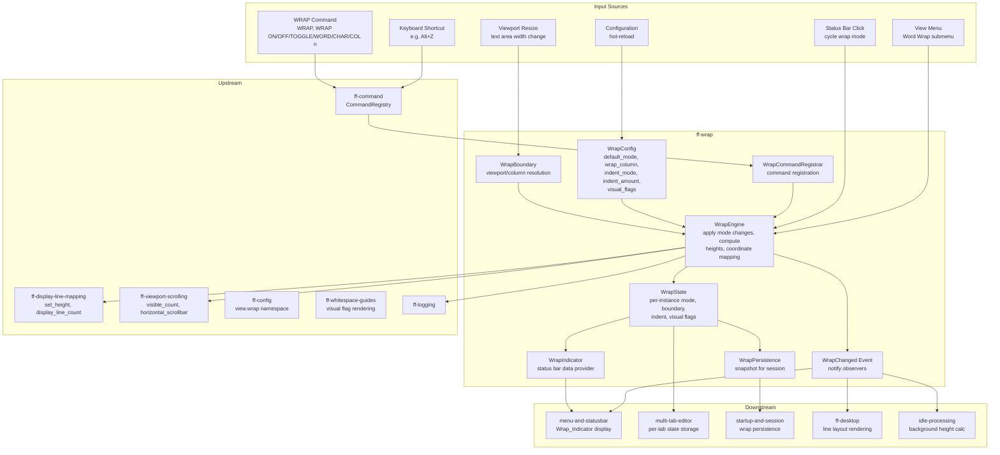

# Design Document: Line Wrap Toggle (`ff-wrap`)

## Overview

The `ff-wrap` crate is the **per-editor-instance line wrap management layer** for the FileForgeWorkbench platform. It controls whether and how long document lines are visually broken across multiple display rows to fit within a configured boundary width.

### Purpose

- Define and enforce the three-mode `WrapMode` enum: `None`, `Word`, `Character`
- Maintain per-editor-instance wrap state (mode, boundary, indent, visual flags)
- Process WRAP commands: ON, OFF, TOGGLE, WORD, CHAR, COL n
- Compute wrap boundaries (viewport-width dynamic or fixed-column static)
- Configure wrap indent for continuation lines (Fixed, Same, Indent, DeepIndent)
- Coordinate with display-line-mapping for sub-line height updates
- Coordinate with viewport-and-scrolling for scrollbar and viewport recalculation
- Provide wrap state for status bar indicator and View menu rendering
- Support session persistence of per-document wrap settings
- Manage wrap visual flags (continuation markers at line breaks)

### Position in Architecture

```
Wave 9 — Desktop Integration

┌─────────────────────────────────────────────────────────────┐
│                    Application Binary                         │
│                (ffwb / GUI shell — ff-desktop)                │
├─────────────────────────────────────────────────────────────┤
│  multi-tab-editor │ menu-and-statusbar │ startup-session     │
│  (consumers of wrap state)                                   │
├─────────────────────────────────────────────────────────────┤
│               ff-wrap (THIS CRATE) — Wave 9                  │
├─────────────────────────────────────────────────────────────┤
│  ff-display-line-mapping (Wave 4) │ ff-viewport-scrolling (4)│
│  ff-config (Wave 2) │ ff-command (Wave 2)                    │
│  ff-whitespace-guides (Wave 6) │ ff-logging (Wave 0)         │
└─────────────────────────────────────────────────────────────┘
```

### Design Constraints (Cross-Cutting)

- **GUI Independence (Req 2)**: Zero GUI framework dependencies — wrap logic is testable without egui/winit/wgpu
- **Command-Driven (Req 4)**: Wrap operations are registered commands (`view.wrap`, `view.nowrap`)
- **Multi-Crate Workspace (Req 7)**: Crate at `crates/ff-wrap`
- **Error Message Standards (Req 8)**: All errors follow `[wrap] operation: description` format
- **Configuration Namespace (Req 5)**: Wrap settings live under `[view.wrap]` in the configuration hierarchy

### Upstream Dependencies

- `ff-config` (Wave 2): TOML configuration for default wrap mode, wrap column, indent mode/amount, visual flags; hot-reload callbacks
- `ff-command` (Wave 2): Command registry for `WRAP` command registration; `ShortcutRegistry` for wrap keybindings
- `ff-display-line-mapping` (Wave 4): `DisplayLineMapping` trait for `set_height(doc_line, height)` calls when wrap state changes
- `ff-viewport-scrolling` (Wave 4): `ViewportModel` for visible line count recalculation; `HorizontalScrollbar` for show/hide on wrap toggle
- `ff-whitespace-guides` (Wave 6): Rendering infrastructure for wrap visual flag indicators (continuation markers)
- `ff-logging` (Wave 0): Diagnostic output for config warnings and wrap state transitions

### Downstream Consumers

- `ff-desktop` (GUI shell): Queries wrap boundary for rendering line layout; handles viewport-resize events
- `menu-and-statusbar`: Reads wrap state for the Wrap_Indicator display and View menu submenu
- `multi-tab-editor`: Stores per-tab `WrapState` instances; routes wrap operations to the active tab
- `startup-and-session`: Persists and restores per-document wrap settings
- `idle-processing`: Queries wrap state to determine which lines need background height recalculation

---

## Architecture

### High-Level Architecture Diagram



### Layer Placement

| Component | Responsibility |
|-----------|---------------|
| **WrapConfig** | Parsed configuration: default_mode, wrap_column, indent_mode, indent_amount, visual_flags; validates and emits warnings on load/reload |
| **WrapState** | Per-editor-instance mutable state: current `WrapMode`, `WrapBoundary`, `WrapIndentMode`, `WrapVisualFlags` |
| **WrapEngine** | Core logic: applies wrap operations (mode changes), computes display heights, coordinates with display-line-mapping and viewport |
| **WrapBoundary** | Resolves the effective wrap column from either viewport width or fixed column setting |
| **WrapCommandRegistrar** | Registers `view.wrap` command and wrap-related shortcuts in the command framework |
| **WrapIndicator** | Provides formatted wrap state string for status bar consumption |
| **WrapPersistence** | Serialisable wrap state snapshot tied to document URI |
| **WrapChanged Event** | Notification emitted after any wrap state mutation |

---

## Components and Interfaces

```
crates/ff-wrap/
├── Cargo.toml
├── src/
│   ├── lib.rs                # Public API re-exports, crate docs
│   ├── types.rs              # WrapMode, WrapBoundary, WrapIndentMode, WrapVisualFlags,
│   │                         #   WrapColumn newtypes
│   ├── config.rs             # WrapConfig: load, validate, hot-reload
│   ├── state.rs              # WrapState: per-instance wrap settings storage
│   ├── engine.rs             # WrapEngine: wrap operations, height computation,
│   │                         #   display-line-mapping coordination
│   ├── boundary.rs           # WrapBoundary resolution: viewport vs column
│   ├── commands.rs           # WrapCommandRegistrar: command + optional shortcut registration
│   ├── indicator.rs          # WrapIndicator: status bar data formatting
│   ├── persistence.rs        # WrapSnapshot: serialisation for session state
│   ├── events.rs             # WrapChanged event, WrapObserver trait
│   └── error.rs              # WrapError enum
└── tests/
    ├── config_tests.rs       # Config validation and hot-reload tests
    ├── engine_tests.rs       # Wrap operation and height computation tests
    ├── boundary_tests.rs     # Boundary resolution tests
    ├── commands_tests.rs     # Command registration and dispatch tests
    ├── indicator_tests.rs    # Indicator formatting tests
    ├── persistence_tests.rs  # Serialise/deserialise round-trip tests
    └── property_tests.rs     # Property-based tests (proptest)
```

---

## Data Models

### Core Types (`types.rs`)

```rust
/// The three wrap modes supported by the editor.
///
/// Addresses: Requirement 1 (Wrap Mode Enumeration)
#[derive(Debug, Clone, Copy, PartialEq, Eq, Hash, serde::Serialize, serde::Deserialize)]
#[non_exhaustive]
pub enum WrapMode {
    /// No wrapping — each document line occupies exactly one display row.
    /// Long lines extend beyond the viewport edge (horizontal scroll required).
    None,

    /// Word-boundary wrapping — lines break at word boundaries (whitespace,
    /// punctuation adjacent to alphanumeric). Falls back to character-level
    /// for words exceeding the boundary width.
    Word,

    /// Character-boundary wrapping — lines break at the exact character
    /// position that fills the boundary width.
    Character,
}

impl WrapMode {
    /// Whether wrap is currently active (not None).
    pub fn is_active(self) -> bool {
        !matches!(self, Self::None)
    }

    /// The default enabled mode used by WRAP ON / WRAP TOGGLE.
    pub const DEFAULT_ENABLED: Self = Self::Word;
}

impl Default for WrapMode {
    fn default() -> Self {
        Self::None
    }
}
```

```rust
/// The wrap boundary — determines at what column position wrapping occurs.
///
/// Addresses: Requirement 4 (Wrap Boundary)
#[derive(Debug, Clone, Copy, PartialEq, Eq, Hash, serde::Serialize, serde::Deserialize)]
pub enum WrapBoundary {
    /// Dynamic wrapping at the current text area width.
    /// Wrap positions adjust as the window is resized.
    Viewport,

    /// Static wrapping at a fixed column number regardless of viewport width.
    Column(WrapColumn),
}

impl Default for WrapBoundary {
    fn default() -> Self {
        Self::Viewport
    }
}

/// A validated wrap column number.
/// Invariant: value is in range [1, 10000].
///
/// Addresses: Requirement 4 AC 5, AC 7
#[derive(Debug, Clone, Copy, PartialEq, Eq, PartialOrd, Ord, Hash,
         serde::Serialize, serde::Deserialize)]
pub struct WrapColumn(u16);

impl WrapColumn {
    /// Maximum permitted wrap column value.
    pub const MAX: u16 = 10_000;

    /// Create a validated wrap column. Returns None if value is 0 or exceeds MAX.
    pub fn new(value: u16) -> Option<Self> {
        if value >= 1 && value <= Self::MAX {
            Some(Self(value))
        } else {
            Option::None
        }
    }

    /// Get the raw column value.
    pub fn value(self) -> u16 {
        self.0
    }
}
```

```rust
/// Wrap indent mode for continuation lines.
///
/// Controls how continuation sub-lines are indented relative to the
/// first sub-line of the wrapped document line.
///
/// Addresses: Requirement 5 (Wrap Indent for Continuation Lines)
#[derive(Debug, Clone, Copy, PartialEq, Eq, Hash, serde::Serialize, serde::Deserialize)]
#[non_exhaustive]
pub enum WrapIndentMode {
    /// Indent by a fixed number of characters from the left margin.
    /// Amount is defined by `wrap_indent_amount` config value.
    Fixed,

    /// Align with the first non-whitespace character of the first sub-line
    /// (matching the source line's indentation level).
    Same,

    /// Same as `Same` plus one additional indent level.
    Indent,

    /// Same as `Same` plus two additional indent levels.
    DeepIndent,
}

impl Default for WrapIndentMode {
    fn default() -> Self {
        Self::Fixed
    }
}
```

```rust
/// Wrap visual flags indicating where wrapping has occurred.
///
/// Addresses: Requirement 10 (Wrap Visual Flags)
#[derive(Debug, Clone, Copy, PartialEq, Eq, Hash, serde::Serialize, serde::Deserialize)]
#[non_exhaustive]
pub enum WrapVisualFlags {
    /// No visual markers at wrap break points.
    None,

    /// Indicator glyph at the right edge of sub-lines that continue.
    End,

    /// Indicator glyph at the left side of continuation lines.
    Start,

    /// Both Start and End indicators.
    StartEnd,

    /// Indicator in the line-number margin adjacent to continuation lines.
    Margin,
}

impl Default for WrapVisualFlags {
    fn default() -> Self {
        Self::None
    }
}
```

### WrapConfig

```rust
/// Configuration for the wrap subsystem, loaded from [view.wrap] TOML namespace.
///
/// Addresses: Requirement 12 (Configuration Defaults)
#[derive(Debug, Clone, PartialEq, Eq)]
pub struct WrapConfig {
    /// Initial WrapMode for new editor instances.
    /// Default: WrapMode::None.
    pub default_mode: WrapMode,

    /// Wrap boundary column. 0 = viewport width (dynamic).
    /// Positive integer = fixed column.
    /// Default: 0 (Viewport).
    pub wrap_column: WrapBoundary,

    /// Wrap indent mode for continuation lines.
    /// Default: Fixed.
    pub indent_mode: WrapIndentMode,

    /// Fixed indent amount in characters (used when indent_mode is Fixed).
    /// Valid range: 0–40. Default: 0.
    pub indent_amount: u8,

    /// Wrap visual flags (continuation markers).
    /// Default: None.
    pub visual_flags: WrapVisualFlags,
}

impl Default for WrapConfig {
    fn default() -> Self {
        Self {
            default_mode: WrapMode::None,
            wrap_column: WrapBoundary::Viewport,
            indent_mode: WrapIndentMode::Fixed,
            indent_amount: 0,
            visual_flags: WrapVisualFlags::None,
        }
    }
}

impl WrapConfig {
    /// Validate and normalise raw config values from TOML.
    /// Emits warnings for invalid values; applies defaults for missing/invalid keys.
    ///
    /// Addresses: Requirement 12 AC 1, AC 2
    pub fn from_raw(raw: RawWrapConfig) -> (Self, Vec<ConfigWarning>);

    /// Resolve the effective wrap boundary from config and viewport width.
    pub fn effective_boundary(&self, viewport_width_cols: u16) -> u16;
}

/// Raw configuration values before validation (direct from TOML parse).
#[derive(Debug, Clone, Default)]
pub struct RawWrapConfig {
    pub default_mode: Option<String>,
    pub wrap_column: Option<i64>,
    pub indent_mode: Option<String>,
    pub indent_amount: Option<i64>,
    pub visual_flags: Option<String>,
}

/// A configuration validation warning.
#[derive(Debug, Clone, PartialEq, Eq)]
pub struct ConfigWarning {
    pub key: String,
    pub message: String,
}
```

### WrapState

```rust
/// Per-editor-instance wrap state.
///
/// Each open document tab owns one WrapState. The wrap mode and settings
/// are independent across all editor instances.
///
/// Addresses: Requirement 2 (Per-Document Wrap State)
#[derive(Debug, Clone, PartialEq, Eq)]
pub struct WrapState {
    /// The current wrap mode for this editor instance.
    mode: WrapMode,

    /// The current wrap boundary (viewport or fixed column).
    boundary: WrapBoundary,

    /// The wrap indent mode for continuation lines.
    indent_mode: WrapIndentMode,

    /// The fixed indent amount (characters) when indent_mode is Fixed.
    indent_amount: u8,

    /// Visual flag style for continuation markers.
    visual_flags: WrapVisualFlags,

    /// The last active wrap mode before switching to None.
    /// Used by WRAP TOGGLE to restore the previous mode.
    last_active_mode: WrapMode,
}

impl WrapState {
    /// Create a new wrap state initialised from configuration defaults.
    ///
    /// Addresses: Requirement 2 AC 1, AC 2
    pub fn from_config(config: &WrapConfig) -> Self {
        Self {
            mode: config.default_mode,
            boundary: config.wrap_column,
            indent_mode: config.indent_mode,
            indent_amount: config.indent_amount,
            visual_flags: config.visual_flags,
            last_active_mode: WrapMode::Word,
        }
    }

    /// Get the current wrap mode.
    pub fn mode(&self) -> WrapMode {
        self.mode
    }

    /// Get the current wrap boundary.
    pub fn boundary(&self) -> WrapBoundary {
        self.boundary
    }

    /// Get the wrap indent mode.
    pub fn indent_mode(&self) -> WrapIndentMode {
        self.indent_mode
    }

    /// Get the fixed indent amount.
    pub fn indent_amount(&self) -> u8 {
        self.indent_amount
    }

    /// Get the visual flags setting.
    pub fn visual_flags(&self) -> WrapVisualFlags {
        self.visual_flags
    }

    /// Whether wrap is currently active (mode is not None).
    pub fn is_active(&self) -> bool {
        self.mode.is_active()
    }

    /// Set the wrap mode. Records previous active mode for toggle restore.
    pub(crate) fn set_mode(&mut self, mode: WrapMode) {
        if self.mode.is_active() {
            self.last_active_mode = self.mode;
        }
        self.mode = mode;
    }

    /// Set the wrap boundary.
    pub(crate) fn set_boundary(&mut self, boundary: WrapBoundary) {
        self.boundary = boundary;
    }

    /// Get the last active mode (for TOGGLE restoration).
    pub fn last_active_mode(&self) -> WrapMode {
        self.last_active_mode
    }
}
```

### WrapChanged Event

```rust
/// Event emitted after any wrap state mutation on an editor instance.
///
/// Addresses: Requirement 6 (Display-Line-Mapping Integration),
///            Requirement 7 (Horizontal Scrollbar Interaction)
#[derive(Debug, Clone, PartialEq, Eq)]
pub struct WrapChanged {
    /// The new wrap mode after the change.
    pub new_mode: WrapMode,

    /// The previous wrap mode before the change.
    pub previous_mode: WrapMode,

    /// The current wrap boundary.
    pub boundary: WrapBoundary,

    /// Whether the horizontal scrollbar visibility should change.
    pub scrollbar_visibility_changed: bool,

    /// Whether display line heights need full recalculation.
    pub heights_invalidated: bool,
}

/// Observer trait for wrap state changes.
pub trait WrapObserver: Send + Sync {
    /// Called after any wrap state mutation.
    fn on_wrap_changed(&self, event: &WrapChanged);
}
```

### WrapSnapshot (Persistence)

```rust
/// Serialisable wrap state for session persistence.
/// Stored alongside cursor position, scroll state, and zoom offset per document URI.
///
/// Addresses: Requirement 11 (Wrap Persistence in Session State)
#[derive(Debug, Clone, PartialEq, Eq, serde::Serialize, serde::Deserialize)]
pub struct WrapSnapshot {
    /// The wrap mode at time of snapshot.
    pub mode: String,

    /// The wrap boundary: "viewport" or a column number as string.
    pub boundary: String,
}

impl WrapSnapshot {
    /// Create a snapshot from the current wrap state.
    ///
    /// Addresses: Requirement 11 AC 1
    pub fn from_state(state: &WrapState) -> Self;

    /// Restore a WrapState from this snapshot, falling back to config defaults
    /// for unrecognised values.
    ///
    /// Addresses: Requirement 11 AC 2, AC 3
    pub fn restore(&self, config: &WrapConfig) -> WrapState;
}
```

### WrapOperation Enum

```rust
/// All possible wrap operations that can be dispatched via the WRAP command.
///
/// Addresses: Requirement 3 (WRAP Primary Command)
#[derive(Debug, Clone, PartialEq, Eq)]
pub enum WrapOperation {
    /// Enable wrap using Word mode (the default enabled mode).
    /// `WRAP ON`
    On,

    /// Disable wrap (set mode to None).
    /// `WRAP OFF`
    Off,

    /// Toggle: if None → Word; if Word/Character → None.
    /// `WRAP TOGGLE` or `WRAP` with no arguments.
    Toggle,

    /// Set mode to Word explicitly.
    /// `WRAP WORD`
    SetWord,

    /// Set mode to Character explicitly.
    /// `WRAP CHAR`
    SetCharacter,

    /// Set wrap column boundary.
    /// `WRAP COL n` (n=0 means viewport, n>0 means fixed column).
    SetColumn(u16),
}
```

---

## Public API Surface

### WrapEngine — Core Operations

```rust
/// The wrap engine applies wrap operations to a WrapState, coordinating
/// with display-line-mapping for height updates and viewport for scrollbar changes.
///
/// This is the single entry point for all wrap state mutations.
pub struct WrapEngine {
    config: WrapConfig,
}

impl WrapEngine {
    /// Create a wrap engine with the given configuration.
    pub fn new(config: WrapConfig) -> Self;

    /// Get the current configuration.
    pub fn config(&self) -> &WrapConfig;

    /// Update the configuration (e.g., from hot-reload).
    /// New defaults apply only to newly opened documents.
    ///
    /// Addresses: Requirement 12 AC 3
    pub fn set_config(&mut self, config: WrapConfig);

    /// Enable wrap on the active editor instance.
    /// If already active, returns a confirmation message without state change.
    ///
    /// Addresses: Requirement 3 AC 2, AC 9
    pub fn wrap_on(&self, state: &mut WrapState) -> Result<WrapChanged, WrapError>;

    /// Disable wrap on the active editor instance.
    /// If already off, returns a confirmation message without state change.
    ///
    /// Addresses: Requirement 3 AC 3, AC 10
    pub fn wrap_off(&self, state: &mut WrapState) -> Result<WrapChanged, WrapError>;

    /// Toggle wrap: None → Word; Word/Character → None.
    ///
    /// Addresses: Requirement 3 AC 4, AC 5
    pub fn wrap_toggle(&self, state: &mut WrapState) -> Result<WrapChanged, WrapError>;

    /// Set wrap mode to Word explicitly.
    ///
    /// Addresses: Requirement 3 AC 6
    pub fn wrap_word(&self, state: &mut WrapState) -> Result<WrapChanged, WrapError>;

    /// Set wrap mode to Character explicitly.
    ///
    /// Addresses: Requirement 3 AC 7
    pub fn wrap_char(&self, state: &mut WrapState) -> Result<WrapChanged, WrapError>;

    /// Set a fixed wrap column, or revert to viewport-width wrapping (col=0).
    ///
    /// Addresses: Requirement 4 AC 6
    pub fn wrap_column(
        &self,
        state: &mut WrapState,
        column: u16,
    ) -> Result<WrapChanged, WrapError>;

    /// Compute the display height (number of sub-lines) for a single line
    /// given its content width and the effective wrap boundary.
    ///
    /// Addresses: Requirement 6 AC 1
    pub fn compute_line_height(
        &self,
        state: &WrapState,
        line_width_chars: usize,
        viewport_width_cols: u16,
    ) -> u32;

    /// Determine if the horizontal scrollbar should be visible given
    /// the current wrap state.
    ///
    /// Addresses: Requirement 7 AC 1–5
    pub fn should_show_horizontal_scrollbar(
        &self,
        state: &WrapState,
        viewport_width_cols: u16,
    ) -> bool;

    /// Create a new WrapState with the configured defaults.
    ///
    /// Addresses: Requirement 2 AC 1, AC 2
    pub fn new_state(&self) -> WrapState;

    /// Resolve the effective wrap column (in characters) given the current
    /// state and viewport width.
    ///
    /// Addresses: Requirement 4 AC 1–4
    pub fn effective_wrap_column(
        &self,
        state: &WrapState,
        viewport_width_cols: u16,
    ) -> u16;

    /// Compute the indent offset for continuation lines given the current
    /// indent mode and a line's leading whitespace.
    ///
    /// Addresses: Requirement 5 AC 1–9
    pub fn continuation_indent(
        &self,
        state: &WrapState,
        first_non_ws_col: usize,
        indent_width: u8,
    ) -> usize;
}
```

### WrapCommandRegistrar — Command Integration

```rust
/// Registers wrap commands with the command framework.
///
/// Addresses: Requirement 3 AC 1
pub struct WrapCommandRegistrar;

impl WrapCommandRegistrar {
    /// Register the WRAP primary command in the command registry.
    ///
    /// Commands registered:
    /// - `view.wrap` — WRAP primary command (ON/OFF/TOGGLE/WORD/CHAR/COL n)
    ///
    /// Command metadata:
    /// - Name: "WRAP"
    /// - Category: "View"
    /// - Valid in: Browse, Edit, View, all special modes
    /// - Undoable: false
    /// - History: false (not recorded in command history)
    ///
    /// Addresses: Requirement 3 AC 1, AC 11, AC 12, AC 13
    pub fn register_commands(registry: &mut CommandRegistry);
}
```

### WrapCommandHandler — Command Dispatch

```rust
/// Handles the `view.wrap` primary command dispatch.
///
/// Parses command arguments and routes to the appropriate WrapEngine method.
///
/// Supported forms:
/// - `WRAP` — toggle (no arguments)
/// - `WRAP ON` — enable wrap (Word mode)
/// - `WRAP OFF` — disable wrap
/// - `WRAP TOGGLE` — explicit toggle
/// - `WRAP WORD` — set Word mode
/// - `WRAP CHAR` — set Character mode
/// - `WRAP COL n` — set fixed column (n=0 reverts to viewport)
///
/// Addresses: Requirement 3
pub struct WrapCommandHandler;

impl WrapCommandHandler {
    /// Parse WRAP command arguments into a WrapOperation.
    ///
    /// Addresses: Requirement 3 AC 14
    pub fn parse_args(args: &str) -> Result<WrapOperation, WrapError>;

    /// Format the status message for a completed wrap operation.
    ///
    /// Addresses: Requirement 3 AC 8
    pub fn format_status_message(state: &WrapState) -> String;
}
```

### WrapIndicator — Status Bar Data

```rust
/// Provides formatted wrap data for the status bar.
///
/// Addresses: Requirement 8 (Status Bar Wrap Indicator)
pub struct WrapIndicator;

impl WrapIndicator {
    /// Format the wrap mode for status bar display.
    /// Returns None when mode is None (indicator hidden per Req 8 AC 3).
    ///
    /// Returns:
    /// - Some("Wrap: Word") when mode is Word
    /// - Some("Wrap: Char") when mode is Character
    /// - None when mode is None
    ///
    /// Addresses: Requirement 8 AC 1, AC 2, AC 3
    pub fn format_indicator(state: &WrapState) -> Option<String>;

    /// Compute the next wrap mode in the cycle for status bar click.
    /// None → Word → Character → None
    ///
    /// Addresses: Requirement 8 AC 5
    pub fn next_mode_in_cycle(current: WrapMode) -> WrapMode;
}
```

### WrapPersistence — Session Integration

```rust
impl WrapSnapshot {
    /// Create a snapshot from the current state for session persistence.
    ///
    /// Addresses: Requirement 11 AC 1
    pub fn from_state(state: &WrapState) -> Self;

    /// Restore wrap state from a persisted snapshot, clamping/defaulting
    /// for unrecognised values.
    ///
    /// Addresses: Requirement 11 AC 2, AC 3, AC 5
    pub fn restore(&self, config: &WrapConfig) -> WrapState;
}
```

---

## Error Handling

```rust
/// Errors originating from the ff-wrap crate.
/// Formatted per Error Message Standards: `[wrap] operation: description`
///
/// Addresses: Cross-cutting Requirement 8
#[derive(Debug, thiserror::Error)]
#[non_exhaustive]
pub enum WrapError {
    /// Invalid sub-command provided to WRAP command.
    #[error("[wrap] command: invalid sub-command '{arg}' — valid: ON, OFF, TOGGLE, WORD, CHAR, COL <n>")]
    InvalidSubCommand { arg: String },

    /// Invalid column value for WRAP COL command.
    #[error("[wrap] command: invalid column '{value}' — must be 0–10000")]
    InvalidColumn { value: String },

    /// Configuration key has invalid value.
    #[error("[wrap] config: key '{key}' has invalid value '{value}' — using default '{default}'")]
    InvalidConfig {
        key: String,
        value: String,
        default: String,
    },

    /// Wrap column out of valid range in configuration.
    #[error("[wrap] config: wrap_column {value} is out of range (0–10000) — using default (viewport)")]
    ColumnOutOfRange { value: i64 },

    /// Indent amount out of valid range.
    #[error("[wrap] config: indent_amount {value} is out of range (0–40) — clamped to {clamped}")]
    IndentAmountOutOfRange { value: i64, clamped: u8 },

    /// No active editor instance to apply wrap operation to.
    #[error("[wrap] apply: no active editor instance")]
    NoActiveEditor,

    /// Session restore encountered an unrecognised wrap mode.
    #[error("[wrap] restore: unrecognised mode '{mode}' — falling back to None")]
    UnrecognisedPersistedMode { mode: String },
}
```

---

## Integration Points

### With `ff-document-model` (Document Model — Wave 4, upstream)

- **Dependency direction**: ff-wrap depends on ff-document-model (for line content queries)
- **API consumed**: `DocumentModel::line_width(doc_line)` to determine how many characters a line contains for height calculation; `DocumentModel::line_count()` for bulk height updates
- **Coordination**: When a line is edited while wrap is active, the editor session triggers `WrapEngine::compute_line_height()` for the modified line and updates display-line-mapping if the height changed (Requirement 6 AC 3)
- **Change notifications**: ff-wrap listens for document content changes (via the editor session coordinator) to re-evaluate affected line heights

### With `ff-display-line-mapping` (Display Line Mapping — Wave 4, upstream)

- **Dependency direction**: ff-wrap depends on ff-display-line-mapping
- **API consumed**: `DisplayLineMapping::set_height(doc_line, height)` to update per-line display heights when wrap mode changes or boundaries shift
- **Bulk updates**: When wrap mode transitions from None → active, ff-wrap iterates visible lines and calls `set_height` for each with the computed sub-line count (Requirement 6 AC 1)
- **Reset**: When wrap mode transitions from active → None, ff-wrap calls `set_height(line, 1)` for all lines, potentially triggering the mapping layer to return to one-to-one mode (Requirement 6 AC 2)
- **Incremental updates**: When viewport resizes or a line is edited, only affected lines are recomputed (Requirement 6 AC 3, AC 4)
- **Provisional heights**: Until idle-processing computes accurate heights for off-screen lines, display-line-mapping assumes height 1 (Requirement 6 AC 6)

### With `ff-viewport-scrolling` (Viewport & Scrolling — Wave 4, peer)

- **Dependency direction**: ff-viewport-scrolling is a peer; the owning editor session coordinates between them
- **Integration**: When wrap mode changes, the editor session:
  1. Updates display-line-mapping heights
  2. Recomputes `total_display_lines` from the mapping
  3. Calls `ViewportModel::set_total_lines(total_display_lines)` to update the vertical scrollbar range
  4. Shows or hides the horizontal scrollbar based on `WrapEngine::should_show_horizontal_scrollbar()`
  5. Resets `horizontal_offset` to 0 when wrap activates with Viewport boundary (Requirement 7 AC 1)
- **Resize handling**: When viewport width changes, the session calls `WrapEngine::compute_line_height()` for all visible lines and updates display-line-mapping, which propagates to the vertical scrollbar (Requirement 4 AC 2)

### With `ff-config` (Configuration System — Wave 2, upstream)

- **Dependency direction**: ff-wrap depends on ff-config
- **API consumed**: Typed access for `[view.wrap]` namespace: `get_string("view.wrap.default_mode")`, `get_int("view.wrap.wrap_column")`, `get_string("view.wrap.indent_mode")`, `get_int("view.wrap.indent_amount")`, `get_string("view.wrap.visual_flags")`
- **Hot-reload**: ff-wrap registers a reload callback for the `view.wrap` namespace. When config changes, it rebuilds `WrapConfig` and emits warnings for invalid values. New defaults apply only to newly opened documents — already-open documents retain their current settings (Requirement 12 AC 3)
- **Schema registration**: At startup, ff-wrap registers schema entries for all `view.wrap.*` keys with types, defaults, and valid ranges
- **Layered overrides**: Configuration supports workspace → user → project override chain (Requirement 12 AC 4)

### With `ff-command` (Command Framework — Wave 2, upstream)

- **Dependency direction**: ff-wrap depends on ff-command
- **API consumed**: `CommandRegistry::register()` for command registration; `CommandId` for identity
- **Commands registered**:
  - `view.wrap` — metadata: "WRAP", category: "View", valid in all modes
- **Undo integration**: WRAP commands are NOT recorded on the undo stack (Requirement 3 AC 12). They do not produce `UndoRecord` values
- **History**: WRAP commands are NOT added to command history (Requirement 3 AC 13)
- **Error handling**: Invalid sub-commands produce an error message listing valid options (Requirement 3 AC 14)

### With `ff-whitespace-guides` (Whitespace & Guides — Wave 6, upstream)

- **Dependency direction**: ff-wrap depends on ff-whitespace-guides (for visual flag rendering infrastructure)
- **Integration**: Wrap visual flag indicators are rendered using the whitespace-and-guides rendering pipeline. ff-wrap provides the flag type and position data; the rendering system draws the appropriate glyphs using the configured foreground colour (Requirement 10 AC 7)
- **Glyph definitions**: ff-wrap defines which glyphs to use (bent arrow, pilcrow, etc.); the whitespace-guides system renders them

### With `menu-and-statusbar` (Wave 6, downstream consumer)

- **Dependency direction**: menu-and-statusbar depends on ff-wrap (reads wrap state)
- **API consumed**: `WrapIndicator::format_indicator()` for status bar display; `WrapState::mode()` for menu checkmark state; `WrapIndicator::next_mode_in_cycle()` for click behaviour
- **Indicator position**: After line/column display, before other mode indicators (Requirement 8 AC 4)
- **View menu**: "Word Wrap" submenu with radio items "Off"/"Word"/"Character" (Requirement 9 AC 1, AC 2)
- **Click action**: Status bar click cycles through modes (Requirement 8 AC 5)

### With `multi-tab-editor` (Wave 8, downstream consumer)

- **Dependency direction**: multi-tab-editor depends on ff-wrap
- **Integration**: Each editor tab stores a `WrapState` instance. When the user switches tabs, the tab manager notifies the status bar and View menu to update to the new tab's wrap mode (Requirement 2 AC 4; Requirement 8 AC 6)
- **Tab creation**: New tabs initialise their `WrapState` via `WrapEngine::new_state()` which applies the configured `default_mode` (Requirement 2 AC 2)
- **Independence**: Changing wrap on one tab has no effect on other tabs (Requirement 2 AC 3)

### With `startup-and-session` (Wave 8, downstream consumer)

- **Dependency direction**: startup-and-session depends on ff-wrap
- **API consumed**: `WrapSnapshot::from_state()` to capture wrap state on exit; `WrapSnapshot::restore()` to reinstate wrap on session restore
- **Storage**: Per-document wrap mode and boundary are stored alongside cursor/scroll/zoom state in the session store, keyed by document resource URI (Requirement 11 AC 4)
- **Fallback**: Missing or unrecognised persisted values fall back to `None` mode with a warning (Requirement 11 AC 3)

### With `idle-processing` (Wave 15, downstream consumer)

- **Dependency direction**: idle-processing depends on ff-wrap
- **Integration**: For large documents, wrap height recalculation is performed incrementally in background idle cycles. Only visible and near-viewport lines are computed immediately; remaining lines are queued for idle computation (Requirement 6 AC 5)
- **API consumed**: `WrapEngine::compute_line_height()` called per-line during idle cycles; results are pushed to display-line-mapping via `set_height()`
- **Priority**: Off-screen lines are lower priority than user-facing work

### With `ff-logging` (Foundation — Wave 0, upstream)

- **Dependency direction**: ff-wrap depends on ff-logging
- **API consumed**: `log_info!`, `log_warn!`, `log_debug!` macros
- **Usage**: Config validation warnings at WARN; wrap mode transitions at INFO; boundary recalculations at DEBUG
- **Log prefix**: `[wrap]`

### Dependency Direction Summary

```
ff-logging               ← ff-wrap
ff-config                ← ff-wrap
ff-command               ← ff-wrap
ff-display-line-mapping  ← ff-wrap
ff-viewport-scrolling    ↔ ff-wrap (coordinated via editor session)
ff-whitespace-guides     ← ff-wrap
ff-wrap                  ← multi-tab-editor (per-tab state)
ff-wrap                  ← menu-and-statusbar (indicator + menu)
ff-wrap                  ← startup-and-session (persistence)
ff-wrap                  ← idle-processing (background height calc)
ff-wrap                  ← ff-desktop (rendering queries)
```

---

## Configuration

ff-wrap owns the `[view.wrap]` namespace in the workbench TOML configuration file.

### TOML Schema

```toml
[view.wrap]
# Initial wrap mode for new editor instances.
# Type: string. Default: "none". Values: "none", "word", "character"
default_mode = "none"

# Wrap boundary column. 0 = viewport width (dynamic).
# Positive integer = fixed column. Default: 0.
# Valid range: 0–10000.
wrap_column = 0

# Wrap indent mode for continuation lines.
# Type: string. Default: "fixed". Values: "fixed", "same", "indent", "deep_indent"
indent_mode = "fixed"

# Fixed indent amount in characters (used when indent_mode is "fixed").
# Type: integer. Default: 0. Valid range: 0–40.
indent_amount = 0

# Wrap visual flags (continuation markers).
# Type: string. Default: "none". Values: "none", "end", "start", "start_end", "margin"
visual_flags = "none"
```

### Config Resolution Rules

| Setting | Absent | Invalid Type | Out of Range | Semantic Error |
|---------|--------|--------------|--------------|----------------|
| `default_mode` | Default to "none" | Default to "none" + WARN | — (enum, no range) | Unrecognised value → "none" + WARN |
| `wrap_column` | Default to 0 | Default to 0 + WARN | Negative or >10000 → 0 + WARN | — |
| `indent_mode` | Default to "fixed" | Default to "fixed" + WARN | — (enum, no range) | Unrecognised value → "fixed" + WARN |
| `indent_amount` | Default to 0 | Default to 0 + WARN | <0 → clamp 0 + WARN; >40 → clamp 40 + WARN | — |
| `visual_flags` | Default to "none" | Default to "none" + WARN | — (enum, no range) | Unrecognised value → "none" + WARN |

---

## Correctness Properties

The following properties are suitable for property-based testing with the `proptest` crate. Each property is universal — it must hold for all valid inputs.

### Property 1: Wrap Mode Idempotency

**Statement:** Applying the same wrap operation twice produces the same state as applying it once (no double-transitions or state corruption).

```
∀ WrapState S, ∀ mode ∈ {Word, Character, None}:
    let S1 = apply(set_mode(mode), S);
    let S2 = apply(set_mode(mode), S1);
    S1 == S2
```

**Validates: Requirements 1.1, 3.9, 3.10**

### Property 2: Toggle Involution

**Statement:** Toggling wrap twice (when no mode change occurs between toggles) returns the state to its original WrapMode.

```
∀ WrapState S where S.mode ∈ {None, Word}:
    let S1 = toggle(S);
    let S2 = toggle(S1);
    S2.mode == S.mode
```

**Validates: Requirements 3.4, 3.5**

### Property 3: Display Height Non-Zero

**Statement:** The computed display height for any line is always at least 1, regardless of line width, wrap mode, or boundary settings.

```
∀ line_width ∈ [0, usize::MAX], ∀ WrapState S, ∀ viewport_width ∈ [1, 10000]:
    compute_line_height(S, line_width, viewport_width) >= 1
```

**Validates: Requirements 6.1, 6.2**

### Property 4: Unwrapped Height Is Always One

**Statement:** When wrap mode is None, every line has display height exactly 1 regardless of content width.

```
∀ line_width ∈ [0, usize::MAX], ∀ viewport_width ∈ [1, 10000]:
    let S = WrapState { mode: None, .. };
    compute_line_height(S, line_width, viewport_width) == 1
```

**Validates: Requirements 1.2, 6.2**

### Property 5: Wrap Column Validation

**Statement:** A validated WrapColumn always has value in [1, 10000]. Creating a WrapColumn with 0 or >10000 returns None.

```
∀ value ∈ u16:
    WrapColumn::new(value).is_some() ↔ (value >= 1 ∧ value <= 10000)
```

**Validates: Requirements 4.5, 4.7**

### Property 6: Horizontal Scrollbar Visibility Rule

**Statement:** When wrap is active with Viewport boundary, the horizontal scrollbar is hidden. When wrap is None, it is visible. When wrap is active with Column(n) boundary and viewport < n, it is visible.

```
∀ WrapState S, ∀ viewport_width ∈ [1, 10000]:
    should_show_horizontal_scrollbar(S, viewport_width) ==
        match (S.mode, S.boundary) {
            (None, _) => true,
            (_, Viewport) => false,
            (_, Column(n)) => viewport_width < n.value(),
        }
```

**Validates: Requirements 7.1, 7.3, 7.4, 7.5**

### Property 7: Configuration Roundtrip

**Statement:** A WrapConfig produced from `from_raw` always has valid field values within their documented ranges.

```
∀ RawWrapConfig R:
    let (config, _warnings) = WrapConfig::from_raw(R);
    config.indent_amount <= 40
    ∧ matches!(config.wrap_column, Viewport | Column(c) where c.value() <= 10000)
    ∧ matches!(config.default_mode, None | Word | Character)
    ∧ matches!(config.indent_mode, Fixed | Same | Indent | DeepIndent)
    ∧ matches!(config.visual_flags, None | End | Start | StartEnd | Margin)
```

**Validates: Requirements 12.1, 12.2**

### Property 8: Persistence Roundtrip

**Statement:** Snapshotting a WrapState and restoring it produces a state with the same mode and boundary (modulo config-driven clamping).

```
∀ WrapState S, ∀ WrapConfig C:
    let snap = WrapSnapshot::from_state(&S);
    let restored = snap.restore(&C);
    restored.mode == S.mode ∧ restored.boundary == S.boundary
    (assuming S.mode is a recognised variant and S.boundary is valid)
```

**Validates: Requirements 11.1, 11.2**

### Property 9: Continuation Indent Reduces Effective Width

**Statement:** The continuation indent offset is always less than the effective wrap column, ensuring at least one character of content per sub-line.

```
∀ WrapState S where S.mode.is_active(),
∀ first_non_ws ∈ [0, 200], ∀ indent_width ∈ [1, 8],
∀ viewport_width ∈ [10, 10000]:
    let indent = continuation_indent(S, first_non_ws, indent_width);
    let effective_col = effective_wrap_column(S, viewport_width);
    indent < effective_col as usize
```

**Validates: Requirements 5.9**

### Property 10: Per-Instance Independence

**Statement:** Applying a wrap operation to one WrapState does not affect any other WrapState instance (states are value types with no shared mutation).

```
∀ WrapState S1, WrapState S2, ∀ WrapOperation O:
    let S2_before = S2.clone();
    apply(O, &mut S1);
    S2 == S2_before
```

**Validates: Requirements 2.3**

---

## Testing Strategy

### Unit Tests

Unit tests are organised per module and cover specific behaviour:

- **config_tests.rs**: Validate WrapConfig parsing from raw TOML values — correct defaults, clamping, warning generation for invalid values
- **engine_tests.rs**: WrapEngine operations — mode transitions (on/off/toggle/word/char), height computation for known inputs, scrollbar visibility logic, continuation indent calculations
- **boundary_tests.rs**: WrapBoundary resolution — viewport mode returns viewport width, column mode returns fixed value, edge cases (column wider than viewport, column = viewport width)
- **commands_tests.rs**: WrapCommandHandler argument parsing — valid sub-commands, invalid sub-commands, COL parsing with valid/invalid integers
- **indicator_tests.rs**: WrapIndicator formatting — "Wrap: Word", "Wrap: Char", None for mode None, cycle logic
- **persistence_tests.rs**: WrapSnapshot serialisation/deserialisation roundtrips, fallback behaviour for unrecognised values

### Property-Based Tests

Property tests use `proptest` with a minimum of 256 cases per property. All ten correctness properties defined above are implemented in `tests/property_tests.rs`. Strategies generate:

- Arbitrary `WrapMode` values (uniform selection from all three variants)
- Arbitrary `WrapBoundary` values (Viewport or Column with value in [1, 10000])
- Arbitrary `WrapState` instances (composed from mode + boundary + indent settings)
- Arbitrary line widths (0 to 100_000 characters)
- Arbitrary viewport widths (1 to 10_000 columns)
- Arbitrary `RawWrapConfig` values (including invalid/out-of-range values)

### Integration Tests

Integration tests validate coordination between ff-wrap and its upstream dependencies:

- **Display-line-mapping integration**: Wrap mode change triggers correct `set_height` calls; bulk reset to height 1 on wrap disable
- **Viewport coordination**: Horizontal scrollbar hide/show on mode transitions; viewport resize triggers height recomputation
- **Command dispatch**: WRAP command registered and callable via command framework; status messages returned correctly
- **Session roundtrip**: Wrap state snapshot → persist → restore cycle preserves mode and boundary
