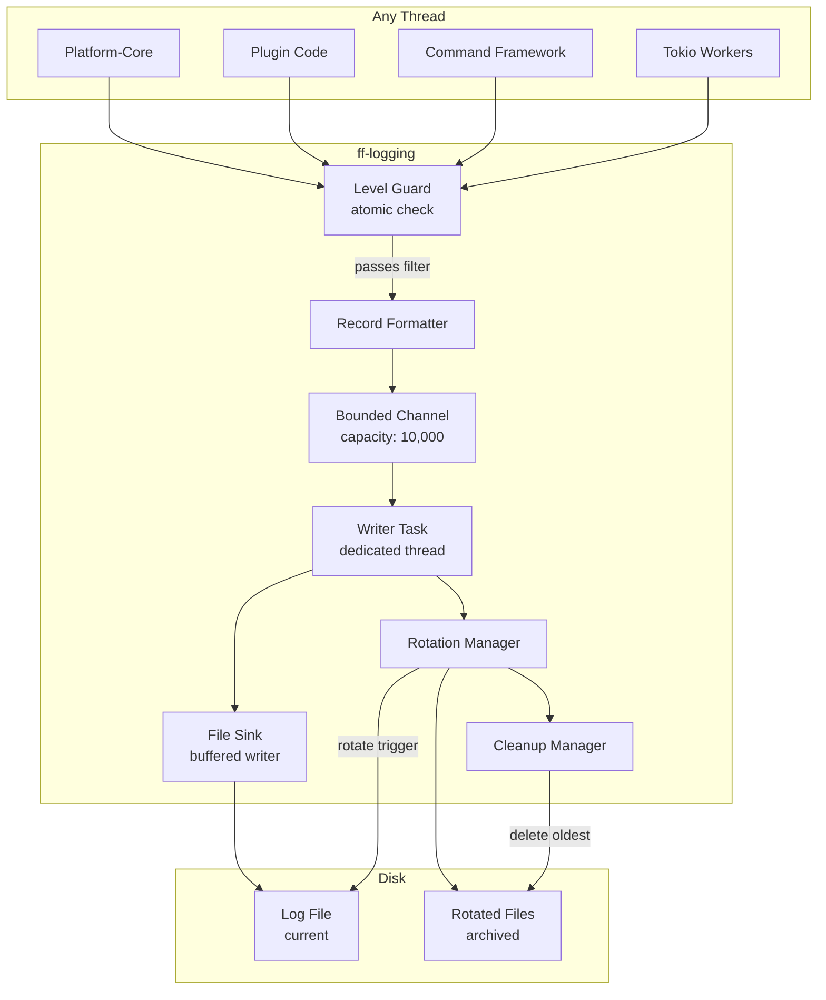

# Design Document: Logging Subsystem (`ff-logging`)

## 1. Overview

The `ff-logging` crate is the **foundational logging subsystem** for the FileForgeWorkbench workspace. It provides structured, file-based diagnostic output for every crate in the workspace — platform-core, command-framework, plugin-architecture, workflow-engine, document-model, and all plugins.

### Purpose

- Provide a single, unified log stream for the entire workbench application
- Write all diagnostic output to persistent log files (no console dependency)
- Support configurable levels, structured formatting, automatic rotation, and graceful degradation
- Operate safely from any thread (including Tokio worker threads) without blocking the GUI render loop

### Position in Architecture

```
Wave 0 — Foundation (no upstream dependencies)

┌─────────────────────────────────────────────────────────┐
│                    Application Binary                     │
│              (fileforge-desktop / GUI shell)              │
├─────────────────────────────────────────────────────────┤
│  platform-core │ command-framework │ plugin-architecture │
│  workflow-engine │ document-model │ all other crates     │
├─────────────────────────────────────────────────────────┤
│                     ff-logging (this crate)               │
│              Initialized FIRST, shut down LAST            │
└─────────────────────────────────────────────────────────┘
```

### Design Constraints (Cross-Cutting)

- **FFW-ARCH-001**: Does not access content through VFS (logging writes its own diagnostic files independently)
- **GUI Independence (Req 2)**: Zero GUI dependencies — no egui, no windowing crate imports
- **Plugin Architecture (Req 3)**: Exposes a `PluginLogHandle` trait object for plugins via `PluginContext`
- **Async I/O (Req 6)**: Log calls never block the GUI thread; uses async channel to decouple production from I/O
- **Multi-Crate Workspace (Req 7)**: Crate at `crates/ff-logging`
- **Error Message Standards (Req 8)**: Consistent structured format for all log records

---

## 2. Architecture

### High-Level Architecture Diagram



### Layer Placement

| Layer | Role |
|-------|------|
| **Caller Interface** | Log macros + `PluginLogHandle` trait — zero-cost level guard, format-on-pass |
| **Channel Layer** | Bounded MPSC channel (10,000 slots) decoupling producers from I/O |
| **Writer Thread** | Single dedicated OS thread consuming channel, writing to buffered file sink |
| **Rotation Layer** | Size-based rotation, file naming, retention cleanup |
| **Fallback Layer** | No-op sink when file I/O is unavailable; diagnostic flag for GUI status bar |

---

## 3. Module Structure

```
crates/ff-logging/
├── Cargo.toml
├── src/
│   ├── lib.rs              # Public API re-exports, crate docs
│   ├── config.rs           # LogConfig struct, TOML deserialization, defaults
│   ├── level.rs            # LogLevel enum, ordering, parsing
│   ├── record.rs           # LogRecord struct, formatting, truncation, escaping
│   ├── channel.rs          # Bounded MPSC channel, overflow handling, drop counter
│   ├── writer.rs           # Writer thread, buffered I/O, flush strategies
│   ├── rotation.rs         # File rotation logic, naming, size tracking
│   ├── cleanup.rs          # Retention policy, oldest-file deletion
│   ├── sink.rs             # FileSink + NoopSink implementations
│   ├── init.rs             # Initialization sequence, directory creation, fallback
│   ├── shutdown.rs         # Graceful shutdown, panic hook, flush timeout
│   ├── plugin_handle.rs    # PluginLogHandle trait + concrete impl
│   ├── macros.rs           # log_trace!, log_debug!, log_info!, log_warn!, log_error!
│   └── error.rs            # LoggingError enum
└── tests/
    ├── format_tests.rs     # Record formatting property tests
    ├── rotation_tests.rs   # Rotation logic property tests
    ├── channel_tests.rs    # Channel overflow property tests
    └── integration.rs      # End-to-end initialization and write tests
```

---

## 4. Key Data Models and Types

### LogLevel

```rust
/// Severity levels in ascending order.
/// Addresses: Requirement 3 (level filtering), Requirement 2 (format output)
#[derive(Debug, Clone, Copy, PartialEq, Eq, PartialOrd, Ord, Hash)]
#[non_exhaustive]
pub enum LogLevel {
    Trace = 0,
    Debug = 1,
    Info = 2,
    Warn = 3,
    Error = 4,
}
```

### LogRecord

```rust
/// A single structured log entry.
/// Addresses: Requirement 2 (record format)
#[derive(Debug, Clone)]
pub struct LogRecord {
    /// Timestamp with millisecond precision in local time
    pub timestamp: chrono::DateTime<chrono::Local>,
    /// Severity level
    pub level: LogLevel,
    /// Source module path (e.g., "ff_core::file_engine" or "plugin:my-plugin::module")
    pub module_path: String,
    /// Message body (pre-truncation, pre-escape)
    pub message: String,
}
```

### LogConfig

```rust
/// Configuration for the logging subsystem, sourced from `[logging]` in Workbench_Config.
/// Addresses: Requirements 3, 4, 5
#[derive(Debug, Clone)]
pub struct LogConfig {
    /// Minimum log level (default: Info)
    pub level: LogLevel,
    /// Log directory path (absolute or relative)
    pub directory: PathBuf,
    /// Maximum single file size in MB before rotation (default: 10, range 1–1024)
    pub max_file_size_mb: u32,
    /// Maximum number of retained log files (default: 5, range 1–100)
    pub max_retained_files: u32,
}
```

### LogSubsystem (internal state)

```rust
/// The runtime state of the logging subsystem.
/// NOT public — accessed via module-level functions and the global static.
pub(crate) struct LogSubsystem {
    /// Current minimum level (atomic for lock-free reads)
    level: AtomicU8,
    /// Sender half of the bounded channel
    sender: crossbeam_channel::Sender<ChannelMessage>,
    /// Cumulative count of dropped records (atomic, readable from any thread)
    dropped_count: AtomicU64,
    /// Whether the subsystem is in fallback (no-op) mode
    is_fallback: AtomicBool,
    /// Handle to the writer thread for join on shutdown
    writer_handle: Option<std::thread::JoinHandle<()>>,
}
```

### ChannelMessage

```rust
/// Messages sent through the internal channel.
pub(crate) enum ChannelMessage {
    /// A log record to write
    Record(FormattedRecord),
    /// Flush all buffered records to disk
    Flush,
    /// Shutdown the writer thread
    Shutdown,
}
```

### FormattedRecord

```rust
/// A pre-formatted log line ready for writing to disk.
/// Formatting happens on the caller's thread to distribute CPU cost.
pub(crate) struct FormattedRecord {
    /// The fully formatted line (including newline)
    pub line: String,
    /// The level of this record (for flush-on-warn/error decision)
    pub level: LogLevel,
}
```

---

## 5. Public API Surface

### Initialization and Shutdown

```rust
/// Initialize the logging subsystem. Must be called once, before any other subsystem.
/// Creates the log directory, opens the initial log file, spawns the writer thread.
/// On failure, falls back to no-op mode (Requirement 1, criteria 3/4/5/6).
///
/// # Errors
/// Never returns an error — degrades gracefully to no-op sink.
pub fn init(config: LogConfig) -> LoggingStatus;

/// Initialize with default configuration (for use when config-system is unavailable).
pub fn init_default() -> LoggingStatus;

/// Gracefully shut down the logging subsystem.
/// Flushes all buffered records, writes shutdown message, closes file.
/// Blocks for up to 5 seconds (Requirement 6, criterion 6).
pub fn shutdown();

/// Install panic hook that attempts to flush logs within 500ms.
/// Called automatically by `init()`. (Requirement 6, criterion 4)
pub fn install_panic_hook();
```

### Logging Functions

```rust
/// Write a log record. Level check is performed atomically before formatting.
/// (Requirement 3, criterion 5 — no allocation if filtered)
pub fn log(level: LogLevel, module_path: &str, message: &str);

/// Write a log record with lazy message formatting.
/// The closure is only evaluated if the level passes the filter.
pub fn log_lazy(level: LogLevel, module_path: &str, f: impl FnOnce() -> String);
```

### Log Macros

```rust
/// Zero-cost log macros that check level before evaluating format args.
/// Addresses: Requirement 3 criterion 5, Requirement 9 criterion 5
#[macro_export]
macro_rules! log_trace { ($($arg:tt)*) => { ... }; }
#[macro_export]
macro_rules! log_debug { ($($arg:tt)*) => { ... }; }
#[macro_export]
macro_rules! log_info { ($($arg:tt)*) => { ... }; }
#[macro_export]
macro_rules! log_warn { ($($arg:tt)*) => { ... }; }
#[macro_export]
macro_rules! log_error { ($($arg:tt)*) => { ... }; }
```

### Status and Diagnostics

```rust
/// Status returned by `init()`.
#[derive(Debug, Clone, Copy, PartialEq, Eq)]
pub enum LoggingStatus {
    /// File sink active, logging normally
    Active,
    /// Fell back to no-op sink (no file I/O)
    Fallback,
}

/// Returns true if the subsystem is in fallback (no-op) mode.
/// Safe to call from any thread. (Requirement 1, criterion 4)
pub fn is_fallback() -> bool;

/// Returns the cumulative count of dropped log records due to channel overflow.
/// Safe to call from any thread without blocking. (Requirement 8, criterion 5)
pub fn dropped_count() -> u64;

/// Returns the current effective log level.
pub fn current_level() -> LogLevel;
```

### Plugin Integration

```rust
/// Trait for plugin logging handles. Provided to plugins via PluginContext.
/// Plugins use this without importing ff-logging internal types.
/// Addresses: Requirement 10
pub trait PluginLogHandle: Send + Sync {
    fn trace(&self, module: &str, message: &str);
    fn debug(&self, module: &str, message: &str);
    fn info(&self, module: &str, message: &str);
    fn warn(&self, module: &str, message: &str);
    fn error(&self, module: &str, message: &str);

    /// Flush any buffered records from this plugin. Called during plugin shutdown.
    /// (Requirement 10, criterion 5)
    fn flush(&self);
}

/// Create a plugin log handle with the given plugin name prefix.
/// Records are prefixed as `[plugin:{name}::{module}]`.
/// (Requirement 10, criterion 2)
pub fn create_plugin_handle(plugin_name: &str) -> Box<dyn PluginLogHandle>;
```

### Configuration Parsing

```rust
impl LogConfig {
    /// Parse from a TOML table (the `[logging]` section).
    /// Applies defaults for missing values, clamps out-of-range values.
    /// Addresses: Requirements 3, 4, 5 (all config criteria)
    pub fn from_toml(table: &toml::Value) -> Self;

    /// Returns the platform-appropriate default configuration.
    pub fn default() -> Self;
}

impl LogLevel {
    /// Parse a level string (case-insensitive, whitespace-trimmed).
    /// Returns None for unrecognized values.
    /// (Requirement 3, criteria 1/4)
    pub fn from_str_lenient(s: &str) -> Option<LogLevel>;
}
```

---

## 6. Error Types

```rust
/// Errors that can occur within the logging subsystem.
/// These are used internally; the public API degrades gracefully rather than
/// propagating errors to callers.
#[derive(Debug, thiserror::Error)]
#[non_exhaustive]
pub enum LoggingError {
    /// Failed to create the log directory
    #[error("failed to create log directory '{path}': {source}")]
    DirectoryCreation {
        path: PathBuf,
        source: std::io::Error,
    },

    /// Failed to create or open a log file
    #[error("failed to open log file '{path}': {source}")]
    FileOpen {
        path: PathBuf,
        source: std::io::Error,
    },

    /// Failed to write to the log file
    #[error("log write failed: {source}")]
    Write { source: std::io::Error },

    /// Failed to flush buffered records
    #[error("log flush failed: {source}")]
    Flush { source: std::io::Error },

    /// Failed to rotate log file
    #[error("log rotation failed for '{path}': {source}")]
    Rotation {
        path: PathBuf,
        source: std::io::Error,
    },

    /// Failed to delete old log file during cleanup
    #[error("failed to delete old log file '{path}': {source}")]
    Cleanup {
        path: PathBuf,
        source: std::io::Error,
    },

    /// Invalid configuration value
    #[error("invalid logging config: {description}")]
    InvalidConfig { description: String },
}
```

---

## 7. Integration Points

### With `configuration-system` (upstream provider of config)

- `ff-logging` defines `LogConfig` and its `from_toml()` parser
- The `configuration-system` crate reads the `[logging]` TOML section and passes it to `ff-logging::init()`
- At initial startup (before config-system is ready), `ff-logging::init_default()` is used
- Config-system does NOT depend on ff-logging for its own initialization (avoids circular dep); it uses `init_default()` internally if needed

### With `platform-core` (orchestrates initialization)

- `platform-core` calls `ff_logging::init(config)` as the **first** operation in its startup sequence (Requirement 1, criterion 1)
- `platform-core` calls `ff_logging::shutdown()` as the **last** operation during teardown
- `platform-core` queries `ff_logging::is_fallback()` and `ff_logging::dropped_count()` for status bar diagnostics

### With `plugin-architecture` (provides handles to plugins)

- `plugin-architecture` calls `ff_logging::create_plugin_handle(name)` when constructing a `PluginContext`
- The returned `Box<dyn PluginLogHandle>` is stored in `PluginContext` and passed to `FileForgePlugin::initialize()`
- Plugins call methods on the handle without importing `ff-logging` directly (Requirement 10, criterion 1)
- During plugin unload, `plugin-architecture` calls `handle.flush()` before dropping (Requirement 10, criterion 5)

### With all other crates (consumers)

- All crates add `ff-logging` as a dependency and use the `log_*!` macros
- Module paths are automatically captured via `module_path!()` Rust intrinsic
- No crate needs to manage logger state — it's global and initialized by platform-core

### Dependency Direction

```
ff-logging ← platform-core ← plugin-architecture
                            ← command-framework
                            ← workflow-engine
                            ← document-model
                            ← (all other crates)
```

`ff-logging` depends on NO other workspace crates. External dependencies:
- `chrono` — timestamp formatting
- `crossbeam-channel` — bounded MPSC channel
- `thiserror` — error derive
- `toml` — config parsing (optional feature, for `from_toml`)
- `dirs` — platform-appropriate default directories

---

## 8. Configuration

All configuration lives under the `[logging]` namespace in the workbench TOML config file.

### TOML Schema

```toml
[logging]
# Minimum log level. Values: "trace", "debug", "info", "warn", "error"
# Case-insensitive, whitespace-trimmed. Default: "info"
level = "info"

# Directory for log files. Absolute or relative to working directory.
# Default (Windows): %LOCALAPPDATA%/FileForgeWorkbench/logs
# Default (Linux/macOS): $XDG_DATA_HOME/file-forge-workbench/logs
directory = "logs"

# Maximum size of a single log file in megabytes before rotation.
# Range: 1–1024. Values outside range are clamped. Default: 10
max_file_size_mb = 10

# Maximum number of log files retained after rotation.
# Range: 1–100. Values outside range are clamped. Default: 5
max_retained_files = 5
```

### Config Resolution Rules

| Setting | Absent | Invalid Value | Out of Range |
|---------|--------|---------------|--------------|
| `level` | Default to `Info` | Default to `Info` + WARN record (Req 3.4) | N/A (enum) |
| `directory` | Platform default (Req 4.3) | Try platform default, then no-op (Req 4.4) | N/A |
| `max_file_size_mb` | Default to 10 (Req 5.2) | Default to 10 | Clamp to 1–1024 + WARN (Req 5.3) |
| `max_retained_files` | Default to 5 (Req 5.7) | Default to 5 | Clamp to 1–100 + WARN (Req 5.8) |

---

## 9. Concurrency Model

### Thread-Safety Approach

| Component | Mechanism | Rationale |
|-----------|-----------|-----------|
| Level check | `AtomicU8` load (Relaxed) | Zero-cost filter; no lock, no syscall |
| Record submission | `crossbeam_channel::Sender::try_send()` | Lock-free bounded MPSC; returns immediately |
| Dropped counter | `AtomicU64` fetch_add / load | Lock-free read from any thread (Req 8.5) |
| Fallback flag | `AtomicBool` load | Lock-free status query |
| File I/O | Single writer thread owns `BufWriter<File>` | No contention — only one thread writes |
| Rotation | Writer thread performs rotation inline | Sequential with writes, no lock needed |

### Async Channel Design

```
┌──────────────┐       ┌────────────────────────────┐       ┌──────────────────┐
│ Caller Thread │──────▶│ crossbeam bounded channel   │──────▶│ Writer Thread     │
│ (any thread)  │       │ capacity = 10,000 records   │       │ (dedicated OS     │
│               │       │                            │       │  thread, not Tokio)│
│ 1. Atomic     │       │ Lock-free MPSC             │       │                    │
│    level check│       │ try_send: non-blocking     │       │ 1. recv()          │
│ 2. Format     │       │                            │       │ 2. BufWriter write │
│    record     │       │ On full: drop oldest,      │       │ 3. Flush strategy  │
│ 3. try_send() │       │ increment atomic counter   │       │ 4. Rotation check  │
└──────────────┘       └────────────────────────────┘       └──────────────────┘
```

**Why a dedicated OS thread (not Tokio task)?**
- The logging subsystem must initialize before the Tokio runtime
- It must remain operational during runtime shutdown
- File I/O on a dedicated thread avoids Tokio executor starvation
- Simpler lifetime — thread lives for the entire process

### Buffer Management

- **Write buffer**: `BufWriter` with 64 KB capacity (Requirement 6, criterion 5)
- **Flush strategy**:
  - Immediate flush after any WARN or ERROR record (Requirement 6, criterion 1)
  - Periodic flush every 1 second for DEBUG/INFO records (Requirement 6, criterion 2)
  - The writer thread uses `crossbeam_channel::recv_timeout(Duration::from_secs(1))` — on timeout, it flushes the buffer
- **Overflow handling**: When `try_send()` returns `Full`, the caller drops the record and increments `AtomicU64` dropped counter. When a slot becomes free, the writer emits a single WARN about total drops (Requirement 8, criterion 4)

### Shutdown Sequence

1. `shutdown()` sends `ChannelMessage::Shutdown` to the channel
2. Writer thread drains all remaining records from the channel
3. Writer writes the "Application shutdown complete" INFO record (Requirement 6, criterion 3)
4. Writer flushes `BufWriter` and closes the file
5. `shutdown()` joins the writer thread with a 5-second timeout (Requirement 8, criterion 6)

### Panic Hook

- Installed during `init()` via `std::panic::set_hook()`
- On panic: sends `Flush` message, waits up to 500ms for writer to confirm flush (Requirement 6, criterion 4)
- If flush doesn't complete in 500ms, abandons and lets process terminate

---

## 10. Correctness Properties

These properties are suitable for property-based testing with `proptest`. They validate invariants that must hold across all valid inputs.

### Property 1: Log Record Format Round-Trip

**Statement**: For any valid `LogRecord` (arbitrary timestamp, level, module path, message), formatting the record and parsing the formatted string must produce field values equivalent to the originals.

**Validates**: Requirement 2, criterion 5

```rust
// proptest strategy: generate arbitrary LogRecord values
// assertion: parse(format(record)) == record (modulo truncation/escaping)
```

### Property 2: Level Filtering Completeness

**Statement**: For any `LogLevel` configured as minimum and any `LogLevel` of a record, the record is emitted if and only if `record.level >= configured_minimum`.

**Validates**: Requirement 3, criterion 2

```rust
// proptest strategy: generate all (config_level, record_level) pairs
// assertion: record passes filter ⟺ record_level >= config_level
```

### Property 3: Message Truncation Bound

**Statement**: For any message body of arbitrary length, the formatted output's message portion never exceeds 8192 bytes + 3 bytes (ellipsis marker).

**Validates**: Requirement 2, criterion 3

```rust
// proptest strategy: generate String of length 0..32768
// assertion: formatted_message.len() <= 8195
```

### Property 4: Control Character Elimination

**Statement**: For any message body containing arbitrary bytes, the formatted output line contains no raw control characters (0x00–0x1F) except the terminating LF.

**Validates**: Requirement 2, criterion 4

```rust
// proptest strategy: generate Vec<u8> with arbitrary bytes, convert to lossy String
// assertion: formatted line has no bytes in 0x00..0x1F except trailing 0x0A
```

### Property 5: Rotation Triggers at Threshold

**Statement**: For any sequence of log records and any `max_file_size_mb` in [1, 1024], rotation occurs after writing a record that causes cumulative bytes written to exceed `max_file_size_mb * 1_048_576`.

**Validates**: Requirement 5, criterion 4

```rust
// proptest strategy: generate sequence of record sizes and a max_file_size
// assertion: rotation triggered ⟺ cumulative_bytes > threshold after write
```

### Property 6: Retention Count Invariant

**Statement**: After any rotation event, the number of log files in the directory never exceeds `max_retained_files`.

**Validates**: Requirement 5, criteria 6/9

```rust
// proptest strategy: generate initial file count, max_retained_files in [1, 100]
// assertion: after cleanup, file_count <= max_retained_files
```

### Property 7: Config Clamping Idempotence

**Statement**: For any integer value for `max_file_size_mb` or `max_retained_files`, clamping produces a value in the valid range, and clamping an already-valid value is identity.

**Validates**: Requirement 5, criteria 3/8

```rust
// proptest strategy: generate i64 values
// assertion: clamp(x) ∈ [min, max] ∧ (x ∈ [min, max] → clamp(x) == x)
```

### Property 8: Channel Overflow Counter Monotonicity

**Statement**: The dropped record counter is monotonically non-decreasing. After any sequence of send attempts (some succeeding, some failing due to full channel), `dropped_count()` at time T₂ ≥ `dropped_count()` at time T₁ for T₂ > T₁.

**Validates**: Requirement 8, criteria 4/5

```rust
// proptest strategy: generate sequence of (send_attempt, channel_state) pairs
// assertion: counter never decreases
```

### Property 9: Level Parsing Symmetry

**Statement**: For any `LogLevel` variant, `LogLevel::from_str_lenient(level.as_str()) == Some(level)`, and for any string that is a case-variant of a valid level name (with optional surrounding whitespace), parsing succeeds.

**Validates**: Requirement 3, criterion 1

```rust
// proptest strategy: generate level variants + random casing + whitespace padding
// assertion: round-trip succeeds; non-matching strings return None
```

### Property 10: Single-Line Invariant

**Statement**: For any `LogRecord` with any message content, the formatted output contains exactly one newline character (LF) and it is the final byte.

**Validates**: Requirement 2, criteria 1/2/4

```rust
// proptest strategy: generate arbitrary message strings including embedded newlines
// assertion: output.matches('\n').count() == 1 ∧ output.ends_with('\n')
```

---

## Appendix A: External Crate Dependencies

| Crate | Version | Purpose |
|-------|---------|---------|
| `chrono` | 0.4 | Timestamp formatting (local time, RFC 3339, millisecond precision) |
| `crossbeam-channel` | 0.5 | Bounded lock-free MPSC channel |
| `thiserror` | 2.0 | Error type derivation |
| `toml` | 0.8 | Config parsing (behind `config` feature flag) |
| `dirs` | 5.0 | Platform-appropriate default directories |
| `proptest` | 1.0 | Property-based testing (dev-dependency only) |

## Appendix B: File Naming Convention

Log files follow the pattern: `file_forge_workbench_YYYYMMDD_HHMMSS.log`

- Timestamp reflects local time at file creation
- Used for both rotation sorting (lexicographic = chronological) and retention cleanup
- Example: `file_forge_workbench_20250120_143022.log`

## Appendix C: Platform Default Directories

| Platform | Default Path | Env Var |
|----------|-------------|---------|
| Windows | `%LOCALAPPDATA%\FileForgeWorkbench\logs` | `LOCALAPPDATA` |
| Linux | `$XDG_DATA_HOME/file-forge-workbench/logs` | `XDG_DATA_HOME` (fallback: `~/.local/share`) |
| macOS | `$XDG_DATA_HOME/file-forge-workbench/logs` | `XDG_DATA_HOME` (fallback: `~/.local/share`) |
