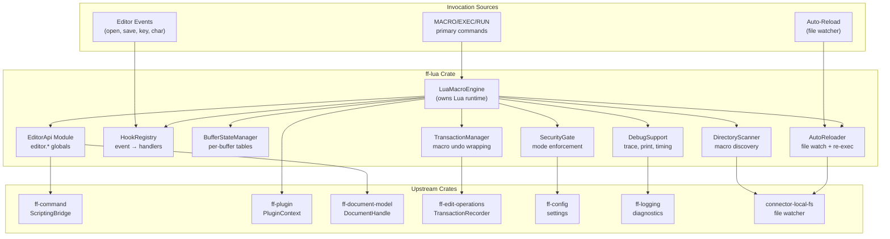

# Design Document: Lua Macro Engine (`ff-lua`)

## Overview

The `ff-lua` crate is the **scripting and automation layer** for the FileForgeWorkbench platform. It embeds a Lua 5.4 runtime (via the `mlua` crate), exposes a rich editor API surface to scripts, manages event hooks for reactive automation, provides per-buffer state isolation, handles automatic script reloading during development, enforces security modes, and registers primary commands (`MACRO`, `EXEC`, `RUN`) with the command framework.

### Purpose

- Embed a sandboxed Lua 5.4 runtime with configurable resource limits
- Expose the `editor.*` global API for buffer manipulation, cursor queries, and command dispatch
- Implement a comprehensive event hook system (OnOpen, OnBeforeSave, OnChar, OnKey, etc.)
- Maintain per-buffer Lua state tables that persist across buffer switches
- Auto-reload modified macro scripts during development
- Scan configured macro directories for script discovery at startup and runtime
- Enforce security modes (Disabled, Prompt, TrustedOnly, Enabled)
- Wrap all macro-driven edits in atomic undo transactions
- Provide debugging facilities (trace, print, execution timing, tracebacks)

### Position in Architecture

```
Wave 10 — Extensions and Macros

┌─────────────────────────────────────────────────────────┐
│                    Application Binary (ffwb)              │
│                (ff-desktop / GUI shell)                   │
├─────────────────────────────────────────────────────────┤
│  ff-lua (THIS CRATE) — Wave 10                           │
│  Lua runtime, editor API, hooks, macro commands          │
├─────────────────────────────────────────────────────────┤
│  ff-edit-operations │ ff-document-model │ ff-undo-redo   │
│  ff-command │ ff-plugin │ ff-config │ ff-logging         │
├─────────────────────────────────────────────────────────┤
│  ff-vfs │ connector-local-fs (file watching)             │
└─────────────────────────────────────────────────────────┘
```

### Design Constraints (Cross-Cutting)

- **FFW-ARCH-001 (Req 1)**: File watching and script loading use the VFS/connector-local-fs watcher — no direct `std::fs` for content access
- **GUI Independence (Req 2)**: Zero GUI dependencies — no egui, no windowing crate imports; dialogs (e.g., security prompt) are abstracted behind a trait
- **Plugin Architecture (Req 3)**: The macro engine registers as a plugin providing `MacroCapability` via `ff-plugin`
- **Command-Driven (Req 4)**: MACRO/EXEC/RUN are registered commands; `editor.command()` dispatches through the scripting bridge
- **Multi-Crate Workspace (Req 7)**: Crate at `crates/ff-lua`
- **Error Message Standards (Req 8)**: All errors follow `[lua] operation: description` format

### Upstream Dependencies

| Crate | Used For |
|-------|----------|
| `ff-command` | ScriptingBridge for `editor.command()`, command registration for MACRO/EXEC/RUN |
| `ff-plugin` | `FileForgePlugin` trait, `PluginContext`, capability registration |
| `ff-document-model` | `DocumentHandle` for buffer read/write through the editor API |
| `ff-edit-operations` | Transaction recording for atomic macro edits |
| `ff-config` | Security mode, directories, limits, debug flags |
| `ff-logging` | Diagnostic output, `trace()` and `print()` routing |
| `mlua` | Lua 5.4 runtime embedding (external crate) |

---

## Architecture

### High-Level Architecture Diagram



### Layer Placement

| Layer | Role |
|-------|------|
| **Engine Core** | `LuaMacroEngine` — owns the `mlua::Lua` instance, orchestrates all macro operations |
| **Editor API** | Lua global `editor` table — bridges Lua calls to document model and command framework |
| **Hook System** | `HookRegistry` — maps event names to ordered handler lists, dispatches events |
| **Buffer State** | `BufferStateManager` — per-buffer Lua table swap on buffer switch |
| **Discovery** | `DirectoryScanner` — recursive `.lua` file scanning, name resolution, shadowing |
| **Auto-Reload** | `AutoReloader` — file watcher integration, debounced re-execution |
| **Security** | `SecurityGate` — policy enforcement before any script execution |
| **Transactions** | `TransactionManager` — wraps macro execution in undo-group boundaries |
| **Debug** | `DebugSupport` — trace/print routing, execution timing, traceback formatting |

### Macro Execution Flow

```
1. User issues MACRO <name> (or event fires, or auto-reload triggers)
2. SecurityGate checks security mode → allow / deny / prompt
3. DirectoryScanner resolves name → file path
4. TransactionManager opens a new undo group
5. LuaMacroEngine sets instruction/memory limits on Lua runtime
6. Lua runtime executes the script (editor.* calls modify buffer)
7. On success: TransactionManager commits the undo group
   On error:  TransactionManager rolls back the undo group
8. HookRegistry scans for newly defined global hook functions
9. Engine reports execution time via DEBUG log
```

---

## Components and Interfaces

```
crates/ff-lua/
├── Cargo.toml
├── src/
│   ├── lib.rs                  # Public API re-exports, crate docs
│   ├── engine.rs               # LuaMacroEngine struct, Lua runtime lifecycle
│   ├── plugin.rs               # FileForgePlugin impl, MacroCapability registration
│   ├── editor_api/
│   │   ├── mod.rs              # EditorApi re-exports
│   │   ├── buffer_ops.rs       # lines, get_line, set_line, insert_line, delete_line, tag
│   │   ├── state_query.rs      # cursor_line, cursor_col, selection, language, file_path
│   │   ├── config_access.rs    # editor.config(key)
│   │   └── command_bridge.rs   # editor.command(str) → ScriptingBridge dispatch
│   ├── hooks/
│   │   ├── mod.rs              # Hook module re-exports
│   │   ├── registry.rs         # HookRegistry: event → handler list, dispatch logic
│   │   ├── event.rs            # HookEvent enum, event parameters
│   │   └── discovery.rs        # Post-load global function scanning for hook registration
│   ├── buffer_state.rs         # BufferStateManager: per-buffer table swap
│   ├── scanner.rs              # DirectoryScanner: macro directory traversal, name resolution
│   ├── reloader.rs             # AutoReloader: file watch subscription, debounced re-exec
│   ├── security.rs             # SecurityGate: mode checks, trusted-path list, stdlib filtering
│   ├── transaction.rs          # TransactionManager: undo group open/commit/rollback
│   ├── commands.rs             # MACRO, EXEC, RUN command handler registrations
│   ├── debug.rs                # trace(), print(), timing, traceback formatting
│   ├── limits.rs               # Instruction count and memory limit configuration
│   ├── script.rs               # MacroScript struct: path, name, loaded hooks, hash
│   └── error.rs                # LuaEngineError enum
└── tests/
    ├── engine_tests.rs         # Engine lifecycle and Lua runtime tests
    ├── editor_api_tests.rs     # Editor API function correctness tests
    ├── hook_tests.rs           # Hook registration and dispatch tests
    ├── buffer_state_tests.rs   # Per-buffer state isolation tests
    ├── scanner_tests.rs        # Directory scanning and name resolution tests
    ├── security_tests.rs       # Security mode enforcement tests
    ├── transaction_tests.rs    # Undo group commit/rollback tests
    ├── reloader_tests.rs       # Auto-reload mechanism tests
    └── integration.rs          # End-to-end macro execution flow
```

### Public API Surface

#### LuaMacroEngine API

```rust
impl LuaMacroEngine {
    /// Create a new macro engine. Does NOT initialize the Lua runtime yet.
    /// Addresses: Requirement 1 AC 6
    pub fn new(config: EngineConfig) -> Self;

    /// Initialize the Lua runtime, load standard libraries based on security mode,
    /// register the editor API globals, and execute the startup script (if configured).
    /// Addresses: Requirement 1 AC 1, AC 2, AC 7
    pub fn initialize(&mut self, context: Arc<PluginContext>) -> Result<(), LuaEngineError>;

    /// Execute a named macro (resolved from macro directories).
    /// Wraps execution in a MacroTransaction.
    /// Addresses: Requirement 5 AC 1
    pub fn execute_named(
        &mut self,
        name: &str,
        document: &DocumentHandle,
    ) -> Result<(), LuaEngineError>;

    /// Execute an inline Lua expression (EXEC command).
    /// Returns the expression's return value as a string.
    /// Addresses: Requirement 5 AC 2
    pub fn execute_inline(
        &mut self,
        expression: &str,
        document: &DocumentHandle,
    ) -> Result<Option<String>, LuaEngineError>;

    /// Execute a macro file by absolute or workspace-relative path (RUN command).
    /// Addresses: Requirement 5 AC 3
    pub fn execute_file(
        &mut self,
        path: &Path,
        document: &DocumentHandle,
    ) -> Result<(), LuaEngineError>;

    /// Fire an event hook, dispatching to all registered handlers.
    /// Returns whether the event was cancelled (for cancellable hooks).
    /// Addresses: Requirement 3 (all criteria)
    pub fn fire_event(&mut self, event: HookEvent) -> Result<bool, LuaEngineError>;

    /// Notify the engine that the active buffer has changed.
    /// Swaps per-buffer state and fires OnSwitchBuffer hook.
    /// Addresses: Requirement 4 AC 3, AC 7
    pub fn on_buffer_switch(
        &mut self,
        new_buffer_id: BufferId,
        file_path: Option<&str>,
    ) -> Result<(), LuaEngineError>;

    /// Notify the engine that a new buffer was opened.
    /// Creates per-buffer state and fires OnOpen hook.
    /// Addresses: Requirement 4 AC 2
    pub fn on_buffer_opened(
        &mut self,
        buffer_id: BufferId,
        file_path: &str,
    ) -> Result<(), LuaEngineError>;

    /// Notify the engine that a buffer was closed.
    /// Fires OnClose hook and discards per-buffer state.
    /// Addresses: Requirement 4 AC 4
    pub fn on_buffer_closed(
        &mut self,
        buffer_id: BufferId,
        file_path: &str,
    ) -> Result<(), LuaEngineError>;

    /// Rescan macro directories and update available macros.
    /// Addresses: Requirement 9 AC 1, AC 7
    pub fn rescan_directories(&mut self) -> Result<Vec<String>, LuaEngineError>;

    /// Get the list of available macro names (for command completion).
    pub fn available_macro_names(&self) -> Vec<&str>;

    /// Reload a specific script by path (used by auto-reloader).
    /// Addresses: Requirement 8 AC 2, AC 3
    pub fn reload_script(&mut self, path: &Path) -> Result<(), LuaEngineError>;

    /// Shut down the engine: unregister hooks, release Lua state.
    pub fn shutdown(&mut self);
}
```

#### SecurityGate API

```rust
impl SecurityGate {
    /// Check whether a script is allowed to execute under current policy.
    /// Addresses: Requirement 7 (all criteria)
    pub fn check_permission(
        &self,
        script_path: &Path,
        script_name: &str,
    ) -> Result<SecurityPermission, LuaEngineError>;

    /// Update the security mode (e.g., after config change).
    pub fn set_mode(&mut self, mode: SecurityMode);

    /// Add a path to the trusted list (after user grants "Always Trust").
    pub fn add_trusted_path(&mut self, path: PathBuf);

    /// Filter Lua standard libraries based on security mode.
    /// Returns which stdlib modules should be loaded.
    /// Addresses: Requirement 1 AC 2
    pub fn allowed_stdlibs(&self) -> StdlibSet;
}
```

#### DirectoryScanner API

```rust
impl DirectoryScanner {
    /// Scan configured directories for .lua files (recursive, max 3 levels).
    /// Returns discovered macro names with resolved paths.
    /// Addresses: Requirement 9 AC 1, AC 2, AC 3
    pub fn scan(
        directories: &[(PathBuf, DirectoryPriority)],
    ) -> Result<HashMap<String, MacroScript>, LuaEngineError>;

    /// Resolve a macro name to its file path.
    /// Returns None if not found.
    pub fn resolve_name(&self, name: &str) -> Option<&Path>;
}
```

#### AutoReloader API

```rust
impl AutoReloader {
    /// Start watching all loaded script files for changes.
    /// Addresses: Requirement 8 AC 1
    pub fn start(
        &mut self,
        script_paths: &[PathBuf],
        watcher: Box<dyn FileWatcherHandle>,
    ) -> Result<(), LuaEngineError>;

    /// Stop watching (shutdown).
    pub fn stop(&mut self);

    /// Process pending file change notifications.
    /// Returns paths that need reloading.
    /// Addresses: Requirement 8 AC 2
    pub fn poll_changes(&mut self) -> Vec<PathBuf>;

    /// Add a new script path to the watch set.
    pub fn watch_script(&mut self, path: &Path) -> Result<(), LuaEngineError>;

    /// Remove a script path from the watch set.
    pub fn unwatch_script(&mut self, path: &Path);
}
```

#### Command Registration

```rust
/// Registers the MACRO, EXEC, and RUN commands with the command framework.
/// Called during plugin activation.
///
/// Addresses: Requirement 5 AC 7
pub fn register_macro_commands(
    engine: Arc<Mutex<LuaMacroEngine>>,
    context: Arc<PluginContext>,
) -> Result<(), LuaEngineError>;

/// Command IDs registered by this crate:
/// - "macro.run_named"   — MACRO <name>
/// - "macro.exec_inline" — EXEC <expression>
/// - "macro.run_file"    — RUN <path>
/// - "macro.reload"      — Force reload all scripts
/// - "macro.list"        — List available macros
```

---

## Data Models

### LuaMacroEngine

```rust
/// The core macro engine: owns the Lua 5.4 runtime, manages script lifecycle,
/// and coordinates all macro operations. Instantiated once per application lifetime.
///
/// Addresses: Requirement 1 AC 1, AC 6, AC 7
pub struct LuaMacroEngine {
    /// The mlua Lua 5.4 runtime instance (reused across invocations)
    lua: mlua::Lua,
    /// Registry of event hooks (event name → ordered handler list)
    hook_registry: HookRegistry,
    /// Per-buffer Lua table storage
    buffer_state: BufferStateManager,
    /// Loaded script metadata (path → MacroScript)
    loaded_scripts: HashMap<PathBuf, MacroScript>,
    /// Available macros (name → resolved path) from directory scanning
    available_macros: HashMap<String, PathBuf>,
    /// Security gate for execution policy enforcement
    security_gate: SecurityGate,
    /// Auto-reload watcher state
    auto_reloader: Option<AutoReloader>,
    /// Reference to platform services (via PluginContext)
    context: Option<PluginContextHandle>,
    /// Configuration cache for limits and flags
    config: EngineConfig,
}
```

### MacroScript

```rust
/// Metadata about a loaded macro script file.
///
/// Addresses: Requirement 9 AC 3, Requirement 8 AC 3
#[derive(Debug, Clone)]
pub struct MacroScript {
    /// Absolute filesystem path to the .lua file
    pub path: PathBuf,
    /// Macro name (filename without extension)
    pub name: String,
    /// Content hash (for change detection during auto-reload)
    pub content_hash: u64,
    /// Hook function names registered by this script
    pub registered_hooks: Vec<String>,
    /// The macro directory this script was discovered from
    pub source_directory: PathBuf,
    /// Priority level (workspace > user) for shadowing resolution
    pub priority: DirectoryPriority,
}
```

### ScriptContext

```rust
/// Runtime context provided to a macro during execution.
/// Carries references to the active document, transaction, and services.
///
/// Addresses: Requirement 2 AC 1, Requirement 5 AC 4
pub struct ScriptContext<'a> {
    /// Handle to the active document for buffer operations
    pub document: &'a DocumentHandle,
    /// Active undo transaction for this macro invocation
    pub transaction: &'a mut MacroTransaction,
    /// Scripting bridge for editor.command() dispatch
    pub scripting_bridge: &'a ScriptingBridge,
    /// Configuration access for editor.config()
    pub config_access: &'a dyn ConfigAccess,
    /// The script identity (name/path) for error reporting
    pub script_identity: ScriptIdentity,
}

/// Identifies the currently executing script for error messages.
#[derive(Debug, Clone)]
pub enum ScriptIdentity {
    /// Named macro from a directory
    Named { name: String, path: PathBuf },
    /// Inline expression from EXEC command
    Inline { expression: String },
    /// File path from RUN command
    FilePath { path: PathBuf },
}
```

### EditorApi

```rust
/// The editor API module registers Lua global functions under the `editor` table.
/// This struct holds the references needed for the API to operate.
///
/// Addresses: Requirement 2 (all criteria)
pub struct EditorApi {
    /// Active document handle (swapped on buffer switch)
    document: Arc<RwLock<Option<DocumentHandle>>>,
    /// Scripting bridge for command dispatch
    scripting_bridge: Arc<ScriptingBridge>,
    /// Configuration reader
    config: Arc<dyn ConfigAccess>,
}

impl EditorApi {
    /// Register all editor.* functions on the given Lua instance.
    pub fn register(lua: &mlua::Lua, api: Arc<EditorApi>) -> Result<(), LuaEngineError>;

    /// Update the active document reference (called on buffer switch).
    pub fn set_active_document(&self, doc: Option<DocumentHandle>);
}
```

### EventHook

```rust
/// Identifies a supported event hook type with its parameters.
///
/// Addresses: Requirement 3 AC 1
#[derive(Debug, Clone, PartialEq, Eq, Hash)]
#[non_exhaustive]
pub enum HookEvent {
    /// File opened and buffer ready. Param: file_path
    OnOpen { file_path: String },
    /// Before file save (cancellable). Param: file_path
    OnBeforeSave { file_path: String },
    /// After file saved. Param: file_path
    OnAfterSave { file_path: String },
    /// Buffer closing. Param: file_path
    OnClose { file_path: String },
    /// Active buffer switched. Param: file_path of new buffer
    OnSwitchBuffer { file_path: String },
    /// Character inserted (not cancellable). Param: character
    OnChar { character: char },
    /// Key pressed (cancellable). Params: key_code, modifiers
    OnKey { key_code: String, shift: bool, ctrl: bool, alt: bool },
    /// Command about to execute (cancellable). Params: command_id, params
    OnCommand { command_id: String, params: String },
    /// Error occurred in another hook/macro. Param: error_message
    OnError { error_message: String },
}

impl HookEvent {
    /// Returns the Lua global function name for this event.
    pub fn lua_function_name(&self) -> &'static str;

    /// Whether this event type is cancellable (handler can return false).
    pub fn is_cancellable(&self) -> bool;
}
```

### HookRegistry

```rust
/// Manages event-to-handler mappings with ordered dispatch.
///
/// Addresses: Requirement 3 AC 2, AC 3
pub struct HookRegistry {
    /// Map from event type name to ordered list of handlers
    handlers: HashMap<String, Vec<HookHandler>>,
    /// Monotonically increasing counter for registration ordering
    next_order: u64,
}

/// A registered hook handler entry in the HookRegistry.
///
/// Addresses: Requirement 3 AC 2, AC 3
#[derive(Debug, Clone)]
pub struct HookHandler {
    /// The script that defined this handler
    pub script_name: String,
    /// Registration order (script load order determines priority)
    pub registration_order: u64,
    /// Lua registry key referencing the handler function
    pub lua_registry_key: mlua::RegistryKey,
}

/// Result of dispatching a hook event.
#[derive(Debug, Clone)]
pub struct HookDispatchResult {
    /// Whether any handler cancelled the event
    pub cancelled: bool,
    /// The script name that cancelled (if any)
    pub cancelled_by: Option<String>,
    /// Errors encountered during dispatch (non-fatal for subsequent handlers)
    pub errors: Vec<HookDispatchError>,
}
```

### MacroSecurity

```rust
/// Security mode controlling which macros may execute.
///
/// Addresses: Requirement 7 AC 1
#[derive(Debug, Clone, Copy, PartialEq, Eq)]
pub enum SecurityMode {
    /// No macros may execute
    Disabled,
    /// Prompt user before executing untrusted macros
    Prompt,
    /// Only macros in trusted paths may execute
    TrustedOnly,
    /// All macros execute without restriction
    Enabled,
}

impl Default for SecurityMode {
    /// Defaults to Prompt for new installations.
    /// Addresses: Requirement 7 AC 7
    fn default() -> Self {
        SecurityMode::Prompt
    }
}

/// The security gate that enforces execution policy.
///
/// Addresses: Requirement 7 (all criteria)
pub struct SecurityGate {
    /// Current security mode (read from configuration)
    mode: SecurityMode,
    /// List of trusted script paths
    trusted_paths: Vec<PathBuf>,
    /// User-level macro directories (always trusted in TrustedOnly mode)
    user_directories: Vec<PathBuf>,
    /// Trait object for prompting the user (GUI-independent)
    prompt_handler: Option<Box<dyn SecurityPromptHandler>>,
}

/// GUI-independent trait for security prompts.
/// The GUI shell implements this to show confirmation dialogs.
///
/// Addresses: Requirement 7 AC 3 (GUI Independence constraint)
pub trait SecurityPromptHandler: Send + Sync {
    /// Ask user whether to allow a macro. Returns the user's decision.
    fn prompt_macro_execution(
        &self,
        script_path: &Path,
        script_name: &str,
    ) -> SecurityDecision;
}

/// User's response to a security prompt.
#[derive(Debug, Clone, Copy, PartialEq, Eq)]
pub enum SecurityDecision {
    /// Allow this one execution
    AllowOnce,
    /// Add to trusted list permanently
    AlwaysTrust,
    /// Deny execution
    Deny,
}

/// The result of a security check.
#[derive(Debug, Clone, PartialEq, Eq)]
pub enum SecurityPermission {
    /// Execution allowed
    Allowed,
    /// Execution denied with reason
    Denied { reason: String },
}

/// Set of Lua standard libraries to load.
#[derive(Debug, Clone)]
pub struct StdlibSet {
    pub base: bool,
    pub string: bool,
    pub table: bool,
    pub math: bool,
    pub utf8: bool,
    pub coroutine: bool,
    pub io: bool,
    pub os: bool,
    pub debug: bool,
}
```

### BufferStateManager

```rust
/// Manages per-buffer Lua table storage with automatic swap on buffer switch.
///
/// Addresses: Requirement 4 (all criteria)
pub struct BufferStateManager {
    /// Map from buffer ID to Lua registry key of the buffer's table
    buffer_tables: HashMap<BufferId, mlua::RegistryKey>,
    /// Currently active buffer ID (None during startup)
    active_buffer: Option<BufferId>,
}

impl BufferStateManager {
    /// Create a new empty buffer state for a newly opened buffer.
    /// Addresses: Requirement 4 AC 2
    pub fn create_buffer_state(
        &mut self,
        lua: &mlua::Lua,
        buffer_id: BufferId,
    ) -> Result<(), LuaEngineError>;

    /// Switch to a different buffer: save current `buffer` global, restore target.
    /// Addresses: Requirement 4 AC 3, AC 7
    pub fn switch_buffer(
        &mut self,
        lua: &mlua::Lua,
        new_buffer_id: BufferId,
    ) -> Result<(), LuaEngineError>;

    /// Discard state for a closed buffer.
    /// Addresses: Requirement 4 AC 4
    pub fn remove_buffer_state(&mut self, lua: &mlua::Lua, buffer_id: BufferId);

    /// Set the `buffer` global to nil (used during startup before any buffer is active).
    /// Addresses: Requirement 4 AC 6
    pub fn clear_active(&self, lua: &mlua::Lua) -> Result<(), LuaEngineError>;
}
```

### MacroTransaction

```rust
/// Wraps a macro invocation in a single undo group so all edits revert atomically.
///
/// Addresses: Requirement 5 AC 4, Requirement 6 AC 1
pub struct MacroTransaction {
    /// The undo group opened for this macro invocation
    group_id: UndoGroupId,
    /// Whether the transaction is still open
    is_open: bool,
    /// Number of edits recorded in this transaction
    edit_count: usize,
}

impl MacroTransaction {
    /// Open a new transaction (undo group) for a macro invocation.
    pub fn begin(undo_manager: &dyn UndoManager) -> Result<Self, LuaEngineError>;

    /// Commit the transaction — all edits become a single undo unit.
    pub fn commit(self, undo_manager: &dyn UndoManager) -> Result<(), LuaEngineError>;

    /// Roll back the transaction — all edits are undone.
    /// Addresses: Requirement 6 AC 1
    pub fn rollback(self, undo_manager: &dyn UndoManager) -> Result<(), LuaEngineError>;

    /// Record an edit within this transaction.
    pub fn record_edit(&mut self);
}
```

### EngineConfig

```rust
/// Configuration values for the macro engine, read from ff-config.
///
/// Addresses: Requirement 1 AC 3, AC 4; Requirement 7 AC 1; Requirement 8 AC 1
#[derive(Debug, Clone)]
pub struct EngineConfig {
    /// Maximum instruction count per invocation (default: 10_000_000)
    pub instruction_limit: u64,
    /// Maximum memory in bytes per invocation (default: 67_108_864 = 64 MB)
    pub memory_limit: usize,
    /// Security mode
    pub security_mode: SecurityMode,
    /// Macro directory paths
    pub macro_directories: Vec<PathBuf>,
    /// Whether auto-reload is enabled
    pub auto_reload: bool,
    /// Whether debug tracebacks are enabled
    pub debug_traceback: bool,
    /// Startup script path (optional)
    pub startup_script: Option<String>,
    /// Trusted script paths for TrustedOnly mode
    pub trusted_paths: Vec<PathBuf>,
}

impl EngineConfig {
    /// Load configuration from the config system.
    pub fn from_config(config: &dyn ConfigAccess) -> Self;
}
```

### DirectoryPriority

```rust
/// Priority levels for macro directory sources (higher = preferred on conflict).
///
/// Addresses: Requirement 9 AC 4
#[derive(Debug, Clone, Copy, PartialEq, Eq, PartialOrd, Ord)]
pub enum DirectoryPriority {
    /// User-level macros (~/.config/ffworkbench/macros/)
    User = 0,
    /// Workspace-level macros (workspace_root/macros/)
    Workspace = 1,
}
```

---

## Error Handling

```rust
/// Errors produced by the Lua macro engine.
/// Follows cross-cutting Requirement 8: "[lua] operation: description"
///
/// Addresses: Requirement 6 (all criteria)
#[derive(Debug, thiserror::Error)]
#[non_exhaustive]
pub enum LuaEngineError {
    /// Lua runtime error during script execution
    #[error("[lua] execute '{script}': {message}")]
    ScriptError {
        script: String,
        message: String,
        traceback: Option<String>,
    },

    /// Instruction limit exceeded (infinite loop protection)
    /// Addresses: Requirement 1 AC 5
    #[error("[lua] execute '{script}': instruction limit exceeded ({count} instructions)")]
    InstructionLimitExceeded {
        script: String,
        count: u64,
    },

    /// Memory limit exceeded
    /// Addresses: Requirement 1 AC 4, AC 5
    #[error("[lua] execute '{script}': memory limit exceeded ({used_bytes} bytes)")]
    MemoryLimitExceeded {
        script: String,
        used_bytes: usize,
    },

    /// Macro not found in configured directories
    /// Addresses: Requirement 5 AC 5
    #[error("[lua] resolve: macro not found: '{name}'")]
    MacroNotFound {
        name: String,
    },

    /// File not found or not readable
    /// Addresses: Requirement 5 AC 6
    #[error("[lua] load: cannot open macro file: '{path}'")]
    FileNotReadable {
        path: String,
    },

    /// Security policy denied execution
    /// Addresses: Requirement 7 AC 2
    #[error("[lua] security: macro execution is disabled by security policy")]
    SecurityDenied {
        script: String,
        mode: SecurityMode,
    },

    /// Line number out of range in editor API call
    /// Addresses: Requirement 2 AC 11
    #[error("[lua] editor.{function}: line {line} is out of range (valid: 1..{max})")]
    LineOutOfRange {
        function: String,
        line: usize,
        max: usize,
    },

    /// Transaction rollback failed
    /// Addresses: Requirement 6 AC 7
    #[error("[lua] rollback: failed to roll back transaction for '{script}': {reason}")]
    RollbackFailed {
        script: String,
        reason: String,
    },

    /// Lua runtime initialization failed
    #[error("[lua] init: failed to initialize Lua runtime: {reason}")]
    InitFailed {
        reason: String,
    },

    /// Auto-reload error (non-fatal, logged as warning)
    /// Addresses: Requirement 8 AC 4
    #[error("[lua] reload '{script}': {message}")]
    ReloadError {
        script: String,
        message: String,
    },

    /// Directory scanning error
    #[error("[lua] scan: failed to scan directory '{path}': {reason}")]
    ScanError {
        path: String,
        reason: String,
    },

    /// Plugin context not available
    #[error("[lua] context: plugin context not initialized")]
    ContextNotInitialized,
}
```

---

## Integration Points

### With `ff-command` (Command Framework — Wave 2)

- **ScriptingBridge**: The `editor.command(str)` API delegates to `ScriptingBridge::execute()`, converting Lua string commands to `CommandParams` and dispatching through the command framework
- **Command Registration**: MACRO, EXEC, RUN commands are registered with IDs `"macro.run_named"`, `"macro.exec_inline"`, `"macro.run_file"` via `PluginContext::register_command()`
- **OnCommand Hook**: Before any command executes, `ff-lua` can intercept via the `OnCommand` cancellable hook if the engine subscribes to command-dispatch events
- Dependency: `ff-lua` depends on `ff-command` for the `ScriptingBridge` type and `CommandParams`/`LuaValue` conversions

### With `ff-plugin` (Plugin Architecture — Wave 2)

- **Plugin Registration**: `LuaMacroEngine` implements `FileForgePlugin` with metadata name `"lua-macro-engine"` and provides `MacroCapability`
- **Lifecycle**: The plugin system manages engine startup (`initialize` → `activate`) and shutdown (`deactivate` → `shutdown`)
- **PluginContext**: All platform service access (logging, config, events, VFS) goes through the provided `PluginContext`
- **Capability**: Registers `Capability::Commands(CommandsCapability { command_ids: ["macro.run_named", "macro.exec_inline", "macro.run_file", "macro.reload", "macro.list"], category: "macro" })`
- Dependency: `ff-lua` depends on `ff-plugin` for the `FileForgePlugin` trait and `PluginContext`

### With `ff-edit-operations` (Edit Operations — Wave 4)

- **Transaction Wrapping**: Each macro invocation opens a `MacroTransaction` (undo group) via the edit operations transaction system; on completion it commits, on error it rolls back
- **Buffer Mutation**: The `editor.set_line()`, `editor.insert_line()`, `editor.delete_line()` API functions use the edit operations primitives to modify buffer content, ensuring proper undo recording
- Dependency: `ff-lua` depends on `ff-edit-operations` for `TransactionRecorder` and edit primitives

### With `ff-document-model` (Document Model — Wave 4)

- **Buffer Access**: The `editor.*` API reads buffer content through `DocumentHandle` — `editor.lines()`, `editor.get_line(n)` call into the document model's line access methods
- **Line Metadata**: `editor.tag(n)` sets metadata on the document model's line metadata store
- **Buffer Identity**: Per-buffer state uses `BufferId` from the document model to key state tables
- Dependency: `ff-lua` depends on `ff-document-model` for `DocumentHandle`, `LineNumber`, and buffer content access

### With `ff-config` (Configuration System — Wave 2)

- **Settings Read**: The engine reads all configuration keys under the `macro.*` namespace:
  - `macro.security_mode` → SecurityMode enum
  - `macro.directories` → Vec<PathBuf>
  - `macro.auto_reload` → bool
  - `macro.debug_traceback` → bool
  - `macro.instruction_limit` → u64
  - `macro.memory_limit` → usize
  - `macro.startup_script` → Option<String>
  - `macro.trusted_paths` → Vec<PathBuf>
  - `macro.auto_load_for.<ext>` → script name per file extension
- **editor.config()**: The Lua `editor.config(key)` function reads effective values from the configuration system for any key (not scoped to macro namespace)
- **Hot-Reload**: When macro configuration keys change, the engine reacts to reload callbacks
- Dependency: `ff-lua` depends on `ff-config` for `ConfigAccess` trait and value reading

### With `connector-local-fs` (File Watching — Wave 3)

- **Script File Watching**: The auto-reload mechanism subscribes to file change events for loaded script paths via the local filesystem connector's watcher API
- **Directory Monitoring**: Hot-discovery of new `.lua` files in macro directories uses the same watcher
- Dependency: `ff-lua` uses file watcher events delivered through the platform event bus (via `PluginContext`)

### Dependency Direction

```
ff-logging ← ff-config ← ff-command ← ff-plugin
                   ↑          ↑           ↑
                   └──────────┴───────────┤
                                          │
ff-document-model ← ff-edit-operations ←──┤
                                          │
                              ff-lua ─────┘
                         (this crate)
```

---

## Correctness Properties

The following properties are suitable for property-based testing (via `proptest`) to ensure correctness of the macro engine's core logic.

### Property 1: Editor API Line Indexing Consistency

**Statement**: For any valid document with N lines, `editor.get_line(n)` for all n in [1, N] returns the correct line content, and any n outside [1, N] raises an error.

**Validates: Requirements 2.2, 2.3, 2.11**

```
∀ doc: Document, ∀ n: usize,
  if 1 ≤ n ≤ doc.lines() then
    editor.get_line(n) == doc.content_at_line(n)
  else
    editor.get_line(n) raises LuaError
```

### Property 2: Macro Transaction Atomicity

**Statement**: If a macro modifies K lines and then errors, all K modifications are rolled back and the document is identical to its pre-macro state.

**Validates: Requirements 6.1, 5.4**

```
∀ doc: Document, ∀ macro: Script that errors after K edits,
  let state_before = doc.snapshot()
  execute(macro) → Err(...)
  doc.snapshot() == state_before
```

### Property 3: Hook Registration Order Determinism

**Statement**: When N scripts are loaded in order [s1, s2, ..., sN] and all define the same hook, the hook dispatch calls handlers in load order.

**Validates: Requirements 3.3**

```
∀ scripts: [Script; N], ∀ event: HookEvent,
  load(scripts) →
  dispatch(event) calls handlers in order [s1.handler, s2.handler, ..., sN.handler]
```

### Property 4: Per-Buffer State Isolation

**Statement**: Writing to the `buffer` table in buffer A and switching to buffer B never exposes buffer A's state through buffer B's `buffer` global.

**Validates: Requirements 4.1, 4.3**

```
∀ buffer_a, buffer_b: BufferId, ∀ key: String, ∀ value: LuaValue,
  switch_to(buffer_a)
  buffer[key] = value
  switch_to(buffer_b)
  buffer[key] == nil  (unless buffer_b independently set it)
  switch_to(buffer_a)
  buffer[key] == value  (persisted across switches)
```

### Property 5: Security Mode Enforcement

**Statement**: When security mode is `Disabled`, no macro invocation succeeds regardless of script path or trust status.

**Validates: Requirements 7.2**

```
∀ script: MacroScript, ∀ mode == Disabled,
  execute(script) → Err(SecurityDenied)
```

### Property 6: Auto-Reload Preserves Buffer State

**Statement**: When a script is auto-reloaded, all per-buffer `buffer` tables remain unchanged.

**Validates: Requirements 8.6**

```
∀ script: MacroScript, ∀ buffers: [BufferId; M],
  let states_before = buffers.map(|b| buffer_table(b))
  reload(script)
  buffers.map(|b| buffer_table(b)) == states_before
```

### Property 7: Cancellable Hook Short-Circuit

**Statement**: For any cancellable hook, if handler at position K returns `false`, handlers at positions K+1..N are never invoked.

**Validates: Requirements 3.3, 3.4**

```
∀ handlers: [Handler; N], ∀ k: 1..N,
  if handler[k].returns(false) then
    handlers[k+1..N] are not called
    result.cancelled == true
    result.cancelled_by == Some(handler[k].script_name)
```

### Property 8: Instruction Limit Termination

**Statement**: A script containing an infinite loop is terminated after at most `instruction_limit` instructions and returns an `InstructionLimitExceeded` error.

**Validates: Requirements 1.3, 1.5**

```
∀ limit: u64, ∀ script containing `while true do end`,
  configure(instruction_limit = limit)
  execute(script) → Err(InstructionLimitExceeded { count: limit })
  document state is unchanged (transaction rolled back)
```

### Property 9: Directory Scan Shadowing Priority

**Statement**: When two directories contain a macro with the same base name, the higher-priority directory's version is resolved.

**Validates: Requirements 9.4**

```
∀ name: String, ∀ user_dir, workspace_dir containing name.lua,
  scan([user_dir(User), workspace_dir(Workspace)])
  resolve(name) == workspace_dir/name.lua  (Workspace > User)
```

### Property 10: Hook Unregistration on Reload

**Statement**: After a script is reloaded, hooks from the previous version are removed and only the new version's hooks remain.

**Validates: Requirements 8.3**

```
∀ script with hooks [h1, h2] → modified to define hooks [h1, h3],
  reload(script)
  hook_registry.contains(h1) == true   (re-registered)
  hook_registry.contains(h2) == false  (removed)
  hook_registry.contains(h3) == true   (newly registered)
```

---

## Testing Strategy

### Unit Tests

| Module | Key Tests |
|--------|-----------|
| `editor_api/buffer_ops` | get_line returns correct content, set_line modifies buffer, insert/delete shift lines correctly, out-of-range raises error |
| `editor_api/state_query` | cursor position returns 1-based values, selection returns nil when none active |
| `hooks/registry` | Registration order preserved, unregister removes only target script's handlers |
| `hooks/discovery` | Global function scan finds OnOpen/OnChar etc., ignores non-hook functions |
| `buffer_state` | Create/switch/remove cycles, nil during startup, preserved across reloads |
| `security` | Each mode correctly allows/denies, stdlib filtering matches mode |
| `scanner` | Recursive scan respects depth limit, shadowing prefers workspace |
| `transaction` | Commit preserves edits, rollback restores original state |
| `limits` | Instruction limit terminates loops, memory limit terminates allocation |

### Property-Based Tests (proptest)

| Property | Generator Strategy |
|----------|-------------------|
| Line indexing consistency | Random document (1–1000 lines), random line numbers (valid and invalid) |
| Transaction atomicity | Random edit sequences (1–50 edits) followed by forced error |
| Hook order determinism | Random number of scripts (2–20) with random hook definitions |
| Buffer state isolation | Random buffer switches (2–10 buffers) with random table writes |
| Security enforcement | All 4 modes × random script paths × trust list membership |
| Shadowing priority | Random directory configurations with name collisions |

### Integration Tests

- End-to-end: Load a macro from directory, execute, verify buffer modified and undoable
- Hook chain: Multiple scripts with OnBeforeSave, verify cancellation propagates
- Auto-reload: Modify script on disk, verify hooks update within timeout
- Security prompt: Mock prompt handler, verify Allow/Deny/Trust decisions respected

---

## Appendix A: External Crate Dependencies

| Crate | Version | Purpose |
|-------|---------|---------|
| `mlua` | 0.9.x | Lua 5.4 runtime embedding with safe Rust bindings |
| `thiserror` | 1.x | Derive macro for error types |

All other dependencies are workspace-internal crates (`ff-command`, `ff-plugin`, `ff-document-model`, `ff-edit-operations`, `ff-config`, `ff-logging`).

## Appendix B: Configuration Keys

| Key | Type | Default | Description |
|-----|------|---------|-------------|
| `macro.security_mode` | String | `"Prompt"` | Security mode: Disabled, Prompt, TrustedOnly, Enabled |
| `macro.directories` | Array | `["~/.config/ffworkbench/macros/"]` | Macro search directories |
| `macro.auto_reload` | Boolean | `true` | Enable file-watch auto-reload |
| `macro.debug_traceback` | Boolean | `false` | Include full stack traces in error messages |
| `macro.instruction_limit` | Integer | `10000000` | Max Lua instructions per invocation |
| `macro.memory_limit` | Integer | `67108864` | Max Lua memory (bytes) per invocation |
| `macro.startup_script` | String | `null` | Script to execute on engine initialization |
| `macro.trusted_paths` | Array | `[]` | Paths trusted in TrustedOnly mode |
| `macro.auto_load_for.<ext>` | String | — | Script name to auto-load for file extension |
