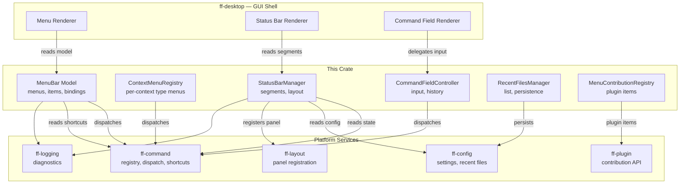

# Design Document: Menu and Status Bar (`ff-menu-statusbar`)

## 1. Overview

The `ff-menu-statusbar` crate provides the **menu bar, context menus, status bar, and primary command field** for the FileForgeWorkbench platform. It bridges the command framework and layout system to deliver a conventional desktop menu hierarchy and a configurable multi-segment status bar — all without directly mutating application state.

### Purpose

- Render a standard hierarchical Menu_Bar (File, Edit, Search, View, Tools, Help) at the top of the Primary_Window
- Bind every menu item to a `CommandId` in the command framework for consistent dispatch
- Provide context menus for editor areas, tab headers, panel headers, and file tree nodes
- Display a configurable multi-segment Status_Bar at the bottom of the Primary_Window
- Implement the Primary_Command_Field ("Command ===>") for ISPF-style command entry
- Support plugin-contributed menu items, submenus, and status bar segments
- Manage the Recent_Files_List with persistence across sessions

### Position in Architecture

```
Wave 6 — UI and Rendering (depends on Waves 0–5)

┌─────────────────────────────────────────────────────────┐
│              Shell Layer: ff-desktop (egui)               │
│         Renders menu bar, status bar, command field       │
├─────────────────────────────────────────────────────────┤
│  ff-menu-statusbar (THIS CRATE) — Wave 6                 │
│  Menu model, status segments, context menus              │
├─────────────────────────────────────────────────────────┤
│  ff-command │ ff-config │ ff-layout │ ff-plugin │ ff-core│
│  (Wave 2 — Platform Architecture)                        │
├─────────────────────────────────────────────────────────┤
│                     ff-logging (Wave 0)                   │
└─────────────────────────────────────────────────────────┘
```

### Design Constraints (Cross-Cutting)

- **Command-Driven Architecture (Req 4)**: Every menu item dispatches via `execute_command` — no direct state mutation
- **GUI Independence (Req 2)**: The menu/status model is GUI-independent data; only `render` trait methods accept `egui::Ui`
- **Plugin Architecture (Req 3)**: Plugins contribute menu items and status segments via traits registered through `PluginContext`
- **Configuration Namespace (Req 5)**: Status bar layout and recent files settings live under `menu.*` and `statusbar.*` namespaces
- **Status Bar Layout (Req 9)**: All active indicators visible simultaneously; single row, fixed height
- **Multi-Crate Workspace (Req 7)**: Crate at `crates/ff-menu-statusbar`
- **Error Message Standards (Req 8)**: Errors follow `[menu] operation: description` format

### Upstream Dependencies

| Crate | What It Provides |
|-------|------------------|
| `ff-command` | `CommandId`, `CommandRegistry`, `CommandDispatch`, `CommandMetadata`, `ShortcutBinding`, `ShortcutRegistry` |
| `ff-config` | `ConfigHandle`, typed getters, reload callbacks, `keys` module |
| `ff-layout` | `DockablePanel` trait, `DockZone`, `PanelRegistry` |
| `ff-plugin` | `FileForgePlugin`, `PluginContext`, `Capability_Registry` |
| `ff-logging` | `log_warn!`, `log_info!`, `log_debug!` macros |

### Downstream Consumers

- `ff-desktop` (GUI shell): Renders the menu bar, status bar, and command field using this crate's model and render traits
- `ff-command-semantics`: Registers ISPF commands that the Primary_Command_Field dispatches
- All plugins that contribute menu items or status segments

---

## 2. Architecture

### High-Level Architecture Diagram



### Layer Placement

| Component | Responsibility |
|-----------|---------------|
| **MenuBar Model** | Declarative menu tree — headings, items, separators, submenus, bindings |
| **ContextMenuRegistry** | Per-context-type (editor, tab, panel, file-tree) menu definitions |
| **StatusBarManager** | Segment registry, ordering, alignment, content provider dispatch |
| **CommandFieldController** | Input buffering, history recall, submit-to-CommandEngine logic |
| **RecentFilesManager** | MRU list, max-size enforcement, persistence, stale-path handling |
| **MenuContributionRegistry** | Plugin menu contributions — insertion, removal, ordering |

---

## 3. Module Structure

```
crates/ff-menu-statusbar/
├── Cargo.toml
├── src/
│   ├── lib.rs                      # Public API re-exports, crate docs
│   ├── menu/
│   │   ├── mod.rs                  # Menu module re-exports
│   │   ├── model.rs                # MenuBar, Menu, MenuItem, MenuSeparator data types
│   │   ├── builder.rs              # MenuBarBuilder — declarative menu tree construction
│   │   ├── binding.rs              # MenuCommandBinding — item ↔ CommandId association
│   │   ├── keyboard_nav.rs         # Keyboard navigation state machine (Alt keys, arrows)
│   │   └── renderer.rs             # MenuBar render trait (egui::Ui integration)
│   ├── context_menu/
│   │   ├── mod.rs                  # Context menu re-exports
│   │   ├── registry.rs             # ContextMenuRegistry — context-type → menu mapping
│   │   ├── types.rs                # ContextType enum (Editor, Tab, Panel, FileTree)
│   │   └── renderer.rs             # Context menu popup render trait
│   ├── status/
│   │   ├── mod.rs                  # Status bar re-exports
│   │   ├── manager.rs              # StatusBarManager — segment lifecycle, ordering
│   │   ├── segment.rs              # StatusSegment data type, SegmentAlignment
│   │   ├── provider.rs             # StatusSegmentProvider trait
│   │   ├── builtin.rs              # Built-in segment providers (mode, pos, encoding, etc.)
│   │   └── renderer.rs             # Status bar render trait
│   ├── command_field/
│   │   ├── mod.rs                  # Command field re-exports
│   │   ├── controller.rs           # CommandFieldController — input, submit, history
│   │   ├── history.rs              # Command field history ring buffer
│   │   └── renderer.rs             # Command field render trait
│   ├── recent/
│   │   ├── mod.rs                  # Recent files re-exports
│   │   ├── manager.rs              # RecentFilesManager — MRU list logic
│   │   └── persistence.rs          # File-based persistence (JSON in data dir)
│   ├── contribution/
│   │   ├── mod.rs                  # Plugin contribution re-exports
│   │   ├── menu_descriptor.rs      # MenuContribution descriptor type
│   │   └── registry.rs             # MenuContributionRegistry — insert/remove/reorder
│   ├── config_keys.rs              # Compile-time config key constants for this crate
│   └── error.rs                    # MenuStatusBarError enum
└── tests/
    ├── menu_model_tests.rs         # Menu structure property tests
    ├── context_menu_tests.rs       # Context menu registry tests
    ├── status_bar_tests.rs         # Status bar segment ordering property tests
    ├── command_field_tests.rs      # Command field history property tests
    ├── recent_files_tests.rs       # Recent files MRU property tests
    ├── contribution_tests.rs       # Plugin contribution insertion tests
    └── integration.rs              # End-to-end menu dispatch and status update tests
```

---

## 4. Key Data Models and Types

### MenuBar

```rust
/// The complete menu bar model. A list of top-level menus rendered left-to-right.
/// Addresses: Requirement 1, criteria 1/2
#[derive(Debug, Clone)]
pub struct MenuBar {
    /// Ordered list of top-level menus
    pub menus: Vec<Menu>,
    /// Current keyboard navigation state
    pub nav_state: MenuNavState,
}
```

### Menu

```rust
/// A top-level menu or submenu containing ordered items.
/// Addresses: Requirement 1, criteria 3–7
#[derive(Debug, Clone)]
pub struct Menu {
    /// Display label (e.g., "File", "Edit")
    pub label: String,
    /// Access key character (underlined in UI, e.g., 'F' for File)
    pub access_key: Option<char>,
    /// Ordered list of items (menu items, separators, submenus)
    pub items: Vec<MenuEntry>,
    /// Whether this menu is currently open
    pub is_open: bool,
}
```

### MenuEntry

```rust
/// A single entry within a menu — an item, separator, or submenu.
/// Addresses: Requirement 1, criteria 3–8; Requirement 2, criteria 1–4
#[derive(Debug, Clone)]
#[non_exhaustive]
pub enum MenuEntry {
    /// A clickable menu item bound to a command
    Item(MenuItem),
    /// A visual separator between groups of items
    Separator,
    /// A nested submenu
    Submenu(Menu),
}
```

### MenuItem

```rust
/// An individual menu item bound to a command in the command framework.
/// Addresses: Requirement 2, criteria 1–4; Requirement 11, criterion 5
#[derive(Debug, Clone)]
pub struct MenuItem {
    /// Unique identifier for this menu item (for contribution targeting)
    pub id: String,
    /// Display label (from command metadata or explicit override)
    pub label: String,
    /// Access key character for keyboard navigation
    pub access_key: Option<char>,
    /// The Command_ID this item invokes when activated
    pub command_id: String,
    /// Optional parameters to pass to the command
    pub params: Option<CommandParams>,
    /// Keyboard shortcut display text (read from ShortcutRegistry)
    pub shortcut_text: Option<String>,
    /// Whether the item is currently enabled (from command enabled predicate)
    pub is_enabled: bool,
    /// Whether the item is currently visible (from command visibility predicate)
    pub is_visible: bool,
    /// Whether this item represents a toggle (checkbox-style display)
    pub is_toggle: bool,
    /// Current toggle state (only meaningful if is_toggle is true)
    pub is_checked: bool,
    /// Contributing plugin name (None for built-in items)
    pub contributed_by: Option<String>,
}
```

### MenuNavState

```rust
/// Keyboard navigation state machine for the menu bar.
/// Addresses: Requirement 11, all criteria
#[derive(Debug, Clone, PartialEq, Eq)]
pub enum MenuNavState {
    /// Menu bar is inactive; no menu is open
    Inactive,
    /// Menu bar is focused (e.g., F10 pressed) but no dropdown open yet
    Focused { highlighted_index: usize },
    /// A dropdown menu is open with a highlighted item
    Open {
        menu_index: usize,
        item_index: Option<usize>,
        submenu_stack: Vec<usize>,
    },
}
```

### ContextType

```rust
/// The type of UI element that a context menu is associated with.
/// Addresses: Requirement 4, criteria 1/2/5
#[derive(Debug, Clone, Copy, PartialEq, Eq, Hash)]
#[non_exhaustive]
pub enum ContextType {
    /// Right-click in the editor text area
    EditorArea,
    /// Right-click on a tab header
    TabHeader,
    /// Right-click on a panel header
    PanelHeader,
    /// Right-click on a file tree node
    FileTreeNode,
}
```

### StatusSegment

```rust
/// A single segment within the status bar.
/// Addresses: Requirement 5, criteria 2/4
#[derive(Debug, Clone)]
pub struct StatusSegment {
    /// Unique identifier (1–64 ASCII alphanumeric/underscore chars)
    pub id: String,
    /// Alignment group within the status bar
    pub alignment: SegmentAlignment,
    /// Ordering priority within the alignment group (lower = renders first)
    pub priority: u32,
    /// Minimum width in logical pixels (0 = auto-size to content)
    pub min_width: f32,
    /// Whether this segment is currently visible
    pub visible: bool,
    /// Contributing plugin name (None for built-in segments)
    pub contributed_by: Option<String>,
}
```

### SegmentAlignment

```rust
/// Alignment grouping for status bar segments.
/// Addresses: Requirement 5, criterion 2
#[derive(Debug, Clone, Copy, PartialEq, Eq, Hash)]
pub enum SegmentAlignment {
    /// Left-aligned segments (editor mode, insert/overstrike, encoding)
    Left,
    /// Center-aligned segments (rarely used, reserved for extension)
    Center,
    /// Right-aligned segments (line/col, modified indicator, total lines)
    Right,
}
```

### StatusSegmentProvider Trait

```rust
/// Trait for providing content to a status bar segment.
/// Implemented by built-in providers and plugins.
/// Addresses: Requirement 8, criteria 1/2
pub trait StatusSegmentProvider: Send + Sync {
    /// Returns the unique segment identifier.
    fn segment_id(&self) -> &str;

    /// Render the segment content into the given UI region.
    fn render(&self, ui: &mut egui::Ui);

    /// Returns the alignment group for this segment.
    fn alignment(&self) -> SegmentAlignment;

    /// Returns the ordering priority (lower = renders first within group).
    fn priority(&self) -> u32;

    /// Returns whether the segment currently has content to display.
    /// Segments returning false may be collapsed to save space.
    fn has_content(&self) -> bool { true }
}
```

### EditorMode (re-exported from ff-core)

```rust
/// The current interaction mode of the active editor.
/// Addresses: Requirement 6, criteria 1/2
#[derive(Debug, Clone, Copy, PartialEq, Eq)]
pub enum EditorMode {
    Browse,
    Edit,
    View,
}

impl std::fmt::Display for EditorMode {
    fn fmt(&self, f: &mut std::fmt::Formatter<'_>) -> std::fmt::Result {
        match self {
            Self::Browse => write!(f, "Browse"),
            Self::Edit => write!(f, "Edit"),
            Self::View => write!(f, "View"),
        }
    }
}
```

### InsertOverstrikeState

```rust
/// Whether typed characters insert or overwrite.
/// Addresses: Requirement 6, criteria 3/4
#[derive(Debug, Clone, Copy, PartialEq, Eq)]
pub enum InsertOverstrikeState {
    Insert,
    Overstrike,
}

impl std::fmt::Display for InsertOverstrikeState {
    fn fmt(&self, f: &mut std::fmt::Formatter<'_>) -> std::fmt::Result {
        match self {
            Self::Insert => write!(f, "INS"),
            Self::Overstrike => write!(f, "OVR"),
        }
    }
}
```

### CommandFieldState

```rust
/// The state of the primary command field.
/// Addresses: Requirement 9, all criteria
#[derive(Debug, Clone)]
pub struct CommandFieldState {
    /// Current text content of the input field
    pub text: String,
    /// Whether the field currently has keyboard focus
    pub has_focus: bool,
    /// Current position in the history ring (-1 = live input, 0 = most recent)
    pub history_position: i32,
    /// Saved live input when browsing history
    pub saved_input: String,
}
```

### RecentFileEntry

```rust
/// A single entry in the recent files list.
/// Addresses: Requirement 3, criteria 1/3/5
#[derive(Debug, Clone, serde::Serialize, serde::Deserialize)]
pub struct RecentFileEntry {
    /// Absolute path to the file
    pub path: String,
    /// Timestamp of last open/save (for ordering)
    pub last_accessed: chrono::DateTime<chrono::Utc>,
    /// Whether the file still exists on disk (checked lazily)
    pub verified_exists: Option<bool>,
}
```

### MenuContribution

```rust
/// Descriptor for a plugin-contributed menu item.
/// Addresses: Requirement 10, criteria 1/2/3
#[derive(Debug, Clone)]
pub struct MenuContribution {
    /// The target menu path (e.g., "File", "Tools", "View > Panels")
    pub menu_path: String,
    /// The Command_ID to bind this menu item to
    pub command_id: String,
    /// Desired position within the target menu
    pub position: MenuInsertPosition,
    /// Whether to insert a separator before this item
    pub separator_before: bool,
    /// Whether to insert a separator after this item
    pub separator_after: bool,
    /// The plugin that contributed this item
    pub plugin_name: String,
}
```

### MenuInsertPosition

```rust
/// Where to insert a contributed menu item within the target menu.
/// Addresses: Requirement 10, criterion 1
#[derive(Debug, Clone)]
pub enum MenuInsertPosition {
    /// Insert at the end of the menu (before any trailing separator/exit)
    End,
    /// Insert before a specific item ID
    Before(String),
    /// Insert after a specific item ID
    After(String),
    /// Insert at a specific zero-based index
    AtIndex(usize),
}
```

---

## 5. Public API Surface

### Menu Bar — Construction and Lifecycle

```rust
/// Build the default menu bar model with all built-in menus and items.
/// Reads command metadata and shortcut bindings from the registries.
///
/// Addresses: Requirement 1, criteria 2–7; Requirement 2, criteria 1/2
pub fn build_default_menu_bar(
    command_registry: &CommandRegistry,
    shortcut_registry: &ShortcutRegistry,
) -> MenuBar;

/// Refresh the enabled/visible state of all menu items by re-evaluating
/// command predicates against the current execution context.
///
/// Addresses: Requirement 2, criteria 3/4
pub fn refresh_menu_state(
    menu_bar: &mut MenuBar,
    command_registry: &CommandRegistry,
    context: &ExecutionContext,
);
```

### Menu Bar — Activation and Dispatch

```rust
impl MenuBar {
    /// Activate the menu item at the given path. Invokes the bound command
    /// through the command dispatch. Returns the CommandResult.
    ///
    /// Addresses: Requirement 2, criteria 1/5–10
    pub fn activate_item(
        &self,
        item_id: &str,
        dispatch: &CommandDispatch,
    ) -> CommandResult;

    /// Process a keyboard navigation event. Updates MenuNavState.
    /// Returns true if the event was consumed by menu navigation.
    ///
    /// Addresses: Requirement 11, all criteria
    pub fn handle_key_event(&mut self, event: &KeyEvent) -> bool;

    /// Open a specific top-level menu by index.
    /// Addresses: Requirement 1, criterion 8; Requirement 11, criterion 1
    pub fn open_menu(&mut self, index: usize);

    /// Close all open menus and return to Inactive state.
    /// Addresses: Requirement 11, criterion 4
    pub fn close_all(&mut self);

    /// Returns the currently highlighted menu item path (for accessibility).
    pub fn highlighted_item(&self) -> Option<&MenuItem>;
}
```

### Context Menu Registry

```rust
/// Registry for context-specific popup menus.
/// Addresses: Requirement 4, all criteria
pub struct ContextMenuRegistry { /* ... */ }

impl ContextMenuRegistry {
    /// Create a new registry with default context menus for editor and tabs.
    ///
    /// Addresses: Requirement 4, criteria 1/2
    pub fn new(
        command_registry: &CommandRegistry,
        shortcut_registry: &ShortcutRegistry,
    ) -> Self;

    /// Get the menu for a given context type. Returns a freshly-evaluated menu
    /// with enabled/visible states set per the current context.
    ///
    /// Addresses: Requirement 4, criteria 3/4
    pub fn get_menu(
        &self,
        context_type: ContextType,
        execution_context: &ExecutionContext,
        command_registry: &CommandRegistry,
    ) -> Menu;

    /// Register a plugin-contributed context menu item for a specific context type.
    ///
    /// Addresses: Requirement 4, criterion 5
    pub fn contribute_item(
        &mut self,
        context_type: ContextType,
        contribution: MenuContribution,
    ) -> Result<(), MenuStatusBarError>;

    /// Remove all contributions from a specific plugin.
    pub fn remove_plugin_contributions(&mut self, plugin_name: &str);
}
```

### Status Bar Manager

```rust
/// Manages the status bar segment registry and layout.
/// Addresses: Requirement 5, all criteria; Requirement 8, all criteria
pub struct StatusBarManager { /* ... */ }

impl StatusBarManager {
    /// Create a new manager with default built-in segments.
    ///
    /// Addresses: Requirement 5, criterion 3
    pub fn new(config: &ConfigHandle) -> Self;

    /// Register a segment provider (built-in or plugin-contributed).
    /// Returns Err if a segment with the same ID already exists.
    ///
    /// Addresses: Requirement 8, criteria 1/3/6
    pub fn register_segment(
        &mut self,
        provider: Box<dyn StatusSegmentProvider>,
    ) -> Result<(), MenuStatusBarError>;

    /// Unregister a segment by ID. Used during plugin unload.
    ///
    /// Addresses: Requirement 8, criterion 4
    pub fn unregister_segment(&mut self, segment_id: &str) -> bool;

    /// Get the ordered list of visible segments for rendering.
    /// Segments are sorted by alignment group, then by priority within group.
    ///
    /// Addresses: Requirement 5, criteria 2/3
    pub fn visible_segments(&self) -> Vec<&dyn StatusSegmentProvider>;

    /// Update segment visibility/ordering from configuration.
    ///
    /// Addresses: Requirement 8, criterion 5
    pub fn apply_config(&mut self, config: &ConfigHandle);

    /// Notify that the active editor context changed (tab switch, mode change, etc.).
    /// Triggers segment content refresh.
    ///
    /// Addresses: Requirement 7, criterion 6
    pub fn notify_context_changed(&mut self, context: &EditorStateSnapshot);
}
```

### EditorStateSnapshot

```rust
/// A snapshot of the active editor's state, provided to status bar segments.
/// Addresses: Requirement 6, all criteria; Requirement 7, all criteria
#[derive(Debug, Clone)]
pub struct EditorStateSnapshot {
    /// Current editor mode (Browse/Edit/View), None if no editor active
    pub mode: Option<EditorMode>,
    /// Insert/Overstrike state, None if no editor active
    pub insert_overstrike: Option<InsertOverstrikeState>,
    /// Current cursor line (1-based), None if no editor active
    pub cursor_line: Option<usize>,
    /// Current cursor column (1-based), None if no editor active
    pub cursor_col: Option<usize>,
    /// File encoding string, None if no editor active
    pub encoding: Option<String>,
    /// Whether the active document has unsaved changes
    pub is_modified: Option<bool>,
    /// Total line count of active document, None if no editor active
    pub total_lines: Option<usize>,
    /// Active indicator flags (HEX, ASA, SEQSHOW, etc.)
    pub active_indicators: Vec<String>,
}
```

### Command Field Controller

```rust
/// Controller for the primary command field ("Command ===>").
/// Addresses: Requirement 9, all criteria
pub struct CommandFieldController { /* ... */ }

impl CommandFieldController {
    /// Create a new controller with an empty history.
    pub fn new() -> Self;

    /// Get the current field state for rendering.
    pub fn state(&self) -> &CommandFieldState;

    /// Set the text content (e.g., when the user types).
    pub fn set_text(&mut self, text: String);

    /// Submit the current field content for command dispatch.
    /// Returns Ok(()) if the command was dispatched (even if it failed),
    /// or Err if the field is empty.
    ///
    /// Addresses: Requirement 9, criteria 3/4/5
    pub fn submit(
        &mut self,
        dispatch: &CommandDispatch,
    ) -> Result<SubmitResult, MenuStatusBarError>;

    /// Navigate command history: direction = -1 (older) or +1 (newer).
    ///
    /// Addresses: Requirement 9, criterion 6
    pub fn history_navigate(&mut self, direction: i32);

    /// Focus or unfocus the command field.
    pub fn set_focus(&mut self, focused: bool);

    /// Returns true if focus should transfer to editor (Down arrow on empty field).
    ///
    /// Addresses: Requirement 9, criterion 7
    pub fn should_transfer_focus_down(&self) -> bool;

    /// Load command history from persisted state.
    pub fn load_history(&mut self, entries: Vec<String>);

    /// Get the current history entries for persistence.
    pub fn history_entries(&self) -> &[String];
}

/// Result of a command field submission.
#[derive(Debug, Clone)]
pub enum SubmitResult {
    /// Command was dispatched successfully
    Dispatched,
    /// Command was not recognized — error message provided
    Unrecognized { error_message: String },
}
```

### Recent Files Manager

```rust
/// Manages the most recently used files list.
/// Addresses: Requirement 3, all criteria
pub struct RecentFilesManager { /* ... */ }

impl RecentFilesManager {
    /// Create a new manager with the given maximum capacity.
    ///
    /// Addresses: Requirement 3, criterion 2
    pub fn new(max_entries: usize) -> Self;

    /// Create from configuration — reads `menu.recent_files_max` setting.
    /// Clamps to [1, 50] range.
    pub fn from_config(config: &ConfigHandle) -> Self;

    /// Add or promote a file path to the top of the list.
    ///
    /// Addresses: Requirement 3, criterion 3
    pub fn add_or_promote(&mut self, path: &str);

    /// Get the current list of recent files (most recent first).
    ///
    /// Addresses: Requirement 3, criterion 1
    pub fn entries(&self) -> &[RecentFileEntry];

    /// Remove a specific entry by path.
    pub fn remove(&mut self, path: &str);

    /// Clear the entire list.
    ///
    /// Addresses: Requirement 3, criterion 7
    pub fn clear(&mut self);

    /// Mark a path as non-existent (for greyed display).
    ///
    /// Addresses: Requirement 3, criterion 5
    pub fn mark_missing(&mut self, path: &str);

    /// Remove entries marked as missing.
    pub fn purge_missing(&mut self);

    /// Load recent files from persistent storage.
    ///
    /// Addresses: Requirement 3, criterion 6
    pub fn load(data_dir: &Path) -> Result<Self, MenuStatusBarError>;

    /// Persist the current list to storage.
    ///
    /// Addresses: Requirement 3, criterion 6
    pub fn save(&self, data_dir: &Path) -> Result<(), MenuStatusBarError>;
}
```

### Menu Contribution Registry

```rust
/// Registry for plugin-contributed menu items and submenus.
/// Addresses: Requirement 10, all criteria
pub struct MenuContributionRegistry { /* ... */ }

impl MenuContributionRegistry {
    /// Create a new empty registry.
    pub fn new() -> Self;

    /// Register a plugin menu contribution.
    /// The contribution is applied to the MenuBar at the next refresh.
    ///
    /// Addresses: Requirement 10, criteria 1/2/3
    pub fn register(
        &mut self,
        contribution: MenuContribution,
    ) -> Result<(), MenuStatusBarError>;

    /// Remove all contributions from a specific plugin.
    /// Collapses empty top-level menus created solely by that plugin.
    ///
    /// Addresses: Requirement 10, criterion 4
    pub fn remove_plugin(&mut self, plugin_name: &str);

    /// Apply all registered contributions to a MenuBar model.
    /// Creates new top-level menus as needed (inserted before Help).
    ///
    /// Addresses: Requirement 10, criteria 2/3/5
    pub fn apply_to(&self, menu_bar: &mut MenuBar, command_registry: &CommandRegistry);

    /// List all contributions from a specific plugin.
    pub fn contributions_for(&self, plugin_name: &str) -> Vec<&MenuContribution>;
}
```

### Configuration Keys

```rust
/// Compile-time config key constants for the menu-and-statusbar crate.
/// Consumers use these instead of string literals for compile-time checking.
pub mod config_keys {
    /// Maximum number of recent file entries (default: 10, max: 50)
    pub const MENU_RECENT_FILES_MAX: &str = "menu.recent_files_max";

    /// Status bar segment visibility/ordering configuration table
    pub const STATUSBAR_SEGMENTS: &str = "statusbar.segments";

    /// Whether to show the primary command field (default: true)
    pub const MENU_SHOW_COMMAND_FIELD: &str = "menu.show_command_field";
}
```

---

## 6. Error Types

```rust
/// Errors originating from the ff-menu-statusbar crate.
/// Formatted per Error Message Standards: `[menu] operation: description`
///
/// Addresses: Cross-cutting Requirement 8
#[derive(Debug, thiserror::Error)]
#[non_exhaustive]
pub enum MenuStatusBarError {
    /// Menu item references a command that is not registered.
    #[error("[menu] bind: command '{command_id}' is not registered")]
    CommandNotFound { command_id: String },

    /// Attempted to register a status segment with a duplicate ID.
    /// Addresses: Requirement 8, criterion 6
    #[error("[menu] status: segment '{id}' is already registered")]
    DuplicateSegmentId { id: String },

    /// Invalid segment ID format (must be 1–64 ASCII alphanumeric/underscore).
    /// Addresses: Requirement 5, criterion 4
    #[error("[menu] status: invalid segment ID '{id}' — must be 1-64 ASCII alphanumeric or underscore")]
    InvalidSegmentId { id: String },

    /// Plugin menu contribution targets a menu path that cannot be resolved.
    #[error("[menu] contribute: cannot resolve menu path '{path}' for plugin '{plugin}'")]
    MenuPathNotFound { path: String, plugin: String },

    /// Plugin attempted to insert at a reference item that does not exist.
    #[error("[menu] contribute: reference item '{reference}' not found in '{menu_path}'")]
    ReferenceItemNotFound { reference: String, menu_path: String },

    /// Command field submission with empty text.
    #[error("[menu] command_field: cannot submit empty command")]
    EmptyCommand,

    /// Recent files persistence I/O error.
    /// Addresses: Requirement 3, criterion 6
    #[error("[menu] recent_files: {operation} failed for '{path}': {source}")]
    RecentFilesIo {
        operation: String,
        path: PathBuf,
        source: std::io::Error,
    },

    /// Recent files JSON parse error.
    #[error("[menu] recent_files: parse error in '{path}': {detail}")]
    RecentFilesParseError { path: PathBuf, detail: String },

    /// Configuration value out of range.
    #[error("[menu] config: key '{key}' value {value} out of range [{min}, {max}] — using default {default}")]
    ConfigOutOfRange {
        key: String,
        value: String,
        min: String,
        max: String,
        default: String,
    },
}
```

---

## 7. Integration Points

### With `ff-command` (Command Framework — upstream, Wave 2)

- **Dependency direction**: ff-menu-statusbar depends on ff-command
- **API consumed**: `CommandId`, `CommandRegistry::get()`, `CommandRegistry::metadata()`, `CommandDispatch::execute_command()`, `ShortcutRegistry::binding_for()`, `CommandHandler::is_enabled()`, `CommandHandler::is_visible()`, `ExecutionContext`
- **Usage**: Every menu item is bound to a `CommandId`. Activation routes through `execute_command`. Shortcut text is read from `ShortcutRegistry::binding_for()`. Enabled/visible predicates drive menu item rendering state.
- **Menu items register NO commands** — they only bind to existing commands registered by other crates (file-operations, edit-operations, etc.)

### With `ff-config` (Configuration System — upstream, Wave 2)

- **Dependency direction**: ff-menu-statusbar depends on ff-config
- **API consumed**: `ConfigHandle::get_int()`, `ConfigHandle::get_table()`, `ConfigHandle::on_reload()`
- **Usage**: Reads `menu.recent_files_max` for MRU list capacity. Reads `statusbar.segments` for segment visibility/ordering configuration. Registers reload callback to apply config changes live.
- **Persistence**: Recent files list is persisted in the workbench data directory (path obtained via `ff-config` platform path resolution)

### With `ff-layout` (Layout & Docking — upstream, Wave 2)

- **Dependency direction**: ff-menu-statusbar depends on ff-layout
- **API consumed**: `DockablePanel` trait (for status bar panel registration)
- **Usage**: The status bar is registered as a workbench-level panel in the `Bottom` dock zone with special "always visible" semantics. The menu bar integrates with `Primary_Window` through the layout engine's chrome rendering hooks.

### With `ff-plugin` (Plugin Architecture — upstream, Wave 2)

- **Dependency direction**: ff-menu-statusbar depends on ff-plugin
- **API consumed**: Plugin capability advertisement for `StatusSegmentProvider` and `MenuContribution`
- **Usage**: Plugins register status segments via `StatusBarManager::register_segment()` and menu contributions via `MenuContributionRegistry::register()`. Plugin unload triggers cleanup of contributed items.
- **Extension points exposed**:
  - `StatusSegmentProvider` trait — plugins implement to contribute custom status bar segments
  - `MenuContribution` descriptor — plugins submit to contribute menu items

### With `ff-logging` (Logging — upstream, Wave 0)

- **Dependency direction**: ff-menu-statusbar depends on ff-logging
- **API consumed**: `log_warn!`, `log_info!`, `log_debug!` macros
- **Usage**: WARN on duplicate segment registration (Req 8.6), WARN on command not found during menu activation, DEBUG on menu item activation for audit, INFO on recent files persistence events

### With `ff-command-semantics` (Command Engine — downstream, Wave 5)

- **Dependency direction**: ff-command-semantics does NOT depend on this crate; it registers commands that menu items bind to
- **Interaction**: The Primary_Command_Field submits text to the CommandEngine (from ff-command-semantics) for ISPF command parsing and dispatch. The field receives success/failure results for clearing or error display.

### With `ff-desktop` (GUI Shell — downstream)

- **Dependency direction**: ff-desktop depends on ff-menu-statusbar
- **API consumed**: `MenuBar`, `StatusBarManager`, `CommandFieldController`, render trait methods
- **Usage**: The shell renders the menu bar at the window top, the status bar at the window bottom, and the command field above the editor area — all by calling this crate's render methods with an `egui::Ui` context.

---

## 8. Correctness Properties

These properties define invariants suitable for property-based testing with `proptest`.

### Property 1: Menu items never dispatch without a registered command

For any `MenuBar` and any `item_id` activation attempt, if the item's `command_id` is not present in the `CommandRegistry`, the activation SHALL return `CommandResult::Err(CommandNotFound)` and SHALL NOT produce side effects.

**Validates: Requirement 2, criterion 10**

### Property 2: Recent files list never exceeds configured maximum

For any sequence of `add_or_promote` operations on a `RecentFilesManager` with capacity `N`, the resulting `entries().len()` SHALL always be `<= N`.

**Validates: Requirement 3, criterion 2**

### Property 3: Recent files add_or_promote is idempotent on ordering for duplicate paths

For any `RecentFilesManager` and any path `P` that is already at position 0 (most recent), calling `add_or_promote(P)` SHALL not change the list contents or ordering.

**Validates: Requirement 3, criterion 3**

### Property 4: Status bar segment IDs are unique

For any sequence of `register_segment` calls on a `StatusBarManager`, if two providers have the same `segment_id()`, the second registration SHALL return `Err(DuplicateSegmentId)` and the first provider SHALL remain active.

**Validates: Requirement 8, criterion 6**

### Property 5: Status bar segments are ordered by alignment then priority

For any `StatusBarManager`, the result of `visible_segments()` SHALL be partitioned into alignment groups (Left, Center, Right in that order), and within each group, segments SHALL be sorted by ascending `priority()` value.

**Validates: Requirement 5, criteria 2/3**

### Property 6: Menu contribution removal leaves no orphan menus

For any `MenuContributionRegistry` and any plugin `P`, after calling `remove_plugin(P)` and `apply_to(menu_bar)`, if a top-level menu was created solely by contributions from `P`, that menu SHALL no longer appear in the menu bar.

**Validates: Requirement 10, criterion 4**

### Property 7: Command field history navigation is bounded

For any `CommandFieldController` with history of length `N`, calling `history_navigate(-1)` more than `N` times SHALL clamp at the oldest entry (position `N-1`) and SHALL NOT panic or wrap around.

**Validates: Requirement 9, criterion 6**

### Property 8: Disabled menu items cannot be activated

For any `MenuBar` where a `MenuItem` has `is_enabled == false`, calling `activate_item` for that item SHALL NOT invoke `execute_command` on the command dispatch and SHALL return immediately without side effects.

**Validates: Requirement 2, criterion 3**

### Property 9: Context menu respects command predicates

For any `ContextMenuRegistry::get_menu()` call with a given `ExecutionContext`, every `MenuItem` in the returned `Menu` SHALL have `is_enabled` and `is_visible` values that match the result of calling the bound command's `is_enabled()` and `is_visible()` predicates with the same context.

**Validates: Requirement 4, criteria 3/4**

### Property 10: Status bar placeholder values when no editor active

For any `EditorStateSnapshot` where all fields are `None`, the built-in status segments SHALL render placeholder text ("—" for mode, "—/—" for line/column, "—" for encoding, etc.) and SHALL NOT panic.

**Validates: Requirement 5, criterion 7**

---

## 6. About Dialog

The About dialog is a simple egui modal window rendered in `ff-desktop` as a new module
`about_dialog.rs`. It holds no mutable state — it is opened by setting a boolean flag in
`WorkbenchShell` and closed by the user.

- No new crate dependency is required.
- The version string is read from `CARGO_PKG_VERSION` at compile time via `env!("CARGO_PKG_VERSION")`.
- The copyright year is a compile-time constant (`2025`).
- The `Help > About` menu item in `shell.rs` sets `show_about: bool` to `true`.
- `about_dialog::render(ctx, &mut show_about)` is called each frame when `show_about` is true.
- Closing via the `Close` button or the window's `×` button sets `show_about` to `false`.

No new crate dependencies. No architectural contradictions with existing decisions.

---

## 9. Tab-Order Focus Cycle (Requirement 16)

Implemented entirely in `ff-desktop/src/shell.rs` using egui's `egui::Id`-based focus API.
No new crate dependency is required.

### Focus stops (Tab order)

```
[1]  Primary_Command_Field  ("Command ===>")  — always present
[2]  PomOption(0..8)        (only when active tab is POM)
[3]  PomExit                (only when active tab is POM)
[4]  CalendarPrev           (only when active tab is POM)
[5]  CalendarNext           (only when active tab is POM)
[6]  Menu bar item 0        (Settings)
...  (one stop per top-level menu heading)
[N]  Menu bar item last     (Help)
[N+1] Tab header 0          (leftmost tab)
...  (one stop per open tab)
[M]  Tab header last        (rightmost tab)
→ wraps back to [1] (Primary_Command_Field)
```

Back Tab (Shift+Tab) reverses the sequence exactly.

### Command field focus reliability

The command field must receive egui focus on every frame where `focus_stop == CommandField`,
not only on the startup frame. This ensures that typing always goes to the command field
regardless of what egui may have focused internally (e.g., after a menu interaction).

### FocusStop enum

`FocusStop` gains a new variant `TabHeader { index: usize }` for tab bar stops.
`next()` and `prev()` are updated: after the last `MenuBar` stop, the cycle advances to
`TabHeader { index: 0 }`, then through all tab headers, then wraps to `CommandField`.
Shift+Tab from `CommandField` goes to the last `TabHeader`.

### Tab count

The tab count is passed into `next()` and `prev()` alongside `menu_count` and `pom_active`.
When there are zero tabs (impossible in practice — POM is always present), the cycle skips
tab header stops and wraps directly to `CommandField`.

---

## 10. Tab Window Chrome — Title Line (Requirement 17) and Detachable Tabs (Requirement 18)

### Tab Window Chrome layout

Every tab's content area renders three elements at the top, in order:

```
┌─────────────────────────────────────────────────────────┐
│  [POM]  [file.txt]  [SETTINGS]          ← Tab_Bar       │
├─────────────────────────────────────────────────────────┤
│  FileForge Workbench  v0.1.0            ← Title_Line    │
├─────────────────────────────────────────────────────────┤
│  Command ===>  ___________________________← Cmd Field   │
├─────────────────────────────────────────────────────────┤
│                                                         │
│   (tab content area — POM / editor / settings / etc.)   │
│                                                         │
└─────────────────────────────────────────────────────────┘
```

### Title_Line implementation in `ff-desktop`

The Title_Line is a new read-only `egui::TopBottomPanel` rendered between the tab bar and
the command field. It is added to `WorkbenchShell::update()` as a call to a new
`render_title_line(ctx)` method, inserted between `render_tab_bar` and `render_command_field`.

Title_Line text is derived from the active tab's `TabKind` and `path`:

| TabKind | Title_Line text |
|---------|----------------|
| `PrimaryOptionMenu` | `"FileForge Workbench  v{CARGO_PKG_VERSION}"` |
| `FileEditor` with path | full absolute path string |
| `FileEditor` without path | `"[Untitled]"` |
| `FilesPanel` | `"[FILES]"` |
| `SettingsPanel` | `"[SETTINGS]"` |
| `Untitled` | `"[Untitled]"` |

### Legacy theme styling

When the active palette is `VisualMode::Legacy`, the Title_Line panel background is set to
`palette.ui.primary_menu_bg` (`#0000AA`) and the text colour to `palette.ui.menu_bar_fg`
(`#FFFFFF`). For all other themes, the Title_Line uses the standard panel background with
the primary text colour.

### Detachable tabs

Detachable tab support is deferred to a future phase (Phase AL). The "Move to Other View"
context menu item currently stubs out to a no-op. When implemented, it will use egui's
`egui::ViewportBuilder` to create a child viewport containing the full Tab_Window_Chrome
and the tab's content. The `ff-layout` `FloatingWindowManager` will track the window state.

No architectural contradictions with existing decisions. The Title_Line is a pure addition
to the rendering pipeline — it does not affect the `FocusStop` cycle (the command field
remains the third element and retains its existing focus behaviour).
