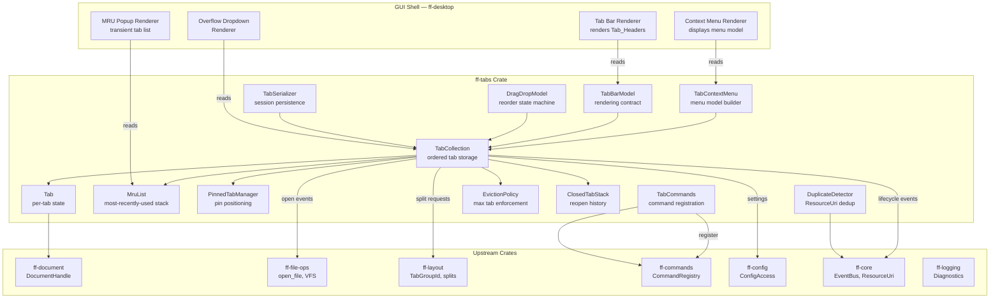

# Design Document: Multi-Tab Editor (`ff-tabs`)

## Overview

The `ff-tabs` crate implements the **multi-tab editor subsystem** for FileForgeWorkbench. It owns the tab data model, tab collection management, per-tab state isolation, MRU (Most Recently Used) ordering, pinned tabs, duplicate detection, tab context menu logic, session serialisation, and the rendering contract for the GUI shell's tab bar.

### Purpose

- Maintain ordered Tab_Collections within Tab_Groups, each holding zero or more Tabs with independent per-tab state
- Provide MRU-based and sequential tab switching with transient navigation UI contract
- Enforce pinned tab semantics (positioning, bulk-close immunity, compact rendering)
- Detect duplicate resource opens across all Tab_Groups via canonicalized ResourceUri comparison
- Expose a tab context menu model with conditional item enablement
- Support split editor views (same DocumentHandle, independent viewport state)
- Register all tab operations as commands in the command framework
- Serialise and deserialise complete tab state for session persistence
- Enforce configurable Maximum_Tab_Count with LRU eviction policy

### Position in Architecture

```
Wave 8 — File I/O and Session

┌─────────────────────────────────────────────────────────────┐
│              Shell Layer: ff-desktop (egui)                   │
│   (renders Tab_Bar headers using TabCollection model)        │
├─────────────────────────────────────────────────────────────┤
│  THIS CRATE: ff-tabs ← Wave 8                               │
│  (tab collection, per-tab state, MRU, pinned, context menu) │
├─────────────────────────────────────────────────────────────┤
│  ff-document (DocumentHandle) │ ff-file-ops (open/save)      │
│  ff-layout (Tab_Group splits) │ ff-commands (registry)       │
│  ff-config (tab settings)     │ ff-session (persistence)     │
│  ff-core (EventBus, ResourceUri) │ ff-logging (diagnostics)  │
├─────────────────────────────────────────────────────────────┤
│              Foundation Layer: ff-core                        │
└─────────────────────────────────────────────────────────────┘
```

### Design Constraints (Cross-Cutting)

- **GUI Independence**: Tab logic (collection management, MRU ordering, duplicate detection, context menu model) is entirely GUI-independent; the tab bar rendering is the shell's responsibility using the model exposed by this crate
- **Command-Driven**: All tab operations (`tabs.close`, `tabs.next`, `tabs.prev`, `tabs.pin`, etc.) are registered commands invocable from shortcuts, menus, macros, and plugins
- **Multi-Crate Workspace**: Crate at `crates/ff-tabs`
- **Error Message Standards**: All errors follow `[tabs] operation: description` format

### Upstream Dependencies

| Crate | Usage |
|-------|-------|
| `ff-core` | `ResourceUri`, `EventBus`, platform utilities, `TabId` generation |
| `ff-document` | `DocumentHandle` (`Arc<RwLock<Document>>`), `TransactionStack` reference |
| `ff-commands` | `CommandRegistry`, command registration, `CommandMetadata`, shortcut binding |
| `ff-config` | `ConfigAccess` for tab-related settings (max count, MRU mode, title format) |
| `ff-layout` | `TabGroupId`, split requests (`split_horizontal`, `split_vertical`) |
| `ff-file-ops` | `open_file()` for tab creation from file open, VFS resource resolution |
| `ff-logging` | Structured diagnostics at ERROR/WARN/INFO/DEBUG levels |

---

## Architecture

### High-Level Architecture Diagram



### Tab Lifecycle Flow

```
1. Tab Open (file.open / file.new / session restore)
   ├─ DuplicateDetector checks if ResourceUri already open
   │   ├─ Duplicate found → activate existing tab (no new tab)
   │   └─ No duplicate → proceed to creation
   ├─ EvictionPolicy checks Maximum_Tab_Count
   │   ├─ At limit → evict LRU non-pinned unmodified tab
   │   └─ All non-pinned modified → refuse open, emit error
   ├─ Create Tab with new TabId, DocumentHandle, default per-tab state
   ├─ Insert into TabCollection (respecting pinned boundary)
   ├─ Push to top of MruList
   ├─ Set as Active_Tab
   └─ Emit TabOpened event

2. Tab Activate (click / keyboard / MRU navigation)
   ├─ Persist departing tab's viewport + cursor state
   ├─ Move target tab to MRU top
   ├─ Restore target tab's viewport + cursor state
   ├─ Update Active_Tab reference
   └─ Emit TabActivated event

3. Tab Close (tabs.close command)
   ├─ Check modified flag
   │   ├─ Modified → request UnsavedChanges dialog from shell
   │   │   ├─ Save → delegate save, then remove
   │   │   ├─ Discard → remove without save
   │   │   └─ Cancel → abort close
   │   └─ Unmodified → remove immediately
   ├─ Remove from TabCollection and MruList
   ├─ Push to ClosedTabStack (for reopen)
   ├─ Activate next tab (MRU or sequential based on config)
   ├─ If last tab closed → create empty tab
   └─ Emit TabClosed event

4. Tab Pin/Unpin (tabs.pin / tabs.unpin)
   ├─ Toggle pinned flag
   ├─ Reposition in TabCollection (pinned left, unpinned right)
   └─ Emit TabPinChanged event
```

---

## Components and Interfaces

```
crates/ff-tabs/
├── Cargo.toml
├── src/
│   ├── lib.rs              # Public API re-exports, crate documentation
│   ├── collection.rs       # TabCollection: ordered storage, insertion, removal, reorder
│   ├── tab.rs              # Tab struct: per-tab state, DocumentHandle reference
│   ├── tab_id.rs           # TabId newtype: unique stable identifier
│   ├── tab_state.rs        # TabState: serialisable per-tab state snapshot
│   ├── mru.rs              # MruList: most-recently-used stack operations
│   ├── pinned.rs           # PinnedTabManager: pin/unpin, position enforcement
│   ├── duplicate.rs        # DuplicateDetector: ResourceUri deduplication
│   ├── context_menu.rs     # TabContextMenu: menu model, item enablement logic
│   ├── drag_drop.rs        # DragDropModel: reorder state machine, cross-group moves
│   ├── tab_bar.rs          # TabBarModel: rendering contract (titles, indicators, overflow)
│   ├── overflow.rs         # OverflowState: scroll position, dropdown list model
│   ├── commands.rs         # TabCommands: command registration and dispatch
│   ├── eviction.rs         # EvictionPolicy: max tab count enforcement
│   ├── closed_stack.rs     # ClosedTabStack: recently closed URIs for reopen
│   ├── title_format.rs     # Tab title formatting and disambiguation
│   ├── serialization.rs    # TabSerializer: session persistence (serialize/deserialize)
│   ├── config.rs           # TabConfig: typed configuration key accessors
│   ├── error.rs            # TabsError enum
│   └── traits.rs           # Shell-provided trait abstractions (UnsavedChangesDialog, ClipboardProvider)
└── tests/
    ├── collection_tests.rs     # TabCollection ordering, insertion, removal
    ├── mru_tests.rs            # MRU stack operations property tests
    ├── pinned_tests.rs         # Pinned tab positioning property tests
    ├── duplicate_tests.rs      # Duplicate detection tests
    ├── context_menu_tests.rs   # Context menu enablement logic tests
    ├── eviction_tests.rs       # Max tab enforcement property tests
    ├── closed_stack_tests.rs   # Reopen history tests
    ├── title_format_tests.rs   # Title disambiguation property tests
    ├── serialization_tests.rs  # Round-trip serialisation property tests
    ├── drag_drop_tests.rs      # Drag-and-drop reorder tests
    ├── commands_tests.rs       # Command registration and dispatch tests
    └── integration.rs          # End-to-end tab lifecycle flows with mock subsystems
```

---

## Data Models

### TabId

```rust
/// A unique, stable identifier for a tab within a workbench session.
/// Does not change when a tab is moved or reordered.
///
/// Addresses: Requirement 1, Glossary
#[derive(Debug, Clone, PartialEq, Eq, Hash, PartialOrd, Ord)]
pub struct TabId(String);

impl TabId {
    /// Generate a new unique TabId.
    pub fn new() -> Self;

    /// Create a TabId from a known string (session restore).
    pub fn from_str(id: &str) -> Self;

    /// Get the underlying string representation.
    pub fn as_str(&self) -> &str;
}

impl std::fmt::Display for TabId {
    fn fmt(&self, f: &mut std::fmt::Formatter<'_>) -> std::fmt::Result;
}
```

### Tab

```rust
/// A single tab holding a DocumentHandle and independent per-tab state.
///
/// Addresses: Requirement 1 AC 1, Requirement 2
pub struct Tab {
    /// Unique stable identifier for this tab.
    id: TabId,
    /// Reference to the document's shared content and undo stack.
    document_handle: DocumentHandle,
    /// The resource URI of the backing file (None for untitled).
    resource_uri: Option<ResourceUri>,
    /// Viewport position: 1-based top line.
    viewport_top_line: usize,
    /// Horizontal scroll offset in columns.
    viewport_horizontal_offset: usize,
    /// Cursor position (line, column), 1-based.
    cursor_position: (usize, usize),
    /// Selection ranges (including multi-caret).
    selections: Vec<SelectionRange>,
    /// Active language definition for this tab.
    language: Option<String>,
    /// Whether the document has unsaved modifications.
    is_modified: bool,
    /// Whether this tab is pinned.
    is_pinned: bool,
    /// Command line string associated with this tab.
    command_line: String,
    /// Status message for this tab.
    status_message: String,
    /// Set of collapsed fold regions (line numbers).
    fold_state: Vec<FoldRegion>,
    /// Bookmark set (line numbers).
    bookmarks: Vec<usize>,
    /// Encoding of the document.
    encoding: String,
    /// Line ending mode (LF, CRLF, CR).
    line_ending: LineEnding,
}

impl Tab {
    /// Create a new tab with the given document and resource.
    pub fn new(document_handle: DocumentHandle, resource_uri: Option<ResourceUri>) -> Self;

    /// Get the tab's unique identifier.
    pub fn id(&self) -> &TabId;

    /// Get the document handle (shared ownership).
    pub fn document_handle(&self) -> &DocumentHandle;

    /// Get the resource URI (None for untitled documents).
    pub fn resource_uri(&self) -> Option<&ResourceUri>;

    /// Set the resource URI (after Save As).
    pub fn set_resource_uri(&mut self, uri: Option<ResourceUri>);

    /// Get the modified flag.
    pub fn is_modified(&self) -> bool;

    /// Set the modified flag and emit notification.
    pub fn set_modified(&mut self, modified: bool);

    /// Get the pinned flag.
    pub fn is_pinned(&self) -> bool;

    /// Set the pinned flag.
    pub fn set_pinned(&mut self, pinned: bool);

    /// Capture the current viewport/cursor state for persistence.
    pub fn capture_state(&self) -> TabViewportState;

    /// Restore a previously captured viewport/cursor state.
    pub fn restore_state(&mut self, state: &TabViewportState);

    /// Get the file name for tab title display.
    pub fn file_name(&self) -> Option<&str>;

    /// Get the encoding.
    pub fn encoding(&self) -> &str;

    /// Get the line ending mode.
    pub fn line_ending(&self) -> LineEnding;
}

/// Captured viewport and cursor state for tab switching.
#[derive(Debug, Clone, PartialEq)]
pub struct TabViewportState {
    pub viewport_top_line: usize,
    pub viewport_horizontal_offset: usize,
    pub cursor_position: (usize, usize),
    pub selections: Vec<SelectionRange>,
    pub command_line: String,
}

/// A selection range within a document (supports multi-caret).
#[derive(Debug, Clone, PartialEq)]
pub struct SelectionRange {
    pub start: (usize, usize),
    pub end: (usize, usize),
}

/// A collapsed fold region.
#[derive(Debug, Clone, PartialEq)]
pub struct FoldRegion {
    pub start_line: usize,
    pub end_line: usize,
}

/// Line ending mode.
#[derive(Debug, Clone, Copy, PartialEq, Eq)]
pub enum LineEnding {
    Lf,
    CrLf,
    Cr,
}
```

### TabState (Serialisable)

```rust
/// Serialisable per-tab state for session persistence.
/// This is the session-layer snapshot — lighter than the runtime Tab.
///
/// Addresses: Requirement 2 AC 8, Requirement 14
#[derive(Debug, Clone, PartialEq, Serialize, Deserialize)]
pub struct TabState {
    pub tab_id: String,
    pub resource_uri: Option<String>,
    pub viewport_top_line: usize,
    pub viewport_horizontal_offset: usize,
    pub cursor_position: (usize, usize),
    pub selections: Vec<SerializableSelection>,
    pub language_override: Option<String>,
    pub is_pinned: bool,
    pub encoding: String,
    pub line_ending: String,
    pub fold_state: Vec<(usize, usize)>,
    pub bookmarks: Vec<usize>,
}

/// Serialisable selection range.
#[derive(Debug, Clone, PartialEq, Serialize, Deserialize)]
pub struct SerializableSelection {
    pub start: (usize, usize),
    pub end: (usize, usize),
}
```

### TabCollection

```rust
/// The ordered collection of all open Tabs within a single Tab_Group.
/// Maintains both insertion order and MRU order.
///
/// Addresses: Requirement 1, Requirement 7
pub struct TabCollection {
    /// Tabs in insertion order (pinned tabs always precede unpinned).
    tabs: Vec<Tab>,
    /// The MRU stack tracking activation order.
    mru: MruList,
    /// The TabId of the currently active tab.
    active_tab_id: Option<TabId>,
    /// The Tab_Group this collection belongs to.
    tab_group_id: TabGroupId,
    /// Eviction policy for max tab enforcement.
    eviction_policy: EvictionPolicy,
    /// Stack of recently closed tab URIs for reopen.
    closed_stack: ClosedTabStack,
    /// Duplicate detector shared across all collections.
    duplicate_detector: Arc<DuplicateDetector>,
}

impl TabCollection {
    /// Create a new empty TabCollection for the given Tab_Group.
    pub fn new(
        tab_group_id: TabGroupId,
        duplicate_detector: Arc<DuplicateDetector>,
        config: &TabConfig,
    ) -> Self;

    /// Number of tabs in the collection.
    pub fn len(&self) -> usize;

    /// Whether the collection is empty.
    pub fn is_empty(&self) -> bool;

    /// Get a reference to the active tab.
    pub fn active_tab(&self) -> Option<&Tab>;

    /// Get a mutable reference to the active tab.
    pub fn active_tab_mut(&mut self) -> Option<&mut Tab>;

    /// Get the active tab's ID.
    pub fn active_tab_id(&self) -> Option<&TabId>;

    /// Get a tab by its ID.
    pub fn get(&self, id: &TabId) -> Option<&Tab>;

    /// Get a mutable reference to a tab by its ID.
    pub fn get_mut(&mut self, id: &TabId) -> Option<&mut Tab>;

    /// Get a tab by its position index.
    pub fn get_by_index(&self, index: usize) -> Option<&Tab>;

    /// Get the position index of a tab.
    pub fn index_of(&self, id: &TabId) -> Option<usize>;

    /// Iterate over all tabs in insertion order.
    pub fn iter(&self) -> impl Iterator<Item = &Tab>;

    /// Open a new tab, inserting it at the appropriate position.
    /// Returns the TabId of the new or existing (duplicate) tab.
    ///
    /// Addresses: Requirement 1 AC 2, AC 3, AC 6; Requirement 11
    pub fn open_tab(&mut self, options: TabOpenOptions) -> Result<TabId, TabsError>;

    /// Close a tab by ID. Returns the close result.
    ///
    /// Addresses: Requirement 5
    pub fn close_tab(&mut self, id: &TabId) -> Result<CloseResult, TabsError>;

    /// Activate a tab (switch to it as Active_Tab).
    ///
    /// Addresses: Requirement 1 AC 5, Requirement 7 AC 2
    pub fn activate_tab(&mut self, id: &TabId) -> Result<(), TabsError>;

    /// Move a tab to a new position index (drag-and-drop reorder).
    ///
    /// Addresses: Requirement 9 AC 3
    pub fn move_tab(&mut self, id: &TabId, new_index: usize) -> Result<(), TabsError>;

    /// Swap a tab with its left neighbour.
    pub fn move_tab_left(&mut self, id: &TabId) -> Result<(), TabsError>;

    /// Swap a tab with its right neighbour.
    pub fn move_tab_right(&mut self, id: &TabId) -> Result<(), TabsError>;

    /// Pin a tab (move to pinned region).
    ///
    /// Addresses: Requirement 10 AC 1
    pub fn pin_tab(&mut self, id: &TabId) -> Result<(), TabsError>;

    /// Unpin a tab (move to unpinned region).
    ///
    /// Addresses: Requirement 10 AC 2
    pub fn unpin_tab(&mut self, id: &TabId) -> Result<(), TabsError>;

    /// Get the MRU list reference.
    pub fn mru(&self) -> &MruList;

    /// Get all pinned tabs in order.
    pub fn pinned_tabs(&self) -> impl Iterator<Item = &Tab>;

    /// Get all unpinned tabs in order.
    pub fn unpinned_tabs(&self) -> impl Iterator<Item = &Tab>;

    /// Get the number of pinned tabs.
    pub fn pinned_count(&self) -> usize;

    /// Serialize the collection state for session persistence.
    ///
    /// Addresses: Requirement 14 AC 1
    pub fn serialize_state(&self) -> SerializedTabCollection;

    /// Restore collection state from serialised data.
    ///
    /// Addresses: Requirement 14 AC 2
    pub fn restore_state(&mut self, data: SerializedTabCollection) -> Result<(), TabsError>;
}
```

### TabGroup

```rust
/// Identifies a spatial container managed by the Layout_Engine.
/// The multi-tab subsystem does not own Tab_Groups — it populates them.
///
/// Addresses: Glossary, Requirement 1 AC 1
#[derive(Debug, Clone, PartialEq, Eq, Hash)]
pub struct TabGroupId(String);

impl TabGroupId {
    pub fn new(id: &str) -> Self;
    pub fn as_str(&self) -> &str;
}
```

### MruList

```rust
/// Most-Recently-Used ordering of tabs within a Tab_Group.
/// Updated on every tab activation. Used for Ctrl+Tab cycling.
///
/// Addresses: Requirement 7
pub struct MruList {
    /// Tab IDs in MRU order (index 0 = most recently used).
    stack: Vec<TabId>,
    /// Whether an MRU navigation session is currently active.
    navigation_active: bool,
    /// The index within the stack during an active navigation session.
    navigation_index: usize,
}

impl MruList {
    /// Create a new empty MRU list.
    pub fn new() -> Self;

    /// Push a tab to the top of the MRU stack (most recently used).
    ///
    /// Addresses: Requirement 7 AC 2
    pub fn push(&mut self, id: &TabId);

    /// Remove a tab from the MRU stack (tab closed).
    ///
    /// Addresses: Requirement 7 AC 8
    pub fn remove(&mut self, id: &TabId);

    /// Get the tab at position N in MRU order (0 = most recent).
    pub fn get(&self, index: usize) -> Option<&TabId>;

    /// Get the number of tabs in the MRU stack.
    pub fn len(&self) -> usize;

    /// Whether the MRU stack is empty.
    pub fn is_empty(&self) -> bool;

    /// Begin an MRU navigation session (Ctrl+Tab pressed).
    ///
    /// Addresses: Requirement 7 AC 3
    pub fn begin_navigation(&mut self) -> Option<&TabId>;

    /// Advance forward in MRU navigation (Ctrl+Tab again).
    ///
    /// Addresses: Requirement 7 AC 3
    pub fn navigate_next(&mut self) -> Option<&TabId>;

    /// Go back in MRU navigation (Ctrl+Shift+Tab).
    ///
    /// Addresses: Requirement 7 AC 4
    pub fn navigate_prev(&mut self) -> Option<&TabId>;

    /// Commit the current navigation position (Ctrl released).
    ///
    /// Addresses: Requirement 7 AC 5
    pub fn commit_navigation(&mut self);

    /// Cancel the navigation session without committing.
    pub fn cancel_navigation(&mut self);

    /// Whether a navigation session is currently active.
    pub fn is_navigating(&self) -> bool;

    /// Get the current navigation index (for popup display).
    pub fn navigation_index(&self) -> usize;

    /// Get the full MRU-ordered list of TabIds.
    pub fn ordered(&self) -> &[TabId];

    /// Serialize the MRU order for session persistence.
    ///
    /// Addresses: Requirement 7 AC 9
    pub fn serialize(&self) -> Vec<String>;

    /// Restore MRU order from serialised data.
    pub fn restore(&mut self, order: &[String]);
}
```

### TabContextMenu

```rust
/// The logical model for the tab right-click context menu.
/// Built on demand for a specific target tab, with items conditionally enabled.
///
/// Addresses: Requirement 6
pub struct TabContextMenu {
    /// The TabId this menu was built for.
    target_tab_id: TabId,
    /// Menu items in display order.
    items: Vec<ContextMenuItem>,
}

/// A single item in the tab context menu.
#[derive(Debug, Clone)]
pub enum ContextMenuItem {
    /// An actionable menu command.
    Action {
        /// Display label.
        label: String,
        /// Command ID to execute when selected.
        command_id: String,
        /// Whether the item is currently enabled.
        enabled: bool,
        /// Optional keyboard shortcut hint text.
        shortcut_hint: Option<String>,
    },
    /// A visual separator between groups.
    Separator,
}

impl TabContextMenu {
    /// Build a context menu for the given target tab within its collection.
    ///
    /// Addresses: Requirement 6 AC 2, AC 16–21
    pub fn build(
        target_tab_id: &TabId,
        collection: &TabCollection,
    ) -> Self;

    /// Get the target tab ID.
    pub fn target_tab_id(&self) -> &TabId;

    /// Get all menu items.
    pub fn items(&self) -> &[ContextMenuItem];

    /// Execute the selected menu item (dispatches to command framework).
    pub fn execute(&self, index: usize) -> Result<(), TabsError>;
}
```

### TabBarModel (Rendering Contract)

```rust
/// The data model exposed to the GUI shell for rendering the tab bar.
/// The shell reads this model to draw Tab_Headers; it does not mutate it directly.
///
/// Addresses: Requirement 3, Requirement 4
pub struct TabBarModel {
    /// Tab headers in display order (pinned first, then unpinned).
    headers: Vec<TabHeaderInfo>,
    /// Index of the active tab in the headers list.
    active_index: Option<usize>,
    /// Whether the tab bar is in overflow mode.
    is_overflow: bool,
    /// Visible range of tab indices (for overflow scrolling).
    visible_range: (usize, usize),
}

/// Information for rendering a single tab header.
///
/// Addresses: Requirement 3 AC 2–10
#[derive(Debug, Clone)]
pub struct TabHeaderInfo {
    /// The tab's unique ID.
    pub tab_id: TabId,
    /// The formatted display title.
    pub title: String,
    /// Whether this tab is the active tab.
    pub is_active: bool,
    /// Whether the document has unsaved modifications.
    pub is_modified: bool,
    /// Whether this tab is pinned.
    pub is_pinned: bool,
    /// Optional tooltip text (full path or URI).
    pub tooltip: Option<String>,
}

impl TabBarModel {
    /// Build the tab bar model from the current collection state.
    pub fn build(collection: &TabCollection, config: &TabConfig) -> Self;

    /// Get all headers.
    pub fn headers(&self) -> &[TabHeaderInfo];

    /// Get the active tab index.
    pub fn active_index(&self) -> Option<usize>;

    /// Whether overflow mode is active.
    pub fn is_overflow(&self) -> bool;

    /// Get the visible range for scroll rendering.
    pub fn visible_range(&self) -> (usize, usize);

    /// Scroll left in overflow mode.
    pub fn scroll_left(&mut self);

    /// Scroll right in overflow mode.
    pub fn scroll_right(&mut self);

    /// Ensure the active tab is visible (scroll into view).
    ///
    /// Addresses: Requirement 4 AC 4
    pub fn ensure_active_visible(&mut self);
}
```

### Supporting Types

```rust
/// Options for opening a new tab.
#[derive(Debug, Clone)]
pub struct TabOpenOptions {
    /// The document handle to associate with the tab.
    pub document_handle: DocumentHandle,
    /// The resource URI (None for untitled).
    pub resource_uri: Option<ResourceUri>,
    /// Whether to force a split view (bypass duplicate detection).
    pub force_split_view: bool,
    /// Whether to activate the tab after creation.
    pub activate: bool,
    /// Initial viewport state to restore (session restore).
    pub initial_state: Option<TabViewportState>,
    /// Whether the tab should be pinned on creation.
    pub pinned: bool,
}

/// Result of a tab close operation.
#[derive(Debug, Clone, PartialEq, Eq)]
pub enum CloseResult {
    /// Tab was closed successfully.
    Closed,
    /// Close was cancelled by user (unsaved changes dialog).
    Cancelled,
    /// Tab cannot be closed (pinned — use unpin or close_pinned).
    PinnedRefused,
}

/// Serialised representation of an entire TabCollection for session persistence.
///
/// Addresses: Requirement 14
#[derive(Debug, Clone, PartialEq, Serialize, Deserialize)]
pub struct SerializedTabCollection {
    /// Schema version for forward compatibility.
    pub schema_version: u32,
    /// Ordered tab states.
    pub tabs: Vec<TabState>,
    /// The active tab ID.
    pub active_tab_id: Option<String>,
    /// MRU order (list of tab IDs from most to least recent).
    pub mru_order: Vec<String>,
    /// The Tab_Group ID this collection belongs to.
    pub tab_group_id: String,
}

/// Entry in the closed tab stack for reopen functionality.
///
/// Addresses: Requirement 8 AC 7
#[derive(Debug, Clone)]
pub struct ClosedTabEntry {
    /// The resource URI of the closed tab.
    pub resource_uri: ResourceUri,
    /// The viewport state at close time (for position restore).
    pub viewport_state: TabViewportState,
    /// Timestamp when the tab was closed.
    pub closed_at: std::time::Instant,
}

/// Configuration for the tab navigation mode.
///
/// Addresses: Requirement 7 AC 7
#[derive(Debug, Clone, Copy, PartialEq, Eq)]
pub enum TabNavigationMode {
    /// Ctrl+Tab cycles in MRU order (default).
    Mru,
    /// Ctrl+Tab cycles in Tab_Bar insertion order.
    Sequential,
}

/// Configuration for tab title formatting.
///
/// Addresses: Requirement 3 AC 12
#[derive(Debug, Clone, Copy, PartialEq, Eq)]
pub enum TabTitleFormat {
    /// Show filename only (default).
    FilenameOnly,
    /// Always show filename with one parent directory.
    FilenameWithDirectory,
    /// Show parent directory only when needed for disambiguation.
    AutoDisambiguate,
}
```

---

## Public API Surface

### Tab Collection Management

```rust
/// The primary entry point for managing tabs across all Tab_Groups.
///
/// Addresses: Requirement 1, Requirement 11, Requirement 12
pub struct TabManager {
    /// TabCollections indexed by TabGroupId.
    collections: HashMap<TabGroupId, TabCollection>,
    /// Cross-group duplicate detector.
    duplicate_detector: Arc<DuplicateDetector>,
    /// Configuration access.
    config: Arc<dyn ConfigAccess>,
    /// Event bus for lifecycle notifications.
    event_bus: Arc<EventBus>,
}

impl TabManager {
    /// Create a new TabManager.
    pub fn new(
        config: Arc<dyn ConfigAccess>,
        event_bus: Arc<EventBus>,
    ) -> Self;

    /// Get the TabCollection for a specific Tab_Group.
    pub fn collection(&self, group_id: &TabGroupId) -> Option<&TabCollection>;

    /// Get a mutable reference to a TabCollection.
    pub fn collection_mut(&mut self, group_id: &TabGroupId) -> Option<&mut TabCollection>;

    /// Create a new TabCollection for a Tab_Group.
    pub fn create_collection(&mut self, group_id: TabGroupId) -> &mut TabCollection;

    /// Remove a TabCollection (Tab_Group closed by Layout_Engine).
    pub fn remove_collection(&mut self, group_id: &TabGroupId);

    /// Open a tab in the specified Tab_Group.
    /// Handles duplicate detection across all groups.
    ///
    /// Addresses: Requirement 1 AC 2, Requirement 11 AC 1, AC 2
    pub fn open_tab(
        &mut self,
        group_id: &TabGroupId,
        options: TabOpenOptions,
    ) -> Result<OpenTabResult, TabsError>;

    /// Find which Tab_Group contains a given ResourceUri.
    ///
    /// Addresses: Requirement 11 AC 2
    pub fn find_tab_by_uri(&self, uri: &ResourceUri) -> Option<(TabGroupId, TabId)>;

    /// Split a tab into a new Tab_Group (creates shared DocumentHandle view).
    ///
    /// Addresses: Requirement 12 AC 1, AC 2
    pub fn split_tab(
        &mut self,
        source_tab_id: &TabId,
        source_group_id: &TabGroupId,
        split_direction: SplitDirection,
        layout_engine: &dyn LayoutSplitter,
    ) -> Result<TabId, TabsError>;

    /// Get all tab collections (for session serialisation).
    pub fn all_collections(&self) -> impl Iterator<Item = (&TabGroupId, &TabCollection)>;

    /// Serialize all tab state for session persistence.
    ///
    /// Addresses: Requirement 14 AC 1
    pub fn serialize_all(&self) -> Vec<SerializedTabCollection>;

    /// Restore all tab state from session data.
    ///
    /// Addresses: Requirement 14 AC 2
    pub fn restore_all(
        &mut self,
        data: Vec<SerializedTabCollection>,
        file_opener: &dyn FileOpener,
    ) -> Result<(), TabsError>;
}

/// Result of an open_tab operation.
#[derive(Debug)]
pub enum OpenTabResult {
    /// A new tab was created.
    Created { tab_id: TabId, group_id: TabGroupId },
    /// An existing duplicate was activated instead.
    DuplicateActivated { tab_id: TabId, group_id: TabGroupId },
}

/// Split direction for creating new Tab_Groups.
#[derive(Debug, Clone, Copy, PartialEq, Eq)]
pub enum SplitDirection {
    Right,
    Down,
}
```

### Duplicate Detection

```rust
/// Cross-group duplicate detection using canonicalized ResourceUris.
///
/// Addresses: Requirement 11
pub struct DuplicateDetector {
    /// Map of canonical URI → (TabGroupId, TabId) for all open resources.
    registry: RwLock<HashMap<String, (TabGroupId, TabId)>>,
}

impl DuplicateDetector {
    /// Create a new empty detector.
    pub fn new() -> Self;

    /// Register a tab with a resource URI.
    pub fn register(&self, uri: &ResourceUri, group_id: &TabGroupId, tab_id: &TabId);

    /// Unregister a tab (tab closed or moved).
    pub fn unregister(&self, uri: &ResourceUri);

    /// Check if a resource is already open. Returns location if found.
    ///
    /// Addresses: Requirement 11 AC 1, AC 3
    pub fn find_duplicate(&self, uri: &ResourceUri) -> Option<(TabGroupId, TabId)>;

    /// Canonicalize a ResourceUri for comparison.
    /// Resolves symlinks, normalizes case on case-insensitive FS, resolves relative segments.
    ///
    /// Addresses: Requirement 11 AC 3
    pub fn canonicalize(uri: &ResourceUri) -> String;
}
```

### Eviction Policy

```rust
/// Enforces the configurable Maximum_Tab_Count per Tab_Group.
///
/// Addresses: Requirement 1 AC 6
pub struct EvictionPolicy {
    /// Maximum number of tabs allowed.
    max_tabs: usize,
}

impl EvictionPolicy {
    /// Create with the configured maximum.
    pub fn new(max_tabs: usize) -> Self;

    /// Update the maximum (config hot-reload).
    pub fn set_max_tabs(&mut self, max: usize);

    /// Check if a new tab can be opened. If not, returns the TabId to evict.
    /// Evicts the LRU non-pinned, unmodified tab.
    ///
    /// Addresses: Requirement 1 AC 6
    pub fn check_and_evict(
        &self,
        collection: &TabCollection,
    ) -> EvictionResult;
}

/// Result of eviction check.
#[derive(Debug)]
pub enum EvictionResult {
    /// Room available, no eviction needed.
    Allowed,
    /// A tab can be evicted to make room.
    Evict(TabId),
    /// Cannot evict (all non-pinned tabs are modified). Refuse open.
    Refused,
}
```

### Tab Title Formatting

```rust
/// Handles tab title computation and disambiguation.
///
/// Addresses: Requirement 3 AC 2, AC 3, AC 4, AC 12
pub struct TitleFormatter;

impl TitleFormatter {
    /// Compute display titles for all tabs in a collection,
    /// applying disambiguation where needed.
    pub fn format_titles(
        collection: &TabCollection,
        format: TabTitleFormat,
    ) -> Vec<(TabId, String)>;

    /// Format a single tab's title (without cross-tab disambiguation).
    pub fn format_single(tab: &Tab, format: TabTitleFormat) -> String;

    /// Generate untitled document names with numeric suffixes.
    ///
    /// Addresses: Requirement 3 AC 3
    pub fn untitled_name(existing_untitled_count: usize) -> String;
}
```

### Closed Tab Stack

```rust
/// Maintains a bounded stack of recently closed tabs for reopen.
///
/// Addresses: Requirement 8 AC 7
pub struct ClosedTabStack {
    /// Stack entries (index 0 = most recently closed).
    entries: Vec<ClosedTabEntry>,
    /// Maximum entries to retain (default: 20).
    max_entries: usize,
}

impl ClosedTabStack {
    /// Create with the configured maximum.
    pub fn new(max_entries: usize) -> Self;

    /// Push a closed tab entry.
    pub fn push(&mut self, entry: ClosedTabEntry);

    /// Pop the most recently closed tab (for reopen).
    pub fn pop(&mut self) -> Option<ClosedTabEntry>;

    /// Peek at the most recently closed tab without removing.
    pub fn peek(&self) -> Option<&ClosedTabEntry>;

    /// Whether any closed tabs are available for reopen.
    pub fn is_empty(&self) -> bool;

    /// Number of entries in the stack.
    pub fn len(&self) -> usize;
}
```

### Command Registration

```rust
/// Register all tab commands with the command framework.
///
/// Addresses: Requirement 13 AC 1, AC 8
pub fn register_tab_commands(
    registry: &CommandRegistry,
    tab_manager: Arc<RwLock<TabManager>>,
) -> Result<(), TabsError>;

/// Registered commands:
/// - tabs.close          — Close the active tab (Ctrl+W)
/// - tabs.close_all      — Close all non-pinned tabs
/// - tabs.close_others   — Close all except active tab
/// - tabs.close_to_left  — Close all to the left of active
/// - tabs.close_to_right — Close all to the right of active
/// - tabs.close_pinned   — Force-close a pinned tab
/// - tabs.next           — Next tab in sequential order
/// - tabs.previous       — Previous tab in sequential order
/// - tabs.next_mru       — Next tab in MRU order (Ctrl+Tab)
/// - tabs.previous_mru   — Previous tab in MRU order (Ctrl+Shift+Tab)
/// - tabs.pin            — Pin the active tab
/// - tabs.unpin          — Unpin the active tab
/// - tabs.move_left      — Move active tab one position left
/// - tabs.move_right     — Move active tab one position right
/// - tabs.goto_1..9      — Go to tab at position 1–9 (Ctrl+1..9)
/// - tabs.split_right    — Split active tab right
/// - tabs.split_down     — Split active tab down
/// - tabs.reopen_closed  — Reopen last closed tab (Ctrl+Shift+T)
/// - tabs.duplicate      — Duplicate the active tab
```

### Drag and Drop

```rust
/// State machine for tab drag-and-drop reordering.
///
/// Addresses: Requirement 9
pub struct DragDropModel {
    /// The tab being dragged (None when idle).
    dragging: Option<DragState>,
}

/// Current drag operation state.
#[derive(Debug, Clone)]
pub struct DragState {
    /// The tab being dragged.
    pub tab_id: TabId,
    /// The source Tab_Group.
    pub source_group_id: TabGroupId,
    /// The original position index.
    pub original_index: usize,
    /// Whether the tab is pinned (constrains drop zone).
    pub is_pinned: bool,
}

impl DragDropModel {
    /// Create a new idle drag-drop model.
    pub fn new() -> Self;

    /// Begin a drag operation on the given tab.
    ///
    /// Addresses: Requirement 9 AC 1
    pub fn begin_drag(&mut self, tab_id: &TabId, collection: &TabCollection) -> Result<(), TabsError>;

    /// Compute the valid drop index for the current cursor position.
    /// Respects pinned tab constraints.
    ///
    /// Addresses: Requirement 9 AC 2, AC 8
    pub fn compute_drop_index(
        &self,
        cursor_position: f32,
        tab_widths: &[f32],
        collection: &TabCollection,
    ) -> Option<usize>;

    /// Complete the drag operation at the computed drop index.
    ///
    /// Addresses: Requirement 9 AC 3
    pub fn complete_drag(
        &mut self,
        collection: &mut TabCollection,
        drop_index: usize,
    ) -> Result<(), TabsError>;

    /// Cancel the drag operation (Escape pressed).
    ///
    /// Addresses: Requirement 9 AC 10
    pub fn cancel_drag(&mut self);

    /// Whether a drag is currently in progress.
    pub fn is_dragging(&self) -> bool;

    /// Get the current drag state.
    pub fn drag_state(&self) -> Option<&DragState>;
}
```

### Shell Trait Abstractions

```rust
/// Trait for unsaved-changes dialog interaction (GUI shell provides implementation).
pub trait UnsavedChangesDialog: Send + Sync {
    /// Show the unsaved-changes dialog for a single tab.
    /// Returns Save, Discard, or Cancel.
    fn show(&self, tab_title: &str, resource_uri: Option<&str>) -> UnsavedChangesAction;
}

/// Unsaved changes dialog response.
#[derive(Debug, Clone, Copy, PartialEq, Eq)]
pub enum UnsavedChangesAction {
    Save,
    Discard,
    Cancel,
}

/// Trait for clipboard operations (shell-provided).
pub trait ClipboardProvider: Send + Sync {
    /// Copy text to the system clipboard.
    fn copy_to_clipboard(&self, text: &str) -> Result<(), TabsError>;
}

/// Trait for requesting layout splits (delegates to ff-layout).
pub trait LayoutSplitter: Send + Sync {
    /// Request a horizontal split, creating a new Tab_Group.
    fn split_horizontal(&self, source_group: &TabGroupId) -> Result<TabGroupId, TabsError>;
    /// Request a vertical split, creating a new Tab_Group.
    fn split_vertical(&self, source_group: &TabGroupId) -> Result<TabGroupId, TabsError>;
}

/// Trait for opening files during session restore (delegates to ff-file-ops).
pub trait FileOpener: Send + Sync {
    /// Open a resource by URI, returning a DocumentHandle.
    fn open_resource(&self, uri: &str) -> Result<DocumentHandle, TabsError>;
}
```

---

## Error Handling

```rust
/// Error type for all tab subsystem failures.
///
/// All variants include sufficient context for diagnostics.
/// Display format: `[tabs] operation: description`
#[derive(Debug, thiserror::Error)]
#[non_exhaustive]
pub enum TabsError {
    /// Attempted to operate on a tab that does not exist.
    #[error("[tabs] lookup: tab not found — id: {tab_id}")]
    TabNotFound {
        tab_id: String,
    },

    /// Attempted to operate on a Tab_Group that does not exist.
    #[error("[tabs] lookup: tab group not found — id: {group_id}")]
    TabGroupNotFound {
        group_id: String,
    },

    /// Maximum tab count reached and no evictable tab available.
    #[error("[tabs] open: maximum tab count ({max}) reached — all non-pinned tabs have unsaved changes")]
    MaxTabCountReached {
        max: usize,
    },

    /// Resource could not be opened during tab creation.
    #[error("[tabs] open: failed to open resource — uri: {uri}, reason: {reason}")]
    ResourceOpenFailed {
        uri: String,
        reason: String,
    },

    /// Tab move operation invalid (already at boundary).
    #[error("[tabs] move: cannot move tab {direction} — already at {position} boundary")]
    MoveAtBoundary {
        direction: String,
        position: String,
    },

    /// Pin operation on already-pinned tab or unpin on already-unpinned.
    #[error("[tabs] pin: tab is already {state}")]
    PinStateUnchanged {
        state: String,
    },

    /// Split operation failed (layout engine error).
    #[error("[tabs] split: failed to create split — {reason}")]
    SplitFailed {
        reason: String,
    },

    /// Session serialization failed.
    #[error("[tabs] serialize: failed to serialize tab state — {reason}")]
    SerializationFailed {
        reason: String,
    },

    /// Session deserialization failed.
    #[error("[tabs] deserialize: failed to restore tab state — {reason}")]
    DeserializationFailed {
        reason: String,
    },

    /// Session schema version mismatch (too new to migrate).
    #[error("[tabs] deserialize: unsupported schema version {version} (current: {current})")]
    UnsupportedSchemaVersion {
        version: u32,
        current: u32,
    },

    /// Clipboard operation failed.
    #[error("[tabs] clipboard: failed to copy to clipboard — {reason}")]
    ClipboardFailed {
        reason: String,
    },

    /// Command registration failed.
    #[error("[tabs] commands: failed to register command '{command_id}' — {reason}")]
    CommandRegistrationFailed {
        command_id: String,
        reason: String,
    },

    /// Drag-and-drop operation invalid.
    #[error("[tabs] drag-drop: {reason}")]
    DragDropError {
        reason: String,
    },

    /// Generic I/O error with tab context.
    #[error("[tabs] {operation}: I/O error — {source}")]
    Io {
        operation: String,
        #[source]
        source: std::io::Error,
    },
}
```

---

## Integration Points

### Integration with `ff-document` (document-model)

| Operation | API Used | Notes |
|-----------|----------|-------|
| Document creation (new file) | `Document::new_empty()` → `DocumentHandle` | For `file.new` and last-tab-closed replacement |
| Document access | `DocumentHandle` (`Arc<RwLock<Document>>`) | Shared across split views |
| Modification tracking | `Document::is_modified()` | Drives modified indicator on Tab_Header |
| Save point notification | `Document::mark_saved()` | Clears modified flag after successful save |
| Undo/Redo stack | `Document::transaction_stack()` | Shared across split view tabs |
| Language detection | `Document::detected_language()` | Initial tab language assignment |
| Encoding info | `Document::encoding()` | Per-tab encoding display |

### Integration with `ff-file-ops` (file-operations)

| Operation | API Used | Notes |
|-----------|----------|-------|
| Open file → create tab | `open_file(FileOpenOptions)` → `DocumentHandle` | Tab creation after VFS load |
| Save file (close flow) | `save_file(DocumentHandle, ResourceUri)` | When user chooses "Save" on close |
| Resource existence check | VFS `stat()` via `ff-file-ops` | Session restore validation |
| URI canonicalization | `canonicalize_uri(ResourceUri)` | For duplicate detection |
| Reopen closed tab | `open_file()` with stored URI | `tabs.reopen_closed` command |

### Integration with `ff-session` (startup-and-session)

| Operation | API Used | Notes |
|-----------|----------|-------|
| Session save | `TabManager::serialize_all()` → `Vec<SerializedTabCollection>` | Called during exit/auto-save |
| Session restore | `TabManager::restore_all(data, file_opener)` | During startup Phase 9 |
| Active tab persistence | `TabCollection::active_tab_id()` | Saved and restored |
| MRU persistence | `MruList::serialize()` / `MruList::restore()` | Preserved across restarts |
| Crash recovery | Tab modified state informs recovery file strategy | Coordinates with ff-undo-redo |

### Integration with `ff-layout` (layout-and-docking)

| Operation | API Used | Notes |
|-----------|----------|-------|
| Tab_Group creation (split) | `LayoutEngine::split_horizontal()` / `split_vertical()` | Via `LayoutSplitter` trait |
| Tab_Group removal | `LayoutEngine::remove_group()` | When last tab leaves a group |
| Tab_Group identification | `TabGroupId` | Shared identity between layout and tabs |
| Focus tracking | `LayoutEngine::active_group()` | Determines which TabCollection receives commands |
| Drag to new group | `LayoutEngine::create_group_at_position()` | Drop outside existing Tab_Bars |

### Integration with `ff-commands` (command-framework)

| Operation | API Used | Notes |
|-----------|----------|-------|
| Command registration | `CommandRegistry::register()` | All `tabs.*` commands at startup |
| Command metadata | `CommandMetadata { name, description, category, shortcut, enabled_predicate }` | Per-command |
| Shortcut binding | `ShortcutRegistry::bind()` | Default key bindings |
| Command execution | `CommandRegistry::execute(command_id, params)` | Context menu dispatch |
| Enabled predicates | `Fn(&CommandContext) -> bool` | Disable inapplicable commands |

**Registered Commands:**

| Command ID | Default Shortcut | Category | Enabled Predicate |
|-----------|-----------------|----------|-------------------|
| `tabs.close` | Ctrl+W | Tabs | Active tab exists |
| `tabs.close_all` | — | Tabs | Collection not empty |
| `tabs.close_others` | — | Tabs | More than one tab |
| `tabs.close_to_left` | — | Tabs | Unpinned tabs exist to left |
| `tabs.close_to_right` | — | Tabs | Tabs exist to right |
| `tabs.close_pinned` | — | Tabs | Target tab is pinned |
| `tabs.next` | Ctrl+PageDown | Tabs | More than one tab |
| `tabs.previous` | Ctrl+PageUp | Tabs | More than one tab |
| `tabs.next_mru` | Ctrl+Tab | Tabs | More than one tab |
| `tabs.previous_mru` | Ctrl+Shift+Tab | Tabs | MRU navigation active |
| `tabs.pin` | — | Tabs | Active tab is unpinned |
| `tabs.unpin` | — | Tabs | Active tab is pinned |
| `tabs.move_left` | Ctrl+Shift+PageUp | Tabs | Tab not at left boundary |
| `tabs.move_right` | Ctrl+Shift+PageDown | Tabs | Tab not at right boundary |
| `tabs.goto_1`..`tabs.goto_9` | Ctrl+1..Ctrl+9 | Tabs | Always enabled |
| `tabs.split_right` | — | Tabs | Active tab exists |
| `tabs.split_down` | — | Tabs | Active tab exists |
| `tabs.reopen_closed` | Ctrl+Shift+T | Tabs | Closed stack not empty |
| `tabs.duplicate` | — | Tabs | Active tab exists |

### Integration with `ff-config` (configuration-system)

| Operation | API Used | Notes |
|-----------|----------|-------|
| Register tab settings | `ConfigProvider::register_schema()` | `[tabs]` namespace |
| Read settings | `ConfigAccess::get_int()`, `get_string()`, `get_bool()` | Typed access |
| Hot-reload subscription | `ConfigAccess::subscribe("tabs.*")` | Apply changes without restart |

**Registered Configuration Keys:**

| Key | Type | Default | Range | Purpose |
|-----|------|---------|-------|---------|
| `tabs.max_tab_count` | `u32` | `100` | 1–500 | Maximum tabs per Tab_Group |
| `tabs.navigation_mode` | `String` | `"mru"` | `mru`, `sequential` | Ctrl+Tab behaviour |
| `tabs.title_format` | `String` | `"auto_disambiguate"` | `filename_only`, `filename_with_directory`, `auto_disambiguate` | Tab title display |
| `tabs.close_button_on_inactive` | `bool` | `true` | — | Show close button on inactive tabs |
| `tabs.modified_indicator` | `String` | `"dot"` | `dot`, `asterisk` | Modified indicator style |
| `tabs.pinned_tab_position` | `String` | `"left"` | `left` | Pinned tab positioning (reserved for future) |
| `tabs.reopen_stack_size` | `u32` | `20` | 1–100 | Max entries in closed-tab reopen stack |
| `tabs.activate_on_close` | `String` | `"mru"` | `mru`, `right`, `left` | Tab to activate after close |

---

## Correctness Properties

These properties are suitable for property-based testing with the `proptest` crate.

### Property 1: Pinned Tabs Always Precede Unpinned Tabs

**Statement**: For any sequence of tab operations (open, close, pin, unpin, reorder, drag-and-drop), all pinned tabs in the Tab_Collection are positioned before all unpinned tabs. No unpinned tab ever appears at an index less than any pinned tab.

**Validates: Requirements 3.1, 10.3**

```rust
// proptest strategy: generate a sequence of tab operations:
//   Open(n), Close(id), Pin(id), Unpin(id), MoveLeft(id), MoveRight(id), DragDrop(id, pos)
// assertion: after every operation, for all i < pinned_count: tabs[i].is_pinned == true
// assertion: after every operation, for all i >= pinned_count: tabs[i].is_pinned == false
```

### Property 2: MRU Stack Is a Permutation of Open Tabs

**Statement**: At all times, the MRU_Stack contains exactly the same set of TabIds as the Tab_Collection (no duplicates, no missing tabs, no stale entries). The MRU_Stack is always a permutation of the open tab set.

**Validates: Requirements 7.1, 7.2, 7.8**

```rust
// proptest strategy: generate arbitrary sequences of:
//   Open(tab), Close(tab), Activate(tab)
// assertion: after every operation, sort(mru.ids()) == sort(collection.tab_ids())
// assertion: mru.len() == collection.len()
```

### Property 3: Tab Collection Size Never Exceeds Maximum

**Statement**: For any sequence of open operations, the Tab_Collection size never exceeds the configured Maximum_Tab_Count. When the limit is reached, eviction occurs or the open is refused — the count never exceeds the maximum.

**Validates: Requirements 1.6**

```rust
// proptest strategy: generate max_tab_count in 1..50,
//   then a sequence of 0..200 open operations with random URIs and modified flags
// assertion: after every operation, collection.len() <= max_tab_count
```

### Property 4: Duplicate Detection Prevents Duplicate Tabs

**Statement**: For any sequence of open operations, no two tabs in any Tab_Collection reference the same canonicalized ResourceUri (unless one is an explicit split view). Opening an already-open resource activates the existing tab rather than creating a duplicate.

**Validates: Requirements 11.1, 11.2, 11.3**

```rust
// proptest strategy: generate a set of URIs (with some duplicates and case variations),
//   then a sequence of open operations using those URIs
// assertion: for all open operations on an already-open URI (force_split_view=false),
//   the result is OpenTabResult::DuplicateActivated
// assertion: unique canonical URIs in collection == unique tabs with resource_uri
```

### Property 5: Close Operations Never Skip Unsaved Changes Dialog

**Statement**: For any close operation (single, bulk, or exit) on a modified tab, the unsaved-changes dialog is always invoked before the tab is removed. A modified tab is never silently removed from the collection.

**Validates: Requirements 5.2, 5.3, 5.4, 5.5**

```rust
// proptest strategy: generate a collection with random modified/unmodified tabs,
//   then execute close operations (close, close_all, close_others)
// assertion: every tab with is_modified=true that was removed had dialog invoked
// assertion: if dialog returns Cancel, the tab remains in the collection
```

### Property 6: Tab Title Disambiguation Is Sufficient

**Statement**: For any set of tabs in a Tab_Collection, no two tab headers display identical titles. When multiple tabs share the same filename, disambiguation suffixes are added to make every title unique within the group.

**Validates: Requirements 3.4**

```rust
// proptest strategy: generate a collection of tabs with ResourceUris that share
//   the same filename (e.g., "main.rs" in different directories)
// action: TitleFormatter::format_titles(collection, AutoDisambiguate)
// assertion: all resulting titles are unique within the collection
// assertion: disambiguation adds minimum necessary parent segments
```

### Property 7: Session Serialization Round-Trip Preserves State

**Statement**: For any valid `SerializedTabCollection`, serializing a TabCollection and deserializing it produces an equivalent collection with the same tabs, same order, same MRU order, same active tab, same pinned states, and same per-tab viewport state.

**Validates: Requirements 14.1, 14.4, 14.5**

```rust
// proptest strategy: generate arbitrary SerializedTabCollection with:
//   - 0..50 tabs with random URIs, viewport positions, selections, pinned flags
//   - random active_tab_id (one of the tab IDs or None)
//   - random MRU order (permutation of tab IDs)
// action: restore_state(data) then serialize_state()
// assertion: output == input (modulo resource open success — skip failed URIs)
```

### Property 8: Closed Tab Stack Is Bounded

**Statement**: For any sequence of close operations, the ClosedTabStack never exceeds the configured maximum size. When the stack is full and a new entry is pushed, the oldest entry is evicted.

**Validates: Requirements 8.7**

```rust
// proptest strategy: generate max_entries in 1..50,
//   then a sequence of 0..200 close operations
// assertion: after every close, closed_stack.len() <= max_entries
// assertion: the most recently closed tab is always at the top
```

### Property 9: Drag-and-Drop Preserves Tab Set

**Statement**: For any drag-and-drop reorder operation within a Tab_Collection, the set of tabs before and after the operation is identical (same TabIds, same count). Only the ordering changes. MRU order is unaffected.

**Validates: Requirements 9.3, 9.9**

```rust
// proptest strategy: generate a collection with N tabs (random pinned/unpinned),
//   then a drag from index A to index B
// assertion: sort(tabs_before.ids()) == sort(tabs_after.ids())
// assertion: mru_before.ordered() == mru_after.ordered()
// assertion: no tab state is mutated (only position changed)
```

### Property 10: Pinned Tabs Are Immune to Bulk Close

**Statement**: For any execution of `tabs.close_all` or `tabs.close_others`, all pinned tabs remain in the collection regardless of their modified state. Only unpinned tabs are affected by bulk close operations.

**Validates: Requirements 5.8, 5.9, 10.4**

```rust
// proptest strategy: generate a collection with random pinned/unpinned tabs
//   (some modified, some not), then execute close_all or close_others
// assertion: all tabs that were pinned before the operation are still present after
// assertion: pinned_tabs_before ⊆ tabs_after
```

---

## Testing Strategy

### Unit Tests

Unit tests are co-located in `#[cfg(test)] mod tests` blocks within each source file:

- **collection_tests**: Insertion order, removal, index lookups, boundary conditions (empty collection, single tab)
- **mru_tests**: Push/remove correctness, navigation session state machine transitions, commit/cancel
- **pinned_tests**: Pin/unpin repositioning, pinned boundary maintenance after reorder
- **duplicate_tests**: URI canonicalization (case, symlinks, relative segments), cross-group detection
- **context_menu_tests**: Item enablement logic for all 21 acceptance criteria conditions
- **eviction_tests**: LRU eviction with mixed pinned/modified states, boundary at max count
- **closed_stack_tests**: Push/pop ordering, bounded capacity eviction
- **title_format_tests**: Disambiguation for shared filenames, untitled numbering
- **drag_drop_tests**: State machine transitions (idle → dragging → complete/cancel), pinned constraints

### Property-Based Tests (proptest)

All 10 correctness properties are implemented as property tests with minimum 100 iterations:

1. Pinned-before-unpinned invariant across random operation sequences
2. MRU stack is always a permutation of open tabs
3. Collection size bounded by Maximum_Tab_Count
4. Duplicate detection prevents same-URI tabs
5. Unsaved changes dialog always invoked for modified tabs on close
6. Tab titles are always unique after disambiguation
7. Serialization round-trip preserves all state
8. Closed tab stack bounded by configuration
9. Drag-and-drop preserves tab set (same IDs, same count)
10. Pinned tabs immune to bulk close

### Integration Tests

Integration tests in `tests/integration.rs` exercise end-to-end flows with mock implementations of shell traits (`UnsavedChangesDialog`, `ClipboardProvider`, `LayoutSplitter`, `FileOpener`):

- Full tab lifecycle: open → edit → close with save prompt
- Session round-trip: serialize → shutdown → restore → verify state
- Split view: create split → edit in one view → verify sync in other
- Bulk close with mixed pinned/modified/unmodified tabs
- Command dispatch: register commands → execute via command registry → verify tab state changes
