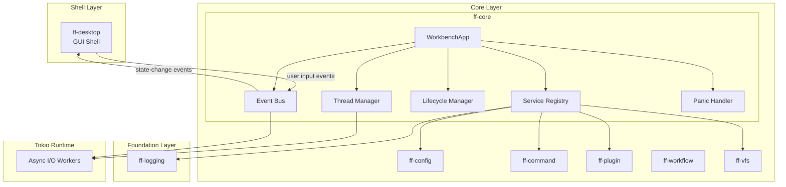

# Design Document: Platform Core (`ff-core`)

## 1. Overview

The `ff-core` crate is the **GUI-independent central orchestration layer** for the FileForgeWorkbench platform. It owns all application state, manages the lifecycle of every subsystem, and defines the strict boundary between business logic and the replaceable GUI rendering shell.

### Purpose

- Serve as the single entry point for application bootstrap and teardown
- Own the Service Registry that provides type-safe access to all subsystems
- Manage the Event Bus for bidirectional communication between core and shell
- Initialize and shut down subsystems in deterministic dependency order
- Host the Tokio async runtime for all background I/O operations
- Define crate layer rules and enforce dependency direction
- Provide panic recovery and hot-restart capabilities for plugins

### Scope

- Application lifecycle (startup sequence, shutdown sequence, OS signal handling)
- Service Registry (type-safe subsystem registration and lookup)
- Event Bus (typed event dispatch, subscription, async-safe channels)
- Thread model (main thread, core thread, Tokio runtime management)
- Panic handling (custom hook, recovery, graceful degradation)
- Plugin hot-restart orchestration (deactivate → reload → activate)

### Position in Architecture

```
┌─────────────────────────────────────────────────────────────┐
│              Shell Layer: ff-desktop (egui)                   │
│         Depends on ff-core; ff-core NEVER depends on this    │
├─────────────────────────────────────────────────────────────┤
│              Core Layer: ff-core (THIS CRATE)                 │
│  Also: ff-config, ff-command, ff-plugin, ff-workflow, ff-vfs │
├─────────────────────────────────────────────────────────────┤
│              Foundation Layer: ff-logging                     │
│              No dependencies on other ff-* crates            │
└─────────────────────────────────────────────────────────────┘
```

### Design Constraints (Cross-Cutting)

- **FFW-ARCH-001**: ff-core orchestrates the VFS subsystem but does not bypass VFS for content access
- **GUI Independence (Req 2)**: Zero GUI dependencies — no egui, winit, wgpu in Cargo.toml
- **Plugin Architecture (Req 3)**: ff-core hosts plugin lifecycle via the Service Registry
- **Command-Driven (Req 4)**: ff-core hosts command dispatch through the Event Bus
- **Async I/O (Req 6)**: Tokio multi-threaded runtime managed by ff-core
- **Multi-Crate Workspace (Req 7)**: Crate at `crates/ff-core`
- **Error Message Standards (Req 8)**: Consistent `[core] operation: description` error format

---

## 2. Architecture

### High-Level Architecture Diagram



### Layer Placement

| Component | Responsibility |
|-----------|---------------|
| **WorkbenchApp** | Top-level owner of all state; entry point for init/shutdown |
| **Service Registry** | Type-safe container for subsystem references |
| **Event Bus** | Async-safe typed message dispatch between core and shell |
| **Lifecycle Manager** | Ordered startup/shutdown sequencing with timeouts |
| **Thread Manager** | Tokio runtime creation, task tracking, join-on-shutdown |
| **Panic Handler** | Custom panic hook, recovery logic, fallback shutdown |

---

## 3. Module Structure

```
crates/ff-core/
├── Cargo.toml
├── src/
│   ├── lib.rs                  # Public API re-exports, crate docs
│   ├── app.rs                  # WorkbenchApp struct, construction, top-level orchestration
│   ├── registry/
│   │   ├── mod.rs              # ServiceRegistry re-exports
│   │   ├── service_registry.rs # ServiceRegistry impl, type-safe get/register
│   │   └── service_entry.rs    # ServiceEntry wrapper, Any-based storage
│   ├── event/
│   │   ├── mod.rs              # Event Bus re-exports
│   │   ├── bus.rs              # EventBus struct, dispatch, subscribe
│   │   ├── types.rs            # Event enum, event categories
│   │   └── subscription.rs    # Subscriber handle, filter logic
│   ├── lifecycle/
│   │   ├── mod.rs              # Lifecycle re-exports
│   │   ├── startup.rs          # Startup sequence orchestration
│   │   ├── shutdown.rs         # Shutdown sequence, grace periods
│   │   └── hot_restart.rs      # Plugin hot-restart logic
│   ├── threading/
│   │   ├── mod.rs              # Thread model re-exports
│   │   ├── runtime.rs          # Tokio runtime creation and management
│   │   └── task_tracker.rs     # Spawned task tracking, join/cancel
│   ├── panic/
│   │   ├── mod.rs              # Panic handling re-exports
│   │   └── handler.rs          # Custom panic hook, recovery logic
│   ├── error.rs                # CoreError enum
│   └── signals.rs              # OS signal handling (SIGTERM, SIGINT, WM_CLOSE)
└── tests/
    ├── registry_tests.rs       # Service Registry property tests
    ├── event_bus_tests.rs      # Event Bus property tests
    ├── lifecycle_tests.rs      # Startup/shutdown sequence tests
    └── integration.rs          # End-to-end WorkbenchApp tests
```

---

## 4. Key Data Models and Types

### WorkbenchApp

```rust
/// The primary application struct. Owns all platform state and serves as
/// the single entry point for subsystem initialization, event dispatch,
/// and lifecycle management.
///
/// Addresses: Requirement 1, criteria 3/4/5
pub struct WorkbenchApp {
    /// Type-safe service registry holding all subsystem references
    registry: ServiceRegistry,
    /// Event bus for core ↔ shell communication
    event_bus: EventBus,
    /// Tokio runtime handle for async I/O
    runtime: TokioRuntime,
    /// Current lifecycle phase
    phase: LifecyclePhase,
    /// Task tracker for spawned background work
    task_tracker: TaskTracker,
}
```

### ServiceRegistry

```rust
/// Type-safe container for registered subsystems. Transitions from
/// mutable (during startup) to frozen (after startup completes).
///
/// Addresses: Requirement 2, criteria 1–8
pub struct ServiceRegistry {
    /// Storage for registered services, keyed by TypeId
    services: HashMap<TypeId, Box<dyn Any + Send + Sync>>,
    /// Whether the registry has been frozen (no further registrations)
    frozen: AtomicBool,
}
```

### EventBus

```rust
/// Async-safe event dispatch system connecting core to shell and
/// subsystems to each other. Uses bounded channels internally.
///
/// Addresses: Requirement 3, criteria 1–8
pub struct EventBus {
    /// Broadcast sender for event dispatch.
    /// Uses Arc<WorkbenchEvent> to avoid expensive deep clones of String-containing events.
    sender: tokio::sync::broadcast::Sender<Arc<WorkbenchEvent>>,
    /// Subscription registry mapping event types to subscriber handles
    subscriptions: Arc<RwLock<SubscriptionRegistry>>,
    /// Pending event count for backpressure monitoring
    pending_count: AtomicUsize,
    /// Cumulative dropped event count
    dropped_count: AtomicU64,
}
```

### Locally-Defined Event Payload Types

```rust
/// Opaque document identifier. Defined here to avoid layer violations.
#[derive(Debug, Clone, Copy, PartialEq, Eq, Hash)]
pub struct DocumentId(pub u64);

/// Opaque operation identifier for progress tracking.
#[derive(Debug, Clone, Copy, PartialEq, Eq, Hash)]
pub struct OperationId(pub u64);

/// Parameters passed to a command at dispatch time.
/// Defined locally in ff-core to avoid circular dependency with ff-command.
#[derive(Debug, Clone, Default)]
pub struct CommandParams(pub HashMap<String, ParamValue>);

/// A single parameter value within CommandParams.
#[derive(Debug, Clone, PartialEq)]
pub enum ParamValue {
    String(String),
    Integer(i64),
    Float(f64),
    Boolean(bool),
    Map(HashMap<String, ParamValue>),
}

/// Outcome of a dispatched command, used in event payloads.
/// Simplified status type defined locally to avoid circular dependency with ff-command.
#[derive(Debug, Clone)]
pub struct CommandOutcome {
    pub success: bool,
    pub message: Option<String>,
}
```

### WorkbenchEvent

```rust
/// All events that flow through the Event Bus. Categorized per Requirement 3.2.
///
/// Addresses: Requirement 3, criteria 1/2
#[derive(Debug, Clone)]
#[non_exhaustive]
pub enum WorkbenchEvent {
    // --- Commands (user-initiated operations) ---
    /// A command was dispatched for execution
    CommandDispatched { command_id: String, params: CommandParams },
    /// A command completed execution
    CommandCompleted { command_id: String, outcome: CommandOutcome },

    // --- Notifications (informational messages to GUI) ---
    /// Informational message for the status bar
    Notification { message: String, severity: NotificationSeverity },

    // --- State-change signals (model updates requiring re-render) ---
    /// A document's content changed
    DocumentChanged { document_id: DocumentId },
    /// The active document/tab changed
    ActiveDocumentChanged { document_id: Option<DocumentId> },
    /// Configuration was reloaded
    ConfigReloaded,

    // --- Progress updates (long-running operation status) ---
    /// Progress update for an async operation
    Progress { operation_id: OperationId, progress: ProgressInfo },

    // --- Lifecycle events ---
    /// All subsystems initialized, GUI may begin rendering
    WorkbenchReady,
    /// Shutdown has been initiated
    ShutdownInitiated,
    /// A plugin was successfully hot-restarted
    PluginReloaded { plugin_name: String },
}
```

### LifecyclePhase

```rust
/// Tracks the current phase of the application lifecycle.
///
/// Addresses: Requirement 5/6
#[derive(Debug, Clone, Copy, PartialEq, Eq)]
pub enum LifecyclePhase {
    /// Startup in progress — services being registered
    Initializing,
    /// All services registered, application running normally
    Running,
    /// Shutdown in progress — services being torn down
    ShuttingDown,
    /// Application has terminated
    Terminated,
}
```

### SubsystemDescriptor

```rust
/// Describes a subsystem for registration and lifecycle management.
///
/// Addresses: Requirement 5, criteria 1/2
pub struct SubsystemDescriptor {
    /// Human-readable name (e.g., "logging", "configuration", "vfs")
    pub name: &'static str,
    /// Whether failure to initialize is fatal
    pub criticality: SubsystemCriticality,
    /// Position in the startup order
    pub order: StartupOrder,
}

/// Whether a subsystem is critical (failure = app termination) or
/// non-critical (failure = reduced functionality).
///
/// Addresses: Requirement 5, criteria 3/4
#[derive(Debug, Clone, Copy, PartialEq, Eq)]
pub enum SubsystemCriticality {
    /// Failure terminates the application (logging, config, VFS, commands)
    Critical,
    /// Failure allows continued operation (plugins, GUI shell)
    NonCritical,
}

/// Deterministic startup ordering.
///
/// Addresses: Requirement 5, criterion 1
#[derive(Debug, Clone, Copy, PartialEq, Eq, PartialOrd, Ord)]
pub enum StartupOrder {
    Logging = 0,
    Configuration = 1,
    Vfs = 2,
    Commands = 3,
    Plugins = 4,
    GuiShell = 5,
}
```

### NotificationSeverity

```rust
/// Severity level for GUI notifications dispatched via the Event Bus.
#[derive(Debug, Clone, Copy, PartialEq, Eq)]
pub enum NotificationSeverity {
    Info,
    Warning,
    Error,
}
```

### ProgressInfo

```rust
/// Progress information for long-running operations.
///
/// Addresses: Requirement 5, criterion 5
#[derive(Debug, Clone)]
pub struct ProgressInfo {
    /// Descriptive label for the operation
    pub label: String,
    /// Progress value: None = indeterminate, Some(0.0..=1.0) = determinate
    pub fraction: Option<f32>,
    /// Whether the operation supports cancellation
    pub cancellable: bool,
}
```

### TokioRuntime

```rust
/// Wrapper around the Tokio multi-threaded runtime.
/// Manages creation, task spawning with tracking, and graceful shutdown.
///
/// Addresses: Requirement 9, criteria 1/2/6
pub struct TokioRuntime {
    /// The Tokio runtime handle
    handle: tokio::runtime::Handle,
    /// The owned runtime (for shutdown)
    runtime: Option<tokio::runtime::Runtime>,
}
```

### TaskTracker

```rust
/// Tracks all spawned async tasks for join/cancel during shutdown.
///
/// Addresses: Requirement 9, criterion 6
pub struct TaskTracker {
    /// Set of tracked task handles with descriptive names
    tasks: Arc<Mutex<Vec<TrackedTask>>>,
}

pub struct TrackedTask {
    pub name: String,
    pub handle: tokio::task::JoinHandle<()>,
    pub cancel_token: tokio_util::sync::CancellationToken,
}
```

---

## 5. Public API Surface

### WorkbenchApp — Construction and Lifecycle

```rust
impl WorkbenchApp {
    /// Construct a new WorkbenchApp with required dependencies.
    /// The logging handle must already be initialized (via ff_logging::init).
    /// The config context provides initial configuration for all subsystems.
    ///
    /// Addresses: Requirement 1, criterion 4
    pub fn new(
        logging_status: ff_logging::LoggingStatus,
        config: Box<dyn ConfigProvider>,
    ) -> Result<Self, CoreError>;

    /// Execute the full startup sequence: logging → config → VFS → commands → plugins.
    /// Dispatches WorkbenchReady event on success.
    ///
    /// Addresses: Requirement 5, criteria 1–6
    pub async fn startup(&mut self) -> Result<(), CoreError>;

    /// Initiate orderly shutdown. Tears down subsystems in reverse order
    /// with 3-second grace period per subsystem.
    ///
    /// Addresses: Requirement 6, criteria 1–6
    pub async fn shutdown(&mut self);

    /// Returns the current lifecycle phase.
    pub fn phase(&self) -> LifecyclePhase;

    /// Returns a reference to the service registry (read-only after startup).
    pub fn registry(&self) -> &ServiceRegistry;

    /// Returns a reference to the event bus.
    pub fn event_bus(&self) -> &EventBus;

    /// Returns a handle to the Tokio runtime for spawning async tasks.
    pub fn runtime_handle(&self) -> &tokio::runtime::Handle;

    /// Hot-restart a specific plugin by name.
    /// Deactivates → unloads → reloads → re-activates the plugin.
    ///
    /// Addresses: Requirement 8, criteria 1–5
    pub async fn hot_restart_plugin(&mut self, plugin_name: &str) -> Result<(), CoreError>;

    /// Install OS signal handlers (SIGTERM/SIGINT on Unix, WM_CLOSE on Windows).
    /// Calling this causes OS termination signals to trigger orderly shutdown.
    ///
    /// Addresses: Requirement 6, criterion 6
    pub fn install_signal_handlers(&self);
}
```

### ServiceRegistry — Registration and Lookup

```rust
impl ServiceRegistry {
    /// Create a new empty (mutable) registry.
    pub fn new() -> Self;

    /// Register a service instance. Fails if the registry is frozen or
    /// a service of the same type is already registered.
    ///
    /// Addresses: Requirement 2, criteria 1/7
    pub fn register<T: Send + Sync + 'static>(
        &mut self,
        service: T,
    ) -> Result<(), CoreError>;

    /// Retrieve a reference to a registered service by type.
    /// Returns None if not registered.
    ///
    /// Addresses: Requirement 2, criteria 2/5/6
    pub fn get_service<T: Send + Sync + 'static>(&self) -> Option<&T>;

    /// Freeze the registry, preventing further registrations.
    /// Called automatically after startup completes.
    ///
    /// Addresses: Requirement 2, criterion 8
    pub fn freeze(&self);

    /// Returns whether the registry is in frozen state.
    pub fn is_frozen(&self) -> bool;
}
```

### EventBus — Dispatch and Subscription

```rust
impl EventBus {
    /// Create a new Event Bus with the specified channel capacity.
    /// Default capacity: 10,000 pending events.
    ///
    /// Addresses: Requirement 3, criterion 7
    pub fn new(capacity: usize) -> Self;

    /// Dispatch an event to all subscribers. Non-blocking.
    /// If the buffer is full, drops the oldest event and logs a WARN.
    ///
    /// Addresses: Requirement 3, criteria 3/5/6/7
    pub fn dispatch(&self, event: WorkbenchEvent);

    /// Subscribe to events of a specific type. Returns a subscription handle
    /// that receives only matching events.
    ///
    /// Addresses: Requirement 3, criterion 4
    pub fn subscribe(&self, filter: EventFilter) -> EventSubscription;

    /// Subscribe to all events (unfiltered). Used by the GUI shell.
    pub fn subscribe_all(&self) -> EventSubscription;

    /// Returns the cumulative count of dropped events due to buffer overflow.
    ///
    /// Addresses: Requirement 3, criterion 7
    pub fn dropped_count(&self) -> u64;
}

/// Filter for event subscriptions.
#[derive(Debug, Clone)]
pub enum EventFilter {
    /// Receive all events
    All,
    /// Receive only events matching specific categories
    Categories(Vec<EventCategory>),
    /// Custom filter function
    Custom(Arc<dyn Fn(&WorkbenchEvent) -> bool + Send + Sync>),
}

/// Event categories for subscription filtering.
///
/// Addresses: Requirement 3, criterion 2
#[derive(Debug, Clone, Copy, PartialEq, Eq, Hash)]
pub enum EventCategory {
    Command,
    Notification,
    StateChange,
    Progress,
    Lifecycle,
}

/// A subscription handle for receiving events.
pub struct EventSubscription {
    receiver: tokio::sync::broadcast::Receiver<Arc<WorkbenchEvent>>,
    filter: EventFilter,
}

impl EventSubscription {
    /// Await the next matching event.
    pub async fn recv(&mut self) -> Option<Arc<WorkbenchEvent>>;

    /// Try to receive without blocking. Returns None if no event is ready.
    pub fn try_recv(&mut self) -> Option<Arc<WorkbenchEvent>>;
}
```

### TokioRuntime — Async Task Management

```rust
impl TokioRuntime {
    /// Create and start a new multi-threaded Tokio runtime.
    ///
    /// Addresses: Requirement 9, criterion 2
    pub fn new() -> Result<Self, CoreError>;

    /// Spawn a tracked async task. The task is automatically joined/cancelled
    /// during shutdown.
    ///
    /// Addresses: Requirement 9, criterion 6
    pub fn spawn_tracked<F>(
        &self,
        name: &str,
        cancel_token: tokio_util::sync::CancellationToken,
        future: F,
    ) -> tokio::task::JoinHandle<()>
    where
        F: std::future::Future<Output = ()> + Send + 'static;

    /// Returns the Tokio runtime Handle for spawning untracked work.
    pub fn handle(&self) -> &tokio::runtime::Handle;

    /// Gracefully shut down the runtime: cancel all tracked tasks,
    /// await completion (with timeout), then drop the runtime.
    ///
    /// Addresses: Requirement 9, criteria 6/7
    pub async fn shutdown(self, timeout: std::time::Duration);
}
```

### Panic Handling

```rust
/// Install the custom panic hook. Must be called before any other
/// subsystem initializes.
///
/// Addresses: Requirement 7, criteria 1/5
pub fn install_panic_hook(event_bus: Option<EventBus>);

/// Query whether the application is in a recovering-from-panic state.
pub fn is_recovering() -> bool;
```

### ConfigProvider Trait (boundary with ff-config)

```rust
/// Trait defining the configuration provider interface that ff-core
/// accepts. Implemented by ff-config. Keeps ff-core decoupled from
/// the configuration crate's internals.
///
/// Addresses: Requirement 1, criterion 4
pub trait ConfigProvider: Send + Sync {
    /// Get a typed configuration value by namespace and key.
    fn get<T: serde::de::DeserializeOwned>(&self, namespace: &str, key: &str) -> Option<T>;

    /// Get the entire namespace as a raw TOML value.
    fn get_namespace(&self, namespace: &str) -> Option<toml::Value>;
}
```

### Subsystem Trait (boundary for lifecycle-managed services)

```rust
/// Trait that all lifecycle-managed subsystems implement. The Lifecycle
/// Manager calls these methods in startup/shutdown order.
///
/// Addresses: Requirement 5, criterion 1; Requirement 6, criterion 1
#[async_trait::async_trait]
pub trait Subsystem: Send + Sync {
    /// Descriptor providing name, criticality, and order.
    fn descriptor(&self) -> SubsystemDescriptor;

    /// Initialize the subsystem. Called during the startup sequence.
    /// Returns Ok(()) on success, Err on failure.
    async fn initialize(&mut self, registry: &ServiceRegistry) -> Result<(), CoreError>;

    /// Shut down the subsystem. Must complete within the grace period (3s).
    /// Called during the shutdown sequence in reverse order.
    async fn shutdown(&mut self) -> Result<(), CoreError>;
}
```

---

## 6. Error Types

```rust
/// Errors originating from the ff-core crate.
/// Formatted per Error Message Standards (Req 8): `[core] operation: description`
///
/// Addresses: Cross-cutting Requirement 8
#[derive(Debug, thiserror::Error)]
#[non_exhaustive]
pub enum CoreError {
    /// A critical subsystem failed to initialize
    #[error("[core] startup: critical subsystem '{name}' failed to initialize: {reason}")]
    CriticalSubsystemFailure {
        name: String,
        reason: String,
    },

    /// A non-critical subsystem failed to initialize
    #[error("[core] startup: non-critical subsystem '{name}' failed: {reason}")]
    NonCriticalSubsystemFailure {
        name: String,
        reason: String,
    },

    /// Attempted to register a duplicate service type
    #[error("[core] registry: service type '{type_name}' is already registered")]
    DuplicateServiceRegistration {
        type_name: String,
    },

    /// Attempted to register a service after the registry was frozen
    #[error("[core] registry: cannot register '{type_name}' — registry is frozen")]
    RegistryFrozen {
        type_name: String,
    },

    /// Tokio runtime failed to initialize
    #[error("[core] runtime: failed to create Tokio runtime: {reason}")]
    RuntimeCreationFailed {
        reason: String,
    },

    /// A subsystem exceeded its shutdown grace period
    #[error("[core] shutdown: subsystem '{name}' exceeded {grace_seconds}s grace period")]
    ShutdownTimeout {
        name: String,
        grace_seconds: u64,
    },

    /// Plugin hot-restart failed
    #[error("[core] hot-restart: plugin '{plugin_name}' failed to reload: {reason}")]
    HotRestartFailed {
        plugin_name: String,
        reason: String,
    },

    /// Event bus overflow
    #[error("[core] event-bus: buffer full ({capacity} events), dropping oldest")]
    EventBusOverflow {
        capacity: usize,
    },

    /// Tokio runtime encountered a fatal error
    #[error("[core] runtime: fatal runtime error — all worker threads panicked")]
    RuntimeFatal,

    /// OS signal handling setup failed
    #[error("[core] signals: failed to install signal handler: {reason}")]
    SignalHandlerFailed {
        reason: String,
    },

    /// Generic I/O error
    #[error("[core] io: {0}")]
    Io(#[from] std::io::Error),
}
```

---

## 7. Integration Points

### With `ff-logging` (Foundation Layer — upstream)

- **Dependency direction**: ff-core depends on ff-logging
- **API consumed**: `ff_logging::init()`, `ff_logging::shutdown()`, `ff_logging::is_fallback()`, `ff_logging::dropped_count()`, `log_info!`, `log_warn!`, `log_error!`
- **Initialization**: ff-core calls `ff_logging::init(config)` as the **first** operation in its startup sequence (Requirement 5.1). If ff-logging enters fallback mode, ff-core continues but records the degraded state.
- **Shutdown**: ff-core calls `ff_logging::shutdown()` as the **last** operation in its shutdown sequence (Requirement 6.1)
- **Diagnostics**: ff-core queries `ff_logging::is_fallback()` and `ff_logging::dropped_count()` to expose logging health via the Event Bus for status bar display

### With `ff-config` (Core Layer — peer)

- **Dependency direction**: ff-core depends on ff-config's `ConfigProvider` trait
- **API consumed**: `ConfigProvider::get()`, `ConfigProvider::get_namespace()`
- **Initialization**: ff-config is the second subsystem initialized (after logging). ff-core passes the config provider to all subsequent subsystem initializations
- **Hot-reload**: When ff-config detects a file change and reloads, it dispatches `ConfigReloaded` through the Event Bus

### With `ff-command` (Core Layer — peer)

- **Dependency direction**: ff-core wraps ff-command's lifecycle through an adapter; ff-command does NOT implement ff-core's `Subsystem` trait directly (to avoid circular dependencies)
- **Integration**: Commands are registered with ff-command during startup. The Event Bus carries `CommandDispatched` and `CommandCompleted` events. ff-core defines event payload types (`CommandParams`, `CommandOutcome`) locally to avoid circular dependencies with ff-command.
- **Initialization order**: Commands subsystem initializes fourth (after VFS)

### With `ff-plugin` (Core Layer — peer)

- **Dependency direction**: ff-core manages ff-plugin lifecycle via the Subsystem trait
- **Integration**: Plugin subsystem initializes fifth (after commands). ff-core provides the hot-restart API (`hot_restart_plugin`) that delegates to ff-plugin
- **Hot-restart**: ff-core orchestrates the deactivate → unload → reload → initialize → activate sequence and dispatches `PluginReloaded` event on success
- **Error handling**: Plugin initialization failures are non-critical — ff-core logs and continues (Requirement 5.3)

### With `ff-workflow` (Core Layer — peer)

- **Dependency direction**: ff-core registers ff-workflow as a subsystem
- **Integration**: Workflows dispatch progress events through the Event Bus. Long-running operations use the workflow engine for cancellation and resumption
- **Initialization**: Implicitly managed as part of the commands/plugins subsystem group

### With `ff-vfs` (Core Layer — peer)

- **Dependency direction**: ff-core initializes ff-vfs as a registered subsystem
- **FFW-ARCH-001 compliance**: ff-core itself does NOT use VFS for content access — it only manages VFS lifecycle. Content-accessing crates (document-model, file-operations) use VFS directly
- **Initialization order**: VFS is the third subsystem initialized (after configuration)

### With `ff-desktop` (Shell Layer — downstream)

- **Dependency direction**: ff-desktop depends on ff-core; ff-core NEVER depends on ff-desktop
- **Communication**: Exclusively through the Event Bus. User input events flow from shell to core; state-change and notification events flow from core to shell
- **Absence tolerance**: ff-core compiles, links, and runs without ff-desktop present (headless/CLI mode). GUI-targeted events are silently discarded when no shell subscriber exists (Requirement 3.6)
- **Initialization**: GUI shell is the last subsystem initialized (order 5). It receives the `WorkbenchReady` event before rendering

### Dependency Direction Summary

```
ff-logging ← ff-core ← ff-desktop
              ff-core ← (headless test harness)
              ff-core → ff-config (trait only)
              ff-core → ff-command (lifecycle adapter, NOT Subsystem trait)
              ff-core → ff-plugin (Subsystem trait)
              ff-core → ff-vfs (Subsystem trait)
              ff-core → ff-workflow (Subsystem trait)
```

---

## 8. Configuration

ff-core owns the `[core]` namespace in the workbench TOML configuration file.

### TOML Schema

```toml
[core]
# Maximum pending events in the Event Bus before overflow.
# Range: 1,000–100,000. Default: 10,000
event_bus_capacity = 10000

# Shutdown grace period per subsystem in seconds.
# Range: 1–30. Default: 3
shutdown_grace_seconds = 3

# Tokio runtime worker thread count.
# 0 = auto (uses available_parallelism). Range: 0–64. Default: 0
tokio_worker_threads = 0

# Startup timeout in seconds (total for all subsystems).
# If exceeded, progress events are dispatched. Range: 1–60. Default: 5
startup_timeout_seconds = 5
```

### Config Resolution Rules

| Setting | Absent | Invalid Value | Out of Range |
|---------|--------|---------------|--------------|
| `event_bus_capacity` | Default to 10,000 | Default to 10,000 + WARN log | Clamp to [1,000–100,000] + WARN |
| `shutdown_grace_seconds` | Default to 3 | Default to 3 + WARN log | Clamp to [1–30] + WARN |
| `tokio_worker_threads` | Default to 0 (auto) | Default to 0 + WARN log | Clamp to [0–64] + WARN |
| `startup_timeout_seconds` | Default to 5 | Default to 5 + WARN log | Clamp to [1–60] + WARN |

---

## 9. Concurrency Model

### Thread Contexts

| Thread Context | Owner | Responsibility |
|----------------|-------|---------------|
| **Main thread** | OS / GUI framework | When GUI shell is active: owns the render loop. When headless: runs the core event loop |
| **Core thread** | ff-core (optional) | If GUI shell owns the main thread, ff-core MAY run its event loop on a dedicated thread. Architecture supports both same-thread and separate-thread modes |
| **Tokio runtime** | ff-core | Multi-threaded async executor for all background I/O (file ops, network, computation) |

Addresses: Requirement 9, criterion 1

### Communication Channels

| Channel | Type | Direction | Purpose |
|---------|------|-----------|---------|
| Event Bus broadcast | `tokio::sync::broadcast` | Core ↔ Shell, Core ↔ Subsystems | Typed event dispatch (payload: `Arc<WorkbenchEvent>`) |
| Command dispatch | `tokio::sync::mpsc` | Shell → Core | User command submission |
| Task result | `tokio::sync::oneshot` | Tokio worker → requester | Async operation completion |
| Shutdown signal | `tokio_util::sync::CancellationToken` | Core → all tasks | Cooperative cancellation |

Addresses: Requirement 9, criterion 3

### Threading Rules

1. **GUI thread never blocks on I/O** (Requirement 9.4): All file/network operations are dispatched to Tokio workers via channels or Event Bus
2. **Results flow through Event Bus** (Requirement 9.5): Tokio workers communicate results back via event dispatch or oneshot channels — never by directly mutating GUI state
3. **All tasks tracked** (Requirement 9.6): Every spawned Tokio task is registered with `TaskTracker` for join/cancel during shutdown
4. **Runtime fatal = shutdown** (Requirement 9.7): If all Tokio worker threads panic, ff-core initiates orderly shutdown

### Tokio Runtime Lifecycle

```
Startup sequence position: After logging, before VFS (Requirement 9.2)
┌─────────────────────────────────────────────────────────────┐
│ 1. ff_logging::init()     ← logging available               │
│ 2. TokioRuntime::new()    ← async runtime available         │
│ 3. ff-config init         ← configuration available         │
│ 4. ff-vfs init            ← VFS available (uses async I/O)  │
│ 5. ff-command init        ← commands available              │
│ 6. ff-plugin init         ← plugins available               │
│ 7. GUI shell init         ← rendering starts                │
└─────────────────────────────────────────────────────────────┘

Shutdown sequence (reverse):
┌─────────────────────────────────────────────────────────────┐
│ 1. GUI shell shutdown     ← rendering stops                 │
│ 2. ff-plugin shutdown     ← plugins deactivated             │
│ 3. ff-command shutdown    ← commands unregistered            │
│ 4. ff-vfs shutdown        ← VFS providers unmounted         │
│ 5. ff-config shutdown     ← config flushed                  │
│ 6. TokioRuntime::shutdown()  ← all tasks cancelled/joined   │
│ 7. ff_logging::shutdown() ← final log flush, file closed    │
└─────────────────────────────────────────────────────────────┘
```

### Event Bus Backpressure

- Capacity: configurable, default 10,000 events (Requirement 3.7)
- On overflow: drop oldest undelivered events, increment `AtomicU64` dropped counter, emit WARN log
- GUI shell events dispatched when no subscriber: silently discarded (Requirement 3.6)
- Delivery guarantee: within same application tick/frame (Requirement 3.5)

### Panic Recovery Strategy

```
┌──────────────────────────────────────────────────────────────┐
│ Panic Location            │ Action                            │
├───────────────────────────┼───────────────────────────────────┤
│ Background thread/task    │ Log ERROR, continue on main       │
│                           │ thread (Req 7.2)                  │
├───────────────────────────┼───────────────────────────────────┤
│ Main thread (post-start)  │ Attempt auto-save, log, initiate │
│                           │ orderly shutdown (Req 7.3)        │
├───────────────────────────┼───────────────────────────────────┤
│ Corrupted shared state    │ Terminate with non-zero exit      │
│                           │ code (Req 7.4)                    │
├───────────────────────────┼───────────────────────────────────┤
│ Panic hook itself         │ Abandon logging, allow default    │
│                           │ panic behaviour (Req 7.5)         │
└──────────────────────────────────────────────────────────────┘
```

---

## 10. Correctness Properties

These properties are suitable for property-based testing with `proptest`. They validate invariants that must hold across all valid inputs.

### Property 1: Service Registry Type Safety

**Statement**: For any type `T: Send + Sync + 'static` registered in the Service Registry, `get_service::<T>()` returns `Some(&T)` for exactly that type, and `get_service::<U>()` returns `None` for any unregistered type `U ≠ T`.

**Validates**: Requirement 2, criteria 2/6

```rust
// proptest strategy: register a random subset of service types, then
// query for all types (registered and unregistered)
// assertion: get returns Some iff the type was registered
```

### Property 2: Service Registry Duplicate Rejection

**Statement**: For any type `T`, attempting to register `T` when it is already registered always returns `Err(DuplicateServiceRegistration)` and leaves the original service unchanged.

**Validates**: Requirement 2, criterion 7

```rust
// proptest strategy: generate random service type + two distinct instances
// assertion: second register fails, get still returns first instance
```

### Property 3: Service Registry Freeze Immutability

**Statement**: After `freeze()` is called, all subsequent `register()` calls return `Err(RegistryFrozen)` regardless of the type being registered. All previously registered services remain accessible via `get_service()`.

**Validates**: Requirement 2, criterion 8

```rust
// proptest strategy: register N services, freeze, attempt M more registrations
// assertion: all M fail, all N remain accessible
```

### Property 4: Startup Order Determinism

**Statement**: For any set of subsystem descriptors with distinct `StartupOrder` values, the initialization sequence always follows the `Ord` ordering: Logging < Configuration < Vfs < Commands < Plugins < GuiShell.

**Validates**: Requirement 5, criterion 1; Requirement 2, criterion 4

```rust
// proptest strategy: generate permutations of subsystem descriptors
// assertion: after sorting, order matches the canonical sequence
```

### Property 5: Shutdown Order is Reverse of Startup

**Statement**: For any successful startup sequence that initialized subsystems [S₁, S₂, ..., Sₙ], the shutdown sequence always processes them in reverse order [Sₙ, ..., S₂, S₁].

**Validates**: Requirement 6, criterion 1

```rust
// proptest strategy: generate subsets of subsystems that "succeed" at init
// assertion: shutdown order is exact reverse of the successful init order
```

### Property 6: Event Bus Dispatch Reaches All Subscribers

**Statement**: For any event dispatched to the Event Bus and any set of active subscribers whose filter matches that event, all matching subscribers receive the event. Subscribers whose filter does not match the event receive nothing.

**Validates**: Requirement 3, criteria 4/5

```rust
// proptest strategy: generate event + N subscribers with random filters
// assertion: each subscriber receives the event iff its filter matches
```

### Property 7: Event Bus Overflow Counter Monotonicity

**Statement**: The Event Bus `dropped_count()` is monotonically non-decreasing. After any sequence of dispatch operations (some succeeding, some overflowing), `dropped_count()` at time T₂ ≥ `dropped_count()` at time T₁ for T₂ > T₁.

**Validates**: Requirement 3, criterion 7

```rust
// proptest strategy: generate sequence of dispatch attempts with varying buffer states
// assertion: dropped_count never decreases between observations
```

### Property 8: Event Bus Silent Discard Without Subscribers

**Statement**: When the Event Bus has zero subscribers for a given event category, dispatching an event of that category succeeds without error and does not increment the dropped counter (it is silently discarded, not treated as overflow).

**Validates**: Requirement 3, criterion 6

```rust
// proptest strategy: dispatch events with no subscribers registered
// assertion: dispatch returns successfully, dropped_count unchanged
```

### Property 9: Shutdown Grace Period Enforcement

**Statement**: For any subsystem whose shutdown operation takes longer than the configured grace period, the Lifecycle Manager forcibly proceeds after exactly the grace period (±50ms tolerance) and logs a WARN.

**Validates**: Requirement 6, criteria 2/3

```rust
// proptest strategy: generate shutdown durations (some within, some exceeding grace period)
// assertion: subsystems exceeding grace are interrupted; total shutdown time ≤ N × grace_period
```

### Property 10: Hot-Restart State Preservation

**Statement**: After a successful plugin hot-restart, all non-plugin state in the Service Registry (documents, undo history, configuration, VFS mounts) remains byte-for-byte identical to its pre-restart state.

**Validates**: Requirement 8, criterion 3

```rust
// proptest strategy: snapshot registry state, perform hot-restart, compare
// assertion: all non-plugin services are unchanged after restart
```

---

## Appendix A: External Crate Dependencies

| Crate | Version | Purpose |
|-------|---------|---------|
| `tokio` | 1.x | Multi-threaded async runtime |
| `tokio-util` | 0.7 | CancellationToken, task tracking utilities |
| `async-trait` | 0.1 | Async trait method support |
| `thiserror` | 2.0 | Error type derivation |
| `serde` | 1.0 | Deserialization for config types |
| `toml` | 0.8 | TOML value types (for ConfigProvider trait) |
| `ff-logging` | workspace | Foundation logging subsystem |
| `proptest` | 1.0 | Property-based testing (dev-dependency) |

## Appendix B: Crate Layer Membership Reference

| Layer | Crates | Depends On |
|-------|--------|-----------|
| Foundation | `ff-logging` | No ff-* crates |
| Core | `ff-core`, `ff-config`, `ff-command`, `ff-plugin`, `ff-workflow`, `ff-vfs` | Foundation only |
| Editor | `ff-document`, `ff-edit`, `ff-undo`, `ff-viewport`, `ff-display-lines` | Core + Foundation |
| Feature | `ff-find`, `ff-line-commands`, `ff-exclude`, `ff-nav`, ... | Editor + below |
| Shell | `ff-desktop` | All lower layers |

Addresses: Requirement 4, criteria 1–7
