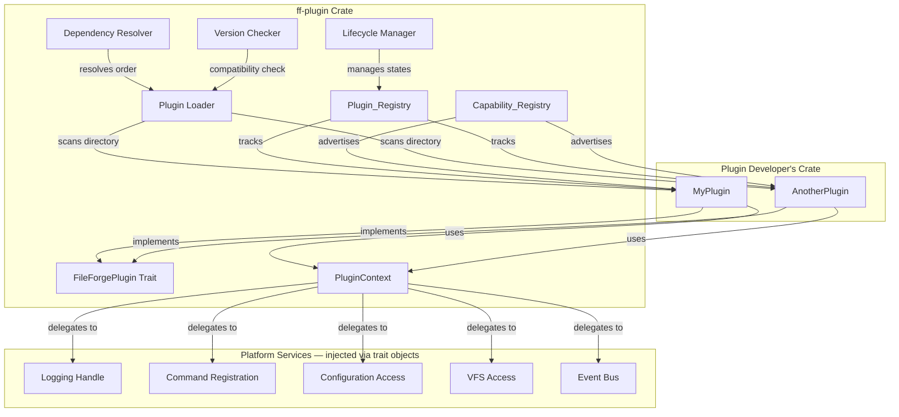

# Design Document: Plugin Architecture (`ff-plugin`)

## 1. Overview

The `ff-plugin` crate is the **plugin extensibility framework** for the FileForgeWorkbench workspace. It defines how optional features are packaged, discovered, loaded, and managed through well-defined lifecycle states. Every optional feature — viewers, language services, connectors, macro engines, the database tool — is implemented as a plugin that interacts with the core exclusively through traits and a context object defined here.

### Purpose

- Define the `FileForgePlugin` trait with lifecycle methods and metadata accessors
- Provide `PluginContext` as the sole interface between plugins and the platform
- Manage plugin discovery, dependency resolution, loading, and unloading
- Expose a Capability Registry for runtime querying of available services
- Enforce security boundaries: VFS-only file access, scoped configuration, no cross-plugin state access
- Support semantic versioning with compatibility checks at load time

### Position in Architecture

```
Wave 2 — Platform Architecture (depends on Wave 0 ff-logging)

┌─────────────────────────────────────────────────────────┐
│                    Application Binary                     │
│                (ffwb / GUI shell — ff-desktop)            │
├─────────────────────────────────────────────────────────┤
│  workflow-engine │ layout-and-docking │ configuration     │
│  document-model │ edit-operations │ all feature crates   │
├─────────────────────────────────────────────────────────┤
│  platform-core │ command-framework │ plugin-architecture │
│              (Wave 2 — Platform Architecture)             │
├─────────────────────────────────────────────────────────┤
│                     ff-logging (Wave 0)                   │
└─────────────────────────────────────────────────────────┘
```

### Design Constraints (Cross-Cutting)

- **FFW-ARCH-001 (Req 1)**: Plugins access files exclusively through the VFS abstraction layer — never via `std::fs`
- **GUI Independence (Req 2)**: The plugin system is GUI-independent — no egui, no windowing crate imports
- **Plugin Architecture Principle (Req 3)**: ALL optional features are implementable as plugins; core remains minimal
- **Command-Driven (Req 4)**: Plugin-registered commands go through the command framework
- **Multi-Crate Workspace (Req 7)**: Crate at `crates/ff-plugin`
- **Error Message Standards (Req 8)**: Plugin errors follow `[plugin:{name}] operation: description` format

---

## 2. Architecture

### High-Level Architecture Diagram



### Layer Placement

| Layer | Role |
|-------|------|
| **Plugin Trait** | `FileForgePlugin` — the contract every plugin implements |
| **Plugin Context** | `PluginContext` — sandboxed gateway to platform services |
| **Registry Layer** | `Plugin_Registry` — tracks plugin states, metadata, ownership |
| **Capability Layer** | `Capability_Registry` — dynamic index of all active capabilities |
| **Loading Layer** | Discovery, validation, dependency resolution, version checking |
| **Lifecycle Layer** | State machine transitions, panic catching, shutdown orchestration |
| **Security Layer** | API-boundary enforcement, scoped config, VFS-only file access |

### Plugin Lifecycle State Machine

```
┌────────────┐    scan     ┌──────────┐   load    ┌────────┐  validate  ┌─────────────┐
│  (absent)  │───────────▶│Discovered│─────────▶│ Loaded  │──────────▶│ Initialized │
└────────────┘            └──────────┘          └────────┘           └─────────────┘
                                                                            │
                                                                     activate│
                                                                            ▼
┌──────────┐  drop/join    ┌──────────────┐  shutdown  ┌──────────┐      ┌────────┐
│(released)│◀─────────────│   Shutdown   │◀──────────│Deactivating│◀────│ Active │
└──────────┘              └──────────────┘           └──────────┘      └────────┘
                                ▲                                           │
                                │              hot-reload cycle              │
                                └───────────────────────────────────────────┘
```

---

## 3. Module Structure

```
crates/ff-plugin/
├── Cargo.toml
├── src/
│   ├── lib.rs              # Public API re-exports, crate docs
│   ├── traits.rs           # FileForgePlugin trait definition
│   ├── context.rs          # PluginContext struct, service accessors
│   ├── metadata.rs         # PluginMetadata, PluginManifest, dependency declarations
│   ├── capability.rs       # Capability enum, CapabilityDescriptor, metadata structs
│   ├── registry.rs         # Plugin_Registry: state tracking, plugin storage
│   ├── capability_registry.rs  # Capability_Registry: dynamic query interface
│   ├── loader.rs           # Plugin discovery, directory scanning, manifest parsing
│   ├── dependency.rs       # Dependency_Graph construction, topological sort, cycle detection
│   ├── lifecycle.rs        # State machine transitions, panic catching, timeout logic
│   ├── version.rs          # PLUGIN_API_VERSION, semantic version comparison
│   ├── security.rs         # Sandboxing enforcement, access control checks
│   ├── error.rs            # PluginError enum, all error variants
│   └── event.rs            # Plugin lifecycle events emitted to the event bus
└── tests/
    ├── trait_tests.rs      # FileForgePlugin trait object-safety and lifecycle tests
    ├── context_tests.rs    # PluginContext scoping and delegation tests
    ├── registry_tests.rs   # Plugin_Registry state management tests
    ├── capability_tests.rs # Capability_Registry query tests
    ├── dependency_tests.rs # Dependency graph property tests
    ├── lifecycle_tests.rs  # Lifecycle state machine property tests
    ├── version_tests.rs    # Version compatibility property tests
    └── integration.rs      # End-to-end discovery, load, activate tests
```

---

## 4. Key Data Models and Types

### FileForgePlugin Trait

```rust
use std::sync::Arc;

/// The primary trait that all plugins must implement.
/// Object-safe — the core stores plugins as `Box<dyn FileForgePlugin>`.
/// Addresses: Requirement 1 (all acceptance criteria)
pub trait FileForgePlugin: Send + Sync {
    /// Returns an immutable reference to the plugin's metadata.
    /// Addresses: Requirement 1 AC 2
    fn metadata(&self) -> &PluginMetadata;

    /// Returns the list of capabilities this plugin provides to the platform.
    /// Named plugin_capabilities to avoid collision with VfsProvider::capabilities()
    /// Addresses: Requirement 1 AC 3
    fn plugin_capabilities(&self) -> &[Capability];

    /// Initialize the plugin with the provided context.
    /// Plugins receive an Arc<PluginContext> and should store it for use throughout
    /// their lifetime (logging, command registration from `activate`, background tasks).
    /// Called after dependencies are active. Must not panic.
    /// Addresses: Requirement 1 AC 1, AC 4
    fn initialize(&mut self, context: Arc<PluginContext>) -> Result<(), PluginError>;

    /// Activate the plugin — register capabilities, start background work.
    /// Addresses: Requirement 1 AC 1
    fn activate(&mut self) -> Result<(), PluginError>;

    /// Deactivate the plugin — unregister capabilities, stop background work.
    /// Addresses: Requirement 1 AC 1
    fn deactivate(&mut self) -> Result<(), PluginError>;

    /// Shutdown the plugin — release all resources, final cleanup.
    /// Addresses: Requirement 1 AC 1
    fn shutdown(&mut self) -> Result<(), PluginError>;

    /// Whether this plugin supports hot-reload.
    /// Addresses: Requirement 3 AC 6
    fn supports_hot_reload(&self) -> bool {
        false
    }
}
```

### PluginMetadata

```rust
/// Metadata describing a plugin: identity, versioning, and dependencies.
/// Addresses: Requirement 1 AC 2, Requirement 6 AC 2
#[derive(Debug, Clone, PartialEq, Eq)]
pub struct PluginMetadata {
    /// Unique plugin name (kebab-case identifier)
    pub name: String,
    /// Plugin version (semantic versioning)
    pub version: Version,
    /// Author or organization name
    pub author: String,
    /// Human-readable description
    pub description: String,
    /// Dependencies on other plugins
    pub dependencies: Vec<PluginDependency>,
    /// Minimum plugin API version this plugin requires
    /// Addresses: Requirement 6 AC 2
    pub required_api_version: Version,
}
```

### PluginDependency

```rust
/// A dependency declaration within a plugin's metadata.
/// Addresses: Requirement 3 AC 3
#[derive(Debug, Clone, PartialEq, Eq)]
pub struct PluginDependency {
    /// Name of the required plugin
    pub name: String,
    /// Version requirement (semver range expression)
    pub version_req: VersionReq,
}
```

### Version

```rust
/// Semantic version: major.minor.patch.
/// Addresses: Requirement 6 AC 1
#[derive(Debug, Clone, PartialEq, Eq, PartialOrd, Ord, Hash)]
pub struct Version {
    pub major: u32,
    pub minor: u32,
    pub patch: u32,
}
```

### VersionReq

```rust
/// A version requirement for dependency declarations (semver-compatible range).
/// Addresses: Requirement 6 AC 3, AC 4, AC 5
#[derive(Debug, Clone, PartialEq, Eq)]
pub struct VersionReq {
    /// The minimum version required (inclusive)
    pub minimum: Version,
    /// Whether the major version must match exactly
    pub same_major: bool,
}
```

### PluginContext

```rust
/// The sandboxed gateway through which plugins access platform services.
/// Provided to each plugin during `initialize`. Thread-safe (Send + Sync).
/// Addresses: Requirement 2 (all acceptance criteria), Requirement 7 AC 1, AC 4
pub struct PluginContext {
    /// The identity of the owning plugin (for scoping)
    plugin_name: String,
    /// Logging service handle
    log_handle: Box<dyn PluginLogHandle>,
    /// Command registration service
    command_service: Arc<dyn CommandRegistration>,
    /// Configuration access (scoped to plugin namespace)
    config_service: Arc<dyn PluginConfigAccess>,
    /// VFS access (read/write through virtual file system)
    vfs_service: Arc<dyn PluginVfsAccess>,
    /// Event subscription and emission
    event_service: Arc<dyn PluginEventBus>,
    /// Capability registration
    capability_service: Arc<dyn CapabilityRegistrar>,
    /// Current plugin API version (queryable at runtime)
    /// Addresses: Requirement 6 AC 7
    api_version: Version,
}
```

### Capability

```rust
/// A typed service or feature that a plugin provides to the platform.
/// Addresses: Requirement 4 AC 1, Requirement 6 AC 6
#[derive(Debug, Clone, PartialEq, Eq)]
#[non_exhaustive]
pub enum Capability {
    /// Plugin provides one or more commands
    Commands(CommandsCapability),
    /// Plugin provides one or more viewer implementations
    Viewers(ViewersCapability),
    /// Plugin provides data or service providers
    Providers(ProvidersCapability),
    /// Plugin provides language support (highlighting, completion, etc.)
    LanguageSupport(LanguageSupportCapability),
    /// Plugin contributes a theme
    ThemeContribution(ThemeCapability),
}

/// Metadata for a Commands capability.
#[derive(Debug, Clone, PartialEq, Eq)]
pub struct CommandsCapability {
    /// Identifiers of commands this plugin provides
    pub command_ids: Vec<String>,
    /// Category grouping for discovery
    pub category: String,
    /// Capability version
    pub version: Version,
}

/// Metadata for a Viewers capability.
#[derive(Debug, Clone, PartialEq, Eq)]
pub struct ViewersCapability {
    /// MIME types this viewer handles
    pub mime_types: Vec<String>,
    /// Human-readable viewer name
    pub display_name: String,
    /// Capability version
    pub version: Version,
}

/// Metadata for a Providers capability.
#[derive(Debug, Clone, PartialEq, Eq)]
pub struct ProvidersCapability {
    /// Provider type identifier (e.g., "vfs", "data-source")
    pub provider_type: String,
    /// Capability version
    pub version: Version,
}

/// Metadata for a LanguageSupport capability.
#[derive(Debug, Clone, PartialEq, Eq)]
pub struct LanguageSupportCapability {
    /// Language identifiers this plugin supports
    pub language_ids: Vec<String>,
    /// Features offered (highlighting, completion, diagnostics, etc.)
    pub features: Vec<String>,
    /// Capability version
    pub version: Version,
}

/// Metadata for a ThemeContribution capability.
#[derive(Debug, Clone, PartialEq, Eq)]
pub struct ThemeCapability {
    /// Theme name
    pub theme_name: String,
    /// Whether it is a dark or light theme
    pub is_dark: bool,
    /// Capability version
    pub version: Version,
}
```

### CapabilityDescriptor

```rust
/// A registered capability instance in the Capability_Registry.
/// Addresses: Requirement 4 AC 2, AC 3
#[derive(Debug, Clone)]
pub struct CapabilityDescriptor {
    /// The capability definition
    pub capability: Capability,
    /// Plugin that owns this capability
    pub owner_plugin: String,
    /// Registration order (for first-registered-wins semantics)
    pub registration_order: u64,
}
```

### SubscriptionId

```rust
/// Unique identifier for an event subscription, used for unsubscription.
#[derive(Debug, Clone, Copy, PartialEq, Eq, Hash)]
pub struct SubscriptionId(pub(crate) u64);
```

### PlatformEvent

```rust
/// Platform events that plugins can subscribe to via PluginContext.
/// These are a subset of WorkbenchEvent relevant to plugins.
#[derive(Debug, Clone)]
#[non_exhaustive]
pub enum PlatformEvent {
    ConfigChanged { key: String },
    DocumentOpened { uri: String },
    DocumentClosed { uri: String },
    ShutdownRequested,
}
```

### EventHandler

```rust
/// Callback type for plugin event handlers.
pub type EventHandler = Box<dyn Fn(&PlatformEvent) + Send + Sync>;
```

### PluginCommand

```rust
/// A command definition provided by a plugin for registration with the command framework.
pub struct PluginCommand {
    /// Unique command identifier (e.g., "my-plugin.do-something")
    pub id: String,
    /// Human-readable display name shown in the command palette
    pub display_name: String,
    /// Category for grouping in command listings
    pub category: String,
    /// Optional default keyboard shortcut (e.g., "Ctrl+Shift+P")
    pub default_shortcut: Option<String>,
    /// The handler invoked when the command is executed
    pub handler: Box<dyn Fn() -> Result<(), String> + Send + Sync>,
}
```

### Plugin_State

```rust
/// The lifecycle state of a plugin instance.
/// Addresses: Requirement 5 AC 1, AC 7
#[derive(Debug, Clone, Copy, PartialEq, Eq, Hash)]
#[non_exhaustive]
pub enum PluginState {
    /// Plugin binary/manifest found on disk, not yet loaded
    Discovered,
    /// Plugin loaded into memory, manifest parsed
    Loaded,
    /// Plugin's `initialize` method has been called successfully
    Initialized,
    /// Plugin is fully active, capabilities registered
    Active,
    /// Plugin is in the process of deactivating
    Deactivating,
    /// Plugin has been shut down, resources released
    Shutdown,
}
```

### Plugin_Registry Entry

```rust
/// Internal registry entry tracking a single plugin's runtime state.
/// Addresses: Requirement 5 AC 1, Requirement 3 AC 1
pub(crate) struct PluginEntry {
    /// The plugin instance (None after Shutdown)
    pub instance: Option<Box<dyn FileForgePlugin>>,
    /// Current lifecycle state
    pub state: PluginState,
    /// Plugin metadata (cached from instance for post-shutdown queries)
    pub metadata: PluginMetadata,
    /// Capabilities currently registered by this plugin
    pub registered_capabilities: Vec<Capability>,
    /// Context provided to this plugin (Arc-shared for plugin lifetime use)
    pub context: Option<Arc<PluginContext>>,
}
```

---

## 5. Public API Surface

### Plugin API Version Constant

```rust
/// The current version of the plugin API contract.
/// Plugins declare their `required_api_version` against this.
/// Addresses: Requirement 6 AC 1
pub const PLUGIN_API_VERSION: Version = Version { major: 1, minor: 0, patch: 0 };
```

### Plugin_Registry API

```rust
impl PluginRegistry {
    /// Create a new empty plugin registry.
    pub fn new(plugin_directory: PathBuf, services: PlatformServices) -> Self;

    /// Scan the plugin directory and discover all available plugins.
    /// Transitions discovered plugins to the Discovered state.
    /// Addresses: Requirement 3 AC 1
    pub fn discover_plugins(&mut self) -> Result<Vec<String>, PluginError>;

    /// Load, validate, and activate all discovered plugins in dependency order.
    /// Constructs the dependency graph and performs topological sort.
    /// Addresses: Requirement 3 AC 2, AC 3
    pub fn load_all(&mut self) -> Vec<PluginLoadResult>;

    /// Load and activate a single plugin by name.
    /// Its dependencies must already be active.
    pub fn load_plugin(&mut self, name: &str) -> Result<(), PluginError>;

    /// Deactivate and unload a single plugin.
    /// Plugins that depend on it will be deactivated first (reverse order).
    /// Addresses: Requirement 5 AC 2
    pub fn unload_plugin(&mut self, name: &str) -> Result<(), PluginError>;

    /// Query the current state of a plugin by name.
    /// Addresses: Requirement 5 AC 7
    pub fn plugin_state(&self, name: &str) -> Option<PluginState>;

    /// Get metadata for a plugin by name (available even after shutdown).
    pub fn plugin_metadata(&self, name: &str) -> Option<&PluginMetadata>;

    /// List all registered plugin names with their current states.
    pub fn list_plugins(&self) -> Vec<(&str, PluginState)>;

    /// Shut down all plugins in reverse dependency order.
    /// Waits up to `timeout` for all plugins to complete shutdown.
    /// Addresses: Requirement 5 AC 5
    pub fn shutdown_all(&mut self, timeout: Duration);

    /// Attempt hot-reload of a plugin that supports it.
    /// Addresses: Requirement 3 AC 6
    pub fn hot_reload(&mut self, name: &str) -> Result<(), PluginError>;
}
```

### Capability_Registry API

> **Design Decision (Req 4 AC 4 — type-safe querying):** Runtime enum-based querying via `query_by_type()` is preferred over generic trait-based queries for object-safety and simplicity. The requirement for "type-safe querying where possible" is satisfied by the strongly-typed `CapabilityType` enum — callers know exactly what capability types exist at compile time. Full generic querying (e.g., `query::<T: CapabilityProvider>()`) is not feasible with trait objects stored in the registry.

```rust
impl CapabilityRegistry {
    /// Query all capabilities of a given type currently registered.
    /// Addresses: Requirement 4 AC 2
    pub fn query_by_type(&self, cap_type: CapabilityType) -> Vec<&CapabilityDescriptor>;

    /// Query capabilities matching metadata attributes.
    /// E.g., all viewers handling "text/plain", all commands in category "file".
    /// Addresses: Requirement 4 AC 5
    pub fn query_by_attribute(&self, filter: &CapabilityFilter) -> Vec<&CapabilityDescriptor>;

    /// Register a capability for a plugin.
    /// Emits a CapabilityChanged event on success.
    /// Addresses: Requirement 4 AC 3, AC 6
    pub fn register(
        &mut self,
        owner: &str,
        capability: Capability,
    ) -> Result<(), PluginError>;

    /// Remove all capabilities owned by a specific plugin.
    /// Emits CapabilityChanged events for each removal.
    /// Addresses: Requirement 4 AC 3, Requirement 5 AC 6
    pub fn unregister_all(&mut self, owner: &str);

    /// Check if a specific capability type + identifier is registered.
    pub fn has_capability(&self, cap_type: CapabilityType, id: &str) -> bool;
}
```

### PluginContext API

```rust
impl PluginContext {
    /// Get the plugin's name.
    pub fn plugin_name(&self) -> &str;

    /// Get a reference to the logging handle for this plugin.
    /// Records are prefixed with `[plugin:{name}]`.
    /// Addresses: Requirement 2 AC 2 (logging)
    pub fn log(&self) -> &dyn PluginLogHandle;

    /// Register a command with the platform's command framework.
    /// Addresses: Requirement 2 AC 2 (command registration)
    pub fn register_command(&self, command: PluginCommand) -> Result<(), PluginError>;

    /// Read a configuration value scoped to this plugin's namespace.
    /// Only keys under `[plugins.{plugin_name}]` are accessible.
    /// Addresses: Requirement 2 AC 7, Requirement 7 AC 5
    pub fn config_get(&self, key: &str) -> Result<Option<toml::Value>, PluginError>;

    /// Write a configuration value scoped to this plugin's namespace.
    /// Addresses: Requirement 2 AC 7, Requirement 7 AC 5
    pub fn config_set(&self, key: &str, value: toml::Value) -> Result<(), PluginError>;

    /// Access the VFS for file operations.
    /// Addresses: Requirement 2 AC 2 (VFS access), Requirement 7 AC 2
    pub fn vfs(&self) -> &dyn PluginVfsAccess;

    /// Subscribe to a platform event.
    /// Addresses: Requirement 2 AC 2 (event subscription)
    pub fn subscribe_event(&self, event_type: &str, handler: EventHandler) -> SubscriptionId;

    /// Unsubscribe from a previously subscribed event.
    pub fn unsubscribe_event(&self, id: SubscriptionId);

    /// Emit a platform event.
    /// Addresses: Requirement 2 AC 2 (event emission)
    pub fn emit_event(&self, event: PlatformEvent);

    /// Register a capability with the platform's Capability_Registry.
    /// Addresses: Requirement 2 AC 6
    pub fn register_capability(&self, capability: Capability) -> Result<(), PluginError>;

    /// Query the current Plugin API version.
    /// Addresses: Requirement 6 AC 7
    pub fn api_version(&self) -> &Version;
}
```

### CapabilityType Enum (for queries)

```rust
/// Used for type-based capability queries.
/// Addresses: Requirement 4 AC 2
#[derive(Debug, Clone, Copy, PartialEq, Eq, Hash)]
#[non_exhaustive]
pub enum CapabilityType {
    Commands,
    Viewers,
    Providers,
    LanguageSupport,
    ThemeContribution,
}
```

### CapabilityFilter

```rust
/// Filter criteria for attribute-based capability queries.
/// Addresses: Requirement 4 AC 5
#[derive(Debug, Clone)]
pub struct CapabilityFilter {
    /// Optional: filter by capability type
    pub cap_type: Option<CapabilityType>,
    /// Optional: filter by MIME type (for viewers)
    pub mime_type: Option<String>,
    /// Optional: filter by category (for commands)
    pub category: Option<String>,
    /// Optional: filter by language ID (for language support)
    pub language_id: Option<String>,
    /// Optional: filter by owning plugin name
    pub owner: Option<String>,
}
```

### Service Traits (provided to PluginContext by platform-core)

```rust
/// Logging handle for plugins. Provided via ff-logging.
/// Addresses: Requirement 2 AC 2
pub trait PluginLogHandle: Send + Sync {
    fn trace(&self, module: &str, message: &str);
    fn debug(&self, module: &str, message: &str);
    fn info(&self, module: &str, message: &str);
    fn warn(&self, module: &str, message: &str);
    fn error(&self, module: &str, message: &str);
    fn flush(&self);
}

/// Command registration service.
/// Addresses: Requirement 2 AC 2
pub trait CommandRegistration: Send + Sync {
    fn register(&self, owner: &str, command: PluginCommand) -> Result<(), PluginError>;
    fn unregister(&self, owner: &str, command_id: &str) -> Result<(), PluginError>;
}

/// Scoped configuration access.
/// Addresses: Requirement 2 AC 7, Requirement 7 AC 5
pub trait PluginConfigAccess: Send + Sync {
    fn get(&self, plugin_name: &str, key: &str) -> Result<Option<toml::Value>, PluginError>;
    fn set(&self, plugin_name: &str, key: &str, value: toml::Value) -> Result<(), PluginError>;
}

/// VFS access for plugins.
/// Addresses: Requirement 2 AC 2, Requirement 7 AC 2
pub trait PluginVfsAccess: Send + Sync {
    fn read(&self, uri: &str) -> Result<Vec<u8>, PluginError>;
    fn write(&self, uri: &str, data: &[u8]) -> Result<(), PluginError>;
    fn exists(&self, uri: &str) -> Result<bool, PluginError>;
    fn list_directory(&self, uri: &str) -> Result<Vec<String>, PluginError>;
}

/// Event bus for plugins.
/// Addresses: Requirement 2 AC 2
pub trait PluginEventBus: Send + Sync {
    fn subscribe(&self, owner: &str, event_type: &str, handler: EventHandler) -> SubscriptionId;
    fn unsubscribe(&self, id: SubscriptionId);
    fn emit(&self, event: PlatformEvent);
}

/// Capability registration service.
/// Addresses: Requirement 2 AC 6, Requirement 7 AC 6
pub trait CapabilityRegistrar: Send + Sync {
    fn register(&self, owner: &str, capability: Capability) -> Result<(), PluginError>;
    fn unregister(&self, owner: &str, capability_id: &str) -> Result<(), PluginError>;
}
```

---

## 6. Error Types

```rust
/// Errors within the plugin architecture.
/// Addresses: Requirement 1 AC 4, AC 5
#[derive(Debug, thiserror::Error)]
#[non_exhaustive]
pub enum PluginError {
    /// Plugin failed to initialize
    #[error("[plugin:{plugin}] initialization failed: {description}")]
    InitializationFailed {
        plugin: String,
        description: String,
    },

    /// Plugin failed to activate
    #[error("[plugin:{plugin}] activation failed: {description}")]
    ActivationFailed {
        plugin: String,
        description: String,
    },

    /// Plugin failed to deactivate
    #[error("[plugin:{plugin}] deactivation failed: {description}")]
    DeactivationFailed {
        plugin: String,
        description: String,
    },

    /// Plugin failed to shut down
    #[error("[plugin:{plugin}] shutdown failed: {description}")]
    ShutdownFailed {
        plugin: String,
        description: String,
    },

    /// A required dependency could not be satisfied
    #[error("[plugin:{plugin}] dependency not satisfied: {dependency} ({reason})")]
    DependencyNotSatisfied {
        plugin: String,
        dependency: String,
        reason: String,
    },

    /// Plugin requires an incompatible API version
    #[error("[plugin:{plugin}] incompatible API version: requires {required}, host provides {available}")]
    IncompatibleApiVersion {
        plugin: String,
        required: Version,
        available: Version,
    },

    /// Plugin not found in registry
    #[error("[plugin-registry] plugin not found: {name}")]
    PluginNotFound {
        name: String,
    },

    /// Invalid state transition attempted
    #[error("[plugin:{plugin}] invalid state transition: {from:?} -> {to:?}")]
    InvalidStateTransition {
        plugin: String,
        from: PluginState,
        to: PluginState,
    },

    /// Circular dependency detected
    #[error("[plugin-registry] circular dependency detected: {cycle:?}")]
    CircularDependency {
        cycle: Vec<String>,
    },

    /// Configuration access violation (attempted access outside namespace)
    #[error("[plugin:{plugin}] configuration access denied: {key}")]
    ConfigAccessDenied {
        plugin: String,
        key: String,
    },

    /// VFS access error
    #[error("[plugin:{plugin}] VFS operation failed: {operation} on {uri}: {description}")]
    VfsError {
        plugin: String,
        operation: String,
        uri: String,
        description: String,
    },

    /// Plugin panicked during a lifecycle method
    #[error("[plugin:{plugin}] panicked during {phase}: {message}")]
    Panicked {
        plugin: String,
        phase: String,
        message: String,
    },

    /// Capability registration conflict
    #[error("[plugin:{plugin}] capability conflict: {description}")]
    CapabilityConflict {
        plugin: String,
        description: String,
    },

    /// Network access denied (plugin did not declare NetworkAccess)
    /// Addresses: Requirement 7 AC 3
    #[error("[plugin:{plugin}] network access denied: capability not declared")]
    NetworkAccessDenied {
        plugin: String,
    },
}
```

---

## 7. Integration Points

### With `ff-logging` (upstream — Wave 0)

- `ff-plugin` depends on `ff-logging` for the `PluginLogHandle` trait
- When constructing a `PluginContext`, the registry calls `ff_logging::create_plugin_handle(name)` to obtain a scoped logging handle
- Plugin log records are prefixed as `[plugin:{name}::{module}]`

### With `platform-core` (same wave — coordinates startup)

- `platform-core` constructs the `PluginRegistry` and provides `PlatformServices` (implementations of the service traits)
- `platform-core` calls `registry.discover_plugins()` and `registry.load_all()` during startup
- `platform-core` calls `registry.shutdown_all(Duration::from_secs(5))` during teardown
- Dependency direction: `platform-core` depends on `ff-plugin`; `ff-plugin` does NOT depend on `platform-core`

### With `command-framework` (same wave — provides CommandRegistration)

- `command-framework` implements the `CommandRegistration` trait
- The implementation is injected into `PluginContext` via `PlatformServices`
- Plugins register commands through `context.register_command(...)` which delegates to the command framework
- Dependency direction: `ff-plugin` defines traits; `ff-command` implements them

### With `configuration-system` (same wave — provides PluginConfigAccess)

- `configuration-system` implements the `PluginConfigAccess` trait
- Configuration access is scoped: `plugin_name` → `[plugins.{plugin_name}]` namespace
- Attempts to access keys outside the namespace return `PluginError::ConfigAccessDenied`

### With `virtual-file-system` (Wave 3 — provides PluginVfsAccess)

- `virtual-file-system` implements the `PluginVfsAccess` trait
- Plugins access files through VFS URIs (`vfs://provider/path`)
- Direct `std::fs` access is architecturally prohibited (enforced by API design, not runtime check)

### With all plugin crates (downstream consumers)

- Plugin crates depend on `ff-plugin` only
- They implement `FileForgePlugin` and declare capabilities
- They interact with the platform exclusively through `PluginContext`
- No direct dependency on platform-core, command-framework, or other internal crates

### Dependency Direction

```
ff-logging ← ff-plugin ← platform-core (orchestration)
                       ← command-framework (implements CommandRegistration)
                       ← configuration-system (implements PluginConfigAccess)
                       ← virtual-file-system (implements PluginVfsAccess)
                       ← all plugin crates (implement FileForgePlugin)
```

`ff-plugin` depends ONLY on `ff-logging`. All other dependencies are inverted via trait objects.

---

## 8. Configuration

Plugin configuration is managed under the `[plugins]` TOML namespace. Each plugin gets its own sub-table.

### TOML Schema

```toml
[plugins]
# Plugin directory path (absolute or relative to workbench data directory)
# Default (Windows): %LOCALAPPDATA%/FileForgeWorkbench/plugins
# Default (Linux/macOS): $XDG_DATA_HOME/file-forge-workbench/plugins
directory = "plugins"

# Whether to enable hot-reload for plugins that support it
hot_reload_enabled = false

# Global plugin shutdown timeout in seconds
shutdown_timeout_secs = 5

# Per-plugin configuration namespaces
[plugins.my-viewer-plugin]
default_zoom = 100
preferred_mime_type = "text/plain"

[plugins.sql-connector]
connection_timeout_ms = 5000
```

### Plugin Manifest File

Each plugin provides a `plugin.toml` manifest in its directory:

```toml
[plugin]
name = "my-viewer-plugin"
version = "1.2.0"
author = "FileForge Contributors"
description = "A custom file viewer for binary formats"
required_api_version = "1.0.0"

[[dependencies]]
name = "language-service-plugin"
version_req = ">=1.0.0, <2.0.0"

[[capabilities]]
type = "Viewers"
mime_types = ["application/octet-stream", "application/x-binary"]
display_name = "Binary Viewer"
version = "1.0.0"

[[capabilities]]
type = "Commands"
command_ids = ["binary-viewer.open", "binary-viewer.export"]
category = "viewers"
version = "1.0.0"
```

---

## 9. Concurrency Model

### Thread-Safety Approach

| Component | Mechanism | Rationale |
|-----------|-----------|-----------|
| `PluginContext` | `Send + Sync` via `Arc<dyn Trait>` service refs | Plugins may spawn threads (Req 2 AC 5) |
| `Plugin_Registry` | `RwLock<HashMap<String, PluginEntry>>` | Multiple readers for state queries, exclusive write for state transitions |
| `Capability_Registry` | `RwLock<Vec<CapabilityDescriptor>>` | Frequent reads (queries), infrequent writes (load/unload) |
| Lifecycle methods | Called from the registry's write lock context on a single management thread | No concurrent lifecycle calls on the same plugin |
| Panic catching | `std::panic::catch_unwind` around all lifecycle calls | Prevents plugin panics from propagating (Req 5 AC 3) |
| Event emission | Lock-free channel to event bus | Capability change events do not block the registry |

### Plugin Isolation Model

```
┌──────────────────────────────────────────────────────────────────────┐
│                        Host Process (single address space)            │
├──────────────────────────────────────────────────────────────────────┤
│  ┌─────────────────┐  ┌─────────────────┐  ┌─────────────────┐     │
│  │   Plugin A       │  │   Plugin B       │  │   Plugin C       │    │
│  │                  │  │                  │  │                  │    │
│  │ ┌──────────────┐│  │ ┌──────────────┐│  │ ┌──────────────┐│    │
│  │ │PluginContext ││  │ │PluginContext ││  │ │PluginContext ││    │
│  │ │(scoped)      ││  │ │(scoped)      ││  │ │(scoped)      ││    │
│  │ └──────┬───────┘│  │ └──────┬───────┘│  │ └──────┬───────┘│    │
│  └────────│────────┘  └────────│────────┘  └────────│────────┘    │
│           │                    │                     │              │
│           ▼                    ▼                     ▼              │
│  ┌─────────────────────────────────────────────────────────────┐   │
│  │               Platform Services (shared, thread-safe)        │   │
│  │  Logging │ Commands │ Config │ VFS │ Events │ Capabilities   │   │
│  └─────────────────────────────────────────────────────────────┘   │
└──────────────────────────────────────────────────────────────────────┘
```

**Key isolation properties (Requirement 7):**
- Plugins share an address space but interact ONLY through `PluginContext`
- No plugin can reference another plugin's internal state (Req 7 AC 4)
- Configuration is scoped per-plugin (Req 7 AC 5)
- VFS-only file access — no `std::fs` exposed (Req 7 AC 2)
- Capability registrations are stamped with owner identity (Req 7 AC 6)
- Network access requires explicit capability declaration (Req 7 AC 3)

### Shutdown Sequence

1. `platform-core` calls `registry.shutdown_all(Duration::from_secs(5))`
2. Registry constructs reverse dependency order from the dependency graph
3. For each plugin (reverse order):
   a. Call `deactivate()` (wrapped in `catch_unwind`)
   b. Remove plugin's capabilities from Capability_Registry
   c. Cancel plugin's event subscriptions
   d. Call `shutdown()` (wrapped in `catch_unwind`)
   e. Transition to Shutdown state
4. If total elapsed time exceeds 5 seconds, forcibly drop remaining plugin instances
5. Log summary of shutdown results (successful, timed-out, panicked)

### Dependency Resolution

- On `load_all()`, the registry constructs a DAG from all plugins' declared dependencies
- Topological sort determines load order (Kahn's algorithm)
- If a cycle is detected, all plugins in the cycle are rejected with `PluginError::CircularDependency`
- If a dependency is missing or version-incompatible, the dependent plugin is skipped
- Non-affected plugins continue loading normally

---

## 10. Correctness Properties

These properties are suitable for property-based testing with `proptest`. They validate invariants that must hold across all valid inputs.

### Property 1: Lifecycle State Machine Validity

**Statement**: For any sequence of lifecycle operations on a plugin, the plugin's state transitions always follow the valid state machine. No operation can produce an invalid transition (e.g., Active → Discovered).

**Validates**: Requirement 5 AC 1

```rust
// proptest strategy: generate arbitrary sequences of lifecycle operations
// assertion: after each operation, the resulting state is reachable from the
//            previous state via exactly one valid transition edge
```

### Property 2: Dependency Graph Acyclicity After Validation

**Statement**: For any set of plugins with arbitrary dependency declarations, after the registry's validation phase, the resolved dependency graph (excluding rejected plugins) is always a DAG — it contains no cycles.

**Validates**: Requirement 3 AC 3, AC 4

```rust
// proptest strategy: generate N plugins with random dependency edges (including cycles)
// assertion: after resolve(), the accepted subset forms a valid DAG
//            (topological sort succeeds, no back-edges)
```

### Property 3: Topological Load Order Correctness

**Statement**: For any valid (acyclic) dependency graph, the load order produced by the registry ensures that every plugin is loaded only after all of its dependencies have been loaded and activated.

**Validates**: Requirement 3 AC 3

```rust
// proptest strategy: generate random DAGs of 1-50 plugins with dependency edges
// assertion: for every plugin P in the load order, all dependencies of P
//            appear earlier in the sequence
```

### Property 4: Version Compatibility Decision Correctness

**Statement**: For any pair of (plugin `required_api_version`, host `PLUGIN_API_VERSION`), the compatibility decision follows semantic versioning rules:
- Different major → reject
- Same major, plugin minor > host minor → reject  
- Same major, plugin minor <= host minor → accept

**Validates**: Requirement 6 AC 3, AC 4, AC 5

```rust
// proptest strategy: generate pairs of Version values (required, available)
// assertion: is_compatible(required, available) ⟺
//            required.major == available.major ∧ required.minor <= available.minor
```

### Property 5: Capability Registry Consistency

**Statement**: After any sequence of register/unregister operations, querying by type returns exactly the set of capabilities that have been registered and not yet unregistered — no phantom entries, no missing entries.

**Validates**: Requirement 4 AC 2, AC 3

```rust
// proptest strategy: generate sequences of (register, unregister_all) operations
//                    with random plugin names and capability types
// assertion: query_by_type(T) == { c | c was registered with type T and
//            owner has not been unregistered }
```

### Property 6: Configuration Scoping Enforcement

**Statement**: For any plugin with name N, configuration access through its `PluginContext` can only read/write keys that belong to the `[plugins.N]` namespace. Any access to keys outside this namespace returns `ConfigAccessDenied`.

**Validates**: Requirement 2 AC 7, Requirement 7 AC 5

```rust
// proptest strategy: generate plugin names and arbitrary key strings
// assertion: config_get(key) succeeds ⟺ key is within plugin's namespace
//            config_get(outside_key) always returns Err(ConfigAccessDenied)
```

### Property 7: Panic Isolation

**Statement**: For any plugin lifecycle method that panics, the panic is caught and does NOT propagate to the host. The plugin transitions to Shutdown state, and the registry remains operational for all other plugins.

**Validates**: Requirement 5 AC 3

```rust
// proptest strategy: generate a set of N plugins where K of them panic in random
//                    lifecycle methods
// assertion: after loading all, non-panicking plugins reach Active state,
//            panicking plugins reach Shutdown state, no host-level panic occurs
```

### Property 8: Capability Ownership Identity

**Statement**: For any capability registered by plugin P, the `CapabilityDescriptor.owner_plugin` always equals P's name. No plugin can register a capability that appears to be owned by a different plugin.

**Validates**: Requirement 7 AC 6

```rust
// proptest strategy: generate plugins registering capabilities
// assertion: for all descriptors d in registry,
//            d.owner_plugin == the plugin that called register()
```

### Property 9: Shutdown Reverse Dependency Order

**Statement**: For any dependency graph, the shutdown order is the exact reverse of the load order. A plugin that depends on another plugin is always shut down before its dependency.

**Validates**: Requirement 5 AC 5

```rust
// proptest strategy: generate random DAGs of 1-50 plugins
// assertion: shutdown_order == reverse(load_order)
//            equivalently: for every edge A→B (A depends on B),
//            A appears before B in shutdown order
```

### Property 10: Duplicate Capability Resolution

**Statement**: When two or more plugins register the same capability type with the same identifier, the first-registered provider becomes the default (lowest `registration_order`), but all alternatives remain queryable.

**Validates**: Requirement 3 AC 5

```rust
// proptest strategy: generate N plugins registering overlapping capabilities
// assertion: query returns all registered instances;
//            the one with lowest registration_order is first in the result list
```

---

## Appendix A: External Crate Dependencies

| Crate | Version | Purpose |
|-------|---------|---------|
| `semver` | 1.0 | Semantic version parsing and comparison |
| `toml` | 0.8 | Plugin manifest and configuration parsing |
| `thiserror` | 2.0 | Error type derivation |
| `proptest` | 1.0 | Property-based testing (dev-dependency only) |

Note: `ff-plugin` deliberately minimizes external dependencies. Service traits use trait objects
from the standard library and `ff-logging`, keeping the dependency graph shallow.

## Appendix B: Plugin Directory Layout

```
plugins/
├── my-viewer-plugin/
│   ├── plugin.toml          # Plugin manifest
│   └── libmy_viewer_plugin.so  # Compiled plugin library (platform-dependent extension)
├── sql-connector/
│   ├── plugin.toml
│   └── libsql_connector.so
└── theme-dark-plus/
    ├── plugin.toml
    └── libtheme_dark_plus.so
```

On Windows, plugin libraries use the `.dll` extension. On macOS, `.dylib`.

## Appendix C: Plugin Load Result

```rust
/// Result of attempting to load a single plugin.
/// Used in the bulk `load_all()` return value.
#[derive(Debug)]
pub struct PluginLoadResult {
    /// Plugin name
    pub name: String,
    /// Whether loading succeeded
    pub success: bool,
    /// Error if loading failed
    pub error: Option<PluginError>,
    /// Final state after the load attempt
    pub state: PluginState,
}
```
