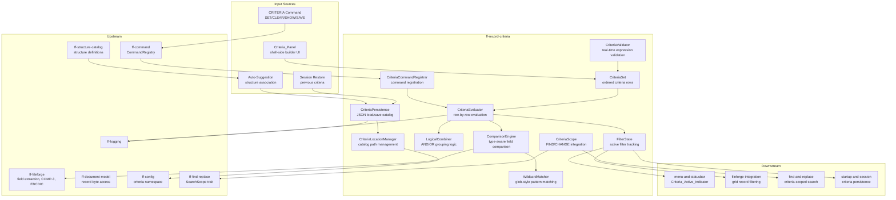

# Design Document: Record Selection Criteria (`ff-record-criteria`)

## Overview

The `ff-record-criteria` crate is the **field-level record filtering engine** for the FileForgeWorkbench platform. It provides the data model, evaluation logic, persistence, and command integration for selection criteria that control which records are displayed in Grid_Edit_Mode and Grid_Browse_Mode when FileForge_Mode is active.

### Purpose

- Define and evaluate field-based filter expressions composed of criteria rows
- Support comparison operators: EQ, NE, GT, GE, LT, LE, CONTAINS, STARTS_WITH, ENDS_WITH, MATCHES_REGEX
- Combine criteria with logical connectors (AND/OR) and parenthesised grouping
- Perform field-type-aware comparison (string, numeric, packed-decimal, EBCDIC)
- Support glob-style wildcards in string comparisons
- Persist named criteria sets to a Criteria_Catalog (`.criteria.json` files)
- Manage Criteria_Locations and Active_Criteria_Location via configuration
- Provide criteria scope integration with the find-and-replace engine
- Register the CRITERIA primary command in the command framework
- Expose filter state for status bar indicator rendering
- Provide structure-association auto-suggestion on FileForge_Mode activation

### Position in Architecture

```
Wave 12 — FileForge Domain

┌─────────────────────────────────────────────────────────────┐
│                     Application Binary                        │
│              (ffwb / GUI shell — ff-desktop)                  │
├─────────────────────────────────────────────────────────────┤
│  Criteria_Panel │ Criteria_Catalog_Dialog │ Status Bar        │
│  (shell-side rendering — NOT in this crate)                  │
├─────────────────────────────────────────────────────────────┤
│        ff-record-criteria (THIS CRATE) — Wave 12             │
├─────────────────────────────────────────────────────────────┤
│  ff-fileforge (Wave 12) │ ff-structure-catalog (Wave 12)     │
│  ff-document-model (Wave 4) │ ff-command (Wave 2)            │
│  ff-config (Wave 2) │ ff-find-replace (Wave 5)               │
│  ff-logging (Wave 0)                                         │
└─────────────────────────────────────────────────────────────┘
```

### Design Constraints (Cross-Cutting)

- **GUI Independence**: Zero GUI framework dependencies — criteria model, evaluation, and persistence are data-only; dialog rendering is shell-side
- **Command-Driven**: CRITERIA command (with SET/CLEAR/SHOW/SAVE subcommands) registered in command framework
- **Multi-Crate Workspace**: Crate at `crates/ff-record-criteria`
- **Error Message Standards**: All errors follow `[record-criteria] operation: description` format
- **Configuration Namespace**: Criteria settings live under `[criteria]` in the configuration hierarchy

### Upstream Dependencies

- `ff-fileforge` (Wave 12): Record parsing, field extraction, packed-decimal decoding, EBCDIC-to-display conversion; provides `RecordStructure`, `FieldDefinition`, `FieldValue` types
- `ff-structure-catalog` (Wave 12): `StructureDefinition` metadata, Active_Catalog_Location, structure name lookups for association
- `ff-document-model` (Wave 4): Document buffer access for record byte extraction
- `ff-command` (Wave 2): Command registry for CRITERIA command registration; `CommandId`, `CommandMetadata`
- `ff-config` (Wave 2): TOML configuration for `[criteria]` namespace; hot-reload callbacks
- `ff-find-replace` (Wave 5): `SearchScope` trait for criteria-scoped FIND/CHANGE operations
- `ff-logging` (Wave 0): Diagnostic output for config warnings and evaluation errors

### Downstream Consumers

- `ff-desktop` (GUI shell): Renders Criteria_Panel, Criteria_Catalog_Dialog, status bar indicator
- `menu-and-statusbar`: Reads filter state for Criteria_Active_Indicator display
- `fileforge-integration`: Calls evaluator to filter records for grid display
- `find-and-replace`: Consumes `CriteriaScope` to restrict FIND/CHANGE to matching records
- `startup-and-session`: Persists/restores active criteria state per file session

---

## Architecture

### High-Level Architecture Diagram



### Layer Placement

| Component | Responsibility |
|-----------|---------------|
| **CriteriaSet** | Data model: ordered list of Criterion rows, Case_Sensitive_Flag, Record_Type_Scope; serialisable to/from JSON |
| **CriteriaEvaluator** | Core logic: evaluates a CriteriaSet against a record's field values, returning match/no-match |
| **ComparisonEngine** | Field-type-aware comparison: numeric, string, packed-decimal, EBCDIC; wildcard and regex support |
| **LogicalCombiner** | AND/OR grouping: combines per-row results respecting connectors and parenthesised groups |
| **WildcardMatcher** | Glob-style pattern matching (`*`, `?`) with escape support and case sensitivity control |
| **CriteriaPersistence** | JSON-based load/save of named CriteriaSets to `.criteria.json` files in Criteria_Locations |
| **CriteriaLocationManager** | CRUD for Criteria_Locations; manages Active_Criteria_Location designation |
| **CriteriaCommandRegistrar** | Registers `criteria` command (alias `select`) with SET/CLEAR/SHOW/SAVE subcommands |
| **FilterState** | Tracks active filter: current CriteriaSet, match count, total count, named-or-unsaved status |
| **CriteriaScope** | Implements SearchScope integration for FIND/CHANGE operations restricted to criteria-matching records |
| **CriteriaValidator** | Validates criteria expressions: unmatched groups, invalid regex, type mismatches, unknown fields |

---

## Components and Interfaces

```
crates/ff-record-criteria/
├── Cargo.toml
├── src/
│   ├── lib.rs                 # Public API re-exports, crate docs
│   ├── model.rs               # CriteriaSet, Criterion, CriteriaOperator, CriteriaConnector
│   ├── evaluator.rs           # CriteriaEvaluator: record-level evaluation orchestration
│   ├── comparison.rs          # ComparisonEngine: type-aware field comparison
│   ├── logical.rs             # LogicalCombiner: AND/OR with grouping and precedence
│   ├── wildcard.rs            # WildcardMatcher: glob pattern matching
│   ├── persistence.rs         # CriteriaPersistence: JSON load/save, Criteria_Catalog ops
│   ├── location.rs            # CriteriaLocationManager: path management
│   ├── commands.rs            # CriteriaCommandRegistrar: command + alias registration
│   ├── filter_state.rs        # FilterState: active criteria tracking, indicators
│   ├── scope.rs               # CriteriaScope: FIND/CHANGE scope integration
│   ├── validator.rs           # CriteriaValidator: expression validation
│   ├── config.rs              # CriteriaConfig: configuration loading, hot-reload
│   ├── association.rs         # StructureAssociation: auto-suggestion logic
│   ├── types.rs               # Newtypes, common type aliases
│   └── error.rs               # CriteriaError enum
└── tests/
    ├── model_tests.rs         # CriteriaSet construction, serialisation
    ├── evaluator_tests.rs     # End-to-end evaluation scenarios
    ├── comparison_tests.rs    # Operator-specific comparison tests
    ├── logical_tests.rs       # AND/OR grouping, precedence tests
    ├── wildcard_tests.rs      # Wildcard pattern matching tests
    ├── persistence_tests.rs   # JSON round-trip, catalog operations
    ├── validator_tests.rs     # Expression validation tests
    ├── commands_tests.rs      # Command parsing and dispatch tests
    └── property_tests.rs      # Property-based tests (proptest)
```

---

## Data Models

### CriteriaOperator

```rust
/// Comparison operators available for criteria evaluation.
///
/// Addresses: Requirement 2
#[derive(Debug, Clone, Copy, PartialEq, Eq, Hash, serde::Serialize, serde::Deserialize)]
#[non_exhaustive]
pub enum CriteriaOperator {
    /// Equals — exact match (or wildcard match if value contains `*` or `?`).
    #[serde(rename = "EQ")]
    Eq,
    /// Not equals — inverse of Eq.
    #[serde(rename = "NE")]
    Ne,
    /// Greater than — ordered comparison.
    #[serde(rename = "GT")]
    Gt,
    /// Greater than or equal — ordered comparison.
    #[serde(rename = "GE")]
    Ge,
    /// Less than — ordered comparison.
    #[serde(rename = "LT")]
    Lt,
    /// Less than or equal — ordered comparison.
    #[serde(rename = "LE")]
    Le,
    /// Contains — substring match.
    #[serde(rename = "CONTAINS")]
    Contains,
    /// Starts with — prefix match.
    #[serde(rename = "STARTS_WITH")]
    StartsWith,
    /// Ends with — suffix match.
    #[serde(rename = "ENDS_WITH")]
    EndsWith,
    /// Matches regex — regular expression pattern match.
    #[serde(rename = "MATCHES_REGEX")]
    MatchesRegex,
}
```

### CriteriaConnector

```rust
/// Logical connectors joining adjacent criterion rows.
///
/// Addresses: Requirement 5
#[derive(Debug, Clone, Copy, PartialEq, Eq, Hash, serde::Serialize, serde::Deserialize)]
pub enum CriteriaConnector {
    /// Logical AND — both sides must be true. Binds tighter than OR.
    #[serde(rename = "AND")]
    And,
    /// Logical OR — either side must be true.
    #[serde(rename = "OR")]
    Or,
}
```

### ComparisonMode

```rust
/// The comparison mode determined by the field's data type.
///
/// Addresses: Requirement 3
#[derive(Debug, Clone, Copy, PartialEq, Eq)]
pub enum ComparisonMode {
    /// Lexicographic string comparison (field types: str, bool).
    String,
    /// Numeric comparison after parsing to decimal (field types: int, float).
    Numeric,
    /// Packed-decimal comparison via COMP-3 decoding (field type: comp3/packed).
    PackedDecimal,
}
```

### Criterion

```rust
/// A single filter rule within a CriteriaSet.
///
/// Addresses: Requirement 1 AC 2
#[derive(Debug, Clone, PartialEq, Eq, serde::Serialize, serde::Deserialize)]
pub struct Criterion {
    /// Whether this criterion row is active in evaluation.
    pub enabled: bool,
    /// The field name referencing a field in the active Record_Structure.
    pub field: String,
    /// The comparison operator to apply.
    pub operator: CriteriaOperator,
    /// The primary comparison value (as a string; parsed per field type).
    pub value: String,
    /// Secondary value for range operators (reserved for future use).
    #[serde(default, skip_serializing_if = "Option::is_none")]
    pub value2: Option<String>,
    /// Logical connector to the next row. None on the last row.
    #[serde(default, skip_serializing_if = "Option::is_none")]
    pub connector: Option<CriteriaConnector>,
    /// Whether this row opens a parenthesised group.
    #[serde(default)]
    pub group_open: bool,
    /// Whether this row closes a parenthesised group.
    #[serde(default)]
    pub group_close: bool,
}
```

### CriteriaSet

```rust
/// A complete filter expression: an ordered list of criteria rows with metadata.
///
/// Addresses: Requirement 1 AC 1, 6, 7
#[derive(Debug, Clone, PartialEq, serde::Serialize, serde::Deserialize)]
pub struct CriteriaSet {
    /// The user-assigned name (if saved to catalog). None for unsaved expressions.
    #[serde(default, skip_serializing_if = "Option::is_none")]
    pub name: Option<String>,
    /// Optional structure association for auto-suggestion matching.
    #[serde(default, skip_serializing_if = "Option::is_none")]
    pub structure_association: Option<String>,
    /// Optional record type scope. None means ALL TYPES.
    #[serde(default, skip_serializing_if = "Option::is_none")]
    pub record_type_scope: Option<String>,
    /// Case sensitivity for string comparisons. Default: false.
    #[serde(default)]
    pub case_sensitive: bool,
    /// The ordered list of criterion rows forming the filter expression.
    pub criteria: Vec<Criterion>,
}
```

### CriteriaResult

```rust
/// The result of evaluating a CriteriaSet against a single record.
///
/// Addresses: Requirement 7 AC 1
#[derive(Debug, Clone, PartialEq, Eq)]
pub struct CriteriaResult {
    /// Whether the record satisfies the criteria expression.
    pub matches: bool,
    /// Per-row evaluation details (for UI highlighting in the panel).
    pub row_results: Vec<RowResult>,
}

/// Evaluation result for a single criterion row.
#[derive(Debug, Clone, PartialEq, Eq)]
pub struct RowResult {
    /// Index of the criterion row in the CriteriaSet.
    pub row_index: usize,
    /// Whether this individual row matched.
    pub matched: bool,
    /// Whether this row was skipped (disabled).
    pub skipped: bool,
    /// Validation issue if any (e.g., unknown field, type mismatch).
    pub issue: Option<ValidationIssue>,
}
```

### FilterState

```rust
/// Tracks the active filter state for one file session.
///
/// Addresses: Requirement 7 AC 12, Requirement 13
#[derive(Debug, Clone, PartialEq)]
pub struct FilterState {
    /// The currently applied CriteriaSet, or None if no criteria active.
    active_criteria: Option<CriteriaSet>,
    /// Number of records matching the active criteria (visible count).
    visible_count: usize,
    /// Total number of records in the file.
    total_count: usize,
    /// Whether the active criteria set has a saved name.
    is_named: bool,
}

impl FilterState {
    /// Create a new inactive filter state.
    pub fn inactive() -> Self;

    /// Apply a CriteriaSet, transitioning to active state.
    pub fn apply(&mut self, criteria: CriteriaSet, visible: usize, total: usize);

    /// Clear the active criteria, returning to inactive state.
    pub fn clear(&mut self);

    /// Whether criteria are currently active.
    pub fn is_active(&self) -> bool;

    /// Get the active criteria set (if any).
    pub fn active_criteria(&self) -> Option<&CriteriaSet>;

    /// Format the status bar indicator text.
    /// Returns None when no criteria are active.
    ///
    /// Addresses: Requirement 13 AC 1, 2
    pub fn format_indicator(&self) -> Option<String>;

    /// Format the record count display (e.g., "Showing 142 of 10,000 records").
    ///
    /// Addresses: Requirement 13 AC 5
    pub fn format_count(&self) -> Option<String>;
}
```

### CriteriaConfig

```rust
/// Configuration for the criteria subsystem, loaded from [criteria] TOML namespace.
///
/// Addresses: Requirement 14
#[derive(Debug, Clone, PartialEq, Eq)]
pub struct CriteriaConfig {
    /// Custom path for the Criteria_Store file. None uses default location.
    pub store_path: Option<String>,
    /// Default Active_Criteria_Location path.
    pub default_location: String,
    /// Whether structure-association auto-suggestion is enabled.
    pub auto_suggest: bool,
    /// Maximum criteria rows per CriteriaSet.
    pub max_criteria_rows: usize,
}

impl Default for CriteriaConfig {
    fn default() -> Self {
        Self {
            store_path: None,
            default_location: String::from("~/.config/ffworkbench/criteria/"),
            auto_suggest: true,
            max_criteria_rows: 50,
        }
    }
}
```

### CriteriaStore

```rust
/// The persistent store tracking Criteria_Locations and Active_Criteria_Location.
/// Stored as TOML in the configuration system's user layer.
///
/// Addresses: Requirement 9 AC 1, 2
#[derive(Debug, Clone, PartialEq, Eq, serde::Serialize, serde::Deserialize)]
pub struct CriteriaStore {
    /// All known Criteria_Locations.
    pub locations: Vec<CriteriaLocation>,
    /// The name/path of the Active_Criteria_Location.
    pub active_location: String,
}

/// A single Criteria_Location entry in the store.
#[derive(Debug, Clone, PartialEq, Eq, serde::Serialize, serde::Deserialize)]
pub struct CriteriaLocation {
    /// User-assigned name for this location.
    pub name: String,
    /// Filesystem path to the criteria catalog directory.
    pub path: String,
}
```

### ValidationIssue

```rust
/// A validation issue detected in a criteria expression.
///
/// Addresses: Requirement 5 AC 4, Requirement 2 AC 9, 12
#[derive(Debug, Clone, PartialEq, Eq)]
#[non_exhaustive]
pub enum ValidationIssue {
    /// A referenced field name does not exist in the active Record_Structure.
    UnknownField { field: String },
    /// Group open/close flags are unmatched.
    UnmatchedGroup { row_index: usize, detail: String },
    /// The regex pattern in a MATCHES_REGEX criterion is invalid.
    InvalidRegex { row_index: usize, pattern: String, error: String },
    /// The criterion value cannot be parsed as the expected numeric type.
    TypeMismatch { row_index: usize, field: String, expected: String, value: String },
    /// Maximum nesting depth exceeded (>8 levels).
    NestingDepthExceeded { row_index: usize, depth: usize },
    /// Maximum criteria rows exceeded.
    MaxRowsExceeded { count: usize, max: usize },
}
```

---

## Public API Surface

### CriteriaEvaluator — Core Evaluation

```rust
/// The criteria evaluator applies a CriteriaSet to a record's field values,
/// returning whether the record matches the filter expression.
///
/// This is the single entry point for all criteria evaluation.
pub struct CriteriaEvaluator {
    comparison: ComparisonEngine,
    combiner: LogicalCombiner,
}

impl CriteriaEvaluator {
    /// Create a new evaluator.
    pub fn new() -> Self;

    /// Evaluate a CriteriaSet against a record's extracted field values.
    /// Returns a CriteriaResult indicating match/no-match with per-row details.
    ///
    /// `field_values` is a map of field name → extracted string value.
    /// `field_types` provides the data type for each field (for comparison mode selection).
    ///
    /// Addresses: Requirement 1 AC 3, 4, 5; Requirement 7 AC 1
    pub fn evaluate(
        &self,
        criteria: &CriteriaSet,
        field_values: &HashMap<String, String>,
        field_types: &HashMap<String, FieldDataType>,
    ) -> CriteriaResult;

    /// Evaluate a CriteriaSet against all records, returning indices of matching records.
    /// Used for bulk filtering in grid display.
    ///
    /// Addresses: Requirement 7 AC 1, 2
    pub fn evaluate_all(
        &self,
        criteria: &CriteriaSet,
        records: &[RecordFields],
        field_types: &HashMap<String, FieldDataType>,
    ) -> Vec<usize>;

    /// Check if all criteria rows are disabled or the set is empty.
    /// When true, filtering is skipped entirely.
    ///
    /// Addresses: Requirement 1 AC 4
    pub fn is_passthrough(criteria: &CriteriaSet) -> bool;
}
```

### ComparisonEngine — Type-Aware Comparison

```rust
/// Performs field-type-aware comparisons between field values and criterion values.
pub struct ComparisonEngine {
    wildcard: WildcardMatcher,
}

impl ComparisonEngine {
    /// Create a new comparison engine.
    pub fn new() -> Self;

    /// Compare a field value against a criterion value using the specified operator.
    ///
    /// Addresses: Requirement 2, Requirement 3
    pub fn compare(
        &self,
        field_value: &str,
        criterion_value: &str,
        operator: CriteriaOperator,
        mode: ComparisonMode,
        case_sensitive: bool,
    ) -> Result<bool, CriteriaError>;

    /// Determine the comparison mode for a given field data type.
    ///
    /// Addresses: Requirement 3 AC 1, 2, 3
    pub fn determine_mode(field_type: &FieldDataType) -> ComparisonMode;
}
```

### WildcardMatcher — Glob Pattern Matching

```rust
/// Glob-style wildcard pattern matching for string criteria values.
///
/// Addresses: Requirement 4
pub struct WildcardMatcher;

impl WildcardMatcher {
    /// Test whether a value matches a wildcard pattern.
    /// `*` matches zero or more characters; `?` matches exactly one character.
    /// Backslash escapes: `\*` matches literal `*`, `\?` matches literal `?`.
    ///
    /// Addresses: Requirement 4 AC 1, 3, 6
    pub fn matches(
        value: &str,
        pattern: &str,
        case_sensitive: bool,
    ) -> bool;

    /// Check whether a criterion value contains wildcard characters.
    ///
    /// Addresses: Requirement 4 AC 4
    pub fn has_wildcards(value: &str) -> bool;
}
```

### LogicalCombiner — AND/OR Grouping

```rust
/// Combines per-row boolean results using AND/OR connectors and
/// parenthesised grouping, respecting standard logical precedence.
///
/// Addresses: Requirement 5
pub struct LogicalCombiner;

impl LogicalCombiner {
    /// Combine a sequence of (result, connector, group_open, group_close) tuples
    /// into a final boolean. AND binds tighter than OR unless overridden by grouping.
    ///
    /// Addresses: Requirement 5 AC 1, 2, 3
    pub fn combine(rows: &[LogicalRow]) -> bool;
}

/// Input row for the logical combiner.
#[derive(Debug, Clone)]
pub struct LogicalRow {
    /// The boolean result of this criterion's comparison.
    pub result: bool,
    /// The connector to the NEXT row (None on last row).
    pub connector: Option<CriteriaConnector>,
    /// Whether this row opens a parenthesised group.
    pub group_open: bool,
    /// Whether this row closes a parenthesised group.
    pub group_close: bool,
}
```

### CriteriaPersistence — Catalog Operations

```rust
/// Handles loading and saving CriteriaSets to `.criteria.json` files.
///
/// Addresses: Requirement 9
pub struct CriteriaPersistence;

impl CriteriaPersistence {
    /// Load a named CriteriaSet from the given criteria location.
    /// Returns an error if the file doesn't exist or is unparseable.
    ///
    /// Addresses: Requirement 9 AC 4, 7
    pub fn load(
        location: &Path,
        name: &str,
    ) -> Result<CriteriaSet, CriteriaError>;

    /// Save a CriteriaSet to the given criteria location.
    /// The file name is derived from the criteria set name.
    ///
    /// Addresses: Requirement 9 AC 4, 5, 6
    pub fn save(
        location: &Path,
        criteria: &CriteriaSet,
    ) -> Result<(), CriteriaError>;

    /// List all saved CriteriaSets in the given criteria location.
    /// Returns metadata (name, structure_association, row count) for each.
    ///
    /// Addresses: Requirement 11 AC 2
    pub fn list(
        location: &Path,
    ) -> Result<Vec<CriteriaSetMetadata>, CriteriaError>;

    /// Delete a saved CriteriaSet by name from the given location.
    ///
    /// Addresses: Requirement 11 AC 7
    pub fn delete(
        location: &Path,
        name: &str,
    ) -> Result<(), CriteriaError>;

    /// Duplicate a saved CriteriaSet under a new name.
    ///
    /// Addresses: Requirement 11 AC 6
    pub fn duplicate(
        location: &Path,
        source_name: &str,
        new_name: &str,
    ) -> Result<(), CriteriaError>;
}

/// Metadata about a saved CriteriaSet (for catalog listing).
#[derive(Debug, Clone, PartialEq, Eq)]
pub struct CriteriaSetMetadata {
    pub name: String,
    pub structure_association: Option<String>,
    pub criteria_count: usize,
    pub file_path: PathBuf,
}
```

### CriteriaLocationManager — Location Management

```rust
/// Manages Criteria_Locations and the Active_Criteria_Location.
///
/// Addresses: Requirement 9 AC 1, 2, 3, 10
pub struct CriteriaLocationManager {
    store: CriteriaStore,
    config: CriteriaConfig,
}

impl CriteriaLocationManager {
    /// Create from a persisted CriteriaStore, or initialise with defaults.
    ///
    /// Addresses: Requirement 9 AC 8
    pub fn new(config: &CriteriaConfig) -> Self;

    /// Load the CriteriaStore from the configured path.
    ///
    /// Addresses: Requirement 9 AC 8, 9
    pub fn load(store_path: &Path) -> Result<Self, CriteriaError>;

    /// Get the Active_Criteria_Location path.
    pub fn active_location(&self) -> &Path;

    /// Set the Active_Criteria_Location.
    pub fn set_active_location(&mut self, path: &str) -> Result<(), CriteriaError>;

    /// Add a new Criteria_Location.
    pub fn add_location(&mut self, name: &str, path: &str) -> Result<(), CriteriaError>;

    /// Remove a Criteria_Location by name.
    pub fn remove_location(&mut self, name: &str) -> Result<(), CriteriaError>;

    /// List all configured Criteria_Locations.
    pub fn locations(&self) -> &[CriteriaLocation];

    /// Persist the CriteriaStore to its configured file.
    pub fn save(&self, store_path: &Path) -> Result<(), CriteriaError>;
}
```

### CriteriaCommandRegistrar — Command Integration

```rust
/// Registers criteria commands with the command framework.
///
/// Addresses: Requirement 6
pub struct CriteriaCommandRegistrar;

impl CriteriaCommandRegistrar {
    /// Register the CRITERIA command and its subcommands.
    ///
    /// Commands registered:
    /// - `criteria` (alias: `select`) — primary command
    ///   - `criteria.set` / `criteria.load` — load named criteria
    ///   - `criteria.clear` — remove active criteria
    ///   - `criteria.show` / `criteria.status` — display current state
    ///   - `criteria.save` — save current criteria to catalog
    ///
    /// Addresses: Requirement 6 AC 1, 8
    pub fn register_commands(registry: &mut CommandRegistry);
}

/// Parsed CRITERIA command operation.
#[derive(Debug, Clone, PartialEq, Eq)]
pub enum CriteriaCommand {
    /// Open the Criteria_Panel (no subcommand).
    OpenPanel,
    /// Load a named criteria set: `CRITERIA SET <name>`.
    Set { name: String },
    /// Clear the active criteria: `CRITERIA CLEAR`.
    Clear,
    /// Show current criteria state: `CRITERIA SHOW`.
    Show,
    /// Save current criteria: `CRITERIA SAVE <name>`.
    Save { name: String },
}

impl CriteriaCommand {
    /// Parse command arguments into a CriteriaCommand.
    ///
    /// Addresses: Requirement 6 AC 2–7
    pub fn parse(args: &str) -> Result<Self, CriteriaError>;
}
```

### CriteriaScope — FIND/CHANGE Integration

```rust
/// Provides a SearchScope implementation that restricts FIND/CHANGE
/// operations to records matching the active criteria.
///
/// Addresses: Requirement 8
pub struct CriteriaScope {
    matching_record_indices: Vec<usize>,
}

impl CriteriaScope {
    /// Create a criteria scope from the set of record indices that match
    /// the active criteria.
    pub fn new(matching_indices: Vec<usize>) -> Self;

    /// Check whether a given record index is within the criteria scope.
    ///
    /// Addresses: Requirement 8 AC 1, 2, 6
    pub fn contains_record(&self, record_index: usize) -> bool;

    /// Check whether a given line number is within criteria scope.
    /// Maps the line to its parent record and checks that record.
    ///
    /// Addresses: Requirement 8 AC 6
    pub fn contains_line(
        &self,
        line_number: usize,
        line_to_record_map: &dyn LineToRecordMap,
    ) -> bool;

    /// Whether this scope has any effect (i.e., not all records match).
    ///
    /// Addresses: Requirement 8 AC 3
    pub fn is_effective(&self) -> bool;
}

/// Trait for mapping display lines to their parent record index.
pub trait LineToRecordMap {
    fn record_for_line(&self, line: usize) -> Option<usize>;
}
```

### CriteriaValidator — Expression Validation

```rust
/// Validates a CriteriaSet for correctness before evaluation.
///
/// Addresses: Requirement 5 AC 4, Requirement 10 AC 14
pub struct CriteriaValidator;

impl CriteriaValidator {
    /// Validate a CriteriaSet against the current field definitions.
    /// Returns a list of validation issues (empty = valid).
    pub fn validate(
        criteria: &CriteriaSet,
        available_fields: &[String],
        field_types: &HashMap<String, FieldDataType>,
        max_rows: usize,
    ) -> Vec<ValidationIssue>;

    /// Validate group structure only (matched open/close flags).
    ///
    /// Addresses: Requirement 5 AC 4
    pub fn validate_groups(criteria: &CriteriaSet) -> Vec<ValidationIssue>;

    /// Validate regex patterns in MATCHES_REGEX criteria.
    ///
    /// Addresses: Requirement 2 AC 9
    pub fn validate_regex_patterns(criteria: &CriteriaSet) -> Vec<ValidationIssue>;
}
```

### StructureAssociation — Auto-Suggestion

```rust
/// Provides auto-suggestion logic for applying saved criteria
/// when a matching structure is activated.
///
/// Addresses: Requirement 12
pub struct StructureAssociation;

impl StructureAssociation {
    /// Find saved criteria sets whose structure_association matches
    /// the given structure name (case-insensitive).
    ///
    /// Addresses: Requirement 12 AC 1, 5
    pub fn find_matching(
        location: &Path,
        structure_name: &str,
    ) -> Result<Vec<CriteriaSetMetadata>, CriteriaError>;

    /// Get the most recently modified matching criteria set.
    ///
    /// Addresses: Requirement 12 AC 1
    pub fn most_recent_match(
        location: &Path,
        structure_name: &str,
    ) -> Result<Option<CriteriaSetMetadata>, CriteriaError>;
}
```

### CriteriaSet Utility Methods

```rust
impl CriteriaSet {
    /// Create an empty CriteriaSet with default settings.
    pub fn empty() -> Self;

    /// Create a CriteriaSet with a single criterion row.
    pub fn single(field: &str, operator: CriteriaOperator, value: &str) -> Self;

    /// Get only the enabled criteria rows.
    pub fn enabled_criteria(&self) -> Vec<&Criterion>;

    /// Format the criteria expression as a displayable string.
    /// E.g., `FIELD1 EQ 'ABC' AND FIELD2 GT '100'`
    ///
    /// Addresses: Requirement 1 AC 7
    pub fn to_expression_string(&self) -> String;

    /// Sanitise a name for use as a filename (replace non-alphanumeric with underscores).
    ///
    /// Addresses: Requirement 11 AC 9
    pub fn sanitise_name(name: &str) -> String;

    /// Deserialise a CriteriaSet from a JSON string.
    ///
    /// Addresses: Requirement 1 AC 6
    pub fn from_json(json: &str) -> Result<Self, CriteriaError>;

    /// Serialise the CriteriaSet to a JSON string.
    ///
    /// Addresses: Requirement 1 AC 6
    pub fn to_json(&self) -> Result<String, CriteriaError>;
}
```

---

## Error Handling

```rust
/// Errors originating from the ff-record-criteria crate.
/// Formatted per Error Message Standards: `[record-criteria] operation: description`
#[derive(Debug, thiserror::Error)]
#[non_exhaustive]
pub enum CriteriaError {
    /// A referenced field does not exist in the active Record_Structure.
    #[error("[record-criteria] evaluate: field '{field}' not found in active structure")]
    FieldNotFound { field: String },

    /// The regex pattern in a MATCHES_REGEX criterion is invalid.
    #[error("[record-criteria] evaluate: invalid regex pattern '{pattern}' in row {row}: {detail}")]
    InvalidRegex { row: usize, pattern: String, detail: String },

    /// A criterion value cannot be parsed as the expected numeric type.
    #[error("[record-criteria] evaluate: cannot parse '{value}' as numeric for field '{field}'")]
    NumericParseFailed { field: String, value: String },

    /// Group open/close structure is invalid.
    #[error("[record-criteria] validate: unmatched group at row {row} — {detail}")]
    UnmatchedGroup { row: usize, detail: String },

    /// A named CriteriaSet was not found in the catalog.
    #[error("[record-criteria] load: criteria set '{name}' not found in {location}")]
    CriteriaNotFound { name: String, location: String },

    /// The .criteria.json file could not be parsed.
    #[error("[record-criteria] load: failed to parse '{path}' — {detail}")]
    ParseFailed { path: String, detail: String },

    /// I/O error accessing the criteria catalog.
    #[error("[record-criteria] io: {operation} failed for '{path}' — {source}")]
    Io { operation: String, path: String, source: String },

    /// The Criteria_Store configuration file is corrupt.
    #[error("[record-criteria] store: criteria store at '{path}' is corrupt — {detail}")]
    StoreCorrupt { path: String, detail: String },

    /// Invalid CRITERIA command argument.
    #[error("[record-criteria] command: invalid argument '{arg}' — expected SET, CLEAR, SHOW, or SAVE")]
    InvalidCommandArg { arg: String },

    /// FileForge_Mode is not active (criteria require structured records).
    #[error("[record-criteria] command: FileForge_Mode is not active — criteria require a structure definition")]
    FileForgeNotActive,

    /// Configuration key has invalid value.
    #[error("[record-criteria] config: key '{key}' has invalid value '{value}' — using default")]
    InvalidConfig { key: String, value: String },

    /// Maximum criteria rows exceeded.
    #[error("[record-criteria] validate: criteria set has {count} rows, maximum is {max}")]
    MaxRowsExceeded { count: usize, max: usize },

    /// Name collision when saving.
    #[error("[record-criteria] save: a criteria set named '{name}' already exists — use overwrite")]
    NameCollision { name: String },
}
```

---

## Integration Points

### With `ff-fileforge` (FileForge Integration — Wave 12, upstream)

- **Dependency direction**: ff-record-criteria depends on ff-fileforge
- **API consumed**: `RecordStructure` for field names and types; `FieldDefinition` for data_type, offset, length; `FieldValue` extraction from record bytes; packed-decimal decoding via `decode_comp3()`; EBCDIC-to-display conversion via `decode_ebcdic()`
- **Coordination**: When the evaluator encounters a `comp3` field type, it delegates decoding to ff-fileforge's packed-decimal decoder. For EBCDIC fields, it calls the EBCDIC-to-UTF8 converter before performing string comparison
- **Record access**: ff-fileforge provides extracted field values as a `HashMap<String, String>` per record, ready for criteria evaluation

### With `ff-structure-catalog` (Structure Catalog — Wave 12, upstream)

- **Dependency direction**: ff-record-criteria depends on ff-structure-catalog
- **API consumed**: `StructureDefinition` metadata for structure_association matching; field list from the active Record_Structure for populating field dropdowns; `Active_Catalog_Location` awareness for structure name lookups
- **Coordination**: When the active Structure_Definition changes, the criteria module is notified so it can clear incompatible criteria (Requirement 7 AC 7). Auto-suggestion queries the catalog for the structure name

### With `ff-document-model` (Document Model — Wave 4, upstream)

- **Dependency direction**: ff-record-criteria depends on ff-document-model
- **API consumed**: Record byte access for evaluation when field values are not pre-extracted; line-to-record mapping for criteria scope integration with FIND/CHANGE
- **Coordination**: The evaluator operates on already-extracted field values in normal flow. The document model provides the `LineToRecordMap` trait implementation used by CriteriaScope

### With `ff-command` (Command Framework — Wave 2, upstream)

- **Dependency direction**: ff-record-criteria depends on ff-command
- **API consumed**: `CommandRegistry::register()` for command registration; `CommandId` for identity; `CommandMetadata` for display name, description, category
- **Commands registered**:
  - `criteria` (alias: `select`) — metadata: "Criteria", category: "criteria"
  - Subcommands: SET, CLEAR, SHOW, SAVE
- **Undo integration**: CRITERIA SET and CRITERIA CLEAR are recorded on the undo stack (they change display state). CRITERIA SHOW and CRITERIA SAVE are NOT recorded
- **History**: CRITERIA commands ARE added to command history

### With `ff-config` (Configuration System — Wave 2, upstream)

- **Dependency direction**: ff-record-criteria depends on ff-config
- **API consumed**: Typed access for `[criteria]` namespace: `get_string("criteria.store_path")`, `get_string("criteria.default_location")`, `get_bool("criteria.auto_suggest")`, `get_int("criteria.max_criteria_rows")`
- **Hot-reload**: ff-record-criteria registers a reload callback for the `criteria` namespace. When config changes, it rebuilds `CriteriaConfig` and applies new settings (Requirement 14 AC 6)
- **Schema registration**: At startup, registers schema entries for all `criteria.*` keys with types, defaults, and descriptions

### With `ff-find-replace` (Find and Replace — Wave 5, downstream consumer)

- **Dependency direction**: ff-find-replace depends on ff-record-criteria (for CriteriaScope)
- **API consumed**: `CriteriaScope::contains_line()` to check whether a line is within criteria scope during FIND/CHANGE operations
- **Integration**: When the user specifies the `CRITERIA` modifier on FIND/CHANGE commands, the find engine obtains a `CriteriaScope` from the active filter state and uses it to filter candidate lines (Requirement 8 AC 1, 2, 4)
- **Scope combination**: CriteriaScope combines conjunctively with other scope modifiers (TAGGED, EXCLUDED, VISIBLE, column bounds)

### With `ff-logging` (Foundation — Wave 0, upstream)

- **Dependency direction**: ff-record-criteria depends on ff-logging
- **API consumed**: `log_info!`, `log_warn!`, `log_debug!` macros
- **Usage**: Config validation warnings at WARN; evaluation errors (invalid regex, type mismatch) at WARN; criteria load/save operations at INFO; evaluation flow at DEBUG
- **Log prefix**: `[record-criteria]`

### Dependency Direction Summary

```
ff-logging           ← ff-record-criteria
ff-config            ← ff-record-criteria
ff-command           ← ff-record-criteria
ff-document-model    ← ff-record-criteria
ff-fileforge         ← ff-record-criteria
ff-structure-catalog ← ff-record-criteria
ff-record-criteria   ← ff-find-replace (CriteriaScope)
ff-record-criteria   ← ff-desktop (panel/dialog rendering)
ff-record-criteria   ← menu-and-statusbar (indicator)
ff-record-criteria   ← startup-and-session (persistence)
```

---

## Configuration

ff-record-criteria owns the `[criteria]` namespace in the workbench TOML configuration file.

### TOML Schema

```toml
[criteria]
# Custom path for the Criteria_Store file (TOML).
# Type: string (path). Default: user-level config directory.
# store_path = "~/.config/ffworkbench/criteria_store.toml"

# Default Active_Criteria_Location path.
# Type: string (path). Default: "~/.config/ffworkbench/criteria/"
default_location = "~/.config/ffworkbench/criteria/"

# Enable/disable structure-association auto-suggestion prompts.
# Type: boolean. Default: true.
auto_suggest = true

# Maximum number of criteria rows per CriteriaSet.
# Type: integer. Default: 50. Valid range: 1–200.
max_criteria_rows = 50
```

### Config Resolution Rules

| Setting | Absent | Invalid Type | Out of Range | Semantic Error |
|---------|--------|--------------|--------------|----------------|
| `store_path` | Use default user-level path | Use default + WARN | — | Path doesn't exist: use default + WARN |
| `default_location` | Use platform default | Use default + WARN | — | Path doesn't exist: create it + INFO |
| `auto_suggest` | Default to `true` | Default to `true` + WARN | — | — |
| `max_criteria_rows` | Default to 50 | Default to 50 + WARN | Clamp to [1, 200] + WARN | — |

---

## Correctness Properties

The following properties are suitable for property-based testing with the `proptest` crate. Each property is universal — it must hold for all valid inputs.

### Property 1: Empty/All-Disabled Criteria Passthrough

**Statement:** When a CriteriaSet is empty or all criteria rows are disabled, evaluation returns `matches: true` for every record (no filtering occurs).

```
∀ CriteriaSet CS where CS.criteria.is_empty() ∨ CS.criteria.iter().all(|c| !c.enabled),
∀ Record R:
    CriteriaEvaluator::evaluate(&CS, R.fields, R.types).matches == true
```

**Validates: Requirements 1.4, 1.5**

### Property 2: Disabled Row Skip Equivalence

**Statement:** Evaluating a CriteriaSet with a disabled row produces the same result as evaluating the CriteriaSet with that row removed entirely.

```
∀ CriteriaSet CS, ∀ Record R, ∀ row_index I where CS.criteria[I].enabled == false:
    let cs_with = evaluate(CS, R);
    let cs_without = evaluate(CS.with_row_removed(I), R);
    cs_with.matches == cs_without.matches
```

**Validates: Requirements 1.5**

### Property 3: Operator Correctness — EQ Symmetry with NE

**Statement:** For any field value and criterion value, `EQ` returns the logical negation of `NE` (and vice versa), regardless of comparison mode.

```
∀ field_value V, ∀ criterion_value C, ∀ ComparisonMode M, ∀ case_sensitive B:
    compare(V, C, EQ, M, B) == !compare(V, C, NE, M, B)
```

**Validates: Requirements 2.2, 2.3**

### Property 4: Ordering Consistency (GT/GE/LT/LE)

**Statement:** The ordering operators form a consistent total order. For any two values, exactly one of `GT`, `EQ`, `LT` holds, and `GE ≡ GT ∨ EQ`, `LE ≡ LT ∨ EQ`.

```
∀ field_value V, ∀ criterion_value C, ∀ ComparisonMode M, ∀ case_sensitive B:
    let eq = compare(V, C, EQ, M, B);
    let gt = compare(V, C, GT, M, B);
    let lt = compare(V, C, LT, M, B);
    (eq as u8 + gt as u8 + lt as u8) == 1
    ∧ compare(V, C, GE, M, B) == (gt || eq)
    ∧ compare(V, C, LE, M, B) == (lt || eq)
```

**Validates: Requirements 2.4**

### Property 5: Case Sensitivity Toggle

**Statement:** When `case_sensitive` is false, string comparison results are identical regardless of the case of the input values.

```
∀ field_value V, ∀ criterion_value C, ∀ string operator OP ∈ {EQ, NE, CONTAINS, STARTS_WITH, ENDS_WITH}:
    compare(V, C, OP, String, false) == compare(V.to_lowercase(), C.to_lowercase(), OP, String, true)
```

**Validates: Requirements 2.10, 2.11**

### Property 6: Wildcard No-Op Without Pattern Characters

**Statement:** When a criterion value contains no wildcard characters (`*`, `?`), EQ with that value produces the same result as exact equality.

```
∀ field_value V, ∀ criterion_value C where !WildcardMatcher::has_wildcards(C):
    compare_with_wildcard(V, C, EQ, case_sensitive) == (normalize(V) == normalize(C))
```

**Validates: Requirements 4.4**

### Property 7: Logical AND Strictness

**Statement:** Combining two criterion results with AND produces `true` only when both individual results are `true`.

```
∀ bool A, ∀ bool B:
    combine([LogicalRow{result: A, connector: Some(And)}, LogicalRow{result: B, connector: None}])
    == (A && B)
```

**Validates: Requirements 5.1**

### Property 8: Logical OR Leniency

**Statement:** Combining two criterion results with OR produces `true` when at least one individual result is `true`.

```
∀ bool A, ∀ bool B:
    combine([LogicalRow{result: A, connector: Some(Or)}, LogicalRow{result: B, connector: None}])
    == (A || B)
```

**Validates: Requirements 5.1**

### Property 9: Group Override Precedence

**Statement:** Parenthesised groups override default AND/OR precedence. `A OR (B AND C)` evaluates the group first.

```
∀ bool A, B, C:
    let rows = [
        LogicalRow{result: A, connector: Some(Or), group_open: false, group_close: false},
        LogicalRow{result: B, connector: Some(And), group_open: true, group_close: false},
        LogicalRow{result: C, connector: None, group_open: false, group_close: true},
    ];
    combine(rows) == (A || (B && C))
```

**Validates: Requirements 5.2, 5.3**

### Property 10: JSON Round-Trip Preservation

**Statement:** Serialising a CriteriaSet to JSON and deserialising back produces an identical CriteriaSet.

```
∀ CriteriaSet CS (well-formed):
    let json = CS.to_json().unwrap();
    let restored = CriteriaSet::from_json(&json).unwrap();
    restored == CS
```

**Validates: Requirements 1.6**

### Property 11: Filter State Indicator Consistency

**Statement:** `FilterState::format_indicator()` returns `Some(...)` if and only if a CriteriaSet is active.

```
∀ FilterState FS:
    FS.format_indicator().is_some() ⟺ FS.is_active()
```

**Validates: Requirements 13.1, 13.2**

### Property 12: Criteria Scope Record Containment

**Statement:** A CriteriaScope constructed from matching record indices correctly reports containment for exactly those indices and no others.

```
∀ Vec<usize> indices (sorted, unique), ∀ usize query:
    let scope = CriteriaScope::new(indices.clone());
    scope.contains_record(query) == indices.contains(&query)
```

**Validates: Requirements 8.1, 8.6**

---

## Testing Strategy

### Unit Tests

- **model_tests.rs**: CriteriaSet construction, Criterion building, expression string formatting, name sanitisation.
- **evaluator_tests.rs**: End-to-end evaluation with single/multiple criteria, disabled rows, empty sets. Exercises all operators against known field values.
- **comparison_tests.rs**: Operator-specific tests for EQ, NE, GT, GE, LT, LE, CONTAINS, STARTS_WITH, ENDS_WITH, MATCHES_REGEX. Tests numeric vs string vs packed-decimal comparison modes. Tests case sensitivity toggle.
- **logical_tests.rs**: AND/OR combination, grouping, nesting depth, unmatched group detection.
- **wildcard_tests.rs**: Pattern matching with `*`, `?`, escape sequences, case sensitivity. No-wildcard passthrough to exact equality.
- **persistence_tests.rs**: JSON round-trip serialisation/deserialisation. Load/save/list/delete/duplicate operations with temp directories.
- **validator_tests.rs**: Unknown field detection, unmatched groups, invalid regex, type mismatches, max rows.
- **commands_tests.rs**: Parsing of CRITERIA command arguments — SET, CLEAR, SHOW, SAVE, no-args, invalid inputs.

### Property-Based Tests (proptest)

- **property_tests.rs**: Implements Properties 1–12 defined above. Each property test runs a minimum of 256 cases.
- Strategies generate: arbitrary CriteriaSets (varying row counts, operators, connectors, group flags), arbitrary field values (string, numeric, mixed), arbitrary ComparisonModes, arbitrary boolean case_sensitive flags.

### Integration Tests

- **Full flow**: Config load → criteria definition → evaluation → filter state update → indicator formatting → persist → restore cycle.
- **Command dispatch**: Register commands, invoke via simulated command dispatch, verify filter state mutations.
- **FIND/CHANGE scope**: Create CriteriaScope, verify line containment against record mapping.
- **Hot-reload**: Simulate config change mid-session, verify settings applied without restart.

### What Is NOT Tested (GUI/Manual)

- Criteria_Panel rendering, field dropdowns, row manipulation buttons — requires running GUI shell
- Criteria_Catalog_Dialog layout, confirmation prompts — requires running GUI shell
- Status bar visual indicator rendering and click interaction — requires egui frame
- Docking/floating panel behaviour — requires layout-and-docking integration
- These are marked as 🔲 MANUAL in the TCR
