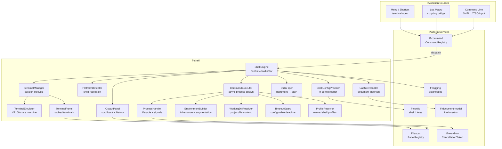
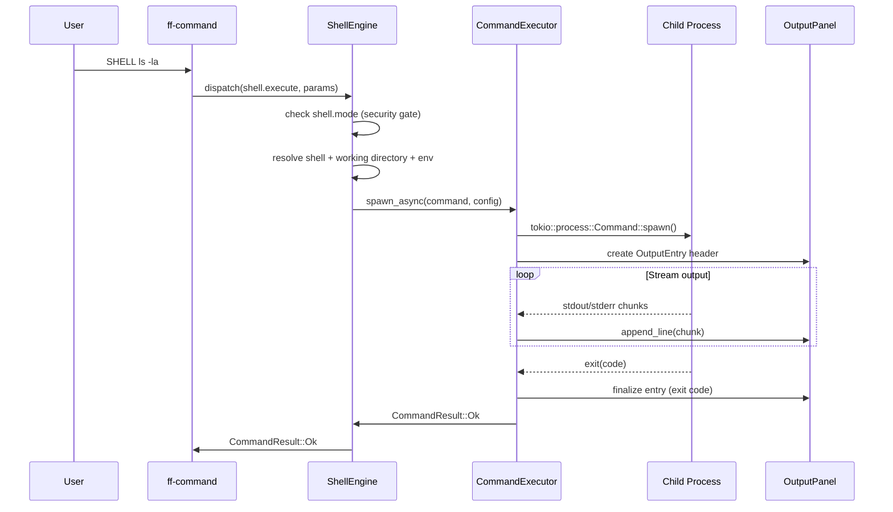
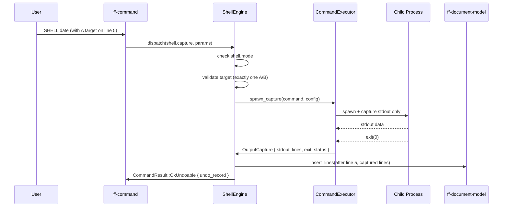
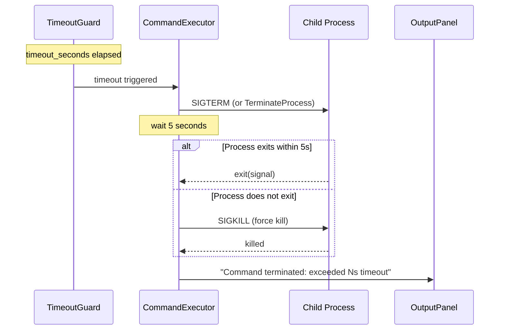

# Design Document: Shell Command Subsystem (`ff-shell`)

## Overview

The `ff-shell` crate provides **operating-system shell integration** for the FileForgeWorkbench platform. It enables users to execute external commands, capture output into documents, pipe document content as stdin, open interactive terminal sessions in dockable panels, and manage process lifecycle — all without leaving the workbench.

### Purpose

- Execute OS commands asynchronously with output capture (stdout/stderr)
- Host interactive terminal sessions as dockable panels with ANSI/VT100 emulation
- Insert command output into documents at `A`/`B` target positions (document capture mode)
- Pipe document content (full or selection) as stdin to external commands
- Manage working directory, environment variables, and shell profiles
- Enforce security controls (`shell.mode`) independently of macro security
- Handle process lifecycle: spawning, timeout, cancellation, signal delivery
- Stream output incrementally to the Output Panel with scrollback history

### Position in Architecture

```
Wave 9 — Desktop Integration

┌─────────────────────────────────────────────────────────┐
│              Shell Layer: ff-desktop (egui)               │
│         Renders Terminal_Panel and Output_Panel           │
├─────────────────────────────────────────────────────────┤
│  ff-shell (THIS CRATE) — Wave 9                          │
│  Shell engine, process management, terminal emulation    │
├─────────────────────────────────────────────────────────┤
│  ff-command │ ff-config │ ff-layout │ ff-workflow         │
│  ff-document-model │ ff-logging                          │
├─────────────────────────────────────────────────────────┤
│              Foundation Layer: ff-logging (Wave 0)        │
└─────────────────────────────────────────────────────────┘
```

### Design Constraints (Cross-Cutting)

- **GUI Independence (Req 2)**: Terminal rendering logic is shell-side (VT state machine, cell grid); the GUI shell only paints the grid
- **Command-Driven (Req 4)**: All operations dispatched through `ff-command` as `"shell.execute"`, `"shell.terminal"`, `"shell.capture"`
- **Async I/O (Req 6)**: Process spawning and output reading use Tokio async tasks; GUI thread never blocks
- **Multi-Crate Workspace (Req 7)**: Crate at `crates/ff-shell`
- **Error Message Standards (Req 8)**: All errors follow `[shell] operation: description` format
- **Plugin Architecture (Req 3)**: Terminal_Panel and Output_Panel registered via `ff-layout` PanelRegistry
- **Configuration Namespace (Req 5)**: All settings under `shell.*` namespace in `ff-config`

### Upstream Dependencies

| Crate | Usage |
|-------|-------|
| `ff-command` | Command registration (`CommandRegistry`), `CommandHandler` trait, `CommandResult`, `UndoRecord` |
| `ff-config` | Read `shell.*` keys, hot-reload via `Reload_Callback`, typed access API |
| `ff-layout` | `DockablePanel` trait, `PanelRegistry`, `DockZone::Bottom` default |
| `ff-workflow` | `CancellationToken` for cooperative cancellation, `ProgressReporter` for status |
| `ff-document-model` | Line insertion API for document capture mode |
| `ff-logging` | Diagnostic output (WARN, DEBUG, ERROR) |

### Downstream Consumers

- `ff-desktop` (GUI shell): Renders `TerminalPanel` and `OutputPanel` via `DockablePanel::render`
- `lua-macro-engine`: Invokes `"shell.execute"` through the scripting bridge
- `clipboard-operations`: Output_Panel text selection uses clipboard subsystem

---

## Architecture

### High-Level Architecture Diagram



### Layer Placement

| Component | Responsibility |
|-----------|---------------|
| **ShellEngine** | Central coordinator — command handler, mode dispatch, security gate |
| **ShellConfigProvider** | Reads/caches all `shell.*` config keys, handles hot-reload callbacks |
| **PlatformDetector** | Resolves default shell per platform (cmd.exe / $SHELL / bash / sh) |
| **CommandExecutor** | Spawns async child processes, streams output, manages timeout |
| **CaptureHandler** | Routes stdout to document insertion via `ff-document-model` API |
| **StdinPiper** | Writes document content to child stdin, closes handle for EOF |
| **TerminalManager** | Creates/destroys terminal sessions, manages tab lifecycle |
| **TerminalEmulator** | Parses ANSI/VT100 escape sequences, maintains cell grid state |
| **OutputPanel** | Dockable panel for command output with scrollback history |
| **TerminalPanel** | Dockable panel hosting tabbed interactive terminal sessions |
| **ProcessHandle** | Tracks running process, supports cancel/kill with signal escalation |
| **EnvironmentBuilder** | Merges OS env + `shell.env` + profile env with variable expansion |
| **WorkingDirResolver** | Resolves CWD from config (`project_root` / `file_directory`) |
| **TimeoutGuard** | Async timer that triggers process termination on expiry |
| **ProfileResolver** | Resolves shell override names against `[shell.profiles]` table |

---

## Components and Interfaces

```
crates/ff-shell/
├── Cargo.toml
├── src/
│   ├── lib.rs                  # Public API re-exports, crate docs
│   ├── engine.rs               # ShellEngine struct, CommandHandler impl, mode routing
│   ├── config.rs               # ShellConfigProvider, hot-reload, validation
│   ├── platform.rs             # PlatformDetector, shell resolution logic
│   ├── profile.rs              # ProfileResolver, shell profile lookup
│   ├── executor/
│   │   ├── mod.rs              # Executor re-exports
│   │   ├── spawn.rs            # Async process spawning (tokio::process::Command)
│   │   ├── output.rs           # OutputCapture, incremental streaming
│   │   ├── timeout.rs          # TimeoutGuard, deadline management
│   │   └── signal.rs           # Signal delivery (SIGTERM/SIGKILL, TerminateProcess)
│   ├── capture.rs              # CaptureHandler, document insertion logic
│   ├── pipe.rs                 # StdinPiper, document-to-stdin streaming
│   ├── environment.rs          # EnvironmentBuilder, variable expansion
│   ├── working_dir.rs          # WorkingDirResolver, fallback chain
│   ├── process.rs              # ProcessHandle, status tracking, cancellation
│   ├── terminal/
│   │   ├── mod.rs              # Terminal re-exports
│   │   ├── manager.rs          # TerminalManager, session lifecycle
│   │   ├── emulator.rs         # TerminalEmulator, VT100 state machine
│   │   ├── cell.rs             # Cell, CellAttributes, color model
│   │   ├── grid.rs             # TerminalGrid, scrollback buffer
│   │   └── pty.rs              # Platform PTY abstraction (ConPTY / Unix PTY)
│   ├── panel/
│   │   ├── mod.rs              # Panel re-exports
│   │   ├── output_panel.rs     # OutputPanel DockablePanel impl
│   │   └── terminal_panel.rs   # TerminalPanel DockablePanel impl
│   ├── error.rs                # ShellError enum
│   └── commands.rs             # Command registration (shell.execute, shell.terminal, etc.)
└── tests/
    ├── config_tests.rs             # Configuration property tests
    ├── platform_tests.rs           # Shell detection property tests
    ├── executor_tests.rs           # Process spawn/timeout property tests
    ├── capture_tests.rs            # Document capture property tests
    ├── pipe_tests.rs               # Stdin piping property tests
    ├── environment_tests.rs        # Env variable expansion property tests
    ├── terminal_emulator_tests.rs  # VT100 parsing property tests
    ├── output_panel_tests.rs       # Scrollback buffer property tests
    └── integration.rs              # End-to-end shell execution tests
```

---

## Data Models

### ShellMode

```rust
/// Security mode controlling shell access availability.
/// Addresses: Requirement 2, all criteria
#[derive(Debug, Clone, Copy, PartialEq, Eq, serde::Deserialize)]
#[serde(rename_all = "lowercase")]
pub enum ShellMode {
    /// Shell access is completely disabled.
    Disabled,
    /// User is prompted for confirmation before each execution.
    Prompt,
    /// Shell commands execute without prompting.
    Enabled,
}

impl Default for ShellMode {
    fn default() -> Self {
        Self::Prompt
    }
}
```

### ShellConfig

```rust
/// Aggregate configuration for the shell subsystem.
/// All values sourced from `ff-config` under the `shell.*` namespace.
/// Addresses: Requirement 10, all criteria; Requirement 11; Requirement 12
#[derive(Debug, Clone)]
pub struct ShellConfig {
    /// Security mode: disabled | prompt | enabled.
    pub mode: ShellMode,
    /// Override for default shell executable (None = auto-detect).
    pub default_shell: Option<String>,
    /// Command timeout in seconds (0 = disabled). Default: 30.
    pub timeout_seconds: u64,
    /// Working directory mode: project_root | file_directory.
    pub working_directory: WorkingDirectoryMode,
    /// Additional environment variables injected into child processes.
    pub env: HashMap<String, String>,
    /// Maximum scrollback lines for the Output Panel. Default: 10000.
    pub output_buffer_lines: usize,
    /// Named shell profiles.
    pub profiles: HashMap<String, ShellProfile>,
}
```

### WorkingDirectoryMode

```rust
/// Controls how the working directory is resolved for child processes.
/// Addresses: Requirement 11, all criteria
#[derive(Debug, Clone, Copy, PartialEq, Eq, serde::Deserialize)]
#[serde(rename_all = "snake_case")]
pub enum WorkingDirectoryMode {
    /// Use the project root directory (fallback: home directory).
    ProjectRoot,
    /// Use the parent directory of the active file (fallback: project root → home).
    FileDirectory,
}

impl Default for WorkingDirectoryMode {
    fn default() -> Self {
        Self::ProjectRoot
    }
}
```

### ShellProfile

```rust
/// A named shell profile with executable path and optional default args/env.
/// Addresses: Requirement 16, all criteria
#[derive(Debug, Clone, serde::Deserialize)]
pub struct ShellProfile {
    /// Path to the shell executable.
    pub path: String,
    /// Default arguments passed to the shell before the user's command.
    /// E.g., ["-c"] for bash, ["/C"] for cmd.exe.
    pub args: Option<Vec<String>>,
    /// Additional environment variables specific to this profile.
    pub env: Option<HashMap<String, String>>,
}
```

### ShellProcess

```rust
/// Represents a running or completed child process.
/// Provides lifecycle management, status querying, and signal delivery.
/// Addresses: Requirement 4, 13, 17, 18
#[derive(Debug)]
pub struct ShellProcess {
    /// Unique identifier for this process instance.
    id: ProcessId,
    /// The command string as entered by the user.
    command_text: String,
    /// The resolved shell executable used.
    shell_executable: PathBuf,
    /// Current process state.
    state: ProcessState,
    /// Tokio child process handle (None after exit).
    child: Option<tokio::process::Child>,
    /// Cancellation token for cooperative termination.
    cancellation: CancellationToken,
    /// Timestamp when the process was spawned.
    started_at: std::time::Instant,
    /// Exit status (populated after process terminates).
    exit_status: Option<ExitStatus>,
}
```

### ProcessId

```rust
/// Opaque identifier for a running shell process.
/// Addresses: Requirement 13 (async process tracking)
#[derive(Debug, Clone, Copy, PartialEq, Eq, Hash)]
pub struct ProcessId(u64);
```

### ProcessState

```rust
/// Lifecycle state of a shell process.
/// Addresses: Requirement 13, 17, 18
#[derive(Debug, Clone, Copy, PartialEq, Eq)]
pub enum ProcessState {
    /// Process is currently running.
    Running,
    /// Process completed normally with an exit code.
    Exited(i32),
    /// Process was terminated by a signal (POSIX) or force-killed (Windows).
    Signalled(i32),
    /// Process was cancelled by user action.
    Cancelled,
    /// Process was terminated due to timeout.
    TimedOut,
}
```

### ExitStatus

```rust
/// Structured exit information for a completed process.
/// Addresses: Requirement 17, all criteria
#[derive(Debug, Clone, PartialEq, Eq)]
pub struct ExitStatus {
    /// Exit code (None if killed by signal).
    pub code: Option<i32>,
    /// Signal number (POSIX) or None (Windows / normal exit).
    pub signal: Option<i32>,
    /// Whether the process was force-terminated.
    pub force_killed: bool,
}
```

### OutputCapture

```rust
/// Captured output from a command execution.
/// Supports incremental streaming and final collection.
/// Addresses: Requirement 4, 5, 15
#[derive(Debug, Clone)]
pub struct OutputCapture {
    /// Accumulated stdout lines.
    pub stdout_lines: Vec<String>,
    /// Accumulated stderr lines.
    pub stderr_lines: Vec<String>,
    /// Whether the capture is still receiving data.
    pub is_streaming: bool,
    /// Total bytes received so far.
    pub bytes_received: usize,
}
```

### TerminalEmulator

```rust
/// VT100/ANSI terminal emulator state machine.
/// Parses escape sequences, maintains a grid of cells, and
/// provides the rendered state for the GUI shell to paint.
/// Addresses: Requirement 7, criterion 8
pub struct TerminalEmulator {
    /// The visible cell grid (rows × columns).
    grid: TerminalGrid,
    /// Current cursor position (row, column) — 0-indexed.
    cursor: CursorState,
    /// Parser state for multi-byte escape sequences.
    parser_state: ParserState,
    /// Scrollback buffer above the visible grid.
    scrollback: VecDeque<Vec<Cell>>,
    /// Maximum scrollback lines (configurable).
    max_scrollback: usize,
    /// Current character attributes (color, bold, etc.).
    current_attrs: CellAttributes,
    /// Terminal dimensions (columns, rows).
    dimensions: (u16, u16),
}
```

### TerminalGrid

```rust
/// A fixed-size grid of terminal cells representing the visible terminal area.
/// Addresses: Requirement 7, criterion 8
pub struct TerminalGrid {
    /// Grid cells stored row-major: cells[row * cols + col].
    cells: Vec<Cell>,
    /// Number of columns.
    cols: u16,
    /// Number of rows.
    rows: u16,
}
```

### Cell

```rust
/// A single character cell in the terminal grid.
#[derive(Debug, Clone, PartialEq)]
pub struct Cell {
    /// The Unicode character displayed in this cell.
    pub character: char,
    /// Visual attributes (color, bold, underline, etc.).
    pub attrs: CellAttributes,
}
```

### CellAttributes

```rust
/// Visual attributes for a terminal cell.
#[derive(Debug, Clone, Copy, PartialEq, Eq, Default)]
pub struct CellAttributes {
    pub foreground: TerminalColor,
    pub background: TerminalColor,
    pub bold: bool,
    pub italic: bool,
    pub underline: bool,
    pub strikethrough: bool,
    pub inverse: bool,
    pub dim: bool,
}
```

### TerminalColor

```rust
/// Color model for terminal cells — supports ANSI 16, 256-color, and RGB.
#[derive(Debug, Clone, Copy, PartialEq, Eq)]
pub enum TerminalColor {
    /// Default foreground/background from theme.
    Default,
    /// Standard ANSI color (0–7 normal, 8–15 bright).
    Ansi(u8),
    /// 256-color palette index.
    Palette(u8),
    /// True-color RGB.
    Rgb(u8, u8, u8),
}

impl Default for TerminalColor {
    fn default() -> Self {
        Self::Default
    }
}
```

### TerminalSession

```rust
/// Represents an active interactive terminal session.
/// Manages the PTY connection and emulator state.
/// Addresses: Requirement 7, criteria 1–8
pub struct TerminalSession {
    /// Unique session identifier.
    pub id: SessionId,
    /// The shell profile used for this session.
    pub profile_name: Option<String>,
    /// Terminal emulator state.
    emulator: TerminalEmulator,
    /// Platform PTY handle (read/write to child process).
    pty: Box<dyn PtyHandle>,
    /// Working directory at session start.
    pub working_directory: PathBuf,
    /// Whether this session is currently focused.
    pub is_focused: bool,
    /// Display title (shell name or custom).
    pub title: String,
}
```

### SessionId

```rust
/// Unique identifier for a terminal session (tab).
#[derive(Debug, Clone, Copy, PartialEq, Eq, Hash)]
pub struct SessionId(u64);
```

### PtyHandle (Trait)

```rust
/// Platform-abstracted pseudo-terminal handle.
/// Implemented separately for Windows (ConPTY) and Unix (PTY).
/// Addresses: Requirement 7, criteria 5/6
pub trait PtyHandle: Send + Sync {
    /// Write bytes to the PTY (user keyboard input → child process stdin).
    fn write(&mut self, data: &[u8]) -> Result<usize, ShellError>;

    /// Read available bytes from the PTY (child process stdout → emulator).
    /// Returns Ok(0) if no data is currently available (non-blocking).
    fn read(&mut self, buf: &mut [u8]) -> Result<usize, ShellError>;

    /// Resize the PTY to new dimensions.
    fn resize(&mut self, cols: u16, rows: u16) -> Result<(), ShellError>;

    /// Close the PTY, terminating the child process.
    fn close(&mut self) -> Result<(), ShellError>;

    /// Check if the child process has exited.
    fn is_alive(&self) -> bool;

    /// Get the exit code if the process has exited.
    fn exit_code(&self) -> Option<i32>;
}
```

### OutputEntry

```rust
/// A single command execution entry in the Output Panel scrollback.
/// Addresses: Requirement 15, criteria 2/4
#[derive(Debug, Clone)]
pub struct OutputEntry {
    /// The command text that was executed.
    pub command: String,
    /// Working directory at execution time.
    pub working_directory: PathBuf,
    /// Timestamp when execution started.
    pub timestamp: chrono::DateTime<chrono::Local>,
    /// Combined output lines (stdout + stderr interleaved).
    pub lines: Vec<OutputLine>,
    /// Exit status of the command.
    pub exit_status: Option<ExitStatus>,
}
```

### OutputLine

```rust
/// A single line of output with stream classification.
#[derive(Debug, Clone)]
pub struct OutputLine {
    /// The text content of this line.
    pub text: String,
    /// Which stream this line came from.
    pub stream: OutputStream,
}

/// Classification of an output line's source stream.
#[derive(Debug, Clone, Copy, PartialEq, Eq)]
pub enum OutputStream {
    Stdout,
    Stderr,
    System,  // Internal messages (timeout, cancellation, etc.)
}
```

### CancellationToken

```rust
/// Cooperative cancellation signal for async shell operations.
/// Wraps the ff-workflow CancellationToken for shell-specific usage.
/// Addresses: Requirement 13, criteria 3/4/5
pub struct CancellationToken {
    /// Inner token from ff-workflow.
    inner: ff_workflow::CancellationToken,
}

impl CancellationToken {
    /// Create a new token.
    pub fn new() -> Self;

    /// Signal cancellation.
    pub fn cancel(&self);

    /// Check if cancellation has been requested.
    pub fn is_cancelled(&self) -> bool;

    /// Returns a future that resolves when cancellation is signalled.
    pub async fn cancelled(&self);
}
```

---

## Public API Surface

### ShellEngine (Primary Entry Point)

```rust
impl ShellEngine {
    /// Create a new ShellEngine with the given configuration and service handles.
    pub fn new(
        config: ShellConfigProvider,
        layout: &ff_layout::PanelRegistry,
        command_registry: &ff_command::CommandRegistry,
    ) -> Result<Self, ShellError>;

    /// Register all shell commands with the command framework.
    /// Commands: shell.execute, shell.terminal, shell.capture, shell.output.clear
    /// Addresses: Requirement 1, criterion 5; Requirement 9
    pub fn register_commands(
        &self,
        registry: &ff_command::CommandRegistry,
    ) -> Result<(), ShellError>;

    /// Execute a shell command in command execution mode (output to panel).
    /// Addresses: Requirement 4, all criteria
    pub async fn execute_command(
        &self,
        command_text: &str,
        shell_override: Option<&str>,
    ) -> Result<ProcessId, ShellError>;

    /// Execute a shell command in document capture mode (output to document).
    /// Addresses: Requirement 5, all criteria
    pub async fn execute_capture(
        &self,
        command_text: &str,
        target: CaptureTarget,
        shell_override: Option<&str>,
    ) -> Result<CaptureResult, ShellError>;

    /// Execute a command with stdin piped from document content.
    /// Addresses: Requirement 14, all criteria
    pub async fn execute_with_stdin(
        &self,
        command_text: &str,
        stdin_content: &str,
        target: Option<CaptureTarget>,
        shell_override: Option<&str>,
    ) -> Result<ProcessId, ShellError>;

    /// Open a new interactive terminal session.
    /// Addresses: Requirement 7, all criteria
    pub fn open_terminal(
        &self,
        profile: Option<&str>,
    ) -> Result<SessionId, ShellError>;

    /// Cancel a running process by ID.
    /// Addresses: Requirement 13, criteria 3/4/5
    pub async fn cancel_process(&self, id: ProcessId) -> Result<(), ShellError>;

    /// Get the current state of a process.
    pub fn process_state(&self, id: ProcessId) -> Option<ProcessState>;

    /// Clear the Output Panel scrollback buffer.
    /// Addresses: Requirement 15, criterion 6
    pub fn clear_output(&self);

    /// Close a terminal session by ID.
    pub fn close_terminal(&self, session_id: SessionId) -> Result<(), ShellError>;

    /// Get a reference to the Output Panel for rendering.
    pub fn output_panel(&self) -> &OutputPanel;

    /// Get a reference to the Terminal Panel for rendering.
    pub fn terminal_panel(&self) -> &TerminalPanel;
}
```

### CaptureTarget

```rust
/// Specifies where captured output should be inserted in the document.
/// Addresses: Requirement 5, criteria 2/3
#[derive(Debug, Clone)]
pub struct CaptureTarget {
    /// The target line number (0-indexed).
    pub line: usize,
    /// Whether to insert after (A) or before (B) the target line.
    pub position: CapturePosition,
}

#[derive(Debug, Clone, Copy, PartialEq, Eq)]
pub enum CapturePosition {
    /// Insert after the target line (A line command).
    After,
    /// Insert before the target line (B line command).
    Before,
}
```

### CaptureResult

```rust
/// Result of a document capture operation.
/// Addresses: Requirement 5, criterion 8; Requirement 6
#[derive(Debug)]
pub struct CaptureResult {
    /// Number of lines inserted into the document.
    pub lines_inserted: usize,
    /// The undo record for reversing this insertion.
    pub undo_record: Box<dyn ff_command::UndoRecord>,
    /// Exit status of the command.
    pub exit_status: ExitStatus,
    /// Stderr output (displayed separately, not inserted).
    pub stderr: Vec<String>,
}
```

### ShellConfigProvider

```rust
impl ShellConfigProvider {
    /// Create a new config provider backed by ff-config.
    pub fn new(config: &ff_config::ConfigStore) -> Self;

    /// Get the current effective shell configuration (snapshot).
    pub fn get(&self) -> ShellConfig;

    /// Register a reload callback for config changes.
    /// Addresses: Requirement 10, criterion 5
    pub fn on_reload(&self, callback: impl Fn(&ShellConfig) + Send + Sync + 'static);

    /// Validate a shell mode value, returning the mode or a default.
    pub fn validate_mode(value: &str) -> ShellMode;
}
```

### TerminalManager

```rust
impl TerminalManager {
    /// Open a new terminal session with the given shell profile.
    /// Addresses: Requirement 7, criteria 1/5/6/7
    pub fn open_session(
        &mut self,
        shell_path: &Path,
        args: &[String],
        working_dir: &Path,
        env: &HashMap<String, String>,
        dimensions: (u16, u16),
    ) -> Result<SessionId, ShellError>;

    /// Close a terminal session, terminating its process.
    pub fn close_session(&mut self, id: SessionId) -> Result<(), ShellError>;

    /// Get a mutable reference to a session's emulator for input/render.
    pub fn session_mut(&mut self, id: SessionId) -> Option<&mut TerminalSession>;

    /// Get an immutable reference to a session.
    pub fn session(&self, id: SessionId) -> Option<&TerminalSession>;

    /// List all active session IDs.
    pub fn active_sessions(&self) -> Vec<SessionId>;

    /// Write keyboard input to the specified terminal session.
    /// Addresses: Requirement 7, criterion 4
    pub fn write_input(&mut self, id: SessionId, data: &[u8]) -> Result<(), ShellError>;

    /// Poll all sessions for new output and update emulators.
    pub fn poll_output(&mut self) -> Result<(), ShellError>;
}
```

### TerminalEmulator API

```rust
impl TerminalEmulator {
    /// Create a new emulator with given dimensions.
    pub fn new(cols: u16, rows: u16, max_scrollback: usize) -> Self;

    /// Feed raw bytes from the PTY into the emulator.
    /// Parses escape sequences and updates the grid.
    /// Addresses: Requirement 7, criterion 8
    pub fn feed(&mut self, data: &[u8]);

    /// Get the current visible grid for rendering.
    pub fn grid(&self) -> &TerminalGrid;

    /// Get the cursor position and visibility.
    pub fn cursor(&self) -> &CursorState;

    /// Resize the terminal to new dimensions.
    pub fn resize(&mut self, cols: u16, rows: u16);

    /// Get the scrollback buffer.
    pub fn scrollback(&self) -> &VecDeque<Vec<Cell>>;

    /// Get the current terminal title (set via escape sequence).
    pub fn title(&self) -> Option<&str>;
}
```

### OutputPanel API

```rust
impl OutputPanel {
    /// Append a new command entry to the output history.
    /// Addresses: Requirement 15, criteria 4/7
    pub fn append_entry(&mut self, entry: OutputEntry);

    /// Append a line to the currently active entry (streaming).
    /// Addresses: Requirement 13, criterion 6
    pub fn append_line(&mut self, line: OutputLine);

    /// Clear the entire scrollback buffer.
    /// Addresses: Requirement 15, criterion 6
    pub fn clear(&mut self);

    /// Get the total number of lines in the scrollback.
    pub fn line_count(&self) -> usize;

    /// Get all entries in the scrollback.
    pub fn entries(&self) -> &[OutputEntry];

    /// Extract navigable file references from the output.
    /// Addresses: Requirement 15, criterion 7
    pub fn file_references(&self) -> Vec<FileReference>;
}
```

---

## Error Handling

```rust
/// All errors produced by the ff-shell crate.
/// Follows the [shell] operation: description format (cross-cutting Req 8).
/// Addresses: Requirement 8, all criteria
#[derive(Debug, thiserror::Error)]
pub enum ShellError {
    /// Shell access is disabled by configuration.
    #[error("[shell] execute: shell access is disabled by configuration")]
    ShellDisabled,

    /// User declined the confirmation prompt (shell.mode = prompt).
    #[error("[shell] execute: user declined shell execution")]
    UserDeclined,

    /// The specified shell executable was not found.
    #[error("[shell] resolve: shell executable not found: {path}")]
    ShellNotFound { path: String },

    /// The specified shell executable cannot be executed (permission error).
    #[error("[shell] resolve: permission denied for shell executable: {path}")]
    ShellPermissionDenied { path: String },

    /// Failed to spawn the child process.
    #[error("[shell] spawn: failed to start process: {reason}")]
    SpawnFailed { reason: String },

    /// I/O error reading process output.
    #[error("[shell] io: error reading process output: {0}")]
    IoError(#[from] std::io::Error),

    /// Command timed out and was terminated.
    #[error("[shell] timeout: command exceeded {seconds}s timeout and was terminated")]
    Timeout { seconds: u64 },

    /// Process was cancelled by user.
    #[error("[shell] cancel: command was cancelled by user")]
    Cancelled,

    /// Invalid command form (incompatible line commands, etc.).
    #[error("[shell] validate: {reason}")]
    InvalidCommandForm { reason: String },

    /// Document capture failed — non-zero exit code.
    #[error("[shell] capture: command exited with code {code}")]
    CaptureExitError { code: i32, stderr: Vec<String> },

    /// PTY creation failed.
    #[error("[shell] pty: failed to create pseudo-terminal: {reason}")]
    PtyError { reason: String },

    /// Terminal session not found.
    #[error("[shell] terminal: session {id} not found")]
    SessionNotFound { id: u64 },

    /// Configuration error (invalid value in shell.* namespace).
    #[error("[shell] config: {reason}")]
    ConfigError { reason: String },

    /// Environment variable expansion failed.
    #[error("[shell] env: undefined variable referenced: {var_name}")]
    UndefinedVariable { var_name: String },

    /// Working directory does not exist or is inaccessible.
    #[error("[shell] cwd: working directory not accessible: {path}")]
    WorkingDirError { path: String },

    /// Macro invocation refused by shell.mode or macro security.
    #[error("[shell] macro: shell access denied — {reason}")]
    MacroAccessDenied { reason: String },
}
```

---

## Integration Points

### 7.1 Command Framework (`ff-command`)

The shell subsystem registers three command IDs with the `CommandRegistry`:

| Command ID | Mode | Arguments | Description |
|-----------|------|-----------|-------------|
| `"shell.execute"` | Command execution | `command: String`, `shell_override: Option<String>` | Run command, display output in Output Panel |
| `"shell.terminal"` | Interactive terminal | `profile: Option<String>` | Open interactive terminal session tab |
| `"shell.capture"` | Document capture | `command: String`, `target_line: usize`, `position: String` | Run command, insert stdout into document |
| `"shell.output.clear"` | Utility | (none) | Clear Output Panel scrollback |

All commands implement the `CommandHandler` trait from `ff-command`. The `"shell.capture"` handler returns `CommandResult::OkUndoable` with an `UndoRecord` that reverses the line insertion.

```rust
/// Command metadata registered during ShellEngine initialization.
/// Addresses: Requirement 1, criterion 5
const SHELL_EXECUTE_METADATA: CommandMetadata = CommandMetadata {
    display_name: "Execute Shell Command",
    category: "shell",
    description: "Run an OS command or open a terminal session",
    default_shortcut: None,
    icon: None,
};
```

### 7.2 Layout and Docking (`ff-layout`)

Two `DockablePanel` implementations are registered with the `PanelRegistry`:

| Panel ID | Panel Type | Default Zone | Description |
|----------|-----------|--------------|-------------|
| `"shell.output"` | `OutputPanel` | `DockZone::Bottom` | Command output history with scrollback |
| `"shell.terminal"` | `TerminalPanel` | `DockZone::Bottom` | Tabbed interactive terminal sessions |

Both panels implement the `DockablePanel` trait:
- `panel_id()` → returns the panel ID string
- `default_dock_zone()` → returns `DockZone::Bottom`
- `render(&mut self, ui: &mut egui::Ui)` → renders panel content
- `title()` → returns display title
- `on_dock_state_changed()` → handles visibility transitions

The `TerminalPanel` captures keyboard focus when active (Requirement 7.4) and routes all input to the active terminal session via `TerminalManager::write_input`.

### 7.3 Document Model (`ff-document-model`)

Document capture mode (Requirement 5) uses the document model's line insertion API:

```rust
// Pseudocode for capture insertion flow
let lines: Vec<String> = stdout.split_line_endings();
let insert_pos = match target.position {
    CapturePosition::After => target.line + 1,
    CapturePosition::Before => target.line,
};
document.insert_lines(insert_pos, &lines)?;
```

The undo record stores:
- The insertion position
- The number of lines inserted
- The command text (for undo history display)

On undo, the record removes the inserted line range, restoring the document to its pre-capture state (Requirement 6).

### 7.4 Configuration System (`ff-config`)

All `shell.*` keys are read via the `ff-config` typed access API:

| Key | Type | Default | Description |
|-----|------|---------|-------------|
| `shell.mode` | `String` (enum) | `"prompt"` | Security mode |
| `shell.default_shell` | `Option<String>` | `None` (auto-detect) | Shell executable override |
| `shell.timeout_seconds` | `u64` | `30` | Command timeout (0 = disabled) |
| `shell.working_directory` | `String` (enum) | `"project_root"` | CWD resolution mode |
| `shell.env` | `Table` | `{}` | Additional environment variables |
| `shell.output_buffer_lines` | `usize` | `10000` | Output Panel scrollback limit |
| `shell.profiles` | `Table` | `{}` | Named shell profiles |

Hot-reload is supported via `Reload_Callback`: configuration changes take effect on the next `SHELL` invocation without restart (Requirement 10.5).

### 7.5 Workflow Engine (`ff-workflow`)

The shell subsystem uses `ff-workflow` primitives for:

- **CancellationToken**: Propagated to async tasks; checked between output reads. When cancelled, triggers the SIGTERM → wait → SIGKILL escalation sequence (Requirement 13.4).
- **ProgressReporter**: Emits indeterminate progress events to the status bar while a command runs (Requirement 13.2).

Interactive terminal sessions do NOT use workflow progress/cancellation — they run indefinitely.

### 7.6 Clipboard Operations

The `OutputPanel` supports text selection and copy-to-clipboard (Requirement 15.5) by delegating to the `clipboard-operations` subsystem. Selected text in the output scrollback is copied using the standard clipboard API.

### 7.7 Lua Macro Engine

Macros can invoke `"shell.execute"` through the `ff-command` scripting bridge. The shell engine enforces a dual security gate (Requirement 2.7):
- `shell.mode` must permit execution (not `"disabled"`)
- The macro security mode must permit shell access

If either gate refuses, the invocation fails with `ShellError::MacroAccessDenied`.

---

## Async Execution Flow

### Command Execution Mode (Non-Interactive)



### Document Capture Mode



### Timeout and Cancellation



---

## Platform-Specific Considerations

### Windows

| Concern | Approach |
|---------|----------|
| Default shell | `cmd.exe` (Requirement 3.1) |
| Shell invocation | `cmd.exe /C <command>` for non-interactive |
| PTY | Windows ConPTY API via `windows-rs` crate |
| Process termination | `TerminateProcess` API (no SIGTERM equivalent) |
| Environment expansion | `%VAR%` syntax in `shell.env` values |
| Path separator | Backslash; PATH uses semicolons |

### Linux / macOS (POSIX)

| Concern | Approach |
|---------|----------|
| Default shell | `$SHELL` env var → `bash` fallback → `sh` final fallback (Requirement 3.2/3.3) |
| Shell invocation | `<shell> -c <command>` for non-interactive |
| PTY | Unix PTY via `nix` crate (`openpty`, `forkpty`) or `rustix` |
| Process termination | SIGTERM → 5s wait → SIGKILL escalation (Requirement 13.4) |
| Environment expansion | `$VAR` or `${VAR}` syntax in `shell.env` values |
| Path separator | Forward slash; PATH uses colons |

### PTY Abstraction

The `PtyHandle` trait abstracts platform differences. Two implementations:

- `WindowsConPty`: Uses the Windows ConPTY API for interactive terminals
- `UnixPty`: Uses POSIX `openpty` / `forkpty` for interactive terminals

Non-interactive commands (execution mode, capture mode) do NOT use PTY — they use `tokio::process::Command` with piped stdin/stdout/stderr.

---

## Security Model

### Shell Mode Gate

Every shell operation passes through a security gate before execution:

```rust
fn check_security_gate(&self, from_macro: bool) -> Result<(), ShellError> {
    let mode = self.config.get().mode;
    match mode {
        ShellMode::Disabled => Err(ShellError::ShellDisabled),
        ShellMode::Prompt => {
            if from_macro {
                // Macros cannot trigger interactive prompts
                Err(ShellError::MacroAccessDenied {
                    reason: "shell.mode is 'prompt' — macros cannot show UI prompts".into(),
                })
            } else {
                // UI layer will show confirmation dialog
                Ok(())
            }
        }
        ShellMode::Enabled => Ok(()),
    }
}
```

### Macro Dual-Gate (Requirement 2.7)

When invoked from a Lua macro, both conditions must be satisfied:
1. `shell.mode` is `"enabled"` (not `"disabled"` or `"prompt"`)
2. The macro security policy permits shell access

If either condition fails, the invocation is refused with `ShellError::MacroAccessDenied`.

---

## Correctness Properties

These properties are suitable for property-based testing with `proptest`.

### Property 1: Shell Resolution Always Produces a Valid Path or Error

For any platform and configuration state, the shell resolution function either returns a non-empty path to an executable file, or returns `ShellError::ShellNotFound`. It never returns an empty string or panics.

**Validates: Requirements 3.1, 3.2, 3.3, 3.4, 3.5, 3.6**

### Property 2: Document Capture Preserves Line Content Exactly

For any stdout output containing N newline-separated segments, document capture mode inserts exactly N logical lines into the document, each preserving the exact whitespace and content of the corresponding segment without trimming. A trailing line ending does NOT produce an extra empty line.

**Validates: Requirements 5.4, 5.5, 5.6**

### Property 3: Capture Undo Restores Document State

For any successful document capture operation that inserts K lines at position P, undoing the operation removes exactly those K lines and restores the document to its byte-for-byte pre-capture state.

**Validates: Requirements 6.1, 6.2**

### Property 4: Environment Builder Produces Superset of OS Environment

For any OS environment and any `shell.env` configuration table, the built environment for a child process contains all OS environment keys (possibly overridden) plus all keys from `shell.env`. No OS key is lost unless explicitly overridden.

**Validates: Requirements 12.1, 12.2, 12.3**

### Property 5: Environment Variable Expansion is Idempotent on Literals

For any `shell.env` value that contains no variable references (`$VAR`, `%VAR%`), expansion produces the value unchanged. For values containing only defined variable references, expansion produces a string containing no unexpanded references.

**Validates: Requirements 12.4, 12.5**

### Property 6: Output Panel Scrollback Respects Maximum Size

For any sequence of N output entries appended to the Output Panel where N exceeds the configured `output_buffer_lines`, the panel contains at most `output_buffer_lines` total lines. The oldest entries are discarded first.

**Validates: Requirements 15.2, 15.3**

### Property 7: Shell Mode Gate Consistency

For any `ShellMode` value and any invocation source (direct vs macro), the security gate produces a deterministic result: `Disabled` always refuses, `Enabled` always permits, `Prompt` permits direct invocations but refuses macro invocations.

**Validates: Requirements 2.1, 2.2, 2.3, 2.4, 2.7**

### Property 8: Command Form Validation is Complete

For any combination of (has_arguments, has_A_target, has_B_target, has_source_cmd), the command form validator assigns exactly one mode (`execute`, `terminal`, `capture`) or rejects with a specific `InvalidCommandForm` error. No valid input is unclassified.

**Validates: Requirements 9.1, 9.2, 9.3, 9.4, 9.5, 9.6**

### Property 9: Timeout Guard Terminates Within Bounded Time

For any configured `timeout_seconds > 0`, a running process is guaranteed to receive a termination signal within `timeout_seconds + 5` seconds of spawning (timeout + escalation window). The timeout guard never fires for interactive terminal sessions.

**Validates: Requirements 18.1, 18.2, 18.4**

### Property 10: Working Directory Resolution is Deterministic

For any combination of (working_directory_mode, project_open, active_file_has_path), the working directory resolver produces a valid filesystem path or falls back through the precedence chain (file dir → project root → home). It never returns an empty path.

**Validates: Requirements 11.1, 11.2, 11.3, 11.4**

### Property 11: Terminal Emulator Grid Dimensions are Invariant

After any sequence of `feed()` calls with arbitrary byte data, the terminal emulator's grid dimensions remain exactly (cols × rows) as configured. Escape sequences may scroll content but never change the grid size unless `resize()` is called.

**Validates: Requirements 7.8**

### Property 12: Profile Resolution Falls Back to PATH Lookup

For any shell override string, the profile resolver either matches a defined profile name (returning its configured path) or treats the string as a raw executable name for PATH resolution. Profile matching is exact (case-sensitive). Unmatched overrides never produce a profile-derived path.

**Validates: Requirements 16.1, 16.2, 16.3**

### Property 13: Configuration Hot-Reload Convergence

For any sequence of `shell.*` configuration changes delivered via `Reload_Callback`, the `ShellConfigProvider::get()` method eventually returns a `ShellConfig` reflecting the latest valid values. Invalid values are replaced by defaults with a warning logged.

**Validates: Requirements 10.1, 10.3, 10.5, 10.6**

### Property 14: Exit Code is Always Reported for Completed Commands

For any command that completes (normally, by timeout, or by cancellation), the `ExitStatus` is populated with either an exit code, a signal number, or a force-kill indicator. No completed process has an undefined exit status.

**Validates: Requirements 17.1, 17.2, 17.3, 17.4, 17.5**

---

## Testing Strategy

### Unit Tests

- **config_tests**: Validate `ShellConfig` parsing, defaults, invalid value handling
- **platform_tests**: Mock PATH and env vars to test shell resolution on each platform
- **executor_tests**: Test process spawn with known commands (`echo`, `true`, `false`)
- **capture_tests**: Test line splitting, trailing newline handling, insertion position
- **pipe_tests**: Test stdin delivery and EOF signalling
- **environment_tests**: Test env merging, variable expansion, undefined var handling
- **terminal_emulator_tests**: Test ANSI escape parsing, cursor movement, color attributes
- **output_panel_tests**: Test scrollback append, overflow trimming, entry formatting

### Integration Tests

- End-to-end command execution with real shell processes
- Document capture with actual command output and undo verification
- Terminal session lifecycle (open, interact, close)
- Configuration hot-reload with in-memory config changes
- Multi-command sequential execution with output panel history

### Property-Based Tests (proptest)

All 14 properties defined in Section 11, each with minimum 100 iterations.
Regression files committed alongside tests.

---

## Dependencies

```toml
[dependencies]
ff-command = { path = "../ff-command" }
ff-config = { path = "../ff-config" }
ff-layout = { path = "../ff-layout" }
ff-workflow = { path = "../ff-workflow" }
ff-document-model = { path = "../ff-document-model" }
ff-logging = { path = "../ff-logging" }
tokio = { version = "1", features = ["process", "io-util", "time", "sync", "rt"] }
thiserror = "2"
chrono = { version = "0.4", features = ["serde"] }
serde = { version = "1", features = ["derive"] }

[target.'cfg(unix)'.dependencies]
nix = { version = "0.29", features = ["term", "signal", "pty"] }

[target.'cfg(windows)'.dependencies]
windows = { version = "0.58", features = [
    "Win32_System_Console",
    "Win32_System_Threading",
    "Win32_Foundation",
    "Win32_Security",
] }

[dev-dependencies]
proptest = "1"
pretty_assertions = "1"
tempfile = "3"
tokio = { version = "1", features = ["test-util", "macros"] }
```
