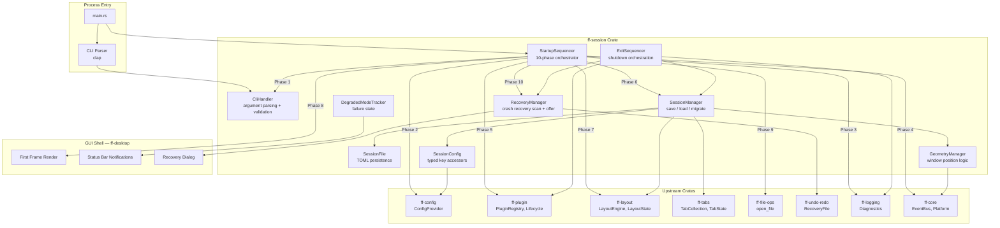

# Design Document: Startup and Session (`ff-session`)

## 1. Overview

The `ff-session` crate orchestrates the **application startup sequence**, **session state persistence and restoration**, **command-line argument processing**, **exit sequence**, and **crash recovery** for the FileForgeWorkbench platform. It is the conductor that brings all subsystems online in a deterministic order and ensures the user's workspace survives across restarts.

### Purpose

- Define and execute the 10-phase Startup_Sequence from process launch to interactive UI
- Orchestrate configuration loading, plugin initialisation, layout restoration, and file opening in correct dependency order
- Persist and restore complete Session_State: open tabs, per-tab state, window geometry, panel layout, recent files
- Process command-line arguments with proper precedence over session restore
- Execute a safe Exit_Sequence: unsaved-change prompts, session save, plugin shutdown
- Detect abnormal termination and offer crash recovery from Recovery_Files
- Guarantee graceful degradation — no single corrupt or missing file prevents startup

### Position in Architecture

```
Wave 8 — File I/O and Session

┌─────────────────────────────────────────────────────────────┐
│              Shell Layer: ff-desktop (egui)                   │
│   (renders first frame when Phase 8 signals ready)           │
├─────────────────────────────────────────────────────────────┤
│  THIS CRATE: ff-session ← Wave 8                             │
│  (startup sequence, session persistence, CLI, exit, recovery)│
├─────────────────────────────────────────────────────────────┤
│  ff-config (settings)   │  ff-plugin (lifecycle)             │
│  ff-layout (panels)     │  ff-tabs (tab collection)          │
│  ff-file-ops (open)     │  ff-undo-redo (recovery files)     │
│  ff-logging (diagnostics)│  ff-core (event bus, platform)    │
├─────────────────────────────────────────────────────────────┤
│              Foundation Layer: ff-logging                     │
└─────────────────────────────────────────────────────────────┘
```

### Design Constraints (Cross-Cutting)

- **GUI Independence (Req 2)**: The startup sequence logic lives entirely in `ff-session`; the GUI shell is notified when it may render but does not own the sequence
- **Command-Driven (Req 4)**: Session operations (`session.save`, `session.restore`, `session.clear`) are registered commands
- **Multi-Crate Workspace (Req 7)**: Crate at `crates/ff-session`
- **Error Message Standards (Req 8)**: All errors follow `[session] operation: description` format

### Upstream Dependencies

| Crate | Usage |
|-------|-------|
| `ff-config` | `ConfigProvider`, `ConfigAccess`, hot-reload subscription, session key registration |
| `ff-plugin` | `PluginRegistry`, lifecycle management (`discover` → `initialize` → `activate` → `deactivate` → `shutdown`) |
| `ff-layout` | `LayoutState`, `LayoutEngine::serialize()`, `LayoutEngine::restore()`, default layout |
| `ff-tabs` | `TabCollection`, `TabState`, tab serialisation/deserialisation contract |
| `ff-file-ops` | `open_file()` for session restore and CLI-driven open |
| `ff-undo-redo` | Recovery_File scanning and application |
| `ff-logging` | Structured diagnostics at ERROR/WARN/INFO/DEBUG levels |
| `ff-core` | `EventBus`, platform utilities, `UserDataDir` resolution |

---

## 2. Architecture

### High-Level Architecture Diagram



### Startup Sequence Flow

```
Phase 1: Parse CLI Arguments
  ├─ clap parses positional args + named flags
  ├─ Validate paths, resolve relative → absolute against Default_Root
  └─ On fatal parse error → exit(1) with usage message

Phase 2: Load Configuration
  ├─ Delegate to ff-config ConfigProvider::load()
  ├─ Layered merge: defaults → system → user → profile → project → workspace
  ├─ Collect warnings (unknown keys, invalid values) for deferred display
  └─ On total failure → proceed with defaults, log INFO

Phase 3: Initialise Logging
  ├─ Configure ff-logging with resolved log level
  ├─ Apply --log-level CLI override if present
  └─ On failure → proceed without structured logging (stderr fallback)

Phase 4: Initialise User_Data_Dir
  ├─ Resolve path (config override or platform default)
  ├─ Create directory + subdirs if absent: sessions/, recovery/, profiles/, plugins/
  └─ On permission error → Degraded_Mode (session persistence disabled)

Phase 5: Load Plugins
  ├─ Delegate to ff-plugin PluginRegistry::discover_and_load()
  ├─ For each plugin: initialize → activate (in dependency order)
  ├─ Failed plugins are skipped, logged at WARN, added to deferred notifications
  └─ On total failure → proceed with zero plugins (Degraded_Mode)

Phase 6: Load Session_State
  ├─ Read session.toml from User_Data_Dir
  ├─ Validate schema version, migrate if older
  ├─ Deserialise: TabCollection state, Recent_Files, Layout_State, Window_Geometry
  └─ On corrupt/missing → empty session, log WARN

Phase 7: Restore Layout_State
  ├─ Pass LayoutState to ff-layout LayoutEngine::restore()
  ├─ Restore Window_Geometry (with display validation/clamping)
  └─ On failure → default layout, log WARN

Phase 8: Render First Frame
  ├─ Signal GUI shell to render (workbench becomes interactive)
  ├─ Display deferred warnings in status area
  └─ Show degraded-mode indicator if any failures occurred

Phase 9: Open Files (async, post-frame)
  ├─ If CLI args provided → open each as a new tab
  ├─ Else if session.startup_file set → open startup file
  ├─ Else if session.restore_on_startup → restore tabs from Session_State
  ├─ Else → empty state (welcome tab)
  └─ Show progress indicator during restore

Phase 10: Crash Recovery (async, post-frame)
  ├─ Scan recovery/ directory for orphaned Recovery_Files
  ├─ If found → present non-modal "Restore / Discard / Later" notification
  └─ If none → no-op
```

### Exit Sequence Flow

```
1. User initiates exit (File > Exit / window close / QUIT command)
2. Check for unsaved documents:
   - None dirty → proceed to step 3
   - Dirty → present summary dialog (Save All / Discard All / Review Each / Cancel)
   - Cancel at any point → abort exit, return to normal operation
3. Persist Session_State to session.toml
4. Clean up Recovery_Files for saved/discarded documents
5. Notify plugins of shutdown (deactivate → shutdown, 3s timeout per plugin)
6. Flush and close logging subsystem
7. Close all windows, terminate process
```

---

## 3. Module Structure

```
crates/ff-session/
├── Cargo.toml
├── src/
│   ├── lib.rs              # Public API re-exports, crate documentation
│   ├── startup.rs          # StartupSequencer: 10-phase orchestration
│   ├── cli.rs              # CliHandler: argument parsing with clap, validation
│   ├── session.rs          # SessionManager: save/load/migrate session state
│   ├── session_file.rs     # SessionFile: TOML serialisation/deserialisation
│   ├── session_state.rs    # SessionState data model and schema versioning
│   ├── geometry.rs         # GeometryManager: window position persistence + display validation
│   ├── recovery.rs         # RecoveryManager: crash recovery scan and offer
│   ├── exit.rs             # ExitSequencer: shutdown orchestration
│   ├── config.rs           # SessionConfig: typed key definitions and accessors
│   ├── degraded.rs         # DegradedModeTracker: subsystem failure tracking
│   ├── error.rs            # SessionError enum
│   └── traits.rs           # Shell-provided trait abstractions (RecoveryDialog, StatusNotifier)
└── tests/
    ├── startup_tests.rs        # Startup sequence ordering and phase tests
    ├── cli_tests.rs            # CLI argument parsing and precedence tests
    ├── session_tests.rs        # Session save/load round-trip tests
    ├── session_file_tests.rs   # TOML serialisation property tests
    ├── geometry_tests.rs       # Window geometry clamping property tests
    ├── recovery_tests.rs       # Crash recovery detection tests
    ├── exit_tests.rs           # Exit sequence ordering tests
    ├── degraded_tests.rs       # Degraded mode tracking tests
    └── integration.rs          # End-to-end startup/exit flows with mock subsystems
```

---

## 4. Key Data Models and Types

### StartupSequence

```rust
/// The ordered startup phases executed from process launch to interactive UI.
///
/// Addresses: Requirement 1
#[derive(Debug, Clone, Copy, PartialEq, Eq, PartialOrd, Ord)]
#[repr(u8)]
pub enum StartupPhase {
    /// Phase 1: Parse command-line arguments.
    ParseCliArguments = 1,
    /// Phase 2: Load configuration via configuration-system.
    LoadConfiguration = 2,
    /// Phase 3: Initialise the logging subsystem.
    InitialiseLogging = 3,
    /// Phase 4: Initialise User_Data_Dir (create if absent).
    InitialiseUserDataDir = 4,
    /// Phase 5: Load and activate plugins.
    LoadPlugins = 5,
    /// Phase 6: Load Session_State from Session_File.
    LoadSessionState = 6,
    /// Phase 7: Restore Layout_State and Window_Geometry.
    RestoreLayout = 7,
    /// Phase 8: Render first interactive UI frame.
    RenderFirstFrame = 8,
    /// Phase 9: Open files (CLI args, session restore, or empty state).
    OpenFiles = 9,
    /// Phase 10: Check for crash recovery.
    CrashRecovery = 10,
}
```

```rust
/// Result of executing a single startup phase.
///
/// Addresses: Requirement 1 AC 4, AC 5
#[derive(Debug)]
pub struct PhaseResult {
    /// Which phase completed.
    pub phase: StartupPhase,
    /// Whether the phase succeeded or failed non-fatally.
    pub outcome: PhaseOutcome,
    /// Duration of this phase's execution.
    pub duration: std::time::Duration,
}

/// Outcome of a single startup phase.
#[derive(Debug, Clone, PartialEq, Eq)]
pub enum PhaseOutcome {
    /// Phase completed successfully.
    Success,
    /// Phase failed non-fatally; workbench continues in degraded mode.
    Degraded { reason: String },
    /// Phase was skipped (e.g., session restore disabled by config).
    Skipped { reason: String },
}
```

### SessionState

```rust
/// The complete serialisable snapshot of the user's workspace.
/// Persisted to session.toml and restored on next launch.
///
/// Addresses: Requirement 4
#[derive(Debug, Clone, PartialEq)]
pub struct SessionState {
    /// Schema version for forward/backward compatibility.
    pub schema_version: u32,
    /// Ordered list of open tabs with their per-tab state.
    pub tabs: Vec<TabState>,
    /// The TabId of the active (focused) tab at save time.
    pub active_tab_id: Option<String>,
    /// The layout state snapshot (panel positions, tab groups, splitters, persona).
    pub layout: Option<LayoutSnapshot>,
    /// Window geometry for primary and floating windows.
    pub windows: Vec<WindowGeometry>,
    /// Recent files list with timestamps and metadata.
    pub recent_files: Vec<RecentFileEntry>,
    /// Active configuration profile name.
    pub active_profile: Option<String>,
    /// Timestamp when this session was last saved.
    pub last_saved: Option<SystemTime>,
}

impl SessionState {
    /// Current schema version.
    pub const CURRENT_SCHEMA_VERSION: u32 = 1;

    /// Create an empty session state (first run or reset).
    pub fn empty() -> Self;

    /// Attempt to migrate from an older schema version to current.
    /// Returns Ok(migrated) or Err if migration is not possible.
    pub fn migrate(old: Self) -> Result<Self, SessionError>;
}
```

### SessionFile

```rust
/// Handles reading and writing Session_State to/from session.toml.
///
/// Addresses: Requirement 4 AC 2, AC 6, AC 7, AC 8
pub struct SessionFile {
    /// Path to the session.toml file within User_Data_Dir.
    path: PathBuf,
}

impl SessionFile {
    /// Create a SessionFile handle pointing to the given path.
    pub fn new(path: PathBuf) -> Self;

    /// Load and deserialise the session file.
    /// Returns empty session if file is absent or corrupt.
    pub fn load(&self) -> Result<SessionState, SessionError>;

    /// Serialise and write the session state to disk atomically.
    pub fn save(&self, state: &SessionState) -> Result<(), SessionError>;

    /// Check whether the session file exists.
    pub fn exists(&self) -> bool;
}
```

### WindowGeometry

```rust
/// Persisted window position, size, and display state.
///
/// Addresses: Requirement 8
#[derive(Debug, Clone, PartialEq)]
pub struct WindowGeometry {
    /// Unique identifier for this window (primary or floating panel key).
    pub window_id: String,
    /// Horizontal position in logical pixels.
    pub x: i32,
    /// Vertical position in logical pixels.
    pub y: i32,
    /// Window width in logical pixels.
    pub width: u32,
    /// Window height in logical pixels.
    pub height: u32,
    /// Whether the window is maximised.
    pub is_maximised: bool,
    /// Whether the window is in fullscreen mode.
    pub is_fullscreen: bool,
    /// Display identifier (monitor name or index) where the window was last seen.
    pub display_id: Option<String>,
}

impl WindowGeometry {
    /// The identifier used for the primary application window.
    pub const PRIMARY_WINDOW_ID: &'static str = "primary";

    /// Create geometry for the primary window with given dimensions.
    pub fn primary(x: i32, y: i32, width: u32, height: u32) -> Self;

    /// Clamp this geometry to fit within the given display bounds.
    /// Ensures the window is fully visible.
    ///
    /// Addresses: Requirement 8 AC 4, AC 5
    pub fn clamp_to_display(&mut self, display: &DisplayBounds);

    /// Check whether this geometry would be fully visible on the given display.
    pub fn is_visible_on(&self, display: &DisplayBounds) -> bool;
}

/// Describes the usable bounds of a display/monitor.
#[derive(Debug, Clone, PartialEq)]
pub struct DisplayBounds {
    pub x: i32,
    pub y: i32,
    pub width: u32,
    pub height: u32,
}
```

### TabState

```rust
/// Per-tab state persisted as part of the session.
/// This is the session-layer view of a tab — not the full runtime Tab object.
///
/// Addresses: Requirement 4 AC 1, Requirement 5
#[derive(Debug, Clone, PartialEq)]
pub struct TabState {
    /// Unique tab identifier (stable across session save/restore).
    pub tab_id: String,
    /// Resource URI of the open file (None for untitled documents).
    pub uri: Option<String>,
    /// The 1-based line number at the top of the viewport.
    pub viewport_top_line: usize,
    /// Horizontal scroll offset in columns.
    pub viewport_horizontal_offset: usize,
    /// Caret position: (line, column), 1-based.
    pub caret_position: (usize, usize),
    /// Selection ranges (empty vec = no selection).
    pub selections: Vec<SelectionRange>,
    /// Language override if the user manually set the language (None = auto-detect).
    pub language_override: Option<String>,
    /// Whether this tab was pinned.
    pub is_pinned: bool,
}

/// A serialisable selection range within a document.
#[derive(Debug, Clone, PartialEq)]
pub struct SelectionRange {
    /// Start position (line, column), 1-based.
    pub start: (usize, usize),
    /// End position (line, column), 1-based.
    pub end: (usize, usize),
}
```

### LayoutSnapshot

```rust
/// A serialisable snapshot of the layout state for session persistence.
/// This is a thin wrapper around the layout-and-docking crate's serialisation format.
///
/// Addresses: Requirement 4 AC 1 (layout portion), Requirement 5 AC 1
#[derive(Debug, Clone, PartialEq)]
pub struct LayoutSnapshot {
    /// The serialised layout data (TOML-compatible nested structure).
    pub data: toml::Value,
    /// The active persona name at save time.
    pub persona: Option<String>,
}
```

### CliArgs

```rust
/// Parsed command-line arguments for the workbench.
///
/// Addresses: Requirement 6
#[derive(Debug, Clone)]
pub struct CliArgs {
    /// Positional file paths or VFS URIs to open.
    pub source_args: Vec<String>,
    /// --new-window: force a new instance.
    pub new_window: bool,
    /// --no-session-restore: suppress session restore.
    pub no_session_restore: bool,
    /// --profile <name>: activate a specific configuration profile.
    pub profile: Option<String>,
    /// --project <path>: set the project root directory.
    pub project: Option<PathBuf>,
    /// --log-level <level>: override configured log level.
    pub log_level: Option<String>,
}

impl CliArgs {
    /// Parse command-line arguments from the process environment.
    pub fn parse() -> Result<Self, SessionError>;

    /// Whether any source arguments were provided.
    pub fn has_source_args(&self) -> bool;

    /// Resolve relative source args against the given working directory.
    pub fn resolve_source_args(&mut self, working_dir: &Path);
}
```

### RecentFileEntry

```rust
/// An entry in the recent files list persisted with the session.
///
/// Addresses: Requirement 4 AC 4, AC 5
#[derive(Debug, Clone, PartialEq)]
pub struct RecentFileEntry {
    /// The resource URI.
    pub uri: String,
    /// Display name (filename portion).
    pub display_name: String,
    /// Last access timestamp (ISO 8601 string for TOML serialisation).
    pub last_accessed: String,
    /// Last known viewport top line (for restoring position on reopen).
    pub last_viewport_top_line: Option<usize>,
    /// Whether the file was confirmed to exist at last session load.
    pub available: bool,
}
```

### DegradedSubsystem

```rust
/// Tracks which subsystems failed during startup for degraded-mode reporting.
///
/// Addresses: Requirement 11
#[derive(Debug, Clone, PartialEq, Eq)]
pub struct DegradedSubsystem {
    /// Human-readable subsystem name (e.g., "Session persistence").
    pub name: String,
    /// The startup phase where failure occurred.
    pub phase: StartupPhase,
    /// Description of the failure.
    pub reason: String,
    /// Whether the issue has been resolved at runtime.
    pub resolved: bool,
}
```

---

## 5. Public API Surface

### Startup Orchestration

```rust
/// The main entry point for the startup sequence.
/// Executes all 10 phases in order, collecting results.
///
/// Addresses: Requirement 1
pub struct StartupSequencer {
    config_provider: Arc<dyn ConfigProvider>,
    plugin_registry: Arc<PluginRegistry>,
    layout_engine: Arc<LayoutEngine>,
    shell_notifier: Arc<dyn ShellNotifier>,
}

impl StartupSequencer {
    /// Create a new sequencer with the required upstream services.
    pub fn new(
        config_provider: Arc<dyn ConfigProvider>,
        plugin_registry: Arc<PluginRegistry>,
        layout_engine: Arc<LayoutEngine>,
        shell_notifier: Arc<dyn ShellNotifier>,
    ) -> Self;

    /// Execute the full startup sequence.
    /// Returns the collected results for all phases.
    ///
    /// Phases 1–7 complete before Phase 8 (first frame).
    /// Phases 9–10 execute after the first frame is rendered.
    pub async fn execute(&self) -> StartupResult;
}

/// Aggregated result of the full startup sequence.
#[derive(Debug)]
pub struct StartupResult {
    /// Results for each phase that was executed.
    pub phases: Vec<PhaseResult>,
    /// The parsed CLI arguments.
    pub cli_args: CliArgs,
    /// The loaded session state (may be empty if load failed).
    pub session_state: SessionState,
    /// Subsystems that entered degraded mode.
    pub degraded: Vec<DegradedSubsystem>,
    /// Total time from start to Phase 8 (first frame).
    pub time_to_interactive: std::time::Duration,
}
```

### Session Management

```rust
/// Manages session state persistence and restoration.
///
/// Addresses: Requirements 4, 5
pub struct SessionManager {
    session_file: SessionFile,
    config: Arc<dyn ConfigAccess>,
    degraded_tracker: Arc<DegradedModeTracker>,
}

impl SessionManager {
    /// Create a new session manager.
    pub fn new(
        user_data_dir: &Path,
        config: Arc<dyn ConfigAccess>,
        degraded_tracker: Arc<DegradedModeTracker>,
    ) -> Self;

    /// Load session state from the session file.
    /// Returns empty state on missing or corrupt file.
    pub fn load(&self) -> SessionState;

    /// Save the current session state to the session file.
    pub fn save(&self, state: &SessionState) -> Result<(), SessionError>;

    /// Determine what files to open based on CLI args, config, and session state.
    ///
    /// Addresses: Requirement 5, Requirement 6
    pub fn resolve_file_open_targets(
        &self,
        cli_args: &CliArgs,
        session_state: &SessionState,
    ) -> FileOpenTargets;

    /// Start the periodic auto-save timer.
    /// Interval is controlled by `session.auto_save_interval_seconds`.
    pub fn start_auto_save(&self, state_provider: Arc<dyn SessionStateProvider>);

    /// Stop the periodic auto-save timer.
    pub fn stop_auto_save(&self);
}
```

/// Describes what files should be opened after Phase 8.
#[derive(Debug, Clone)]
pub enum FileOpenTargets {
    /// Open specific files from CLI arguments.
    CliArgs(Vec<String>),
    /// Open the configured startup file.
    StartupFile(String),
    /// Restore tabs from session state.
    SessionRestore(Vec<TabState>),
    /// No files to open — show empty/welcome state.
    Empty,
}

/// Trait for providing current session state to the auto-save timer.
pub trait SessionStateProvider: Send + Sync {
    /// Capture the current workspace state as a SessionState snapshot.
    fn capture_state(&self) -> SessionState;
}
```

### Geometry Management

```rust
/// Manages window geometry persistence and display validation.
///
/// Addresses: Requirement 8
pub struct GeometryManager;

impl GeometryManager {
    /// Restore window geometry from session state, validating against
    /// currently connected displays.
    ///
    /// If the target display is disconnected, repositions to primary display.
    /// If the window would be off-screen, clamps to fit.
    ///
    /// Addresses: Requirement 8 AC 3, AC 4, AC 5
    pub fn restore_geometry(
        geometry: &WindowGeometry,
        available_displays: &[DisplayBounds],
    ) -> WindowGeometry;

    /// Capture current window geometry for persistence.
    pub fn capture_geometry(
        window_id: &str,
        platform: &dyn PlatformWindowInfo,
    ) -> WindowGeometry;
}
```

### Recovery Management

```rust
/// Manages crash recovery detection and user interaction.
///
/// Addresses: Requirement 10
pub struct RecoveryManager {
    recovery_dir: PathBuf,
    config: Arc<dyn ConfigAccess>,
}

impl RecoveryManager {
    /// Create a recovery manager for the given recovery directory.
    pub fn new(recovery_dir: PathBuf, config: Arc<dyn ConfigAccess>) -> Self;

    /// Scan for orphaned recovery files.
    /// Returns the list of recoverable documents.
    pub fn scan(&self) -> Vec<RecoverableDocument>;

    /// Apply recovery for the specified documents.
    /// Opens each file and applies the recovered undo state.
    ///
    /// Addresses: Requirement 10 AC 3
    pub async fn restore(
        &self,
        documents: &[RecoverableDocument],
        file_ops: &dyn FileOpener,
    ) -> Vec<RecoveryResult>;

    /// Discard all recovery files (user chose "Discard").
    ///
    /// Addresses: Requirement 10 AC 4
    pub fn discard_all(&self) -> Result<(), SessionError>;

    /// Clean up recovery files for documents that were saved/discarded during exit.
    pub fn cleanup_for_documents(&self, uris: &[String]) -> Result<(), SessionError>;
}

/// A document that has a recovery file available.
#[derive(Debug, Clone)]
pub struct RecoverableDocument {
    /// The resource URI of the original file.
    pub uri: String,
    /// Display name for the recovery notification.
    pub display_name: String,
    /// Path to the recovery file.
    pub recovery_file_path: PathBuf,
    /// Whether the original file still exists on disk.
    pub source_exists: bool,
    /// Whether the recovery file is valid (parseable, correct schema).
    pub is_valid: bool,
}

/// Result of attempting to restore a single document.
#[derive(Debug)]
pub enum RecoveryResult {
    /// Recovery succeeded; document is open in modified state.
    Restored { uri: String },
    /// Source file not found; recovery skipped.
    SourceMissing { uri: String },
    /// Recovery file is corrupt; recovery skipped.
    Corrupt { uri: String, reason: String },
    /// Recovery application failed for other reasons.
    Failed { uri: String, error: SessionError },
}
```

### Exit Orchestration

```rust
/// Orchestrates the application shutdown sequence.
///
/// Addresses: Requirement 9
pub struct ExitSequencer {
    session_manager: Arc<SessionManager>,
    recovery_manager: Arc<RecoveryManager>,
    plugin_registry: Arc<PluginRegistry>,
    dialog_provider: Arc<dyn ExitDialogProvider>,
}

impl ExitSequencer {
    /// Create a new exit sequencer.
    pub fn new(
        session_manager: Arc<SessionManager>,
        recovery_manager: Arc<RecoveryManager>,
        plugin_registry: Arc<PluginRegistry>,
        dialog_provider: Arc<dyn ExitDialogProvider>,
    ) -> Self;

    /// Execute the exit sequence. Returns Ok(true) if shutdown should proceed,
    /// Ok(false) if the user cancelled.
    ///
    /// Addresses: Requirement 9 AC 1–8
    pub async fn execute(
        &self,
        state_provider: &dyn SessionStateProvider,
        dirty_documents: &[DirtyDocument],
    ) -> Result<bool, SessionError>;
}

/// A document with unsaved modifications, presented during exit.
#[derive(Debug, Clone)]
pub struct DirtyDocument {
    /// Display name for the dialog.
    pub display_name: String,
    /// Resource URI (None for untitled).
    pub uri: Option<String>,
    /// Tab identifier.
    pub tab_id: String,
}

/// User's response to the exit unsaved-changes summary dialog.
///
/// Addresses: Requirement 9 AC 2
#[derive(Debug, Clone, Copy, PartialEq, Eq)]
pub enum ExitAction {
    /// Save all modified documents and proceed to shutdown.
    SaveAll,
    /// Discard all unsaved changes and proceed to shutdown.
    DiscardAll,
    /// Review each modified document individually.
    ReviewEach,
    /// Cancel the exit; return to normal operation.
    Cancel,
}
```

### Shell Trait Abstractions

```rust
/// Trait for notifying the GUI shell about startup phase transitions.
///
/// The shell uses this to know when to render and what deferred
/// notifications to display.
pub trait ShellNotifier: Send + Sync {
    /// Signal that pre-render phases are complete; shell may render first frame.
    fn signal_ready_to_render(&self);

    /// Queue a deferred warning for display in the status area after Phase 8.
    fn queue_deferred_warning(&self, message: String);

    /// Set the degraded-mode indicator visibility.
    fn set_degraded_indicator(&self, visible: bool, summary: String);

    /// Show session restore progress (tabs restored / total).
    fn show_restore_progress(&self, restored: usize, total: usize);
}

/// Trait for exit dialog interactions (GUI shell provides implementation).
pub trait ExitDialogProvider: Send + Sync {
    /// Show the exit summary dialog for dirty documents.
    fn show_exit_summary(
        &self,
        dirty_documents: &[DirtyDocument],
    ) -> ExitAction;

    /// Show per-document save/discard/cancel dialog during "Review Each".
    fn show_per_document_dialog(
        &self,
        document: &DirtyDocument,
    ) -> UnsavedChangesAction;
}

/// Unsaved changes action for per-document review during exit.
#[derive(Debug, Clone, Copy, PartialEq, Eq)]
pub enum UnsavedChangesAction {
    Save,
    Discard,
    Cancel,
}

/// Trait for recovery notification dialog.
pub trait RecoveryDialogProvider: Send + Sync {
    /// Show the recovery offer notification.
    /// Returns the user's choice.
    fn show_recovery_offer(
        &self,
        recoverable: &[RecoverableDocument],
    ) -> RecoveryChoice;
}

/// User's response to the crash recovery offer.
///
/// Addresses: Requirement 10 AC 2
#[derive(Debug, Clone, Copy, PartialEq, Eq)]
pub enum RecoveryChoice {
    /// Restore all recoverable documents.
    Restore,
    /// Discard all recovery files.
    Discard,
    /// Defer recovery to next startup.
    Later,
}

/// Trait for platform-level window information queries.
pub trait PlatformWindowInfo: Send + Sync {
    /// Get the current position and size of a window by ID.
    fn get_window_geometry(&self, window_id: &str) -> Option<WindowGeometry>;

    /// Get the bounds of all connected displays.
    fn get_available_displays(&self) -> Vec<DisplayBounds>;
}

/// Trait for opening files during recovery (delegates to ff-file-ops).
pub trait FileOpener: Send + Sync {
    /// Open a file by URI and return success/failure.
    fn open_file(&self, uri: &str) -> Result<(), SessionError>;
}
```

### Command Registration

```rust
/// Register session-related commands with the command framework.
///
/// Commands: session.save, session.restore, session.clear, session.recent_clear
pub fn register_session_commands(
    registry: &CommandRegistry,
    session_manager: Arc<SessionManager>,
) -> Result<(), SessionError>;
```

### Degraded Mode Tracking

```rust
/// Tracks subsystem failures for degraded-mode reporting.
///
/// Addresses: Requirement 11
pub struct DegradedModeTracker {
    subsystems: RwLock<Vec<DegradedSubsystem>>,
}

impl DegradedModeTracker {
    /// Create a new tracker with no failures.
    pub fn new() -> Self;

    /// Record a subsystem failure.
    pub fn record_failure(&self, name: &str, phase: StartupPhase, reason: &str);

    /// Mark a subsystem as resolved (issue cleared at runtime).
    ///
    /// Addresses: Requirement 11 AC 6
    pub fn mark_resolved(&self, name: &str);

    /// Get all currently degraded subsystems (unresolved).
    pub fn active_failures(&self) -> Vec<DegradedSubsystem>;

    /// Whether any subsystem is in degraded mode.
    pub fn is_degraded(&self) -> bool;

    /// Get a human-readable summary for the status bar indicator.
    pub fn summary(&self) -> String;
}
```

---

## 6. Error Types

```rust
/// Error type for all startup and session failures.
///
/// All variants include sufficient context for diagnostics.
/// Display format: `[session] operation: description`
#[derive(Debug, thiserror::Error)]
#[non_exhaustive]
pub enum SessionError {
    /// CLI argument parsing failed (fatal — prevents startup).
    #[error("[session] cli: {0}")]
    CliParseFailed(String),

    /// User_Data_Dir could not be created or is not writable.
    #[error("[session] user-data-dir: {reason} — path: {path}")]
    UserDataDirError {
        path: String,
        reason: String,
    },

    /// Session file could not be read (corrupt, permission, I/O error).
    #[error("[session] load: failed to read session file — {reason}")]
    SessionFileReadError {
        reason: String,
    },

    /// Session file could not be written (permission, disk full, I/O error).
    #[error("[session] save: failed to write session file — {reason}")]
    SessionFileWriteError {
        reason: String,
    },

    /// Session file has an unrecognised or too-new schema version.
    #[error("[session] migrate: unsupported schema version {version} (current: {current})")]
    UnsupportedSchemaVersion {
        version: u32,
        current: u32,
    },

    /// Session file TOML is syntactically invalid.
    #[error("[session] parse: invalid TOML in session file — {reason}")]
    SessionParseError {
        reason: String,
    },

    /// Recovery file is corrupt or cannot be applied.
    #[error("[session] recovery: corrupt recovery file for {uri} — {reason}")]
    RecoveryFileCorrupt {
        uri: String,
        reason: String,
    },

    /// Recovery directory scan failed (permission or I/O error).
    #[error("[session] recovery: failed to scan recovery directory — {reason}")]
    RecoveryScanError {
        reason: String,
    },

    /// Plugin shutdown exceeded timeout.
    #[error("[session] exit: plugin '{plugin_name}' shutdown timed out after {timeout_secs}s")]
    PluginShutdownTimeout {
        plugin_name: String,
        timeout_secs: u64,
    },

    /// Window geometry restoration failed (display info unavailable).
    #[error("[session] geometry: failed to restore window geometry — {reason}")]
    GeometryRestoreError {
        reason: String,
    },

    /// Configuration key access error.
    #[error("[session] config: error accessing '{key}' — {reason}")]
    ConfigAccessError {
        key: String,
        reason: String,
    },

    /// Generic I/O error with session context.
    #[error("[session] {operation}: I/O error — {source}")]
    Io {
        operation: String,
        #[source]
        source: std::io::Error,
    },
}
```

---

## 7. Integration Points

### Integration with `ff-core` (platform-core)

| Operation | API Used | Notes |
|-----------|----------|-------|
| User_Data_Dir resolution | `Platform::user_data_dir()` | Platform-specific default path |
| Working directory | `Platform::current_dir()` | Default_Root for CLI path resolution |
| Event emission | `EventBus::emit()` | Startup/exit lifecycle events |
| Display enumeration | `Platform::available_displays()` | For geometry clamping |

### Integration with `ff-config` (configuration-system)

| Operation | API Used | Notes |
|-----------|----------|-------|
| Load configuration (Phase 2) | `ConfigProvider::load()` | Layered merge, returns warnings |
| Register session keys | `ConfigProvider::register_schema()` | `[session]` namespace keys |
| Read session config | `ConfigAccess::get_bool()`, `get_int()`, `get_string()` | Typed access |
| Hot-reload subscription | `ConfigAccess::subscribe("session.*")` | Apply changes without restart |
| Profile activation | `ConfigProvider::activate_profile(name)` | CLI `--profile` override |

**Registered Configuration Keys:**

| Key | Type | Default | Range | Purpose |
|-----|------|---------|-------|---------|
| `session.user_data_dir` | `String` | platform default | — | Custom User_Data_Dir path |
| `session.max_recent_files` | `u32` | `50` | 1–500 | Recent files list capacity |
| `session.restore_on_startup` | `bool` | `true` | — | Enable/disable session restore |
| `session.restore_tabs_on_startup` | `bool` | `true` | — | Restore tabs (vs. layout only) |
| `session.startup_file` | `String` | `""` | — | Auto-open file on every launch |
| `session.save_window_geometry` | `bool` | `true` | — | Persist/restore window geometry |
| `session.crash_recovery_enabled` | `bool` | `true` | — | Enable crash recovery scanning |
| `session.auto_save_interval_seconds` | `u32` | `300` | 30–3600 | Periodic session save interval |

### Integration with `ff-plugin` (plugin-architecture)

| Operation | API Used | Notes |
|-----------|----------|-------|
| Plugin discovery (Phase 5) | `PluginRegistry::discover()` | Scan plugin directories |
| Plugin initialisation | `PluginRegistry::initialize_all()` | In dependency order |
| Plugin activation | `PluginRegistry::activate_all()` | After initialize |
| Plugin deactivation (exit) | `PluginRegistry::deactivate_all()` | Reverse order |
| Plugin shutdown (exit) | `PluginRegistry::shutdown_all(timeout)` | 3s per-plugin timeout |
| Failure reporting | `PluginRegistry::failed_plugins()` | For degraded-mode tracking |

### Integration with `ff-layout` (layout-and-docking)

| Operation | API Used | Notes |
|-----------|----------|-------|
| Layout restore (Phase 7) | `LayoutEngine::restore(LayoutSnapshot)` | From session state |
| Layout capture (save) | `LayoutEngine::serialize()` → `LayoutSnapshot` | For session persistence |
| Default layout fallback | `LayoutEngine::apply_default_layout()` | On restore failure |
| Persona name | `LayoutEngine::active_persona()` | Persisted in session |

### Integration with `ff-tabs` (multi-tab-editor)

| Operation | API Used | Notes |
|-----------|----------|-------|
| Tab state capture | `TabCollection::serialize_state()` → `Vec<TabState>` | For session save |
| Tab state restore | `TabCollection::restore_state(Vec<TabState>)` | During session restore |
| Active tab query | `TabCollection::active_tab_id()` | Persisted in session |
| Tab open during restore | `TabCollection::open_tab(TabOpenOptions)` | Per restored tab |

### Integration with `ff-file-ops` (file-operations)

| Operation | API Used | Notes |
|-----------|----------|-------|
| Open files (Phase 9) | `open_file(FileOpenOptions)` | For CLI args and session restore |
| File existence check | Delegates to VFS via `ff-file-ops` context | Tab restore validation |
| Unsaved-changes (exit) | `guard_unsaved_changes_batch()` | Exit sequence integration |

### Integration with `ff-undo-redo` (undo-redo-transactions)

| Operation | API Used | Notes |
|-----------|----------|-------|
| Recovery file scan | Scan `recovery/` directory for `.recovery` files | Phase 10 |
| Recovery application | `UndoManager::apply_recovery(recovery_data)` | Restores undo state |
| Recovery cleanup (exit) | Delete recovery files for saved documents | Exit step 2 |

### Integration with `ff-logging`

| Operation | API Used | Notes |
|-----------|----------|-------|
| Initialise (Phase 3) | `LoggingConfig::init(settings)` | From resolved configuration |
| Phase logging | `info!()`, `warn!()`, `error!()` | Per-phase status and failures |
| Flush (exit) | `LoggingConfig::flush_and_close()` | Exit step 4 |
| Log level override | `LoggingConfig::set_level(level)` | CLI `--log-level` override |

---

## 8. Correctness Properties

These properties are suitable for property-based testing with the `proptest` crate.

### Property 1: Startup Phase Ordering Is Strictly Sequential

**Statement**: For any execution of the startup sequence, phase N always completes (success, degraded, or skipped) before phase N+1 begins. Phases 1–7 all complete before Phase 8 signals the shell. Phases 9–10 execute only after Phase 8.

**Validates**: Requirement 1 AC 1, AC 2, AC 3

```rust
// proptest strategy: generate sequences of phase outcomes (Success, Degraded, Skipped)
// assertion: for all i < j, phase_results[i].phase < phase_results[j].phase
// assertion: all phases 1..=7 complete before phase 8 start timestamp
// assertion: phases 9, 10 start only after phase 8 completes
```

### Property 2: Graceful Degradation — No Phase Failure Prevents Startup

**Statement**: For any combination of phase outcomes where Phase 1 succeeds (valid CLI args), the startup sequence always reaches Phase 8 (first frame rendered). A failure in any phase 2–7 results in `PhaseOutcome::Degraded` for that phase but does not abort subsequent phases.

**Validates**: Requirement 1 AC 4, AC 5; Requirement 11 AC 1

```rust
// proptest strategy: generate (phase, outcome) pairs for phases 2..=7
//   where each outcome is Success or Degraded(reason)
// assertion: startup always reaches Phase 8
// assertion: each Degraded phase is recorded in DegradedModeTracker
// assertion: DegradedModeTracker.is_degraded() == true iff any phase is Degraded
```

### Property 3: Session State Round-Trip Serialisation

**Statement**: For any valid `SessionState`, serialising to TOML and deserialising back produces an identical `SessionState`. The schema version is preserved. No data is lost or corrupted in the round-trip.

**Validates**: Requirement 4 AC 1, AC 2, AC 6

```rust
// proptest strategy: generate arbitrary SessionState with:
//   - 0..30 tabs with random URIs and viewport positions
//   - 0..100 recent file entries
//   - random window geometries
//   - random layout snapshot data
// assertion: deserialize(serialize(state)) == state
```

### Property 4: Window Geometry Clamping Ensures Visibility

**Statement**: For any `WindowGeometry` and any set of `DisplayBounds`, after `clamp_to_display`, the resulting geometry is fully contained within at least one display's bounds. The window is never positioned partially or fully off-screen.

**Validates**: Requirement 8 AC 4, AC 5

```rust
// proptest strategy: generate random WindowGeometry (including extreme values)
//   and random DisplayBounds (at least one display)
// action: GeometryManager::restore_geometry(geometry, displays)
// assertion: result window rect intersects available display area completely
// assertion: result.width <= display.width AND result.height <= display.height
```

### Property 5: CLI Arguments Override Session Restore

**Statement**: When CLI source arguments are provided, the file-open targets are always `FileOpenTargets::CliArgs` regardless of `session.restore_on_startup` configuration or session state content. CLI always takes precedence over session tab restore.

**Validates**: Requirement 5 AC 6; Requirement 6 AC 4, AC 8

```rust
// proptest strategy: generate CliArgs with 1..10 source_args,
//   random session state (with tabs), and random config values
// assertion: resolve_file_open_targets() == FileOpenTargets::CliArgs(...)
// assertion: the CLI args in the result match the input args exactly
```

### Property 6: Recent Files List Bounded by Configuration

**Statement**: For any sequence of operations that add entries to the `RecentFileEntry` list within `SessionState`, the list length never exceeds the configured `session.max_recent_files` value. Oldest entries are evicted when the limit is reached.

**Validates**: Requirement 4 AC 4; Requirement 12 AC 3

```rust
// proptest strategy: generate max_recent_files in 1..500,
//   then a sequence of 0..1000 file open events (URIs)
// assertion: after every event, recent_files.len() <= max_recent_files
// assertion: most recently opened URI is always at index 0
```

### Property 7: Corrupt Session File Never Prevents Startup

**Statement**: For any byte sequence (including valid TOML, invalid TOML, empty, binary garbage) written as the session file, loading the session file either returns a valid `SessionState` or returns an empty `SessionState` — it never panics or propagates an unrecoverable error.

**Validates**: Requirement 4 AC 7, AC 8; Requirement 11 AC 1

```rust
// proptest strategy: generate arbitrary byte vectors (0..10KB)
// action: write bytes as session.toml, call SessionFile::load()
// assertion: result is always Ok(SessionState) (possibly empty)
// assertion: never panics
// assertion: if input was valid current-schema TOML, fields are preserved
```

### Property 8: Exit Sequence Persists Session Before Shutdown

**Statement**: When the exit sequence completes successfully (user did not cancel), the session file on disk contains a `SessionState` that was captured after all save/discard decisions were finalised. The session file always reflects the final workspace state at shutdown time.

**Validates**: Requirement 9 AC 7 (step 1)

```rust
// proptest strategy: generate session state + exit action (SaveAll, DiscardAll)
// action: execute exit sequence to completion
// assertion: session file on disk is readable and matches captured state
// assertion: session file last_saved timestamp is >= exit start time
```

### Property 9: File Open Target Resolution Follows Precedence

**Statement**: The `resolve_file_open_targets` function follows a strict precedence order:
1. CLI source args (if present) → `CliArgs`
2. `session.startup_file` (if set and no CLI args) → `StartupFile`
3. Session tab restore (if `restore_on_startup` and `restore_tabs_on_startup` both true) → `SessionRestore`
4. Empty state → `Empty`

No lower-precedence source is ever selected when a higher-precedence source is available.

**Validates**: Requirement 5 AC 1, AC 6, AC 7; Requirement 6 AC 8, AC 9

```rust
// proptest strategy: generate all combinations of:
//   - cli_args.source_args: empty or non-empty
//   - session.startup_file: None or Some(path)
//   - session.restore_on_startup: true/false
//   - session.restore_tabs_on_startup: true/false
//   - session_state.tabs: empty or non-empty
// assertion: result matches the highest-precedence rule that applies
```

### Property 10: Degraded Mode Tracker Consistency

**Statement**: The `DegradedModeTracker` reports `is_degraded() == true` if and only if at least one recorded subsystem has `resolved == false`. After `mark_resolved(name)` is called for all degraded subsystems, `is_degraded()` returns `false`.

**Validates**: Requirement 11 AC 2, AC 6

```rust
// proptest strategy: generate sequence of record_failure and mark_resolved calls
// assertion: is_degraded() == active_failures().is_not_empty()
// assertion: after mark_resolved for all recorded names, is_degraded() == false
// assertion: active_failures() never contains entries with resolved == true
```

---

## 9. Primary Option Menu and Tabbed Window Container (Requirement 14)

### Overview

The workbench operates as a **container of detachable tabbed windows**. Each tab is an independent work context — a Primary Option Menu, a file editor, a utility panel, etc. On first launch the container holds a single POM tab. On subsequent launches it restores the exact session state from last close.

A Primary Option Menu tab is a special tab type that renders the ISPF-style home screen. When the user enters a command in its `Command ===>` field that changes context (e.g., option `1` to open a file), the tab's content transforms to the new context in-place — it does not open a new tab unless the user explicitly requests one.

### Design Decisions

- **Tab types**: The `Tab` struct gains a `TabKind` enum: `PrimaryOptionMenu` | `FileEditor` | `Untitled`. The central panel dispatch switches on `active_tab().kind`.
- **Menu bar alignment (Phase AD)**: The menu bar top-level entries mirror the 9-option POM: `Settings`, `File Catalogs`, `Files`, `Utilities`, `Compilers`, `Lua`, `Terminals`, `Databases`, `Plugins`, `Help`. The `Plugins` menu was added in Phase AD. `File Catalogs` was added to mirror POM option 1.
- **Session restore**: On startup, if a saved session exists, restore it exactly. If no session, open one `PrimaryOptionMenu` tab. The `show_pom` field is removed — POM presence is determined by session state.
- **Tab bar context menu (empty space)**: Right-clicking the tab bar background (not a tab header) shows `New` (new POM tab) and `New File` (new untitled editor tab).
- **Tab header context menu**: Right-clicking any tab header shows the full 27-item context menu (Req 14.15). File-specific items are disabled on POM tabs.
- **Command routing**: `START` → new POM tab. `CLOSE` → close current tab. `EXIT`/`=X`/Ctrl+X → application exit. Option numbers (`1`–6) → transform current POM tab to the selected feature.
- **Tab detachment**: `Move to Other View` in the context menu detaches the tab into a floating OS window. This is deferred to Phase Z; the menu item is present but disabled until implemented.
- **Folder-open actions**: `Open Containing Folder in Explorer/CMD/PowerShell/Terminal` use `std::process::Command` to spawn the platform tool. Disabled on POM and untitled tabs.
- **Read-Only flag**: Stored as `is_read_only: bool` on the `Tab` struct. Prevents text input in the editor panel.
- **Rename**: Renames the file on disk via `ff-file-ops` and updates `tab.title` and `tab.path`.
- **Reload**: Reloads file content from disk via `ff-file-ops`. Prompts if modified.
- **Clone**: Creates a new tab with the same `TabKind` and content. For file tabs, opens the same path as a new tab (duplicate detection bypassed for explicit clone).

### Module Structure

```
crates/ff-desktop/src/
├── primary_option_menu.rs   ← unchanged (pure render fn)
├── tab_manager.rs           ← MODIFIED: Tab gains TabKind; insert_pom_tab(), new_untitled()
└── shell.rs
    ├── render_tab_bar()         ← MODIFIED: tab bar context menu (empty space right-click)
    ├── render_tab_header_context_menu()  ← NEW: 27-item context menu per tab
    ├── render_central_panel()   ← MODIFIED: dispatch on active_tab().kind
    ├── handle_command()         ← MODIFIED: START, CLOSE, option numbers transform tab
    └── render_pom_window()      ← REMOVED
```

### Data Flow

```
WorkbenchShell::update()
  ├─ startup: if no session → insert POM tab; else restore session
  ├─ render_tab_bar()          ← tab headers + empty-space context menu
  └─ render_central_panel()
        ├─ TabKind::PrimaryOptionMenu → primary_option_menu::render(ui)
        ├─ TabKind::FileEditor        → editor_panel::render(ui, tab, runtime)
        └─ TabKind::Untitled          → editor_panel::render(ui, tab, runtime)
```

### Command Routing Table

| Command | Action |
|---------|--------|
| `START` | Open new POM tab |
| `CLOSE` | Close current tab |
| `EXIT`, `=X`, Ctrl+X | Application exit |
| `0`–`8` (on POM tab) | Transform current tab to selected feature |
| `EDIT <path>` | Open file in new editor tab |
| `POM` | Open new POM tab (alias for START) |
| `=2` | Close current context; switch current tab to File Explorer (FileExplorerPanel) |
| `=FILES` | Close current context; switch current tab to File Explorer (FileExplorerPanel) |
| `FILES` | Open a NEW tab in the File Explorer context (current tab unchanged) |

---

### File Explorer Panel (Requirement 19)

#### Overview

POM option 2 opens a **File Explorer Panel** — a tree-view panel that shows all open/mounted catalogs as top-level nodes with their files listed beneath them. This is distinct from the Files Panel (option 1, `FilesPanel` / `[FILES]`) which is the catalog management UI.

The File Explorer Panel reuses the catalog tree data from the `CatalogRegistry` (already implemented in `catalog_registry.rs`) and renders it as a simple expandable tree. It does not duplicate the full `file-tree-panel` crate implementation — it is a lightweight shell-level panel that reads from the existing catalog registry.

#### Design Decisions

- **New `TabKind` variant**: `FileExplorerPanel` is added to the `TabKind` enum alongside `PrimaryOptionMenu`, `FileEditor`, `Untitled`, `FilesPanel`, `SettingsPanel`.
- **Tab title**: `[FILES]` — same as `FilesPanel`. The tab bar title distinguishes the two by kind, not by title string. *(Note: if both are open simultaneously, both show `[FILES]` — this is acceptable ISPF behaviour.)*
- **`=2` / `=FILES` routing**: These are **context-switch** commands. They transform the current tab in-place to `FileExplorerPanel` (same as how option numbers transform a POM tab). The `=` prefix signals "close current context and switch".
- **`FILES` routing** (no `=` prefix): Opens a **new** tab with `FileExplorerPanel` kind. The current tab is unchanged.
- **Tree content**: The panel renders a tree with one top-level node per catalog in the `CatalogRegistry`, grouped under section headers (Mainframe, POSIX, Native). Each catalog node is expandable to show its files/datasets via the VFS.
- **Empty state**: When no catalogs are registered, a placeholder message is shown.
- **File open**: Double-clicking a file/member node dispatches `file.open` with the VFS URI.
- **F3/END**: Returns the tab to POM view (same as `FilesPanel`).
- **Session persistence**: `FileExplorerPanel` tab kind is persisted and restored.

#### Module Structure

```
crates/ff-desktop/src/
├── file_explorer_panel.rs   ← NEW: FileExplorerPanelState, render()
├── tab_manager.rs           ← MODIFIED: add FileExplorerPanel to TabKind
└── shell.rs
    ├── handle_command()     ← MODIFIED: route =2, =FILES, FILES
    ├── render_central_panel() ← MODIFIED: dispatch FileExplorerPanel
    └── session_manager.rs   ← MODIFIED: persist/restore FileExplorerPanel kind
```

#### Command Dispatch Logic

```
handle_command(cmd):
  "=2" | "=FILES" (case-insensitive):
    → transform_active_tab(TabKind::FileExplorerPanel, "[FILES]")
    // closes current context, switches in-place

  "FILES" (no = prefix, case-insensitive):
    → open_new_tab(TabKind::FileExplorerPanel, "[FILES]")
    // opens new tab, current tab unchanged

  "2" (on POM tab):
    → transform_active_pom_tab(TabKind::FileExplorerPanel, "[FILES]")
    // same as other POM option numbers
```

#### Tree Structure

```
[FILES] tab
└── Tree view
    ├── ▶ Mainframe Catalogs
    │   ├── ▶ MY.CATALOG
    │   │   ├── ▶ MY.DATASET.PS  (sequential)
    │   │   └── ▶ MY.PDS         (partitioned)
    │   │       ├── MEMBER1
    │   │       └── MEMBER2
    │   └── (No catalogs defined)  ← when empty
    ├── ▶ POSIX Catalogs
    │   └── ▶ my-posix-catalog
    │       ├── src/
    │       └── README.md
    └── ▶ Native Catalogs (Windows)
        └── ▶ my-local-catalog
            ├── Documents/
            └── file.txt
```

### Tab Context Menu Exit Item (Requirement 14.38)

No design changes required. The "Exit" item in the tab header context menu routes through the existing `file.exit` command dispatch path (same as `EXIT` in the command field and `File > Exit` in the menu bar). The item is added to the universal section of the context menu (Req 14.15a) and is therefore present on all tab kinds.

### POM Option Buttons (Requirements 14.39, 14.40)

The `primary_option_menu::render()` function currently renders each option row as plain labels. To satisfy Req 14.39 and 14.40, the render function must return an `Option<PomAction>` indicating which option (if any) was activated this frame.

- Each numbered option row (0–8) is rendered with `ui.button(...)` instead of `ui.label(...)`. The button is styled to look like a hyperlink (no border, coloured text) using `egui::Button` with no fill and accent-coloured text.
- The "Enter X to close application" line is rendered as a similar button.
- The function signature changes from `fn render(ui: &mut egui::Ui)` to `fn render(ui: &mut egui::Ui) -> Option<PomAction>`.
- `PomAction` is a new `pub enum` with variants `Navigate(u8)` (for options 0–8) and `Exit`.
- The call site in `shell.rs` `render_central_panel()` matches on the returned `Option<PomAction>` and calls `self.handle_command("0")` … `self.handle_command("8")` or triggers exit accordingly — reusing the existing command routing without duplication.

No new crate dependencies are required.


All keys live under the `[session]` namespace in the configuration system:

```toml
[session]
user_data_dir = ""                    # Custom path (empty = platform default)
max_recent_files = 50                 # 1–500
restore_on_startup = true             # Enable session tab restore
restore_tabs_on_startup = true        # Restore tabs (vs layout only)
startup_file = ""                     # Auto-open file (empty = disabled)
save_window_geometry = true           # Persist window position/size
crash_recovery_enabled = true         # Enable crash recovery scanning
auto_save_interval_seconds = 300      # 30–3600 (periodic session save)
```

## Appendix B: Session File Schema (session.toml)

```toml
schema_version = 1
last_saved = "2024-01-15T10:30:00Z"
active_tab_id = "tab-3"
active_profile = "mainframe"

[[tabs]]
tab_id = "tab-1"
uri = "vfs://local/home/user/project/main.rs"
viewport_top_line = 42
viewport_horizontal_offset = 0
caret_position = [55, 12]
selections = []
language_override = ""
is_pinned = false

[[tabs]]
tab_id = "tab-2"
uri = "vfs://local/home/user/project/lib.rs"
viewport_top_line = 1
viewport_horizontal_offset = 0
caret_position = [1, 1]
selections = [[10, 5, 10, 20]]
language_override = ""
is_pinned = true

[[windows]]
window_id = "primary"
x = 100
y = 50
width = 1920
height = 1080
is_maximised = false
is_fullscreen = false
display_id = "DP-1"

[[recent_files]]
uri = "vfs://local/home/user/project/main.rs"
display_name = "main.rs"
last_accessed = "2024-01-15T10:25:00Z"
last_viewport_top_line = 42
available = true

[layout]
persona = "default"
data = { ... }  # Opaque layout structure from ff-layout serialisation
```

## Appendix C: Event Bus Messages

| Event ID | Payload | Emitted By |
|----------|---------|------------|
| `session.startup_complete` | `{ time_to_interactive_ms: u64, degraded: bool }` | `StartupSequencer` |
| `session.phase_complete` | `{ phase: u8, outcome: String, duration_ms: u64 }` | `StartupSequencer` |
| `session.saved` | `{ path: String, tab_count: usize }` | `SessionManager` |
| `session.restored` | `{ tab_count: usize, skipped: usize }` | `SessionManager` |
| `session.exit_initiated` | `{ dirty_count: usize }` | `ExitSequencer` |
| `session.exit_complete` | `{}` | `ExitSequencer` |
| `session.recovery_offered` | `{ recoverable_count: usize }` | `RecoveryManager` |
| `session.recovery_applied` | `{ restored_count: usize, failed_count: usize }` | `RecoveryManager` |
| `session.degraded_mode_entered` | `{ subsystem: String, reason: String }` | `DegradedModeTracker` |
| `session.degraded_mode_cleared` | `{ subsystem: String }` | `DegradedModeTracker` |

## Appendix D: User_Data_Dir Structure

```
~/.config/ffworkbench/          (Linux)
~/Library/Application Support/ffworkbench/  (macOS)
%APPDATA%\ffworkbench\          (Windows)
├── session.toml                # Main session file
├── sessions/                   # Named session snapshots (future)
├── recovery/                   # Recovery files from ff-undo-redo
│   ├── <document-hash>.recovery
│   └── ...
├── profiles/                   # Configuration profiles
│   ├── mainframe.toml
│   └── ...
└── plugins/                    # User-installed plugins
    └── ...
```

## Appendix E: Command IDs

| Command ID | Description | Shortcut |
|------------|-------------|----------|
| `session.save` | Manually save the current session state | — |
| `session.restore` | Manually restore from session file | — |
| `session.clear` | Clear session state (reset to empty) | — |
| `session.recent_clear` | Clear the recent files list | — |
| `app.exit` | Initiate the exit sequence | Alt+F4 |
