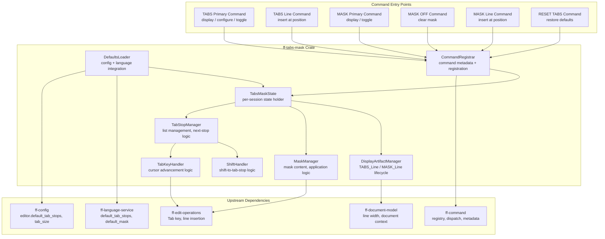

# Design Document: Tabs and Mask (`ff-tabs-mask`)

## Overview

The `ff-tabs-mask` crate provides **tab stop management** and **insert mask template** functionality for the FileForgeWorkbench editor. It implements the TABS and MASK commands (both primary and line command forms), manages per-session tab stop lists and insert mask state, handles Tab key cursor advancement using configured stops, and applies mask templates to newly inserted lines.

### Purpose

- Manage an ordered list of distinct tab stop column positions per session
- Display TABS_Lines (non-editable rulers) showing active tab stop positions in the viewport
- Manage an insert mask template string per session
- Display MASK_Lines (editable template lines) showing and allowing modification of the active mask
- Advance the cursor to the next tab stop on Tab key press (Insert and Overstrike modes)
- Apply the insert mask to blank lines created by I/In line commands
- Load default tab stops and mask from configuration and language definitions
- Support RESET interactions (clear display artifacts, preserve state)
- Integrate with shift line commands (>/< ) for tab-stop-aligned shifting

### Position in Architecture

```
Wave 11 — Display Mode

┌──────────────────────────────────────────────────────────────┐
│  Downstream Consumers:                                        │
│    viewport (rendering TABS/MASK display artifact lines)      │
│    line-commands (I/In mask application, TABS/MASK prefix)    │
├──────────────────────────────────────────────────────────────┤
│          THIS CRATE: ff-tabs-mask ← Wave 11                   │
│   Tab stop management, mask templates, display artifacts      │
├──────────────────────────────────────────────────────────────┤
│  Upstream:                                                    │
│    ff-logging (Wave 0) — structured diagnostics               │
│    ff-command (Wave 2) — command registration & dispatch      │
│    ff-config (Wave 2) — editor.default_tab_stops, tab_size    │
│    ff-language-service (Wave 7) — per-language defaults        │
│    ff-document-model (Wave 4) — line width, document context  │
│    ff-edit-operations (Wave 4) — Tab key handling, insertion   │
├──────────────────────────────────────────────────────────────┤
│              Foundation Layer: ff-logging                      │
└──────────────────────────────────────────────────────────────┘
```

### Design Constraints (Cross-Cutting)

- **Command-Driven (Req 1–3, 6–8)**: All TABS and MASK operations are registered commands (`edit.tabs`, `edit.mask`) dispatched through `ff-command`
- **GUI Independence**: Zero GUI dependencies — display artifact rendering is downstream; this crate manages state and command logic only
- **Multi-Crate Workspace**: Crate at `crates/ff-tabs-mask`
- **Error Message Standards**: All errors follow `[tabs-mask] operation: description` format
- **Session-State Only (Req 15)**: Tab stops and mask content are per-session, non-undoable, non-persisted to disk
- **Display_Artifact_Line Pattern (Req 18)**: TABS_Lines and MASK_Lines follow the same conventions as COLS/BNDS lines from `navigation-commands`
- **Configuration as Data (Req 4, 10, 13)**: Default tab stops and mask come from configuration system and language TOML files

---

## Architecture

### High-Level Architecture Diagram



### Component Responsibilities

| Component | Responsibility |
|-----------|---------------|
| **TabStopManager** | Stores the ordered tab stop list, computes next/previous stop from a column, validates column arguments, handles deduplication and sorting |
| **MaskManager** | Stores the active insert mask string, applies mask to blank lines, handles mask editing, truncation/padding logic |
| **DisplayArtifactManager** | Manages lifecycle of TABS_Lines and MASK_Lines in the viewport — insertion, removal, toggle, RESET handling |
| **TabKeyHandler** | Computes Tab key target column using active tab stops, handles Insert vs Overstrike mode, delegates to edit-operations |
| **ShiftHandler** | Computes shift targets for `>` / `<` line commands using tab stop positions |
| **DefaultsLoader** | Loads tab stops and mask from configuration system and language definitions at session start, handles fallback logic |
| **CommandRegistrar** | Registers all TABS/MASK commands with the command framework, provides metadata for discoverability |
| **TabsMaskState** | Per-session state container holding the active TabStopList, InsertMask, and display artifact tracking |

---

## Components and Interfaces

```
crates/ff-tabs-mask/
├── Cargo.toml
├── src/
│   ├── lib.rs                    # Public API re-exports, crate docs
│   ├── state.rs                  # TabsMaskState: per-session state container
│   ├── tab_stops.rs              # TabStopList, TabStopManager: list management + next-stop logic
│   ├── mask.rs                   # MaskLine, MaskManager: mask content + application logic
│   ├── artifacts.rs              # DisplayArtifactManager: TABS_Line / MASK_Line lifecycle
│   ├── tab_key.rs                # TabKeyHandler: cursor advancement on Tab press
│   ├── shift.rs                  # ShiftHandler: shift-to-tab-stop for >/< commands
│   ├── defaults.rs              # DefaultsLoader: config + language integration
│   ├── commands/
│   │   ├── mod.rs                # Command module re-exports
│   │   ├── tabs.rs              # TABS primary command handler
│   │   ├── mask.rs              # MASK primary command handler (incl. MASK OFF)
│   │   ├── reset_tabs.rs       # RESET TABS command handler
│   │   └── line_commands.rs    # TABS/MASK line command handlers
│   └── error.rs                  # TabsMaskError enum
└── tests/
    ├── tab_stops_tests.rs        # Tab stop list property tests
    ├── mask_tests.rs             # Mask application property tests
    ├── tab_key_tests.rs          # Tab key advancement tests
    ├── shift_tests.rs            # Shift-to-tab-stop tests
    ├── commands_tests.rs         # Command dispatch integration tests
    ├── defaults_tests.rs         # Default loading precedence tests
    ├── artifacts_tests.rs        # Display artifact lifecycle tests
    └── integration.rs            # End-to-end scenario tests
```

---

## Data Models

### TabStopList

```rust
/// An ordered, deduplicated list of positive column positions representing tab stops.
/// Column positions are 1-based. The list is always sorted in ascending order.
/// Addresses: Requirements 2, 4, 5, 12, 13, 14, 15
#[derive(Debug, Clone, PartialEq, Eq)]
pub struct TabStopList {
    /// Tab stop column positions, sorted ascending, all > 0, no duplicates.
    stops: Vec<u32>,
}

impl TabStopList {
    /// Create an empty tab stop list.
    pub fn empty() -> Self;

    /// Create a tab stop list from an iterator of column positions.
    /// Invalid values (zero) are filtered out. Duplicates are removed.
    /// Result is sorted in ascending order.
    /// Addresses: Requirement 2, criterion 2.8; Requirement 4, criterion 4.7
    pub fn from_columns(columns: impl IntoIterator<Item = u32>) -> Self;

    /// Create tab stops at every `interval` columns starting from `interval + 1`.
    /// Used for the built-in every-8-columns default.
    /// Addresses: Requirement 4, criterion 4.2
    pub fn every_n_columns(interval: u32, max_column: u32) -> Self;

    /// Returns the next tab stop column strictly greater than `current_column`.
    /// If past the last explicit stop, computes by repeating the last interval.
    /// Returns None if the list is empty.
    /// Addresses: Requirement 5, criteria 5.1, 5.2
    pub fn next_stop_after(&self, current_column: u32) -> Option<u32>;

    /// Returns the previous tab stop column strictly less than `current_column`.
    /// Returns None if no stop exists to the left.
    /// Addresses: Requirement 14, criteria 14.2, 14.3
    pub fn prev_stop_before(&self, current_column: u32) -> Option<u32>;

    /// Returns the tab stop n positions ahead of `current_column`.
    /// Addresses: Requirement 14, criterion 14.4
    pub fn nth_stop_after(&self, current_column: u32, n: u32) -> Option<u32>;

    /// Returns the tab stop n positions behind `current_column`.
    /// Addresses: Requirement 14, criterion 14.4
    pub fn nth_stop_before(&self, current_column: u32, n: u32) -> Option<u32>;

    /// Returns the list of stop positions as a slice.
    pub fn stops(&self) -> &[u32];

    /// Returns true if the list is empty.
    pub fn is_empty(&self) -> bool;

    /// Returns the number of explicit tab stops.
    pub fn len(&self) -> usize;

    /// Returns true if the given column is a configured tab stop.
    pub fn contains(&self, column: u32) -> bool;
}

impl std::fmt::Display for TabStopList {
    /// Formats as space-separated column numbers (e.g., "7 12 72").
    fn fmt(&self, f: &mut std::fmt::Formatter<'_>) -> std::fmt::Result;
}
```

### MaskLine

```rust
/// The content of an insert mask template.
/// Represents a fixed-width template string applied to newly inserted blank lines.
/// Characters at each column position define pre-filled content; spaces are "empty" positions.
/// Addresses: Requirements 6, 7, 8, 9, 10, 16
#[derive(Debug, Clone, PartialEq, Eq)]
pub struct MaskLine {
    /// The mask template content. Each character maps to its column position (0-indexed internally).
    content: String,
}

impl MaskLine {
    /// Create a new MaskLine from a string value.
    /// The content is stored verbatim without transformation.
    /// Addresses: Requirement 10, criterion 10.4
    pub fn new(content: impl Into<String>) -> Self;

    /// Create an empty MaskLine (no mask active).
    pub fn empty() -> Self;

    /// Returns true if the mask has no content.
    pub fn is_empty(&self) -> bool;

    /// Returns the mask content as a string slice.
    pub fn content(&self) -> &str;

    /// Returns the length of the mask in characters.
    pub fn len(&self) -> usize;

    /// Apply this mask to create a new line of the given `line_width`.
    /// If the mask is shorter than line_width, pads with spaces.
    /// If the mask is longer than line_width, truncates at line_width.
    /// Addresses: Requirement 9, criteria 9.5, 9.6
    pub fn apply_to_width(&self, line_width: usize) -> String;

    /// Update the mask content (from in-place MASK_Line editing).
    /// Addresses: Requirement 6, criterion 6.4
    pub fn set_content(&mut self, content: impl Into<String>);
}

impl std::fmt::Display for MaskLine {
    fn fmt(&self, f: &mut std::fmt::Formatter<'_>) -> std::fmt::Result;
}
```

### TabsState

```rust
/// Per-session state for tab stop management.
/// Non-undoable, non-persisted — lives only in Session_State.
/// Addresses: Requirement 15, criteria 15.1, 15.3, 15.4
#[derive(Debug, Clone)]
pub struct TabsState {
    /// The active tab stop list for this session.
    tab_stops: TabStopList,
    /// Source of the current tab stops (for RESET TABS restoration).
    source: TabStopSource,
    /// Default tab stops to restore on RESET TABS.
    default_tab_stops: TabStopList,
}

/// Indicates the origin of the currently active tab stops.
/// Addresses: Requirement 4, criteria 4.3, 4.4; Requirement 12
#[derive(Debug, Clone, PartialEq, Eq)]
pub enum TabStopSource {
    /// Built-in every-8-columns default.
    BuiltIn,
    /// Loaded from global configuration (editor.default_tab_stops).
    GlobalConfig,
    /// Loaded from a language definition (default_tab_stops key).
    LanguageDefinition,
    /// Set manually via TABS command during session.
    SessionOverride,
}

impl TabsState {
    /// Create a new TabsState with the given default tab stops and source.
    pub fn new(defaults: TabStopList, source: TabStopSource) -> Self;

    /// Get the active tab stop list.
    pub fn tab_stops(&self) -> &TabStopList;

    /// Replace the active tab stops (session override).
    /// Addresses: Requirement 2, criteria 2.1, 2.4
    pub fn set_tab_stops(&mut self, stops: TabStopList);

    /// Reset to default tab stops (RESET TABS).
    /// Addresses: Requirement 12, criteria 12.1, 12.2
    pub fn reset_to_defaults(&mut self);

    /// Returns the source of the current tab stops.
    pub fn source(&self) -> &TabStopSource;
}
```

### MaskState

```rust
/// Per-session state for insert mask management.
/// Non-undoable, non-persisted — lives only in Session_State.
/// Addresses: Requirement 15, criteria 15.2, 15.3, 15.4
#[derive(Debug, Clone)]
pub struct MaskState {
    /// The active insert mask for this session. None means no mask active.
    mask: Option<MaskLine>,
    /// Whether the mask was loaded from a language definition (for display messaging).
    from_language: bool,
}

impl MaskState {
    /// Create a MaskState with an active mask.
    /// Addresses: Requirement 10, criterion 10.1
    pub fn with_mask(mask: MaskLine, from_language: bool) -> Self;

    /// Create a MaskState with no active mask.
    /// Addresses: Requirement 10, criterion 10.2
    pub fn empty() -> Self;

    /// Returns the active mask, if any.
    pub fn mask(&self) -> Option<&MaskLine>;

    /// Returns true if a mask is currently active.
    pub fn is_active(&self) -> bool;

    /// Update the mask content (from MASK_Line editing).
    /// Addresses: Requirement 6, criterion 6.4
    pub fn update_mask(&mut self, content: String);

    /// Clear the mask (MASK OFF).
    /// Addresses: Requirement 7, criterion 7.1
    pub fn clear(&mut self);
}
```

### TabsMaskState

```rust
/// Combined per-session state for both TABS and MASK features.
/// This is the top-level state container stored in Session_State.
/// Addresses: Requirements 15, 11
#[derive(Debug, Clone)]
pub struct TabsMaskState {
    /// Tab stop state.
    tabs: TabsState,
    /// Mask state.
    mask: MaskState,
    /// Tracked TABS_Line display artifacts (positions in viewport).
    tabs_lines: Vec<ArtifactPosition>,
    /// Tracked MASK_Line display artifacts (positions in viewport).
    mask_lines: Vec<ArtifactPosition>,
}

/// Identifies where a display artifact line is anchored in the document.
/// Addresses: Requirements 1, 3, 6, 8 (artifact positioning)
#[derive(Debug, Clone, PartialEq, Eq)]
pub struct ArtifactPosition {
    /// The document line index above which this artifact is inserted.
    /// Uses an anchor-based system so the artifact scrolls with the document.
    pub anchor_line: usize,
    /// Whether this artifact was inserted by a line command (vs primary command).
    pub from_line_command: bool,
}

impl TabsMaskState {
    /// Create a new combined state from defaults.
    pub fn new(tabs: TabsState, mask: MaskState) -> Self;

    /// Access the tabs state.
    pub fn tabs(&self) -> &TabsState;

    /// Mutably access the tabs state.
    pub fn tabs_mut(&mut self) -> &mut TabsState;

    /// Access the mask state.
    pub fn mask(&self) -> &MaskState;

    /// Mutably access the mask state.
    pub fn mask_mut(&mut self) -> &mut MaskState;

    /// Returns true if any TABS_Lines are currently displayed.
    pub fn has_tabs_lines(&self) -> bool;

    /// Returns true if any MASK_Lines are currently displayed.
    pub fn has_mask_lines(&self) -> bool;

    /// Add a TABS_Line artifact at the given position.
    /// Addresses: Requirement 1, criteria 1.1, 1.7
    pub fn add_tabs_line(&mut self, position: ArtifactPosition);

    /// Remove all TABS_Line artifacts (toggle off or RESET).
    /// Addresses: Requirement 1, criterion 1.4; Requirement 11, criteria 11.1, 11.2
    pub fn remove_all_tabs_lines(&mut self);

    /// Add a MASK_Line artifact at the given position.
    /// Addresses: Requirement 6, criteria 6.1, 6.8
    pub fn add_mask_line(&mut self, position: ArtifactPosition);

    /// Remove all MASK_Line artifacts (toggle off or RESET).
    /// Addresses: Requirement 6, criterion 6.5; Requirement 11, criteria 11.1, 11.2
    pub fn remove_all_mask_lines(&mut self);

    /// Get all TABS_Line positions for rendering.
    pub fn tabs_lines(&self) -> &[ArtifactPosition];

    /// Get all MASK_Line positions for rendering.
    pub fn mask_lines(&self) -> &[ArtifactPosition];
}
```

### TabKeyAction

```rust
/// Describes the result of a Tab key press, to be executed by edit-operations.
/// Addresses: Requirement 5, criteria 5.1–5.6
#[derive(Debug, Clone, PartialEq, Eq)]
pub enum TabKeyAction {
    /// Advance cursor by inserting spaces from current column to target column (Insert mode).
    /// Addresses: Requirement 5, criterion 5.5
    InsertSpacesTo { target_column: u32 },
    /// Move cursor to target column without modifying content (Overstrike mode).
    /// Addresses: Requirement 5, criterion 5.6
    MoveCursorTo { target_column: u32 },
    /// Delegate to auto-indentation indent command (selection active).
    /// Addresses: Requirement 5, criterion 5.4
    DelegateToIndent,
    /// Fall back to standard navigation (Browse/View mode).
    /// Addresses: Requirement 5, criterion 5.4
    StandardNavigation,
    /// Advance by tab_size (no tab stops configured).
    /// Addresses: Requirement 5, criterion 5.3
    AdvanceBySize { spaces: u32 },
}
```

### ShiftAction

```rust
/// Describes the result of computing a shift target for >/< line commands.
/// Addresses: Requirement 14, criteria 14.1–14.4
#[derive(Debug, Clone, PartialEq, Eq)]
pub struct ShiftAction {
    /// The target column for the first non-space character after shifting.
    pub target_column: u32,
    /// Number of spaces to add (positive) or remove (negative) from line start.
    pub delta: i32,
}
```

---

## Public API Surface

### TabStopManager

```rust
/// Manages tab stop operations: validation, next/previous computation, list creation.
/// Addresses: Requirements 2, 4, 5, 12, 14
pub struct TabStopManager;

impl TabStopManager {
    /// Parse and validate column arguments from a TABS command.
    /// Returns Ok with a TabStopList on success, or an error if any argument is invalid.
    /// Addresses: Requirement 2, criteria 2.1, 2.7, 2.8
    pub fn parse_tab_stops(args: &[&str]) -> Result<TabStopList, TabsMaskError>;

    /// Compute the Tab key action for the given context.
    /// Addresses: Requirement 5, criteria 5.1–5.6
    pub fn compute_tab_action(
        tab_stops: &TabStopList,
        current_column: u32,
        mode: EditMode,
        has_selection: bool,
        tab_size: u32,
        line_width: u32,
    ) -> TabKeyAction;

    /// Compute the shift action for a > (shift right) command.
    /// Addresses: Requirement 14, criteria 14.1, 14.4
    pub fn compute_shift_right(
        tab_stops: &TabStopList,
        first_nonspace_column: u32,
        count: u32,
    ) -> ShiftAction;

    /// Compute the shift action for a < (shift left) command.
    /// Addresses: Requirement 14, criteria 14.2, 14.3, 14.4
    pub fn compute_shift_left(
        tab_stops: &TabStopList,
        first_nonspace_column: u32,
        count: u32,
    ) -> ShiftAction;
}
```

### MaskManager

```rust
/// Manages insert mask operations: content access, line application, editing.
/// Addresses: Requirements 6, 7, 8, 9, 10, 16
pub struct MaskManager;

impl MaskManager {
    /// Apply the active mask to generate content for a newly inserted blank line.
    /// Returns the mask content padded/truncated to line_width, or None if no mask active.
    /// Addresses: Requirement 9, criteria 9.1, 9.3, 9.5, 9.6
    pub fn apply_mask(mask_state: &MaskState, line_width: usize) -> Option<String>;

    /// Apply the active mask to n newly inserted lines.
    /// Returns a Vec of n line contents, or empty vec if no mask active.
    /// Addresses: Requirement 9, criterion 9.2
    pub fn apply_mask_to_n_lines(
        mask_state: &MaskState,
        line_width: usize,
        count: usize,
    ) -> Vec<String>;

    /// Validate and create a MaskLine from a language definition default_mask value.
    /// Returns None if the value is not a valid string.
    /// Addresses: Requirement 10, criteria 10.3, 10.6
    pub fn from_language_default(value: &toml::Value) -> Option<MaskLine>;
}
```

### DefaultsLoader

```rust
/// Loads default tab stops and mask at session initialization.
/// Applies precedence: Language_Definition > global config > built-in defaults.
/// Addresses: Requirements 4, 10, 13
pub struct DefaultsLoader;

impl DefaultsLoader {
    /// Load tab stops for a new session.
    /// Precedence: language definition > global config > every-8-columns.
    /// Addresses: Requirement 4, criteria 4.1–4.7; Requirement 13, criterion 13.6
    pub fn load_tab_stops(
        config: &dyn ConfigProvider,
        language_def: Option<&LanguageDefinitionRef<'_>>,
        max_column: u32,
    ) -> (TabStopList, TabStopSource);

    /// Load the insert mask for a new session.
    /// Precedence: language definition > no mask.
    /// Addresses: Requirement 10, criteria 10.1, 10.2
    pub fn load_mask(
        language_def: Option<&LanguageDefinitionRef<'_>>,
    ) -> MaskState;

    /// Initialize the complete TabsMaskState for a new editing session.
    /// Addresses: Requirements 4, 10, 15
    pub fn init_session(
        config: &dyn ConfigProvider,
        language_def: Option<&LanguageDefinitionRef<'_>>,
        max_column: u32,
    ) -> TabsMaskState;
}
```

### DisplayArtifactManager

```rust
/// Manages the lifecycle of TABS_Line and MASK_Line display artifacts.
/// Addresses: Requirements 1, 3, 6, 8, 11, 17, 18
pub struct DisplayArtifactManager;

impl DisplayArtifactManager {
    /// Render a TABS_Line string for the given tab stops and line width.
    /// Places indicator character at each stop position, filler elsewhere.
    /// Addresses: Requirement 1, criteria 1.2, 1.3; Requirement 17, criteria 17.1–17.5
    pub fn render_tabs_line(
        tab_stops: &TabStopList,
        line_width: usize,
        indicator_char: char,
        filler_char: char,
    ) -> String;

    /// Render a MASK_Line string for display.
    /// Returns the mask content padded to line_width.
    /// Addresses: Requirement 6, criterion 6.3; Requirement 16, criteria 16.1, 16.4
    pub fn render_mask_line(mask: &MaskLine, line_width: usize) -> String;

    /// Determine if a TABS toggle should add or remove lines.
    /// Returns true if lines should be removed (already displayed).
    /// Addresses: Requirement 1, criterion 1.4; Requirement 6, criterion 6.5
    pub fn should_toggle_off(existing_lines: &[ArtifactPosition]) -> bool;

    /// Create artifact metadata for a display artifact line.
    /// Addresses: Requirement 18, criteria 18.1, 18.2, 18.7
    pub fn artifact_metadata(kind: ArtifactKind) -> ArtifactMetadata;
}

/// The kind of display artifact.
/// Addresses: Requirement 18, criteria 18.1, 18.2
#[derive(Debug, Clone, Copy, PartialEq, Eq)]
pub enum ArtifactKind {
    TabsLine,
    MaskLine,
}

/// Metadata for command framework registration of display artifact commands.
/// Addresses: Requirement 18, criterion 18.7
#[derive(Debug, Clone)]
pub struct ArtifactMetadata {
    pub command_id: &'static str,
    pub display_name: &'static str,
    pub description: &'static str,
    pub category: &'static str,
    pub undo_classification: UndoClassification,
    pub applicable_modes: Vec<EditorMode>,
}

/// Undo classification for commands.
#[derive(Debug, Clone, Copy, PartialEq, Eq)]
pub enum UndoClassification {
    NonUndoable,
}

/// Editor modes in which a command is valid.
#[derive(Debug, Clone, Copy, PartialEq, Eq)]
pub enum EditorMode {
    Edit,
    Browse,
    View,
}
```

### Command Handlers

```rust
/// Handle execution of the TABS primary command.
/// Addresses: Requirements 1, 2
pub fn execute_tabs_command(
    state: &mut TabsMaskState,
    args: &[&str],
    cursor_line: Option<usize>,
    line_width: usize,
) -> Result<TabsCommandResult, TabsMaskError>;

/// Result of executing a TABS primary command.
#[derive(Debug, Clone, PartialEq, Eq)]
pub enum TabsCommandResult {
    /// TABS_Line(s) added to viewport.
    LinesAdded { count: usize },
    /// TABS_Line(s) removed from viewport (toggle off).
    LinesRemoved { count: usize },
    /// Tab stops updated and TABS_Line(s) refreshed.
    StopsUpdated { stops: TabStopList, lines_refreshed: usize },
}

/// Handle execution of the MASK primary command.
/// Addresses: Requirements 6, 7
pub fn execute_mask_command(
    state: &mut TabsMaskState,
    args: &[&str],
    cursor_line: Option<usize>,
    line_width: usize,
) -> Result<MaskCommandResult, TabsMaskError>;

/// Result of executing a MASK primary command.
#[derive(Debug, Clone, PartialEq, Eq)]
pub enum MaskCommandResult {
    /// MASK_Line(s) added to viewport.
    LinesAdded { count: usize },
    /// MASK_Line(s) removed from viewport (toggle off).
    LinesRemoved { count: usize },
    /// Mask cleared (MASK OFF).
    MaskCleared,
    /// No active mask to display.
    NoActiveMask,
    /// No active mask to clear.
    NoMaskToClear,
}

/// Handle execution of the RESET TABS command.
/// Addresses: Requirement 12
pub fn execute_reset_tabs(
    state: &mut TabsMaskState,
    line_width: usize,
) -> Result<(), TabsMaskError>;

/// Handle execution of RESET (clear display artifacts only).
/// Addresses: Requirement 11
pub fn handle_reset(state: &mut TabsMaskState);

/// Handle execution of TABS/MASK line commands.
/// Addresses: Requirements 3, 8
pub fn execute_line_command(
    state: &mut TabsMaskState,
    kind: ArtifactKind,
    anchor_line: usize,
    line_width: usize,
) -> Result<(), TabsMaskError>;
```

### EditMode

```rust
/// The current editing mode, provided by the session context.
/// Addresses: Requirement 5, criteria 5.4, 5.5, 5.6
#[derive(Debug, Clone, Copy, PartialEq, Eq)]
pub enum EditMode {
    /// Insert mode: Tab inserts spaces to fill to target column.
    Insert,
    /// Overstrike mode: Tab moves cursor without inserting characters.
    Overstrike,
    /// Browse mode: Tab uses standard navigation.
    Browse,
    /// View mode: Tab uses standard navigation.
    View,
}
```

---

## Error Handling

```rust
/// Errors originating from the ff-tabs-mask crate.
/// Formatted per Error Message Standards: `[tabs-mask] operation: description`
///
/// Addresses: Cross-cutting error standards
#[derive(Debug, thiserror::Error)]
#[non_exhaustive]
pub enum TabsMaskError {
    /// One or more column arguments are not valid positive integers.
    /// Addresses: Requirement 2, criterion 2.7
    #[error("[tabs-mask] parse: invalid tab stop — column positions must be positive integers: {invalid_values:?}")]
    InvalidTabStops { invalid_values: Vec<String> },

    /// The TABS or MASK command was issued in a mode where it is not valid.
    #[error("[tabs-mask] execute: command '{command}' is not valid in {mode:?} mode")]
    InvalidMode { command: String, mode: EditMode },

    /// Mask editing attempted in Browse mode.
    /// Addresses: Requirement 6, criterion 6.11
    #[error("[tabs-mask] edit: mask line is not editable in Browse mode")]
    MaskNotEditable,

    /// No active mask when MASK OFF was issued.
    /// Addresses: Requirement 7, criterion 7.3
    #[error("[tabs-mask] clear: no active mask to clear")]
    NoMaskToClear,

    /// No active mask when MASK display was requested.
    /// Addresses: Requirement 6, criterion 6.2
    #[error("[tabs-mask] display: no active mask — use MASK to set one or check the language profile")]
    NoActiveMask,

    /// Configuration key has invalid format.
    /// Addresses: Requirement 4, criterion 4.6; Requirement 13, criterion 13.3
    #[error("[tabs-mask] config: invalid value in '{key}' — {reason}")]
    InvalidConfig { key: String, reason: String },

    /// Line width exceeded during mask application.
    #[error("[tabs-mask] apply: mask truncated at line width {line_width} (mask length: {mask_length})")]
    MaskTruncated { line_width: usize, mask_length: usize },

    /// Anchor line for display artifact is out of range.
    #[error("[tabs-mask] position: anchor line {anchor_line} out of range (document has {line_count} lines)")]
    AnchorOutOfRange { anchor_line: usize, line_count: usize },
}
```

---

## Integration Points

### With `ff-command` (Wave 2 — upstream)

- **Consumed API**: `CommandRegistry::register()`, `CommandMetadata`, dispatch pipeline
- **Data flow**: This crate registers TABS and MASK commands (primary and line command forms) with the command framework. Commands are dispatched through the standard pipeline.
- **Key interactions**:
  - Register `edit.tabs` primary command with metadata (Req 18.7)
  - Register `edit.mask` primary command with metadata (Req 18.7)
  - Register `edit.mask_off` primary command (Req 7)
  - Register `edit.reset_tabs` primary command (Req 12)
  - Register TABS/MASK line commands in the line-command pipeline (Req 3, 8)
  - All commands classified as non-undoable (Req 15)
  - Applicable modes: Edit, Browse, View for TABS; Edit, Browse for MASK (Req 1.10, 6.11)

### With `ff-config` (Wave 2 — upstream)

- **Consumed API**: `ConfigProvider` trait, typed key access
- **Data flow**: Reads `editor.default_tab_stops` (array of positive integers) and `editor.tab_size` (fallback for empty tab stop list) at session initialization
- **Key interactions**:
  - Query `editor.default_tab_stops` for global defaults (Req 4.1, 13.1)
  - Query `editor.tab_size` for Tab key fallback (Req 5.3)
  - Hot-reload: new defaults apply only to newly opened sessions (Req 13.7)
  - Invalid values logged and skipped (Req 4.6, 13.3)

### With `ff-language-service` (Wave 7 — upstream)

- **Consumed API**: `LanguageDefinitionRef`, property access for `default_tab_stops` and `default_mask`
- **Data flow**: At session start, queries the active language definition for per-language tab stop and mask defaults
- **Key interactions**:
  - Read `default_tab_stops` key from language TOML (Req 4.3, 4.5, 13.4)
  - Read `default_mask` key from language TOML (Req 10.1, 10.3, 13.5)
  - Language definition takes precedence over global config (Req 4.3, 13.6)
  - Invalid types logged and treated as absent (Req 4.6, 10.6)

### With `ff-document-model` (Wave 4 — upstream)

- **Consumed information**: Document line width, current line count, cursor position context
- **Data flow**: Provides line width for mask truncation/padding and TABS_Line rendering, document dimensions for anchor validation
- **Key interactions**:
  - Line width used for `apply_to_width()` and `render_tabs_line()` (Req 9.5, 9.6, 17.5)
  - Line count for anchor validation (artifact positioning)
  - No compile-time dependency required — information passed by the orchestrating session layer

### With `ff-edit-operations` (Wave 4 — upstream)

- **Consumed API**: Tab key handling hook, line insertion hook
- **Data flow**: This crate provides the Tab key target computation; `ff-edit-operations` executes the actual cursor movement or space insertion. For mask application, the I/In line command execution path queries this crate for mask content.
- **Key interactions**:
  - Tab key pressed → `compute_tab_action()` called → result dispatched to edit-operations (Req 5)
  - I/In line command → `apply_mask()` called → content provided to line insertion (Req 9)
  - Mask application is part of the insert transaction (Req 9.4) — no separate undo entry

### With `ff-auto-indentation` (Wave 7 — coordination)

- **Coordination boundary**: Tab with selection delegates to `auto-indentation` Indent command
- **Data flow**: When Tab is pressed with a selection, this crate returns `TabKeyAction::DelegateToIndent` and does not handle the operation. The `auto-indentation` crate uses `editor.indent_size`, NOT the TABS tab stop list.
- **Key interactions**:
  - Selection-active Tab → delegate (Req 5.4, 14.5)
  - Tab stop list exposed for `>` / `<` shift commands (Req 14.1–14.4)
  - Clear ownership boundary: single-cursor Tab = this crate; selection Tab/indent = auto-indentation

### With `command-semantics` (RESET command — coordination)

- **Coordination boundary**: RESET is owned by `command-semantics`; it calls into this crate to clear display artifacts
- **Data flow**: When RESET or RESET ALL is issued, the command-semantics layer calls `handle_reset()` on this crate's state to remove TABS_Lines and MASK_Lines
- **Key interactions**:
  - RESET removes display artifacts but preserves tab stops and mask content (Req 11.1–11.4)
  - RESET COMMANDS clears pending TABS/MASK line commands from prefix area (Req 11.5)

### With `line-commands` (prefix area — coordination)

- **Coordination boundary**: Line command parsing/dispatch is in `line-commands`; execution is here
- **Data flow**: When TABS or MASK is entered in the prefix area, the line-command pipeline routes to this crate for artifact insertion
- **Key interactions**:
  - TABS line command inserts TABS_Line above the target line (Req 3.1)
  - MASK line command inserts editable MASK_Line above the target line (Req 8.1)
  - I/In commands query this crate for mask content (Req 9.1, 9.2)

---

## Correctness Properties

These properties are suitable for property-based testing using the `proptest` crate.

### Property 1: Tab Stop List Sorted and Deduplicated Invariant

**Statement**: For any input of column positions, the resulting TabStopList is always sorted in ascending order with no duplicates.

**Validates: Requirements 2.8, 4.7**

```
∀ columns: Vec<u32>:
  let list = TabStopList::from_columns(columns)
  list.stops() is sorted in strictly ascending order
  list.stops() contains no duplicates
  ∀ s ∈ list.stops(): s > 0
```

### Property 2: Next Tab Stop Monotonically Advances

**Statement**: For any current column and non-empty tab stop list, the next tab stop is always strictly greater than the current column.

**Validates: Requirements 5.1**

```
∀ tab_stops: TabStopList (non-empty), ∀ current_column: u32 (> 0):
  let next = tab_stops.next_stop_after(current_column)
  next.is_some() ⟹ next.unwrap() > current_column
```

### Property 3: Previous Tab Stop Monotonically Retreats

**Statement**: For any current column and non-empty tab stop list, the previous tab stop is always strictly less than the current column.

**Validates: Requirements 14.2, 14.3**

```
∀ tab_stops: TabStopList (non-empty), ∀ current_column: u32 (> 1):
  let prev = tab_stops.prev_stop_before(current_column)
  prev.is_some() ⟹ prev.unwrap() < current_column
```

### Property 4: Mask Application Width Invariant

**Statement**: Applying a mask to a line width always produces a string of exactly that width, regardless of mask content length.

**Validates: Requirements 9.5, 9.6**

```
∀ mask: MaskLine, ∀ line_width: usize (> 0):
  let result = mask.apply_to_width(line_width)
  result.len() == line_width
```

### Property 5: Tab Key in Insert Mode Always Inserts Correct Space Count

**Statement**: When the Tab key action is `InsertSpacesTo { target_column }`, the number of spaces to insert equals `target_column - current_column`.

**Validates: Requirements 5.5**

```
∀ tab_stops: TabStopList, ∀ current_column: u32,
  let action = compute_tab_action(tab_stops, current_column, Insert, false, tab_size, line_width)
  IF action == InsertSpacesTo { target_column }:
    target_column - current_column > 0
    target_column > current_column
```

### Property 6: Tab Stops Persist Across RESET

**Statement**: Calling `handle_reset()` removes all display artifact lines but the tab stop list and mask content remain unchanged.

**Validates: Requirements 11.3, 11.4**

```
∀ state: TabsMaskState:
  let tabs_before = state.tabs().tab_stops().clone()
  let mask_before = state.mask().mask().cloned()
  handle_reset(&mut state)
  state.tabs().tab_stops() == &tabs_before
  state.mask().mask() == mask_before.as_ref()
  state.tabs_lines().is_empty()
  state.mask_lines().is_empty()
```

### Property 7: RESET TABS Restores Defaults

**Statement**: After `reset_to_defaults()`, the active tab stop list equals the default tab stop list regardless of previous session overrides.

**Validates: Requirements 12.1**

```
∀ initial_defaults: TabStopList, ∀ overrides: Vec<TabStopList>:
  let mut tabs_state = TabsState::new(initial_defaults.clone(), source)
  for override in overrides:
    tabs_state.set_tab_stops(override)
  tabs_state.reset_to_defaults()
  tabs_state.tab_stops() == &initial_defaults
```

### Property 8: MASK OFF Clears Regardless of Source

**Statement**: After `clear()`, the mask state reports no active mask regardless of whether the mask was loaded from a language definition or set manually.

**Validates: Requirements 7.1, 10.5**

```
∀ mask: MaskLine, ∀ from_language: bool:
  let mut mask_state = MaskState::with_mask(mask, from_language)
  mask_state.clear()
  mask_state.is_active() == false
  mask_state.mask().is_none()
```

### Property 9: Tab Stop List Filters Invalid Values

**Statement**: Zero values and duplicate values in input are never present in the resulting TabStopList. The count of valid distinct values equals the resulting list length.

**Validates: Requirements 2.7, 2.8, 4.6**

```
∀ columns: Vec<u32>:
  let list = TabStopList::from_columns(columns.clone())
  let expected_count = columns.iter().filter(|&&c| c > 0).collect::<HashSet<_>>().len()
  list.len() == expected_count
  ∀ s ∈ list.stops(): s > 0
```

### Property 10: Toggle Behaviour Idempotence

**Statement**: Issuing TABS (or MASK) twice returns the display to its original state — no artifacts remain after an even number of toggle operations.

**Validates: Requirements 1.4, 6.5**

```
∀ state: TabsMaskState (initially no TABS_Lines):
  execute_tabs_command(&mut state, &[], cursor, width)  // adds lines
  state.has_tabs_lines() == true
  execute_tabs_command(&mut state, &[], cursor, width)  // removes lines
  state.has_tabs_lines() == false
```

### Property 11: Shift Right Then Shift Left Returns to Original Position

**Statement**: For any line with first-non-space at a tab stop position, shifting right by 1 then left by 1 returns to the original column.

**Validates: Requirements 14.1, 14.2**

```
∀ tab_stops: TabStopList (len ≥ 2), ∀ column ∈ tab_stops.stops():
  let right = compute_shift_right(tab_stops, column, 1)
  let back = compute_shift_left(tab_stops, right.target_column, 1)
  back.target_column == column
```

### Property 12: Language Definition Precedence Over Global Config

**Statement**: When both a language definition and global config provide tab stops, the language definition values are used as the session default.

**Validates: Requirements 4.3, 4.4, 13.6**

```
∀ global_stops: TabStopList, ∀ lang_stops: TabStopList (non-empty):
  let (result, source) = DefaultsLoader::load_tab_stops(config_with(global_stops), Some(lang_def_with(lang_stops)), max)
  result == lang_stops
  source == TabStopSource::LanguageDefinition
```

### Property 13: Display Artifact Lines Excluded from Command Scope

**Statement**: TABS_Lines and MASK_Lines are never counted in line number calculations, never included in command scopes, and never saved to disk.

**Validates: Requirements 18.1, 18.2, 18.3, 18.4**

```
∀ state: TabsMaskState with N tabs_lines and M mask_lines:
  artifact_metadata(TabsLine).is_real_document_line == false
  artifact_metadata(MaskLine).is_real_document_line == false
  // Structural guarantee enforced by type system — ArtifactPosition is not a document LineIndex
```

### Property 14: Mask Application Part of Insert Transaction

**Statement**: When mask content is applied to inserted lines, the mask-filled content is removable as a single undo unit with the line insertion — no independent undo entry is created.

**Validates: Requirements 9.4**

```
// Structural property: apply_mask() returns content that is passed into the
// line insertion API as initial content, sharing the insert transaction.
// No separate transaction is created by the mask application path.
```

---

## Testing Strategy

### Unit Tests (per module)

- `tab_stops_tests.rs`: TabStopList construction, sorting, deduplication, next/prev stop computation, every-n-columns generation
- `mask_tests.rs`: MaskLine creation, apply_to_width truncation and padding, content update
- `tab_key_tests.rs`: All EditMode × tab stop configurations, empty list fallback, line width clamping
- `shift_tests.rs`: Shift right/left by 1 and n, boundary conditions (column 1, past last stop)
- `commands_tests.rs`: TABS/MASK primary command argument parsing, toggle logic, MASK OFF, RESET TABS
- `defaults_tests.rs`: Precedence rules, invalid value filtering, fallback to every-8-columns
- `artifacts_tests.rs`: Artifact insertion, removal, toggle, RESET interaction

### Property-Based Tests (proptest)

All 14 correctness properties above are implemented as `proptest!` tests with ≥100 cases each. Strategies generate:
- Arbitrary `Vec<u32>` for tab stop columns (including zeros and duplicates)
- Arbitrary strings for mask content (including empty, very long, and special characters)
- Random cursor positions and line widths
- Random sequences of toggle/reset/override operations

### Integration Tests

- End-to-end session initialization with config + language definition
- TABS command → Tab key → cursor position verification
- MASK command → I line command → inserted line content verification
- RESET interaction sequences
- Multi-artifact display scenarios
