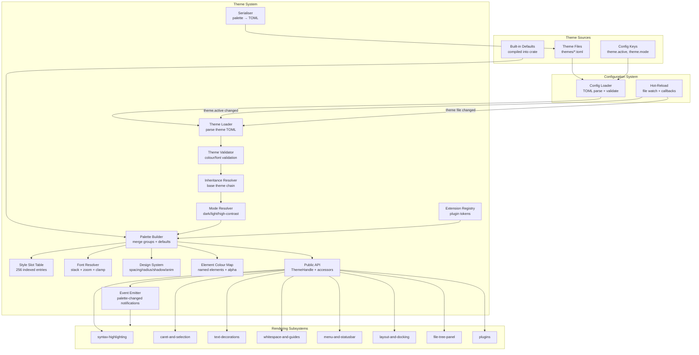

# Design Document: Theme & Appearance (`ff-theme`)

## 1. Overview

The `ff-theme` crate is the **central visual identity layer** for the FileForgeWorkbench platform. It manages colour palettes, font stacks, style slots, design tokens, visual mode switching (dark/light/high-contrast), and plugin theme extensions. All rendering code obtains colour values, font selections, and spacing metrics exclusively through the theme system rather than using hardcoded values.

### Purpose

- Load, validate, and serve colour palettes organised into semantic groups (editor, syntax, file_tree, tab_bar, chrome, decorations, indicators, ui)
- Provide a 256-slot style table for syntax-highlighting token rendering
- Manage separate monospace and proportional font stacks with fallback and zoom support
- Support three visual modes (Dark, Light, High-Contrast) with runtime switching
- Expose a design system of spacing, border-radius, shadow, and animation tokens
- Enable plugin-registered theme extensions scoped to plugin namespaces
- Provide element-based colour queries with optional alpha/transparency
- Support hot-reload of theme files via configuration-system callbacks
- Guarantee serialisation round-trip fidelity for theme editor tooling
- Support theme inheritance (`base` theme resolution)

### Position in Architecture

```
Wave 6 — UI and Rendering (depends on Wave 5 Command Engine)

┌─────────────────────────────────────────────────────────┐
│                    Application Binary                     │
│                (ffwb / GUI shell — ff-desktop)            │
├─────────────────────────────────────────────────────────┤
│  syntax-highlighting │ caret-and-selection │ file-tree    │
│  text-decorations │ whitespace-and-guides │ menu/status   │
│  layout-and-docking (panel colours)                       │
├─────────────────────────────────────────────────────────┤
│              ff-theme (THIS CRATE) — Wave 6               │
├─────────────────────────────────────────────────────────┤
│              ff-config — Wave 2                            │
├─────────────────────────────────────────────────────────┤
│              ff-logging — Wave 0                           │
└─────────────────────────────────────────────────────────┘
```

### Design Constraints (Cross-Cutting)

- **FFW-ARCH-001 (Req 1)**: Theme files are loaded via configuration-system (which uses direct filesystem access, not VFS)
- **GUI Independence (Req 2)**: Core theme data models and resolution logic are GUI-independent; only the thin `apply` layer touches egui types
- **Plugin Architecture (Req 3)**: Plugins register theme extensions via `register_extension()`; extensions are namespace-scoped
- **Configuration Namespace (FFW Req 5)**: Theme keys live under the reserved `theme.*` namespace in the configuration-system
- **Multi-Crate Workspace (Req 7)**: Crate at `crates/ff-theme`, named `ff-theme`
- **Error Message Standards (Req 8)**: Consistent `[theme] operation: description` error format

### Upstream Dependencies

- `ff-config` (Wave 2): TOML loading, layered overrides, hot-reload callbacks, schema registration
- `ff-logging` (Wave 0): Diagnostic output (WARN on invalid themes, DEBUG on font fallbacks)

### Downstream Consumers

- `ff-desktop` (GUI shell): Applies resolved fonts and palette to egui context
- `syntax-highlighting`: Queries style slots for token rendering
- `caret-and-selection`: Queries element colours for caret and selection
- `text-decorations`: Queries decoration and indicator colours
- `whitespace-and-guides`: Queries whitespace and guide colours
- `menu-and-statusbar`: Queries UI and chrome colours
- `layout-and-docking`: Queries panel border and tab-group colours
- `file-tree-panel`: Queries file-category colours
- `plugin-architecture`: Registers plugin theme extensions

---

## 2. Architecture

### High-Level Architecture Diagram



### Component Responsibilities

| Component | Responsibility |
|-----------|---------------|
| **Theme Loader** | Parse theme TOML files, resolve `base` inheritance chains, merge with defaults |
| **Theme Validator** | Validate colour formats (#RRGGBB/#RRGGBBAA), font sizes (6.0–72.0), slot indices (0–255) |
| **Inheritance Resolver** | Walk the `base` chain to resolve tokens not defined in the active theme |
| **Mode Resolver** | Select Dark/Light/High-Contrast section from theme data |
| **Palette Builder** | Assemble the final `ThemePalette` from validated, inherited, mode-resolved values |
| **Style Slot Table** | Manage 256 indexed style entries with inheritance from Default slot (index 32) |
| **Font Resolver** | Resolve font stacks, apply zoom offset, clamp effective sizes |
| **Design System** | Provide spacing, border-radius, shadow, animation tokens |
| **Element Colour Map** | Named element colours with translucency tracking and runtime overrides |
| **Extension Registry** | Store and resolve plugin-registered tokens |
| **Serialiser** | Write ThemePalette back to TOML with comments and structure |
| **Event Emitter** | Notify consumers when palette changes (hot-reload, mode switch, theme switch) |
| **Public API** | Thread-safe `ThemeHandle` with typed accessors |

---

## 3. Module Structure

```
crates/ff-theme/
├── Cargo.toml
├── src/
│   ├── lib.rs                  # Public API re-exports, crate docs
│   ├── handle.rs               # ThemeHandle: Arc-based shared access
│   ├── palette/
│   │   ├── mod.rs              # ThemePalette struct re-exports
│   │   ├── editor.rs           # EditorPalette colour group
│   │   ├── syntax.rs           # SyntaxPalette colour group
│   │   ├── file_tree.rs        # FileTreePalette colour group
│   │   ├── tab_bar.rs          # TabBarPalette colour group
│   │   ├── chrome.rs           # ChromePalette colour group
│   │   ├── decorations.rs      # DecorationsPalette colour group
│   │   ├── indicators.rs       # IndicatorsPalette colour group
│   │   └── ui.rs               # UiPalette colour group
│   ├── colour.rs               # ColourRGBA type, parsing, display
│   ├── style_slot.rs           # StyleSlot struct, SlotTable, reserved indices
│   ├── font.rs                 # FontStack, FontConfig, zoom logic
│   ├── design_tokens.rs        # SpacingScale, BorderRadius, Shadow, Animation
│   ├── mode.rs                 # VisualMode enum, mode resolution
│   ├── element.rs              # Element enum, ElementColourMap, translucency
│   ├── loader.rs               # Theme TOML loading and inheritance resolution
│   ├── validator.rs            # Colour/font/slot validation logic
│   ├── defaults.rs             # Built-in default palettes for all three modes
│   ├── serialiser.rs           # ThemePalette → TOML serialisation
│   ├── extension.rs            # ThemeExtension, plugin token registry
│   ├── event.rs                # ThemeEvent, consumer notification
│   ├── token.rs                # ColourToken enum (compile-time token identifiers)
│   ├── error.rs                # ThemeError enum
│   └── keys.rs                 # Configuration key constants (theme.*)
├── tests/
│   ├── palette_tests.rs        # Palette construction property tests
│   ├── style_slot_tests.rs     # Style slot inheritance property tests
│   ├── font_tests.rs           # Font resolution and zoom property tests
│   ├── mode_tests.rs           # Visual mode switching property tests
│   ├── serialise_tests.rs      # Round-trip serialisation property tests
│   ├── element_tests.rs        # Element colour and translucency tests
│   ├── extension_tests.rs      # Plugin extension registration tests
│   ├── loader_tests.rs         # Theme loading, inheritance, fallback tests
│   └── integration.rs          # End-to-end loading and access tests
└── defaults/
    ├── dark.toml               # Embedded default dark theme (for reference/docs)
    ├── light.toml              # Embedded default light theme (for reference/docs)
    └── high_contrast.toml      # Embedded default high-contrast theme
```

---

## 4. Key Data Models

### ColourRGBA

```rust
/// An RGBA colour value with 8-bit components.
/// Addresses: Requirement 2, criterion 9
#[derive(Debug, Clone, Copy, PartialEq, Eq, Hash)]
pub struct ColourRGBA {
    pub r: u8,
    pub g: u8,
    pub b: u8,
    pub a: u8,
}

impl ColourRGBA {
    /// Create a fully opaque colour.
    pub const fn rgb(r: u8, g: u8, b: u8) -> Self;
    /// Create a colour with explicit alpha.
    pub const fn rgba(r: u8, g: u8, b: u8, a: u8) -> Self;
    /// Parse from "#RRGGBB" or "#RRGGBBAA" hex string.
    pub fn from_hex(s: &str) -> Result<Self, ThemeError>;
    /// Serialise to "#RRGGBB" (opaque) or "#RRGGBBAA" (translucent).
    /// Addresses: Requirement 9, criterion 5
    pub fn to_hex(&self) -> String;
}
```

### VisualMode

```rust
/// The three supported appearance modes.
/// Addresses: Requirement 5, criterion 1
#[derive(Debug, Clone, Copy, PartialEq, Eq, Hash, Default)]
pub enum VisualMode {
    #[default]
    Dark,
    Light,
    HighContrast,
}
```

### ThemePalette

```rust
/// The complete resolved palette for the active theme and mode.
/// Thread-safe, shareable via Arc. Immutable after construction.
/// Addresses: Requirement 2, criteria 1–10; Requirement 7, criterion 2
#[derive(Debug, Clone, PartialEq)]
pub struct ThemePalette {
    /// Theme metadata
    pub name: String,
    pub mode: VisualMode,
    /// Colour groups
    pub editor: EditorPalette,
    pub syntax: SyntaxPalette,
    pub file_tree: FileTreePalette,
    pub tab_bar: TabBarPalette,
    pub chrome: ChromePalette,
    pub decorations: DecorationsPalette,
    pub indicators: IndicatorsPalette,
    pub ui: UiPalette,
    /// Style slots (256 entries)
    pub style_slots: StyleSlotTable,
    /// Font configuration
    pub fonts: FontConfig,
    /// Design system tokens
    pub design: DesignTokens,
    /// Element colour map
    pub elements: ElementColourMap,
    /// Plugin extension tokens (namespace → token_name → colour)
    pub extensions: ExtensionColours,
}
```

### EditorPalette

```rust
/// Colours for the editor content area.
/// Addresses: Requirement 2, criterion 1
#[derive(Debug, Clone, PartialEq, Eq)]
pub struct EditorPalette {
    pub background: ColourRGBA,
    pub foreground: ColourRGBA,
    pub accent: ColourRGBA,
    pub muted: ColourRGBA,
    pub modified_indicator: ColourRGBA,
    pub current_line_background: ColourRGBA,
    pub selection_secondary_background: ColourRGBA,
}
```

### SyntaxPalette

```rust
/// Colours for syntax-highlighted tokens.
/// Addresses: Requirement 2, criterion 2
#[derive(Debug, Clone, PartialEq, Eq)]
pub struct SyntaxPalette {
    pub keyword: ColourRGBA,
    pub comment: ColourRGBA,
    pub string: ColourRGBA,
    pub number: ColourRGBA,
    pub operator: ColourRGBA,
    pub r#type: ColourRGBA,
    pub function: ColourRGBA,
    pub r#macro: ColourRGBA,
    pub preprocessor: ColourRGBA,
    pub default: ColourRGBA,
}
```

### FileTreePalette

```rust
/// Colours for file tree panel entries.
/// Addresses: Requirement 2, criterion 3
#[derive(Debug, Clone, PartialEq, Eq)]
pub struct FileTreePalette {
    pub binary: ColourRGBA,
    pub structured: ColourRGBA,
    pub text: ColourRGBA,
    pub unknown: ColourRGBA,
    pub directory: ColourRGBA,
    pub symlink: ColourRGBA,
}
```

### TabBarPalette

```rust
/// Colours for the tab bar.
/// Addresses: Requirement 2, criterion 4
#[derive(Debug, Clone, PartialEq, Eq)]
pub struct TabBarPalette {
    pub active_background: ColourRGBA,
    pub inactive_background: ColourRGBA,
    pub active_text: ColourRGBA,
    pub inactive_text: ColourRGBA,
    pub modified_indicator: ColourRGBA,
    pub close_button: ColourRGBA,
    pub drop_target_highlight: ColourRGBA,
}
```

### ChromePalette

```rust
/// Colours for editor chrome elements.
/// Addresses: Requirement 2, criterion 5
#[derive(Debug, Clone, PartialEq, Eq)]
pub struct ChromePalette {
    pub cursor_row_border: ColourRGBA,
    pub cursor_column_indicator: ColourRGBA,
    pub line_number_foreground: ColourRGBA,
    pub line_number_background: ColourRGBA,
    pub fold_margin_background: ColourRGBA,
    pub fold_margin_foreground: ColourRGBA,
    pub margin_separator: ColourRGBA,
}
```

### DecorationsPalette

```rust
/// Colours for text decorations and markers.
/// Addresses: Requirement 2, criterion 6
#[derive(Debug, Clone, PartialEq, Eq)]
pub struct DecorationsPalette {
    pub search_highlight: ColourRGBA,
    pub error_underline: ColourRGBA,
    pub warning_underline: ColourRGBA,
    pub info_underline: ColourRGBA,
    pub change_added: ColourRGBA,
    pub change_modified: ColourRGBA,
    pub change_deleted: ColourRGBA,
    pub bookmark: ColourRGBA,
}
```

### IndicatorsPalette

```rust
/// Colours for indicators and match highlights.
/// Addresses: Requirement 2, criterion 7
#[derive(Debug, Clone, PartialEq, Eq)]
pub struct IndicatorsPalette {
    pub find_match: ColourRGBA,
    pub brace_match: ColourRGBA,
    pub brace_mismatch: ColourRGBA,
    pub hotspot_underline: ColourRGBA,
    /// Up to 32 user-defined indicator colours (indexed 0–31).
    pub user_defined: [ColourRGBA; 32],
}
```

### UiPalette

```rust
/// Colours for general UI components.
/// Addresses: Requirement 2, criterion 8
#[derive(Debug, Clone, PartialEq, Eq)]
pub struct UiPalette {
    pub panel_background: ColourRGBA,
    pub panel_foreground: ColourRGBA,
    pub panel_border: ColourRGBA,
    pub button_background: ColourRGBA,
    pub button_foreground: ColourRGBA,
    pub button_hover: ColourRGBA,
    pub input_background: ColourRGBA,
    pub input_border: ColourRGBA,
    pub input_foreground: ColourRGBA,
    pub scrollbar_track: ColourRGBA,
    pub scrollbar_thumb: ColourRGBA,
    pub tooltip_background: ColourRGBA,
    pub tooltip_foreground: ColourRGBA,
}
```

### StyleSlot

```rust
/// A single style slot defining visual attributes for a syntax token type.
/// Addresses: Requirement 3, criteria 1/2
#[derive(Debug, Clone, PartialEq, Eq)]
pub struct StyleSlot {
    pub foreground: ColourRGBA,
    pub background: ColourRGBA,
    /// Optional font family override (None = use default monospace stack).
    pub font_family: Option<String>,
    pub bold: bool,
    pub italic: bool,
    pub underline: bool,
    pub case_transform: CaseTransform,
}

/// Case transformation applied when rendering a style slot.
/// Addresses: Requirement 3, criterion 2
#[derive(Debug, Clone, Copy, PartialEq, Eq, Default)]
pub enum CaseTransform {
    #[default]
    None,
    Upper,
    Lower,
    Camel,
}
```

### StyleSlotTable

```rust
/// The 256-entry indexed style slot table.
/// Addresses: Requirement 3, criteria 1/3/4
pub struct StyleSlotTable {
    /// Slots indexed 0–255. Unset slots inherit from DEFAULT_STYLE_INDEX.
    slots: [StyleSlot; 256],
    /// Tracks which slots have been explicitly defined (vs inherited).
    defined: [bool; 256],
    /// Next available index for dynamic allocation.
    next_available: u8,
}

/// Reserved style indices.
/// Addresses: Requirement 3, criterion 3
pub const DEFAULT_STYLE_INDEX: u8 = 32;
pub const LINE_NUMBER_STYLE_INDEX: u8 = 33;
pub const BRACE_HIGHLIGHT_STYLE_INDEX: u8 = 34;
pub const BRACE_MISMATCH_STYLE_INDEX: u8 = 35;
pub const CONTROL_CHAR_STYLE_INDEX: u8 = 36;
pub const INDENT_GUIDE_STYLE_INDEX: u8 = 37;
pub const CALL_TIP_STYLE_INDEX: u8 = 38;
pub const FOLD_DISPLAY_STYLE_INDEX: u8 = 39;
```

### FontConfig

```rust
/// Font configuration for both editor and UI contexts.
/// Addresses: Requirement 4, criteria 1–5
#[derive(Debug, Clone, PartialEq)]
pub struct FontConfig {
    /// Monospace font stack for editor content.
    pub monospace: FontStack,
    /// Proportional font stack for UI elements.
    pub proportional: FontStack,
}

/// An ordered font family list with base size.
/// Addresses: Requirement 4, criteria 1/2/4
#[derive(Debug, Clone, PartialEq)]
pub struct FontStack {
    /// Ordered list of font family names (first available is used).
    pub families: Vec<String>,
    /// Base font size in points.
    pub base_size_pt: f32,
}

/// Default base sizes (points).
/// Addresses: Requirement 4, criterion 5
pub const DEFAULT_MONOSPACE_SIZE_PT: f32 = 14.0;
pub const DEFAULT_PROPORTIONAL_SIZE_PT: f32 = 13.0;

/// Valid font size range (points).
/// Addresses: Requirement 4, criterion 6
pub const MIN_FONT_SIZE_PT: f32 = 6.0;
pub const MAX_FONT_SIZE_PT: f32 = 72.0;

/// Effective size clamp range (with zoom applied).
/// Addresses: Requirement 4, criterion 8
pub const MIN_EFFECTIVE_SIZE_PT: f32 = 2.0;
pub const MAX_EFFECTIVE_SIZE_PT: f32 = 128.0;
```

### DesignTokens

```rust
/// Non-colour design system tokens for consistent UI geometry and motion.
/// Addresses: Requirement 6, criteria 1–4
#[derive(Debug, Clone, PartialEq)]
pub struct DesignTokens {
    pub spacing: SpacingScale,
    pub border_radius: BorderRadiusScale,
    pub shadows: ShadowScale,
    pub animations: AnimationScale,
}

/// Spacing values in logical pixels.
/// Addresses: Requirement 6, criterion 1
#[derive(Debug, Clone, PartialEq)]
pub struct SpacingScale {
    pub xs: f32,
    pub sm: f32,
    pub md: f32,
    pub lg: f32,
    pub xl: f32,
}

/// Border radius values in logical pixels.
/// Addresses: Requirement 6, criterion 2
#[derive(Debug, Clone, PartialEq)]
pub struct BorderRadiusScale {
    pub none: f32,
    pub sm: f32,
    pub md: f32,
    pub lg: f32,
    pub full: f32,
}

/// Shadow definitions.
/// Addresses: Requirement 6, criterion 3
#[derive(Debug, Clone, PartialEq)]
pub struct ShadowScale {
    pub sm: ShadowDef,
    pub md: ShadowDef,
    pub lg: ShadowDef,
}

#[derive(Debug, Clone, PartialEq)]
pub struct ShadowDef {
    pub offset_x: f32,
    pub offset_y: f32,
    pub blur_radius: f32,
    pub spread: f32,
    pub colour: ColourRGBA,
}

/// Animation timing tokens.
/// Addresses: Requirement 6, criterion 4
#[derive(Debug, Clone, PartialEq)]
pub struct AnimationScale {
    pub fast: AnimationDef,
    pub normal: AnimationDef,
    pub slow: AnimationDef,
}

#[derive(Debug, Clone, PartialEq)]
pub struct AnimationDef {
    /// Duration in milliseconds.
    pub duration_ms: u32,
    /// Named easing curve (e.g., "ease-in-out", "linear", "ease-out").
    pub easing: String,
}
```

### Element

```rust
/// Named UI elements that support element-colour queries with optional alpha.
/// Addresses: Requirement 10, criterion 2
#[derive(Debug, Clone, Copy, PartialEq, Eq, Hash)]
#[non_exhaustive]
pub enum Element {
    SelectionBackground,
    SelectionForeground,
    AdditionalSelectionBackground,
    AdditionalSelectionForeground,
    CaretForeground,
    AdditionalCaretForeground,
    CaretLineBackground,
    WhitespaceForeground,
    WhitespaceBackground,
    FoldLineColour,
    FoldLineHighlightColour,
    HiddenLineIndicator,
}
```

### ElementColourMap

```rust
/// Runtime map of element colours with translucency tracking.
/// Addresses: Requirement 10, criteria 1/4/5/6
#[derive(Debug, Clone, PartialEq)]
pub struct ElementColourMap {
    /// User-set element colours (from theme file or runtime override).
    user_colours: HashMap<Element, ColourRGBA>,
    /// Base element colours (derived from palette groups).
    base_colours: HashMap<Element, ColourRGBA>,
    /// Which elements allow translucent alpha values.
    allows_translucent: HashSet<Element>,
}
```

### ThemeExtension

```rust
/// A plugin-registered set of additional colour tokens.
/// Addresses: Requirement 11, criteria 1/2
#[derive(Debug, Clone)]
pub struct ThemeExtension {
    /// Plugin identifier (matches plugin-architecture plugin_id).
    pub plugin_id: String,
    /// Registered tokens with per-mode defaults.
    pub tokens: Vec<ExtensionToken>,
}

#[derive(Debug, Clone)]
pub struct ExtensionToken {
    /// Token name (e.g., "result_grid_header") — relative to plugin namespace.
    pub name: String,
    /// Default colour for Dark mode.
    pub dark_default: ColourRGBA,
    /// Default colour for Light mode.
    pub light_default: ColourRGBA,
    /// Default colour for High-Contrast mode.
    pub high_contrast_default: ColourRGBA,
    /// Human-readable description.
    pub description: String,
}

/// Resolved extension colours in the active palette.
pub type ExtensionColours = HashMap<String, HashMap<String, ColourRGBA>>;
```

### ThemeEvent

```rust
/// Events emitted by the theme system when the palette changes.
/// Addresses: Requirement 7, criterion 7; Requirement 5, criterion 4
#[derive(Debug, Clone)]
pub enum ThemeEvent {
    /// The entire palette was replaced (theme switch or hot-reload).
    PaletteChanged {
        previous_theme: String,
        new_theme: String,
    },
    /// The visual mode was switched (dark ↔ light ↔ high-contrast).
    ModeChanged {
        previous_mode: VisualMode,
        new_mode: VisualMode,
    },
    /// An element colour was overridden at runtime.
    ElementOverridden {
        element: Element,
    },
    /// An element colour was reset to its base value.
    ElementReset {
        element: Element,
    },
}
```

---

## 5. Public API Surface

### Initialization and Lifecycle

```rust
/// Initialize the theme system. Loads the active theme, validates it,
/// resolves fonts, and builds the palette. Must be called after ff-config
/// is initialized.
///
/// Addresses: Requirement 7, criteria 1/3/4
pub fn init(config: &ConfigHandle) -> Result<ThemeHandle, ThemeError>;

/// Handle providing thread-safe access to the active theme palette.
/// Clonable, shareable across all rendering subsystems.
///
/// Addresses: Requirement 7, criterion 2; Requirement 12, criterion 3
#[derive(Clone)]
pub struct ThemeHandle {
    inner: Arc<ArcSwap<ThemePalette>>,
    events: Arc<EventBus<ThemeEvent>>,
    extensions: Arc<RwLock<ExtensionRegistry>>,
    config: ConfigHandle,
}

/// Shut down the theme system. Deregisters config callbacks.
pub fn shutdown(handle: &ThemeHandle);
```

### Palette Access

```rust
impl ThemeHandle {
    /// Get a snapshot of the current palette. The returned Arc is
    /// guaranteed to be consistent (no partial updates visible).
    ///
    /// Addresses: Requirement 7, criterion 6
    pub fn palette(&self) -> Arc<ThemePalette>;

    /// Get the active visual mode.
    pub fn mode(&self) -> VisualMode;

    /// Get the active theme name.
    pub fn theme_name(&self) -> String;
}
```

### Colour Token Access (Compile-Time Verifiable)

```rust
/// Compile-time colour token identifiers.
/// Using an enum ensures misspelled tokens produce compile errors.
/// Addresses: Requirement 8, criterion 8
#[derive(Debug, Clone, Copy, PartialEq, Eq, Hash)]
#[non_exhaustive]
pub enum ColourToken {
    // Editor group
    EditorBackground,
    EditorForeground,
    EditorAccent,
    EditorMuted,
    EditorModifiedIndicator,
    EditorCurrentLineBackground,
    EditorSelectionSecondaryBackground,
    // Syntax group
    SyntaxKeyword,
    SyntaxComment,
    SyntaxString,
    SyntaxNumber,
    SyntaxOperator,
    SyntaxType,
    SyntaxFunction,
    SyntaxMacro,
    SyntaxPreprocessor,
    SyntaxDefault,
    // ... (all other tokens from all groups)
    // Chrome, FileTree, TabBar, Decorations, Indicators, UI tokens
}

impl ThemeHandle {
    /// Get a colour by compile-time token. Returns a rendering-ready colour.
    /// Addresses: Requirement 8, criteria 1–7
    pub fn colour(&self, token: ColourToken) -> ColourRGBA;
}
```

### Style Slot Access

```rust
impl ThemeHandle {
    /// Get the style slot at the given index (0–255).
    /// Addresses: Requirement 3, criterion 7
    pub fn style_slot(&self, index: u8) -> &StyleSlot;

    /// Allocate a contiguous block of style slots for extended syntax styles.
    /// Returns the starting index, or None if insufficient slots available.
    /// Addresses: Requirement 3, criterion 5
    pub fn allocate_style_range(&self, count: u8) -> Option<u8>;
}
```

### Font Access

```rust
impl ThemeHandle {
    /// Get the resolved monospace font configuration.
    /// Addresses: Requirement 4, criteria 1/4
    pub fn monospace_font(&self) -> &FontStack;

    /// Get the resolved proportional font configuration.
    /// Addresses: Requirement 4, criteria 2/4
    pub fn proportional_font(&self) -> &FontStack;

    /// Get the current zoom level offset.
    /// Addresses: Requirement 4, criterion 7
    pub fn zoom_level(&self) -> i32;

    /// Set the zoom level offset. Effective size is clamped.
    /// Addresses: Requirement 4, criteria 7/8
    pub fn set_zoom_level(&self, level: i32);

    /// Get the effective monospace font size (base + zoom, clamped).
    /// Addresses: Requirement 4, criterion 8
    pub fn effective_monospace_size(&self) -> f32;
}
```

### Design Token Access

```rust
impl ThemeHandle {
    /// Get a spacing value by level.
    /// Addresses: Requirement 6, criterion 7
    pub fn spacing(&self, level: SpacingLevel) -> f32;

    /// Get a border radius value by level.
    /// Addresses: Requirement 6, criterion 7
    pub fn border_radius(&self, level: RadiusLevel) -> f32;

    /// Get a shadow definition by level.
    /// Addresses: Requirement 6, criterion 7
    pub fn shadow(&self, level: ShadowLevel) -> &ShadowDef;

    /// Get an animation timing definition by level.
    /// Addresses: Requirement 6, criterion 7
    pub fn animation(&self, level: AnimationLevel) -> &AnimationDef;
}

#[derive(Debug, Clone, Copy, PartialEq, Eq)]
pub enum SpacingLevel { Xs, Sm, Md, Lg, Xl }

#[derive(Debug, Clone, Copy, PartialEq, Eq)]
pub enum RadiusLevel { None, Sm, Md, Lg, Full }

#[derive(Debug, Clone, Copy, PartialEq, Eq)]
pub enum ShadowLevel { Sm, Md, Lg }

#[derive(Debug, Clone, Copy, PartialEq, Eq)]
pub enum AnimationLevel { Fast, Normal, Slow }
```

### Element Colour Access

```rust
impl ThemeHandle {
    /// Get the colour for a named UI element, or None if not set.
    /// Addresses: Requirement 10, criterion 1
    pub fn element_colour(&self, element: Element) -> Option<ColourRGBA>;

    /// Check if an element supports translucent alpha.
    /// Addresses: Requirement 10, criterion 4
    pub fn element_allows_translucent(&self, element: Element) -> bool;

    /// Override an element's colour at runtime (e.g., per-document).
    /// Addresses: Requirement 10, criterion 6
    pub fn set_element_colour(&self, element: Element, colour: ColourRGBA);

    /// Reset an element colour to its base (theme-defined) value.
    /// Addresses: Requirement 10, criterion 6
    pub fn reset_element(&self, element: Element);
}
```

### Visual Mode Switching

```rust
impl ThemeHandle {
    /// Switch the active visual mode. Rebuilds the palette from the
    /// theme file's mode-specific section and notifies consumers.
    /// Addresses: Requirement 5, criteria 4/7
    pub fn set_mode(&self, mode: VisualMode) -> Result<(), ThemeError>;
}
```

### Plugin Theme Extensions

```rust
impl ThemeHandle {
    /// Register a plugin's theme extension tokens.
    /// Addresses: Requirement 11, criteria 1/2/6
    pub fn register_extension(
        &self,
        extension: ThemeExtension,
    ) -> Result<(), ThemeError>;

    /// Deregister a plugin's extension tokens (on plugin unload).
    /// Addresses: Requirement 11, criterion 5
    pub fn deregister_extension(&self, plugin_id: &str);

    /// Get a plugin extension token colour.
    /// Addresses: Requirement 11, criteria 3/4
    pub fn extension_colour(
        &self,
        plugin_id: &str,
        token_name: &str,
    ) -> Option<ColourRGBA>;
}
```

### Serialisation

```rust
/// Serialise a ThemePalette to TOML format with comments.
/// Addresses: Requirement 9, criteria 1/2/3/4/5
pub fn serialise_theme(palette: &ThemePalette) -> Result<String, ThemeError>;

/// Parse a theme TOML string into a ThemePalette (for testing/round-trip).
pub fn parse_theme(toml_content: &str, mode: VisualMode) -> Result<ThemePalette, ThemeError>;
```

### Event Subscription

```rust
impl ThemeHandle {
    /// Subscribe to theme change events.
    /// Addresses: Requirement 7, criterion 7
    pub fn subscribe(&self) -> Receiver<ThemeEvent>;

    /// Register a callback invoked on palette changes.
    /// Returns a handle for deregistration.
    pub fn on_change(&self, callback: Box<dyn Fn(&ThemeEvent) + Send + Sync>) -> CallbackId;

    /// Deregister a change callback.
    pub fn remove_callback(&self, id: CallbackId);
}
```

---

## 6. Error Types

```rust
/// Errors originating from the ff-theme crate.
/// Formatted per Error Message Standards: `[theme] operation: description`
///
/// Addresses: Cross-cutting Requirement 8
#[derive(Debug, thiserror::Error)]
#[non_exhaustive]
pub enum ThemeError {
    /// Theme file contains invalid TOML syntax.
    /// Addresses: Requirement 1, criterion 4
    #[error("[theme] parse: invalid TOML in '{path}': {detail}")]
    ParseError {
        path: PathBuf,
        detail: String,
    },

    /// Theme file not found at the expected path.
    /// Addresses: Requirement 1, criterion 3
    #[error("[theme] load: theme file not found at '{path}', falling back to built-in default")]
    ThemeFileNotFound {
        path: PathBuf,
    },

    /// Invalid colour format in theme file.
    /// Addresses: Requirement 1, criterion 5
    #[error("[theme] validate: invalid colour '{value}' for token '{token}' in '{path}' — expected #RRGGBB or #RRGGBBAA")]
    InvalidColourFormat {
        path: PathBuf,
        token: String,
        value: String,
    },

    /// Font size outside valid range.
    /// Addresses: Requirement 4, criterion 6
    #[error("[theme] validate: font size {size} for '{stack}' outside range {min}–{max}, clamped to {clamped}")]
    FontSizeOutOfRange {
        stack: String,
        size: f32,
        min: f32,
        max: f32,
        clamped: f32,
    },

    /// Base theme referenced by inheritance not found.
    /// Addresses: Requirement 12, criterion 6
    #[error("[theme] inherit: base theme '{base_name}' not found, falling back to built-in defaults")]
    BaseThemeNotFound {
        base_name: String,
    },

    /// Plugin extension token collides with a core palette token.
    /// Addresses: Requirement 11, criterion 6
    #[error("[theme] extension: plugin '{plugin_id}' token '{token_name}' collides with core token")]
    ExtensionTokenCollision {
        plugin_id: String,
        token_name: String,
    },

    /// Style slot index out of range for allocation.
    /// Addresses: Requirement 3, criterion 5
    #[error("[theme] slots: cannot allocate {requested} contiguous slots (only {available} available)")]
    SlotAllocationFailed {
        requested: u8,
        available: u8,
    },

    /// High-contrast mode colour pair fails minimum contrast ratio.
    /// Addresses: Requirement 5, criterion 6
    #[error("[theme] contrast: token pair '{foreground_token}'/'{background_token}' has contrast ratio {ratio:.1}:1, minimum required is 7.0:1")]
    InsufficientContrast {
        foreground_token: String,
        background_token: String,
        ratio: f64,
    },

    /// Configuration system error during theme loading.
    #[error("[theme] config: {0}")]
    ConfigError(#[from] ff_config::ConfigError),

    /// I/O error reading theme file.
    #[error("[theme] io: failed to read '{path}': {source}")]
    Io {
        path: PathBuf,
        #[source]
        source: std::io::Error,
    },
}
```

---

## 7. Integration Points

### With `ff-config` (Configuration System — upstream)

- **Dependency direction**: ff-theme depends on ff-config
- **API consumed**:
  - `ConfigHandle::get_string(keys::THEME_ACTIVE)` — reads the active theme name
  - `ConfigHandle::get_string("theme.mode")` — reads the active visual mode
  - `ConfigHandle::on_reload(["theme.active", "theme.mode"], callback)` — registers hot-reload callback
- **Theme file location**: Theme TOML files reside in the themes directory under the user config path (e.g., `%APPDATA%\FFWorkbench\themes\dark.toml` on Windows)
- **Layered overrides**: Theme colour values participate in the standard layered model — a project-layer `config.toml` can override individual tokens (e.g., `[theme.editor]\nbackground = "#1a1a2e"`)
- **Schema registration**: ff-theme registers schema entries for `theme.active`, `theme.mode`, `theme.font_size`, and all design-token keys at startup
- **Namespace**: Theme configuration lives under the reserved `theme` namespace (see ff-config Appendix B)

### With `ff-logging` (Logging — upstream)

- **Dependency direction**: ff-theme depends on ff-logging
- **API consumed**: `log_warn!`, `log_debug!` macros
- **Usage**: Emit WARN on missing theme files (Req 1.3), parse errors (Req 1.4), invalid values (Req 1.5), font size clamping (Req 4.6), base theme not found (Req 12.6). Emit DEBUG on font stack fallbacks (Req 4.9).

### With `ff-desktop` (GUI Shell — downstream consumer)

- **Dependency direction**: ff-desktop depends on ff-theme
- **API consumed**: `ThemeHandle::palette()`, `ThemeHandle::monospace_font()`, `ThemeHandle::proportional_font()`, `ThemeHandle::effective_monospace_size()`
- **Usage**: At startup, ff-desktop calls `ff_theme::init()` and applies resolved fonts to egui `FontDefinitions` and `Style`. Subscribes to `ThemeEvent::PaletteChanged` and `ThemeEvent::ModeChanged` to update the egui context when themes/modes change.
- **Rendering-compatible colours**: The GUI shell converts `ColourRGBA` to egui `Color32` (which has the same RGBA layout) at the rendering boundary. Conversion is trivial: `Color32::from_rgba_premultiplied(c.r, c.g, c.b, c.a)`.

### With `syntax-highlighting` (downstream consumer)

- **Dependency direction**: syntax-highlighting depends on ff-theme
- **API consumed**: `ThemeHandle::style_slot(index)`, `ThemeHandle::allocate_style_range(count)`
- **Usage**: The highlighting engine maps lexer token types to style-slot indices. At render time, it reads the slot's foreground/background/attributes to paint tokens. Extended language styles are allocated via `allocate_style_range`.

### With `caret-and-selection` (downstream consumer)

- **Dependency direction**: caret-and-selection depends on ff-theme
- **API consumed**: `ThemeHandle::element_colour(Element::CaretForeground)`, `ThemeHandle::element_colour(Element::SelectionBackground)`, etc.
- **Usage**: Selection and caret rendering reads element colours. Alpha-blended rendering used when `element_allows_translucent` returns true for the selection element.

### With `text-decorations` (downstream consumer)

- **Dependency direction**: text-decorations depends on ff-theme
- **API consumed**: `ThemeHandle::colour(ColourToken::DecorationsSearchHighlight)`, indicator group colours
- **Usage**: Decoration rendering obtains highlight, underline, and marker colours from the palette.

### With `plugin-architecture` (peer — bidirectional)

- **Dependency direction**: plugins access ff-theme through `PluginContext`
- **API consumed by plugins**: `ThemeHandle::register_extension()`, `ThemeHandle::extension_colour()`
- **Lifecycle**: Plugins register extensions during `activate()`; extensions are deregistered during `deactivate()` or `shutdown()`.
- **Theme file support**: Plugin tokens can be overridden in user theme files under `[plugins.{plugin-id}]`.

### Dependency Direction Summary

```
ff-logging ← ff-config ← ff-theme ← ff-desktop
                                    ← syntax-highlighting
                                    ← caret-and-selection
                                    ← text-decorations
                                    ← whitespace-and-guides
                                    ← menu-and-statusbar
                                    ← layout-and-docking
                                    ← file-tree-panel
                                    ← plugins (via PluginContext)
```

`ff-theme` depends on NO other workspace crates except `ff-config` and `ff-logging`. External dependencies:
- `toml` — TOML parsing and serialisation (theme files)
- `arc-swap` — Lock-free atomic Arc swapping for palette updates
- `thiserror` — Error type derivation
- `proptest` — Property-based testing (dev-dependency only)

---

## 8. Configuration Keys

The following configuration keys are registered by ff-theme with the configuration-system schema:

| Key | Type | Default | Description |
|-----|------|---------|-------------|
| `theme.active` | String | `"default-dark"` | Name of the active theme file (without `.toml` extension) |
| `theme.mode` | String | `"dark"` | Active visual mode: `"dark"`, `"light"`, or `"high_contrast"` |
| `theme.font.monospace_families` | Array | `["JetBrains Mono", "Cascadia Code", "Consolas", "monospace"]` | Monospace font stack |
| `theme.font.monospace_size` | Float | `14.0` | Base monospace font size (points) |
| `theme.font.proportional_families` | Array | `["Segoe UI", "SF Pro", "Cantarell", "sans-serif"]` | Proportional font stack |
| `theme.font.proportional_size` | Float | `13.0` | Base proportional font size (points) |
| `theme.zoom_level` | Integer | `0` | Zoom offset applied to monospace font size |

---

## 9. Concurrency Model

### Thread-Safety Approach

| Component | Mechanism | Rationale |
|-----------|-----------|-----------|
| ThemeHandle | `Arc<ArcSwap<ThemePalette>>` | Lock-free reads, atomic palette swap on reload |
| Palette reads | `ArcSwap::load()` — returns `Arc` snapshot | Zero-contention concurrent reads from any thread |
| Hot-reload writes | `ArcSwap::store()` — atomic pointer swap | Single-writer (config reload thread) atomically replaces palette |
| Extension registry | `Arc<RwLock<ExtensionRegistry>>` | Extensions rarely change; reads dominate |
| Element overrides | Part of palette — atomic swap applies | Per-document overrides build new palette, then swap |
| Event bus | `broadcast` channel or `Arc<RwLock<Vec<Sender>>>` | Decoupled notification, non-blocking |

### Palette Swap Model

```
┌──────────────────┐       ┌──────────────────────┐
│ Config Reload    │──────▶│ Theme Loader          │
│ Callback Thread  │       │ (parse + validate +   │
└──────────────────┘       │  build new palette)   │
                           └──────────┬───────────┘
                                      │ new Arc<ThemePalette>
                                      ▼
                           ┌──────────────────────┐
                           │ ArcSwap::store(new)   │ ← atomic pointer swap
                           └──────────┬───────────┘
                                      │
                                      ▼
                           ┌──────────────────────┐
                           │ Event Bus: emit       │
                           │ ThemeEvent::...       │
                           └──────────────────────┘
```

All readers calling `palette()` see either the old or new palette — never a mix. This satisfies Requirement 7, criterion 6 (atomic swap, no frame with mixed values).

---

## 10. Theme File Format

### Example Theme TOML Structure

```toml
# Theme metadata
name = "My Custom Dark"
base = "default-dark"   # Optional: inherit from another theme

# Mode-specific palette (Dark mode)
[dark.editor]
background = "#1e1e2e"
foreground = "#cdd6f4"
accent = "#89b4fa"
muted = "#6c7086"
modified_indicator = "#f38ba8"
current_line_background = "#313244"
selection_secondary_background = "#45475a"

[dark.syntax]
keyword = "#cba6f7"
comment = "#6c7086"
string = "#a6e3a1"
number = "#fab387"
operator = "#89dceb"
type = "#f9e2af"
function = "#89b4fa"
macro = "#f38ba8"
preprocessor = "#94e2d5"
default = "#cdd6f4"

[dark.chrome]
cursor_row_border = "#45475a"
# ... additional tokens

[light.editor]
background = "#eff1f5"
foreground = "#4c4f69"
# ... light mode overrides

[high_contrast.editor]
background = "#000000"
foreground = "#ffffff"
# ... high contrast overrides

[style_slots]
# Index 32 is the default style
32 = { foreground = "#cdd6f4", background = "#1e1e2e", bold = false, italic = false, underline = false, case = "none" }
33 = { foreground = "#6c7086" }  # Line numbers (inherits rest from slot 32)

[font]
monospace_families = ["JetBrains Mono", "Cascadia Code", "Consolas"]
monospace_size = 14.0
proportional_families = ["Segoe UI", "SF Pro"]
proportional_size = 13.0

[design.spacing]
xs = 2.0
sm = 4.0
md = 8.0
lg = 16.0
xl = 32.0

[design.border_radius]
none = 0.0
sm = 2.0
md = 4.0
lg = 8.0
full = 9999.0

[design.shadows.sm]
offset_x = 0.0
offset_y = 1.0
blur_radius = 2.0
spread = 0.0
colour = "#00000033"

[design.animations.fast]
duration_ms = 100
easing = "ease-out"

[design.animations.normal]
duration_ms = 200
easing = "ease-in-out"

[design.animations.slow]
duration_ms = 400
easing = "ease-in-out"

[elements]
selection_background = "#89b4fa40"  # translucent
caret_foreground = "#f5e0dc"
caret_line_background = "#31324480"
whitespace_foreground = "#585b7040"
```

---

## 11. Correctness Properties

These properties are suitable for property-based testing with `proptest`. They validate invariants that must hold across all valid inputs.

### Property 1: Serialisation Round-Trip

**Statement**: For any valid `ThemePalette`, serialising it to TOML and then parsing the result back produces an equivalent palette.

**Validates**: Requirement 9, criterion 2

```rust
// proptest strategy: generate arbitrary ThemePalette with valid colour values
// assertion: parse_theme(serialise_theme(&palette)?, palette.mode) == Ok(palette)
```

### Property 2: Style Slot Inheritance

**Statement**: For any `StyleSlotTable`, every slot index that has not been explicitly defined in the theme file shall have all attributes equal to the Default style slot (index 32).

**Validates**: Requirement 3, criterion 4

```rust
// proptest strategy: generate a set of explicitly defined slot indices (subset of 0..255);
//                    generate a Default style at index 32
// assertion: for all i in 0..255 where !defined[i] && i != 32:
//            slots[i] == slots[DEFAULT_STYLE_INDEX]
```

### Property 3: Font Size Clamping

**Statement**: For any base font size and zoom level, the effective monospace font size is always within the range [2.0, 128.0] points.

**Validates**: Requirement 4, criteria 6/8

```rust
// proptest strategy: generate base_size in 6.0..72.0, zoom_level in -200..200
// assertion: 2.0 <= effective_size(base_size, zoom_level) <= 128.0
```

### Property 4: Mode Palette Isolation

**Statement**: For any theme file defining values for multiple visual modes, switching from mode A to mode B replaces the entire active palette with mode B's values. No tokens from mode A persist in the active palette after the switch.

**Validates**: Requirement 5, criteria 4/7

```rust
// proptest strategy: generate distinct palettes for Dark and Light modes;
//                    switch from Dark to Light
// assertion: all tokens in active palette match Light mode values
//            (no Dark mode bleed-through)
```

### Property 5: Partial Definition Fallback

**Statement**: For any theme file that omits one or more tokens, the loaded palette provides a valid (non-zero, non-null) colour for every defined `ColourToken` — filled from the built-in default for the active mode.

**Validates**: Requirement 1, criterion 6

```rust
// proptest strategy: generate a theme file with random subset of tokens omitted
// assertion: for all tokens in ColourToken enum:
//            palette.colour(token) is a valid ColourRGBA (not all-zeros unless
//            that's the legitimate default)
```

### Property 6: Extension Namespace Isolation

**Statement**: For any plugin_id P, registering extension tokens with names that collide with any core `ColourToken` name always returns an `ExtensionTokenCollision` error.

**Validates**: Requirement 11, criterion 6

```rust
// proptest strategy: generate plugin_id; pick a core token name string
// assertion: register_extension with that token name returns
//            Err(ThemeError::ExtensionTokenCollision { .. })
```

### Property 7: Element Translucency Enforcement

**Statement**: For any element colour set via theme or runtime override, if the element is NOT in the translucent-allowed set, the alpha component is forced to 255 regardless of the configured value.

**Validates**: Requirement 10, criterion 4

```rust
// proptest strategy: generate Element variants not in translucent set;
//                    generate ColourRGBA with a < 255
// assertion: element_colour(element).unwrap().a == 255
```

### Property 8: Hot-Reload Atomic Swap

**Statement**: For any palette change triggered by hot-reload, all consumers reading the palette after the swap event see the complete new palette. No consumer observes a partial mix of old and new values within a single `palette()` call.

**Validates**: Requirement 7, criterion 6

```rust
// proptest strategy: generate old and new ThemePalette with distinct values for all tokens;
//                    simulate swap and concurrent reads
// assertion: every palette() snapshot is either entirely old or entirely new
//            (verified by checking a "version" tag or comparing all tokens)
```

### Property 9: High-Contrast Minimum Ratio

**Statement**: For the built-in High-Contrast default theme, every foreground/background pair achieves a WCAG contrast ratio of at least 7.0:1.

**Validates**: Requirement 5, criterion 6

```rust
// proptest strategy: enumerate all foreground/background token pairs in the
//                    built-in high-contrast palette
// assertion: contrast_ratio(fg, bg) >= 7.0 for all pairs
```

### Property 10: Colour Hex Round-Trip

**Statement**: For any `ColourRGBA` value, `ColourRGBA::from_hex(colour.to_hex())` produces the original colour.

**Validates**: Requirement 9, criterion 5 (serialisation format consistency)

```rust
// proptest strategy: generate arbitrary ColourRGBA (r, g, b, a in 0..=255)
// assertion: ColourRGBA::from_hex(&colour.to_hex()) == Ok(colour)
```

### Property 11: Theme Inheritance Chain Termination

**Statement**: For any theme inheritance chain (theme A → base B → base C → ...), the chain always terminates — either at a theme with no `base` field, or at the built-in default. Circular inheritance is detected and reported as an error.

**Validates**: Requirement 12, criterion 5

```rust
// proptest strategy: generate a set of theme files with random base references
//                    (including potential cycles)
// assertion: loading always terminates (never loops);
//            if a cycle is detected, returns ThemeError (or falls back to default)
```

### Property 12: Zoom Level Idempotence

**Statement**: Setting the zoom level to a value and reading it back always returns the same value, regardless of clamping applied to the effective size. The stored zoom level is never modified by clamping.

**Validates**: Requirement 4, criterion 8

```rust
// proptest strategy: generate zoom_level in i32::MIN..i32::MAX
// assertion: set_zoom_level(z); zoom_level() == z
//            (even if effective_monospace_size() is clamped)
```

---

---

## 12. User-Created Theme Discovery and Configuration (Requirement 14)

### 12.1 Overview

All colour tokens are already configurable via TOML theme files (Requirement 1). This section documents the additional infrastructure needed to support user-created themes discovered at runtime from the themes directory.

### 12.2 Theme Discovery

The Theme_System scans the themes directory for `.toml` files on startup and on hot-reload. The themes directory is located at:

- Windows: `%APPDATA%\FFWorkbench\themes\`
- Linux: `$XDG_CONFIG_HOME/ffworkbench/themes/`
- macOS: `~/Library/Application Support/FFWorkbench/themes/`

Built-in themes (dark, light, high-contrast, legacy) are compiled into the binary and are always available regardless of the themes directory contents.

### 12.3 Theme List API

```rust
/// Metadata for a discovered theme (built-in or user-created).
#[derive(Debug, Clone, PartialEq, Eq)]
pub struct ThemeInfo {
    /// Theme name (from `name` field in TOML, or filename stem for user themes)
    pub name: String,
    /// Whether this is a built-in theme compiled into the binary
    pub is_builtin: bool,
    /// Path to the TOML file (None for built-in themes)
    pub path: Option<PathBuf>,
    /// Base theme name declared in the file (if any)
    pub base: Option<String>,
}

impl ThemeHandle {
    /// List all available themes (built-in + user-created from themes directory).
    /// Addresses: Requirement 14, criterion 6
    pub fn list_themes(&self) -> Vec<ThemeInfo>;

    /// Serialise the current active palette to a TOML string.
    /// Addresses: Requirement 14, criterion 9
    pub fn export_theme(&self, name: &str) -> Result<String, ThemeError>;
}
```

### 12.4 No Contradictions

- The TOML theme file format (Section 10) already supports all colour groups and the `base` inheritance key — no format changes needed.
- The `serialise_theme` function already exists in the design (Section 5, Serialisation) — `export_theme` is a thin wrapper that sets the `name` field.
- Hot-reload of the themes directory is handled by registering a directory watch (in addition to the individual file watches already registered).
- The `theme.active` config key already exists (Section 8) — changing it triggers the existing hot-reload path.

---

## Appendix A: External Crate Dependencies

| Crate | Version | Purpose |
|-------|---------|---------|
| `toml` | 0.8 | Theme TOML file parsing and serialisation |
| `arc-swap` | 1.7 | Lock-free atomic Arc swap for palette updates |
| `thiserror` | 2.0 | Error type derivation |
| `proptest` | 1.0 | Property-based testing (dev-dependency only) |

## Appendix B: Built-in Default Theme Values

The crate embeds three complete default palettes (dark, light, high-contrast) as `const` data compiled into the binary. These serve as:
1. Fallback when no theme file exists (Requirement 1, criterion 3)
2. Base values for partial theme definitions (Requirement 1, criterion 6)
3. Default values for schema registration with ff-config

Built-in defaults are defined in `src/defaults.rs` as static `ThemePalette` instances.

## Appendix C: Translucent Element List

The following elements are allowed to have alpha < 255:

| Element | Typical Use |
|---------|-------------|
| `SelectionBackground` | Translucent selection overlay |
| `AdditionalSelectionBackground` | Multi-selection overlay |
| `CaretLineBackground` | Subtle current-line highlight |
| `WhitespaceForeground` | Faint whitespace indicators |
| All indicator overlays | Non-destructive highlight overlays |

All other elements have their alpha forced to 255 (fully opaque).

## Appendix D: Reserved Style Slot Indices

| Index | Name | Purpose |
|-------|------|---------|
| 32 | Default | Base style inherited by all undefined slots |
| 33 | Line Number | Gutter line numbers |
| 34 | Brace Highlight | Matching brace highlight |
| 35 | Brace Mismatch | Mismatched brace indicator |
| 36 | Control Character | Non-printable character display |
| 37 | Indent Guide | Indent guide rendering |
| 38 | Call Tip | Call tip popup text |
| 39 | Fold Display | Collapsed fold placeholder text |

Indices 0–31 and 40–255 are available for language-specific syntax styles.
