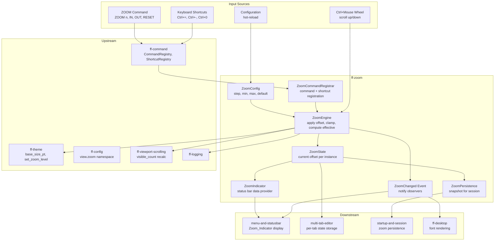

# Design Document: View Zoom (`ff-zoom`)

## Overview

The `ff-zoom` crate is the **per-editor-instance zoom management layer** for the FileForgeWorkbench platform. It controls the integer point-size offset applied to the editor base font, providing magnification and reduction of editor content without affecting workbench chrome.

### Purpose

- Maintain a signed integer Zoom_Offset per editor instance
- Compute effective font size as `max(1, base_font_size + zoom_offset)`
- Process zoom operations: increment, decrement, set absolute, reset
- Enforce configurable range limits (min/max offset) with clamping
- Coordinate with the theme system for base font size queries
- Provide zoom state for status bar indicator rendering
- Support session persistence of per-document zoom offsets
- Register keyboard shortcuts (Ctrl+=, Ctrl+-, Ctrl+0) as reserved
- Register the `ZOOM` primary command in the command framework
- Handle Ctrl+Mouse Wheel zoom gestures
- Operate correctly across multiple monitors with different DPI scales

### Position in Architecture

```
Wave 9 — Desktop Integration

┌─────────────────────────────────────────────────────────┐
│                    Application Binary                     │
│                (ffwb / GUI shell — ff-desktop)            │
├─────────────────────────────────────────────────────────┤
│  multi-tab-editor │ menu-and-statusbar │ startup-session │
│  (consumers of zoom state)                               │
├─────────────────────────────────────────────────────────┤
│               ff-zoom (THIS CRATE) — Wave 9              │
├─────────────────────────────────────────────────────────┤
│  ff-theme (Wave 6) │ ff-config (Wave 2) │ ff-command (2) │
│  ff-viewport-scrolling (Wave 4) │ ff-logging (Wave 0)    │
└─────────────────────────────────────────────────────────┘
```

### Design Constraints (Cross-Cutting)

- **GUI Independence (Req 2)**: Zero GUI framework dependencies — zoom logic is testable without egui/winit/wgpu
- **Command-Driven (Req 4)**: Zoom operations are registered commands (`view.zoom_in`, `view.zoom_out`, `view.zoom_reset`, `view.zoom`)
- **Reserved Shortcuts (Req 10)**: Ctrl+=, Ctrl+-, Ctrl+0 are reserved and non-reassignable
- **Multi-Crate Workspace (Req 7)**: Crate at `crates/ff-zoom`
- **Error Message Standards (Req 8)**: All errors follow `[zoom] operation: description` format
- **Configuration Namespace (Req 5)**: Zoom settings live under `[view.zoom]` in the configuration hierarchy

### Upstream Dependencies

- `ff-config` (Wave 2): TOML configuration for zoom defaults, step size, and range limits; hot-reload callbacks
- `ff-command` (Wave 2): Command registry for `ZOOM` command and zoom shortcuts; `ShortcutRegistry` for reserved bindings
- `ff-theme` (Wave 6): `ThemeHandle::monospace_font().base_size_pt` provides the base font size; `ThemeHandle::set_zoom_level()` applies the offset
- `ff-viewport-scrolling` (Wave 4): `ViewportModel::set_visible_count()` recalculates after zoom changes line height
- `ff-logging` (Wave 0): Diagnostic output for config warnings and zoom boundary events

### Downstream Consumers

- `ff-desktop` (GUI shell): Queries effective font size for editor rendering; handles DPI-aware pixel computation
- `menu-and-statusbar`: Reads zoom state for the Zoom_Indicator display
- `multi-tab-editor`: Stores per-tab `ZoomState` instances; routes zoom operations to the active tab
- `startup-and-session`: Persists and restores per-document zoom offsets

---

## Architecture

### High-Level Architecture Diagram



### Layer Placement

| Component | Responsibility |
|-----------|---------------|
| **ZoomConfig** | Parsed configuration: step, min_offset, max_offset, default_offset; validates and clamps on load/reload |
| **ZoomState** | Per-editor-instance mutable state: current `zoom_offset` (i32) |
| **ZoomEngine** | Core logic: applies zoom operations (in/out/set/reset), enforces clamping, computes effective font size, coordinates with theme |
| **ZoomCommandRegistrar** | Registers `view.zoom_in`, `view.zoom_out`, `view.zoom_reset`, `view.zoom` commands and reserved shortcuts |
| **ZoomIndicator** | Provides formatted zoom offset string for status bar consumption |
| **ZoomPersistence** | Serialisable zoom state snapshot tied to document URI |
| **ZoomChanged Event** | Notification emitted after any zoom offset mutation |

---

## Components and Interfaces

```
crates/ff-zoom/
├── Cargo.toml
├── src/
│   ├── lib.rs                # Public API re-exports, crate docs
│   ├── config.rs             # ZoomConfig: load, validate, hot-reload
│   ├── state.rs              # ZoomState: per-instance offset storage
│   ├── engine.rs             # ZoomEngine: zoom operations, clamping, coordination
│   ├── commands.rs           # ZoomCommandRegistrar: command + shortcut registration
│   ├── indicator.rs          # ZoomIndicator: status bar data formatting
│   ├── persistence.rs        # ZoomSnapshot: serialisation for session state
│   ├── events.rs             # ZoomChanged event, ZoomObserver trait
│   ├── types.rs              # Newtypes: ZoomOffset, ZoomStep, EffectiveFontSize
│   └── error.rs              # ZoomError enum
└── tests/
    ├── config_tests.rs       # Config validation and hot-reload tests
    ├── engine_tests.rs       # Zoom operation and clamping tests
    ├── indicator_tests.rs    # Indicator formatting tests
    ├── persistence_tests.rs  # Serialise/deserialise round-trip tests
    ├── commands_tests.rs     # Command registration and dispatch tests
    └── property_tests.rs     # Property-based tests (proptest)
```

---

## Data Models

### Core Newtypes

```rust
/// A signed integer zoom offset in typographical points.
/// Positive values enlarge text; negative values shrink it.
#[derive(Debug, Clone, Copy, PartialEq, Eq, PartialOrd, Ord, Hash)]
pub struct ZoomOffset(pub i32);

impl ZoomOffset {
    /// The zero (no-zoom) offset.
    pub const ZERO: Self = Self(0);

    /// Create a zoom offset, unclamped (clamping is done by ZoomEngine).
    pub fn new(value: i32) -> Self {
        Self(value)
    }

    /// Get the raw i32 value.
    pub fn value(self) -> i32 {
        self.0
    }

    /// Whether this offset represents the default (no zoom) state.
    pub fn is_default(self) -> bool {
        self.0 == 0
    }
}

/// The zoom step size (points added/removed per operation).
/// Invariant: always in range [1, 10].
#[derive(Debug, Clone, Copy, PartialEq, Eq)]
pub struct ZoomStep(u8);

impl ZoomStep {
    /// Default step: 1 point.
    pub const DEFAULT: Self = Self(1);

    /// Create a zoom step, clamped to [1, 10].
    pub fn new(value: u8) -> Self {
        Self(value.clamp(1, 10))
    }

    /// Get the raw value.
    pub fn value(self) -> u8 {
        self.0
    }
}

/// The effective font size after applying zoom offset to the base size.
/// Invariant: always >= 1.0 points.
#[derive(Debug, Clone, Copy, PartialEq, PartialOrd)]
pub struct EffectiveFontSize(f32);

impl EffectiveFontSize {
    /// Compute effective size from base and offset.
    /// Result is clamped to a minimum of 1.0 point.
    pub fn compute(base_size_pt: f32, offset: ZoomOffset) -> Self {
        let effective = (base_size_pt + offset.value() as f32).max(1.0);
        Self(effective)
    }

    /// Get the point size value.
    pub fn points(self) -> f32 {
        self.0
    }
}
```

### ZoomConfig

```rust
/// Configuration for the zoom subsystem, loaded from [view.zoom] TOML namespace.
///
/// Addresses: Requirement 4
#[derive(Debug, Clone, PartialEq, Eq)]
pub struct ZoomConfig {
    /// Initial zoom offset for new editor instances.
    /// Default: 0. Clamped to [min_offset, max_offset].
    pub default_offset: ZoomOffset,

    /// Points added/removed per zoom in/out operation.
    /// Default: 1. Valid range: 1–10.
    pub step: ZoomStep,

    /// Minimum permitted zoom offset.
    /// Default: -10. Valid range: -20 to 0.
    pub min_offset: i32,

    /// Maximum permitted zoom offset.
    /// Default: +60. Valid range: 0 to +100.
    pub max_offset: i32,
}

impl Default for ZoomConfig {
    fn default() -> Self {
        Self {
            default_offset: ZoomOffset::ZERO,
            step: ZoomStep::DEFAULT,
            min_offset: -10,
            max_offset: 60,
        }
    }
}

impl ZoomConfig {
    /// Validate and normalise a raw config. Emits warnings for invalid values.
    /// Returns a valid ZoomConfig with any out-of-range values clamped.
    ///
    /// Addresses: Requirement 4, criteria 1–6
    pub fn from_raw(raw: RawZoomConfig) -> (Self, Vec<ConfigWarning>);

    /// Check if an offset is within the configured range.
    pub fn is_in_range(&self, offset: ZoomOffset) -> bool {
        offset.value() >= self.min_offset && offset.value() <= self.max_offset
    }

    /// Clamp an offset to the configured range.
    pub fn clamp(&self, offset: ZoomOffset) -> ZoomOffset {
        ZoomOffset::new(offset.value().clamp(self.min_offset, self.max_offset))
    }
}

/// Raw configuration values before validation (direct from TOML parse).
#[derive(Debug, Clone)]
pub struct RawZoomConfig {
    pub default_offset: Option<i64>,
    pub step: Option<i64>,
    pub min_offset: Option<i64>,
    pub max_offset: Option<i64>,
}

/// A configuration validation warning.
#[derive(Debug, Clone, PartialEq, Eq)]
pub struct ConfigWarning {
    pub key: String,
    pub message: String,
}
```

### ZoomState

```rust
/// Per-editor-instance zoom state.
///
/// Each open document tab owns one ZoomState. The offset is independent
/// across all editor instances.
///
/// Addresses: Requirement 1, Requirement 5
#[derive(Debug, Clone, PartialEq, Eq)]
pub struct ZoomState {
    /// The current zoom offset for this editor instance.
    offset: ZoomOffset,
}

impl ZoomState {
    /// Create a new zoom state with the given initial offset.
    pub fn new(initial_offset: ZoomOffset) -> Self {
        Self { offset: initial_offset }
    }

    /// Create a new zoom state at the default (zero) offset.
    pub fn default_state() -> Self {
        Self { offset: ZoomOffset::ZERO }
    }

    /// Get the current zoom offset.
    pub fn offset(&self) -> ZoomOffset {
        self.offset
    }

    /// Set the zoom offset (caller must pre-clamp via ZoomConfig).
    pub(crate) fn set_offset(&mut self, offset: ZoomOffset) {
        self.offset = offset;
    }
}
```

### ZoomChanged Event

```rust
/// Event emitted after any zoom offset mutation on an editor instance.
///
/// Addresses: Requirement 1 AC 6 (re-layout), Requirement 7 (indicator update)
#[derive(Debug, Clone, PartialEq)]
pub struct ZoomChanged {
    /// The new zoom offset after the change.
    pub new_offset: ZoomOffset,
    /// The previous zoom offset before the change.
    pub previous_offset: ZoomOffset,
    /// The effective font size after applying the new offset.
    pub effective_size: EffectiveFontSize,
    /// Whether this change was clamped (hit a boundary).
    pub was_clamped: bool,
}

/// Observer trait for zoom state changes.
pub trait ZoomObserver: Send + Sync {
    /// Called after any zoom offset mutation.
    fn on_zoom_changed(&self, event: &ZoomChanged);
}
```

### ZoomSnapshot (Persistence)

```rust
/// Serialisable zoom state for session persistence.
/// Stored alongside cursor position and scroll state per document URI.
///
/// Addresses: Requirement 6
#[derive(Debug, Clone, PartialEq, Eq, serde::Serialize, serde::Deserialize)]
pub struct ZoomSnapshot {
    /// The zoom offset at time of snapshot.
    pub offset: i32,
}

impl ZoomSnapshot {
    /// Create a snapshot from the current zoom state.
    pub fn from_state(state: &ZoomState) -> Self {
        Self { offset: state.offset().value() }
    }

    /// Restore a ZoomState from this snapshot, clamping to the current config range.
    ///
    /// Addresses: Requirement 6 AC 3
    pub fn restore(&self, config: &ZoomConfig) -> ZoomState {
        let clamped = config.clamp(ZoomOffset::new(self.offset));
        ZoomState::new(clamped)
    }
}
```

### ZoomOperation Enum

```rust
/// All possible zoom operations that can be performed on an editor instance.
///
/// Used by the command handlers to dispatch into ZoomEngine.
#[derive(Debug, Clone, PartialEq, Eq)]
pub enum ZoomOperation {
    /// Increase offset by one step.
    ZoomIn,
    /// Decrease offset by one step.
    ZoomOut,
    /// Reset offset to zero.
    Reset,
    /// Set offset to an absolute value (clamped to range).
    SetAbsolute(i32),
    /// Query current state (no mutation — returns info).
    Query,
}
```

---

## Public API Surface

### ZoomEngine — Core Operations

```rust
/// The zoom engine applies zoom operations to a ZoomState, enforcing
/// configuration limits and coordinating with the theme system.
///
/// This is the single entry point for all zoom mutations.
pub struct ZoomEngine {
    config: ZoomConfig,
}

impl ZoomEngine {
    /// Create a zoom engine with the given configuration.
    pub fn new(config: ZoomConfig) -> Self;

    /// Get the current configuration.
    pub fn config(&self) -> &ZoomConfig;

    /// Update the configuration (e.g., from hot-reload).
    /// If any active ZoomState has an offset outside the new range,
    /// the caller must re-clamp it.
    ///
    /// Addresses: Requirement 4 AC 6
    pub fn set_config(&mut self, config: ZoomConfig);

    /// Apply a zoom-in operation: increase offset by one step.
    /// Returns the ZoomChanged event (or None if already at max).
    ///
    /// Addresses: Requirement 1 AC 5, Requirement 2 AC 1
    pub fn zoom_in(
        &self,
        state: &mut ZoomState,
        base_size_pt: f32,
    ) -> Result<ZoomChanged, ZoomError>;

    /// Apply a zoom-out operation: decrease offset by one step.
    /// Returns the ZoomChanged event (or None if already at min).
    ///
    /// Addresses: Requirement 1 AC 5, Requirement 2 AC 2
    pub fn zoom_out(
        &self,
        state: &mut ZoomState,
        base_size_pt: f32,
    ) -> Result<ZoomChanged, ZoomError>;

    /// Reset the zoom offset to zero.
    ///
    /// Addresses: Requirement 2 AC 3
    pub fn zoom_reset(
        &self,
        state: &mut ZoomState,
        base_size_pt: f32,
    ) -> Result<ZoomChanged, ZoomError>;

    /// Set the zoom offset to an absolute value (clamped to range).
    ///
    /// Addresses: Requirement 8 AC 2
    pub fn zoom_set(
        &self,
        state: &mut ZoomState,
        offset: i32,
        base_size_pt: f32,
    ) -> Result<ZoomChanged, ZoomError>;

    /// Compute the effective font size for a given state.
    ///
    /// Addresses: Requirement 1 AC 2
    pub fn effective_font_size(
        &self,
        state: &ZoomState,
        base_size_pt: f32,
    ) -> EffectiveFontSize;

    /// Check if the state is at the maximum offset.
    pub fn is_at_max(&self, state: &ZoomState) -> bool;

    /// Check if the state is at the minimum offset.
    pub fn is_at_min(&self, state: &ZoomState) -> bool;

    /// Clamp a state's offset to the current config range.
    /// Used after config hot-reload.
    ///
    /// Addresses: Requirement 4 AC 6
    pub fn clamp_to_range(
        &self,
        state: &mut ZoomState,
        base_size_pt: f32,
    ) -> Option<ZoomChanged>;

    /// Create a new ZoomState with the configured default offset.
    ///
    /// Addresses: Requirement 5 AC 2
    pub fn new_state(&self) -> ZoomState;
}
```

### ZoomCommandRegistrar — Command Integration

```rust
/// Registers zoom commands and reserved shortcuts with the command framework.
pub struct ZoomCommandRegistrar;

impl ZoomCommandRegistrar {
    /// Register all zoom commands in the command registry.
    ///
    /// Commands registered:
    /// - `view.zoom_in` — increase zoom by one step
    /// - `view.zoom_out` — decrease zoom by one step
    /// - `view.zoom_reset` — reset zoom to zero
    /// - `view.zoom` — ZOOM primary command (set/query)
    ///
    /// Addresses: Requirement 8 AC 1
    pub fn register_commands(registry: &mut CommandRegistry);

    /// Register reserved keyboard shortcuts.
    ///
    /// Shortcuts registered:
    /// - Ctrl+= → `view.zoom_in`
    /// - Ctrl+- → `view.zoom_out`
    /// - Ctrl+0 → `view.zoom_reset`
    ///
    /// These are reserved (non-reassignable).
    ///
    /// Addresses: Requirement 2 AC 5
    pub fn register_shortcuts(shortcut_registry: &mut ShortcutRegistry);
}
```

### ZoomIndicator — Status Bar Data

```rust
/// Provides formatted zoom data for the status bar.
pub struct ZoomIndicator;

impl ZoomIndicator {
    /// Format the zoom offset for status bar display.
    /// Returns None when offset is zero (indicator hidden).
    ///
    /// Format: "Zoom: +N" or "Zoom: -N"
    ///
    /// Addresses: Requirement 7 AC 1, 2, 5
    pub fn format_indicator(state: &ZoomState) -> Option<String>;

    /// Get the list of common offsets for the quick-select popup.
    ///
    /// Addresses: Requirement 7 AC 4
    pub fn quick_select_offsets() -> &'static [i32] {
        &[-5, -2, 0, 2, 5, 10]
    }

    /// Format the status message for ZOOM query (no arguments).
    ///
    /// Format: "Zoom offset: +N (effective size: Mpt)"
    ///
    /// Addresses: Requirement 8 AC 6
    pub fn format_query_message(
        state: &ZoomState,
        effective_size: EffectiveFontSize,
    ) -> String;

    /// Format the boundary-reached status message.
    ///
    /// Addresses: Requirement 2 AC 6, 7
    pub fn format_boundary_message(
        boundary: ZoomBoundary,
        limit_value: i32,
    ) -> String;
}

/// Which zoom boundary was reached.
#[derive(Debug, Clone, Copy, PartialEq, Eq)]
pub enum ZoomBoundary {
    Maximum,
    Minimum,
}
```

### ZoomPersistence — Session Integration

```rust
impl ZoomSnapshot {
    /// Create a snapshot from the current state for session persistence.
    ///
    /// Addresses: Requirement 6 AC 1
    pub fn from_state(state: &ZoomState) -> Self;

    /// Restore zoom state from a persisted snapshot, clamping to current config.
    ///
    /// Addresses: Requirement 6 AC 2, 3
    pub fn restore(&self, config: &ZoomConfig) -> ZoomState;
}
```

### ZOOM Command Handler

```rust
/// Handles the `view.zoom` primary command dispatch.
///
/// Parses command arguments and routes to the appropriate ZoomEngine method.
///
/// Supported forms:
/// - `ZOOM` — query current offset (display in status message)
/// - `ZOOM n` — set absolute offset to n
/// - `ZOOM IN` — increase by one step
/// - `ZOOM OUT` — decrease by one step
/// - `ZOOM RESET` — set to zero
///
/// Addresses: Requirement 8
pub struct ZoomCommandHandler;

impl ZoomCommandHandler {
    /// Parse ZOOM command arguments into a ZoomOperation.
    ///
    /// Addresses: Requirement 8 AC 2–6
    pub fn parse_args(args: &str) -> Result<ZoomOperation, ZoomError>;
}
```

---

## Error Handling

```rust
/// Errors originating from the ff-zoom crate.
/// Formatted per Error Message Standards (Req 8): `[zoom] operation: description`
///
/// Addresses: Cross-cutting Requirement 8
#[derive(Debug, thiserror::Error)]
#[non_exhaustive]
pub enum ZoomError {
    /// Zoom in attempted when already at maximum offset.
    #[error("[zoom] zoom_in: maximum zoom reached (+{max_offset})")]
    AtMaximum { max_offset: i32 },

    /// Zoom out attempted when already at minimum offset.
    #[error("[zoom] zoom_out: minimum zoom reached ({min_offset})")]
    AtMinimum { min_offset: i32 },

    /// Invalid argument to ZOOM command.
    #[error("[zoom] command: invalid argument '{arg}' — expected integer, IN, OUT, or RESET")]
    InvalidCommandArg { arg: String },

    /// Configuration key has invalid value.
    #[error("[zoom] config: key '{key}' has invalid value '{value}' — using default {default}")]
    InvalidConfig {
        key: String,
        value: String,
        default: String,
    },

    /// Configuration range is invalid (min >= max).
    #[error("[zoom] config: min_offset ({min}) must be less than max_offset ({max}) — using defaults (-10, +60)")]
    InvalidRange { min: i32, max: i32 },

    /// No active editor instance to apply zoom to.
    #[error("[zoom] apply: no active editor instance")]
    NoActiveEditor,
}
```

---

## Integration Points

### With `ff-config` (Configuration System — Wave 2, upstream)

- **Dependency direction**: ff-zoom depends on ff-config
- **API consumed**: Typed access for `[view.zoom]` namespace: `get_int("view.zoom.default_offset")`, `get_int("view.zoom.step")`, `get_int("view.zoom.min_offset")`, `get_int("view.zoom.max_offset")`
- **Hot-reload**: ff-zoom registers a reload callback for the `view.zoom` namespace. When config changes, it rebuilds `ZoomConfig`, emits warnings for invalid values, and clamps any active editor instances whose offsets fall outside the new range
- **Schema registration**: At startup, ff-zoom registers schema entries for all `view.zoom.*` keys with types, defaults, and valid ranges

### With `ff-command` (Command Framework — Wave 2, upstream)

- **Dependency direction**: ff-zoom depends on ff-command
- **API consumed**: `CommandRegistry::register()` for command registration; `ShortcutRegistry::register_reserved()` for non-reassignable shortcut bindings; `CommandId` for command identity
- **Commands registered**:
  - `view.zoom_in` — metadata: "Zoom In", category: "View"
  - `view.zoom_out` — metadata: "Zoom Out", category: "View"
  - `view.zoom_reset` — metadata: "Reset Zoom", category: "View"
  - `view.zoom` — metadata: "ZOOM", category: "View", primary command
- **Undo integration**: Zoom commands are NOT recorded on the undo stack (Requirement 8 AC 9). They do not produce `UndoRecord` values
- **History**: Zoom commands are NOT added to command history (Requirement 8 AC 8)
- **Reserved shortcuts**: Ctrl+= (`view.zoom_in`), Ctrl+- (`view.zoom_out`), Ctrl+0 (`view.zoom_reset`) — registered via `register_reserved()` which prevents user override

### With `ff-theme` (Theme & Appearance — Wave 6, upstream)

- **Dependency direction**: ff-zoom depends on ff-theme
- **API consumed**: `ThemeHandle::monospace_font().base_size_pt` for the base font size used in effective size computation; `ThemeHandle::set_zoom_level(offset)` to push the current zoom offset into the theme system for rendering
- **Coordination**: When zoom offset changes, ff-zoom calls `ThemeHandle::set_zoom_level()` with the new offset. The theme system then serves the correct `effective_monospace_size()` to the rendering layer
- **DPI independence**: The zoom offset is a point-size offset. The theme/rendering layer handles DPI-to-pixel conversion independently (Requirement 9)

### With `ff-viewport-scrolling` (Viewport & Scrolling — Wave 4, downstream consumer)

- **Dependency direction**: ff-viewport-scrolling is a peer; the owning editor session coordinates between them
- **Integration**: When zoom offset changes, the editor session notifies the viewport model because `visible_count` changes (larger font → fewer visible lines). The session recalculates line height and calls `ViewportModel::set_visible_count()` and `ViewportModel::set_line_height()`
- **Cursor preservation**: After zoom changes, the session ensures the cursor line remains visible by invoking `CaretPolicyEngine::compute_vertical_scroll()` (Requirement 1 AC 7)

### With `menu-and-statusbar` (Wave 6, downstream consumer)

- **Dependency direction**: menu-and-statusbar depends on ff-zoom (reads zoom state)
- **API consumed**: `ZoomIndicator::format_indicator()` for status bar display; `ZoomState::offset()` for indicator visibility logic
- **Indicator position**: After encoding display, before line/column display (Requirement 7 AC 3)
- **Click action**: Status bar click opens a zoom popup using `ZoomIndicator::quick_select_offsets()` (Requirement 7 AC 4)

### With `multi-tab-editor` (Wave 8, downstream consumer)

- **Dependency direction**: multi-tab-editor depends on ff-zoom
- **Integration**: Each editor tab stores a `ZoomState` instance. When the user switches tabs, the tab manager notifies the status bar to update the zoom indicator to the new tab's offset (Requirement 5 AC 3)
- **Tab creation**: New tabs initialise their `ZoomState` via `ZoomEngine::new_state()` which applies the configured `default_offset` (Requirement 5 AC 2)
- **Tab split**: Split views clone the source tab's current `ZoomState` (Requirement 5 AC 4)

### With `startup-and-session` (Wave 8, downstream consumer)

- **Dependency direction**: startup-and-session depends on ff-zoom
- **API consumed**: `ZoomSnapshot::from_state()` to capture zoom state on exit; `ZoomSnapshot::restore()` to reinstate zoom on session restore
- **Storage**: Per-document zoom offsets are stored alongside cursor/scroll state in the session store, keyed by document resource URI (Requirement 6 AC 4)

### With `ff-logging` (Foundation — Wave 0, upstream)

- **Dependency direction**: ff-zoom depends on ff-logging
- **API consumed**: `log_info!`, `log_warn!`, `log_debug!` macros
- **Usage**: Config validation warnings at WARN; zoom boundary events at DEBUG; config reload at INFO
- **Log prefix**: `[zoom]`

### Dependency Direction Summary

```
ff-logging      ← ff-zoom
ff-config       ← ff-zoom
ff-command      ← ff-zoom
ff-theme        ← ff-zoom
ff-zoom         ← multi-tab-editor (per-tab state)
ff-zoom         ← menu-and-statusbar (indicator)
ff-zoom         ← startup-and-session (persistence)
ff-zoom         ← ff-desktop (effective size for rendering)
```

---

## Configuration

ff-zoom owns the `[view.zoom]` namespace in the workbench TOML configuration file.

### TOML Schema

```toml
[view.zoom]
# Initial zoom offset for new editor instances.
# Type: integer. Default: 0. Valid range: [min_offset, max_offset]
default_offset = 0

# Points added/removed per zoom in/out operation.
# Type: integer. Default: 1. Valid range: 1–10
step = 1

# Minimum permitted zoom offset (most zoomed-out).
# Type: integer. Default: -10. Valid range: -20 to 0
min_offset = -10

# Maximum permitted zoom offset (most zoomed-in).
# Type: integer. Default: 60. Valid range: 0 to 100
max_offset = 60
```

### Config Resolution Rules

| Setting | Absent | Invalid Type | Out of Range | Semantic Error |
|---------|--------|--------------|--------------|----------------|
| `default_offset` | Default to 0 | Default to 0 + WARN | Clamp to [min, max] + WARN | — |
| `step` | Default to 1 | Default to 1 + WARN | Clamp to [1, 10] + WARN | — |
| `min_offset` | Default to -10 | Default to -10 + WARN | Clamp to [-20, 0] + WARN | — |
| `max_offset` | Default to +60 | Default to +60 + WARN | Clamp to [0, 100] + WARN | — |
| `min_offset` ≥ `max_offset` | — | — | — | Both default to (-10, +60) + WARN |

---

## Correctness Properties

The following properties are suitable for property-based testing with the `proptest` crate. Each property is universal — it must hold for all valid inputs.

### Property 1: Offset Clamping Invariant

**Statement:** After any zoom operation, the zoom offset is always within `[min_offset, max_offset]`.

```
∀ ZoomState S, ∀ ZoomOperation O, ∀ ZoomConfig C:
    apply(O, S, C);
    S.offset().value() >= C.min_offset ∧ S.offset().value() <= C.max_offset
```

**Validates: Requirements 1.5, 4.1**

### Property 2: Effective Font Size Minimum

**Statement:** The effective font size is always at least 1.0 point, regardless of zoom offset and base size.

```
∀ base_size_pt ∈ [1.0, 72.0], ∀ offset ∈ [min_offset, max_offset]:
    EffectiveFontSize::compute(base_size_pt, offset).points() >= 1.0
```

**Validates: Requirements 1.2**

### Property 3: Zoom In/Out Symmetry

**Statement:** Zooming in then zooming out returns to the original offset (unless clamped at a boundary).

```
∀ ZoomState S where S.offset().value() > min_offset ∧ S.offset().value() < max_offset:
    let original = S.offset();
    engine.zoom_in(&mut S, base);
    engine.zoom_out(&mut S, base);
    S.offset() == original
```

**Validates: Requirements 2.1, 2.2**

### Property 4: Reset Always Produces Zero

**Statement:** After a zoom reset, the offset is always zero regardless of previous state.

```
∀ ZoomState S, ∀ ZoomConfig C where C.min_offset <= 0 ∧ C.max_offset >= 0:
    engine.zoom_reset(&mut S, base);
    S.offset() == ZoomOffset::ZERO
```

**Validates: Requirements 2.3, 8.5**

### Property 5: Set Absolute Clamping

**Statement:** Setting an absolute offset always produces a value within `[min_offset, max_offset]`, regardless of the input value.

```
∀ n ∈ i32, ∀ ZoomConfig C:
    engine.zoom_set(&mut S, n, base);
    S.offset().value() >= C.min_offset ∧ S.offset().value() <= C.max_offset
```

**Validates: Requirements 8.2**

### Property 6: Per-Instance Independence

**Statement:** Applying a zoom operation to one ZoomState does not affect any other ZoomState.

```
∀ ZoomState S1, S2, ∀ ZoomOperation O:
    let s2_before = S2.clone();
    apply(O, &mut S1, config);
    S2 == s2_before
```

**Validates: Requirements 1.10, 5.1**

### Property 7: Config Validation Consistency

**Statement:** After `ZoomConfig::from_raw()`, the resulting config always satisfies `min_offset < max_offset` and `default_offset ∈ [min_offset, max_offset]`.

```
∀ RawZoomConfig R:
    let (config, _warnings) = ZoomConfig::from_raw(R);
    config.min_offset < config.max_offset
    ∧ config.default_offset.value() >= config.min_offset
    ∧ config.default_offset.value() <= config.max_offset
    ∧ config.step.value() >= 1
    ∧ config.step.value() <= 10
```

**Validates: Requirements 4.1, 4.2, 4.3, 4.4**

### Property 8: Snapshot Round-Trip

**Statement:** Serialising a ZoomState to a snapshot and restoring it produces the same offset (when within range) or a clamped-equivalent offset.

```
∀ ZoomState S, ∀ ZoomConfig C:
    let snap = ZoomSnapshot::from_state(&S);
    let restored = snap.restore(&C);
    restored.offset() == C.clamp(S.offset())
```

**Validates: Requirements 6.1, 6.2, 6.3**

### Property 9: Zoom Step Monotonicity

**Statement:** Zooming in always increases the offset (by exactly `step`), and zooming out always decreases it (by exactly `step`), unless clamped.

```
∀ ZoomState S where S.offset().value() + step <= max_offset:
    let before = S.offset().value();
    engine.zoom_in(&mut S, base);
    S.offset().value() == before + config.step.value() as i32

∀ ZoomState S where S.offset().value() - step >= min_offset:
    let before = S.offset().value();
    engine.zoom_out(&mut S, base);
    S.offset().value() == before - config.step.value() as i32
```

**Validates: Requirements 2.1, 2.2, 3.1, 3.2**

### Property 10: Indicator Visibility Consistency

**Statement:** The zoom indicator is shown if and only if the offset is non-zero.

```
∀ ZoomState S:
    ZoomIndicator::format_indicator(&S).is_some() ⟺ !S.offset().is_default()
```

**Validates: Requirements 7.1, 7.2**

---

## Testing Strategy

### Unit Tests

- **config_tests.rs**: Validates `ZoomConfig::from_raw()` with valid, invalid, out-of-range, and missing values. Verifies warning generation and default fallback behaviour.
- **engine_tests.rs**: Exercises all `ZoomEngine` methods — `zoom_in`, `zoom_out`, `zoom_reset`, `zoom_set`, boundary clamping, effective size computation.
- **indicator_tests.rs**: Verifies `ZoomIndicator::format_indicator()` returns `None` for zero offset, correct `"Zoom: +N"` / `"Zoom: -N"` strings for non-zero offsets, and correct boundary messages.
- **persistence_tests.rs**: Round-trip serialisation/deserialisation of `ZoomSnapshot`; restore with clamping when config range changed.
- **commands_tests.rs**: Parsing of `ZOOM` command arguments — valid integers, `IN`, `OUT`, `RESET`, empty (query), and invalid inputs.

### Property-Based Tests (proptest)

- **property_tests.rs**: Implements Properties 1–10 defined above. Each property test runs a minimum of 256 cases with strategies covering the full configuration and offset space.
- Strategies generate: arbitrary `ZoomConfig` (respecting `min < max`), arbitrary `ZoomOffset` within and outside range, arbitrary `base_size_pt` in `[1.0, 72.0]`, and arbitrary `ZoomOperation` sequences.

### Integration Tests

- **Full flow**: Config load → engine creation → zoom in/out/set/reset → indicator format → snapshot → restore cycle.
- **Hot-reload**: Simulate config change mid-session, verify active states are clamped and events emitted.
- **Command dispatch**: Register commands, invoke via simulated command framework dispatch, verify state mutations.

### What Is NOT Tested (GUI/Manual)

- Actual keyboard input routing (Ctrl+=, Ctrl+-, Ctrl+0) — requires running GUI shell
- Mouse wheel scroll capture and Ctrl modifier detection — requires windowing system
- Status bar visual rendering and click interaction — requires egui frame
- DPI-aware physical pixel rendering — requires multi-monitor hardware
- These are marked as 🔲 MANUAL in the TCR
