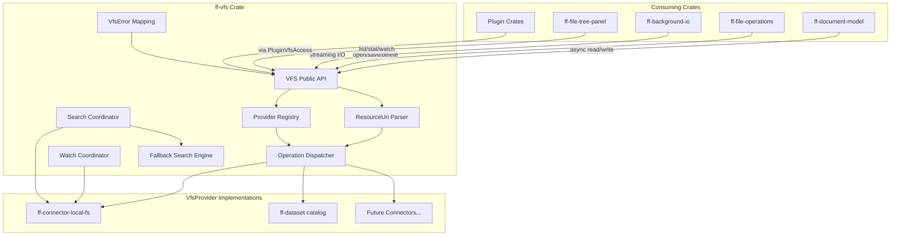

# Design Document: Virtual File System (`ff-vfs`)

## 1. Overview

The `ff-vfs` crate is the **Virtual File System abstraction layer** for the FileForgeWorkbench platform. It implements the overriding architectural principle **FFW-ARCH-001**: all content access throughout the workbench flows through this single abstraction layer. No consuming crate ever calls `std::fs` or `tokio::fs` directly.

### Purpose

- Provide the sole public API for all file and resource access across `ff-*` crates
- Define the `VfsProvider` trait that all storage backends implement
- Manage a Provider Registry for dynamic provider registration/deregistration
- Define the `ResourceUri` type implementing the `vfs://provider/path` addressing scheme
- Expose async method signatures (Tokio-based) for all I/O operations
- Define provider-agnostic file watching and content search abstractions
- Define a unified `VfsError` type abstracting provider-specific errors

### Position in Architecture

```
┌─────────────────────────────────────────────────────────────┐
│              Shell Layer: ff-desktop (egui)                   │
├─────────────────────────────────────────────────────────────┤
│  Feature Crates: ff-document-model, ff-file-operations, etc. │
│         (ALL access content exclusively through ff-vfs)       │
├─────────────────────────────────────────────────────────────┤
│  Core Layer: ff-core, ff-command, ff-plugin, ff-config        │
│              ff-vfs (THIS CRATE) ← Wave 3                     │
├─────────────────────────────────────────────────────────────┤
│              Foundation Layer: ff-logging                     │
└─────────────────────────────────────────────────────────────┘
```

### Design Constraints (Cross-Cutting)

- **FFW-ARCH-001 (Req 1)**: ALL content access goes through VFS — no `std::fs` in consuming crates
- **GUI Independence (Req 2)**: ff-vfs has zero GUI dependencies — no egui, winit, wgpu
- **Plugin Architecture (Req 3)**: VFS providers can be contributed by plugins via `connector-extensibility`
- **Async I/O (Req 6)**: All I/O methods are async, compatible with Tokio runtime managed by `ff-core`
- **Multi-Crate Workspace (Req 7)**: Crate at `crates/ff-vfs`
- **Error Message Standards (Req 8)**: Errors follow `[vfs] operation: description` format with resource URI

---

## 2. Architecture

### High-Level Architecture Diagram



### Layer Placement

| Component | Responsibility |
|-----------|---------------|
| **VFS Public API** | Top-level async functions that consumers call (open, read, write, list, stat, etc.) |
| **ResourceUri** | URI parsing, validation, construction, component extraction |
| **Provider Registry** | Thread-safe registry of `VfsProvider` instances keyed by scheme |
| **Operation Dispatcher** | Extracts scheme from URI, looks up provider, delegates operation |
| **Watch Coordinator** | Manages watch subscriptions, debouncing, event delivery |
| **Search Coordinator** | Routes search to provider-native or fallback implementation |
| **Fallback Search Engine** | Generic search via list + read_stream for providers without native search |
| **VfsError Mapping** | Converts provider-specific errors to unified `VfsError` variants |

### Request Flow

```
Consumer calls vfs.read("vfs://local/home/user/file.txt")
    │
    ▼
ResourceUri::parse("vfs://local/home/user/file.txt")
    │  scheme = "vfs", provider = "local", path = "/home/user/file.txt"
    ▼
ProviderRegistry::get("local") → &dyn VfsProvider
    │
    ▼
provider.read("/home/user/file.txt").await
    │
    ▼
Result<Vec<u8>, VfsError> → returned to consumer
```

---

## 3. Module Structure

```
crates/ff-vfs/
├── Cargo.toml
├── src/
│   ├── lib.rs              # Public API re-exports, crate docs
│   ├── uri.rs              # ResourceUri type: parse, validate, construct, Display, FromStr
│   ├── provider.rs         # VfsProvider trait definition, VfsCapabilities
│   ├── registry.rs         # ProviderRegistry: registration, lookup, deregistration
│   ├── operations.rs       # Top-level VFS operations (open, read, write, etc.)
│   ├── file.rs             # VfsFile handle, open options, write modes
│   ├── entry.rs            # VfsEntry, VfsEntryType, VfsMetadata
│   ├── watch.rs            # WatchHandle, WatchEvent, WatchOptions, debounce logic
│   ├── search.rs           # VfsSearchResult, SearchOptions, SearchStream
│   ├── fallback_search.rs  # Generic fallback search implementation
│   ├── capabilities.rs     # VfsCapabilities bitflags and capability queries
│   ├── error.rs            # VfsError enum, context helpers, Display impl
│   └── copy.rs             # Cross-provider copy implementation
└── tests/
    ├── uri_tests.rs        # ResourceUri parsing/validation property tests
    ├── registry_tests.rs   # ProviderRegistry thread-safety and routing tests
    ├── operations_tests.rs # VFS operation dispatch tests (with mock provider)
    ├── watch_tests.rs      # Watch event delivery and debounce tests
    ├── search_tests.rs     # Search coordinator and fallback tests
    └── integration.rs      # End-to-end VFS operations with in-memory provider
```

---

## 4. Key Data Models and Types

### ResourceUri

```rust
/// A unified resource identifier in the format `vfs://provider/path`.
/// Uniquely identifies any resource regardless of its backing store.
///
/// Addresses: Requirement 2, criteria 1–10
#[derive(Debug, Clone, PartialEq, Eq, Hash)]
pub struct ResourceUri {
    /// The provider scheme identifier (e.g., "local", "catalog")
    provider: String,
    /// The provider-specific path
    path: String,
    /// Optional query parameters
    query: Option<HashMap<String, String>>,
}

impl ResourceUri {
    /// Parse a URI string into a ResourceUri.
    /// Validates scheme is "vfs", provider is non-empty and valid, path is non-empty.
    ///
    /// Addresses: Requirement 2 AC 3, AC 4, AC 5
    pub fn parse(uri: &str) -> Result<Self, VfsError>;

    /// Construct a ResourceUri from components without re-parsing.
    pub fn new(provider: impl Into<String>, path: impl Into<String>) -> Self;

    /// Construct with query parameters.
    pub fn with_query(
        provider: impl Into<String>,
        path: impl Into<String>,
        query: HashMap<String, String>,
    ) -> Self;

    /// Get the provider scheme identifier.
    pub fn provider(&self) -> &str;

    /// Get the provider-specific path.
    pub fn path(&self) -> &str;

    /// Get optional query parameters.
    pub fn query(&self) -> Option<&HashMap<String, String>>;

    /// Interpret a bare path as local filesystem URI.
    /// Addresses: Requirement 2 AC 10
    pub fn from_bare_path(path: impl Into<String>) -> Self;
}

impl Display for ResourceUri { /* produces "vfs://provider/path?key=value" */ }
impl FromStr for ResourceUri { /* delegates to parse() */ }
```

### VfsProvider Trait

```rust
/// The core trait that all storage backend implementations must implement.
/// Object-safe for dynamic dispatch via `dyn VfsProvider`.
/// All methods are async, compatible with the Tokio runtime.
///
/// Addresses: Requirement 4, criteria 1–10
#[async_trait::async_trait]
pub trait VfsProvider: Send + Sync {
    /// Returns the unique scheme identifier for this provider (e.g., "local", "catalog").
    /// Addresses: Requirement 4 AC 6
    fn scheme(&self) -> &str;

    /// Returns the capabilities this provider supports.
    /// Addresses: Requirement 4 AC 4
    fn capabilities(&self) -> VfsCapabilities;

    /// Open a resource for reading and/or writing.
    /// Addresses: Requirement 4 AC 2
    async fn open(&self, path: &str, options: OpenOptions) -> Result<Box<dyn VfsFile>, VfsError>;

    /// Read entire resource content into memory.
    /// Addresses: Requirement 4 AC 2
    async fn read(&self, path: &str) -> Result<Vec<u8>, VfsError>;

    /// Read resource content as an async byte stream.
    /// Addresses: Requirement 4 AC 2
    async fn read_stream(
        &self,
        path: &str,
    ) -> Result<Pin<Box<dyn AsyncRead + Send>>, VfsError>;

    /// Write data to a resource (create or overwrite based on options).
    /// Addresses: Requirement 4 AC 2
    async fn write(&self, path: &str, data: &[u8]) -> Result<(), VfsError>;

    /// Create a new resource or container.
    /// Addresses: Requirement 4 AC 2
    async fn create(&self, path: &str, options: CreateOptions) -> Result<(), VfsError>;

    /// Delete a resource or container.
    /// Addresses: Requirement 4 AC 2
    async fn delete(&self, path: &str, options: DeleteOptions) -> Result<(), VfsError>;

    /// Rename/move a resource within this provider's namespace.
    /// Addresses: Requirement 4 AC 2
    async fn rename(&self, old_path: &str, new_path: &str) -> Result<(), VfsError>;

    /// List directory/container contents.
    /// Addresses: Requirement 4 AC 2
    async fn list(&self, path: &str) -> Result<Vec<VfsEntry>, VfsError>;

    /// Get resource metadata.
    /// Addresses: Requirement 4 AC 2
    async fn stat(&self, path: &str) -> Result<VfsMetadata, VfsError>;

    /// Check if a resource exists.
    /// Addresses: Requirement 4 AC 2
    async fn exists(&self, path: &str) -> Result<bool, VfsError>;

    /// Watch a resource or directory for changes.
    /// Default returns UnsupportedOperation for providers that don't support watching.
    /// Addresses: Requirement 4 AC 9
    async fn watch(
        &self,
        path: &str,
        options: WatchOptions,
    ) -> Result<WatchHandle, VfsError> {
        Err(VfsError::UnsupportedOperation {
            operation: "watch".to_string(),
            provider: self.scheme().to_string(),
        })
    }

    /// Search within this provider's scope.
    /// Default returns UnsupportedOperation for providers without native search.
    /// Addresses: Requirement 4 AC 10
    async fn search(
        &self,
        path: &str,
        query: &SearchQuery,
    ) -> Result<Pin<Box<dyn Stream<Item = VfsSearchResult> + Send>>, VfsError> {
        Err(VfsError::UnsupportedOperation {
            operation: "search".to_string(),
            provider: self.scheme().to_string(),
        })
    }
}
```

### VfsCapabilities

```rust
/// Bitflag-style capabilities that a provider can declare.
/// Consumers check capabilities before invoking operations.
///
/// Addresses: Requirement 4 AC 4, AC 5
#[derive(Debug, Clone, Copy, PartialEq, Eq)]
pub struct VfsCapabilities {
    bits: u32,
}

impl VfsCapabilities {
    pub const READ: Self = Self { bits: 1 << 0 };
    pub const WRITE: Self = Self { bits: 1 << 1 };
    pub const DELETE: Self = Self { bits: 1 << 2 };
    pub const RENAME: Self = Self { bits: 1 << 3 };
    pub const LIST: Self = Self { bits: 1 << 4 };
    pub const WATCH: Self = Self { bits: 1 << 5 };
    pub const SEARCH: Self = Self { bits: 1 << 6 };
    pub const RANDOM_ACCESS: Self = Self { bits: 1 << 7 };
    pub const APPEND: Self = Self { bits: 1 << 8 };

    pub fn contains(&self, other: Self) -> bool;
    pub fn union(self, other: Self) -> Self;
    pub fn empty() -> Self;
    pub fn all() -> Self;
}
```

### ProviderRegistry

```rust
/// Thread-safe registry of VfsProvider instances, indexed by scheme.
/// Supports runtime registration, deregistration, and discovery.
///
/// Addresses: Requirement 3, criteria 1–10
pub struct ProviderRegistry {
    /// Provider storage keyed by scheme identifier
    providers: Arc<RwLock<HashMap<String, Arc<dyn VfsProvider>>>>,
    /// The default provider scheme (typically "local")
    default_scheme: Arc<RwLock<String>>,
}

impl ProviderRegistry {
    /// Create a new empty registry with "local" as the default scheme.
    pub fn new() -> Self;

    /// Register a provider with its scheme. Returns error on duplicate scheme.
    /// Addresses: Requirement 3 AC 2, AC 3
    pub fn register(&self, provider: Arc<dyn VfsProvider>) -> Result<(), VfsError>;

    /// Deregister a provider by scheme. Returns error if not found.
    /// Addresses: Requirement 3 AC 10
    pub fn deregister(&self, scheme: &str) -> Result<Arc<dyn VfsProvider>, VfsError>;

    /// Look up a provider by scheme.
    /// Addresses: Requirement 3 AC 5
    pub fn get(&self, scheme: &str) -> Result<Arc<dyn VfsProvider>, VfsError>;

    /// List all registered provider schemes.
    /// Addresses: Requirement 3 AC 4
    pub fn list_schemes(&self) -> Vec<String>;

    /// Get the default provider (for bare paths).
    /// Addresses: Requirement 3 AC 8, AC 9
    pub fn default_provider(&self) -> Result<Arc<dyn VfsProvider>, VfsError>;

    /// Set the default provider scheme.
    pub fn set_default_scheme(&self, scheme: &str);

    /// Query capabilities of a specific provider.
    pub fn provider_capabilities(&self, scheme: &str) -> Result<VfsCapabilities, VfsError>;
}
```

### Provider Access Pattern

When dispatching operations to a `VfsProvider`, the `ProviderRegistry` read lock MUST NOT be held
across the async call boundary. The correct pattern is:

1. Acquire read lock on the registry
2. Clone the `Arc<dyn VfsProvider>` for the target scheme
3. Release the read lock immediately
4. Call the async provider method on the cloned Arc

This ensures that provider registration/deregistration is never blocked by long-running I/O operations.
The `Vfs` facade struct implements this pattern internally — consumers of the public API do not need
to manage this.

### VfsFile Trait

```rust
/// A handle to an open resource. Supports async read and write.
/// Returned by VfsProvider::open().
///
/// Addresses: Requirement 5, criteria 1–3
#[async_trait::async_trait]
pub trait VfsFile: Send + Sync {
    /// Read bytes from the file into the buffer. Returns bytes read.
    async fn read(&mut self, buf: &mut [u8]) -> Result<usize, VfsError>;

    /// Write bytes to the file. Returns bytes written.
    async fn write(&mut self, data: &[u8]) -> Result<usize, VfsError>;

    /// Flush all buffers.
    async fn flush(&mut self) -> Result<(), VfsError>;

    /// Sync all data and metadata to durable storage (fsync equivalent).
    /// Addresses: Requirement 5 AC 3
    async fn sync_all(&mut self) -> Result<(), VfsError>;

    /// Close the file handle, releasing resources.
    async fn close(self: Box<Self>) -> Result<(), VfsError>;
}
```

### VfsEntry and VfsMetadata

```rust
/// An entry in a directory listing.
///
/// Addresses: Requirement 6 AC 1, AC 6
#[derive(Debug, Clone, PartialEq, Eq)]
pub struct VfsEntry {
    /// Entry name (file or directory name, not full path)
    pub name: String,
    /// Type of the entry
    pub entry_type: VfsEntryType,
    /// Size in bytes (if applicable — None for directories on some providers)
    pub size: Option<u64>,
    /// Last modified time (if available)
    pub modified: Option<SystemTime>,
}

/// The type of a VFS entry.
///
/// Addresses: Requirement 6 AC 6
#[derive(Debug, Clone, Copy, PartialEq, Eq, Hash)]
#[non_exhaustive]
pub enum VfsEntryType {
    File,
    Directory,
    Symlink,
    Other,
}

/// Metadata for a resource.
///
/// Addresses: Requirement 6 AC 4
#[derive(Debug, Clone)]
pub struct VfsMetadata {
    /// Size in bytes (if applicable)
    pub size: Option<u64>,
    /// Last modified time
    pub modified: Option<SystemTime>,
    /// Resource type
    pub entry_type: VfsEntryType,
    /// Provider-specific metadata key-value pairs
    pub extra: HashMap<String, String>,
}
```

### Watch Types

```rust
/// Options for watch subscriptions.
///
/// Addresses: Requirement 7 AC 5, AC 8
#[derive(Debug, Clone)]
pub struct WatchOptions {
    /// Minimum interval between consecutive events for the same resource.
    /// Default: 100ms.
    pub debounce: Duration,
    /// Whether to watch recursively (directory watch).
    pub recursive: bool,
}

impl Default for WatchOptions {
    fn default() -> Self {
        Self {
            debounce: Duration::from_millis(100),
            recursive: false,
        }
    }
}

/// A handle to an active watch subscription.
/// Dropping the handle cancels the watch.
///
/// Addresses: Requirement 7 AC 1, AC 3, AC 4
pub struct WatchHandle {
    /// Async receiver for watch events
    receiver: tokio::sync::mpsc::Receiver<WatchEvent>,
    /// Cancellation token to stop the watch
    cancel: tokio_util::sync::CancellationToken,
}

impl WatchHandle {
    /// Receive the next watch event. Returns None when watch is cancelled.
    pub async fn recv(&mut self) -> Option<WatchEvent>;

    /// Cancel the watch subscription, releasing all resources.
    pub fn cancel(&self);
}

/// Events emitted when a watched resource changes.
///
/// Addresses: Requirement 7 AC 2
#[derive(Debug, Clone, PartialEq, Eq)]
#[non_exhaustive]
pub enum WatchEvent {
    /// A new resource was created
    Created { uri: ResourceUri },
    /// Resource content was modified
    Modified { uri: ResourceUri },
    /// Resource was deleted
    Deleted { uri: ResourceUri },
    /// Resource was renamed/moved
    Renamed { old_uri: ResourceUri, new_uri: ResourceUri },
}
```

### Search Types

```rust
/// A search query with pattern and options.
///
/// Addresses: Requirement 8 AC 7
#[derive(Debug, Clone)]
pub struct SearchQuery {
    /// The search pattern (text or regex)
    pub pattern: String,
    /// Search options
    pub options: SearchOptions,
}

/// Options controlling search behaviour.
///
/// Addresses: Requirement 8 AC 7
#[derive(Debug, Clone)]
pub struct SearchOptions {
    /// Whether the search is case-sensitive
    pub case_sensitive: bool,
    /// Whether to match whole words only
    pub whole_word: bool,
    /// Whether the pattern is a regex
    pub regex_mode: bool,
    /// Maximum number of results to return (0 = unlimited)
    pub max_results: usize,
    /// Include glob patterns (files to search)
    pub include_patterns: Vec<String>,
    /// Exclude glob patterns (files to skip)
    pub exclude_patterns: Vec<String>,
    /// Maximum file size to search (bytes, 0 = unlimited)
    pub max_file_size: u64,
}

impl Default for SearchOptions {
    fn default() -> Self {
        Self {
            case_sensitive: true,
            whole_word: false,
            regex_mode: false,
            max_results: 0,
            include_patterns: Vec::new(),
            exclude_patterns: Vec::new(),
            max_file_size: 0,
        }
    }
}

/// A single search result.
///
/// Addresses: Requirement 8 AC 3
#[derive(Debug, Clone)]
pub struct VfsSearchResult {
    /// URI of the resource containing the match
    pub uri: ResourceUri,
    /// Line number (1-based) of the match
    pub line: usize,
    /// Column (0-based byte offset within line) of the match start
    pub column: usize,
    /// Byte offset from file start
    pub byte_offset: u64,
    /// The matching line content (context snippet)
    pub context: String,
}
```

### Open/Create/Delete Options

```rust
/// Options for opening a resource.
///
/// Addresses: Requirement 5 AC 1, AC 2
#[derive(Debug, Clone)]
pub struct OpenOptions {
    /// Open for reading
    pub read: bool,
    /// Open for writing
    pub write: bool,
    /// Create the resource if it doesn't exist
    pub create: bool,
    /// Truncate existing content (overwrite mode)
    pub truncate: bool,
    /// Open in append mode
    pub append: bool,
}

impl OpenOptions {
    pub fn read_only() -> Self;
    pub fn write_only() -> Self;
    pub fn read_write() -> Self;
    pub fn create_new() -> Self;
    pub fn append() -> Self;
}

/// Options for creating a resource.
///
/// Addresses: Requirement 6 AC 2
#[derive(Debug, Clone)]
pub struct CreateOptions {
    /// Whether to create intermediate containers (mkdir -p behaviour)
    pub create_parents: bool,
    /// Whether this is a container/directory (vs a file)
    pub is_directory: bool,
}

/// Options for deleting a resource.
///
/// Addresses: Requirement 6 AC 3
#[derive(Debug, Clone)]
pub struct DeleteOptions {
    /// Whether to recursively delete container contents
    pub recursive: bool,
}
```

---

## 5. Public API Surface

### Vfs — Top-Level Facade

```rust
/// The top-level VFS facade. Consumers interact with this type
/// for all file and resource operations. Thread-safe, cloneable.
///
/// Addresses: Requirement 1, criteria 1–6
#[derive(Clone)]
pub struct Vfs {
    registry: Arc<ProviderRegistry>,
}

impl Vfs {
    /// Create a new VFS instance with an empty provider registry.
    pub fn new() -> Self;

    /// Create a VFS with a pre-configured registry.
    pub fn with_registry(registry: ProviderRegistry) -> Self;

    /// Access the provider registry for registration/discovery.
    pub fn registry(&self) -> &ProviderRegistry;
}
```

### File Operations API

```rust
impl Vfs {
    /// Open a resource by URI for reading and/or writing.
    /// Addresses: Requirement 5 AC 1, AC 2, AC 10
    pub async fn open(&self, uri: &ResourceUri, options: OpenOptions) -> Result<Box<dyn VfsFile>, VfsError>;

    /// Read entire resource content by URI.
    /// Addresses: Requirement 5 AC 10
    pub async fn read(&self, uri: &ResourceUri) -> Result<Vec<u8>, VfsError>;

    /// Read resource as async byte stream.
    /// Addresses: Requirement 5 AC 1
    pub async fn read_stream(&self, uri: &ResourceUri) -> Result<Pin<Box<dyn AsyncRead + Send>>, VfsError>;

    /// Write data to a resource (create or overwrite).
    /// Addresses: Requirement 5 AC 10
    pub async fn write(&self, uri: &ResourceUri, data: &[u8]) -> Result<(), VfsError>;

    /// Save with durability guarantee (write + flush + fsync).
    /// Addresses: Requirement 5 AC 3
    pub async fn save(&self, uri: &ResourceUri, data: &[u8]) -> Result<(), VfsError>;

    /// Delete a resource.
    /// Addresses: Requirement 5 AC 4, AC 10
    pub async fn delete(&self, uri: &ResourceUri, options: DeleteOptions) -> Result<(), VfsError>;

    /// Rename/move a resource within the same provider.
    /// Addresses: Requirement 5 AC 5, AC 6
    pub async fn rename(&self, old_uri: &ResourceUri, new_uri: &ResourceUri) -> Result<(), VfsError>;

    /// Copy between providers (streaming async copy).
    /// Addresses: Requirement 5 AC 7
    pub async fn copy(&self, src: &ResourceUri, dst: &ResourceUri) -> Result<(), VfsError>;

    /// Convenience: open a resource from a string URI or bare path.
    /// Bare paths are interpreted as local filesystem (Requirement 2 AC 10).
    pub async fn open_str(&self, uri_or_path: &str, options: OpenOptions) -> Result<Box<dyn VfsFile>, VfsError>;

    /// Convenience: read from a string URI or bare path.
    pub async fn read_str(&self, uri_or_path: &str) -> Result<Vec<u8>, VfsError>;
}
```

### Directory/Container Operations API

```rust
impl Vfs {
    /// List directory/container contents.
    /// Addresses: Requirement 6 AC 1, AC 7, AC 8
    pub async fn list(&self, uri: &ResourceUri) -> Result<Vec<VfsEntry>, VfsError>;

    /// Create a directory/container.
    /// Addresses: Requirement 6 AC 2
    pub async fn create_dir(&self, uri: &ResourceUri, options: CreateOptions) -> Result<(), VfsError>;

    /// Get resource metadata.
    /// Addresses: Requirement 6 AC 4
    pub async fn stat(&self, uri: &ResourceUri) -> Result<VfsMetadata, VfsError>;

    /// Check if a resource exists.
    /// Addresses: Requirement 6 AC 5
    pub async fn exists(&self, uri: &ResourceUri) -> Result<bool, VfsError>;
}
```

### Watch API

```rust
impl Vfs {
    /// Watch a resource or directory for changes.
    /// Addresses: Requirement 7, criteria 1–8
    pub async fn watch(&self, uri: &ResourceUri, options: WatchOptions) -> Result<WatchHandle, VfsError>;
}
```

### Search API

```rust
impl Vfs {
    /// Search for content within a provider scope.
    /// Falls back to generic search if provider doesn't have native search.
    /// Addresses: Requirement 8, criteria 1–8
    pub async fn search_content(
        &self,
        root: &ResourceUri,
        query: SearchQuery,
    ) -> Result<Pin<Box<dyn Stream<Item = VfsSearchResult> + Send>>, VfsError>;

    /// Search for files by name/pattern within a provider scope.
    /// Addresses: Requirement 8 AC 2
    pub async fn search_files(
        &self,
        root: &ResourceUri,
        pattern: &str,
    ) -> Result<Pin<Box<dyn Stream<Item = ResourceUri> + Send>>, VfsError>;
}
```

---

## 6. Error Types

```rust
/// Unified error type for all VFS operations.
/// Abstracts provider-specific errors into common variants.
/// Every variant carries enough context for the standard error format:
/// `[vfs] operation: description (uri)`
///
/// Addresses: Requirement 1 AC 4, AC 5, AC 6
#[derive(Debug, thiserror::Error)]
#[non_exhaustive]
pub enum VfsError {
    /// Resource not found at the given URI
    #[error("[vfs] {operation}: resource not found: {uri}")]
    NotFound {
        uri: String,
        operation: String,
    },

    /// Permission denied for the attempted operation
    #[error("[vfs] {operation}: permission denied: {uri}")]
    PermissionDenied {
        uri: String,
        operation: String,
    },

    /// Resource already exists (e.g., create with fail-if-exists)
    #[error("[vfs] {operation}: resource already exists: {uri}")]
    AlreadyExists {
        uri: String,
        operation: String,
    },

    /// The target URI does not refer to a directory/container
    #[error("[vfs] {operation}: not a directory: {uri}")]
    NotADirectory {
        uri: String,
        operation: String,
    },

    /// The operation is not supported by the provider
    #[error("[vfs] {operation}: unsupported by provider '{provider}'")]
    UnsupportedOperation {
        operation: String,
        provider: String,
    },

    /// The URI could not be parsed or is invalid
    #[error("[vfs] parse: invalid URI '{uri}': {reason}")]
    InvalidUri {
        uri: String,
        reason: String,
    },

    /// The provider scheme in the URI is not registered
    #[error("[vfs] route: provider unavailable: '{scheme}'")]
    ProviderUnavailable {
        scheme: String,
    },

    /// Operation timed out
    #[error("[vfs] {operation}: timeout after {duration_ms}ms: {uri}")]
    Timeout {
        uri: String,
        operation: String,
        duration_ms: u64,
    },

    /// Underlying I/O error from the provider
    #[error("[vfs] {operation}: I/O error: {uri}: {source}")]
    Io {
        uri: String,
        operation: String,
        #[source]
        source: std::io::Error,
    },

    /// Duplicate scheme registration attempted
    #[error("[vfs] register: provider scheme '{scheme}' is already registered")]
    DuplicateScheme {
        scheme: String,
    },

    /// Cross-provider rename attempted
    #[error("[vfs] rename: cross-provider rename not supported (source: {src_scheme}, dest: {dst_scheme})")]
    CrossProviderRename {
        src_scheme: String,
        dst_scheme: String,
    },
}
```

---

## 7. Integration Points

### With `ff-logging` (Foundation Layer — upstream)

- **Dependency direction**: ff-vfs depends on ff-logging
- **API consumed**: `log_info!`, `log_warn!`, `log_error!` macros
- **Usage**: Provider registration/deregistration logged at INFO; duplicate scheme errors logged at WARN; I/O failures logged at ERROR
- **Log prefix**: `[vfs]` for VFS-level operations, `[vfs:{scheme}]` for provider-delegated operations

### With `ff-core` (Core Layer — peer)

- **Dependency direction**: ff-core manages ff-vfs lifecycle via the `Subsystem` trait
- **Initialization order**: VFS is the third subsystem initialized (StartupOrder::Vfs = 2), after logging and configuration
- **API exposed to ff-core**: `Vfs::new()`, `Vfs::registry()` for provider registration during startup
- **Runtime**: VFS operations execute on the Tokio runtime managed by ff-core
- **Integration pattern**: ff-core registers the `Vfs` instance in its `ServiceRegistry`; all consumers retrieve it from there

### With `ff-plugin` (Core Layer — peer)

- **Dependency direction**: ff-vfs defines the `VfsProvider` trait; ff-plugin defines `PluginVfsAccess`
- **Integration**: ff-vfs provides the implementation backing `PluginVfsAccess` — a thin wrapper that delegates to the `Vfs` instance
- **Plugin-contributed providers**: Plugins that provide VFS providers (connector plugins) implement `VfsProvider` and register via `PluginContext::register_capability(Capability::Providers(...))`; the plugin activation hook then registers the provider with `ProviderRegistry`
- **Security**: Plugins access VFS through `PluginVfsAccess`, not directly through the `Vfs` struct (enforced by API design, not runtime checks)

### With `ff-config` (Core Layer — peer)

- **Dependency direction**: ff-vfs depends on ff-config for VFS-specific configuration
- **Configuration namespace**: `[vfs]` in the workbench TOML file
- **Configuration keys**:
  - `vfs.default_scheme` — default provider for bare paths (default: "local")
  - `vfs.watch_debounce_ms` — global default debounce for watch subscriptions (default: 100)
  - `vfs.search_max_file_size` — default max file size for content search (default: 10MB)

### With `ff-connector-local-fs` (Wave 3 — downstream provider)

- **Dependency direction**: ff-connector-local-fs depends on ff-vfs (implements `VfsProvider`)
- **Integration**: The local FS connector registers with scheme "local" during startup
- **Bundled**: The local FS connector is always available (not a plugin — it's a core crate)

### With `ff-connector-extensibility` (Wave 3 — peer)

- **Dependency direction**: ff-connector-extensibility depends on ff-vfs
- **Integration**: Defines the plugin trait for connector plugins that extends `VfsProvider` with additional lifecycle hooks for remote connection management
- **Provider lifecycle**: Connector plugins register/deregister providers dynamically as connections are opened/closed

### With downstream consumers (Wave 4+)

- **ff-document-model**: Opens and reads files through `Vfs::read_stream` for large-file streaming
- **ff-file-operations**: Uses full VFS API for open/save/delete/rename operations
- **ff-background-io**: Wraps VFS streaming reads/writes with progress reporting
- **ff-external-modification**: Subscribes to `Vfs::watch` for file change detection
- **ff-file-tree-panel**: Uses `Vfs::list`, `Vfs::stat`, `Vfs::watch` for tree browsing
- **ff-dataset-catalog**: Registers as a VFS provider with scheme "catalog"

### Dependency Direction Summary

```
ff-logging ← ff-vfs ← ff-connector-local-fs (provider impl)
              ff-vfs ← ff-connector-extensibility (plugin trait extension)
              ff-vfs ← ff-document-model (consumer)
              ff-vfs ← ff-file-operations (consumer)
              ff-vfs ← ff-background-io (consumer)
              ff-vfs ← ff-dataset-catalog (provider impl)
              ff-vfs → ff-config (configuration reads)
```

---

## 8. Configuration

ff-vfs owns the `[vfs]` namespace in the workbench TOML configuration file.

### TOML Schema

```toml
[vfs]
# Default provider scheme for bare paths (without vfs:// prefix).
# Must match a registered provider. Default: "local"
default_scheme = "local"

# Global default debounce interval for watch subscriptions (milliseconds).
# Range: 10–5000. Default: 100
watch_debounce_ms = 100

# Maximum file size (bytes) for content search operations.
# Files larger than this are skipped. 0 = unlimited. Default: 10485760 (10 MB)
search_max_file_size = 10485760

# Maximum concurrent watch subscriptions. Range: 1–10000. Default: 1000
max_watch_subscriptions = 1000
```

### Config Resolution Rules

| Setting | Absent | Invalid Value | Out of Range |
|---------|--------|---------------|--------------|
| `default_scheme` | Default to "local" | Default to "local" + WARN log | N/A |
| `watch_debounce_ms` | Default to 100 | Default to 100 + WARN log | Clamp to [10–5000] + WARN |
| `search_max_file_size` | Default to 10485760 | Default to 10485760 + WARN log | N/A (0 is valid) |
| `max_watch_subscriptions` | Default to 1000 | Default to 1000 + WARN log | Clamp to [1–10000] + WARN |

---

## 9. Correctness Properties (Property-Based Testing)

The following properties are suitable for property-based testing with the `proptest` crate. Each property is universal — it must hold for all valid inputs.

### Property 1: URI Round-Trip (Parse ↔ Display)

**Statement:** For any valid `ResourceUri`, converting to string via `Display` and parsing back via `FromStr` produces an identical `ResourceUri`.

```
∀ uri: ResourceUri where uri is valid,
    ResourceUri::parse(&uri.to_string()) == Ok(uri)
```

**Validates:** Requirement 2 AC 1, AC 3, AC 9

### Property 2: URI Uniqueness

**Statement:** Two `ResourceUri` values are equal if and only if they have identical provider, path, and query components. Different providers or paths always produce different URIs.

```
∀ (p1, path1, q1), (p2, path2, q2):
    ResourceUri::new(p1, path1, q1) == ResourceUri::new(p2, path2, q2)
    ⟺ p1 == p2 ∧ path1 == path2 ∧ q1 == q2
```

**Validates:** Requirement 2 AC 2

### Property 3: Provider Registry Routing Correctness

**Statement:** After registering a provider with scheme S, all operations on URIs with scheme S are dispatched to that provider and no other. After deregistering, operations on scheme S return `ProviderUnavailable`.

```
∀ provider P with scheme S, ∀ uri U where U.provider == S:
    registry.register(P) → registry.get(S) == Ok(P)
    registry.deregister(S) → registry.get(S) == Err(ProviderUnavailable)
```

**Validates:** Requirement 3 AC 1, AC 5, AC 6, AC 10

### Property 4: Duplicate Registration Rejection

**Statement:** Registering a provider with a scheme that is already registered always returns an error and does not modify the existing registration.

```
∀ P1, P2 with same scheme S:
    registry.register(P1) == Ok(())
    registry.register(P2) == Err(DuplicateScheme)
    registry.get(S) still returns P1
```

**Validates:** Requirement 3 AC 3

### Property 5: Capability Gate — Unsupported Operations

**Statement:** If a provider declares it does NOT have a capability C, invoking the operation corresponding to C always returns `UnsupportedOperation` without modifying state.

```
∀ provider P, ∀ capability C not in P.capabilities():
    invoke_operation(C, P) == Err(VfsError::UnsupportedOperation { .. })
```

**Validates:** Requirement 4 AC 4, AC 5

### Property 6: Error Variant Completeness

**Statement:** Every VfsError variant produces an error message that: (a) starts with `[vfs]`, (b) contains the operation name, (c) contains the resource URI when applicable.

```
∀ error: VfsError:
    error.to_string().starts_with("[vfs]")
    ∧ error.to_string().contains(operation_name)
    ∧ (has_uri → error.to_string().contains(uri))
```

**Validates:** Requirement 1 AC 5, Cross-cutting Requirement 8

### Property 7: Bare Path Default Provider Delegation

**Statement:** A bare path (no `vfs://` prefix) is always equivalent to `vfs://local/{path}` — it is routed to the default provider.

```
∀ bare_path:
    ResourceUri::from_bare_path(bare_path) == ResourceUri::new("local", bare_path)
```

**Validates:** Requirement 2 AC 10, Requirement 3 AC 8

### Property 8: Watch Debounce Collapse

**Statement:** When multiple modifications to the same resource occur within the debounce interval, only a single `Modified` event is delivered for that resource.

```
∀ events e1, e2, ..., en for same URI within debounce interval:
    delivered_events.count(Modified { uri }) == 1
```

**Validates:** Requirement 7 AC 5

### Property 9: Cross-Provider Rename Rejection

**Statement:** A rename where source and destination URIs have different provider schemes always returns `CrossProviderRename` error, regardless of path values.

```
∀ src, dst where src.provider != dst.provider:
    vfs.rename(src, dst) == Err(VfsError::CrossProviderRename { .. })
```

**Validates:** Requirement 5 AC 6

### Property 10: Thread Safety of Provider Registry

**Statement:** Concurrent registration and lookup operations on the Provider Registry never produce data races, lost registrations, or corrupted state. All registrations are visible to subsequent lookups.

```
∀ concurrent operations (register, get, deregister, list_schemes):
    operations are linearizable — each operation appears to execute atomically
    at some point between its invocation and response
```

**Validates:** Requirement 3 AC 7

---

## 10. Testing Strategy

### Unit Tests
- `uri_tests.rs`: Parse/display round-trip, invalid URI rejection, bare path expansion, query parameter handling
- `registry_tests.rs`: Register, deregister, duplicate rejection, scheme lookup, default provider
- `operations_tests.rs`: Operation dispatch with mock providers, error mapping
- `watch_tests.rs`: Event delivery, debounce collapse, cancellation, auto-cancel on delete
- `search_tests.rs`: Fallback search correctness, cancellation, options filtering

### Property-Based Tests (proptest)
- URI round-trip (Property 1)
- URI uniqueness (Property 2)
- Registry routing (Property 3)
- Duplicate rejection (Property 4)
- Capability gate (Property 5)
- Error format compliance (Property 6)
- Bare path delegation (Property 7)
- Debounce collapse (Property 8)
- Cross-provider rename rejection (Property 9)
- Thread safety (Property 10 — concurrent test with multiple threads)

### Integration Tests
- End-to-end file read/write with in-memory provider
- Multi-provider routing (register two providers, verify correct dispatch)
- Watch subscription lifecycle (subscribe → trigger event → receive → cancel)
- Search with fallback (provider without native search, verify fallback enumerates and searches)

### Test Infrastructure
- **In-memory provider**: A `VfsProvider` implementation backed by `HashMap<String, Vec<u8>>` for deterministic testing without filesystem side effects
- **Testing framework**: `proptest` for property-based tests, standard `#[tokio::test]` for async tests
- **Minimum proptest iterations**: 100 per property

---

## 11. External Crate Dependencies

| Crate | Purpose |
|-------|---------|
| `tokio` | Async runtime, `AsyncRead`/`AsyncWrite` traits, `mpsc` channels, `RwLock` (used in `WatchHandle`, `VfsProvider` return types) |
| `async-trait` | `#[async_trait]` macro for async methods in `VfsProvider` and `VfsFile` traits |
| `futures-core` | `Stream` trait used in `VfsProvider::search` and `Vfs::search_content`/`search_files` return types |
| `tokio-util` | `CancellationToken` for watch subscription lifecycle management |
| `thiserror` | Derive macro for `VfsError` enum |
| `pin-project-lite` | Pin projections for stream implementations in search and fallback search |
| `proptest` | Property-based testing framework (dev-dependency) |
