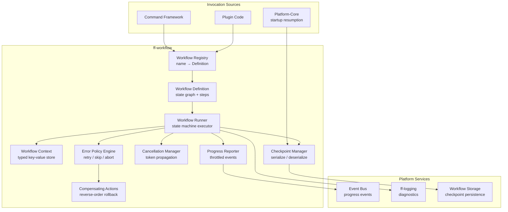

# Design Document: Workflow Engine (`ff-workflow`)

## 1. Overview

The `ff-workflow` crate is the **state-machine-based execution engine** for multi-step operations in the FileForgeWorkbench platform. It provides a declarative framework for defining, executing, and managing long-running operations with built-in support for progress reporting, cooperative cancellation, error recovery, and optional persistence.

### Purpose

- Define workflows as directed graphs of typed steps with explicit state transitions
- Execute workflows asynchronously on the Tokio runtime with shared context passing
- Report real-time progress through the platform-core Event Bus
- Support cooperative cancellation with compensating actions (rollback)
- Provide configurable error policies: fail-fast, continue-on-error, retry
- Persist workflow checkpoints for resumption after application restart
- Maintain a central registry for workflow discovery by command framework and plugins

### Position in Architecture

```
Wave 2 — Platform Architecture (depends on Wave 0 ff-logging)

┌─────────────────────────────────────────────────────────┐
│                    Application Binary (ffwb)              │
│              (ff-desktop / GUI shell)                     │
├─────────────────────────────────────────────────────────┤
│  ff-core │ ff-command │ ff-plugin │ ff-config            │
│  layout-and-docking │ all feature crates                 │
├─────────────────────────────────────────────────────────┤
│               ff-workflow (this crate)                    │
│        Workflow definitions, runner, registry             │
├─────────────────────────────────────────────────────────┤
│               ff-logging (Wave 0 — diagnostics)          │
└─────────────────────────────────────────────────────────┘
```

### Design Constraints (Cross-Cutting)

- **GUI Independence (Req 2)**: Zero GUI dependencies — progress events flow via Event Bus
- **Plugin Architecture (Req 3)**: Plugins register custom workflows via `PluginContext`
- **Command-Driven (Req 4)**: Workflows are invocable through the command framework
- **Async I/O (Req 6)**: All step execution is Tokio-based; never blocks the GUI thread
- **Multi-Crate Workspace (Req 7)**: Crate at `crates/ff-workflow`
- **Error Message Standards (Req 8)**: Errors follow `[workflow] operation: description` format

---

## 2. Architecture

### High-Level Architecture Diagram



### Layer Placement

| Layer | Role |
|-------|------|
| **Definition Layer** | `WorkflowDefinition`, `StepDefinition`, builder API — declarative graph structure |
| **Registry Layer** | `WorkflowRegistry` — thread-safe lookup, category queries, plugin ownership |
| **Execution Layer** | `WorkflowRunner` — drives state machine, invokes steps, manages transitions |
| **Context Layer** | `WorkflowContext` — typed key-value store shared across steps |
| **Progress Layer** | `ProgressReporter` — throttled event emission, aggregation |
| **Cancellation Layer** | `CancellationToken` — cooperative signal propagation to async operations |
| **Error Layer** | `ErrorPolicy` engine, retry logic, compensating actions |
| **Persistence Layer** | `CheckpointManager` — serialization, storage, resumption |

---

## 3. Module Structure

```
crates/ff-workflow/
├── Cargo.toml
├── src/
│   ├── lib.rs              # Public API re-exports, crate docs
│   ├── definition/
│   │   ├── mod.rs          # Re-exports for definition module
│   │   ├── workflow.rs     # WorkflowDefinition struct, validation
│   │   ├── step.rs         # StepDefinition, StepKind (sync/async)
│   │   ├── transition.rs   # Transition, Predicate, ConditionalBranch
│   │   ├── builder.rs      # WorkflowBuilder fluent API
│   │   └── validation.rs   # Graph validation: reachability, terminal states
│   ├── context.rs          # WorkflowContext typed key-value store
│   ├── runner/
│   │   ├── mod.rs          # Re-exports for runner module
│   │   ├── engine.rs       # WorkflowRunner execution loop
│   │   ├── state.rs        # WorkflowState, StepStatus, execution tracking
│   │   └── parallel.rs     # Parallel step group execution, join barrier
│   ├── progress/
│   │   ├── mod.rs          # Re-exports for progress module
│   │   ├── reporter.rs     # ProgressReporter handle for steps
│   │   ├── event.rs        # ProgressEvent struct, aggregation logic
│   │   └── throttle.rs     # Throttle logic (100ms per workflow instance)
│   ├── cancellation.rs     # CancellationToken, propagation, timeout
│   ├── error_policy/
│   │   ├── mod.rs          # Re-exports for error_policy module
│   │   ├── policy.rs       # ErrorPolicy enum, per-step overrides
│   │   ├── retry.rs        # Retry logic, backoff, max attempts
│   │   └── compensate.rs   # CompensatingAction trait, rollback orchestration
│   ├── registry.rs         # WorkflowRegistry: registration, query, thread-safety
│   ├── checkpoint/
│   │   ├── mod.rs          # Re-exports for checkpoint module
│   │   ├── manager.rs      # CheckpointManager: save, load, cleanup
│   │   ├── storage.rs      # Storage backend abstraction
│   │   └── serialization.rs # Serde-based serialization of workflow state
│   ├── error.rs            # WorkflowError enum
│   └── builtin.rs          # Built-in workflow definitions (data-transfer, etc.)
└── tests/
    ├── definition_tests.rs     # Definition validation property tests
    ├── context_tests.rs        # Context type-safety property tests
    ├── runner_tests.rs         # Runner execution property tests
    ├── progress_tests.rs       # Progress aggregation property tests
    ├── cancellation_tests.rs   # Cancellation propagation tests
    ├── error_policy_tests.rs   # Error policy property tests
    ├── registry_tests.rs       # Registry thread-safety property tests
    ├── checkpoint_tests.rs     # Checkpoint serialization property tests
    └── integration.rs          # End-to-end workflow execution tests
```

---

## 4. Key Data Models and Types

### WorkflowDefinition

```rust
/// A declarative description of a workflow's structure: states, transitions,
/// steps, error policy, and cancellation behaviour.
/// Addresses: Requirement 1, criteria 1/4/6
#[derive(Debug, Clone)]
pub struct WorkflowDefinition {
    /// Unique workflow name (used as registry key)
    pub name: String,
    /// Human-readable display name
    pub display_name: String,
    /// Description of what the workflow does
    pub description: String,
    /// Category tags for registry queries (e.g., "file-operation", "data-transfer")
    pub categories: Vec<String>,
    /// The ordered set of step definitions forming the state graph
    pub steps: Vec<StepDefinition>,
    /// Transitions between steps (directed edges in the state graph)
    pub transitions: Vec<Transition>,
    /// The name of the initial step (exactly one required)
    pub initial_step: String,
    /// The names of terminal steps (at least one required)
    pub terminal_steps: Vec<String>,
    /// Input parameters this workflow requires
    pub parameters: Vec<ParameterDeclaration>,
    /// Default error policy for all steps
    pub error_policy: ErrorPolicy,
    /// Whether this workflow supports persistence/checkpoint
    pub supports_persistence: bool,
    /// Whether this workflow supports cancellation
    pub supports_cancellation: bool,
    /// Whether this workflow supports pause/resume
    pub supports_pause: bool,
}
```

### StepDefinition

```rust
/// A single step within a workflow definition.
/// Addresses: Requirement 1, criteria 1/2/5
#[derive(Debug, Clone)]
pub struct StepDefinition {
    /// Unique name within this workflow
    pub name: String,
    /// Human-readable display name (for progress reporting)
    pub display_name: String,
    /// The kind of step execution
    pub kind: StepKind,
    /// Expected input keys from the WorkflowContext (for validation)
    pub expected_inputs: Vec<ContextKeyDeclaration>,
    /// Output keys this step will write to the WorkflowContext
    pub declared_outputs: Vec<ContextKeyDeclaration>,
    /// Per-step error policy override (takes precedence over workflow default)
    pub error_policy_override: Option<ErrorPolicy>,
    /// Optional compensating action for rollback
    pub compensating_action: Option<CompensatingActionDef>,
    /// Cancellation timeout for this step (default: 5 seconds)
    pub cancellation_timeout: std::time::Duration,
}

/// The execution mode of a step.
/// Addresses: Requirement 1, criterion 2
#[derive(Debug, Clone)]
pub enum StepKind {
    /// A single sequential step (sync or async)
    Sequential,
    /// A group of steps that execute concurrently with a join barrier
    Parallel { member_steps: Vec<String> },
    /// A conditional branch point — not executed, only routes transitions
    Conditional,
}
```

### Transition

```rust
/// A directed edge between steps in the workflow graph.
/// Addresses: Requirement 1, criteria 1/2
#[derive(Debug, Clone)]
pub struct Transition {
    /// Source step name
    pub from: String,
    /// Target step name
    pub to: String,
    /// Condition for this transition (None = unconditional / default)
    pub predicate: Option<TransitionPredicate>,
    /// Priority for ordering when multiple predicates are evaluated
    pub priority: u32,
}

/// A predicate evaluated against the WorkflowContext to determine
/// which conditional branch to follow.
/// Addresses: Requirement 2, criterion 5
#[derive(Debug, Clone)]
pub enum TransitionPredicate {
    /// Context key equals a specific value
    Equals { key: String, value: ContextValue },
    /// Context key exists and is truthy
    IsTrue { key: String },
    /// Context key does not exist or is falsy
    IsFalse { key: String },
    /// Custom predicate (evaluated at runtime via trait object)
    Custom { description: String },
}
```

### ParameterDeclaration

```rust
/// Declares an input parameter for a workflow.
/// Addresses: Requirement 1, criterion 6
#[derive(Debug, Clone)]
pub struct ParameterDeclaration {
    /// Parameter name
    pub name: String,
    /// Expected type (for validation at invocation time)
    pub value_type: ContextValueType,
    /// Whether this parameter is required
    pub required: bool,
    /// Optional default value
    pub default: Option<ContextValue>,
    /// Human-readable description (for UI and help)
    pub description: String,
}
```

### ContextKeyDeclaration

```rust
/// Declares a key expected or produced by a step in the WorkflowContext.
/// Enables compile-time-like validation at definition time.
/// Addresses: Requirement 1, criterion 5
#[derive(Debug, Clone)]
pub struct ContextKeyDeclaration {
    /// The key name
    pub key: String,
    /// The expected value type
    pub value_type: ContextValueType,
    /// Human-readable description
    pub description: String,
}

/// Supported value types in the WorkflowContext.
/// Addresses: Requirement 7, criterion 8 (serialization requirement)
#[derive(Debug, Clone, PartialEq, Eq)]
#[non_exhaustive]
pub enum ContextValueType {
    String,
    Integer,
    Float,
    Boolean,
    Bytes,
    StringList,
    Map,
    /// Opaque serializable type identified by name
    Custom(String),
}
```

### WorkflowContext

```rust
/// A typed key-value store carrying state between workflow steps.
/// Values are stored as serializable `ContextValue` instances.
/// Addresses: Requirement 2, criterion 2; Requirement 7, criterion 8
#[derive(Debug, Clone, serde::Serialize, serde::Deserialize)]
pub struct WorkflowContext {
    /// The key-value store
    values: HashMap<String, ContextValue>,
}

/// A value stored in the WorkflowContext. All variants are serializable.
/// Addresses: Requirement 7, criterion 8
#[derive(Debug, Clone, PartialEq, serde::Serialize, serde::Deserialize)]
#[non_exhaustive]
pub enum ContextValue {
    String(String),
    Integer(i64),
    Float(f64),
    Boolean(bool),
    Bytes(Vec<u8>),
    StringList(Vec<String>),
    Map(HashMap<String, ContextValue>),
    Null,
}
```

### WorkflowState

```rust
/// The runtime execution state of a workflow instance.
/// Addresses: Requirement 2, criteria 1/8
#[derive(Debug, Clone, serde::Serialize, serde::Deserialize)]
pub struct WorkflowState {
    /// Unique execution ID for this workflow run
    pub execution_id: WorkflowExecutionId,
    /// Name of the workflow definition being executed
    pub workflow_name: String,
    /// Current lifecycle phase
    pub phase: WorkflowPhase,
    /// The current step being executed (or last completed)
    pub current_step: String,
    /// Status of each step
    pub step_statuses: HashMap<String, StepStatus>,
    /// The shared context
    pub context: WorkflowContext,
    /// Timestamp when execution started
    pub started_at: chrono::DateTime<chrono::Utc>,
    /// Elapsed time (excluding paused time)
    pub elapsed: std::time::Duration,
    /// Overall progress percentage (0.0–100.0)
    pub overall_progress: f64,
}

/// Unique identifier for a workflow execution instance.
#[derive(Debug, Clone, PartialEq, Eq, Hash, serde::Serialize, serde::Deserialize)]
pub struct WorkflowExecutionId(pub String);

/// The lifecycle phase of a running workflow.
/// Addresses: Requirement 2, criterion 8; Requirement 3, criterion 2
#[derive(Debug, Clone, Copy, PartialEq, Eq, serde::Serialize, serde::Deserialize)]
#[non_exhaustive]
pub enum WorkflowPhase {
    /// Workflow is actively executing steps
    Running,
    /// Workflow is paused (current step completed, not advancing)
    Paused,
    /// Workflow completed all steps successfully
    Completed,
    /// Workflow failed (error policy exhausted)
    Failed,
    /// Workflow was cancelled by user
    Cancelled,
    /// Workflow is executing compensating actions (rollback)
    RollingBack,
}
```

### StepStatus

```rust
/// The execution status of a single workflow step.
/// Addresses: Requirement 2, criterion 1; Requirement 5, criterion 1
#[derive(Debug, Clone, PartialEq, Eq, serde::Serialize, serde::Deserialize)]
#[non_exhaustive]
pub enum StepStatus {
    /// Step has not yet started
    Pending,
    /// Step is currently executing
    Running,
    /// Step completed successfully
    Completed,
    /// Step failed (error policy may allow continuation)
    Failed { error: String, retries_attempted: u32 },
    /// Step was skipped (continue-on-error policy)
    Skipped { reason: String },
    /// Step was cancelled
    Cancelled,
}
```

### ErrorPolicy

```rust
/// Determines how step failures are handled.
/// Addresses: Requirement 5, criteria 1/2
#[derive(Debug, Clone, serde::Serialize, serde::Deserialize)]
pub struct ErrorPolicy {
    /// The primary failure strategy
    pub strategy: ErrorStrategy,
    /// Maximum retry count (only used with Retry strategy)
    pub max_retries: u32,
    /// Delay between retries
    pub retry_delay: std::time::Duration,
    /// Whether to allow user interaction for error decisions
    pub allow_user_interaction: bool,
}

/// The error handling strategy.
/// Addresses: Requirement 5, criterion 1
#[derive(Debug, Clone, Copy, PartialEq, Eq, serde::Serialize, serde::Deserialize)]
pub enum ErrorStrategy {
    /// Abort the workflow immediately on step failure
    FailFast,
    /// Skip the failed step and continue to the next
    ContinueOnError,
    /// Retry the step up to max_retries times, then fall back to FailFast
    Retry,
}
```

### CompensatingActionDef

```rust
/// Definition of a compensating action (rollback) for a step.
/// Addresses: Requirement 5, criteria 4/5
#[derive(Debug, Clone)]
pub struct CompensatingActionDef {
    /// Human-readable description of what this action undoes
    pub description: String,
    /// The compensating action identifier (resolved at runtime)
    pub action_id: String,
}
```

### ProgressEvent

```rust
/// A structured event conveying workflow progress to the UI via the Event Bus.
/// Addresses: Requirement 4, criteria 1/2/3/5/8
#[derive(Debug, Clone)]
pub struct ProgressEvent {
    /// The workflow execution ID
    pub execution_id: WorkflowExecutionId,
    /// Workflow name
    pub workflow_name: String,
    /// Progress mode
    pub mode: ProgressMode,
    /// Current step name
    pub current_step_name: String,
    /// Current step index (0-based)
    pub current_step_index: usize,
    /// Total step count
    pub total_steps: usize,
    /// Overall workflow progress percentage (0.0–100.0)
    pub overall_percentage: f64,
    /// Current step progress percentage (0.0–100.0)
    pub step_percentage: f64,
    /// Status message describing current activity
    pub message: String,
    /// Items processed (for determinate progress)
    pub items_processed: Option<u64>,
    /// Total items (for determinate progress)
    pub items_total: Option<u64>,
    /// Estimated time remaining in seconds (if calculable)
    pub estimated_remaining_seconds: Option<f64>,
    /// Elapsed time since workflow start
    pub elapsed: std::time::Duration,
    /// Whether the workflow was resumed from a checkpoint
    pub resumed_from_checkpoint: bool,
}

/// Progress mode for a workflow or step.
/// Addresses: Requirement 4, criteria 1/3
#[derive(Debug, Clone, Copy, PartialEq, Eq)]
pub enum ProgressMode {
    /// Known total — percentage and item counts are meaningful
    Determinate,
    /// Unknown total — only status message is meaningful
    Indeterminate,
}
```

### CancellationToken

```rust
/// A cooperative cancellation signal propagated to all async operations
/// within a workflow. Wraps `tokio_util::sync::CancellationToken`.
/// Addresses: Requirement 3, criteria 1/4
#[derive(Debug, Clone)]
pub struct CancellationToken {
    inner: tokio_util::sync::CancellationToken,
}

impl CancellationToken {
    /// Create a new token (not cancelled).
    pub fn new() -> Self;

    /// Create a child token that is cancelled when the parent is cancelled.
    pub fn child(&self) -> Self;

    /// Request cancellation.
    pub fn cancel(&self);

    /// Check if cancellation has been requested.
    pub fn is_cancelled(&self) -> bool;

    /// Returns a future that completes when cancellation is requested.
    pub async fn cancelled(&self);
}
```

### WorkflowMetadata

```rust
/// Metadata exposed by the registry for UI consumption.
/// Addresses: Requirement 6, criterion 6
#[derive(Debug, Clone)]
pub struct WorkflowMetadata {
    /// Workflow name (registry key)
    pub name: String,
    /// Human-readable display name
    pub display_name: String,
    /// Description of what the workflow does
    pub description: String,
    /// Category tags
    pub categories: Vec<String>,
    /// Input parameters with types and descriptions
    pub parameters: Vec<ParameterDeclaration>,
    /// Whether the workflow supports cancellation
    pub supports_cancellation: bool,
    /// Whether the workflow supports pause/resume
    pub supports_pause: bool,
    /// Whether the workflow supports persistence
    pub supports_persistence: bool,
}
```

### Checkpoint

```rust
/// A serialized snapshot of a workflow's execution state for resumption.
/// Addresses: Requirement 7, criteria 1/2/3
#[derive(Debug, Clone, serde::Serialize, serde::Deserialize)]
pub struct Checkpoint {
    /// Unique execution ID
    pub execution_id: WorkflowExecutionId,
    /// Workflow name (for looking up the definition on resume)
    pub workflow_name: String,
    /// The full workflow state at checkpoint time
    pub state: WorkflowState,
    /// Timestamp when checkpoint was created
    pub created_at: chrono::DateTime<chrono::Utc>,
    /// Schema version (for detecting incompatible checkpoints)
    pub schema_version: u32,
}
```

---

## 5. Public API Surface

### WorkflowStep Trait

```rust
/// The execution trait for a workflow step. Implementors define the step's logic.
/// Addresses: Requirement 2, criteria 1/3/7
#[async_trait::async_trait]
pub trait WorkflowStep: Send + Sync {
    /// Execute the step. Reads from and writes to the workflow context.
    /// The progress reporter handle allows intermediate progress updates.
    /// The cancellation token should be checked periodically.
    ///
    /// Addresses: Requirement 2, criteria 2/3/7; Requirement 3, criterion 1
    async fn execute(
        &self,
        context: &mut WorkflowContext,
        progress: &ProgressReporter,
        cancel: &CancellationToken,
    ) -> Result<(), WorkflowError>;

    /// Human-readable name for diagnostics and progress reporting.
    fn name(&self) -> &str;
}

/// The trait for compensating (rollback) actions.
/// Addresses: Requirement 5, criteria 4/5/6
#[async_trait::async_trait]
pub trait CompensatingAction: Send + Sync {
    /// Execute the compensating action to undo a step's effects.
    /// Must not panic. If this fails, the error is logged and rollback continues.
    async fn compensate(
        &self,
        context: &WorkflowContext,
    ) -> Result<(), WorkflowError>;

    /// Human-readable description of what this action undoes.
    fn description(&self) -> &str;
}

/// A predicate function for conditional transitions.
/// Addresses: Requirement 2, criterion 5
pub trait TransitionPredicateFn: Send + Sync {
    /// Evaluate the predicate against the current context.
    /// Returns true if the transition should be taken.
    fn evaluate(&self, context: &WorkflowContext) -> bool;
}
```

### WorkflowBuilder

```rust
/// Fluent builder API for constructing workflow definitions.
/// Addresses: Requirement 1, criterion 4
pub struct WorkflowBuilder { /* ... */ }

impl WorkflowBuilder {
    /// Start building a new workflow with the given name.
    pub fn new(name: impl Into<String>) -> Self;

    /// Set the display name.
    pub fn display_name(self, name: impl Into<String>) -> Self;

    /// Set the description.
    pub fn description(self, desc: impl Into<String>) -> Self;

    /// Add a category tag.
    pub fn category(self, cat: impl Into<String>) -> Self;

    /// Add an input parameter declaration.
    /// Addresses: Requirement 1, criterion 6
    pub fn parameter(self, param: ParameterDeclaration) -> Self;

    /// Add a sequential step.
    pub fn step(self, step: StepDefinition) -> Self;

    /// Add a parallel step group.
    /// Addresses: Requirement 1, criterion 2
    pub fn parallel_group(self, name: impl Into<String>, members: Vec<String>) -> Self;

    /// Add a conditional branch point.
    /// Addresses: Requirement 1, criterion 2
    pub fn conditional(self, name: impl Into<String>) -> Self;

    /// Add a transition between steps.
    pub fn transition(self, transition: Transition) -> Self;

    /// Set the initial step.
    pub fn initial_step(self, name: impl Into<String>) -> Self;

    /// Mark a step as terminal (success).
    pub fn terminal_step(self, name: impl Into<String>) -> Self;

    /// Set the default error policy.
    pub fn error_policy(self, policy: ErrorPolicy) -> Self;

    /// Enable persistence support.
    /// Addresses: Requirement 7, criterion 1
    pub fn supports_persistence(self, enabled: bool) -> Self;

    /// Enable cancellation support.
    pub fn supports_cancellation(self, enabled: bool) -> Self;

    /// Enable pause/resume support.
    pub fn supports_pause(self, enabled: bool) -> Self;

    /// Validate and build the workflow definition.
    /// Returns an error if the definition is structurally invalid.
    /// Addresses: Requirement 1, criterion 3
    pub fn build(self) -> Result<WorkflowDefinition, WorkflowError>;
}
```

### WorkflowRunner

```rust
/// The execution engine that drives a workflow through its states.
/// Addresses: Requirement 2, all criteria; Requirement 3, all criteria
pub struct WorkflowRunner { /* ... */ }

impl WorkflowRunner {
    /// Create a new runner with platform service dependencies.
    pub fn new(
        event_bus: Arc<dyn WorkflowEventDispatcher>,
        checkpoint_manager: Option<Arc<CheckpointManager>>,
    ) -> Self;

    /// Start executing a workflow with the given definition, step implementations,
    /// and input parameters. Returns a handle for monitoring/controlling execution.
    ///
    /// Addresses: Requirement 2, criteria 1/2/3/6; Requirement 6, criterion 5
    pub async fn start(
        &self,
        definition: &WorkflowDefinition,
        steps: HashMap<String, Box<dyn WorkflowStep>>,
        params: WorkflowContext,
    ) -> Result<WorkflowHandle, WorkflowError>;

    /// Resume a workflow from a checkpoint.
    /// Addresses: Requirement 7, criterion 5
    pub async fn resume(
        &self,
        checkpoint: Checkpoint,
        definition: &WorkflowDefinition,
        steps: HashMap<String, Box<dyn WorkflowStep>>,
    ) -> Result<WorkflowHandle, WorkflowError>;
}
```

### WorkflowHandle

```rust
/// A handle to a running workflow for monitoring and control.
/// Addresses: Requirement 2, criterion 8; Requirement 3, criteria 1/2
pub struct WorkflowHandle {
    /// The execution ID
    execution_id: WorkflowExecutionId,
    /// Cancellation token for this workflow
    cancel_token: CancellationToken,
    /// Channel to receive completion notification
    completion_rx: tokio::sync::oneshot::Receiver<WorkflowResult>,
    /// Current state (shared, read-only from outside)
    state: Arc<tokio::sync::RwLock<WorkflowState>>,
}

impl WorkflowHandle {
    /// Get the execution ID.
    pub fn execution_id(&self) -> &WorkflowExecutionId;

    /// Request cancellation of this workflow.
    /// Addresses: Requirement 3, criteria 1/2
    pub fn cancel(&self);

    /// Request pause of this workflow.
    /// Addresses: Requirement 2, criterion 8
    pub fn pause(&self);

    /// Request resume of a paused workflow.
    /// Addresses: Requirement 2, criterion 8
    pub fn resume(&self);

    /// Await completion of the workflow. Returns the final result.
    pub async fn await_completion(self) -> WorkflowResult;

    /// Get a snapshot of the current workflow state.
    pub async fn current_state(&self) -> WorkflowState;
}

/// The final result of a workflow execution.
/// Addresses: Requirement 5, criterion 8
#[derive(Debug)]
pub enum WorkflowResult {
    /// Workflow completed all steps successfully
    Success {
        context: WorkflowContext,
        elapsed: std::time::Duration,
    },
    /// Workflow failed
    Failed {
        error_report: WorkflowErrorReport,
        elapsed: std::time::Duration,
    },
    /// Workflow was cancelled
    Cancelled {
        active_step: String,
        rollback_status: RollbackStatus,
        elapsed: std::time::Duration,
    },
}

/// Status of the rollback/compensating actions.
/// Addresses: Requirement 5, criterion 6
#[derive(Debug, Clone, PartialEq, Eq)]
pub enum RollbackStatus {
    /// All compensating actions completed successfully
    Completed,
    /// Some compensating actions failed
    PartiallyCompleted { failures: Vec<String> },
    /// No compensating actions were defined
    NotApplicable,
}
```

### WorkflowRegistry

```rust
/// Central registry for workflow definitions. Thread-safe.
/// Addresses: Requirement 6, all criteria
pub struct WorkflowRegistry { /* ... */ }

impl WorkflowRegistry {
    /// Create a new empty registry.
    pub fn new() -> Self;

    /// Register a workflow definition. Returns error if name already exists.
    /// Addresses: Requirement 6, criterion 1
    pub fn register(
        &self,
        definition: WorkflowDefinition,
        owner: Option<String>,
    ) -> Result<(), WorkflowError>;

    /// Unregister a workflow by name. Returns true if removed.
    pub fn unregister(&self, name: &str) -> bool;

    /// Remove all workflows owned by a specific plugin.
    /// Addresses: Requirement 6, criterion 3
    pub fn unregister_by_owner(&self, owner: &str);

    /// Look up a workflow definition by exact name.
    /// Addresses: Requirement 6, criterion 4
    pub fn get(&self, name: &str) -> Option<WorkflowDefinition>;

    /// Query all workflows in a given category.
    /// Addresses: Requirement 6, criterion 4
    pub fn query_by_category(&self, category: &str) -> Vec<WorkflowDefinition>;

    /// Query workflows that accept a given input parameter type.
    /// Addresses: Requirement 6, criterion 4
    pub fn query_by_parameter_type(
        &self,
        param_type: ContextValueType,
    ) -> Vec<WorkflowDefinition>;

    /// Get metadata for a workflow (for UI display).
    /// Addresses: Requirement 6, criterion 6
    pub fn metadata(&self, name: &str) -> Option<WorkflowMetadata>;

    /// List all registered workflow names.
    pub fn list_all(&self) -> Vec<String>;

    /// Returns the total number of registered workflows.
    pub fn count(&self) -> usize;
}
```

### ProgressReporter

```rust
/// A handle provided to workflow steps for reporting intermediate progress.
/// Throttles emissions to at most once per 100ms per workflow instance.
/// Addresses: Requirement 4, criteria 1/2/3/6/7
pub struct ProgressReporter { /* ... */ }

impl ProgressReporter {
    /// Report determinate progress with item counts.
    /// Addresses: Requirement 4, criterion 2
    pub fn report_progress(
        &self,
        items_processed: u64,
        items_total: u64,
        message: impl Into<String>,
    );

    /// Report indeterminate progress (spinning indicator).
    /// Addresses: Requirement 4, criterion 3
    pub fn report_indeterminate(&self, message: impl Into<String>);

    /// Report progress with explicit percentage.
    pub fn report_percentage(&self, percentage: f64, message: impl Into<String>);

    /// Report estimated time remaining.
    /// Addresses: Requirement 4, criterion 7
    pub fn report_eta(&self, remaining_seconds: f64);
}
```

### CheckpointManager

```rust
/// Manages workflow checkpoint persistence: save, load, cleanup.
/// Addresses: Requirement 7, criteria 2/3/4/6/7
pub struct CheckpointManager { /* ... */ }

impl CheckpointManager {
    /// Create a new checkpoint manager with the given storage directory.
    pub fn new(storage_directory: std::path::PathBuf) -> Self;

    /// Save a workflow checkpoint to storage.
    /// Addresses: Requirement 7, criterion 2
    pub async fn save_checkpoint(
        &self,
        checkpoint: &Checkpoint,
    ) -> Result<(), WorkflowError>;

    /// Load a checkpoint by execution ID.
    /// Addresses: Requirement 7, criterion 5
    pub async fn load_checkpoint(
        &self,
        execution_id: &WorkflowExecutionId,
    ) -> Result<Option<Checkpoint>, WorkflowError>;

    /// Scan for all incomplete (resumable) checkpoints.
    /// Addresses: Requirement 7, criterion 4
    pub async fn scan_resumable(&self) -> Result<Vec<Checkpoint>, WorkflowError>;

    /// Remove a checkpoint (after successful completion).
    /// Addresses: Requirement 7, criterion 7
    pub async fn remove_checkpoint(
        &self,
        execution_id: &WorkflowExecutionId,
    ) -> Result<(), WorkflowError>;

    /// Clean up expired checkpoints older than retention period.
    /// Addresses: Requirement 7, criterion 7
    pub async fn cleanup_expired(
        &self,
        retention_days: u32,
    ) -> Result<u32, WorkflowError>;
}
```

### WorkflowContext API

```rust
impl WorkflowContext {
    /// Create a new empty context.
    pub fn new() -> Self;

    /// Insert a value into the context.
    pub fn set(&mut self, key: impl Into<String>, value: ContextValue);

    /// Get a value by key.
    pub fn get(&self, key: &str) -> Option<&ContextValue>;

    /// Get a string value by key.
    pub fn get_string(&self, key: &str) -> Option<&str>;

    /// Get an integer value by key.
    pub fn get_integer(&self, key: &str) -> Option<i64>;

    /// Get a boolean value by key.
    pub fn get_bool(&self, key: &str) -> Option<bool>;

    /// Check if a key exists.
    pub fn contains_key(&self, key: &str) -> bool;

    /// Remove a key and return its value.
    pub fn remove(&mut self, key: &str) -> Option<ContextValue>;

    /// List all keys in the context.
    pub fn keys(&self) -> Vec<&str>;

    /// Merge another context into this one (other's values overwrite on conflict).
    pub fn merge(&mut self, other: WorkflowContext);
}
```

### WorkflowEventDispatcher Trait

```rust
/// Trait abstracting the event bus interface for workflow progress events.
/// Implemented by platform-core to bridge to the Event Bus.
/// Addresses: Requirement 4, criterion 5
pub trait WorkflowEventDispatcher: Send + Sync {
    /// Dispatch a progress event.
    fn dispatch_progress(&self, event: ProgressEvent);

    /// Dispatch a workflow error event (for user interaction).
    /// Addresses: Requirement 5, criterion 7
    fn dispatch_error(
        &self,
        execution_id: &WorkflowExecutionId,
        error: &WorkflowError,
        options: Vec<UserErrorAction>,
    );

    /// Await user's response to an error dialog.
    /// Returns the chosen action.
    fn await_user_response(
        &self,
        execution_id: &WorkflowExecutionId,
    ) -> impl std::future::Future<Output = UserErrorAction> + Send;
}

/// Actions a user can take in response to a workflow error.
/// Addresses: Requirement 5, criterion 7
#[derive(Debug, Clone, Copy, PartialEq, Eq)]
pub enum UserErrorAction {
    /// Retry the failed step
    Retry,
    /// Skip the failed step and continue
    Skip,
    /// Abort the workflow
    Abort,
}
```

---

## 6. Error Types

```rust
/// Errors produced by the workflow engine.
/// Addresses: Cross-cutting Requirement 8 (error format: "[workflow] operation: description")
#[derive(Debug, thiserror::Error)]
#[non_exhaustive]
pub enum WorkflowError {
    /// Workflow definition validation failed
    /// Addresses: Requirement 1, criterion 3
    #[error("[workflow] definition: {description}")]
    InvalidDefinition { description: String },

    /// No initial state defined in workflow
    #[error("[workflow] definition: workflow '{name}' has no initial state")]
    NoInitialState { name: String },

    /// Unreachable states detected in workflow graph
    #[error("[workflow] definition: workflow '{name}' has unreachable states: {states:?}")]
    UnreachableStates { name: String, states: Vec<String> },

    /// No terminal states defined
    #[error("[workflow] definition: workflow '{name}' has no terminal states")]
    NoTerminalStates { name: String },

    /// Type incompatibility between connected steps
    /// Addresses: Requirement 1, criterion 5
    #[error("[workflow] definition: type mismatch between step '{from}' output and step '{to}' input for key '{key}'")]
    TypeMismatch { from: String, to: String, key: String },

    /// Duplicate workflow name in registry
    /// Addresses: Requirement 6, criterion 1
    #[error("[workflow] registry: workflow '{name}' is already registered")]
    DuplicateName { name: String },

    /// Workflow not found in registry
    #[error("[workflow] registry: workflow '{name}' not found")]
    NotFound { name: String },

    /// Required parameter missing at invocation time
    /// Addresses: Requirement 1, criterion 6
    #[error("[workflow] start: required parameter '{param}' not supplied for workflow '{workflow}'")]
    MissingParameter { workflow: String, param: String },

    /// Step execution failed
    /// Addresses: Requirement 5, criterion 1
    #[error("[workflow] step '{step}' failed: {description}")]
    StepFailed { step: String, description: String },

    /// Step timed out during cancellation
    /// Addresses: Requirement 3, criterion 5
    #[error("[workflow] step '{step}' did not respond to cancellation within {timeout_seconds}s")]
    CancellationTimeout { step: String, timeout_seconds: u64 },

    /// Compensating action failed during rollback
    /// Addresses: Requirement 5, criterion 6
    #[error("[workflow] compensate: rollback action for step '{step}' failed: {description}")]
    CompensationFailed { step: String, description: String },

    /// Checkpoint serialization/deserialization failed
    /// Addresses: Requirement 7, criterion 6
    #[error("[workflow] checkpoint: {operation} failed for execution '{execution_id}': {description}")]
    CheckpointError {
        operation: String,
        execution_id: String,
        description: String,
    },

    /// Checkpoint schema version mismatch
    #[error("[workflow] checkpoint: incompatible schema version {found} (expected {expected}) for execution '{execution_id}'")]
    CheckpointSchemaMismatch {
        execution_id: String,
        expected: u32,
        found: u32,
    },

    /// No matching transition predicate (and no default)
    /// Addresses: Requirement 2, criterion 5
    #[error("[workflow] transition: no matching predicate at step '{step}' and no default transition defined")]
    NoMatchingTransition { step: String },

    /// Workflow does not support the requested operation
    #[error("[workflow] operation: workflow '{name}' does not support {operation}")]
    UnsupportedOperation { name: String, operation: String },

    /// Context key not found when expected by a step
    #[error("[workflow] context: key '{key}' not found (expected by step '{step}')")]
    ContextKeyMissing { key: String, step: String },

    /// I/O error during checkpoint storage
    #[error("[workflow] io: {0}")]
    Io(#[from] std::io::Error),

    /// Serialization error
    #[error("[workflow] serialization: {0}")]
    Serialization(String),
}
```

### WorkflowErrorReport

```rust
/// Comprehensive error report for a failed or partially-failed workflow.
/// Addresses: Requirement 5, criteria 8/9
#[derive(Debug, Clone)]
pub struct WorkflowErrorReport {
    /// Workflow name
    pub workflow_name: String,
    /// The step that caused the failure
    pub failed_step: String,
    /// Error description with full context chain
    pub error_description: String,
    /// Steps that completed successfully before failure
    pub completed_steps: Vec<String>,
    /// Steps that were skipped (continue-on-error)
    pub skipped_steps: Vec<String>,
    /// Steps that were not executed
    pub pending_steps: Vec<String>,
    /// Rollback status
    pub rollback_status: RollbackStatus,
    /// Compensating action failures (if any)
    pub compensation_failures: Vec<String>,
    /// Relevant context values at time of failure
    pub context_snapshot: HashMap<String, String>,
    /// Total elapsed time
    pub elapsed: std::time::Duration,
}
```

---

## 7. Integration Points

### With `ff-logging` (upstream — Wave 0)

- `ff-workflow` depends on `ff-logging` for diagnostic output
- Uses `log_info!` for workflow start/complete/resume events
- Uses `log_warn!` for retry attempts and checkpoint cleanup failures
- Uses `log_error!` for step failures, compensation failures, and checkpoint deserialization errors
- All log records prefixed with workflow name and execution ID for traceability

### With `ff-core` (platform-core — same wave, orchestrator)

- `ff-core` creates the `WorkflowRegistry` and `WorkflowRunner` during startup
- `ff-core` registers them in the `ServiceRegistry` for other subsystems to access
- `ff-core` implements `WorkflowEventDispatcher` to bridge progress events to the Event Bus
- `ff-core` calls `CheckpointManager::scan_resumable()` at startup to detect resumable workflows
- `ff-core` triggers `CheckpointManager::save_checkpoint()` during graceful shutdown for running persistent workflows
- Dependency direction: `ff-core` depends on `ff-workflow`; `ff-workflow` does NOT depend on `ff-core`

### With `ff-command` (command-framework — same wave, invocation path)

- The command framework invokes workflows by name through the registry
- A generic `workflow.run` async command handler looks up the workflow in the registry, validates parameters against the declared schema, and calls `WorkflowRunner::start()`
- Addresses: Requirement 6, criterion 5
- Dependency direction: `ff-command` depends on `ff-workflow` for the `WorkflowRegistry` lookup

### With `ff-plugin` (plugin-architecture — same wave, extensibility)

- Plugins register custom `WorkflowDefinition` instances via `PluginContext`
- The `PluginContext` provides a `WorkflowRegistration` service trait for plugins to call
- When a plugin is unloaded, `WorkflowRegistry::unregister_by_owner(plugin_name)` removes its workflows
- Addresses: Requirement 6, criterion 3
- Dependency direction: `ff-plugin` defines the `WorkflowRegistration` trait; `ff-workflow` implements it

### With `ff-config` (configuration-system — same wave, storage directory)

- `ff-config` provides the `workflow.storage_directory` configuration value
- `ff-config` provides `workflow.checkpoint_retention_days` (default 7)
- `ff-workflow` reads these values during initialization

### With downstream crates (consumers)

- `document-model`, `file-operations`, `compare-and-merge`, and other crates implement `WorkflowStep` trait for their domain-specific operations
- Built-in workflows (data-transfer, import/export, compare-merge, bulk-rename) are registered during startup
- Addresses: Requirement 1, criterion 7

### Dependency Direction Summary

```
ff-logging ← ff-workflow ← ff-core (orchestration)
                         ← ff-command (invocation)
                         ← ff-plugin (registration trait)
                         ← downstream feature crates (step implementations)
```

---

## 8. Configuration

All configuration lives under the `[workflow]` namespace in the workbench TOML config file.

### TOML Schema

```toml
[workflow]
# Directory for storing workflow checkpoints.
# Absolute or relative to working directory.
# Default (Windows): %LOCALAPPDATA%/FileForgeWorkbench/workflows
# Default (Linux/macOS): $XDG_DATA_HOME/file-forge-workbench/workflows
storage_directory = "workflows"

# Number of days to retain checkpoints for failed workflows before cleanup.
# Range: 1–365. Default: 7
checkpoint_retention_days = 7

# Default cancellation timeout per step in seconds.
# Range: 1–60. Default: 5
default_cancellation_timeout_seconds = 5

# Maximum concurrent workflow executions.
# Range: 1–32. Default: 4
max_concurrent_workflows = 4

# Progress event throttle interval in milliseconds.
# Range: 50–1000. Default: 100
progress_throttle_ms = 100

# Default maximum retry count for retry error policy.
# Range: 1–10. Default: 3
default_max_retries = 3

# Default retry delay in milliseconds.
# Range: 100–30000. Default: 1000
default_retry_delay_ms = 1000
```

### Config Resolution Rules

| Setting | Absent | Invalid Value | Out of Range |
|---------|--------|---------------|--------------|
| `storage_directory` | Platform default | Platform default + WARN | N/A |
| `checkpoint_retention_days` | Default to 7 | Default to 7 + WARN | Clamp to [1–365] + WARN |
| `default_cancellation_timeout_seconds` | Default to 5 | Default to 5 + WARN | Clamp to [1–60] + WARN |
| `max_concurrent_workflows` | Default to 4 | Default to 4 + WARN | Clamp to [1–32] + WARN |
| `progress_throttle_ms` | Default to 100 | Default to 100 + WARN | Clamp to [50–1000] + WARN |
| `default_max_retries` | Default to 3 | Default to 3 + WARN | Clamp to [1–10] + WARN |
| `default_retry_delay_ms` | Default to 1000 | Default to 1000 + WARN | Clamp to [100–30000] + WARN |

---

## 9. Concurrency Model

### Thread Contexts

| Thread Context | Owner | Responsibility |
|----------------|-------|---------------|
| **Tokio runtime** | ff-core | All workflow step execution happens on Tokio worker threads |
| **Runner task** | ff-workflow | One Tokio task per active workflow drives the state machine |
| **Step tasks** | ff-workflow | Each async step is spawned as a child task with cancellation token |
| **Parallel group** | ff-workflow | Parallel steps are spawned concurrently, joined before advancing |

### Communication Channels

| Channel | Type | Direction | Purpose |
|---------|------|-----------|---------|
| Progress dispatch | `WorkflowEventDispatcher` trait | Runner → Event Bus | Throttled progress events |
| Cancellation | `CancellationToken` | External → Runner → Steps | Cooperative cancel signal |
| Pause/Resume | `tokio::sync::watch` | External → Runner | Phase change signal |
| Completion | `tokio::sync::oneshot` | Runner → Handle holder | Final result delivery |
| User response | `tokio::sync::oneshot` | UI → Runner | Error dialog response |

### Async Execution Model

```
WorkflowRunner::start()
    │
    ├── Spawns a Tokio task for the workflow execution loop
    │   │
    │   ├── For each step (sequential):
    │   │   ├── Check cancellation token
    │   │   ├── Check pause signal (if paused, await resume)
    │   │   ├── Emit step-start ProgressEvent
    │   │   ├── Call step.execute(context, progress, cancel)
    │   │   ├── On success: store output in context, advance state
    │   │   ├── On failure: consult ErrorPolicy
    │   │   │   ├── Retry → re-execute with delay
    │   │   │   ├── Skip → mark skipped, advance
    │   │   │   └── Abort → run compensating actions, emit failure
    │   │   └── Emit step-complete ProgressEvent
    │   │
    │   ├── For parallel groups:
    │   │   ├── Spawn all member steps concurrently (JoinSet)
    │   │   ├── Await all completions (or first failure if FailFast)
    │   │   ├── Merge outputs into context
    │   │   └── Continue past join barrier
    │   │
    │   └── On reaching terminal state:
    │       ├── Emit final ProgressEvent
    │       ├── Remove checkpoint (if persistent + successful)
    │       └── Send result through oneshot channel
    │
    └── Returns WorkflowHandle immediately
```

### Cancellation Propagation

```
User clicks Cancel
    → WorkflowHandle::cancel()
        → CancellationToken::cancel() (top-level)
            → Runner detects cancellation between steps
            → If step is running:
                → Step's child CancellationToken is cancelled
                → Step's async I/O detects via select! { ... cancelled() => ... }
                → Step returns CancellationResult within timeout
                → If timeout exceeded: step force-cancelled
            → Runner executes compensating actions (reverse order)
            → Runner emits cancellation ProgressEvent
            → Result::Cancelled sent through completion channel
```

### Progress Throttling

- Each workflow instance maintains a `last_emission: Instant`
- When a step calls `progress.report_*()`, the reporter checks elapsed time
- If < 100ms since last emission, the update is coalesced (stored but not dispatched)
- If ≥ 100ms, the latest progress is dispatched through the Event Bus
- Step-start and step-complete events bypass throttling (always emitted immediately)
- Addresses: Requirement 4, criterion 6

### Concurrency Limits

- `max_concurrent_workflows` (default 4) limits how many workflows execute simultaneously
- The runner uses a `tokio::sync::Semaphore` to enforce this limit
- If the limit is reached, new workflow starts queue until a slot is available

---

## 10. Correctness Properties

These properties are suitable for property-based testing with `proptest`. They validate invariants that must hold across all valid inputs.

### Property 1: Definition Validation — Reachability

**Statement**: For any `WorkflowDefinition` constructed via the builder, if `build()` returns `Ok`, then every step in the definition is reachable from the initial state via the declared transitions.

**Validates**: Requirement 1, criterion 3

```rust
// proptest strategy: generate arbitrary step names, transitions, initial step
// assertion: build().is_ok() → all steps reachable from initial_step via BFS/DFS
```

### Property 2: Definition Validation — Terminal State Existence

**Statement**: For any `WorkflowDefinition` that passes validation, there exists at least one terminal state, and every non-terminal state has at least one outgoing transition.

**Validates**: Requirement 1, criterion 3

```rust
// proptest strategy: generate workflow graphs with varying terminal states
// assertion: build().is_ok() → terminal_steps.len() >= 1
//            ∧ ∀ step ∉ terminal_steps: outgoing_transitions(step).len() >= 1
```

### Property 3: Context Isolation Between Steps

**Statement**: For any sequence of steps, each step can only read values that were either initial parameters or written by a previously completed step. A step's writes are visible to subsequent steps but not to prior steps (no time travel).

**Validates**: Requirement 2, criterion 2

```rust
// proptest strategy: generate step execution sequences with read/write operations
// assertion: step[i].read(key) succeeds ⟺ key ∈ initial_params ∪ outputs(step[0..i])
```

### Property 4: Progress Aggregation Correctness

**Statement**: For any workflow with N steps where each step reports its own progress in [0.0, 100.0], the aggregated workflow progress equals `(completed_steps + current_step_fraction) / total_steps * 100` and is always in [0.0, 100.0].

**Validates**: Requirement 4, criterion 4

```rust
// proptest strategy: generate N in [1..50], step progresses in [0.0..100.0]
// assertion: aggregated ∈ [0.0, 100.0]
//            ∧ aggregated == (completed + fraction/100.0) / N * 100.0
```

### Property 5: Cancellation Preserves Completed Step Outputs

**Statement**: When a workflow is cancelled, all outputs written by steps that completed before cancellation are preserved in the final context (not rolled back), unless compensating actions explicitly remove them.

**Validates**: Requirement 3, criterion 2

```rust
// proptest strategy: generate step sequences, cancel at random point
// assertion: for each step completed before cancel point,
//            its outputs exist in final context (unless compensation removed them)
```

### Property 6: Compensating Actions Execute in Reverse Order

**Statement**: When a workflow is aborted or cancelled with rollback, compensating actions execute in the exact reverse order of step completion. No compensating action executes for a step that was not completed.

**Validates**: Requirement 3, criterion 3; Requirement 5, criterion 4

```rust
// proptest strategy: generate step completion order, trigger rollback at random point
// assertion: compensation order == reverse(completed_steps)
//            ∧ ∀ step not completed: no compensation executed
```

### Property 7: Error Policy Retry Bound

**Statement**: For any step with `ErrorPolicy::Retry` and `max_retries = N`, the step is executed at most `N + 1` times (1 initial attempt + N retries). If all attempts fail, the step is marked as permanently failed.

**Validates**: Requirement 5, criterion 3

```rust
// proptest strategy: generate max_retries in [0..10], step that always fails
// assertion: total_executions == max_retries + 1
//            ∧ final status == StepStatus::Failed
```

### Property 8: Registry Name Uniqueness

**Statement**: The `WorkflowRegistry` never contains two definitions with the same name. Any attempt to register a duplicate name returns an error without modifying existing entries.

**Validates**: Requirement 6, criterion 1

```rust
// proptest strategy: generate sequences of register/unregister operations with repeated names
// assertion: at any point, ∀ name: registry.count(name) ≤ 1
//            ∧ register(existing_name) returns Err
//            ∧ original definition unchanged after failed register
```

### Property 9: Checkpoint Round-Trip Fidelity

**Statement**: For any `WorkflowState` containing serializable context values, serializing to a checkpoint and deserializing produces a state equivalent to the original (modulo floating-point precision).

**Validates**: Requirement 7, criteria 2/5

```rust
// proptest strategy: generate arbitrary WorkflowState with valid context values
// assertion: deserialize(serialize(state)) ≈ state
//            (f64 compared with epsilon tolerance)
```

### Property 10: Progress Throttle Coalescing

**Statement**: For any sequence of progress reports within a single workflow step, the number of events actually dispatched to the Event Bus never exceeds `ceil(step_duration_ms / throttle_interval_ms) + 2` (the +2 accounts for the mandatory step-start and step-complete events).

**Validates**: Requirement 4, criterion 6

```rust
// proptest strategy: generate report timestamps and throttle_interval
// assertion: dispatched_count <= ceil(duration / interval) + 2
```

---

## Appendix A: External Crate Dependencies

| Crate | Version | Purpose |
|-------|---------|---------|
| `tokio` | 1.0 | Async runtime, channels, synchronization primitives |
| `tokio-util` | 0.7 | `CancellationToken` for cooperative cancellation |
| `async-trait` | 0.1 | Async trait method support |
| `serde` | 1.0 | Serialization/deserialization for checkpoints |
| `serde_json` | 1.0 | JSON checkpoint format |
| `chrono` | 0.4 | Timestamps for checkpoints, elapsed time |
| `thiserror` | 2.0 | Error type derivation |
| `uuid` | 1.0 | Unique execution IDs |
| `dirs` | 5.0 | Platform-appropriate default directories |
| `proptest` | 1.0 | Property-based testing (dev-dependency only) |

## Appendix B: Built-In Workflow Definitions

The following workflows are registered by default (Requirement 1, criterion 7):

| Workflow Name | Category | Description |
|---------------|----------|-------------|
| `data-transfer` | `file-operation` | Copy/move data between VFS locations with progress |
| `file-import` | `file-operation` | Import external file into workbench via VFS |
| `file-export` | `file-operation` | Export workbench content to external location |
| `compare-merge` | `refactoring` | Three-way compare and merge of document content |
| `bulk-rename` | `file-operation` | Rename multiple files/datasets according to a pattern |

Each built-in workflow supports cancellation and progress reporting. `data-transfer` and `bulk-rename` additionally support persistence (checkpoint/resume) due to potentially long execution times.

## Appendix C: Platform Default Directories

| Platform | Default Storage Path | Env Var |
|----------|---------------------|---------|
| Windows | `%LOCALAPPDATA%\FileForgeWorkbench\workflows` | `LOCALAPPDATA` |
| Linux | `$XDG_DATA_HOME/file-forge-workbench/workflows` | `XDG_DATA_HOME` (fallback: `~/.local/share`) |
| macOS | `$XDG_DATA_HOME/file-forge-workbench/workflows` | `XDG_DATA_HOME` (fallback: `~/.local/share`) |
